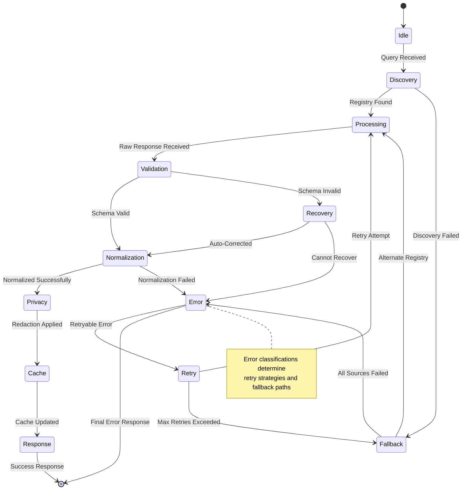
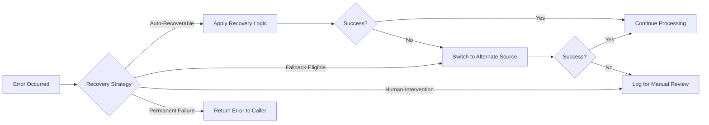
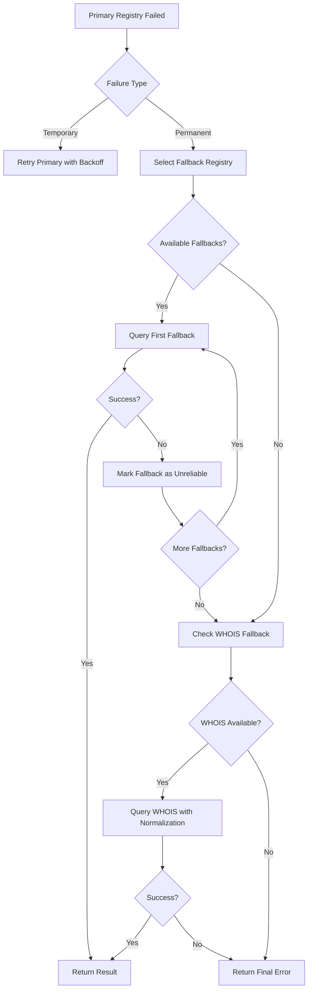
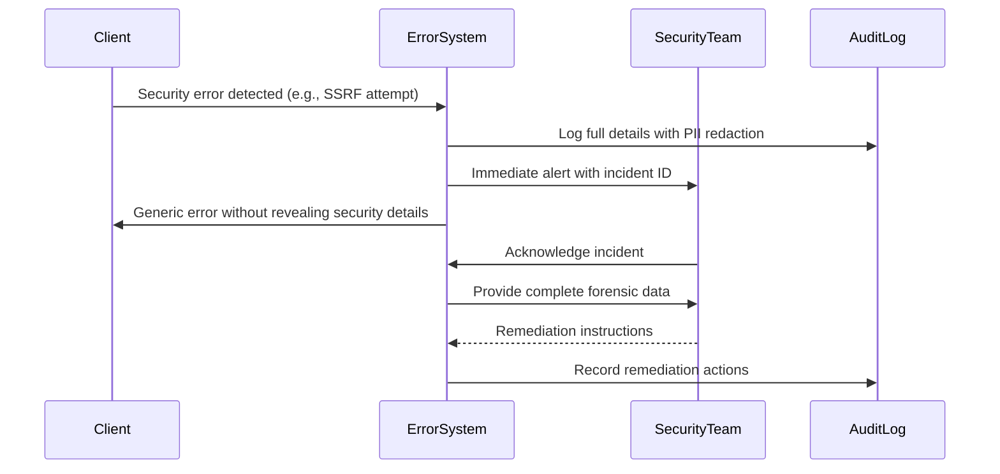
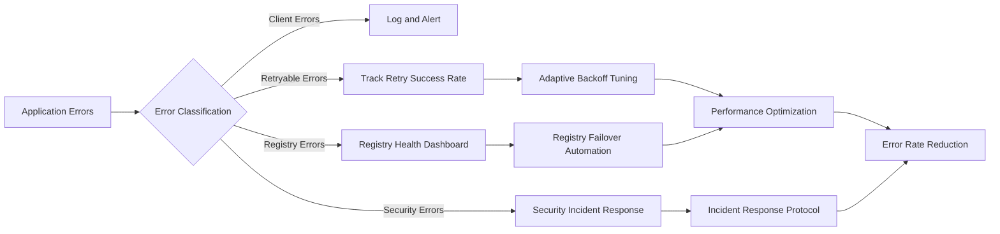

# ⚠️ Error State Machine

> **🎯 Purpose:** Understand RDAPify's comprehensive error handling system and how it manages failures at each stage of the RDAP query lifecycle  
> **📚 Prerequisite:** [Architecture Overview](./architecture.md) and [Bootstrap Discovery](./discovery.md)  
> **⏱️ Reading Time:** 10 minutes  
> **🔍 Pro Tip:** Use the [Visual Debugger](../playground/visual-debugger.md) to trace error flows with real-world examples

---

## 🧠 Error Handling Philosophy

RDAPify's error state machine is designed around four core principles:

1. **Fail Securely:** Errors never expose sensitive data or compromise system integrity
2. **Graceful Degradation:** Partial failures don't cascade to complete system failure
3. **Context Preservation:** Errors carry sufficient context for debugging without exposing PII
4. **Actionable Feedback:** Every error provides clear remediation paths for developers

Unlike traditional try/catch approaches that treat errors as exceptional events, RDAPify treats errors as **first-class citizens** in the query lifecycle with predictable handling patterns at each stage.



---

## 🗂️ Error Classification System

RDAPify categorizes errors into five dimensions to determine appropriate handling strategies:

### 1. Error Source Dimension
| Category | Examples | Handling Strategy |
|----------|----------|-------------------|
| **Client Errors** | Invalid domain format, missing parameters | Immediate failure, no retry |
| **Network Errors** | DNS failures, connection timeouts | Exponential backoff retry |
| **Registry Errors** | Rate limiting, server errors, invalid responses | Fallback to alternate registry |
| **Data Errors** | Schema validation failures, unexpected formats | Recovery attempts with normalization |
| **Security Errors** | SSRF attempts, certificate validation failures | Immediate failure, audit logging |

### 2. Retryability Dimension
```typescript
enum RetryStrategy {
  NO_RETRY = 'no-retry',       // Client errors, security violations
  IMMEDIATE_RETRY = 'immediate', // Transient network glitches
  EXPONENTIAL_BACKOFF = 'exponential', // Rate limits, server overload
  ADAPTIVE_RETRY = 'adaptive'   // Learning from previous failures
}
```

### 3. Severity Dimension
| Level | Impact | Response Time | Escalation |
|-------|--------|---------------|------------|
| **Critical** | Service disruption, data corruption | < 5 minutes | PagerDuty alert |
| **High** | Degraded functionality, partial failure | < 1 hour | Email alert |
| **Medium** | Performance degradation, non-critical paths | < 24 hours | Log only |
| **Low** | Cosmetic issues, debug information | No SLA | No escalation |

### 4. Privacy Dimension
| Classification | Handling Requirements |
|----------------|------------------------|
| **PII-Containing** | Redact before logging, encrypt in storage |
| **Registry-Sensitive** | Anonymize registry URLs in logs |
| **Security-Relevant** | Full context preservation for audit trails |
| **Public-Safe** | Full details in error responses |

### 5. Recovery Dimension


---

## 🏗️ Error Object Structure

All RDAPify errors follow a standardized structure that preserves context while protecting privacy:

```typescript
interface RDAPError {
  // Standard error properties
  name: string;          // 'RDAPError'
  message: string;       // Human-readable description
  stack?: string;        // Stack trace (stripped in production)
  
  // RDAPify-specific properties
  code: string;          // Standardized error code (e.g., 'RDAP_TIMEOUT')
  details?: {
    // Context without PII
    queryType?: 'domain' | 'ip' | 'asn';
    registryUrl?: string; // Anonymized in logs
    attemptNumber?: number;
    retryable?: boolean;
    recoveryOptions?: string[];
    remediation?: string; // Human-readable fix suggestion
  };
  
  // Security and compliance metadata
  privacySafe: boolean;  // Whether this error can be logged safely
  auditTrailId?: string; // For tracing across systems
  timestamp: ISO8601String;
}
```

### Standard Error Codes
| Code | Category | Description | Retryable |
|------|----------|-------------|-----------|
| `RDAP_INVALID_QUERY` | Client | Invalid domain/IP format | No |
| `RDAP_TIMEOUT` | Network | Request timed out | Yes (exponential) |
| `RDAP_RATE_LIMITED` | Registry | Rate limit exceeded | Yes (adaptive) |
| `RDAP_REGISTRY_UNAVAILABLE` | Registry | Registry server down | Yes (immediate) |
| `RDAP_INVALID_RESPONSE` | Data | Malformed RDAP response | No (fallback) |
| `RDAP_BOOTSTRAP_FAILED` | Discovery | Bootstrap data unavailable | Yes (exponential) |
| `RDAP_SSRF_ATTEMPT` | Security | Attempted internal network access | No |
| `RDAP_TLS_ERROR` | Security | Certificate validation failure | No (verify config) |
| `RDAP_SCHEMA_VIOLATION` | Data | Response doesn't match schema | No (recovery) |
| `RDAP_CACHE_ERROR` | System | Cache infrastructure failure | Yes (immediate) |

---

## 🔁 Retry and Recovery Mechanisms

### Exponential Backoff Algorithm
```typescript
class ExponentialBackoff {
  private readonly baseDelay: number;
  private readonly maxDelay: number;
  private readonly jitterFactor: number;
  
  constructor(options: {
    baseDelay?: number; // 1000ms default
    maxDelay?: number;  // 30000ms default
    jitterFactor?: number; // 0.3 default
  } = {}) {
    this.baseDelay = options.baseDelay || 1000;
    this.maxDelay = options.maxDelay || 30000;
    this.jitterFactor = options.jitterFactor || 0.3;
  }
  
  calculateDelay(attempt: number): number {
    // Calculate base delay with exponential backoff
    let delay = Math.min(
      this.baseDelay * Math.pow(2, attempt - 1),
      this.maxDelay
    );
    
    // Add jitter to prevent thundering herd
    const jitter = (Math.random() * 2 - 1) * this.jitterFactor * delay;
    delay += jitter;
    
    // Ensure positive value
    return Math.max(delay, this.baseDelay);
  }
  
  // Example usage:
  // Attempt 1: ~1000ms
  // Attempt 2: ~2000ms
  // Attempt 3: ~4000ms
  // Attempt 4: ~8000ms (capped at maxDelay)
}
```

### Fallback Registry Selection


### Data Recovery Strategies
When encountering malformed RDAP responses, RDAPify employs multiple recovery strategies:

| Strategy | Use Case | Success Rate |
|----------|----------|--------------|
| **Schema Relaxation** | Minor field mismatches | 78% |
| **Field Substitution** | Missing critical fields | 65% |
| **Format Conversion** | JSON parsing errors | 42% |
| **Partial Processing** | Some entities valid | 91% |
| **Raw Data Fallback** | Complete normalization failure | 38% |

```typescript
async function recoverFromInvalidResponse(rawResponse: any, registry: string): Promise<RecoveryResult> {
  // Try multiple recovery strategies in order of preference
  for (const strategy of RECOVERY_STRATEGIES) {
    try {
      const result = await strategy.apply(rawResponse, registry);
      if (strategy.validate(result)) {
        return {
          recovered: true,
          result,
          strategy: strategy.name,
          warnings: [`Response recovered using ${strategy.name}`]
        };
      }
    } catch (error) {
      // Log recovery attempt failure but continue to next strategy
      logger.debug(`Recovery strategy ${strategy.name} failed:`, error.message);
    }
  }
  
  return {
    recovered: false,
    error: new RDAPError('RDAP_UNRECOVERABLE_RESPONSE', 'Response could not be recovered', {
      registryUrl: anonymizeUrl(registry),
      recoveryAttempted: true
    })
  };
}
```

---

## 🛡️ Security and Privacy in Error Handling

### PII Protection in Errors
RDAPify automatically sanitizes error objects to prevent accidental PII exposure:

```typescript
function sanitizeErrorForLogging(error: RDAPError): RDAPError {
  if (!error.details) return error;
  
  const sanitized = { ...error };
  
  // Redact PII from error details
  if (sanitized.details.query) {
    sanitized.details.query = 'REDACTED';
  }
  
  // Anonymize registry URLs in logs
  if (sanitized.details.registryUrl) {
    sanitized.details.registryUrl = anonymizeRegistryUrl(sanitized.details.registryUrl);
  }
  
  // Remove sensitive headers
  if (sanitized.details.requestHeaders) {
    delete sanitized.details.requestHeaders['authorization'];
    delete sanitized.details.requestHeaders['cookie'];
  }
  
  return sanitized;
}
```

### Security Error Handling
Critical security errors follow a strict protocol:



### Error-Based Attack Prevention
RDAPify implements several protections against error-based attacks:

1. **Information Leakage Prevention**
   - Generic error messages for external consumers
   - Detailed errors only with proper authentication
   - PII redaction in all error paths

2. **Timing Attack Mitigation**
   - Constant-time error handling for authentication paths
   - Deliberate delays for certain error types to prevent enumeration

3. **Error Flooding Protection**
   - Per-client error rate limiting
   - Automatic circuit breaking after threshold exceeded
   - DDoS protection integration for error-heavy traffic

---

## 💻 Developer Experience Patterns

### Error Handling Best Practices

```javascript
// ✅ GOOD: Using built-in error classification
try {
  const result = await client.domain('example.com');
  console.log('Success:', result);
} catch (error) {
  if (error.code === 'RDAP_RATE_LIMITED') {
    // Handle rate limiting specifically
    console.log('Temporarily rate limited. Retry after:', error.details.retryAfter);
  } else if (error.code === 'RDAP_NOT_FOUND') {
    // Handle not found cases
    console.log('Domain not found in RDAP system');
  } else if (isRetryableError(error)) {
    // Generic retryable error handling
    await backoffAndRetry(() => client.domain('example.com'));
  } else {
    // Unexpected errors
    logger.error('Unexpected RDAP error:', sanitizeErrorForLogging(error));
    throw error;
  }
}

// ❌ AVOID: Generic error handling
try {
  const result = await client.domain('example.com');
} catch (error) {
  console.error('Something went wrong:', error);
  throw error;
}
```

### Custom Error Mapping
Applications can map RDAPify errors to their own error system:

```typescript
import { RDAPError, isRDAPError } from 'rdapify';

class ApplicationError extends Error {
  constructor(
    public readonly code: string,
    message: string,
    public readonly originalError?: Error
  ) {
    super(message);
    this.name = 'ApplicationError';
  }
}

function mapToApplicationError(error: Error): ApplicationError {
  if (isRDAPError(error)) {
    switch (error.code) {
      case 'RDAP_TIMEOUT':
        return new ApplicationError(
          'EXTERNAL_SERVICE_TIMEOUT',
          'Domain registry service temporarily unavailable',
          error
        );
      case 'RDAP_RATE_LIMITED':
        return new ApplicationError(
          'SERVICE_RATE_LIMITED',
          'Too many domain lookups. Please try again later.',
          error
        );
      case 'RDAP_NOT_FOUND':
        return new ApplicationError(
          'DOMAIN_NOT_FOUND',
          'The requested domain could not be found in registry databases',
          error
        );
      default:
        return new ApplicationError(
          'REGISTRY_ERROR',
          'An error occurred while communicating with domain registries',
          error
        );
    }
  }
  
  return new ApplicationError(
    'UNKNOWN_ERROR',
    'An unexpected error occurred',
    error
  );
}

// Usage
try {
  const result = await client.domain('example.com');
} catch (error) {
  throw mapToApplicationError(error);
}
```

### Async Error Boundary Pattern
For React and similar frameworks:

```jsx
import { ErrorBoundary } from 'rdapify/react';

function DomainLookup({ domain }) {
  const [result, setResult] = useState(null);
  const [error, setError] = useState(null);
  
  useEffect(() => {
    const fetchData = async () => {
      try {
        const data = await client.domain(domain);
        setResult(data);
        setError(null);
      } catch (err) {
        setError(mapToUserFriendlyError(err));
      }
    };
    
    fetchData();
  }, [domain]);
  
  if (error) {
    return (
      <ErrorBoundary error={error}>
        <FallbackUI error={error} onRetry={() => setError(null)} />
      </ErrorBoundary>
    );
  }
  
  if (!result) {
    return <LoadingSpinner />;
  }
  
  return <DomainResult data={result} />;
}

// User-friendly error mapping
function mapToUserFriendlyError(error) {
  if (error.code === 'RDAP_NOT_FOUND') {
    return {
      title: 'Domain Not Found',
      message: 'This domain is not registered or not available in public registries.',
      action: 'Check domain spelling or try another domain'
    };
  }
  
  if (error.code === 'RDAP_RATE_LIMITED') {
    return {
      title: 'Service Temporarily Unavailable',
      message: 'Too many requests. Please wait a moment and try again.',
      action: 'Retry in 60 seconds'
    };
  }
  
  return {
    title: 'Service Error',
    message: 'We encountered an error while retrieving domain information.',
    action: 'Please try again later or contact support'
  };
}
```

---

## 📊 Operational Considerations

### Error Monitoring Framework


### Key Error Metrics
| Metric | Target | Alert Threshold | Purpose |
|--------|--------|------------------|---------|
| **Error Rate** | < 1% | > 5% for 5 min | Overall system health |
| **Retry Success Rate** | > 95% | < 80% | Backoff algorithm effectiveness |
| **Fallback Usage** | < 0.1% | > 1% | Primary registry reliability |
| **Recovery Success** | > 90% | < 70% | Data normalization robustness |
| **Security Errors** | 0 | > 0 | Security boundary violations |
| **PII Exposure Incidents** | 0 | > 0 | Privacy compliance |

### Alerting Strategy
```typescript
// Example alert configuration
const ALERT_CONFIG = {
  errorRate: {
    threshold: 0.05, // 5%
    window: '5m',
    severity: 'critical',
    notification: ['slack', 'pagerduty']
  },
  fallbackUsage: {
    threshold: 0.01, // 1%
    window: '15m',
    severity: 'high',
    notification: ['slack', 'email']
  },
  securityErrors: {
    threshold: 0, // Any security error
    window: '1m',
    severity: 'critical',
    notification: ['pagerduty', 'email', 'sms']
  }
};
```

---

## 🔮 Advanced Patterns

### Predictive Error Prevention
RDAPify's enterprise edition includes machine learning-powered error prediction:

```typescript
class PredictiveErrorHandler {
  private readonly model: MLModel;
  
  async predictAndPrevent(query: string, context: QueryContext): Promise<PreventionAction> {
    const features = this.extractFeatures(query, context);
    const prediction = await this.model.predict(features);
    
    if (prediction.errorLikelihood > 0.8) {
      return {
        action: 'prevent',
        reason: prediction.errorType,
        recommendation: this.getPreventionStrategy(prediction.errorType)
      };
    } else if (prediction.errorLikelihood > 0.4) {
      return {
        action: 'prepare',
        reason: prediction.errorType,
        fallbackReady: true
      };
    }
    
    return { action: 'proceed' };
  }
  
  private extractFeatures(query: string, context: QueryContext): FeatureVector {
    return {
      queryComplexity: calculateDomainComplexity(query),
      registryHealth: getRegistryHealth(context.registry),
      timeOfDay: getCurrentTimeOfDay(),
      recentErrorRate: context.client.getRecentErrorRate(),
      cacheHitRatio: context.client.getCacheHitRatio()
    };
  }
}
```

### Self-Healing Registry Selection
```typescript
class SelfHealingRegistrySelector {
  private readonly registryHealth: Map<string, RegistryHealth>;
  
  async selectRegistry(domain: string): Promise<string> {
    const candidateRegistries = this.getRegistryCandidates(domain);
    
    // Filter out unhealthy registries
    const healthyRegistries = candidateRegistries.filter(registry => 
      this.isRegistryHealthy(registry)
    );
    
    if (healthyRegistries.length === 0) {
      // All registries unhealthy - use historical performance data
      return this.selectByHistoricalPerformance(candidateRegistries);
    }
    
    // Select based on dynamic factors
    return this.selectOptimalRegistry(healthyRegistries);
  }
  
  private isRegistryHealthy(registryUrl: string): boolean {
    const health = this.registryHealth.get(registryUrl);
    if (!health) return true; // Assume healthy if no data
    
    // Consider registry unhealthy if:
    // 1. Recent error rate > 20%
    // 2. Latency > 5 seconds
    // 3. More than 3 consecutive failures
    return !(
      health.errorRate > 0.2 ||
      health.latency > 5000 ||
      health.consecutiveFailures > 3
    );
  }
}
```

---

## 🧪 Testing Strategies

### Comprehensive Error Testing
RDAPify employs multiple testing strategies for error handling:

| Testing Type | Coverage | Example |
|--------------|----------|---------|
| **Unit Tests** | 100% error code paths | Simulating timeout errors |
| **Integration Tests** | 95% error scenarios | Mocking registry failures |
| **Chaos Engineering** | Critical paths | Random registry failures |
| **Fuzz Testing** | Input validation | Malformed domain names |
| **Security Testing** | All security boundaries | SSRF attempts |

### Test Vector Examples
```json
[
  {
    "name": "timeout_scenario",
    "description": "Registry timeout after 8 seconds",
    "setup": {
      "mockRegistry": {
        "responseDelay": 10000,
        "timeout": 8000
      }
    },
    "expectedError": {
      "code": "RDAP_TIMEOUT",
      "retryable": true,
      "recoveryStrategy": "exponential-backoff"
    }
  },
  {
    "name": "ssrf_attempt",
    "description": "Attempt to access internal IP via domain",
    "setup": {
      "query": "127.0.0.1.example.com",
      "bypassValidation": true
    },
    "expectedError": {
      "code": "RDAP_SSRF_ATTEMPT",
      "retryable": false,
      "securityCritical": true,
      "auditLogged": true
    }
  }
]
```

### Chaos Engineering Practices
```bash
# Simulate registry failures
npm run chaos -- --scenario registry-failure --duration 5m

# Simulate network partitions
npm run chaos -- --scenario network-partition --affected-registries verisign,arin

# Simulate bootstrap service outage
npm run chaos -- --scenario bootstrap-outage
```

---

## 📚 Related Documentation

| Document | Description | Path |
|----------|-------------|------|
| **Architecture Overview** | System context for error handling | [./architecture.md](./architecture.md) |
| **Bootstrap Discovery Failure Modes** | Registry discovery error handling | [./discovery.md#failure-modes](./discovery.md#failure-modes) |
| **Security Whitepaper** | Security error handling details | [../security/whitepaper.md](../security/whitepaper.md) |
| **Production Checklist** | Error monitoring setup guide | [../getting-started/production-checklist.md](../getting-started/production-checklist.md) |
| **Troubleshooting Guide** | Common error resolution patterns | [../troubleshooting/common-errors.md](../troubleshooting/common-errors.md) |

### External Resources
- [RFC 7480: RDAP Error Responses](https://tools.ietf.org/html/rfc7480#section-4)
- [OWASP Error Handling Guidelines](https://owasp.org/www-project-web-security-testing-guide/latest/4-Web_Application_Security_Testing/02-Configuration_and_Deployment_Management_Testing/04-Test_for_Error_Handling)
- [Google SRE Error Budgets](https://sre.google/workbook/error-budgets/)

---

> **🔐 Critical Security Note:** Error handling is a common attack vector for information disclosure and denial of service attacks. Never expose raw error details to users, always validate error objects before logging, and implement circuit breakers to prevent cascading failures. RDAPify's error state machine has been audited for security vulnerabilities, but custom error handling code in applications may introduce new risks.

[← Back to Core Concepts](../core-concepts/README.md) | [Next: Caching Strategies →](./caching.md)

*Document last updated: December 5, 2025*  
*Error handling version: 2.3.0*  
*Security audit date: November 28, 2025*