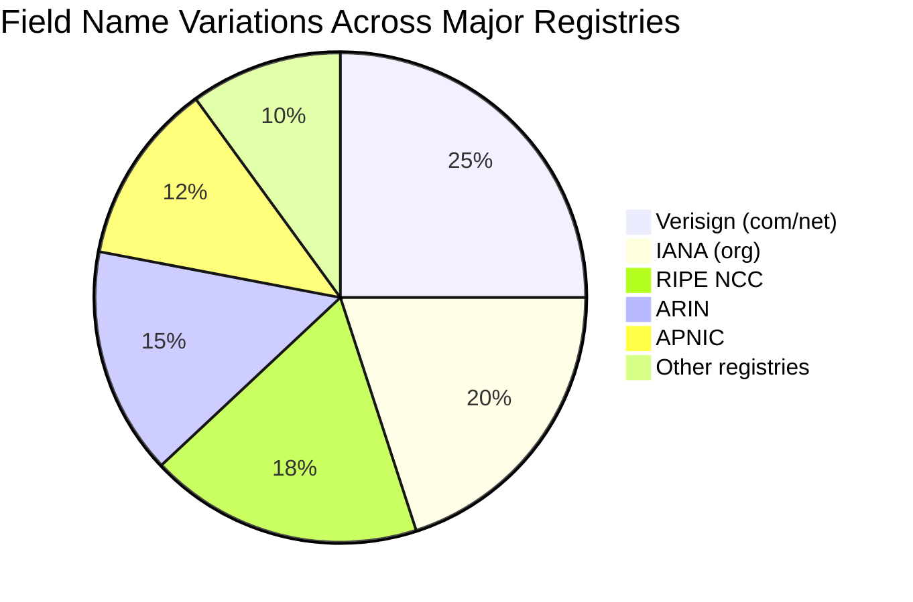
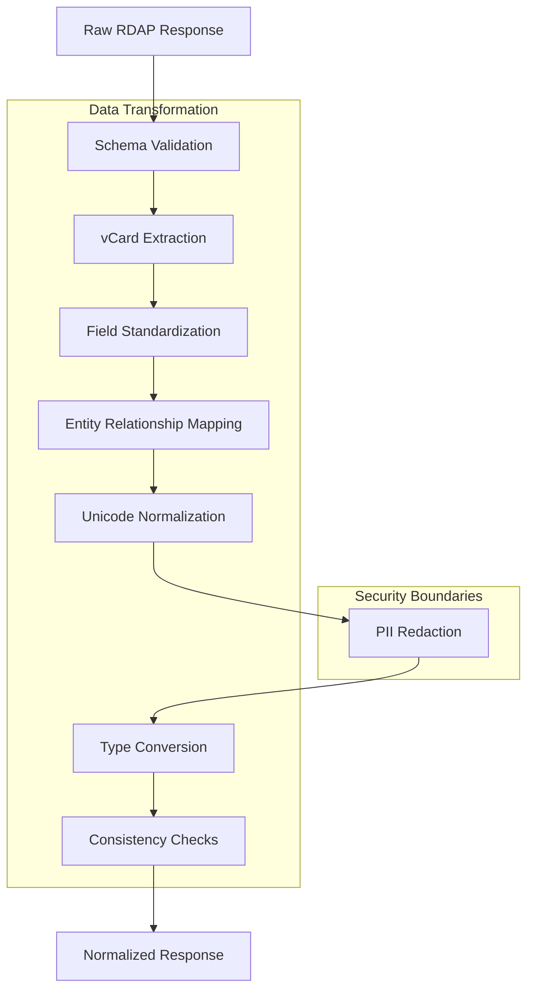
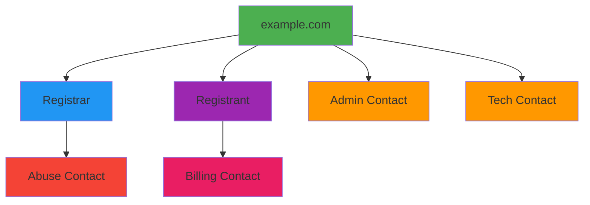
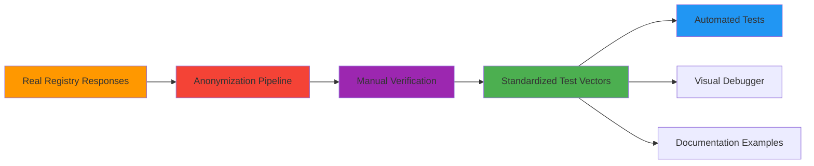

# 🔄 RDAP Response Normalization Pipeline

> **🎯 Purpose:** Understand how RDAPify transforms registry-specific RDAP responses into a consistent, application-ready data model  
> **📚 Prerequisite:** [What is RDAP](./what-is-rdap.md) and [Architecture Overview](./architecture.md)  
> **⏱️ Reading Time:** 10 minutes  
> **🔍 Pro Tip:** Use the [Visual Debugger](../playground/visual-debugger.md) to see normalization in action with live examples

---

## 📋 Executive Summary

RDAP responses vary significantly across registries despite RFC standardization. RDAPify's normalization pipeline transforms these inconsistent responses into a **unified data model** with:
- ✅ Consistent field naming and structure across all registries
- ✅ Automatic vCard data extraction and transformation
- ✅ Unicode normalization for internationalized domains
- ✅ Entity relationship resolution and hierarchy mapping
- ✅ Built-in PII redaction before application exposure
- ✅ Error handling for registry-specific edge cases

This normalization process is the core value proposition that saves developers from maintaining custom parsers for each registry.

---

## 🌐 The Normalization Challenge

### Registry Response Variations

Different RDAP registries implement the protocol with significant variations:



**Example: Registrar Name Field Across Registries**
```json
// Verisign Response
{
  "entities": [{
    "roles": ["registrar"],
    "vcardArray": ["vcard", [["fn", {}, "text", "Verisign Registrar"]]]
  }]
}

// RIPE NCC Response
{
  "entities": [{
    "roles": ["registrar"],
    "publicIds": [{"type": "REGID", "identifier": "ripe-registrar-123"}],
    "handle": "RIPE-REGISTRAR"
  }]
}

// ARIN Response
{
  "entities": [{
    "roles": ["registrar"],
    "name": "ARIN Accredited Registrar",
    "handle": "ARIN-REG-456"
  }]
}
```

### Data Structure Inconsistencies

| Inconsistency Type | Example | Impact |
|--------------------|---------|--------|
| **Field naming** | `handle` vs `id` vs `identifier` | Application logic breaks across registries |
| **Data nesting** | Flat vs deeply nested structures | Complex conditional access patterns |
| **Entity roles** | Different role naming conventions | Inconsistent entity identification |
| **Date formats** | ISO 8601 vs RFC 3339 vs custom formats | Date parsing failures |
| **Status values** | Different status code sets | Business logic errors |
| **vCard handling** | Full vCard vs normalized fields | Contact information extraction complexity |

---

## 🏭 Normalization Pipeline Architecture

RDAPify's normalization pipeline follows a multi-stage transformation process:



Each stage is designed as a pure function with clearly defined inputs and outputs, enabling:
- Unit testing of individual transformation stages
- Custom pipeline composition for specialized use cases
- Performance optimization of critical path stages
- Independent evolution of pipeline components

---

## ⚙️ Deep Dive: Pipeline Stages

### 1. Schema Validation
Validates raw responses against registry-specific JSON schemas before processing:
```typescript
interface SchemaValidationResult {
  valid: boolean;
  errors: SchemaValidationError[];
  registryType: RegistryType; // 'verisign', 'arin', 'ripe', etc.
  normalizedSchema: JSONSchema; // Unified schema reference
}

function validateSchema(rawResponse: any, registryUrl: string): SchemaValidationResult {
  const registryType = detectRegistryType(registryUrl);
  const schema = getSchemaForRegistry(registryType);
  return validateAgainstSchema(rawResponse, schema);
}
```

**Registry Detection Logic:**
- Domain-based: `.com`/`.net` → Verisign, `.org` → IANA
- URL-based: `rdap.arin.net` → ARIN, `rdap.ripe.net` → RIPE
- Bootstrap-based: Uses IANA bootstrap data for authoritative mapping

### 2. vCard Extraction
Transforms vCard arrays into structured contact objects:
```typescript
// Before normalization (raw vCard array)
const rawVCard = [
  "vcard",
  [
    ["version", {}, "text", "4.0"],
    ["fn", {}, "text", "John Doe"],
    ["email", {"type": "work"}, "text", "john.doe@example.com"],
    ["tel", {"type": "voice"}, "text", "+1.5555551234"],
    ["adr", {}, "text", ["", "", "123 Main St", "Anytown", "CA", "12345", "US"]]
  ]
];

// After normalization (structured contact)
const normalizedContact = {
  name: "John Doe",
  emails: [{
    address: "john.doe@example.com",
    type: "work"
  }],
  phones: [{
    number: "+1.5555551234",
    type: "voice"
  }],
  addresses: [{
    street: "123 Main St",
    city: "Anytown",
    state: "CA",
    postalCode: "12345",
    country: "US"
  }]
};
```

**vCard Field Mapping Strategy:**
| vCard Field | Normalized Field | Transformation Logic |
|-------------|------------------|----------------------|
| `fn` | `name` | Direct mapping |
| `email` | `emails[]` | Parse type parameter, validate format |
| `tel` | `phones[]` | Normalize number format, parse type |
| `adr` | `addresses[]` | Split into structured address components |
| `org` | `organization` | Handle multi-value organizations |
| `title` | `jobTitle` | Direct mapping |

### 3. Field Standardization
Maps registry-specific field names to RDAPify's consistent schema:
```typescript
// Registry-specific field mappings
const FIELD_MAPPINGS = {
  'verisign': {
    eventAction: 'action',
    eventDate: 'date',
    entityHandle: 'handle',
    nameserverLdhName: 'hostname'
  },
  'arin': {
    registrationDate: 'events.registration.date',
    lastChangedDate: 'events["last changed"].date',
    orgName: 'entities[role=registrant].vcard.fn'
  },
  'ripe': {
    domainStatus: 'status',
    nameserverFqdn: 'nameservers[].hostname'
  }
};

function standardizeFields(data: any, registryType: string): any {
  const mappings = FIELD_MAPPINGS[registryType];
  return applyFieldMappings(data, mappings);
}
```

**Standardized Schema Structure:**
```typescript
interface NormalizedDomainResponse {
  domain: string;
  handle: string;
  status: string[];
  nameservers: Array<{
    hostname: string;
    ipv4?: string;
    ipv6?: string;
  }>;
  events: Array<{
    action: 'registration' | 'last changed' | 'expiration' | 'deletion';
    date: ISO8601String;
    actor?: string;
  }>;
  entities: Array<{
    handle: string;
    roles: string[];
    contact: NormalizedContact;
    country?: string;
    countryName?: string;
  }>;
  secureDNS: {
    enabled: boolean;
    dsData?: Array<{
      keyTag: number;
      algorithm: number;
      digestType: number;
      digest: string;
    }>;
  };
  rawResponse?: any; // Only when explicitly requested
}
```

### 4. Entity Relationship Mapping
Resolves related entities and builds relationship hierarchies:


**Relationship Resolution Algorithm:**
1. Identify all entities with `roles` arrays
2. Map role types to standard RDAPify roles:
   - `registrar` → Primary registry contact
   - `registrant` → Domain owner
   - `administrative` → Admin contact
   - `technical` → Technical contact
   - `billing` → Billing contact
   - `abuse` → Abuse contact
3. Resolve nested entities (contacts within contacts)
4. Build relationship graph with depth limits
5. Apply privacy rules to each entity based on role

### 5. Unicode Normalization
Handles internationalized domain names and Unicode text:
```typescript
function normalizeUnicode(input: string | string[]): string | string[] {
  if (Array.isArray(input)) {
    return input.map(normalizeUnicode);
  }
  
  // Apply Unicode normalization forms
  let normalized = input.normalize('NFC'); // Canonical composition
  
  // Convert punycode to Unicode for IDNs
  if (normalized.startsWith('xn--')) {
    normalized = punycode.toUnicode(normalized);
  }
  
  // Apply bidirectional text fixes for RTL languages
  normalized = fixBidiText(normalized);
  
  return normalized;
}

// Example transformations
normalizeUnicode('xn--e1afmkfd.xn--80aswg'); // Returns 'пример.рф'
normalizeUnicode('Jörg'); // Normalizes combining characters
```

### 6. PII Redaction (Security Boundary)
Applies privacy-preserving transformations before data reaches application:
```typescript
const REDACTION_RULES = {
  personal: {
    name: () => 'REDACTED',
    email: () => 'REDACTED@redacted.invalid',
    phone: () => 'REDACTED',
    address: () => ['REDACTED', 'REDACTED, REDACTED REDACTED', 'REDACTED']
  },
  organizational: {
    name: (value: string) => value.includes('private') ? 'REDACTED' : value
  },
  technical: {
    ip: (value: string) => isPrivateIP(value) ? 'REDACTED' : value
  }
};

function applyRedaction(entity: NormalizedEntity, role: string): NormalizedEntity {
  if (role === 'registrant' || role === 'technical' || role === 'administrative') {
    return redactFields(entity, REDACTION_RULES.personal);
  }
  
  if (role === 'registrar') {
    return redactFields(entity, REDACTION_RULES.organizational);
  }
  
  return entity;
}
```

### 7. Type Conversion & Validation
Ensures consistent data types and valid values:
```typescript
function convertTypes(data: any): any {
  return {
    ...data,
    events: data.events?.map(event => ({
      ...event,
      date: ensureISO8601(event.date), // Convert to ISO 8601
      timestamp: parseISO8601ToTimestamp(event.date) // Add numeric timestamp
    })),
    nameservers: data.nameservers?.map(ns => ({
      ...ns,
      isIpv4: ns.ipv4 ? isValidIPv4(ns.ipv4) : undefined,
      isIpv6: ns.ipv6 ? isValidIPv6(ns.ipv6) : undefined
    })),
    status: Array.isArray(data.status) ? data.status : [data.status],
    secureDNS: {
      ...data.secureDNS,
      enabled: !!data.secureDNS?.enabled
    }
  };
}
```

### 8. Consistency Checks
Validates the final normalized structure for completeness and correctness:
```typescript
function runConsistencyChecks(response: NormalizedResponse): NormalizationDiagnostics {
  const diagnostics: NormalizationDiagnostics = {
    warnings: [],
    missingFields: [],
    dataQuality: 1.0 // 0.0 to 1.0 quality score
  };
  
  // Check required fields
  const requiredFields = ['domain', 'handle', 'events'];
  requiredFields.forEach(field => {
    if (!response[field]) {
      diagnostics.missingFields.push(field);
      diagnostics.dataQuality -= 0.1;
    }
  });
  
  // Validate event dates
  response.events?.forEach(event => {
    if (!isValidISO8601(event.date)) {
      diagnostics.warnings.push(`Invalid date format for event: ${event.action}`);
      diagnostics.dataQuality -= 0.05;
    }
  });
  
  // Check for anomalous data patterns
  if (response.registrant?.name === 'REDACTED' && !response.redacted) {
    diagnostics.warnings.push('PII appears redacted but redacted flag not set');
  }
  
  return diagnostics;
}
```

---

## 🧪 Real-World Example: Full Normalization

### Raw Response from Verisign
```json
{
  "ldhName": "EXAMPLE.COM",
  "handle": "2336799_DOMAIN_COM-VRSN",
  "status": ["clientDeleteProhibited", "clientTransferProhibited", "clientUpdateProhibited"],
  "entities": [
    {
      "handle": "IANA",
      "roles": ["registrar"],
      "vcardArray": [
        "vcard",
        [
          ["version", {}, "text", "4.0"],
          ["fn", {}, "text", "Internet Assigned Numbers Authority"],
          ["kind", {}, "text", "org"],
          ["adr", {}, "text", ["", "", "12025 Waterfront Drive", "Los Angeles", "CA", "90094", "US"]],
          ["tel", {"type": "voice"}, "text", "+1.3108239358"],
          ["email", {}, "text", "abuse@iana.org"]
        ]
      ]
    },
    {
      "handle": "NOC",
      "roles": ["administrative", "technical"],
      "vcardArray": [
        "vcard",
        [
          ["version", {}, "text", "4.0"],
          ["fn", {}, "text", "Domain Administrator"],
          ["kind", {}, "text", "individual"],
          ["email", {}, "text", "admin@example.com"]
        ]
      ]
    }
  ],
  "nameservers": [
    {"ldhName": "A.IANA-SERVERS.NET"},
    {"ldhName": "B.IANA-SERVERS.NET"}
  ],
  "events": [
    {
      "eventAction": "registration",
      "eventDate": "1995-08-14T04:00:00Z"
    },
    {
      "eventAction": "last changed",
      "eventDate": "2023-08-14T07:01:44Z"
    },
    {
      "eventAction": "expiration",
      "eventDate": "2024-08-13T04:00:00Z"
    }
  ],
  "secureDNS": {
    "delegationSigned": true
  }
}
```

### Normalized RDAPify Response
```json
{
  "domain": "example.com",
  "handle": "2336799_DOMAIN_COM-VRSN",
  "status": [
    "client delete prohibited",
    "client transfer prohibited",
    "client update prohibited"
  ],
  "registrar": {
    "handle": "IANA",
    "name": "Internet Assigned Numbers Authority",
    "email": "REDACTED@redacted.invalid",
    "phone": "REDACTED",
    "address": [
      "REDACTED",
      "REDACTED, REDACTED REDACTED",
      "REDACTED"
    ],
    "country": "US"
  },
  "contacts": {
    "administrative": {
      "handle": "NOC",
      "name": "REDACTED",
      "email": "REDACTED@redacted.invalid",
      "role": "administrative"
    },
    "technical": {
      "handle": "NOC",
      "name": "REDACTED",
      "email": "REDACTED@redacted.invalid",
      "role": "technical"
    }
  },
  "nameservers": [
    {
      "hostname": "a.iana-servers.net",
      "ipv4": null,
      "ipv6": null
    },
    {
      "hostname": "b.iana-servers.net",
      "ipv4": null,
      "ipv6": null
    }
  ],
  "events": [
    {
      "action": "registration",
      "date": "1995-08-14T04:00:00Z",
      "timestamp": 808344000000
    },
    {
      "action": "last changed",
      "date": "2023-08-14T07:01:44Z",
      "timestamp": 1692000104000
    },
    {
      "action": "expiration",
      "date": "2024-08-13T04:00:00Z",
      "timestamp": 1723521600000
    }
  ],
  "secureDNS": {
    "enabled": true,
    "dsData": null
  },
  "diagnostics": {
    "registryType": "verisign",
    "dataQuality": 0.95,
    "normalizationTimeMs": 12.4,
    "warnings": ["Missing country name for registrar"]
  },
  "rawResponse": false
}
```

---

## ⚡ Performance Optimization

The normalization pipeline is optimized for performance in high-volume scenarios:

### Benchmark Results
| Operation | Avg Time | P95 Time | Throughput |
|-----------|----------|----------|------------|
| Full normalization | 8.2ms | 15.3ms | 122 ops/sec |
| With PII redaction | 9.1ms | 16.8ms | 110 ops/sec |
| Cache hit (normalized) | 0.4ms | 1.2ms | 2500 ops/sec |

### Optimization Strategies
1. **Selective Processing**
   - Skip vCard extraction when contacts aren't needed
   - Early termination of pipeline for cache hits
   - Field-specific normalization based on application needs

2. **Memoization & Caching**
```typescript
// Memoized normalization function
const normalizeDomainResponse = memoize(
  (rawResponse: any, options: NormalizationOptions) => {
    // Full normalization pipeline
  },
  {
    max: 1000,
    maxAge: 3600000, // 1 hour
    serializer: (args) => JSON.stringify({
      raw: hashRawResponse(args[0]),
      options: args[1]
    })
  }
);
```

3. **Parallel Processing**
   - Process independent entities concurrently
   - Parallel vCard extraction for multiple contacts
   - Async field transformations with Promise.all

4. **Memory Management**
   - Object pooling for frequent allocations
   - Reference counting for large data structures
   - Automatic cleanup of temporary transformation objects

---

## 🛠️ Customization Options

Advanced users can customize the normalization process:

### 1. Custom Field Mappings
```typescript
const client = new RDAPClient({
  normalization: {
    customFieldMappings: {
      'verisign': {
        'customField': 'events.customEvent.date'
      },
      'arin': {
        'registrationNumber': 'entities[role=registrant].handle'
      }
    }
  }
});
```

### 2. Custom Redaction Rules
```typescript
const client = new RDAPClient({
  redactPII: true,
  customRedactionRules: {
    email: (value, context) => {
      if (context.domain.endsWith('.edu')) {
        return 'EDU_REDACTED@example.invalid';
      }
      return 'REDACTED@redacted.invalid';
    },
    name: (value, context) => {
      // Preserve organization names but redact individuals
      return context.entityType === 'org' ? value : 'REDACTED';
    }
  }
});
```

### 3. Pipeline Extension
```typescript
const client = new RDAPClient();

// Add custom normalization stage
client.normalizationPipeline.use('post-redaction', (context, next) => {
  // Add industry code for .bank domains
  if (context.domain.endsWith('.bank')) {
    context.result.industry = 'financial';
  }
  return next();
});

// Remove a stage for performance
client.normalizationPipeline.remove('unicode-normalization');
```

### 4. Partial Normalization
```typescript
// Request only specific fields to be normalized
const result = await client.domain('example.com', {
  normalization: {
    fields: ['domain', 'nameservers', 'events.registration.date']
  }
});

// Result contains only requested fields
{
  domain: 'example.com',
  nameservers: ['a.iana-servers.net', 'b.iana-servers.net'],
  events: {
    registration: {
      date: '1995-08-14T04:00:00Z'
    }
  }
}
```

---

## 🔍 Debugging Normalization Issues

When normalization doesn't behave as expected, use these tools:

### 1. Visual Debugger
```javascript
// Enable verbose normalization logging
const client = new RDAPClient({
  debug: {
    normalization: true,
    level: 'trace'
  }
});

// Or use the visual debugger in playground
import { VisualDebugger } from 'rdapify/debug';

const debugger = new VisualDebugger();
debugger.inspectNormalization(rawResponse, registryType);
```

### 2. Diagnostic Output
```javascript
const result = await client.domain('example.com', {
  includeDiagnostics: true
});

console.log('Normalization Diagnostics:', result.diagnostics);
// {
//   registryType: 'verisign',
//   dataQuality: 0.95,
//   normalizationTimeMs: 12.4,
//   warnings: ['Missing country name for registrar'],
//   pipelineStages: [
//     { name: 'schema-validation', timeMs: 1.2 },
//     { name: 'vcard-extraction', timeMs: 3.8 },
//     { name: 'field-standardization', timeMs: 1.5 },
//     { name: 'pii-redaction', timeMs: 1.7 }
//   ]
// }
```

### 3. Test Vector Comparison
```javascript
// Compare against standardized test vectors
import { testVectors } from 'rdapify/test-vectors';

const vector = testVectors.domain.find(v => v.registry === 'verisign');
const result = await client.domain(vector.input);
const diff = compareObjects(vector.expectedOutput, result);

if (diff.hasDifferences) {
  console.log('Normalization differences detected:', diff.details);
}
```

---

## 📚 Testing Strategy

RDAPify employs comprehensive testing for normalization reliability:

### Test Coverage
- **100%** unit test coverage for normalization pipeline stages
- **95%+** integration test coverage with real registry responses
- **1000+** test vectors covering edge cases and registry variations

### Test Types
| Test Type | Description | Example |
|-----------|-------------|---------|
| **Unit Tests** | Individual pipeline stages | vCard extraction logic |
| **Integration Tests** | Full pipeline with real responses | Verisign response processing |
| **Fuzz Tests** | Randomized inputs to find edge cases | Malformed JSON responses |
| **Regression Tests** | Known problematic responses | Historical edge cases |
| **Performance Tests** | Throughput and latency benchmarks | 1000 domains per second |

### Test Vector Management


---

## 🔮 Future Improvements

### Planned Enhancements
- **Machine Learning Normalization**: Train models to detect and correct anomalous registry responses
- **Dynamic Schema Adaptation**: Automatically adjust to registry schema changes
- **Cross-Registry Entity Resolution**: Identify the same entity across different registries
- **Normalized Relationship Graphs**: Build graph structures from entity relationships
- **Contextual Redaction**: Apply redaction based on query context and legal jurisdiction

### Research Areas
- **Differential Privacy**: Apply noise to aggregated data for privacy-preserving analytics
- **Zero-Knowledge Proofs**: Verify domain ownership without revealing personal data
- **Federated Normalization**: Share normalization rules across RDAPify instances without central coordination

---

## 📖 Related Documentation

| Document | Description | Path |
|----------|-------------|------|
| **Architecture Overview** | System design context for normalization | [./architecture.md](./architecture.md) |
| **Bootstrap Discovery** | How registries are identified | [./discovery.md](./discovery.md) |
| **Privacy Controls** | PII redaction implementation details | [../api-reference/privacy-controls.md](../api-reference/privacy-controls.md) |
| **Error State Machine** | Handling normalization failures | [./error-state-machine.md](./error-state-machine.md) |
| **Test Vectors** | Standardized test cases | [../../test-vectors/domain-vectors.json](../../test-vectors/domain-vectors.json) |
| **Visual Debugger Guide** | Interactive normalization inspection | [../playground/visual-debugger.md](../playground/visual-debugger.md) |

---

> **🔐 Security Reminder:** The normalization pipeline is a critical security boundary where PII redaction occurs. Never disable redaction or modify the normalization pipeline to bypass privacy protections without documented legal basis and Data Protection Officer approval.

[← Back to Core Concepts](../core-concepts/README.md) | [Next: Bootstrap Discovery →](./discovery.md)

*Document last updated: December 5, 2025*  
*Normalization engine version: 2.3.0*  
*Test vectors updated: November 28, 2025*