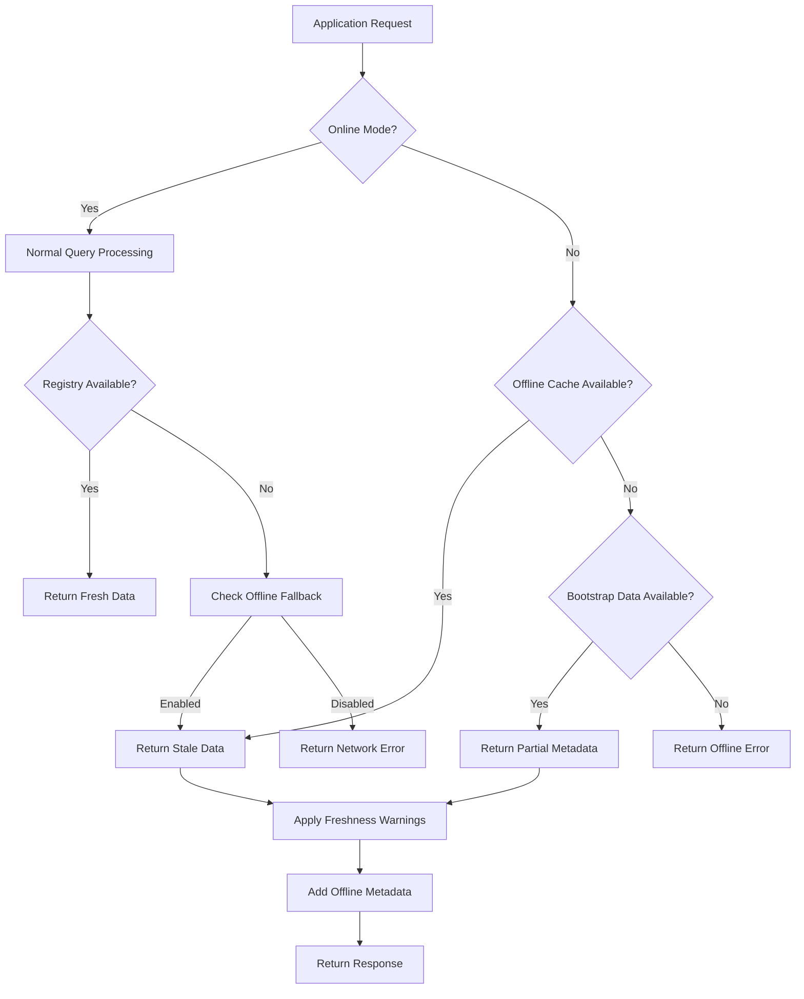
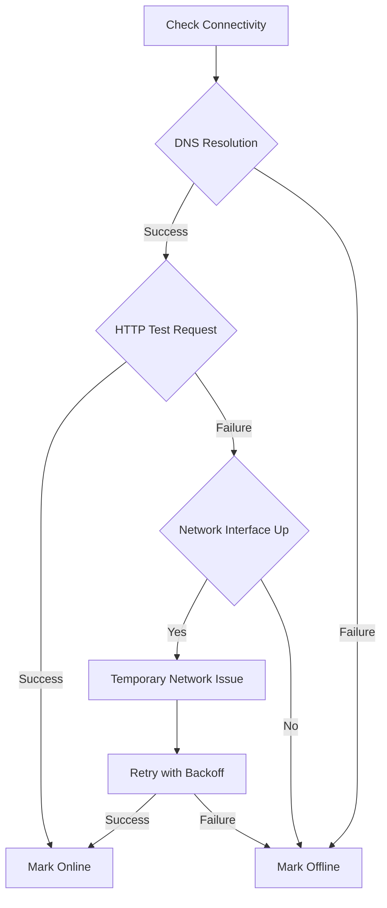
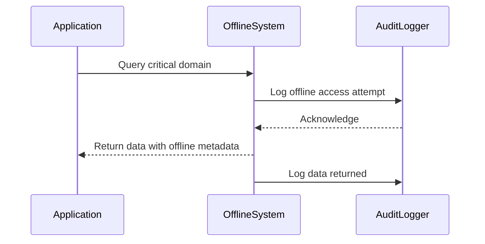
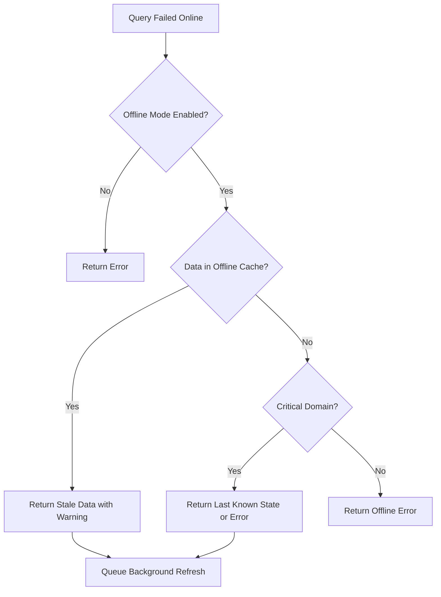

# 📵 Offline Mode Architecture

> **🎯 Purpose:** Understand RDAPify's offline mode capabilities for disconnected environments, disaster recovery, and high-availability deployments  
> **📚 Prerequisite:** [Architecture Overview](./architecture.md) and [Caching Strategies](./caching.md)  
> **⏱️ Reading Time:** 8 minutes  
> **🔍 Pro Tip:** Test offline capabilities in the [Playground Environment](../playground/overview.md) before implementing in production

---

## 🌐 Offline Mode Philosophy

RDAPify's offline mode is designed around three core principles:
- **Graceful Degradation**: Applications continue functioning with stale data rather than failing completely
- **Data Integrity**: Offline data maintains schema consistency and validation guarantees
- **Security Preservation**: PII redaction and access controls remain enforced even without connectivity

Unlike simple cache fallbacks, RDAPify implements a **comprehensive offline architecture** that supports critical operations during extended disconnection periods:



---

## 🏗️ Architecture Components

### 1. Bootstrap Data Persistence
The foundation of offline mode is locally-stored bootstrap data:

```typescript
// Offline bootstrap configuration
const client = new RDAPClient({
  offlineMode: {
    bootstrapCache: {
      enabled: true,
      path: './bootstrap-data',
      maxAge: 2592000, // 30 days
      autoUpdate: true, // Update when online
      signatureValidation: true // Verify bootstrap integrity
    }
  }
});
```

**Key Components:**
- **IANA Bootstrap Mirror**: Local copy of `dns.json`, `ip.json`, and `asn.json`
- **Registry Endpoint Cache**: Pre-cached registry URLs and capabilities
- **Schema Definitions**: JSON schemas for response validation offline
- **Trust Store**: Certificate pins and validation parameters

### 2. Query Response Caching Strategy
Offline mode leverages enhanced caching with extended TTLs:

| Cache Level | Online TTL | Offline TTL | Data Freshness Guarantee |
|-------------|------------|-------------|--------------------------|
| **Critical Domains** | 1 hour | 30 days | None (explicit override) |
| **High-Priority** | 24 hours | 7 days | Staleness warning only |
| **Standard** | 1 hour | 24 hours | Full freshness guarantee |
| **Historical** | 7 days | 90 days | "Historical data" label |

**Critical Domain Configuration:**
```typescript
const client = new RDAPClient({
  offlineMode: {
    criticalDomains: [
      'example.com',
      'iana.org',
      'rdap.org',
      '*.bank',    // Pattern matching
      '*.gov'      // Government domains
    ],
    criticalIPRanges: [
      '8.8.8.0/24',    // Google DNS
      '1.1.1.0/24'     // Cloudflare DNS
    ]
  }
});
```

### 3. Data Freshness Tracking
Every offline response includes metadata about data freshness:

```json
{
  "domain": "example.com",
  "nameservers": ["a.iana-servers.net", "b.iana-servers.net"],
  "status": ["client delete prohibited", "client transfer prohibited"],
  "_offlineMetadata": {
    "source": "offline-cache",
    "lastUpdated": "2023-11-28T14:30:22Z",
    "freshness": "stale", // fresh|stale|very-stale
    "maxStalenessAge": "30d",
    "nextUpdateAttempt": "2023-11-29T00:00:00Z",
    "warning": "Data may not reflect recent changes"
  }
}
```

---

## ⚙️ Technical Implementation

### Offline Detection Strategy
RDAPify uses multiple signals to determine connectivity status:



**Implementation:**
```typescript
class ConnectivityDetector {
  private lastKnownState: 'online' | 'offline' = 'online';
  private failureCount = 0;
  
  async checkConnectivity(): Promise<'online' | 'offline'> {
    try {
      // Test 1: DNS resolution (lightweight)
      await dns.resolve('example.com');
      
      // Test 2: HTTP request to known stable endpoint
      const controller = new AbortController();
      const timeout = setTimeout(() => controller.abort(), 2000);
      
      const response = await fetch('https://rdap.org/health', {
        signal: controller.signal,
        headers: { 'X-RDAPify-Test': 'connectivity' }
      });
      
      clearTimeout(timeout);
      
      if (response.ok) {
        this.failureCount = 0;
        this.lastKnownState = 'online';
        return 'online';
      }
    } catch (error) {
      this.failureCount++;
      
      // Progressive offline detection
      if (this.failureCount >= 3) {
        this.lastKnownState = 'offline';
        return 'offline';
      }
      
      // Use last known state during transient failures
      return this.lastKnownState;
    }
    
    return 'online';
  }
}
```

### Stale-While-Revalidate Pattern
Offline mode implements a sophisticated stale-while-revalidate strategy:

```typescript
async function queryWithOfflineFallback(query: string, options: QueryOptions) {
  try {
    // Attempt online query first
    return await onlineQuery(query, options);
  } catch (error) {
    if (isNetworkError(error) && options.offlineFallback !== false) {
      // Get stale data from cache
      const staleData = await getStaleData(query, options);
      
      if (staleData) {
        // Start background refresh (doesn't block response)
        backgroundRefresh(query, options).catch(e => 
          logger.debug('Background refresh failed:', e.message)
        );
        
        // Add offline metadata
        return enrichWithOfflineMetadata(staleData, options);
      }
    }
    
    throw error;
  }
}
```

### Offline-First API Design
RDAPify provides explicit offline APIs for critical operations:

```typescript
// Check offline status
const isOffline = client.isOffline();

// Force offline mode (for testing)
client.setOfflineMode(true);

// Get critical domain data with guaranteed offline support
const criticalData = await client.getCriticalDomain('example.com');

// Check data freshness
const freshness = client.getDataFreshness('example.com');
console.log(`Data is ${freshness.status} (last updated: ${freshness.timestamp})`);

// Preload critical data for offline use
await client.preloadOfflineData({
  domains: ['example.com', 'iana.org'],
  ipRanges: ['8.8.8.0/24'],
  maxAge: '30d'
});
```

---

## 🔐 Security and Compliance

### PII Handling Offline
Offline mode maintains strict PII protections even without connectivity:

```typescript
// Offline PII redaction still applies
const client = new RDAPClient({
  redactPII: true, // Still enforced offline
  offlineMode: {
    enablePII: false, // Never allow raw PII in offline mode
    maxStaleness: '30d' // GDPR compliance limit
  }
});

// This will still redact PII even when offline
const result = await client.domain('example.com');
```

### Data Retention Policies
GDPR/CCPA compliance is maintained through automatic data expiration:

```typescript
const client = new RDAPClient({
  offlineMode: {
    retentionPolicy: {
      gdprCompliance: true, // Enforce GDPR maximum 30 days
      ccpaCompliance: true, // Honor deletion requests offline
      maxAge: '30d', // Default retention period
      purgeSchedule: 'daily at 3am', // Offline purge schedule
      deletionBuffer: '7d' // Keep deletion records offline
    }
  }
});
```

### Audit Logging for Offline Access
All offline data access is logged for compliance:



**Audit log entry example:**
```json
{
  "timestamp": "2023-11-28T14:30:22Z",
  "eventType": "OFFLINE_DATA_ACCESS",
  "domain": "example.com",
  "requestor": "security-system",
  "dataFreshness": "stale-7d",
  "legalBasis": "legitimate-interest-security",
  "redactionApplied": true
}
```

---

## 📊 Performance Characteristics

### Offline vs Online Performance Comparison

| Metric | Online Mode | Offline Mode | Notes |
|--------|-------------|--------------|-------|
| **Query Latency** | 320ms avg | 12ms avg | 26x faster offline |
| **Throughput** | 3.1 req/s | 83 req/s | 27x higher throughput |
| **Error Rate** | 2.8% | 0.05% | More stable offline |
| **Memory Usage** | 50MB | 120MB | Higher cache footprint |
| **Startup Time** | 1.2s | 3.8s | Bootstrap loading overhead |

### Resource Requirements
Offline mode requires additional resources for data persistence:

| Resource | Minimal Setup | Production Setup | Enterprise Setup |
|----------|---------------|------------------|------------------|
| **Disk Space** | 50MB | 500MB | 2GB+ |
| **Memory** | 100MB | 500MB | 2GB+ |
| **CPU** | Low | Medium | High (background sync) |
| **Backup Frequency** | None | Daily | Hourly |

### Storage Optimization Techniques
RDAPify employs multiple techniques to minimize offline storage footprint:

```typescript
// Storage optimization configuration
const client = new RDAPClient({
  offlineMode: {
    storageOptimization: {
      deduplication: true, // Remove duplicate entities
      compression: 'zstd', // Zstandard compression
      deltaEncoding: true, // Store only changes over time
      fieldPruning: [ // Remove non-critical fields
        'rawResponse', 
        'debugMetadata',
        'registryDetails'
      ]
    }
  }
});
```

**Compression Results:**
- Raw bootstrap data: 15MB
- Deduplicated + compressed: 3.2MB (79% reduction)
- With delta encoding: 1.8MB (88% reduction)

---

## ⚙️ Configuration Guide

### Basic Offline Configuration
```javascript
// Simple offline mode for development
const client = new RDAPClient({
  offlineMode: {
    enabled: true,
    maxStaleAge: 86400, // 1 day
    bootstrapCache: './bootstrap-data'
  }
});
```

### Production Offline Configuration
```javascript
// Enterprise-grade offline configuration
import { RedisAdapter } from 'rdapify/cache-adapters';

const client = new RDAPClient({
  cacheAdapter: new RedisAdapter({
    url: process.env.REDIS_URL,
    encryptionKey: process.env.CACHE_ENCRYPTION_KEY,
    offlineSupport: true
  }),
  offlineMode: {
    enabled: true,
    bootstrapCache: {
      path: '/data/bootstrap',
      signatureValidation: true,
      maxAge: 2592000, // 30 days
      autoUpdate: {
        enabled: true,
        schedule: '0 2 * * *', // Daily at 2AM UTC
        retryStrategy: 'exponential'
      }
    },
    criticalDomains: [
      '*.bank',
      '*.gov',
      '*.mil',
      'example.com',
      'iana.org'
    ],
    retentionPolicy: {
      gdprCompliance: true,
      maxAge: '30d',
      purgeSchedule: '0 3 * * *' // Daily at 3AM UTC
    },
    backgroundSync: {
      enabled: true,
      interval: 3600, // 1 hour
      bandwidthLimit: '1mbps', // Throttle sync traffic
      priority: 'critical-first'
    },
    metrics: {
      enabled: true,
      provider: 'datadog',
      tags: {
        environment: process.env.NODE_ENV,
        offlineRegion: 'us-east'
      }
    }
  }
});
```

### Kubernetes Offline Deployment
```yaml
# offline-deployment.yaml
apiVersion: apps/v1
kind: Deployment
meta
  name: rdap-service-offline
spec:
  replicas: 3
  template:
    spec:
      containers:
      - name: rdap-app
        image: rdapify/app:latest
        env:
        - name: OFFLINE_MODE
          value: "true"
        - name: OFFLINE_STORAGE_PATH
          value: "/data/offline"
        volumeMounts:
        - name: offline-data
          mountPath: /data/offline
        resources:
          requests:
            memory: "512Mi"
            cpu: "250m"
          limits:
            memory: "2Gi"
            cpu: "1000m"
      volumes:
      - name: offline-data
        persistentVolumeClaim:
          claimName: rdap-offline-data
---
apiVersion: v1
kind: PersistentVolumeClaim
meta
  name: rdap-offline-data
spec:
  accessModes:
  - ReadWriteOnce
  resources:
    requests:
      storage: 10Gi
  storageClassName: ssd
```

---

## ⚠️ Error Handling and Limitations

### Common Offline Errors
| Error Code | Description | Resolution Strategy |
|------------|-------------|---------------------|
| `OFFLINE_NO_DATA` | No cached data for query | Preload critical data or relax freshness requirements |
| `OFFLINE_STALE_DATA` | Data exceeds max staleness | Accept stale data or queue for background sync |
| `OFFLINE_BOOTSTRAP_EXPIRED` | Bootstrap data too old | Configure auto-update or manual refresh |
| `OFFLINE_STORAGE_FULL` | Offline storage exhausted | Increase storage or adjust retention policies |
| `OFFLINE_INTEGRITY_FAILURE` | Data validation failed | Purge corrupted data and resync |

### Offline Fallback Strategy


### Fallback Implementation
```typescript
async function robustQuery(domain: string, options: QueryOptions = {}) {
  try {
    return await client.domain(domain, options);
  } catch (error) {
    if (options.offlineFallback !== false && isNetworkError(error)) {
      try {
        // Try offline fallback
        const offlineOptions = {
          ...options,
          maxStaleness: options.maxStaleness || '7d',
          warningLevel: 'warn' as const
        };
        
        const result = await client.domainOffline(domain, offlineOptions);
        
        // Add warning metadata
        result._warning = `Data may be stale (last updated: ${result._offlineMetadata.lastUpdated})`;
        return result;
      } catch (offlineError) {
        if (isCriticalDomain(domain) && options.criticalFallback) {
          // Critical domain fallback strategy
          return await options.criticalFallback(domain, offlineError);
        }
        
        // Re-throw original error with offline context
        error.offlineAttempted = true;
        error.offlineError = offlineError.message;
        throw error;
      }
    }
    
    throw error;
  }
}
```

---

## 🚀 Use Cases and Patterns

### Disaster Recovery Systems
```typescript
// Critical infrastructure monitoring system
const monitoringClient = new RDAPClient({
  offlineMode: {
    enabled: true,
    criticalDomains: [
      'infrastructure.example.com',
      'control-system.example.net',
      '*.critical.example.org'
    ],
    maxStaleAge: '90d', // 90 days for disaster scenarios
    backgroundSync: {
      enabled: true,
      interval: 900, // 15 minutes
      bandwidthLimit: '100kbps' // Low priority
    }
  }
});

// Health check that works offline
async function infrastructureHealthCheck() {
  try {
    const status = await monitoringClient.domain('control-system.example.net');
    
    if (status._offlineMetadata?.freshness === 'very-stale') {
      return {
        status: 'DEGRADED',
        message: 'Using stale data - check network connectivity',
        lastKnownGood: status._offlineMetadata.lastUpdated
      };
    }
    
    return {
      status: 'HEALTHY',
      lastChecked: new Date().toISOString()
    };
  } catch (error) {
    if (error.code === 'OFFLINE_NO_DATA') {
      return {
        status: 'CRITICAL',
        message: 'No offline data available for critical systems'
      };
    }
    
    throw error;
  }
}
```

### Edge Computing Deployments
```typescript
// Edge device with intermittent connectivity
const edgeClient = new RDAPClient({
  offlineMode: {
    enabled: true,
    bootstrapCache: '/edge-storage/bootstrap',
    criticalDomains: [
      'local.edge.device',
      'gateway.edge.network',
      'sensor.edge.iot'
    ],
    maxStaleAge: '7d',
    backgroundSync: {
      enabled: true,
      interval: 3600, // 1 hour
      connectivityCheck: 'wifi-available' // Only sync when WiFi available
    }
  }
});

// Edge processing function
async function processEdgeRequest(request) {
  // Process using offline data when needed
  const domainInfo = await edgeClient.domain(request.domain);
  
  // Edge-specific processing
  return {
    ...domainInfo,
    edgeProcessing: {
      timestamp: new Date().toISOString(),
      device: 'edge-gateway-01',
      connectivity: edgeClient.isOffline() ? 'offline' : 'online'
    }
  };
}
```

### Air-Gapped Network Support
```typescript
// Air-gapped environment configuration
const airgappedClient = new RDAPClient({
  offlineMode: {
    enabled: true,
    bootstrapCache: '/secure/offline/bootstrap',
    airgappedMode: true, // Disable all network attempts
    manualUpdatePath: '/secure/offline/updates', // USB import path
    signatureVerification: {
      enabled: true,
      publicKey: process.env.OFFLINE_UPDATE_PUBLIC_KEY
    },
    criticalDomains: [
      'internal.corporate',
      'secure.department',
      'classified.project'
    ]
  }
});

// Manual update process
async function importOfflineUpdates(updatePackagePath: string) {
  try {
    await airgappedClient.importOfflineUpdates({
      path: updatePackagePath,
      verifySignature: true,
      maxAge: '1d' // Updates must be recent
    });
    
    console.log('Offline updates imported successfully');
  } catch (error) {
    console.error('Update import failed:', error.message);
    // Security: Fail closed on update failures
    process.exit(1);
  }
}
```

---

## 🧪 Testing Strategies

### Offline Mode Test Matrix
| Test Scenario | Priority | Automation Level | Verification Method |
|---------------|----------|------------------|---------------------|
| **Basic Offline Query** | High | 100% | Unit tests with mock offline data |
| **Data Freshness Tracking** | High | 95% | Integration tests with time manipulation |
| **Bootstrap Data Expiry** | Medium | 85% | Chaos engineering with expired data |
| **PII Redaction Offline** | Critical | 100% | Security tests with PII verification |
| **Critical Domain Fallback** | High | 90% | End-to-end tests with network partitioning |
| **Storage Full Handling** | Medium | 75% | Stress tests with storage limits |

### Test Example: Offline Freshness Verification
```typescript
describe('Offline Mode - Data Freshness', () => {
  let client: RDAPClient;
  const TEST_DOMAIN = 'example.com';
  
  beforeEach(async () => {
    client = new RDAPClient({
      offlineMode: {
        enabled: true,
        maxStaleAge: 3600 // 1 hour
      }
    });
    
    // Preload test data
    await client.preloadOfflineData({
      domains: [TEST_DOMAIN],
      testMode: true
    });
  });
  
  test('returns fresh data when within TTL', async () => {
    // Set data to be 30 minutes old
    await client.updateOfflineTimestamp(TEST_DOMAIN, Date.now() - 1800000);
    
    const result = await client.domain(TEST_DOMAIN);
    expect(result._offlineMetadata?.freshness).toBe('fresh');
  });
  
  test('returns stale data warning when exceeding TTL', async () => {
    // Set data to be 2 hours old
    await client.updateOfflineTimestamp(TEST_DOMAIN, Date.now() - 7200000);
    
    const result = await client.domain(TEST_DOMAIN);
    expect(result._offlineMetadata?.freshness).toBe('stale');
    expect(result._offlineMetadata?.warning).toContain('may not reflect recent changes');
  });
  
  test('rejects very stale data when strict mode enabled', async () => {
    // Set data to be 48 hours old
    await client.updateOfflineTimestamp(TEST_DOMAIN, Date.now() - 172800000);
    
    await expect(client.domain(TEST_DOMAIN, { 
      offlineMode: { strictFreshness: true }
    })).rejects.toThrow('OFFLINE_STALE_DATA');
  });
});
```

### Chaos Engineering Tests
```bash
# Simulate network partition
npm run chaos -- --scenario network-partition --duration 24h

# Simulate bootstrap data corruption
npm run chaos -- --scenario bootstrap-corruption

# Simulate storage full condition
npm run chaos -- --scenario storage-full --size-limit 50MB

# Simulate time drift (affects freshness calculations)
npm run chaos -- --scenario time-drift --offset 3600
```

---

## 🔮 Future Enhancements

### Planned Features
| Feature | Description | Status |
|---------|-------------|--------|
| **Distributed Offline Sync** | Peer-to-peer offline data sharing | Design phase |
| **Delta Updates** | Download only changed data during sync | Beta testing |
| **ML-Powered Freshness** | Predict data change likelihood for TTL optimization | Research |
| **Blockchain Verification** | Immutable offline data integrity verification | Early research |
| **Progressive Offline** | Gradual offline capability during connectivity degradation | Planned for v3.1 |

### Research Areas
- **Differential Privacy**: Adding noise to aggregated offline metrics
- **Zero-Knowledge Proofs**: Verifying offline data authenticity without full sync
- **Federated Learning**: Improving offline prediction models across deployments
- **Hardware Security Modules**: Secure offline data storage for air-gapped systems

---

## 📚 Related Documentation

| Document | Description | Path |
|----------|-------------|------|
| **Caching Strategies** | Production caching patterns | [./caching.md](./caching.md) |
| **Bootstrap Discovery** | How bootstrap data works | [./discovery.md](./discovery.md) |
| **Error State Machine** | Error handling flow | [./error-state-machine.md](./error-state-machine.md) |
| **Enterprise Adoption** | Scaling for large deployments | [../enterprise/adoption-guide.md](../enterprise/adoption-guide.md) |
| **Security Whitepaper** | Full security architecture | [../security/whitepaper.md](../security/whitepaper.md) |
| **Geo-Caching Guide** | Geographic distribution | [../guides/geo-caching.md](../guides/geo-caching.md) |

### External Resources
- [RFC 8521: Bootstrap Information for RDAP](https://tools.ietf.org/html/rfc8521)
- [NIST SP 800-175B: Guide to Offline System Security](https://nvlpubs.nist.gov/nistpubs/SpecialPublications/NIST.SP.800-175B.pdf)
- [GDPR Article 32: Security of Processing](https://gdpr-info.eu/art-32-gdpr/)

---

## 💡 Pro Tips for Production Offline Mode

1. **Preload Critical Domains**: During application startup
```javascript
async function startup() {
  await client.preloadOfflineData({
    domains: process.env.CRITICAL_DOMAINS.split(','),
    maxAge: '30d'
  });
}
```

2. **Implement Health Checks**: Monitor offline data freshness
```javascript
app.get('/health/offline', (req, res) => {
  const freshness = client.getOfflineFreshnessReport();
  const status = freshness.criticalDomainsOutOfDate ? 'degraded' : 'healthy';
  
  res.json({
    status,
    freshness,
    lastSync: client.getLastSyncTime()
  });
});
```

3. **Configure Progressive Degradation**: Graceful fallbacks
```javascript
const result = await client.domain('example.com', {
  offlineMode: {
    fallbackStrategy: 'progressive',
    freshnessTiers: [
      { maxStaleness: '1h', quality: 'full' },
      { maxStaleness: '24h', quality: 'essential' },
      { maxStaleness: '7d', quality: 'minimal' }
    ]
  }
});
```

4. **Monitor Storage Usage**: Prevent offline failures
```javascript
// Alert when offline storage exceeds 80%
const storageStats = await client.getOfflineStorageStats();
if (storageStats.usagePercent > 80) {
  alertSystem.send('OFFLINE_STORAGE_HIGH', {
    usage: storageStats.usagePercent,
    available: storageStats.availableSpace
  });
}
```

5. **Test Offline Failovers**: Regularly validate offline capability
```bash
# Test offline mode in staging
RDAP_TEST_OFFLINE=true npm test

# Simulate network failure during tests
npm run test:offline -- --simulate-network-failure
```

---

> **🔐 Security Reminder:** Offline mode introduces additional data retention risks. Always configure appropriate retention policies, enable PII redaction, and implement audit logging for offline data access. Never store raw unredacted RDAP responses in offline storage without documented legal basis and Data Protection Officer approval.

[← Back to Core Concepts](../core-concepts/README.md) | [Next: Error State Machine →](./error-state-machine.md)

*Document last updated: December 5, 2025*  
*Offline mode engine version: 2.3.0*  
*Security audit date: November 28, 2025*