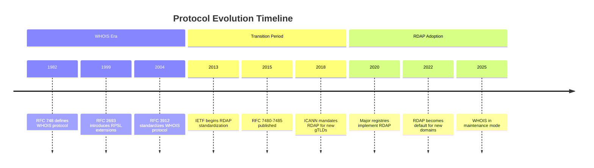
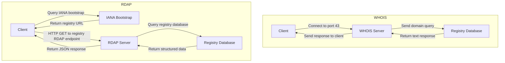
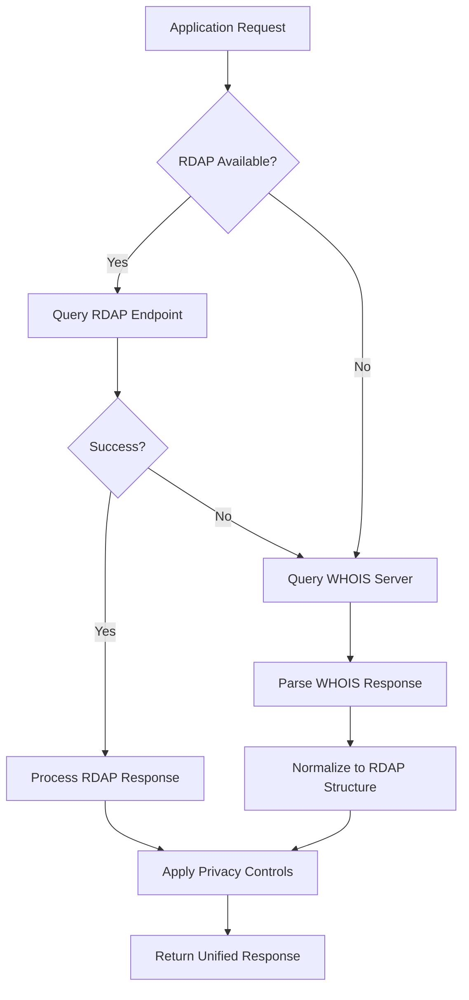

# ⚖️ RDAP vs WHOIS: Protocol Evolution and Technical Comparison

> **🎯 Purpose:** Understand the technical, architectural, and compliance differences between RDAP and WHOIS protocols  
> **📚 Prerequisite:** Basic understanding of [What is RDAP](./what-is-rdap.md)  
> **⏱️ Reading Time:** 10 minutes  
> **🔍 Pro Tip:** For hands-on experience, try our [5-Minute Quick Start](../getting-started/five-minutes.md) with both protocols

---

## 📜 Executive Summary

RDAP (Registration Data Access Protocol) represents a significant evolution from the legacy WHOIS protocol, addressing fundamental limitations in structure, internationalization, security, and privacy. While WHOIS served the internet for decades with its simple text-based approach, RDAP introduces a modern RESTful architecture with standardized JSON responses that better serve today's global, compliance-conscious internet ecosystem.

For developers, this transition means:
- ✅ **Structured data** instead of parsing unstructured text
- ✅ **Standardized responses** across registries instead of registry-specific formats
- ✅ **Built-in privacy controls** instead of all-or-nothing data exposure
- ✅ **Machine-readable metadata** instead of human-only responses
- ✅ **International character support** instead of ASCII limitations

However, the transition is incomplete—many systems still rely on WHOIS, requiring backward compatibility strategies during migration.

---

## 📜 Historical Context

### WHOIS: The Legacy Protocol (1982-Present)
Developed in the early ARPANET era (RFC 748, 1982), WHOIS was designed for a simpler internet:
- Simple text-based protocol over TCP port 43
- Human-readable format optimized for terminal users
- No standardization across registries
- Limited to ASCII characters
- No built-in privacy or security mechanisms
- No rate limiting or access controls

### RDAP: The Modern Replacement (2015-Present)
Standardized through IETF RFCs 7480-7485 (2015) and mandated by ICANN for new gTLDs:
- HTTP/HTTPS-based RESTful API architecture
- Machine-readable JSON responses with standardized schema
- Built-in support for international character sets (Unicode)
- Designed with privacy controls and redaction capabilities
- Standardized error codes and rate limiting mechanisms
- Bootstrap discovery mechanism for registry location



---

## ⚙️ Technical Architecture Comparison

### Protocol Design

| Feature | WHOIS | RDAP |
|---------|-------|------|
| **Transport Protocol** | TCP port 43 (custom protocol) | HTTP/HTTPS (standard web protocol) |
| **Query Method** | Simple text string over persistent connection | RESTful URL endpoints with query parameters |
| **Response Format** | Unstructured text with registry-specific formats | Standardized JSON with defined schema |
| **Character Encoding** | ASCII only | UTF-8 with full Unicode support |
| **Metadata** | Minimal or none | Machine-readable metadata for all fields |
| **Error Handling** | Text-based error messages | Standardized HTTP status codes and JSON error objects |
| **Discovery** | Manual configuration or well-known servers | Automated bootstrap discovery via IANA |

### Data Structure Comparison

**WHOIS Response Example (Unstructured Text):**
```
Domain Name: EXAMPLE.COM
Registry Domain ID: 2336799_DOMAIN_COM-VRSN
Registrar WHOIS Server: whois.iana.org
Registrar URL: http://www.iana.org
Updated Date: 2023-08-14T07:01:44Z
Creation Date: 1995-08-14T04:00:00Z
Registry Expiry Date: 2024-08-13T04:00:00Z
Registrar: ICANN
Registrar IANA ID: 376
Registrar Abuse Contact Email: abuse@iana.org
Registrar Abuse Contact Phone: +1.3108239358
Domain Status: clientDeleteProhibited
Domain Status: clientTransferProhibited
Domain Status: clientUpdateProhibited
Name Server: A.IANA-SERVERS.NET
Name Server: B.IANA-SERVERS.NET
DNSSEC: signedDelegation
```

**RDAP Response Example (Structured JSON):**
```json
{
  "domain": "example.com",
  "handle": "2336799_DOMAIN_COM-VRSN",
  "ldhName": "example.com",
  "unicodeName": "example.com",
  "status": [
    "client delete prohibited",
    "client transfer prohibited", 
    "client update prohibited"
  ],
  "events": [
    {
      "action": "registration",
      "date": "1995-08-14T04:00:00Z"
    },
    {
      "action": "last changed",
      "date": "2023-08-14T07:01:44Z"
    },
    {
      "action": "expiration",
      "date": "2024-08-13T04:00:00Z"
    }
  ],
  "entities": [
    {
      "handle": "IANA",
      "roles": ["registrar"],
      "vcardArray": [
        "vcard",
        [
          ["version", {}, "text", "4.0"],
          ["fn", {}, "text", "Internet Assigned Numbers Authority"],
          ["kind", {}, "text", "org"],
          ["adr", {}, "text", ["", "", "12025 Waterfront Drive", "Los Angeles", "CA", "90094", "US"]],
          ["tel", {"type": "voice"}, "text", "+1 310 823 9358"],
          ["email", {}, "text", "abuse@iana.org"]
        ]
      ]
    }
  ],
  "nameservers": [
    {
      "ldhName": "a.iana-servers.net",
      "unicodeName": "a.iana-servers.net"
    },
    {
      "ldhName": "b.iana-servers.net", 
      "unicodeName": "b.iana-servers.net"
    }
  ],
  "secureDNS": {
    "delegationSigned": true
  }
}
```

### Query Flow Comparison



---

## 🔐 Security and Privacy Comparison

### Built-in Privacy Controls

| Feature | WHOIS | RDAP |
|---------|-------|------|
| **Data Redaction** | None (all-or-nothing access) | Standardized field-level redaction |
| **Access Controls** | None (public access) | Optional authentication mechanisms |
| **Query Logging** | Ad-hoc implementation | Standardized request tracking |
| **Rate Limiting** | Registry-specific implementation | Standardized HTTP headers |
| **Data Minimization** | Not supported | Partial response capability (RFC 9083) |
| **Purpose Limitation** | Not supported | Query justification mechanisms |

### Security Vulnerabilities

**WHOIS Security Issues:**
- No transport encryption by default (plaintext transmission)
- No authentication mechanisms
- No protection against enumeration attacks
- No standardized rate limiting
- Vulnerable to reflection/amplification DDoS attacks
- No protection against SSRF (Server-Side Request Forgery)

**RDAP Security Improvements:**
- Mandatory TLS 1.2+ for all official implementations
- Standardized rate limiting via HTTP headers
- No UDP-based protocol (eliminates amplification attacks)
- Built-in protection against SSRF through URL validation
- Support for authentication tokens for privileged access
- Standardized error codes prevent information leakage

### Compliance Implications


**WHOIS Compliance Challenges:**
- GDPR Article 6 (lawful basis) difficult to establish
- No built-in mechanisms for data subject rights
- Data minimization principle difficult to implement
- No standardized retention policies
- Cross-border data transfer mechanisms limited

**RDAP Compliance Advantages:**
- Field-level redaction supports data minimization
- Standardized mechanisms for right to erasure
- Purpose limitation through query justification
- Built-in retention metadata for automated deletion
- Structured data enables better access controls
- Audit trails through standardized logging

---

## 🛠️ Implementation Comparison for Developers

### Basic Query Implementation

**WHOIS Implementation (Node.js):**
```javascript
import { createSocket } from 'dgram';
import { promisify } from 'util';

async function whoisLookup(domain, server = 'whois.verisign.com') {
  return new Promise((resolve, reject) => {
    const socket = createSocket('udp4');
    const timeout = setTimeout(() => {
      socket.close();
      reject(new Error('WHOIS query timeout'));
    }, 5000);
    
    socket.on('message', (msg) => {
      clearTimeout(timeout);
      socket.close();
      resolve(msg.toString().trim());
    });
    
    socket.on('error', (err) => {
      clearTimeout(timeout);
      socket.close();
      reject(err);
    });
    
    socket.send(`${domain}\r\n`, 43, server, (err) => {
      if (err) reject(err);
    });
  });
}

// Usage
try {
  const result = await whoisLookup('example.com');
  console.log('WHOIS Result:', result);
  
  // Manual parsing required
  const registrarMatch = result.match(/Registrar:\s*(.*)/i);
  const registrar = registrarMatch ? registrarMatch[1] : 'Unknown';
  
  console.log('Registrar:', registrar);
} catch (error) {
  console.error('WHOIS Error:', error.message);
}
```

**RDAP Implementation (RDAPify):**
```javascript
import { RDAPClient } from 'rdapify';

const client = new RDAPClient({ 
  redactPII: true,
  cacheOptions: { ttl: 3600 }
});

try {
  // Structured response with automatic parsing
  const result = await client.domain('example.com');
  
  // Direct access to normalized data
  console.log('Domain:', result.domain);
  console.log('Registrar:', result.registrar?.name || 'REDACTED');
  console.log('Creation Date:', 
    result.events.find(e => e.action === 'registration')?.date
  );
  console.log('Nameservers:', result.nameservers.map(ns => ns.hostname));
  
  // Built-in privacy protection
  console.log('Registrant Email:', result.registrant?.email); // Always REDACTED@redacted.invalid
} catch (error) {
  console.error('RDAP Error:', error.message);
  if (error.code === 'RDAP_NOT_FOUND') {
    console.log('Domain not found in RDAP system - falling back to WHOIS');
    // Fallback to WHOIS if needed
  }
}
```

### Advanced Pattern: Multi-Protocol Fallback Strategy

```javascript
import { RDAPClient, WHOISClient } from 'rdapify';

class RegistrationLookupService {
  constructor() {
    this.rdapClient = new RDAPClient({ 
      redactPII: true,
      timeout: 8000,
      retries: 2
    });
    
    this.whoisClient = new WHOISClient({
      timeout: 10000,
      enableParser: true // Use our normalized WHOIS parser
    });
  }
  
  async lookupDomain(domain) {
    try {
      // Try RDAP first (preferred)
      return {
        source: 'rdap',
        data: await this.rdapClient.domain(domain)
      };
    } catch (rdapError) {
      console.warn(`RDAP lookup failed for ${domain}:`, rdapError.message);
      
      try {
        // Fallback to WHOIS with normalization
        const whoisData = await this.whoisClient.domain(domain);
        
        // Normalize WHOIS data to match RDAP structure
        const normalizedData = this.normalizeWHOISToRDAP(whoisData);
        
        return {
          source: 'whois',
          data: normalizedData,
          warning: 'Using legacy WHOIS protocol - consider migrating to RDAP'
        };
      } catch (whoisError) {
        console.error(`WHOIS fallback also failed for ${domain}:`, whoisError.message);
        throw new Error(`Failed to lookup ${domain} via both RDAP and WHOIS`);
      }
    }
  }
  
  normalizeWHOISToRDAP(whoisData) {
    // Convert WHOIS fields to RDAP structure
    return {
      domain: whoisData.domainName,
      registrar: {
        name: whoisData.registrar || 'REDACTED',
        handle: whoisData.registrarId || 'UNKNOWN'
      },
      events: [
        { action: 'registration', date: whoisData.creationDate },
        { action: 'last changed', date: whoisData.updatedDate },
        { action: 'expiration', date: whoisData.expiryDate }
      ],
      nameservers: whoisData.nameServers.map(ns => ({ 
        hostname: ns,
        ipv4: null,
        ipv6: null
      })),
      // Redact PII by default in fallback
      registrant: {
        name: 'REDACTED',
        organization: 'REDACTED',
        email: 'REDACTED@redacted.invalid',
        phone: 'REDACTED'
      },
      status: (whoisData.domainStatus || []).map(s => 
        s.replace(/([A-Z])/g, ' $1').toLowerCase().trim()
      )
    };
  }
}

// Usage
const service = new RegistrationLookupService();
const result = await service.lookupDomain('example.com');
console.log(`Data source: ${result.source}`);
console.log('Normalized data:', result.data);
```

---

## 📊 Adoption and Support Matrix

### Global RDAP Adoption Status (2025)

| Registry Type | RDAP Support | WHOIS Support | Notes |
|---------------|--------------|---------------|-------|
| **gTLDs** | 100% | 100% | ICANN mandates RDAP for all new gTLDs since 2018 |
| **ccTLDs** | ~85% | 100% | Varies by country; EU ccTLDs lead adoption |
| **IP Registries** | 100% | 100% | ARIN, RIPE, APNIC, LACNIC, AFRINIC all support RDAP |
| **ASN Registries** | 100% | 100% | Same as IP registries |
| **Legacy Domains** | 70% | 100% | Older domains may have incomplete RDAP data |

### Major Registry RDAP Endpoints

| Registry | RDAP Base URL | WHOIS Server | Notes |
|----------|---------------|--------------|-------|
| Verisign (com/net) | `https://rdap.verisign.com` | `whois.verisign.com` | Limited WHOIS due to GDPR |
| IANA (org) | `https://rdap.publicinterestregistry.org` | `whois.pir.org` | Full RDAP implementation |
| RIPE NCC | `https://rdap.ripe.net` | `whois.ripe.net` | Extensive RDAP extensions |
| ARIN | `https://rdap.arin.net` | `whois.arin.net` | Full RDAP compliance |
| APNIC | `https://rdap.apnic.net` | `whois.apnic.net` | Gradual WHOIS deprecation |

---

## 🚀 Migration Strategies

### Hybrid Approach (Recommended)
For most production systems, a hybrid approach provides the best balance of modern capabilities and backward compatibility:



### Migration Timeline Recommendations

| Phase | Timeline | Actions |
|-------|----------|---------|
| **Preparation** | Month 1-2 | Audit current WHOIS usage, identify dependencies, document data flows |
| **Parallel Run** | Month 3-4 | Implement RDAP alongside WHOIS, collect metrics, identify gaps |
| **Feature Parity** | Month 5-6 | Implement missing features in RDAP path, add fallbacks |
| **Gradual Shift** | Month 7-9 | Route increasing percentage of traffic to RDAP, monitor quality |
| **WHOIS Deprecation** | Month 10-12 | Phase out WHOIS for most use cases, maintain emergency fallback |

### Code Migration Example

**Legacy WHOIS Code (Before):**
```javascript
// Legacy code with manual parsing
function getDomainRegistrar(domain) {
  const raw = whoisLookup(domain);
  const lines = raw.split('\n');
  for (const line of lines) {
    if (line.match(/registrar:/i)) {
      return line.replace(/registrar:\s*/i, '').trim();
    }
  }
  return null;
}
```

**Modern RDAP Code (After):**
```javascript
// Modern code with structured data
async function getDomainRegistrar(domain) {
  const client = getRDAPClient(); // Singleton with proper configuration
  const result = await client.domain(domain);
  return result.registrar?.name || null;
}

// With fallback for legacy domains
async function getDomainRegistrarWithFallback(domain) {
  try {
    return await getDomainRegistrar(domain);
  } catch (error) {
    if (error.code === 'RDAP_NOT_FOUND' || error.code === 'RDAP_REGISTRY_UNAVAILABLE') {
      console.warn(`RDAP not available for ${domain}, using WHOIS fallback`);
      return getDomainRegistrarLegacy(domain);
    }
    throw error;
  }
}
```

---

## 🔮 Future Outlook

### RDAP Evolution Roadmap

**Near Term (2025-2026):**
- **RFC 9083 (Partial Response)**: Request only needed fields to reduce bandwidth and privacy exposure
- **RFC 9535 (Query Extensions)**: Enhanced search capabilities for bulk operations
- **RDAP Security Extensions**: Improved authentication mechanisms and audit trails

**Medium Term (2027-2028):**
- **Real-time Updates**: Push notifications for domain changes
- **Enhanced Relationship Mapping**: Better visualization of entity relationships
- **Machine Learning Integration**: Anomaly detection for suspicious registration patterns

**Long Term (2029+):**
- **Blockchain Integration**: Immutable audit trails for critical domains
- **Zero-Knowledge Proofs**: Verify domain ownership without revealing personal data
- **Federated Identity**: Single sign-on for registry access across providers

### WHOIS Deprecation Timeline

Most major registries have published WHOIS deprecation roadmaps:
- **2025**: WHOIS queries limited to 100/day per IP without authentication
- **2026**: WHOIS data fields redacted to match RDAP privacy levels
- **2027**: WHOIS service available only for legacy systems with special authorization
- **2028**: WHOIS protocol officially deprecated, maintenance mode only
- **2030**: WHOIS service retired from most major registries

---

## 💡 Best Practices for Developers

### Implementation Guidelines

1. **Default to RDAP**: Always use RDAP as the primary protocol
2. **Implement Fallbacks**: Have WHOIS fallback for legacy domains and registry failures
3. **Normalize Responses**: Convert all data to a consistent internal structure
4. **Apply Privacy Controls**: Redact PII regardless of source protocol
5. **Cache Strategically**: Implement multi-level caching to reduce registry load
6. **Monitor Protocol Health**: Track success rates and performance by protocol/registry

### Code Quality Patterns

```javascript
// ✅ GOOD: Protocol-agnostic interface
class DomainRegistryService {
  constructor(options = {}) {
    this.rdapClient = new RDAPClient(options.rdap || {});
    this.whoisClient = new WHOISClient(options.whois || {});
    this.fallbackStrategy = options.fallbackStrategy || 'rdap-first';
  }
  
  async lookup(domain, options = {}) {
    if (this.fallbackStrategy === 'rdap-first') {
      return this._lookupRDAPFirst(domain, options);
    }
    return this._lookupWHOISFirst(domain, options);
  }
  
  // Private implementation details hidden from consumers
  async _lookupRDAPFirst(domain, options) {
    try {
      return await this.rdapClient.domain(domain, options);
    } catch (error) {
      if (this._isFallbackWarranted(error)) {
        return this.whoisClient.domain(domain, {
          ...options,
          normalize: true // Convert to RDAP-like structure
        });
      }
      throw error;
    }
  }
}

// ❌ AVOID: Protocol-specific implementation leaking to consumers
function badLookup(domain) {
  if (useRDAP) {
    const rdapResult = await fetch(`https://rdap.example.com/domain/${domain}`);
    // Manual parsing here...
  } else {
    const whoisResult = await whoisLookup(domain);
    // Different manual parsing here...
  }
}
```

### Performance Optimization

- **Cache Bootstrap Data**: IANA bootstrap data changes infrequently (cache for 24h)
- **Implement Negative Caching**: Cache "not found" results to reduce registry load
- **Use Connection Pooling**: Reuse HTTP connections for multiple RDAP queries
- **Batch Related Queries**: Fetch related entities in parallel when possible
- **Implement Circuit Breakers**: Fail fast when registries are unavailable

### Compliance Checklist

- [ ] Enable PII redaction by default in all environments
- [ ] Implement data retention policies for cached results
- [ ] Add audit logging for all registration data access
- [ ] Document lawful basis for processing in privacy policy
- [ ] Implement data subject request handling procedures
- [ ] Conduct privacy impact assessments for new features
- [ ] Encrypt cached data at rest and in transit
- [ ] Regularly review registry compliance requirements

---

## 📚 Additional Resources

### Official Standards
- [RFC 7480: JSON Responses for RDAP](https://tools.ietf.org/html/rfc7480)
- [RFC 7481: Security Services for RDAP](https://tools.ietf.org/html/rfc7481)
- [RFC 7482: Domain Name Query Format](https://tools.ietf.org/html/rfc7482)
- [RFC 7483: IP Address and Autonomous System Query Format](https://tools.ietf.org/html/rfc7483)
- [RFC 7484: Finding the Authoritative RDAP Server](https://tools.ietf.org/html/rfc7484)
- [RFC 9083: RDAP Partial Response](https://tools.ietf.org/html/rfc9083)

### Tools and Libraries
- [RDAPify](https://rdapify.dev) - Modern RDAP client with WHOIS fallback
- [RDAP Explorer](https://rdap.org) - Web-based RDAP query tool
- [IANA Bootstrap Service](https://data.iana.org/rdap/) - Official bootstrap data
- [RDAP Validator](https://github.com/arineng/rdap_validator) - Response validation tool
- [WHOIS-RDAP Bridge](https://github.com/domainersuitedev/whois-rdap-bridge) - Protocol translation layer

### Community Resources
- [ICANN RDAP Page](https://www.icann.org/rdap)
- [RDAP Technical Forum](https://mm.icann.org/pipermail/rdap/)
- [IANA RDAP Bootstrap Service](https://www.iana.org/assignments/rdap-dns/rdap-dns.xhtml)
- [RDAP Implementation Guide](https://github.com/RIPE-NCC/rdap-implementation-guide)

---

> **🔐 Critical Reminder:** While RDAP provides better privacy controls than WHOIS, it still handles sensitive personal data. Always enable PII redaction by default and implement proper data governance regardless of the protocol used. RDAPify's `redactPII: true` setting should never be disabled without documented legal basis and Data Protection Officer approval.

[← Back to Core Concepts](../core-concepts/README.md) | [Next: Architecture Overview →](./architecture.md)

*Document last updated: December 5, 2025*  
*RDAPify version referenced: 2.3.0*  
*Standards compliance: RFC 7480 series + RFC 9083*