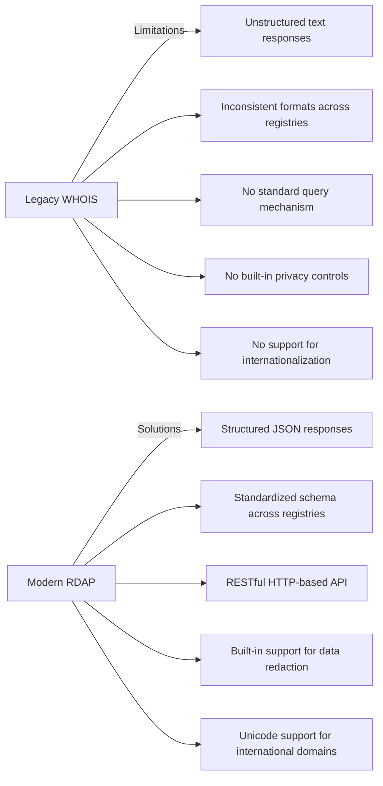
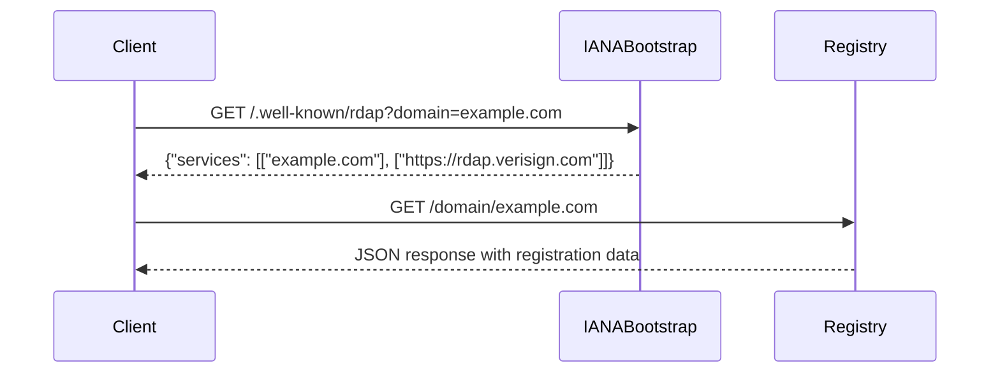

# ❓ What is RDAP?

> **🎯 Purpose:** Understand the Registration Data Access Protocol (RDAP) fundamentals, its advantages over WHOIS, and its role in internet infrastructure  
> **📚 Prerequisite:** Basic understanding of domain registration concepts  
> **⏱️ Reading Time:** 8 minutes  
> **🔍 Pro Tip:** For a hands-on introduction after reading this, try our [5-Minute Quick Start](../getting-started/five-minutes.md)

---

## 🌐 RDAP at a Glance

**RDAP (Registration Data Access Protocol)** is a modern, standardized protocol for querying registration data for internet resources (domains, IP addresses, and autonomous systems). Defined in [RFC 7480](https://tools.ietf.org/html/rfc7480) and related specifications, RDAP replaces the legacy WHOIS protocol with a more structured, machine-readable approach that better supports modern requirements for privacy, security, and internationalization.

Unlike WHOIS's text-based responses with inconsistent formats across registries, RDAP delivers structured JSON data with standardized field names, relationships between entities, and built-in support for international character sets.

```json
{
  "domain": "example.com",
  "handle": "12345678_DOMAIN_COM-VRSN",
  "ldhName": "example.com",
  "unicodeName": "example.com",
  "status": ["client delete prohibited", "client transfer prohibited", "client update prohibited"],
  "entities": [
    {
      "handle": "IANA",
      "roles": ["registrar"],
      "vcardArray": [
        "vcard",
        [
          ["version", {}, "text", "4.0"],
          ["fn", {}, "text", "Internet Assigned Numbers Authority"],
          ["kind", {}, "text", "individual"]
        ]
      ]
    }
  ]
}
```

---

## ⚖️ RDAP vs WHOIS: The Evolution of Registration Data Access



### Key Differences

| Feature | WHOIS | RDAP |
|---------|-------|------|
| **Protocol** | Text-based, custom protocol | HTTP/HTTPS with REST principles |
| **Response Format** | Unstructured text, varies by registry | Standardized JSON |
| **Query Method** | WHOIS port 43 or web forms | REST API endpoints |
| **Data Structure** | Flat, inconsistent fields | Hierarchical entities with relationships |
| **Internationalization** | Limited ASCII support | Full Unicode support |
| **Privacy Controls** | None built-in | Standardized redaction mechanisms |
| **Bootstrap Discovery** | Manual configuration | Automatic discovery via IANA |
| **Rate Limiting** | Ad-hoc implementation | Standardized headers and error codes |

---

## 🔧 How RDAP Works: Technical Deep Dive

### 1. Bootstrap Discovery Process
RDAP uses a two-step discovery process to find the authoritative registry for a resource:



1. The client queries the IANA bootstrap server to discover which registry manages the domain
2. The bootstrap server returns the base URL for the authoritative RDAP server
3. The client queries the registry's RDAP server for the specific resource
4. The registry returns structured registration data in JSON format

### 2. RDAP Response Structure
RDAP responses follow a consistent JSON structure defined in RFCs:

```typescript
interface RDAPResponse {
  // Resource-specific fields
  domain?: string;
  handle?: string;
  ipRange?: string;
  asn?: number;
  
  // Common fields
  status?: string[];
  events?: {
    action: string; // registration, last changed, expiration
    date: string;  // ISO 8601 date
  }[];
  
  // Related entities (registrars, registrants, contacts)
  entities?: {
    handle: string;
    roles: string[]; // registrant, registrar, admin, tech, billing
    vcardArray: any[]; // Contact information in vCard format
  }[];
  
  // Nameservers for domains
  nameservers?: {
    ldhName: string;
    unicodeName?: string;
  }[];
  
  // Links to related resources
  links?: {
    href: string;
    rel: string; // self, alternate, related
    type?: string; // application/rdap+json
    value?: string;
  }[];
}
```

### 3. Security and Privacy Features
RDAP includes several built-in mechanisms for security and privacy:

- **Standardized Redaction**: Fields containing personal data can be redacted with consistent markers
- **Rate Limiting**: Standard HTTP headers (`Retry-After`, `X-RateLimit-Limit`) for fair usage
- **Authentication**: Optional bearer token authentication for privileged access
- **Data Minimization**: Responses contain only necessary data fields
- **Purpose Limitation**: Some registries require query justification for full data access

---

## 🌍 RDAP Ecosystem and Adoption

### Registry Support
RDAP adoption varies across different registries:

| Registry Type | RDAP Support | Notes |
|---------------|--------------|-------|
| **gTLDs** | 100% required | ICANN mandates RDAP for all new gTLDs |
| **ccTLDs** | ~70% | Varies by country, growing adoption |
| **IP Registries** | 100% | ARIN, RIPE NCC, APNIC, LACNIC, AFRINIC all support RDAP |
| **ASN Registries** | 100% | Same as IP registries |

### Global Bootstrap Infrastructure
RDAP relies on IANA-maintained bootstrap data:

- **Domain bootstrap**: `https://data.iana.org/rdap/dns.json`
- **IP bootstrap**: `https://data.iana.org/rdap/ip.json`
- **ASN bootstrap**: `https://data.iana.org/rdap/asn.json`

These JSON files map resource types to their authoritative RDAP servers.

---

## ⚠️ Challenges with Raw RDAP Implementation

Working directly with RDAP presents several challenges:

### 1. Registry-Specific Variations
Despite standardization efforts, registries implement RDAP with variations:
- Different levels of data completeness
- Custom extensions beyond the RFC specifications
- Inconsistent handling of privacy redactions
- Varying rate limiting policies

### 2. Complex Data Normalization
RDAP responses require significant processing:
- Converting vCard data to usable formats
- Handling multi-registry lookups for complex domains
- Normalizing inconsistent field names and structures
- Managing relationships between entities

### 3. Privacy Compliance Complexity
Direct RDAP implementation requires:
- Understanding GDPR/CCPA implications of data access
- Implementing proper data minimization practices
- Managing data retention policies
- Ensuring secure storage of sensitive information

### 4. Reliability Concerns
Production RDAP usage needs:
- Caching strategies to reduce registry load
- Fallback mechanisms for unavailable registries
- Rate limiting to avoid blocks
- Error handling for the many edge cases

---

## 🛠️ How RDAPify Solves These Challenges

RDAPify abstracts away RDAP complexity while maintaining privacy and compliance:

### 1. Unified Interface
```javascript
// With RDAPify: consistent interface regardless of registry
import { RDAPClient } from 'rdapify';

const client = new RDAPClient({ redactPII: true });
const domainData = await client.domain('example.com');
const ipData = await client.ip('8.8.8.8');
const asnData = await client.asn(15169);
```

### 2. Automatic Normalization
RDAPify transforms registry-specific responses into a consistent data model:
- Converts vCard data to standard JavaScript objects
- Normalizes field names and structures across registries
- Resolves entity relationships automatically
- Handles Unicode/IDN conversions seamlessly

### 3. Privacy-by-Default Design
```javascript
const client = new RDAPClient({
  redactPII: true, // Enabled by default
  cacheOptions: {
    redactBeforeStore: true // Redact before caching
  }
});
```
- Automatic PII redaction following GDPR/CCPA guidelines
- Configurable redaction policies
- Audit logging for data access
- Data retention controls

### 4. Production-Ready Reliability
- Intelligent caching with Redis/Memory support
- Automatic rate limiting and retries
- Fallback mechanisms for registry failures
- Performance optimization for high-volume queries

---

## 🔮 The Future of RDAP

RDAP continues to evolve to meet modern internet needs:

### Emerging Standards
- **RDAP Partial Response** (RFC 9083): Request only needed fields
- **RDAP Query Extensions** (RFC 9535): Enhanced search capabilities
- **RDAP Object Tags** (draft): Machine-readable data classification
- **RDAP Security Extensions** (draft): Enhanced authentication methods

### Privacy Evolution
- **Tiered Access Models**: Different data levels based on query justification
- **Purpose-Limited Access**: API tokens tied to specific use cases
- **Enhanced Redaction Standards**: More granular control over sensitive data

### Performance Improvements
- **Bulk Query Support**: Fetch multiple resources in single requests
- **Push Notifications**: Registry-initiated updates for watched resources
- **CDN Integration**: Distributed caching for high-availability lookups

---

## 💡 Practical Example: RDAP in Action

Let's see a complete example of RDAP data retrieval with RDAPify:

```javascript
import { RDAPClient } from 'rdapify';

async function checkDomainSecurity(domain) {
  const client = new RDAPClient({ 
    redactPII: true,
    cacheOptions: { ttl: 3600 } // 1 hour cache
  });
  
  try {
    // Get domain registration data
    const result = await client.domain(domain);
    
    // Extract security-relevant information
    const securityInfo = {
      domain: result.domain,
      registrar: result.registrar?.name || 'REDACTED',
      creationDate: result.events.find(e => e.action === 'registration')?.date,
      lastChanged: result.events.find(e => e.action === 'last changed')?.date,
      nameServers: result.nameservers.map(ns => ns.hostname),
      status: result.status
    };
    
    // Check for security indicators
    const isRecentlyRegistered = new Date(securityInfo.creationDate) > new Date(Date.now() - 30 * 86400000); // 30 days
    const hasSuspiciousStatus = securityInfo.status.some(s => s.includes('hold') || s.includes('lock'));
    
    return {
      ...securityInfo,
      securityAssessment: {
        recentlyRegistered: isRecentlyRegistered,
        suspiciousStatus: hasSuspiciousStatus,
        riskScore: (isRecentlyRegistered ? 50 : 0) + (hasSuspiciousStatus ? 30 : 0)
      }
    };
  } catch (error) {
    console.error(`Error checking domain ${domain}:`, error);
    throw new Error(`Domain security check failed: ${error.message}`);
  }
}

// Usage
checkDomainSecurity('example.com')
  .then(result => console.log('Security assessment:', result))
  .catch(error => console.error('Operation failed:', error));
```

This example demonstrates how RDAP data can be used for security purposes while maintaining privacy protections.

---

## 📚 Learning More

### Official Standards
- [RFC 7480: JSON Responses for RDAP](https://tools.ietf.org/html/rfc7480)
- [RFC 7481: Security Services for RDAP](https://tools.ietf.org/html/rfc7481)
- [RFC 7482: Domain Name Query Format](https://tools.ietf.org/html/rfc7482)
- [RFC 7483: IP Address and Autonomous System Query Format](https://tools.ietf.org/html/rfc7483)
- [RFC 7484: Finding the Authoritative RDAP Server](https://tools.ietf.org/html/rfc7484)

### Related RDAPify Documentation
- [RDAP vs WHOIS Comparison Guide](./rdap-vs-whois.md)
- [Architecture Overview](./architecture.md)
- [Data Normalization Process](./normalization.md)
- [Bootstrap Discovery Mechanism](./discovery.md)
- [Privacy Controls Guide](../api-reference/privacy-controls.md)

### Community Resources
- [IANA RDAP Bootstrap Service](https://www.iana.org/assignments/rdap-dns/rdap-dns.xhtml)
- [ICANN RDAP Policy](https://www.icann.org/rdap)
- [RDAP Technical Forum](https://mm.icann.org/pipermail/rdap/)
- [RDAP Implementers' Guide](https://github.com/RIPE-NCC/rdap-implementation-guide)

---

> **🔐 Privacy Reminder:** While RDAP provides structured access to registration data, this data often contains personal information protected by regulations worldwide. RDAPify provides tools for compliance, but developers remain responsible for proper usage in their application context. Always enable PII redaction unless you have a documented legal basis for full data access.

[← Back to Core Concepts](../core-concepts/README.md) | [Next: RDAP vs WHOIS →](./rdap-vs-whois.md)

*Document last updated: December 5, 2025*  
*RDAPify version referenced: 2.3.0*  
*Standards compliance: RFC 7480 series*