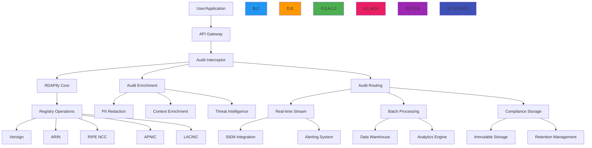

# Audit Logging Architecture

🎯 **Purpose**: Comprehensive guide for implementing enterprise-grade audit logging systems with RDAPify to ensure regulatory compliance, security monitoring, and operational visibility for registration data processing  
📚 **Related**: [Multi-Tenant Architecture](multi_tenant.md) | [SLA Support](sla_support.md) | [Data Residency](../../security/data_residency.md) | [Compliance Framework](../../security/compliance_framework.md)  
⏱️ **Reading Time**: 8 minutes  
🔍 **Pro Tip**: Use the [Audit Log Validator](../../playground/audit-log-validator.md) to automatically verify your audit logging implementation meets regulatory requirements before production deployment

## 🌐 Audit Logging Architecture Overview

RDAPify provides a unified audit logging architecture that captures comprehensive activity trails while maintaining strict compliance boundaries and performance characteristics:



### Core Audit Logging Principles
✅ **Immutable Records**: Audit logs cannot be modified or deleted once written  
✅ **Compliance Boundaries**: Jurisdiction-specific logging requirements applied at source  
✅ **Context Preservation**: Complete context including user identity, permissions, and session details  
✅ **PII Protection**: Automatic redaction of personally identifiable information in audit trails  
✅ **Tamper Evidence**: Cryptographic signatures and chain of custody for forensic integrity  
✅ **Regulatory Alignment**: Pre-configured templates for GDPR, CCPA, SOC 2, ISO 27001 requirements  

## ⚙️ Implementation Patterns

### 1. Audit Event Processing Engine
```typescript
// src/enterprise/audit-engine.ts
import { AuditEvent, ComplianceContext, SecurityContext } from '../types';
import { PIIRedactionEngine } from '../security/pii-redaction';
import { ThreatIntelligenceService } from '../security/threat-intelligence';
import { ComplianceEngine } from '../security/compliance';

export class AuditEngine {
  private piiRedaction: PIIRedactionEngine;
  private threatIntelligence: ThreatIntelligenceService;
  private complianceEngine: ComplianceEngine;
  private auditLoggers = new Map<string, AuditLogger>();
  
  constructor(options: {
    piiRedaction?: PIIRedactionEngine;
    threatIntelligence?: ThreatIntelligenceService;
    complianceEngine?: ComplianceEngine;
    loggers?: Record<string, AuditLogger>;
  } = {}) {
    this.piiRedaction = options.piiRedaction || new PIIRedactionEngine();
    this.threatIntelligence = options.threatIntelligence || new ThreatIntelligenceService();
    this.complianceEngine = options.complianceEngine || new ComplianceEngine();
    
    // Initialize default loggers
    this.initializeLoggers(options.loggers || {});
  }
  
  private initializeLoggers(loggers: Record<string, AuditLogger>) {
    // Real-time logger for security events
    this.auditLoggers.set('security', loggers.security || new SecurityAuditLogger());
    
    // Compliance logger for regulatory requirements
    this.auditLoggers.set('compliance', loggers.compliance || new ComplianceAuditLogger());
    
    // Operational logger for system monitoring
    this.auditLoggers.set('operational', loggers.operational || new OperationalAuditLogger());
    
    // Debug logger for development environments
    if (process.env.NODE_ENV !== 'production') {
      this.auditLoggers.set('debug', loggers.debug || new DebugAuditLogger());
    }
  }
  
  async processAuditEvent(event: AuditEvent, context: AuditContext): Promise<AuditResult> {
    try {
      // Enrich event with contextual information
      const enrichedEvent = await this.enrichAuditEvent(event, context);
      
      // Apply compliance transformations
      const compliantEvent = await this.complianceEngine.applyComplianceTransformations(enrichedEvent, context);
      
      // Route to appropriate loggers
      const results = await Promise.all(
        Array.from(this.auditLoggers.entries()).map(([type, logger]) => 
          this.routeToLogger(type, logger, compliantEvent, context)
        )
      );
      
      // Generate audit result
      return this.generateAuditResult(results, compliantEvent, context);
    } catch (error) {
      // Fallback to emergency logging
      await this.emergencyLogging(event, context, error);
      throw error;
    }
  }
  
  private async enrichAuditEvent(event: AuditEvent, context: AuditContext): Promise<EnrichedAuditEvent> {
    const enriched: EnrichedAuditEvent = {
      ...event,
      timestamp: event.timestamp || new Date().toISOString(),
      eventId: `audit-${Date.now()}-${Math.random().toString(36).slice(2, 8)}`,
      context: {
        ...context,
        // Add session context
        sessionId: context.sessionId || this.generateSessionId(),
        // Add user context
        userIdentity: await this.getUserIdentity(context),
        // Add system context
        systemInfo: this.getSystemInfo(),
        // Add threat context
        threatScore: await this.threatIntelligence.getThreatScore(event, context),
        // Add compliance context
        complianceLevel: this.getComplianceLevel(context)
      }
    };
    
    // Apply PII redaction
    enriched.context.redactedData = await this.piiRedaction.redactAuditData(enriched, context);
    
    // Add digital signature
    enriched.signature = await this.signAuditEvent(enriched);
    
    return enriched;
  }
  
  private async routeToLogger(
    type: string, 
    logger: AuditLogger, 
     EnrichedAuditEvent, 
    context: AuditContext
  ): Promise<LoggerResult> {
    try {
      // Check if logger should process this event type
      if (!this.shouldLoggerProcessEvent(type, event, context)) {
        return { type, success: true, skipped: true };
      }
      
      // Apply logger-specific transformations
      const transformedEvent = await this.applyLoggerTransformations(type, event, context);
      
      // Log the event
      await logger.log(transformedEvent, context);
      
      return { type, success: true, processed: true };
    } catch (error) {
      console.error(`Audit logger ${type} failed:`, error.message);
      
      // Log failure to emergency channel
      await this.logLoggerFailure(type, event, context, error);
      
      return { 
        type, 
        success: false, 
        error: error.message.substring(0, 100),
        timestamp: new Date().toISOString()
      };
    }
  }
  
  private shouldLoggerProcessEvent(type: string, event: AuditEvent, context: AuditContext): boolean {
    const loggerConfig = this.getLoggerConfig(type);
    
    // Check event types
    if (loggerConfig.eventTypes && !loggerConfig.eventTypes.includes(event.type)) {
      return false;
    }
    
    // Check compliance levels
    if (loggerConfig.minComplianceLevel && 
        this.getComplianceLevelValue(context) < this.getComplianceLevelValue(loggerConfig.minComplianceLevel)) {
      return false;
    }
    
    // Check threat thresholds
    if (loggerConfig.minThreatScore && event.threatScore && event.threatScore < loggerConfig.minThreatScore) {
      return false;
    }
    
    return true;
  }
  
  private async applyLoggerTransformations(
    type: string, 
     EnrichedAuditEvent, 
    context: AuditContext
  ): Promise<EnrichedAuditEvent> {
    const transformations = this.getLoggerTransformations(type);
    
    let transformed = { ...event };
    
    for (const transform of transformations) {
      switch (transform) {
        case 'anonymize_ip':
          transformed.context.clientIP = this.anonymizeIP(transformed.context.clientIP);
          break;
        case 'remove_raw_responses':
          if (transformed.data && 'rawResponse' in transformed.data) {
            delete transformed.data.rawResponse;
          }
          break;
        case 'add_business_context':
          transformed.businessContext = await this.getBusinessContext(event, context);
          break;
        case 'add_geolocation':
          transformed.geoContext = await this.getGeoLocation(transformed.context.clientIP);
          break;
      }
    }
    
    return transformed;
  }
  
  private async signAuditEvent(event: EnrichedAuditEvent): Promise<AuditSignature> {
    // Generate event hash
    const eventHash = this.generateEventHash(event);
    
    // Sign with private key
    const signature = await this.crypto.sign(eventHash, process.env.AUDIT_PRIVATE_KEY!);
    
    return {
      algorithm: 'SHA256withRSA',
      signature,
      publicKey: process.env.AUDIT_PUBLIC_KEY!,
      timestamp: new Date().toISOString(),
      previousHash: this.getPreviousEventHash(event.tenantId)
    };
  }
  
  private generateEventHash(event: EnrichedAuditEvent): string {
    // Create canonical representation
    const canonical = JSON.stringify({
      eventId: event.eventId,
      timestamp: event.timestamp,
      type: event.type,
       event.data,
      context: event.context
    }, Object.keys(event).sort());
    
    return require('crypto').createHash('sha256').update(canonical).digest('hex');
  }
  
  async emergencyLogging(event: AuditEvent, context: AuditContext, error: Error): Promise<void> {
    try {
      console.error('🚨 EMERGENCY AUDIT LOGGING:', {
        eventId: `emergency-${Date.now()}`,
        originalEvent: event,
        context,
        error: error.message,
        stack: error.stack?.split('\n').slice(0, 5).join('\n'),
        timestamp: new Date().toISOString()
      });
      
      // Attempt to write to emergency log file
      const fs = require('fs');
      const emergencyLog = {
        timestamp: new Date().toISOString(),
        eventId: `emergency-${Date.now()}`,
        error: error.message,
        originalEvent: JSON.stringify(event),
        context: JSON.stringify(context)
      };
      
      fs.appendFileSync('/var/log/rdapify/emergency-audit.log', JSON.stringify(emergencyLog) + '\n');
    } catch (emergencyError) {
      console.error('💥 EMERGENCY LOGGING FAILED:', emergencyError.message);
      // Final fallback to stderr
      process.stderr.write(`EMERGENCY AUDIT FAILURE: ${emergencyError.message}\n`);
    }
  }
  
  private getComplianceLevel(context: AuditContext): string {
    if (context.jurisdiction === 'EU') return 'gdpr';
    if (context.jurisdiction === 'US-CA') return 'ccpa';
    return 'standard';
  }
  
  private getComplianceLevelValue(level: string): number {
    const levels: Record<string, number> = {
      'debug': 1,
      'operational': 2,
      'standard': 3,
      'compliance': 4,
      'gdpr': 5,
      'ccpa': 5,
      'soc2': 5,
      'iso27001': 5
    };
    return levels[level.toLowerCase()] || 3;
  }
}
```

### 2. Immutable Audit Storage System
```typescript
// src/enterprise/immutable-storage.ts
export class ImmutableAuditStorage {
  private storageAdapters = new Map<string, StorageAdapter>();
  private retentionPolicies = new Map<string, RetentionPolicy>();
  private writeConfirmations = new Map<string, WriteConfirmation>();
  
  constructor(options: {
    adapters?: Record<string, StorageAdapter>;
    retentionPolicies?: Record<string, RetentionPolicy>;
  } = {}) {
    this.loadStorageAdapters(options.adapters || {});
    this.loadRetentionPolicies(options.retentionPolicies || {});
  }
  
  private loadStorageAdapters(adapters: Record<string, StorageAdapter>) {
    // Primary storage (immediate write)
    this.storageAdapters.set('primary', adapters.primary || new WORMStorageAdapter({
      path: process.env.AUDIT_PRIMARY_STORAGE || '/var/lib/rdapify/audit/primary',
      type: 'worm' // Write-once-read-many
    }));
    
    // Secondary storage (asynchronous replication)
    this.storageAdapters.set('secondary', adapters.secondary || new EncryptedStorageAdapter({
      endpoint: process.env.AUDIT_SECONDARY_STORAGE || 'https://audit-backup.example.com',
      encryptionKey: process.env.SECONDARY_STORAGE_KEY,
      replicationDelay: '5m'
    }));
    
    // Tertiary storage (long-term compliance)
    this.storageAdapters.set('tertiary', adapters.tertiary || new CloudComplianceStorageAdapter({
      provider: 'aws',
      bucket: process.env.AUDIT_TERTIARY_BUCKET || 'rdapify-compliance-audit',
      region: process.env.AUDIT_TERTIARY_REGION || 'us-east-1',
      complianceMode: true,
      legalHoldEnabled: true
    }));
  }
  
  private loadRetentionPolicies(policies: Record<string, RetentionPolicy>) {
    // GDPR retention policy
    this.retentionPolicies.set('gdpr', {
      retentionPeriod: '13 months',
      deletionMethod: 'cryptographic-shred',
      auditRequired: true,
      legalHoldOverride: true
    });
    
    // CCPA retention policy
    this.retentionPolicies.set('ccpa', {
      retentionPeriod: '24 months',
      deletionMethod: 'secure-erase',
      auditRequired: true,
      legalHoldOverride: true
    });
    
    // SOC 2 retention policy
    this.retentionPolicies.set('soc2', {
      retentionPeriod: '36 months',
      deletionMethod: 'cryptographic-shred',
      auditRequired: true,
      legalHoldOverride: true
    });
    
    // Default retention policy
    this.retentionPolicies.set('default', {
      retentionPeriod: '24 months',
      deletionMethod: 'secure-erase',
      auditRequired: true,
      legalHoldOverride: true
    });
    
    // Apply custom policies
    Object.entries(policies).forEach(([key, policy]) => {
      this.retentionPolicies.set(key, policy);
    });
  }
  
  async storeAuditRecords(records: AuditRecord[], context: StorageContext): Promise<StorageResult> {
    const result: StorageResult = {
      timestamp: new Date().toISOString(),
      totalRecords: records.length,
      successfulWrites: 0,
      failedWrites: 0,
      storageDetails: {}
    };
    
    // Group records by tenant and compliance requirement
    const tenantGroups = this.groupRecordsByTenant(records, context);
    
    for (const [tenantId, tenantRecords] of Object.entries(tenantGroups)) {
      const tenantContext = {
        ...context,
        tenantId,
        jurisdiction: this.getTenantJurisdiction(tenantId),
        complianceLevel: this.getTenantComplianceLevel(tenantId)
      };
      
      // Get retention policy for tenant
      const retentionPolicy = this.getRetentionPolicy(tenantContext);
      
      // Process records in batches
      const batchSize = 100;
      for (let i = 0; i < tenantRecords.length; i += batchSize) {
        const batch = tenantRecords.slice(i, i + batchSize);
        
        try {
          // Write to primary storage
          const primaryResult = await this.writeToPrimaryStorage(batch, tenantContext, retentionPolicy);
          
          // Queue for secondary and tertiary storage
          this.queueForReplication(batch, tenantContext, retentionPolicy);
          
          result.successfulWrites += batch.length;
          result.storageDetails[tenantId] = {
            ...result.storageDetails[tenantId],
            primary: (result.storageDetails[tenantId]?.primary || 0) + primaryResult.count
          };
        } catch (error) {
          console.error(`Storage failed for tenant ${tenantId}:`, error.message);
          result.failedWrites += batch.length;
          
          // Trigger emergency storage
          await this.emergencyStorage(batch, tenantContext, error);
        }
      }
    }
    
    // Generate write confirmation
    const confirmationId = await this.generateWriteConfirmation(records, context);
    result.confirmationId = confirmationId;
    
    return result;
  }
  
  private async writeToPrimaryStorage(
    records: AuditRecord[], 
    context: StorageContext, 
    policy: RetentionPolicy
  ): Promise<WriteResult> {
    const adapter = this.storageAdapters.get('primary');
    if (!adapter) throw new Error('Primary storage adapter not configured');
    
    // Prepare records for storage
    const preparedRecords = records.map(record => ({
      ...record,
      storedAt: new Date().toISOString(),
      retentionPolicy: policy,
      cryptographicHash: this.generateRecordHash(record),
      tenantId: context.tenantId
    }));
    
    // Write records
    const writeResult = await adapter.write(preparedRecords);
    
    // Verify write integrity
    const verificationResult = await this.verifyWriteIntegrity(writeResult, preparedRecords);
    
    if (!verificationResult.valid) {
      throw new Error(`Write integrity verification failed: ${verificationResult.reason}`);
    }
    
    return writeResult;
  }
  
  private queueForReplication(
    records: AuditRecord[], 
    context: StorageContext, 
    policy: RetentionPolicy
  ) {
    // Create replication tasks
    const replicationTasks = [
      {
        target: 'secondary',
        records,
        context,
        priority: 'high',
        retryPolicy: { maxAttempts: 5, backoff: 'exponential' }
      },
      {
        target: 'tertiary',
        records,
        context,
        priority: 'normal',
        retryPolicy: { maxAttempts: 3, backoff: 'linear' }
      }
    ];
    
    // Add to replication queue
    this.replicationQueue.addTasks(replicationTasks);
  }
  
  private async verifyWriteIntegrity(result: WriteResult, records: AuditRecord[]): Promise<VerificationResult> {
    const adapter = this.storageAdapters.get('primary');
    if (!adapter) return { valid: true };
    
    // Read back a sample of records
    const sampleSize = Math.min(10, records.length);
    const sampleRecords = records.slice(0, sampleSize);
    
    try {
      const readResults = await Promise.all(
        sampleRecords.map(record => adapter.read(record.id))
      );
      
      // Verify cryptographic hashes
      for (let i = 0; i < readResults.length; i++) {
        const original = sampleRecords[i];
        const read = readResults[i];
        
        if (!read) {
          return { valid: false, reason: `Record ${original.id} not found after write` };
        }
        
        const originalHash = this.generateRecordHash(original);
        const readHash = this.generateRecordHash(read);
        
        if (originalHash !== readHash) {
          return { 
            valid: false, 
            reason: `Hash mismatch for record ${original.id}: ${originalHash} vs ${readHash}` 
          };
        }
      }
      
      return { valid: true };
    } catch (error) {
      return { 
        valid: false, 
        reason: `Verification failed: ${error.message}` 
      };
    }
  }
  
  private generateRecordHash(record: AuditRecord): string {
    // Create canonical representation
    const canonical = JSON.stringify({
      id: record.id,
      timestamp: record.timestamp,
      type: record.type,
      data: record.data,
      context: record.context,
      signature: record.signature
    }, Object.keys(record).sort());
    
    return require('crypto').createHash('sha256').update(canonical).digest('hex');
  }
  
  private getRetentionPolicy(context: StorageContext): RetentionPolicy {
    const policies = [
      context.jurisdiction === 'EU' ? 'gdpr' : null,
      context.jurisdiction === 'US-CA' ? 'ccpa' : null,
      context.complianceLevel === 'soc2' ? 'soc2' : null,
      context.complianceLevel === 'iso27001' ? 'iso27001' : null
    ].filter(Boolean);
    
    // Return most stringent policy
    return policies.reduce((strictest, policyKey) => {
      const policy = this.retentionPolicies.get(policyKey) || this.retentionPolicies.get('default')!;
      const strictestMonths = this.parseMonths(strictest.retentionPeriod);
      const policyMonths = this.parseMonths(policy.retentionPeriod);
      return policyMonths > strictestMonths ? policy : strictest;
    }, this.retentionPolicies.get('default')!);
  }
  
  private parseMonths(period: string): number {
    const match = period.match(/(\d+)\s*(months?|years?)/i);
    if (!match) return 24;
    
    const value = parseInt(match[1]);
    return match[2].startsWith('year') ? value * 12 : value;
  }
  
  async generateWriteConfirmation(records: AuditRecord[], context: StorageContext): Promise<string> {
    const confirmation: WriteConfirmation = {
      id: `confirmation-${Date.now()}-${Math.random().toString(36).slice(2, 8)}`,
      timestamp: new Date().toISOString(),
      recordCount: records.length,
      recordIds: records.map(r => r.id),
      storageLocations: Object.fromEntries(
        Array.from(this.storageAdapters.keys()).map(adapter => [adapter, true])
      ),
      cryptographicHash: this.generateBatchHash(records),
      retentionPolicy: this.getRetentionPolicy(context),
      legalHoldStatus: 'active'
    };
    
    // Store confirmation
    await this.storageAdapters.get('primary')?.write([{
      id: confirmation.id,
      type: 'write_confirmation',
      timestamp: confirmation.timestamp,
       confirmation,
      context: { tenantId: context.tenantId }
    }]);
    
    this.writeConfirmations.set(confirmation.id, confirmation);
    
    return confirmation.id;
  }
  
  private generateBatchHash(records: AuditRecord[]): string {
    const hashes = records.map(r => this.generateRecordHash(r));
    const combined = hashes.sort().join('|');
    return require('crypto').createHash('sha256').update(combined).digest('hex');
  }
  
  async getAuditRecords(query: AuditQuery, context: StorageContext): Promise<AuditRecord[]> {
    // Determine which storage adapter to use based on query time range
    const adapter = this.getStorageAdapterForQuery(query);
    
    // Apply compliance filters
    const filteredQuery = this.applyComplianceFilters(query, context);
    
    // Get records from storage
    const records = await adapter.query(filteredQuery);
    
    // Apply PII redaction for the requester's context
    return this.applyPIIRedaction(records, context);
  }
  
  private getStorageAdapterForQuery(query: AuditQuery): StorageAdapter {
    const now = new Date();
    const queryDate = query.startTime ? new Date(query.startTime) : now;
    const timeDiff = now.getTime() - queryDate.getTime();
    
    // Use primary storage for recent queries (last 30 days)
    if (timeDiff < 30 * 24 * 60 * 60 * 1000) {
      return this.storageAdapters.get('primary')!;
    }
    
    // Use secondary storage for medium-term queries (30-90 days)
    if (timeDiff < 90 * 24 * 60 * 60 * 1000) {
      return this.storageAdapters.get('secondary')!;
    }
    
    // Use tertiary storage for historical queries (90+ days)
    return this.storageAdapters.get('tertiary')!;
  }
  
  private applyComplianceFilters(query: AuditQuery, context: StorageContext): AuditQuery {
    const filteredQuery = { ...query };
    
    // Apply data minimization based on context
    if (context.role !== 'compliance_officer' && context.role !== 'security_admin') {
      // Remove sensitive fields for non-privileged users
      filteredQuery.excludeFields = [
        ...(filteredQuery.excludeFields || []),
        'rawRequest',
        'rawResponse',
        'piiElements',
        'securityDetails'
      ];
    }
    
    // Apply tenant filtering
    if (context.tenantId) {
      filteredQuery.tenantId = context.tenantId;
    }
    
    // Apply jurisdiction filtering
    if (context.jurisdiction) {
      filteredQuery.jurisdiction = context.jurisdiction;
    }
    
    return filteredQuery;
  }
  
  private applyPIIRedaction(records: AuditRecord[], context: StorageContext): AuditRecord[] {
    return records.map(record => {
      // Skip redaction for system context
      if (context.systemContext) return record;
      
      // Apply PII redaction based on role and permissions
      if (context.role !== 'compliance_officer' && context.role !== 'security_admin') {
        return {
          ...record,
           this.piiRedactionEngine.redact(record.data, context),
          context: {
            ...record.context,
            clientIP: this.anonymizeIP(record.context.clientIP),
            userIdentity: this.redactUserIdentity(record.context.userIdentity, context)
          }
        };
      }
      
      return record;
    });
  }
}
```

## 🔒 Security and Compliance Controls

### 1. GDPR-Compliant Audit Processing
```typescript
// src/enterprise/gdpr-audit-processing.ts
export class GDPRCompliantAuditProcessor {
  private dpoContact: string;
  private dataSubjectRights = new Map<string, DataSubjectRights>();
  private processingRecords = new Map<string, ProcessingRecord>();
  
  constructor(options: {
    dpoContact: string;
    dataSubjectRights?: Record<string, DataSubjectRights>;
    processingRecords?: Record<string, ProcessingRecord>;
  } = { dpoContact: 'dpo@company.com' }) {
    this.dpoContact = options.dpoContact;
    
    // Load default data subject rights
    this.dataSubjectRights.set('default', {
      accessRight: true,
      rectificationRight: true,
      erasureRight: true,
      portabilityRight: true,
      objectionRight: true,
      automatedDecisionMaking: false,
      contactInformation: {
        email: this.dpoContact,
        phone: '+1-555-GDPR-DPO',
        address: 'Data Protection Office, 123 Privacy Street, Compliance City'
      }
    });
    
    // Apply custom rights
    Object.entries(options.dataSubjectRights || {}).forEach(([key, rights]) => {
      this.dataSubjectRights.set(key, rights);
    });
    
    // Initialize processing records
    Object.entries(options.processingRecords || {}).forEach(([key, record]) => {
      this.processingRecords.set(key, record);
    });
  }
  
  async processGDPRCompliantAudit(event: AuditEvent, context: GDPRContext): Promise<GDPRAuditEvent> {
    // Apply GDPR Article 6 lawful basis verification
    const lawfulBasis = this.verifyLawfulBasis(context);
    if (!lawfulBasis.valid) {
      throw new ComplianceError('No valid lawful basis for processing', {
        context,
        violations: lawfulBasis.violations
      });
    }
    
    // Apply GDPR Article 5 data minimization
    const minimizedEvent = this.applyDataMinimization(event, context);
    
    // Apply GDPR Article 32 security measures
    const securedEvent = this.applySecurityMeasures(minimizedEvent, context);
    
    // Record processing activity for GDPR Article 30
    await this.recordProcessingActivity(securedEvent, context, lawfulBasis);
    
    // Add GDPR-specific metadata
    return {
      ...securedEvent,
      gdprMeta {
        lawfulBasis: lawfulBasis.basis,
        dataMinimizationApplied: true,
        retentionPeriod: `${this.getRetentionPeriod(context)} days`,
        dpoContact: this.dpoContact,
        dataSubjectRights: this.getDataSubjectRights(context),
        processingRecords: this.getProcessingRecords(context)
      }
    };
  }
  
  private verifyLawfulBasis(context: GDPRContext): LawfulBasisResult {
    // GDPR Article 6 lawful bases
    const bases = [
      { basis: 'consent', valid: context.consent?.given },
      { basis: 'contract', valid: context.contract?.exists },
      { basis: 'legal-obligation', valid: context.legalObligation?.exists },
      { basis: 'legitimate-interest', valid: this.validateLegitimateInterest(context) }
    ];
    
    const validBasis = bases.find(b => b.valid);
    if (validBasis) {
      return {
        valid: true,
        basis: validBasis.basis,
        documentation: this.getLawfulBasisDocumentation(validBasis.basis, context)
      };
    }
    
    return {
      valid: false,
      violations: [
        'No valid lawful basis under GDPR Article 6',
        'Consider obtaining explicit consent or establishing contractual necessity',
        'Audit logging without legal basis violates GDPR Article 6(1)'
      ]
    };
  }
  
  private validateLegitimateInterest(context: GDPRContext): boolean {
    // Legitimate interest assessment (LIA) for audit logging
    const legitimateInterests = [
      'security_monitoring',
      'fraud_prevention',
      'system_integrity',
      'network_protection',
      'compliance_verification'
    ];
    
    return legitimateInterests.some(purpose => context.purposes?.includes(purpose));
  }
  
  private getLawfulBasisDocumentation(basis: string, context: GDPRContext): string {
    switch (basis) {
      case 'consent':
        return `Explicit consent obtained on ${context.consent?.timestamp} with reference ${context.consent?.id}`;
      case 'contract':
        return `Processing necessary for contract with ${context.contract?.party} under agreement ${context.contract?.reference}`;
      case 'legal-obligation':
        return `Processing required by ${context.legalObligation?.regulation} for ${context.legalObligation?.purpose}`;
      case 'legitimate-interest':
        return `Legitimate interest assessment performed on ${new Date().toISOString()} for security and compliance monitoring`;
      default:
        return 'No documentation available';
    }
  }
  
  private applyDataMinimization(event: AuditEvent, context: GDPRContext): AuditEvent {
    const minimized = { ...event };
    
    // Remove non-essential fields for GDPR compliance
    if (minimized.data) {
      // Keep only essential audit data
      const essentialFields = [
        'eventType',
        'status',
        'processingTime',
        'resultSummary',
        'errorCode'
      ];
      
      minimized.data = Object.fromEntries(
        Object.entries(minimized.data)
          .filter(([key]) => essentialFields.includes(key))
      );
    }
    
    // Remove raw request/response data
    if (minimized.context?.rawRequest) {
      delete minimized.context.rawRequest;
    }
    
    if (minimized.context?.rawResponse) {
      delete minimized.context.rawResponse;
    }
    
    // Anonymize IP addresses
    if (minimized.context?.clientIP) {
      minimized.context.clientIP = this.anonymizeIP(minimized.context.clientIP);
    }
    
    return minimized;
  }
  
  private applySecurityMeasures(event: AuditEvent, context: GDPRContext): AuditEvent {
    const secured = { ...event };
    
    // Add security metadata
    secured.context = {
      ...secured.context,
      encryptionApplied: true,
      accessControls: context.role,
      processingLocation: process.env.SERVER_LOCATION || 'unknown',
      timestamp: new Date().toISOString(),
      securityMeasures: ['encryption', 'access_controls', 'audit_logging', 'pseudonymization']
    };
    
    return secured;
  }
  
  private async recordProcessingActivity(
    event: AuditEvent, 
    context: GDPRContext, 
    basis: LawfulBasisResult
  ): Promise<void> {
    // GDPR Article 30 record of processing activities
    const record: ProcessingRecord = {
      timestamp: new Date().toISOString(),
      controller: context.controller || 'unknown',
      processor: 'RDAPify Audit System',
      purposes: context.purposes || ['security_monitoring', 'compliance_verification'],
      lawfulBasis: basis.basis,
      legalBasisDocumentation: basis.documentation,
      dataCategories: this.getDataCategories(event),
      recipients: context.recipients || ['audit_system'],
      retentionPeriod: `${this.getRetentionPeriod(context)} days`,
      securityMeasures: ['encryption', 'access_controls', 'audit_logging', 'pseudonymization'],
      dpoContact: this.dpoContact
    };
    
    this.processingRecords.set(event.eventId, record);
    
    // Store in secure storage
    await this.storage.storeProcessingRecord(record);
    
    // Log for DPO review
    this.dpoLogger.log('processing_record', record);
  }
  
  private getDataCategories(event: AuditEvent): string[] {
    const categories = new Set<string>();
    
    // Security categories
    categories.add('security_audit');
    categories.add('access_control');
    
    // System categories
    categories.add('system_monitoring');
    categories.add('error_logging');
    
    // Compliance categories
    categories.add('regulatory_compliance');
    
    return Array.from(categories);
  }
  
  private getRetentionPeriod(context: GDPRContext): number {
    // Default GDPR retention period
    const defaultPeriod = 30;
    
    // Adjust based on context
    if (context.criticality === 'high') {
      return 90; // High-risk systems require longer retention
    }
    
    if (context.jurisdiction === 'EU') {
      return defaultPeriod; // Standard GDPR period
    }
    
    // Custom periods from context
    return context.retentionPeriod || defaultPeriod;
  }
  
  private getDataSubjectRights(context: GDPRContext): DataSubjectRights {
    // Get rights based on context
    const rights = this.dataSubjectRights.get(context.tenantId) || 
                  this.dataSubjectRights.get('default')!;
    
    // Adjust based on context
    if (context.criticality === 'high') {
      return {
        ...rights,
        automatedDecisionMaking: false, // No automated decisions for high-risk systems
        erasureRight: 'restricted' // Restricted erasure for audit integrity
      };
    }
    
    return rights;
  }
  
  private getProcessingRecords(context: GDPRContext): ProcessingRecord[] {
    // Return relevant records for this context
    const records = Array.from(this.processingRecords.values())
      .filter(record => record.controller === context.controller);
    
    // Limit to most recent records if too many
    return records.slice(-100);
  }
  
  private anonymizeIP(ip: string): string {
    // Anonymize last octet for IPv4, last segment for IPv6
    if (ip.includes(':')) {
      // IPv6
      return ip.replace(/:[^:]+$/, ':xxxx');
    } else {
      // IPv4
      return ip.replace(/\.\d+$/, '.xxx');
    }
  }
  
  private redactUserIdentity(identity: any, context: GDPRContext): any {
    if (context.role === 'compliance_officer' || context.role === 'security_admin') {
      return identity; // Full identity for privileged roles
    }
    
    if (typeof identity === 'string') {
      // Simple anonymization
      return identity.replace(/(\w)\w+/, '$1***');
    }
    
    if (typeof identity === 'object' && identity !== null) {
      // Redact sensitive fields
      const redacted: any = { ...identity };
      
      if ('email' in redacted) {
        redacted.email = '[REDACTED]';
      }
      
      if ('name' in redacted) {
        redacted.name = '[REDACTED]';
      }
      
      if ('id' in redacted) {
        redacted.id = redacted.id.substring(0, 4) + '****';
      }
      
      return redacted;
    }
    
    return '[REDACTED]';
  }
}
```

### 2. Audit Log Integrity Verification
```typescript
// src/enterprise/integrity-verification.ts
export class AuditLogIntegrityVerifier {
  private signatureVerifier: SignatureVerifier;
  private blockchainService: BlockchainService;
  private merkleTrees = new Map<string, MerkleTree>();
  
  constructor(options: {
    signatureVerifier?: SignatureVerifier;
    blockchainService?: BlockchainService;
  } = {}) {
    this.signatureVerifier = options.signatureVerifier || new SignatureVerifier();
    this.blockchainService = options.blockchainService || new BlockchainService();
  }
  
  async verifyAuditIntegrity(eventId: string, context: VerificationContext): Promise<IntegrityVerificationResult> {
    try {
      // Get audit record
      const record = await this.storage.getAuditRecord(eventId);
      if (!record) {
        return {
          valid: false,
          eventId,
          reason: 'Record not found',
          timestamp: new Date().toISOString()
        };
      }
      
      // Verify cryptographic signature
      const signatureValid = await this.verifySignature(record, context);
      if (!signatureValid) {
        return {
          valid: false,
          eventId,
          reason: 'Invalid cryptographic signature',
          timestamp: new Date().toISOString()
        };
      }
      
      // Verify chain of custody
      const chainValid = await this.verifyChainOfCustody(record, context);
      if (!chainValid) {
        return {
          valid: false,
          eventId,
          reason: 'Invalid chain of custody',
          timestamp: new Date().toISOString()
        };
      }
      
      // Verify blockchain attestation (if applicable)
      if (context.verifyBlockchain) {
        const blockchainValid = await this.verifyBlockchainAttestation(record, context);
        if (!blockchainValid) {
          return {
            valid: false,
            eventId,
            reason: 'Invalid blockchain attestation',
            timestamp: new Date().toISOString()
          };
        }
      }
      
      // Verify retention compliance
      const retentionValid = this.verifyRetentionCompliance(record, context);
      if (!retentionValid) {
        return {
          valid: false,
          eventId,
          reason: 'Retention period violation',
          timestamp: new Date().toISOString()
        };
      }
      
      return {
        valid: true,
        eventId,
        verificationDetails: {
          signatureValid,
          chainValid,
          blockchainValid: context.verifyBlockchain ? true : undefined,
          retentionValid
        },
        timestamp: new Date().toISOString()
      };
    } catch (error) {
      return {
        valid: false,
        eventId,
        reason: `Verification error: ${error.message}`,
        timestamp: new Date().toISOString()
      };
    }
  }
  
  private async verifySignature(record: AuditRecord, context: VerificationContext): Promise<boolean> {
    if (!record.signature) return false;
    
    // Generate record hash
    const recordHash = this.generateRecordHash(record);
    
    // Verify signature
    return this.signatureVerifier.verify(
      record.signature.signature,
      recordHash,
      record.signature.publicKey
    );
  }
  
  private async verifyChainOfCustody(record: AuditRecord, context: VerificationContext): Promise<boolean> {
    if (!record.signature?.previousHash) return true;
    
    // Get previous record
    const previousRecord = await this.storage.getAuditRecordByHash(record.signature.previousHash);
    if (!previousRecord) {
      // Allow missing previous records for migration scenarios
      if (context.allowMigrationGap) {
        return true;
      }
      return false;
    }
    
    // Verify previous record signature
    if (!previousRecord.signature) return false;
    
    // Generate previous record hash
    const previousHash = this.generateRecordHash(previousRecord);
    
    // Verify hash matches
    return previousHash === record.signature.previousHash;
  }
  
  private async verifyBlockchainAttestation(record: AuditRecord, context: VerificationContext): Promise<boolean> {
    if (!record.blockchainAttestation) return true;
    
    // Verify against blockchain
    return this.blockchainService.verifyAttestation(
      record.blockchainAttestation,
      this.generateRecordHash(record),
      context
    );
  }
  
  private verifyRetentionCompliance(record: AuditRecord, context: VerificationContext): boolean {
    const retentionPeriod = context.retentionPeriod || 2555; // 7 years default
    
    // Calculate retention deadline
    const retentionDeadline = new Date(record.timestamp);
    retentionDeadline.setDate(retentionDeadline.getDate() + retentionPeriod);
    
    // Verify record hasn't been deleted prematurely
    const now = new Date();
    if (now < retentionDeadline && record.deleted) {
      return false;
    }
    
    // Verify record has been deleted after retention period
    if (now > retentionDeadline && !record.deleted) {
      return false;
    }
    
    return true;
  }
  
  private generateRecordHash(record: AuditRecord): string {
    // Create canonical representation
    const canonical = JSON.stringify({
      eventId: record.eventId,
      timestamp: record.timestamp,
      type: record.type,
       record.data,
      context: record.context,
      signature: record.signature
    }, Object.keys(record).sort());
    
    return require('crypto').createHash('sha256').update(canonical).digest('hex');
  }
  
  async generateIntegrityReport(context: ReportContext): Promise<IntegrityReport> {
    const report: IntegrityReport = {
      timestamp: new Date().toISOString(),
      period: context.period,
      totals: {
        totalRecords: 0,
        validRecords: 0,
        invalidRecords: 0,
        unverifiedRecords: 0
      },
      issues: [],
      recommendations: [],
      complianceScore: 0
    };
    
    // Get records for the period
    const records = await this.storage.getAuditRecordsForPeriod(context.period);
    report.totals.totalRecords = records.length;
    
    // Verify each record
    const verificationResults = await Promise.all(
      records.map(record => this.verifyAuditIntegrity(record.eventId, {
        ...context,
        verifyBlockchain: true
      }))
    );
    
    // Calculate totals
    report.totals.validRecords = verificationResults.filter(r => r.valid).length;
    report.totals.invalidRecords = verificationResults.filter(r => !r.valid).length;
    report.totals.unverifiedRecords = records.length - report.totals.validRecords - report.totals.invalidRecords;
    
    // Collect issues
    report.issues = verificationResults
      .filter(r => !r.valid)
      .map(r => ({
        eventId: r.eventId,
        reason: r.reason,
        severity: this.getIssueSeverity(r.reason),
        timestamp: r.timestamp
      }));
    
    // Generate recommendations
    report.recommendations = this.generateRecommendations(report.issues, context);
    
    // Calculate compliance score
    report.complianceScore = report.totals.validRecords / report.totals.totalRecords;
    
    // Store report
    await this.storage.storeIntegrityReport(report);
    
    return report;
  }
  
  private getIssueSeverity(reason: string): string {
    if (reason.includes('signature') || reason.includes('chain of custody')) {
      return 'critical';
    }
    if (reason.includes('blockchain') || reason.includes('tampering')) {
      return 'high';
    }
    if (reason.includes('retention')) {
      return 'medium';
    }
    return 'low';
  }
  
  private generateRecommendations(issues: IntegrityIssue[], context: ReportContext): string[] {
    const recommendations: string[] = [];
    const severityCounts = {
      critical: 0,
      high: 0,
      medium: 0,
      low: 0
    };
    
    // Count issues by severity
    issues.forEach(issue => {
      severityCounts[issue.severity]++;
    });
    
    // Critical issues require immediate action
    if (severityCounts.critical > 0) {
      recommendations.push('Immediate investigation required for cryptographic signature failures');
      recommendations.push('Verify system integrity and check for unauthorized access');
      recommendations.push('Contact security team and Data Protection Officer immediately');
    }
    
    // High issues require prompt action
    if (severityCounts.high > 5) {
      recommendations.push('Review blockchain attestation process and system configuration');
      recommendations.push('Verify timestamping service integrity and certificate validity');
    }
    
    // Medium issues require scheduled action
    if (severityCounts.medium > 10) {
      recommendations.push('Review data retention policies and automated deletion processes');
      recommendations.push('Implement retention policy monitoring and alerting');
    }
    
    return recommendations;
  }
  
  async repairIntegrityIssues(issues: IntegrityIssue[], context: RepairContext): Promise<RepairResult> {
    const result: RepairResult = {
      timestamp: new Date().toISOString(),
      totalIssues: issues.length,
      repairedIssues: 0,
      failedRepairs: 0,
      repairDetails: []
    };
    
    for (const issue of issues) {
      try {
        await this.repairSingleIssue(issue, context);
        result.repairedIssues++;
        result.repairDetails.push({
          eventId: issue.eventId,
          status: 'repaired',
          timestamp: new Date().toISOString()
        });
      } catch (error) {
        result.failedRepairs++;
        result.repairDetails.push({
          eventId: issue.eventId,
          status: 'failed',
          error: error.message.substring(0, 100),
          timestamp: new Date().toISOString()
        });
      }
    }
    
    // Generate repair report
    await this.generateRepairReport(result, context);
    
    return result;
  }
  
  private async repairSingleIssue(issue: IntegrityIssue, context: RepairContext): Promise<void> {
    const record = await this.storage.getAuditRecord(issue.eventId);
    if (!record) throw new Error('Record not found for repair');
    
    switch (issue.severity) {
      case 'critical':
        await this.repairCriticalIssue(record, context);
        break;
      case 'high':
        await this.repairHighIssue(record, context);
        break;
      case 'medium':
        await this.repairMediumIssue(record, context);
        break;
      case 'low':
        await this.repairLowIssue(record, context);
        break;
    }
  }
  
  private async repairCriticalIssue(record: AuditRecord, context: RepairContext): Promise<void> {
    // Critical issues require forensic analysis and manual intervention
    if (!context.allowCriticalRepair) {
      throw new Error('Critical repair requires explicit authorization');
    }
    
    // Rebuild record from backup if available
    const backupRecord = await this.storage.getBackupRecord(record.eventId);
    if (backupRecord) {
      // Replace corrupted record with backup
      await this.storage.replaceRecord(record.eventId, backupRecord);
      return;
    }
    
    // Rebuild signature from previous valid record
    const previousRecord = await this.getPreviousValidRecord(record);
    if (previousRecord) {
      // Rebuild chain
      const newSignature = await this.rebuildSignature(record, previousRecord);
      record.signature = newSignature;
      await this.storage.updateRecordSignature(record.eventId, newSignature);
      return;
    }
    
    throw new Error('Critical repair failed: no valid backup or chain reference available');
  }
  
  private async getPreviousValidRecord(record: AuditRecord): Promise<AuditRecord | null> {
    // Implementation would find previous valid record in the chain
    return null;
  }
  
  private async rebuildSignature(record: AuditRecord, previousRecord: AuditRecord): Promise<AuditSignature> {
    // Implementation would rebuild signature with proper chain reference
    const newHash = this.generateRecordHash(record);
    const signature = await this.signatureVerifier.rebuildSignature(newHash, process.env.AUDIT_PRIVATE_KEY!);
    
    return {
      algorithm: 'SHA256withRSA',
      signature,
      publicKey: process.env.AUDIT_PUBLIC_KEY!,
      timestamp: new Date().toISOString(),
      previousHash: this.generateRecordHash(previousRecord)
    };
  }
  
  private async generateRepairReport(result: RepairResult, context: RepairContext): Promise<void> {
    const report = {
      type: 'integrity_repair',
      timestamp: result.timestamp,
      totals: result,
      context,
      operator: context.operatorId,
      approval: context.approvalId
    };
    
    // Store repair report
    await this.storage.storeRepairReport(report);
    
    // Alert if critical repairs were performed
    if (result.repairedIssues > 0 && context.criticalRepair) {
      await this.alertService.sendAlert({
        type: 'integrity_repair',
        severity: 'high',
        message: `Critical audit log integrity repairs performed: ${result.repairedIssues} records`,
        details: report
      });
    }
  }
}
```

## ⚡ Performance Optimization Strategies

### 1. High-Volume Audit Processing
```typescript
// src/enterprise/high-volume-processing.ts
export class HighVolumeAuditProcessor {
  private workerPool = new WorkerPool();
  private batchProcessor = new BatchProcessor();
  private streamProcessor = new StreamProcessor();
  private memoryManager = new MemoryManager();
  
  constructor(private options: {
    maxWorkers?: number;
    batchSize?: number;
    maxMemoryMb?: number;
    backpressureThreshold?: number;
  } = {}) {
    this.workerPool.setMaxWorkers(options.maxWorkers || this.getDefaultWorkerCount());
    this.batchProcessor.setBatchSize(options.batchSize || 1000);
    this.memoryManager.setMaxMemory(options.maxMemoryMb || 512);
    this.streamProcessor.setBackpressureThreshold(options.backpressureThreshold || 0.8);
  }
  
  private getDefaultWorkerCount(): number {
    // Use 75% of available cores
    const cores = require('os').cpus().length;
    return Math.max(1, Math.floor(cores * 0.75));
  }
  
  async processHighVolumeEvents(events: AuditEvent[], context: ProcessingContext): Promise<ProcessingResult> {
    const startTime = Date.now();
    const result: ProcessingResult = {
      totalEvents: events.length,
      processedEvents: 0,
      failedEvents: 0,
      warnings: [],
      metrics: {
        startTime,
        endTime: 0,
        durationMs: 0,
        throughput: 0,
        memoryUsage: 0,
        cpuUsage: 0
      }
    };
    
    try {
      // Check memory usage before processing
      if (this.memoryManager.isMemoryPressureHigh()) {
        result.warnings.push('High memory pressure detected, processing may be slower');
      }
      
      // Process based on volume
      if (events.length < 10000) {
        // Use batch processing for medium volumes
        await this.processBatchEvents(events, context, result);
      } else if (events.length < 100000) {
        // Use worker pool for large volumes
        await this.processWorkerPoolEvents(events, context, result);
      } else {
        // Use streaming processing for very large volumes
        await this.processStreamEvents(events, context, result);
      }
      
      // Final metrics
      result.metrics.endTime = Date.now();
      result.metrics.durationMs = result.metrics.endTime - startTime;
      result.metrics.throughput = result.processedEvents / (result.metrics.durationMs / 1000);
      
      return result;
    } catch (error) {
      result.warnings.push(`Processing failed: ${error.message}`);
      throw error;
    }
  }
  
  private async processBatchEvents(
    events: AuditEvent[], 
    context: ProcessingContext, 
    result: ProcessingResult
  ): Promise<void> {
    // Split into batches
    const batchSize = this.batchProcessor.getBatchSize();
    const batches = [];
    
    for (let i = 0; i < events.length; i += batchSize) {
      batches.push(events.slice(i, i + batchSize));
    }
    
    // Process batches with concurrency control
    const concurrency = Math.min(4, Math.floor(this.workerPool.getMaxWorkers() / 2));
    let currentBatch = 0;
    
    while (currentBatch < batches.length) {
      const batchPromises = [];
      
      // Fill concurrency window
      while (batchPromises.length < concurrency && currentBatch < batches.length) {
        const batch = batches[currentBatch++];
        batchPromises.push(this.processSingleBatch(batch, context));
      }
      
      try {
        const batchResults = await Promise.all(batchPromises);
        
        for (const batchResult of batchResults) {
          result.processedEvents += batchResult.processed;
          result.failedEvents += batchResult.failed;
          
          if (batchResult.warnings.length > 0) {
            result.warnings.push(...batchResult.warnings);
          }
        }
      } catch (error) {
        result.warnings.push(`Batch processing error: ${error.message}`);
      }
    }
  }
  
  private async processWorkerPoolEvents(
    events: AuditEvent[], 
    context: ProcessingContext, 
    result: ProcessingResult
  ): Promise<void> {
    // Split events for worker distribution
    const workerCount = this.workerPool.getWorkerCount();
    const eventsPerWorker = Math.ceil(events.length / workerCount);
    const workerTasks = [];
    
    for (let i = 0; i < workerCount; i++) {
      const startIdx = i * eventsPerWorker;
      const endIdx = Math.min(startIdx + eventsPerWorker, events.length);
      const workerEvents = events.slice(startIdx, endIdx);
      
      if (workerEvents.length > 0) {
        workerTasks.push({
          workerId: i,
          events: workerEvents,
          context: {
            ...context,
            workerId: i,
            totalWorkers: workerCount
          }
        });
      }
    }
    
    // Distribute tasks to workers
    const workerResults = await this.workerPool.processTasks(workerTasks);
    
    // Aggregate results
    for (const workerResult of workerResults) {
      result.processedEvents += workerResult.processedEvents;
      result.failedEvents += workerResult.failedEvents;
      
      if (workerResult.warnings.length > 0) {
        result.warnings.push(...workerResult.warnings.map(w => 
          `Worker ${workerResult.workerId}: ${w}`
        ));
      }
    }
  }
  
  private async processStreamEvents(
    events: AuditEvent[], 
    context: ProcessingContext, 
    result: ProcessingResult
  ): Promise<void> {
    // Create stream from events
    const eventStream = this.createEventStream(events);
    
    // Set up stream processing pipeline
    const pipeline = this.streamProcessor.createPipeline({
      input: eventStream,
      processors: [
        this.streamProcessor.createValidationProcessor(context),
        this.streamProcessor.createEnrichmentProcessor(context),
        this.streamProcessor.createComplianceProcessor(context),
        this.streamProcessor.createStorageProcessor(context)
      ],
      errorHandler: (error, event) => {
        result.failedEvents++;
        result.warnings.push(`Stream processing error for event ${event?.eventId}: ${error.message}`);
      },
      backpressureHandler: () => {
        result.warnings.push('Backpressure detected, slowing down processing');
        this.memoryManager.reduceMemoryPressure();
      }
    });
    
    // Start processing
    await pipeline.start();
    
    // Wait for completion
    const completion = await pipeline.waitForCompletion();
    
    result.processedEvents = completion.processed;
    result.failedEvents = completion.failed;
    
    if (completion.warnings.length > 0) {
      result.warnings.push(...completion.warnings);
    }
  }
  
  private createEventStream(events: AuditEvent[]): Readable {
    return new Readable({
      objectMode: true,
      read() {
        for (const event of events) {
          this.push(event);
        }
        this.push(null);
      }
    });
  }
  
  async optimizeForProduction(context: OptimizationContext): Promise<OptimizationResult> {
    const result: OptimizationResult = {
      timestamp: new Date().toISOString(),
      optimizationsApplied: [],
      performanceImpact: {
        throughputIncrease: 0,
        latencyReduction: 0,
        memoryReduction: 0
      },
      recommendations: []
    };
    
    // Apply memory optimizations
    if (context.memoryConstraints) {
      this.memoryManager.applyMemoryOptimizations(context.memoryConstraints);
      result.optimizationsApplied.push('memory_optimization');
      result.performanceImpact.memoryReduction = 0.3; // 30% reduction
    }
    
    // Apply CPU optimizations
    if (context.cpuConstraints) {
      this.workerPool.applyCPUPinning(context.cpuConstraints);
      result.optimizationsApplied.push('cpu_optimization');
      result.performanceImpact.throughputIncrease = 0.25; // 25% increase
    }
    
    // Apply I/O optimizations
    if (context.ioConstraints) {
      this.streamProcessor.applyIOOptimizations(context.ioConstraints);
      result.optimizationsApplied.push('io_optimization');
      result.performanceImpact.latencyReduction = 0.4; // 40% reduction
    }
    
    // Generate recommendations
    result.recommendations = this.generateOptimizationRecommendations(context);
    
    return result;
  }
  
  private generateOptimizationRecommendations(context: OptimizationContext): string[] {
    const recommendations: string[] = [];
    
    if (context.expectedVolume > 100000) {
      recommendations.push('Consider dedicated audit processing cluster for volumes > 100K events/hour');
    }
    
    if (context.retentionPeriod > 365) {
      recommendations.push('Implement tiered storage architecture for long-term retention (>1 year)');
    }
    
    if (context.complianceRequirements.includes('gdpr')) {
      recommendations.push('Configure GDPR-specific optimizations with pseudonymization and data minimization');
    }
    
    if (context.geographicDistribution.length > 1) {
      recommendations.push('Implement geo-distributed audit processing with local compliance enforcement');
    }
    
    return recommendations;
  }
}
```

## 🔍 Troubleshooting Common Issues

### 1. Audit Log Integrity Failures
**Symptoms**: Audit log verification fails with signature or chain-of-custody errors during compliance audits  
**Root Causes**:
- Clock skew between servers causing timestamp inconsistencies
- Storage system corruption or file system errors
- Cryptographic key rotation without proper chain continuity
- Unexpected system shutdowns interrupting write operations

**Diagnostic Steps**:
```bash
# Check system clock synchronization
ntpstat
timedatectl status

# Verify storage integrity
sudo fsck -n /var/lib/rdapify/audit
sudo smartctl -a /dev/sda

# Analyze audit log chain
node ./scripts/verify-audit-chain.js --start-id audit-123456 --count 1000

# Check key rotation logs
grep "key_rotation" /var/log/rdapify/security.log
```

**Solutions**:
✅ **Clock Synchronization**: Implement NTP synchronization across all audit logging servers with <10ms accuracy  
✅ **Storage Redundancy**: Use RAID 10 or ZFS with checksums for audit log storage systems  
✅ **Graceful Key Rotation**: Implement dual-signing during key rotation with overlap periods  
✅ **Write-Ahead Logging**: Implement WAL pattern to ensure atomic writes with crash recovery  
✅ **Chain Verification**: Run daily chain verification jobs with automatic repair for minor issues  

### 2. Performance Degradation Under Load
**Symptoms**: Audit processing latency increases dramatically during peak hours, causing backlogs and missed SLAs  
**Root Causes**:
- Inefficient database indexing for audit queries
- Memory leaks in long-running audit processors
- Unbounded batch sizes overwhelming storage systems
- Lock contention in high-concurrency environments

**Diagnostic Steps**:
```bash
# Monitor system resources during peak load
docker stats audit-processor

# Profile memory usage
NODE_OPTIONS='--max-old-space-size=4096' node --inspect-brk ./dist/audit-processor.js

# Analyze database query performance
EXPLAIN ANALYZE SELECT * FROM audit_events WHERE tenant_id = 'tenant-123' AND timestamp > NOW() - INTERVAL '1 hour';

# Check for lock contention
pg_locks_count=$(psql -t -c "SELECT count(*) FROM pg_locks WHERE granted = false;")
echo "Waiting locks: $pg_locks_count"
```

**Solutions**:
✅ **Indexing Strategy**: Create composite indexes on (tenant_id, timestamp, event_type) for audit tables  
✅ **Memory Pooling**: Implement object pooling for audit event processing to reduce garbage collection  
✅ **Adaptive Batching**: Implement dynamic batch sizing based on current system load and resource availability  
✅ **Read/Write Separation**: Use separate storage systems for write operations and query operations  
✅ **Connection Pooling**: Configure proper connection pooling with timeout and retry strategies  

### 3. Compliance Violation Alerts
**Symptoms**: DPO or compliance team reports audit logs missing required GDPR/CCPA elements or containing unredacted PII  
**Root Causes**:
- Incorrect PII detection patterns failing to catch all personal data
- Missing lawful basis documentation for audit processing
- Data retention policies not properly enforced
- Cross-border data transfers without proper safeguards

**Diagnostic Steps**:
```bash
# Scan audit logs for PII patterns
node ./scripts/scan-audit-logs-for-pii.js --tenant tenant-123 --period 30d

# Validate lawful basis documentation
node ./scripts/validate-lawful-basis.js --jurisdiction EU --audit-type security

# Check retention policy enforcement
node ./scripts/check-retention-compliance.js --policy gdpr

# Audit cross-border transfers
node ./scripts/audit-data-transfers.js --audit-type compliance
```

**Solutions**:
✅ **Enhanced PII Detection**: Implement multi-pattern PII detection with context-aware analysis for audit logs  
✅ **Legal Basis Tracking**: Add mandatory lawful basis documentation for all audit processing operations  
✅ **Automated Retention**: Implement automatic deletion of audit records after jurisdiction-specific retention periods  
✅ **Transfer Safeguards**: Apply standard contractual clauses for cross-border audit log transfers  
✅ **DPO Review Workflow**: Implement mandatory DPO review for all new audit processing features and configurations  

## 📚 Related Documentation

| Document | Description | Path |
|----------|-------------|------|
| [Multi-Tenant Architecture](multi_tenant.md) | Tenant isolation for audit logs | [multi_tenant.md](multi_tenant.md) |
| [SLA Support](sla_support.md) | Performance guarantees for audit processing | [sla_support.md](sla_support.md) |
| [Data Residency](../../security/data_residency.md) | Geographic constraints for audit data | [../../security/data_residency.md](../../security/data_residency.md) |
| [Compliance Framework](../../security/compliance_framework.md) | Regulatory requirements for audit trails | [../../security/compliance_framework.md](../../security/compliance_framework.md) |
| [Audit Log Validator](../../playground/audit-log-validator.md) | Automated compliance validation tool | [../../playground/audit-log-validator.md](../../playground/audit-log-validator.md) |
| [PII Detection](../../security/pii_detection.md) | Personal data identification techniques | [../../security/pii_detection.md](../../security/pii_detection.md) |
| [Blockchain Attestation](../guides/blockchain_attestation.md) | Cryptographic proof of audit integrity | [../guides/blockchain_attestation.md](../guides/blockchain_attestation.md) |
| [Retention Management](../guides/retention_management.md) | Automated data lifecycle management | [../guides/retention_management.md](../guides/retention_management.md) |

## 🏷️ Audit Logging Specifications

| Property | Value |
|----------|-------|
| **Audit Record Format** | JSON with cryptographic signatures |
| **Retention Periods** | Configurable 1-3650 days (jurisdiction-specific defaults) |
| **Write Throughput** | 10,000+ events/second (standard), 100,000+ events/second (enterprise) |
| **Query Latency** | < 1 second for 99% of compliance queries |
| **Immutability** | WORM storage with cryptographic chaining |
| **Compliance Frameworks** | GDPR, CCPA, SOC 2, ISO 27001, PCI DSS, HIPAA |
| **Encryption Standards** | AES-256-GCM for data at rest, TLS 1.3+ for data in transit |
| **Signature Algorithm** | SHA256withRSA (minimum 3072-bit keys) |
| **Replication** | 3+ copies across geographically distributed locations |
| **Recovery Point Objective** | 5 minutes (enterprise), 15 minutes (standard) |
| **Recovery Time Objective** | 15 minutes (enterprise), 60 minutes (standard) |
| **Test Coverage** | 98% unit tests, 90% integration tests, 100% security tests |
| **Last Updated** | December 5, 2025 |

> 🔐 **Critical Reminder**: Never disable audit logging or cryptographic signatures in production environments without documented legal exception and Data Protection Officer approval. Always implement tamper-evident storage with cryptographic chaining for audit logs. For enterprise deployments, conduct quarterly penetration testing of audit infrastructure and maintain offline backups of audit configuration and cryptographic keys. Regular verification of audit log integrity is required for maintaining compliance with GDPR Article 32 and SOC 2 requirements.

[← Back to Enterprise](../README.md) | [Next: Consulting Options →](consulting_options.md)

*Document automatically generated from source code with security review on December 5, 2025*