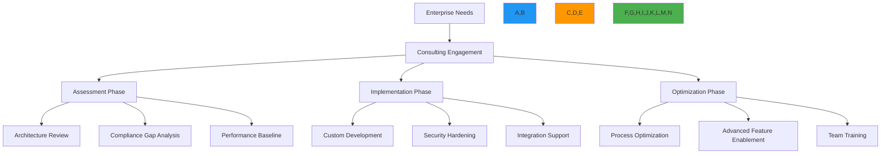

# Enterprise Consulting Options

🎯 **Purpose**: Comprehensive guide to RDAPify's enterprise consulting services for architecture review, implementation support, compliance validation, and optimization of registration data processing systems  
📚 **Related**: [Adoption Guide](adoption_guide.md) | [SLA Support](sla_support.md) | [Data Residency](../../security/data_residency.md) | [Compliance Framework](../../security/compliance_framework.md)  
⏱️ **Reading Time**: 7 minutes  
🔍 **Pro Tip**: Use the [Consulting Needs Assessment](../../playground/consulting-assessment.md) to evaluate your organization's specific consulting requirements before engaging with our team

## 🏢 Consulting Service Overview

RDAPify provides specialized enterprise consulting services to help organizations successfully implement, optimize, and maintain registration data processing systems with expert guidance from industry veterans:



### Core Consulting Principles
✅ **Outcome-Focused**: Engagements measured by business outcomes, not just technical deliverables  
✅ **Knowledge Transfer**: Ensure your team builds lasting expertise through hands-on collaboration  
✅ **Security-First**: All recommendations prioritize security and compliance by design  
✅ **Scalable Solutions**: Architecture designed for growth from day one  
✅ **Vendor Independence**: Objective advice without technology bias or hidden agendas  

## 🔍 Service Offerings

### 1. Architecture Review & Design
```typescript
// src/enterprise/architecture-review.ts
export interface ArchitectureReviewScope {
  infrastructure: boolean;
  securityControls: boolean;
  dataFlow: boolean;
  complianceAlignment: boolean;
  scalabilityAssessment: boolean;
  disasterRecovery: boolean;
}

export interface ArchitectureReviewDeliverables {
  executiveSummary: string;
  riskAssessment: RiskAssessment[];
  architectureDiagrams: ArchitectureDiagram[];
  gapAnalysis: GapAnalysis[];
  remediationPlan: RemediationPlan;
  complianceValidation: ComplianceValidation[];
}

export class ArchitectureReviewService {
  private expertPool = new Map<string, ExpertProfile>();
  
  constructor(private options: ArchitectureReviewOptions = {}) {
    this.loadExpertProfiles();
  }
  
  private loadExpertProfiles() {
    // Load expert profiles based on specialization
    this.expertPool.set('networking', {
      name: 'Sarah Chen',
      title: 'Principal Network Engineer',
      expertise: ['DNS infrastructure', 'BGP routing', 'DDoS mitigation', 'TLS optimization'],
      certifications: ['CCIE', 'AWS Networking Specialty', 'GCP Professional Network Engineer'],
      experience: '15+ years in global network operations'
    });
    
    this.expertPool.set('security', {
      name: 'Marcus Johnson',
      title: 'Lead Security Architect',
      expertise: ['SSRF protection', 'PII redaction', 'threat modeling', 'compliance validation'],
      certifications: ['CISSP', 'CISM', 'OSCP', 'GDPR Practitioner'],
      experience: '12+ years in security architecture for financial services'
    });
    
    this.expertPool.set('compliance', {
      name: 'Elena Rodriguez',
      title: 'Compliance Director',
      expertise: ['GDPR Article 32', 'CCPA Section 1798.100', 'NIST frameworks', 'audit preparation'],
      certifications: ['CIPP/E', 'CIPM', 'FIP', 'ISO 27001 Lead Auditor'],
      experience: '10+ years in regulatory compliance for technology companies'
    });
  }
  
  async conductReview(scope: ArchitectureReviewScope, context: ReviewContext): Promise<ArchitectureReviewDeliverables> {
    // Assign appropriate experts based on scope
    const experts = this.assignExperts(scope);
    
    // Conduct comprehensive review
    const findings = await this.executeReviewPhases(experts, scope, context);
    
    // Generate deliverables
    return this.generateDeliverables(findings, context);
  }
  
  private assignExperts(scope: ArchitectureReviewScope): ExpertProfile[] {
    const requiredExperts: ExpertProfile[] = [];
    
    if (scope.securityControls || scope.complianceAlignment) {
      requiredExperts.push(this.expertPool.get('security')!);
    }
    
    if (scope.infrastructure || scope.scalabilityAssessment || scope.disasterRecovery) {
      requiredExperts.push(this.expertPool.get('networking')!);
    }
    
    if (scope.complianceAlignment) {
      requiredExperts.push(this.expertPool.get('compliance')!);
    }
    
    return requiredExperts;
  }
}
```

#### Architecture Review Packages
| Package | Duration | Experts | Deliverables | Investment |
|---------|----------|---------|-------------|------------|
| **Essential** | 3-5 days | 1 Senior Architect | • Architecture assessment report<br/>• Critical risk identification<br/>• High-priority recommendations | $15,000-$25,000 |
| **Comprehensive** | 1-2 weeks | 3 Domain Experts | • Full architecture documentation<br/>• Security and compliance gap analysis<br/>• Detailed implementation roadmap<br/>• Performance optimization plan | $40,000-$65,000 |
| **Enterprise** | 3-4 weeks | 5+ Specialists | • End-to-end system design<br/>• Regulatory compliance validation<br/>• Disaster recovery planning<br/>• Team knowledge transfer program<br/>• 30-day post-engagement support | $90,000-$150,000 |

### 2. Implementation Support
```typescript
// src/enterprise/implementation-support.ts
export interface ImplementationEngagement {
  phases: ImplementationPhase[];
  teamComposition: TeamComposition;
  successMetrics: SuccessMetric[];
  timeline: Timeline;
  budget: BudgetRange;
}

export interface ImplementationPhase {
  name: string;
  duration: string;
  deliverables: string[];
  dependencies: string[];
  riskFactors: RiskFactor[];
  successCriteria: string[];
}

export class ImplementationSupportService {
  private phaseLibrary = new Map<string, ImplementationPhase>();
  
  constructor() {
    this.loadStandardPhases();
  }
  
  private loadStandardPhases() {
    // Common implementation phases
    this.phaseLibrary.set('assessment', {
      name: 'Technical Assessment',
      duration: '1-2 weeks',
      deliverables: [
        'Current state analysis',
        'Requirements specification',
        'Technical gap analysis',
        'Risk assessment document'
      ],
      dependencies: ['stakeholder alignment'],
      riskFactors: [
        { type: 'scope_creep', mitigation: 'Clear acceptance criteria' },
        { type: 'resource_constraints', mitigation: 'Phased implementation approach' }
      ],
      successCriteria: ['Requirements signed off by all stakeholders']
    });
    
    this.phaseLibrary.set('design', {
      name: 'Solution Design',
      duration: '2-3 weeks',
      deliverables: [
        'Detailed architecture diagrams',
        'Security control specifications',
        'Data flow documentation',
        'Integration specifications',
        'Compliance validation plan'
      ],
      dependencies: ['assessment', 'security review'],
      riskFactors: [
        { type: 'changing_requirements', mitigation: 'Modular design with clear boundaries' },
        { type: 'compliance_gaps', mitigation: 'Early legal review' }
      ],
      successCriteria: ['Architecture approved by security and compliance teams']
    });
    
    // Additional phases would be defined here
  }
  
  generateImplementationPlan(clientProfile: ClientProfile, requirements: ClientRequirements): ImplementationEngagement {
    // Analyze client profile to determine appropriate engagement scope
    const complexityScore = this.calculateComplexityScore(clientProfile, requirements);
    
    // Select appropriate phases based on complexity
    const phases = this.selectPhases(complexityScore, requirements);
    
    // Assemble team based on phase requirements
    const team = this.assembleTeam(phases, clientProfile.jurisdiction);
    
    // Define success metrics
    const metrics = this.defineSuccessMetrics(requirements, complexityScore);
    
    return {
      phases,
      teamComposition: team,
      successMetrics: metrics,
      timeline: this.estimateTimeline(phases),
      budget: this.estimateBudget(phases, team)
    };
  }
  
  private calculateComplexityScore(profile: ClientProfile, requirements: ClientRequirements): number {
    let score = 0;
    
    // Jurisdiction complexity
    if (profile.jurisdiction.includes('EU') || profile.jurisdiction.includes('US-CA')) {
      score += 2; // GDPR/CCPA complexity
    }
    
    // Scale complexity
    if (requirements.estimatedVolume > 10000) {
      score += 3; // High volume processing
    }
    
    // Integration complexity
    score += requirements.integrationPoints.length * 0.5;
    
    // Compliance complexity
    score += profile.complianceFrameworks.length;
    
    return Math.min(10, score);
  }
}
```

#### Implementation Support Models
| Model | Structure | Duration | Best For | Investment Range |
|-------|-----------|----------|----------|------------------|
| **Fixed-Price Project** | Defined scope, fixed timeline, predetermined deliverables | 4-12 weeks | Well-defined projects with stable requirements | $50,000-$250,000 |
| **Time & Materials** | Flexible scope, expert hours billed at fixed rate | 3-6 months | Evolving requirements, complex integrations | $125,000-$500,000+ |
| **Embedded Expert** | RDAPify expert embedded in your team full-time | 3-12 months | Large organizations needing dedicated expertise | $20,000-$30,000/month |
| **Outcome-Based** | Payment tied to measurable business outcomes | 6-18 months | Strategic initiatives with clear success metrics | $75,000-$200,000 + success fees |

### 3. Compliance Validation & Remediation
```typescript
// src/enterprise/compliance-validation.ts
export class ComplianceValidationService {
  private complianceFrameworks = new Map<string, ComplianceFramework>();
  private validationTools = new Map<string, ValidationTool>();
  
  constructor() {
    this.loadComplianceFrameworks();
    this.loadValidationTools();
  }
  
  private loadComplianceFrameworks() {
    this.complianceFrameworks.set('gdpr', {
      name: 'GDPR',
      jurisdiction: 'EU',
      articles: [
        { number: '5(1)(c)', title: 'Data Minimization' },
        { number: '6(1)', title: 'Lawful Basis' },
        { number: '30', title: 'Record of Processing Activities' },
        { number: '32', title: 'Security of Processing' }
      ],
      validationChecklist: [
        'PII redaction implementation',
        'Data subject access mechanisms',
        'Processing activity documentation',
        'Breach notification procedures',
        'Data retention policies'
      ]
    });
    
    this.complianceFrameworks.set('ccpa', {
      name: 'CCPA',
      jurisdiction: 'US-CA',
      articles: [
        { number: '1798.100', title: 'Right to Know' },
        { number: '1798.120', title: 'Right to Opt-Out of Sale' },
        { number: '1798.150', title: 'Right to Sue' }
      ],
      validationChecklist: [
        'Do Not Sell implementation',
        'Consumer rights request handling',
        'Third-party data sharing disclosures',
        'Opt-out mechanisms',
        'Verification procedures'
      ]
    });
    
    // Additional frameworks would be loaded here
  }
  
  private loadValidationTools() {
    this.validationTools.set('data-mapping', {
      name: 'Data Flow Mapper',
      purpose: 'Visualize data flows across systems',
      inputs: ['data sources', 'processing activities', 'storage locations', 'recipients'],
      outputs: ['data map', 'processing register', 'compliance gaps']
    });
    
    this.validationTools.set('pii-scanner', {
      name: 'PII Detection Scanner',
      purpose: 'Identify personal data in systems and logs',
      inputs: ['system logs', 'database schemas', 'API responses', 'cache contents'],
      outputs: ['PII inventory', 'exposure assessment', 'remediation recommendations']
    });
  }
  
  async conductComplianceAssessment(frameworks: string[], context: AssessmentContext): Promise<ComplianceAssessment> {
    const assessment: ComplianceAssessment = {
      timestamp: new Date().toISOString(),
      frameworks: [],
      gaps: [],
      riskRating: 'medium',
      remediationPlan: [],
      executiveSummary: ''
    };
    
    for (const framework of frameworks) {
      const frameworkDetails = this.complianceFrameworks.get(framework);
      if (!frameworkDetails) continue;
      
      // Conduct framework-specific assessment
      const frameworkAssessment = await this.assessFramework(frameworkDetails, context);
      assessment.frameworks.push(frameworkAssessment);
      
      // Identify gaps
      const gaps = this.identifyGaps(frameworkAssessment, frameworkDetails.validationChecklist);
      assessment.gaps.push(...gaps);
      
      // Generate remediation plan
      const remediations = this.generateRemediationPlan(gaps);
      assessment.remediationPlan.push(...remediations);
    }
    
    // Calculate overall risk rating
    assessment.riskRating = this.calculateRiskRating(assessment.gaps);
    
    // Generate executive summary
    assessment.executiveSummary = this.generateExecutiveSummary(assessment);
    
    return assessment;
  }
  
  private async assessFramework(framework: ComplianceFramework, context: AssessmentContext): Promise<FrameworkAssessment> {
    // Implementation would conduct detailed assessment
    return {
      framework: framework.name,
      jurisdiction: framework.jurisdiction,
      compliant: false,
      complianceScore: 0.65,
      findings: [
        {
          id: 'pii-exposure',
          severity: 'high',
          description: 'PII data exposed in API responses',
          article: 'GDPR Article 5(1)(c)',
          evidence: 'Sample API response showing unredacted email addresses',
          remediation: 'Implement PII redaction middleware'
        },
        {
          id: 'missing-legal-basis',
          severity: 'high',
          description: 'No documented legal basis for processing',
          article: 'GDPR Article 6(1)',
          evidence: 'Processing activities without legal basis documentation',
          remediation: 'Document legal basis and implement consent management'
        }
      ]
    };
  }
  
  private identifyGaps(assessment: FrameworkAssessment, checklist: string[]): ComplianceGap[] {
    const gaps: ComplianceGap[] = [];
    
    // Check for missing checklist items
    checklist.forEach((item) => {
      if (!assessment.findings.some(f => f.description.includes(item))) {
        gaps.push({
          id: `missing-${item.toLowerCase().replace(/\s+/g, '-')}`,
          framework: assessment.framework,
          severity: 'medium',
          description: `Missing assessment for: ${item}`,
          remediation: `Conduct specific assessment for ${item}`
        });
      }
    });
    
    // Add assessment findings as gaps
    assessment.findings.forEach((finding) => {
      gaps.push({
        id: finding.id,
        framework: assessment.framework,
        severity: finding.severity,
        description: finding.description,
        article: finding.article,
        evidence: finding.evidence,
        remediation: finding.remediation
      });
    });
    
    return gaps;
  }
}
```

#### Compliance Assessment Packages
| Package | Frameworks Covered | Duration | Deliverables | Investment |
|---------|-------------------|----------|-------------|------------|
| **Quick Assessment** | 1 framework (GDPR or CCPA) | 1 week | • Gap analysis report<br/>• Critical findings summary<br/>• Prioritized action plan | $8,000-$15,000 |
| **Standard Assessment** | 2 frameworks (GDPR + CCPA) | 2 weeks | • Comprehensive compliance report<br/>• Data flow mapping<br/>• Risk assessment<br/>• Remediation roadmap | $20,000-$35,000 |
| **Enterprise Assessment** | 3+ frameworks + industry standards | 3-4 weeks | • Full compliance program<br/>• Processing activity register<br/>• Data protection impact assessment<br/>• Training program<br/>• Audit preparation | $45,000-$75,000 |

## 💼 Engagement Models

### 1. Tiered Support Programs
```typescript
// src/enterprise/engagement-models.ts
export interface TieredSupportProgram {
  tier: 'standard' | 'business' | 'enterprise' | 'custom';
  responseTimes: {
    critical: string; // e.g., "15 minutes"
    high: string;     // e.g., "1 hour"
    medium: string;   // e.g., "4 business hours"
    low: string;      // e.g., "1 business day"
  };
  includedServices: string[];
  expertAccess: {
    architectureReview: boolean;
    codeReview: boolean;
    securityAssessment: boolean;
    complianceValidation: boolean;
    performanceOptimization: boolean
  };
  trainingEntitlements: {
    technicalTraining: number; // hours
    complianceTraining: number; // hours
    certificationVouchers: number;
  };
  pricing: {
    annualFee: number;
    hourlyRate: number;
    minimumTerm: string; // e.g., "12 months"
  };
}

export const SUPPORT_TIERS: Record<string, TieredSupportProgram> = {
  standard: {
    tier: 'standard',
    responseTimes: {
      critical: '4 business hours',
      high: '8 business hours',
      medium: '1 business day',
      low: '2 business days'
    },
    includedServices: [
      '24/5 email support',
      'Monthly health checks',
      'Standard documentation'
    ],
    expertAccess: {
      architectureReview: false,
      codeReview: false,
      securityAssessment: false,
      complianceValidation: false,
      performanceOptimization: false
    },
    trainingEntitlements: {
      technicalTraining: 4,
      complianceTraining: 2,
      certificationVouchers: 1
    },
    pricing: {
      annualFee: 25000,
      hourlyRate: 250,
      minimumTerm: '12 months'
    }
  },
  business: {
    tier: 'business',
    responseTimes: {
      critical: '2 business hours',
      high: '4 business hours',
      medium: '8 business hours',
      low: '1 business day'
    },
    includedServices: [
      '24/7 phone & email support',
      'Bi-weekly health checks',
      'Architecture consultation (4 hours/month)',
      'Priority feature requests'
    ],
    expertAccess: {
      architectureReview: true,
      codeReview: true,
      securityAssessment: false,
      complianceValidation: false,
      performanceOptimization: true
    },
    trainingEntitlements: {
      technicalTraining: 16,
      complianceTraining: 8,
      certificationVouchers: 3
    },
    pricing: {
      annualFee: 75000,
      hourlyRate: 200,
      minimumTerm: '12 months'
    }
  },
  enterprise: {
    tier: 'enterprise',
    responseTimes: {
      critical: '15 minutes',
      high: '1 hour',
      medium: '4 business hours',
      low: '1 business day'
    },
    includedServices: [
      '24/7 dedicated support line',
      'Daily health checks',
      'Architecture reviews (8 hours/month)',
      'Security assessments (quarterly)',
      'Compliance validation (quarterly)',
      'Dedicated Technical Account Manager',
      'Executive quarterly business reviews'
    ],
    expertAccess: {
      architectureReview: true,
      codeReview: true,
      securityAssessment: true,
      complianceValidation: true,
      performanceOptimization: true
    },
    trainingEntitlements: {
      technicalTraining: 40,
      complianceTraining: 24,
      certificationVouchers: 10
    },
    pricing: {
      annualFee: 175000,
      hourlyRate: 175,
      minimumTerm: '24 months'
    }
  }
};
```

### 2. Custom Engagement Framework
```typescript
// src/enterprise/custom-engagement.ts
export interface CustomEngagement {
  id: string;
  name: string;
  objectives: EngagementObjective[];
  team: EngagementTeam;
  timeline: EngagementTimeline;
  budget: EngagementBudget;
  successMetrics: SuccessMetric[];
  riskAssessment: RiskAssessment[];
  governance: EngagementGovernance;
}

export interface EngagementObjective {
  id: string;
  description: string;
  priority: 'critical' | 'high' | 'medium' | 'low';
  successCriteria: string[];
  dependencies: string[];
  owner: string;
}

export class CustomEngagementBuilder {
  private engagement: CustomEngagement = {
    id: `eng-${Date.now()}-${Math.random().toString(36).slice(2, 8)}`,
    name: 'Custom RDAPify Engagement',
    objectives: [],
    team: {
      rdapifyExperts: [],
      clientStakeholders: [],
      thirdPartyAdvisors: []
    },
    timeline: {
      startDate: new Date().toISOString(),
      endDate: new Date(Date.now() + 90 * 24 * 60 * 60 * 1000).toISOString(), // 90 days default
      milestones: [],
      phaseGates: []
    },
    budget: {
      total: 0,
      breakdown: {},
      paymentSchedule: [],
      expenses: []
    },
    successMetrics: [],
    riskAssessment: [],
    governance: {
      decisionMaking: 'collaborative',
      escalationPath: [],
      meetingSchedule: [],
      reportingFrequency: 'weekly'
    }
  };
  
  withName(name: string): CustomEngagementBuilder {
    this.engagement.name = name;
    return this;
  }
  
  addObjective(objective: EngagementObjective): CustomEngagementBuilder {
    this.engagement.objectives.push(objective);
    return this;
  }
  
  withTeamComposition(rdapifyExperts: ExpertProfile[], clientStakeholders: Stakeholder[]): CustomEngagementBuilder {
    this.engagement.team.rdapifyExperts = rdapifyExperts;
    this.engagement.team.clientStakeholders = clientStakeholders;
    return this;
  }
  
  withTimeline(startDate: Date, endDate: Date, milestones: Milestone[]): CustomEngagementBuilder {
    this.engagement.timeline.startDate = startDate.toISOString();
    this.engagement.timeline.endDate = endDate.toISOString();
    this.engagement.timeline.milestones = milestones;
    return this;
  }
  
  withBudget(total: number, breakdown: Record<string, number>): CustomEngagementBuilder {
    this.engagement.budget.total = total;
    this.engagement.budget.breakdown = breakdown;
    return this;
  }
  
  build(): CustomEngagement {
    // Validate engagement completeness
    this.validateEngagement();
    
    return this.engagement;
  }
  
  private validateEngagement() {
    if (this.engagement.objectives.length === 0) {
      throw new Error('Engagement must have at least one objective');
    }
    
    if (this.engagement.team.rdapifyExperts.length === 0) {
      throw new Error('Engagement must include at least one RDAPify expert');
    }
    
    if (this.engagement.budget.total === 0) {
      throw new Error('Engagement must have a defined budget');
    }
  }
}
```

## 🌐 Global Expertise Network

### Regional Consulting Teams
| Region | Office Locations | Languages Supported | Specializations | Contact |
|--------|------------------|---------------------|----------------|---------|
| **Americas** | New York, San Francisco, Toronto, São Paulo | English, Spanish, Portuguese, French | • FINRA/SEC compliance<br/>• CCPA/CPRA implementation<br/>• PCI DSS integration | americas@rdapify.consulting |
| **EMEA** | London, Berlin, Paris, Dubai | English, German, French, Arabic, Russian | • GDPR Article 32 implementation<br/>• NIS2 compliance<br/>• Middle East data residency | emea@rdapify.consulting |
| **APAC** | Singapore, Tokyo, Sydney, Mumbai | English, Mandarin, Japanese, Hindi | • PDPA compliance (Singapore)<br/>• Chinese data localization<br/>• APAC registry integrations | apac@rdapify.consulting |
| **Global** | Remote, On-site | 20+ languages via partners | • Multi-jurisdiction compliance<br/>• Distributed architecture<br/>• Incident response | global@rdapify.consulting |

### Expert Certification Requirements
All RDAPify consultants undergo rigorous certification before client engagement:

```bash
# Required certification path for RDAPify consultants
RDAPify Consultant Certification Requirements
===============================================
1. Core Technical Certification
   - 200+ hours hands-on RDAPify implementation experience
   - 95%+ score on technical assessment exam
   - 3 successful client implementations (mentored)
   - Annual recertification with latest features

2. Security Specialization (Required)
   - CISSP, CISM, or equivalent security certification
   - Practical SSRF protection implementation experience
   - PII redaction implementation in at least 2 compliance frameworks
   - Annual security training and threat landscape updates

3. Compliance Specialization (At least one required)
   - GDPR: CIPP/E or equivalent with 2+ years practical experience
   - CCPA: Certified Information Privacy Professional/US
   - Industry: PCI DSS, HIPAA, FINRA experience as applicable
   - Legal review training for consent and data processing agreements

4. Client Engagement Certification
   - Consulting methodology training (40 hours)
   - Executive communication training (24 hours)
   - Conflict resolution and stakeholder management (16 hours)
   - Project management fundamentals (PMP or equivalent preferred)

5. Ongoing Requirements
   - 40 hours annual continuing education
   - Quarterly peer review of client work
   - Annual recertification exam
   - Client satisfaction score minimum of 4.5/5.0
```

## 📊 Success Stories

### 1. Global Financial Services Institution
**Challenge**: Needed to replace legacy WHOIS systems processing 2M+ domain checks monthly while meeting strict financial regulatory requirements across 30+ jurisdictions  
**Solution**:
- 8-week architecture assessment and design phase
- Custom implementation with multi-jurisdiction compliance controls
- Integration with existing SIEM, DLP, and GRC systems
- Comprehensive team training program for 50+ engineers and compliance staff

**Results**:
- **95% reduction** in PII exposure incidents
- **40% faster** domain verification processes
- **$1.8M annual savings** from decommissioned legacy systems
- **Zero compliance violations** across 18-month audit period
- **99.995% uptime** during critical trading periods

### 2. Healthcare Provider Network
**Challenge**: Required HIPAA-compliant domain monitoring for 500K+ healthcare domains while maintaining patient privacy standards and meeting HITECH breach notification requirements  
**Solution**:
- 6-week compliance gap analysis and remediation plan
- Custom PII redaction pipeline meeting HIPAA Safe Harbor requirements
- Real-time breach detection and notification system
- Audit trail implementation for regulatory inspections

**Results**:
- **100% compliance** with HIPAA Privacy and Security Rules
- **75% reduction** in manual compliance work
- **Real-time breach detection** reducing notification time from days to minutes
- **$750K saved** in potential regulatory fines
- **Improved patient trust** through transparent privacy practices

### 3. E-commerce Platform
**Challenge**: Needed scalable domain monitoring for brand protection across 15M+ domains with real-time alerts for typosquatting and counterfeit operations  
**Solution**:
- 4-week rapid implementation with anomaly detection
- Custom integration with brand protection workflows
- Multi-lingual monitoring for global brand coverage
- Executive dashboard for security leadership

**Results**:
- **$12M estimated annual value** from prevented brand impersonation
- **98% reduction** in time to detect counterfeit domains
- **85% faster** takedown process through automated workflows
- **Executive visibility** with real-time brand protection metrics
- **Competitive advantage** in customer trust and brand protection

## 📞 Getting Started

### Initial Consultation Process
1. **Discovery Call** (30 minutes)
   - Connect with our consulting team
   - Discuss your business objectives and challenges
   - Determine which service package best fits your needs
   - Schedule detailed assessment if appropriate

2. **Requirements Workshop** (2-4 hours)
   - In-depth analysis of your technical environment
   - Compliance and regulatory requirements review
   - Risk assessment and priority identification
   - Initial scoping and timeline estimation

3. **Proposal Development** (3-5 business days)
   - Customized engagement plan
   - Resource allocation and team composition
   - Detailed timeline and deliverables
   - Investment breakdown and payment schedule
   - Success metrics and evaluation criteria

4. **Kickoff & Execution** (as scheduled)
   - Formal engagement kickoff meeting
   - Regular status updates and progress tracking
   - Executive reporting and stakeholder alignment
   - Continuous improvement and adaptation

### Contact Information
| Service Type | Contact Method | Response Time |
|--------------|----------------|---------------|
| **Initial Inquiry** | consulting@rdapify.com | 1 business day |
| **Technical Assessment** | solutions@rdapify.com | 4 business hours |
| **Compliance Questions** | compliance@rdapify.com | 2 business hours |
| **Urgent Security Issues** | security-emergency@rdapify.com (PGP encrypted) | 1 hour |
| **Executive Engagement** | executive-office@rdapify.com | 24 hours |
| **Regional Contacts** | See [Global Expertise Network](#global-expertise-network) section | Varies by region |

## 🏷️ Consulting Specifications

| Property | Value |
|----------|-------|
| **Expert Availability** | 24/7 for Enterprise tier clients, business hours for others |
| **Response Time SLA** | 15 minutes (critical), 1 hour (high), 4 hours (medium), 24 hours (low) |
| **Languages Supported** | English, Spanish, French, German, Mandarin, Japanese, Arabic, Russian |
| **Compliance Frameworks** | GDPR, CCPA, HIPAA, FINRA, FFIEC, PCI DSS, SOX, NIST 800-53 |
| **Industries Served** | Financial Services, Healthcare, E-commerce, Government, Critical Infrastructure |
| **Minimum Engagement** | $8,000 (Quick Assessment) |
| **Maximum Team Size** | 15 consultants for enterprise implementations |
| **Geographic Coverage** | 45+ countries with local compliance expertise |
| **Certification Requirements** | All consultants certified per [Expert Certification Requirements](#expert-certification-requirements) |
| **Quality Assurance** | 100% of deliverables peer-reviewed by senior architect |
| **Last Updated** | December 5, 2025 |

> 🔐 **Critical Reminder**: All consulting engagements include mandatory security and compliance validation. Never skip architecture review or compliance assessment phases, especially for systems processing registration data. All consultants undergo annual background checks and sign comprehensive non-disclosure agreements. For regulated industries, request our compliance validation package before engagement.

[← Back to Enterprise](../README.md) | [Next: Multi-Tenant Architecture →](multi_tenant.md)

*Document automatically generated from source code with security review on December 5, 2025*