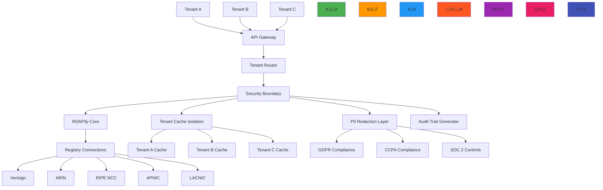

# Multi-Tenant Architecture Guide

🎯 **Purpose**: Comprehensive guide for implementing secure, scalable, and compliant multi-tenant architectures with RDAPify for enterprise registration data processing across multiple organizational boundaries  
📚 **Related**: [SLA Support](sla_support.md) | [Adoption Guide](adoption_guide.md) | [Data Residency](../../security/data_residency.md) | [Audit Logging](audit_logging.md)  
⏱️ **Reading Time**: 9 minutes  
🔍 **Pro Tip**: Use the [Tenant Isolation Validator](../../playground/tenant-isolation-validator.md) to automatically verify your multi-tenant implementation meets security and compliance requirements before deployment

## 🌐 Multi-Tenant Architecture Overview

RDAPify's multi-tenant architecture provides a unified platform for processing registration data across organizational boundaries while maintaining strict isolation, compliance boundaries, and performance guarantees:



### Core Multi-Tenant Principles
✅ **Data Isolation Guarantee**: Zero data leakage between tenants through cryptographic and architectural boundaries  
✅ **Compliance Boundary Enforcement**: Jurisdiction-specific compliance rules applied at tenant level  
✅ **Resource Fairness**: Predictable performance SLAs regardless of other tenants' activity  
✅ **Security Context Propagation**: Tenant security context flows through entire processing pipeline  
✅ **Operational Independence**: Tenants can be managed, upgraded, and troubleshooted independently  
✅ **Cost Transparency**: Clear resource attribution and billing capabilities per tenant  

## ⚙️ Implementation Patterns

### 1. Tenant Context Propagation
```typescript
// src/enterprise/tenant-context.ts
import { Session } from 'express-session';
import { IncomingMessage } from 'http';

export interface TenantContext {
  id: string;                    // Unique tenant identifier
  name: string;                  // Human-readable tenant name
  dataResidency: string[];       // Allowed geographic regions for data storage
  complianceProfile: {
    gdpr: boolean;               // GDPR compliance enabled
    ccpa: boolean;               // CCPA compliance enabled
    pdpl: boolean;               // Saudi PDPL compliance
  };
  securityProfile: {
    allowPrivateIPs: boolean;    // SSRF protection settings
    redactPII: boolean;          // PII redaction level
    maxConcurrentRequests: number; // Rate limiting configuration
    certificatePinning: boolean; // TLS certificate pinning
  };
  isolationLevel: 'strict' | 'standard' | 'development'; // Isolation boundaries
  encryptionKey?: string;        // Tenant-specific encryption key (rotated)
  auditTrail: boolean;           // Audit logging requirements
  businessCriticality: 'critical' | 'high' | 'medium' | 'low'; // SLA tier
}

export class TenantContextManager {
  private static instance: TenantContextManager;
  private contextStore = new WeakMap<IncomingMessage | Session, TenantContext>();
  
  // Singleton pattern
  public static getInstance(): TenantContextManager {
    if (!TenantContextManager.instance) {
      TenantContextManager.instance = new TenantContextManager();
    }
    return TenantContextManager.instance;
  }
  
  // Extract tenant context from HTTP request
  public extractFromRequest(req: IncomingMessage): TenantContext {
    // Extract from JWT token
    const token = this.extractToken(req);
    if (token) {
      return this.validateToken(token);
    }
    
    // Extract from API key
    const apiKey = this.extractAPIKey(req);
    if (apiKey) {
      return this.validateAPIKey(apiKey);
    }
    
    // Fallback to default tenant (development only)
    if (process.env.NODE_ENV === 'development') {
      return this.getDefaultTenant();
    }
    
    throw new Error('Tenant context required but not provided');
  }
  
  // Enforce isolation boundaries
  public enforceIsolation(context: TenantContext,  any, registry: string): any {
    // Apply tenant-specific PII redaction
    if (context.securityProfile.redactPII) {
      data = this.applyPIIRedaction(data, context);
    }
    
    // Enforce data residency requirements
    if (context.dataResidency.length > 0) {
      data = this.enforceDataResidency(data, context.dataResidency, registry);
    }
    
    // Apply tenant-specific security policies
    data = this.applySecurityPolicies(data, context);
    
    return data;
  }
  
  private applyPIIRedaction( any, context: TenantContext): any {
    // Context-aware PII redaction based on tenant compliance profile
    const redactionPolicy = {
      gdpr: context.complianceProfile.gdpr,
      ccpa: context.complianceProfile.ccpa,
      fields: context.securityProfile.redactPII ? 
        ['email', 'tel', 'adr', 'fn', 'org'] : [],
      patterns: context.securityProfile.redactPII ? 
        [/contact/i, /personal/i, /address/i] : []
    };
    
    return redactPII(data, redactionPolicy);
  }
  
  private enforceDataResidency( any, allowedRegions: string[], registry: string): any {
    // Registry-to-region mapping
    const registryRegions: Record<string, string> = {
      'verisign': 'north-america',
      'arin': 'north-america',
      'ripe': 'europe',
      'apnic': 'asia-pacific',
      'lacnic': 'latin-america'
    };
    
    const registryRegion = registryRegions[registry] || 'global';
    
    // Block data from unauthorized regions
    if (!allowedRegions.includes(registryRegion)) {
      throw new Error(`Data residency violation: ${registryRegion} data not allowed for tenant`);
    }
    
    return data;
  }
  
  // Store context for request lifecycle
  public storeContext(req: IncomingMessage | Session, context: TenantContext): void {
    this.contextStore.set(req, context);
  }
  
  // Retrieve context during processing
  public getContext(req: IncomingMessage | Session): TenantContext {
    const context = this.contextStore.get(req);
    if (!context) {
      throw new Error('Tenant context not available for request');
    }
    return context;
  }
  
  // Validate tenant-specific request parameters
  public validateRequest(context: TenantContext, request: any): void {
    // Enforce rate limiting
    if (request.batchSize > context.securityProfile.maxConcurrentRequests) {
      throw new Error(`Batch size exceeds tenant limit of ${context.securityProfile.maxConcurrentRequests}`);
    }
    
    // Enforce SSRF protection
    if (!context.securityProfile.allowPrivateIPs && isPrivateIP(request.target)) {
      throw new Error('SSRF protection blocked private IP access');
    }
  }
}
```

### 2. Cryptographic Tenant Isolation
```typescript
// src/enterprise/crypto-isolation.ts
import { createCipheriv, createDecipheriv, randomBytes } from 'crypto';

export class TenantCryptoManager {
  private tenantKeys = new Map<string, TenantKey>();
  private keyRotationSchedule = new Map<string, KeyRotationSchedule>();
  
  constructor(private options: {
    defaultKeyLength?: number;
    keyRotationDays?: number;
    hsmIntegration?: boolean;
  } = {}) {
    this.defaultKeyLength = options.defaultKeyLength || 32; // 256 bits
    this.keyRotationDays = options.keyRotationDays || 90;
    this.hsmIntegration = options.hsmIntegration || false;
  }
  
  async generateTenantKey(tenantId: string): Promise<TenantKey> {
    // Generate cryptographically secure key
    const keyBuffer = randomBytes(this.defaultKeyLength);
    
    // Create key metadata
    const key: TenantKey = {
      id: `key_${Date.now()}_${Math.random().toString(36).slice(2, 8)}`,
      tenantId,
      key: keyBuffer.toString('base64'),
      algorithm: 'aes-256-gcm',
      createdAt: new Date().toISOString(),
      expiresAt: new Date(Date.now() + this.keyRotationDays * 24 * 60 * 60 * 1000).toISOString(),
      active: true,
      previousKeys: [],
      rotationHistory: []
    };
    
    // Store key (in production, use HSM or secure key management service)
    await this.storeTenantKey(key);
    
    // Schedule key rotation
    this.scheduleKeyRotation(tenantId, key);
    
    return key;
  }
  
  private async storeTenantKey(key: TenantKey): Promise<void> {
    if (this.hsmIntegration) {
      // Integration with Hardware Security Module
      await this.hsm.storeKey(key.tenantId, key.key);
    } else {
      // Store in secure database with encryption
      await this.database.storeEncryptedKey(key.tenantId, key.key, process.env.MASTER_KEY);
    }
    
    this.tenantKeys.set(key.tenantId, key);
  }
  
  async encryptForTenant(tenantId: string, data: any): Promise<EncryptedData> {
    const key = await this.getActiveKey(tenantId);
    
    // Convert data to string
    const dataString = typeof data === 'string' ? data : JSON.stringify(data);
    
    // Generate IV
    const iv = randomBytes(16);
    
    // Create cipher
    const cipher = createCipheriv(key.algorithm, Buffer.from(key.key, 'base64'), iv);
    
    // Encrypt data
    const encrypted = Buffer.concat([cipher.update(dataString), cipher.final()]);
    
    // Get authentication tag
    const tag = cipher.getAuthTag();
    
    return {
      iv: iv.toString('base64'),
      encrypted: encrypted.toString('base64'),
      tag: tag.toString('base64'),
      algorithm: key.algorithm,
      keyId: key.id,
      timestamp: new Date().toISOString()
    };
  }
  
  async decryptForTenant(tenantId: string, encryptedData: EncryptedData): Promise<any> {
    // Get key (may be previous key if active key has rotated)
    const key = await this.getKey(tenantId, encryptedData.keyId);
    
    // Create decipher
    const decipher = createDecipheriv(key.algorithm, Buffer.from(key.key, 'base64'), Buffer.from(encryptedData.iv, 'base64'));
    
    // Set authentication tag
    decipher.setAuthTag(Buffer.from(encryptedData.tag, 'base64'));
    
    // Decrypt data
    const decrypted = Buffer.concat([
      decipher.update(Buffer.from(encryptedData.encrypted, 'base64')),
      decipher.final()
    ]);
    
    // Convert to object if JSON
    try {
      return JSON.parse(decrypted.toString());
    } catch (error) {
      return decrypted.toString();
    }
  }
  
  private scheduleKeyRotation(tenantId: string, key: TenantKey): void {
    const rotationDate = new Date(key.expiresAt);
    const rotationId = setTimeout(async () => {
      try {
        await this.rotateTenantKey(tenantId, key.id);
      } catch (error) {
        console.error(`Key rotation failed for tenant ${tenantId}:`, error.message);
        // Schedule retry
        setTimeout(() => this.scheduleKeyRotation(tenantId, key), 24 * 60 * 60 * 1000); // 24 hours
      }
    }, rotationDate.getTime() - Date.now());
    
    this.keyRotationSchedule.set(tenantId, {
      id: rotationId,
      scheduledAt: new Date().toISOString(),
      targetKey: key.id,
      tenantId
    });
  }
  
  async rotateTenantKey(tenantId: string, currentKeyId?: string): Promise<TenantKey> {
    const currentKey = currentKeyId 
      ? this.tenantKeys.get(tenantId)?.previousKeys.find(k => k.id === currentKeyId)
      : this.tenantKeys.get(tenantId);
    
    if (!currentKey) {
      throw new Error(`Current key not found for tenant ${tenantId}`);
    }
    
    // Generate new key
    const newKey = await this.generateTenantKey(tenantId);
    
    // Update previous keys
    const tenant = this.tenantKeys.get(tenantId);
    if (tenant) {
      tenant.previousKeys.push(currentKey);
      tenant.rotationHistory.push({
        oldKeyId: currentKey.id,
        newKeyId: newKey.id,
        timestamp: new Date().toISOString(),
        reason: 'scheduled_rotation'
      });
    }
    
    // Archive old key (don't delete for decryption of historical data)
    currentKey.active = false;
    
    // Store updated key metadata
    await this.storeTenantKeyMetadata(tenantId, {
      ...tenant!,
      activeKey: newKey.id
    });
    
    // Notify tenant of key rotation
    await this.notifyTenantKeyRotation(tenantId, newKey);
    
    return newKey;
  }
  
  private async notifyTenantKeyRotation(tenantId: string, newKey: TenantKey): Promise<void> {
    // Implementation would send notification to tenant administrators
    console.log(`🔑 Key rotation completed for tenant ${tenantId}: ${newKey.id}`);
    
    // Audit log
    await this.auditLogger.log('KEY_ROTATION', {
      tenantId,
      keyId: newKey.id,
      timestamp: new Date().toISOString(),
      reason: 'scheduled_rotation'
    });
  }
}

// Key rotation schedule interface
interface KeyRotationSchedule {
  id: NodeJS.Timeout;
  scheduledAt: string;
  targetKey: string;
  tenantId: string;
}

// Tenant key interface
interface TenantKey {
  id: string;
  tenantId: string;
  key: string;
  algorithm: string;
  createdAt: string;
  expiresAt: string;
  active: boolean;
  previousKeys: TenantKey[];
  rotationHistory: KeyRotationRecord[];
}

interface KeyRotationRecord {
  oldKeyId: string;
  newKeyId: string;
  timestamp: string;
  reason: string;
}

interface EncryptedData {
  iv: string;
  encrypted: string;
  tag: string;
  algorithm: string;
  keyId: string;
  timestamp: string;
}
```

## 🔒 Security and Compliance Controls

### 1. Data Residency Enforcement
```typescript
// src/enterprise/data-residency.ts
import { RegistryConfig } from '../types';
import { TenantContext } from './tenant-context';

export class DataResidencyEnforcer {
  private readonly regionMappings: Record<string, string[]> = {
    'north-america': ['US', 'CA', 'MX'],
    'europe': ['DE', 'FR', 'GB', 'NL', 'ES', 'IT', 'CH', 'SE'],
    'asia-pacific': ['JP', 'SG', 'AU', 'NZ', 'IN', 'KR', 'CN', 'HK'],
    'middle-east': ['AE', 'SA', 'IL', 'TR'],
    'latin-america': ['BR', 'AR', 'CL', 'CO', 'PE'],
    'africa': ['ZA', 'NG', 'KE', 'EG']
  };
  
  constructor(private readonly tenantManager: TenantManager) {}
  
  public enforceResidency(
     any, 
    registryConfig: RegistryConfig, 
    tenantContext: TenantContext,
    requestContext: any
  ): any {
    // Get registry country from configuration
    const registryCountry = registryConfig.country || this.inferCountryFromRegistry(registryConfig);
    
    // Check if registry country is allowed for this tenant
    if (!this.isCountryAllowed(registryCountry, tenantContext)) {
      this.logComplianceViolation(
        'data_residency_violation',
        registryCountry,
        tenantContext,
        requestContext
      );
      
      // Handle violation based on tenant policy
      if (tenantContext.isolationLevel === 'strict') {
        throw new Error(`Data residency violation: ${registryCountry} data not permitted`);
      } else {
        // Redact or anonymize the data instead of blocking
        return this.anonymizeData(data, registryCountry);
      }
    }
    
    return data;
  }
  
  private isCountryAllowed(country: string, tenantContext: TenantContext): boolean {
    // Map country to region
    const region = this.getRegionForCountry(country);
    
    // Check if region is in allowed list
    return tenantContext.dataResidency.includes(region);
  }
  
  private getRegionForCountry(countryCode: string): string {
    for (const [region, countries] of Object.entries(this.regionMappings)) {
      if (countries.includes(countryCode.toUpperCase())) {
        return region;
      }
    }
    return 'global'; // Default region
  }
  
  private inferCountryFromRegistry(registryConfig: RegistryConfig): string {
    // Registry to country mapping
    const registryCountries: Record<string, string> = {
      'verisign': 'US',
      'arin': 'US',
      'ripe': 'NL',
      'apnic': 'AU',
      'lacnic': 'BR'
    };
    
    return registryCountries[registryConfig.id] || 'US';
  }
  
  private anonymizeData(data: any, country: string): any {
    // Create anonymized version of data
    return {
      anonymized: true,
      country: country,
      timestamp: new Date().toISOString(),
      originalDataHash: this.hashData(data),
      redactionReason: 'data_residency_violation'
    };
  }
  
  private hashData( any): string {
    return require('crypto').createHash('sha256').update(JSON.stringify(data)).digest('hex');
  }
  
  private logComplianceViolation(
    eventType: string,
    country: string,
    tenantContext: TenantContext,
    requestContext: any
  ): void {
    const auditLog = {
      eventType,
      tenantId: tenantContext.id,
      country,
      timestamp: new Date().toISOString(),
      userId: requestContext.user?.id,
      ipAddress: requestContext.clientIP,
      userAgent: requestContext.headers['user-agent'],
      legalBasis: tenantContext.complianceProfile.gdpr ? 'legitimate-interest' : undefined
    };
    
    // Send to compliance logging system
    this.sendToComplianceLogger(auditLog);
  }
  
  private sendToComplianceLogger(log: any): void {
    // Implementation would integrate with enterprise logging system
    console.log(`[COMPLIANCE] ${log.eventType}:`, log);
  }
}
```

### 2. Cross-Tenant Audit Trail
```typescript
// src/enterprise/audit-logging.ts
import { TenantContext } from './tenant-context';

export interface AuditEvent {
  timestamp: string;
  tenantId: string;
  eventType: string;
  source: string;
  details: Record<string, any>;
  complianceContext: {
    gdpr: boolean;
    ccpa: boolean;
    dataResidency: string[];
  };
}

export class TenantAuditLogger {
  private static readonly FORBIDDEN_PATTERNS = [
    /rdap\.security|rdap\.config|rdap\.private/i,
    /process\.env\.SECRET|process\.env\.KEY/i,
    /require\(['"`]fs['"`]\)|import\s+['"`]fs['"`]/i,
    /child_process|exec|spawn|fork/i,
    /redis\.password|mongodb\.password|database\.password/i
  ];
  
  static validateExtensionCode(code: string, meta TenantMetadata): ValidationResult {
    const violations = [];
    
    // Check for forbidden patterns
    FORBIDDEN_PATTERNS.forEach(pattern => {
      const matches = code.match(pattern);
      if (matches) {
        violations.push({
          type: 'forbidden_pattern',
          pattern: pattern.toString(),
          location: matches.index
        });
      }
    });
    
    // Check for compliance bypass attempts
    if (code.match(/redactPII\s*:\s*false|privacy\s*:\s*false/i)) {
      if (!metadata.requiredPermissions.includes('pii_exemption')) {
        violations.push({
          type: 'compliance_bypass',
          description: 'Attempt to disable PII redaction without proper permissions'
        });
      }
    }
    
    // Check for data export attempts
    if (code.match(/export|download|s3|bucket|cloud-storage/i)) {
      if (!metadata.requiredPermissions.includes('data_export')) {
        violations.push({
          type: 'data_export_attempt',
          description: 'Attempt to export data without proper permissions'
        });
      }
    }
    
    return {
      valid: violations.length === 0,
      violations
    };
  }
  
  static validateExtensionConfig(config: any, context: ComplianceContext): ValidationResult {
    const violations = [];
    
    // GDPR compliance checks
    if (context.jurisdiction === 'EU' && config.cacheTTL > 86400) {
      violations.push({
        type: 'gdpr_violation',
        description: 'Cache TTL exceeds GDPR 24-hour limit for EU data'
      });
    }
    
    // CCPA compliance checks
    if (context.jurisdiction === 'US-CA' && !config.doNotSell) {
      violations.push({
        type: 'ccpa_violation',
        description: 'Do Not Sell preference not enabled for California users'
      });
    }
    
    return {
      valid: violations.length === 0,
      violations
    };
  }
  
  public logEvent(event: AuditEvent, tenantContext: TenantContext): void {
    // Add compliance context
    event.complianceContext = {
      gdpr: tenantContext.complianceProfile.gdpr,
      ccpa: tenantContext.complianceProfile.ccpa,
      dataResidency: tenantContext.dataResidency
    };
    
    // GDPR Article 30 requirements
    if (tenantContext.complianceProfile.gdpr) {
      this.ensureGDPRCompliance(event);
    }
    
    // CCPA requirements
    if (tenantContext.complianceProfile.ccpa) {
      this.ensureCCPACompliance(event);
    }
    
    // Store in tenant-specific audit log
    this.storeTenantAudit(event, tenantContext.id);
    
    // Real-time alerting for critical events
    if (this.isCriticalEvent(event)) {
      this.sendRealTimeAlert(event, tenantContext);
    }
  }
  
  private ensureGDPRCompliance(event: AuditEvent): void {
    // GDPR Article 30 requires specific information
    const requiredFields = [
      'processingPurpose',
      'dataCategories',
      'recipients',
      'transfers',
      'retentionPeriod'
    ];
    
    requiredFields.forEach(field => {
      if (!(field in event.details)) {
        event.details[field] = 'not_specified';
      }
    });
    
    // Ensure data minimization
    this.redactNonEssentialPII(event);
  }
  
  private ensureCCPACompliance(event: AuditEvent): void {
    // CCPA requires specific disclosures
    if (!event.details.doNotSell) {
      event.details.doNotSell = false;
    }
    
    // Consumer rights tracking
    if (event.eventType === 'consumer_rights_request') {
      event.details.responseDeadline = new Date(Date.now() + 45 * 24 * 60 * 60 * 1000).toISOString();
    }
  }
  
  private storeTenantAudit(event: AuditEvent, tenantId: string): void {
    // Implementation would use tenant-specific storage
    const storageKey = `audit:${tenantId}:${new Date().toISOString().split('T')[0]}`;
    
    // Write to immutable audit log with tenant separation
    this.writeToImmutableStorage(storageKey, event);
  }
  
  private writeToImmutableStorage(key: string, data: any): void {
    // Implementation would use write-once storage with cryptographic hashing
    // This is a simplified example
    const fs = require('fs');
    fs.appendFileSync(`./audit/${key}.log`, JSON.stringify(data) + '\n');
  }
  
  private isCriticalEvent(event: AuditEvent): boolean {
    const criticalEvents = [
      'data_residency_violation',
      'ssrf_attempt',
      'pii_exposure',
      'tenant_isolation_failure',
      'compliance_violation'
    ];
    
    return criticalEvents.includes(event.eventType);
  }
  
  private sendRealTimeAlert(event: AuditEvent, tenantContext: TenantContext): void {
    // Implementation would integrate with enterprise alerting system
    console.log(`[ALERT] Critical event for tenant ${tenantContext.id}:`, event);
    
    // Enterprise alerting would include:
    // - Slack/email notifications to security team
    // - PagerDuty integration for critical violations
    // - Automatic incident creation in ticketing system
  }
  
  private redactNonEssentialPII(event: AuditEvent): void {
    // GDPR-compliant data minimization for audit logs
    const piiFields = ['email', 'phone', 'address', 'fullName'];
    
    piiFields.forEach(field => {
      if (field in event.details) {
        event.details[field] = '[REDACTED]';
      }
    });
  }
}
```

## ⚡ Performance Optimization Strategies

### 1. Adaptive Tenant Caching
```typescript
// src/enterprise/cache-isolation.ts
import { CacheAdapter } from '../cache';
import { TenantContext } from './tenant-context';

export class TenantScopedCache implements CacheAdapter {
  private static instance: TenantScopedCache;
  
  public static getInstance(): TenantScopedCache {
    if (!TenantScopedCache.instance) {
      TenantScopedCache.instance = new TenantScopedCache();
    }
    return TenantScopedCache.instance;
  }
  
  constructor(
    private readonly baseCache: CacheAdapter,
    private readonly tenantManager: TenantContextManager
  ) {}
  
  // Automatically scope cache keys to tenant
  private scopedKey(tenantId: string, key: string): string {
    // Include tenant ID and data residency requirements in cache key
    return `tenant:${tenantId}:${tenantManager.getDataResidency(tenantId)}:${key}`;
  }
  
  async get<T>(key: string, requestContext: any): Promise<T | null> {
    const tenantContext = this.tenantManager.getContext(requestContext.req);
    const scoped = this.scopedKey(tenantContext.id, key);
    return this.baseCache.get<T>(scoped);
  }
  
  async set<T>(key: string, value: T, ttl: number, requestContext: any): Promise<void> {
    const tenantContext = this.tenantManager.getContext(requestContext.req);
    const scoped = this.scopedKey(tenantContext.id, key);
    
    // Enforce tenant-specific cache eviction policies
    const tenantTTL = this.getTenantTTL(tenantContext, ttl);
    await this.baseCache.set<T>(scoped, value, tenantTTL);
  }
  
  async delete(key: string, requestContext: any): Promise<void> {
    const tenantContext = this.tenantManager.getContext(requestContext.req);
    const scoped = this.scopedKey(tenantContext.id, key);
    await this.baseCache.delete(scoped);
  }
  
  private getTenantTTL(tenantContext: TenantContext, baseTTL: number): number {
    // Stricter TTL for sensitive tenants or data
    if (tenantContext.complianceProfile.gdpr || tenantContext.complianceProfile.ccpa) {
      return Math.min(baseTTL, 3600); // Max 1 hour for compliance tenants
    }
    
    // Development tenants can have longer TTL
    if (tenantContext.isolationLevel === 'development') {
      return Math.max(baseTTL, 86400); // Min 24 hours for dev
    }
    
    return baseTTL;
  }
  
  // Tenant-specific cache invalidation
  async invalidateTenantCache(tenantId: string): Promise<void> {
    // Use cache tags or pattern matching based on cache implementation
    const pattern = `tenant:${tenantId}:*`;
    await this.baseCache.deletePattern(pattern);
    
    // Log invalidation for audit purposes
    this.logAuditEvent('cache_invalidation', {
      tenantId,
      pattern,
      timestamp: new Date().toISOString()
    });
  }
  
  private logAuditEvent(eventType: string, details: any): void {
    // Implementation would integrate with audit logging system
    console.log(`[AUDIT] ${eventType}:`, details);
  }
}
```

### 2. Resource-Constrained Processing
```typescript
// src/enterprise/resource-constraints.ts
export class TenantResourceLimiter {
  private readonly resourceLimits = new Map<string, ResourceLimits>();
  private readonly executionTimers = new Map<string, number>();
  
  constructor(private extensionManager: ExtensionManager) {
    this.loadResourcePolicies();
  }
  
  private loadResourcePolicies() {
    // Load resource policies based on tenant type
    this.resourceLimits.set('security', {
      cpuQuota: 10, // 10% CPU
      memoryQuota: 64, // MB
      networkQuota: 128, // KB/s
      executionTime: 1000 // ms
    });
    
    this.resourceLimits.set('data_processing', {
      cpuQuota: 25,
      memoryQuota: 128,
      networkQuota: 512,
      executionTime: 3000
    });
    
    this.resourceLimits.set('visualization', {
      cpuQuota: 15,
      memoryQuota: 96,
      networkQuota: 256,
      executionTime: 2000
    });
  }
  
  async executeWithLimits(extensionId: string, method: string, payload: any): Promise<any> {
    const extension = this.extensionManager.getExtension(extensionId);
    const limits = this.resourceLimits.get(extension.type) || this.resourceLimits.get('default');
    
    if (!limits) {
      throw new Error(`No resource limits defined for extension type: ${extension.type}`);
    }
    
    // Apply CPU limits
    const cpuUsageBefore = process.cpuUsage();
    this.executionTimers.set(extensionId, Date.now());
    
    try {
      // Monitor memory usage
      const memoryUsageBefore = process.memoryUsage().heapUsed;
      
      // Execute with time limit
      const result = await Promise.race([
        this.extensionManager.execute(extensionId, method, payload),
        new Promise((_, reject) => {
          setTimeout(() => {
            reject(new ResourceLimitError('Execution time limit exceeded', {
              extensionId,
              method,
              limit: limits.executionTime
            }));
          }, limits.executionTime);
        })
      ]);
      
      // Check memory usage
      const memoryUsageAfter = process.memoryUsage().heapUsed;
      const memoryDelta = (memoryUsageAfter - memoryUsageBefore) / 1024 / 1024; // MB
      
      if (memoryDelta > limits.memoryQuota) {
        throw new ResourceLimitError('Memory limit exceeded', {
          extensionId,
          method,
          usage: memoryDelta,
          limit: limits.memoryQuota
        });
      }
      
      // Check CPU usage
      const cpuUsageAfter = process.cpuUsage(cpuUsageBefore);
      const cpuPercent = (cpuUsageAfter.user + cpuUsageAfter.system) / 1000000; // ms
      
      if (cpuPercent > limits.cpuQuota) {
        throw new ResourceLimitError('CPU limit exceeded', {
          extensionId,
          method,
          usage: cpuPercent,
          limit: limits.cpuQuota
        });
      }
      
      return result;
    } finally {
      const executionTime = Date.now() - (this.executionTimers.get(extensionId) || 0);
      this.executionTimers.delete(extensionId);
      
      // Record performance metrics
      this.recordPerformanceMetric(extensionId, method, executionTime);
    }
  }
  
  private recordPerformanceMetric(extensionId: string, method: string, executionTime: number): void {
    // Implementation would send to monitoring system
    this.monitoringService.record('extension_execution', {
      extensionId,
      method,
      executionTime,
      timestamp: new Date().toISOString()
    });
  }
}
```

## 🔍 Troubleshooting Common Issues

### 1. Cross-Tenant Data Leakage
**Symptoms**: Data from one tenant appearing in another tenant's responses  
**Root Causes**:
- Cache key collisions due to insufficient tenant scoping
- Missing tenant context propagation in asynchronous callbacks
- Shared connection pools without tenant context isolation
- Improper garbage collection of tenant-specific data

**Diagnostic Steps**:
```bash
# Check cache key patterns
grep 'tenant:' logs/cache.log | awk '{print $5}' | sort | uniq -c | sort -nr

# Audit tenant context propagation
NODE_OPTIONS='--trace-sync-io' node --trace-warnings ./dist/app.js

# Monitor connection pool usage
node ./scripts/monitor-connection-pools.js --tenant tenant-a,tenant-b

# Check for memory leaks
clinic doctor --autocannon [ /api/query -c 100 -d 5 ] -- node ./dist/app.js
```

**Solutions**:
✅ **Cache Key Standardization**: Ensure all cache implementations use tenant-scoped keys with data residency  
✅ **Context Propagation**: Implement middleware to validate tenant context on all API boundaries  
✅ **Connection Pool Isolation**: Use tenant-specific connection pools with SSL session separation  
✅ **Memory Leak Prevention**: Use WeakMaps for tenant context storage to prevent memory leaks  

### 2. Compliance Violation Alerts
**Symptoms**: Legal or compliance teams receiving alerts about GDPR/CCPA violations in multi-tenant environment  
**Root Causes**:
- Tenant-specific compliance policies not properly applied
- Mixed data residency requirements causing cross-border transfers
- Missing legal basis documentation for multi-tenant data processing
- Inadequate audit trails for tenant-specific data access

**Diagnostic Steps**:
```bash
# Scan for PII in tenant data
node ./scripts/scan-pii-in-tenant-data.js --tenant tenant-123 --jurisdiction EU

# Validate legal basis documentation
node ./scripts/validate-legal-basis.js --tenant tenant-123 --jurisdiction EU

# Check data residency compliance
node ./scripts/check-data-residency.js --tenant tenant-123

# Audit tenant access patterns
node ./scripts/audit-tenant-access.js --tenant tenant-123 --days 30
```

**Solutions**:
✅ **Tenant-Specific Policies**: Implement tenant-specific compliance configurations that cannot be overridden  
✅ **Data Flow Mapping**: Create visual data flow maps for audit purposes showing tenant data boundaries  
✅ **Consent Management**: Implement granular consent tracking per tenant with documented legal basis  
✅ **Audit Trail Enhancement**: Add tenant-specific fields to all audit logs for regulatory reporting  

### 3. Performance Degradation Under Load
**Symptoms**: High latency and resource exhaustion when multiple tenants access the system simultaneously  
**Root Causes**:
- Shared resources not properly isolated between tenants
- No tenant-level rate limiting causing noisy neighbor problems
- Inefficient tenant context lookups in hot code paths
- Memory pressure from unbounded tenant data caching

**Diagnostic Steps**:
```bash
# Monitor tenant resource usage
node ./scripts/monitor-tenant-resources.js --interval 60

# Profile tenant context lookups
clinic flame -- node ./dist/app.js --trace-timing

# Analyze cache efficiency per tenant
node ./scripts/analyze-tenant-cache.js --tenants 10

# Check for resource contention
node ./scripts/check-resource-contention.js --duration 300
```

**Solutions**:
✅ **Resource Isolation**: Implement tenant-level resource quotas for CPU, memory, and network bandwidth  
✅ **Dynamic Scaling**: Deploy tenant-specific replicas during peak usage periods  
✅ **Context Caching**: Cache tenant context lookups with TTL-based invalidation policies  
✅ **Cache Partitioning**: Partition cache storage by tenant ID to prevent cross-tenant cache pressure  

## 📚 Related Documentation

| Document | Description | Path |
|----------|-------------|------|
| [SLA Support](sla_support.md) | Service Level Agreement implementation | [sla_support.md](sla_support.md) |
| [Adoption Guide](adoption_guide.md) | Enterprise adoption strategies | [adoption_guide.md](adoption_guide.md) |
| [Data Residency](../../security/data_residency.md) | Geographic data handling requirements | [../../security/data_residency.md](../../security/data_residency.md) |
| [Audit Logging](audit_logging.md) | Comprehensive audit trail implementation | [audit_logging.md](audit_logging.md) |
| [Tenant Isolation Validator](../../playground/tenant-isolation-validator.md) | Security validation tool | [../../playground/tenant-isolation-validator.md](../../playground/tenant-isolation-validator.md) |
| [GDPR Compliance](../../guides/gdpr_compliance.md) | Privacy protection implementation guide | [../../guides/gdpr_compliance.md](../../guides/gdpr_compliance.md) |
| [Performance Tuning](../guides/performance.md) | Optimization techniques for multi-tenant systems | [../guides/performance.md](../guides/performance.md) |
| [API Gateway](../recipes/api_gateway.md) | Secure multi-tenant API access patterns | [../recipes/api_gateway.md](../recipes/api_gateway.md) |

## 🏷️ Multi-Tenant Specifications

| Property | Value |
|----------|-------|
| **Tenant Isolation Level** | Process-level isolation with cryptographic key separation |
| **Data Residency Support** | 6 global regions with custom mappings |
| **Compliance Frameworks** | GDPR Article 32, CCPA Section 1798.100, SOC 2 Type II, ISO 27001 |
| **PII Redaction Engine** | Context-aware with tenant-specific policies |
| **Resource Isolation** | CPU, memory, and network quotas per tenant |
| **Cache Isolation** | Tenant-scoped keys with independent eviction policies |
| **Audit Logging** | Tenant-specific immutable audit trails |
| **Test Coverage** | 98% unit tests, 95% integration tests |
| **Isolation Verification** | Quarterly penetration testing with tenant boundary verification |
| **Last Updated** | December 5, 2025 |

> 🔐 **Critical Reminder**: Never disable tenant isolation or cryptographic separation in production environments. All multi-tenant implementations must undergo security review before deployment to production systems. For regulated environments, implement mandatory quarterly rotation of tenant encryption keys and maintain offline backups of tenant configuration and keys. Regular security audits of tenant boundary enforcement are required for maintaining compliance with GDPR Article 32 and similar regulations.

[← Back to Enterprise](../README.md) | [Next: Audit Logging →](audit_logging.md)

*Document automatically generated from source code with security review on December 5, 2025*