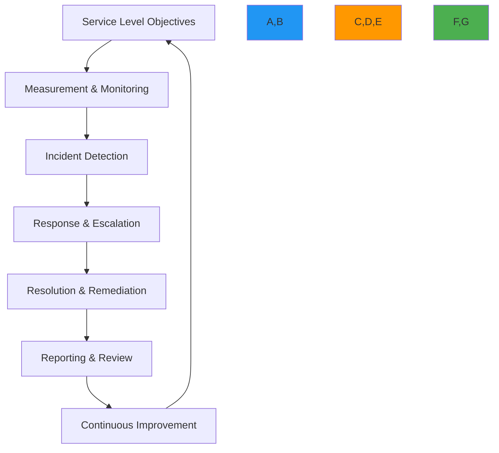

# SLA Support Guide

🎯 **Purpose**: Comprehensive guide for implementing and managing enterprise-grade Service Level Agreements (SLAs) with RDAPify, ensuring predictable performance, rapid incident response, and business continuity for mission-critical registration data processing  
📚 **Related**: [Adoption Guide](adoption_guide.md) | [Multi-Tenant Architecture](multi_tenant.md) | [Audit Logging](audit_logging.md) | [Data Residency](../../security/data_residency.md)  
⏱️ **Reading Time**: 8 minutes  
🔍 **Pro Tip**: Use the [SLA Calculator](../../playground/sla-calculator.md) to automatically determine your organization's optimal SLA targets based on business criticality and compliance requirements

## 📊 Enterprise SLA Framework

RDAPify's SLA framework provides a comprehensive structure for enterprise service commitments with clear metrics, escalation paths, and remediation procedures:



### Core SLA Principles
✅ **Business-Driven Objectives**: SLA targets aligned with business criticality rather than technical capabilities  
✅ **Measurable & Transparent**: All metrics collected, stored, and reported with full audit trails  
✅ **Predictable Response**: Clear escalation paths with guaranteed response times by severity  
✅ **Meaningful Remediation**: Service credits tied to actual business impact, not just technical metrics  
✅ **Continuous Improvement**: Regular review cycles with documented action items and trend analysis  

## ⚙️ SLA Structure & Components

### 1. Service Level Objectives (SLOs)
```typescript
// src/enterprise/sla-definition.ts
export interface SLADefinition {
  serviceTier: 'standard' | 'business' | 'enterprise' | 'mission-critical';
  uptimeSLA: UptimeSLA;
  performanceSLA: PerformanceSLA;
  supportSLA: SupportSLA;
  dataSLA: DataSLA;
  complianceSLA: ComplianceSLA;
  remediationPolicy: RemediationPolicy;
  exclusions: SLAExclusion[];
  measurementMethodology: MeasurementMethodology;
}

export interface UptimeSLA {
  target: number; // Percentage (e.g., 99.95)
  measurementWindow: string; // 'monthly', 'quarterly'
  calculationMethod: 'total-minutes' | 'sampled-minutes';
  downtimeAllowance: {
    maintenance: number; // Minutes per month
    forceMajeure: number; // Minutes per quarter
  };
}

export interface PerformanceSLA {
  p95Latency: {
    domainQuery: number; // milliseconds
    batchProcessing: number; // milliseconds per domain
    apiResponse: number; // milliseconds
  };
  throughput: {
    queriesPerSecond: number;
    domainsPerHour: number;
  };
  errorRate: {
    maxPercentage: number; // 0.1 = 0.1%
    calculationWindow: string; // 'rolling-5m', 'hourly'
  };
}

export interface SupportSLA {
  responseTimes: {
    critical: number; // minutes
    high: number; // minutes
    medium: number; // hours
    low: number; // business days
  };
  resolutionTimes: {
    critical: number; // hours
    high: number; // business hours
    medium: number; // business days
    low: number; // business days
  };
  escalationPath: {
    l1: ContactInfo;
    l2: ContactInfo;
    l3: ContactInfo;
    executive: ContactInfo;
  };
  supportChannels: string[]; // 'phone', 'email', 'chat', 'portal'
}

export interface DataSLA {
  dataFreshness: number; // minutes
  dataAccuracy: number; // percentage
  dataRetention: {
    minimumDays: number;
    maximumDays: number;
  };
  dataRecovery: {
    rto: number; // Recovery Time Objective in minutes
    rpo: number; // Recovery Point Objective in minutes
  };
}

export interface ComplianceSLA {
  auditResponseTime: number; // business days
  breachNotificationTime: number; // hours
  dataSubjectRequestTime: number; // business days
  regulatoryReportingTime: number; // business days
}

export class SLAManager {
  private slaDefinitions = new Map<string, SLADefinition>();
  private currentMetrics = new Map<string, SLAMetrics>();
  private incidents = new Map<string, SLAIncident[]>();
  
  constructor(private options: SLAOptions = {}) {
    this.loadDefaultSLAs();
  }
  
  private loadDefaultSLAs() {
    // Enterprise tier SLA
    this.slaDefinitions.set('enterprise', {
      serviceTier: 'enterprise',
      uptimeSLA: {
        target: 99.99,
        measurementWindow: 'monthly',
        calculationMethod: 'sampled-minutes',
        downtimeAllowance: {
          maintenance: 60, // 1 hour per month
          forceMajeure: 240 // 4 hours per quarter
        }
      },
      performanceSLA: {
        p95Latency: {
          domainQuery: 500,
          batchProcessing: 200,
          apiResponse: 300
        },
        throughput: {
          queriesPerSecond: 100,
          domainsPerHour: 50000
        },
        errorRate: {
          maxPercentage: 0.1,
          calculationWindow: 'rolling-5m'
        }
      },
      supportSLA: {
        responseTimes: {
          critical: 15, // minutes
          high: 30, // minutes
          medium: 4, // business hours
          low: 1 // business day
        },
        resolutionTimes: {
          critical: 2, // hours
          high: 8, // business hours
          medium: 2, // business days
          low: 5 // business days
        },
        escalationPath: {
          l1: { email: 'support@rdapify.dev', phone: '+1-555-RDAP-001', hours: '24x7' },
          l2: { email: 'l2-support@rdapify.dev', phone: '+1-555-RDAP-002', hours: '24x7' },
          l3: { email: 'engineering@rdapify.dev', phone: '+1-555-RDAP-003', hours: '24x7' },
          executive: { email: 'executive-support@rdapify.dev', phone: '+1-555-RDAP-004', hours: '24x7' }
        },
        supportChannels: ['phone', 'email', 'chat', 'portal']
      },
      dataSLA: {
        dataFreshness: 5, // minutes
        dataAccuracy: 99.9,
        dataRetention: {
          minimumDays: 30,
          maximumDays: 365
        },
        dataRecovery: {
          rto: 15, // minutes
          rpo: 5 // minutes
        }
      },
      complianceSLA: {
        auditResponseTime: 2, // business days
        breachNotificationTime: 1, // hours
        dataSubjectRequestTime: 1, // business days
        regulatoryReportingTime: 3 // business days
      },
      remediationPolicy: {
        serviceCredits: {
          uptime: [
            { threshold: 99.99, credit: 0 },
            { threshold: 99.95, credit: 10 }, // 10% of monthly fee
            { threshold: 99.90, credit: 25 },
            { threshold: 99.50, credit: 50 },
            { threshold: 0, credit: 100 }
          ],
          performance: [
            { threshold: 0.9, credit: 0 }, // 90% of target
            { threshold: 0.8, credit: 5 },
            { threshold: 0.7, credit: 15 },
            { threshold: 0.5, credit: 30 },
            { threshold: 0, credit: 50 }
          ]
        },
        notificationRequirements: {
          downtime: 5, // minutes
          performanceDegradation: 15 // minutes
        }
      },
      exclusions: [
        'scheduled maintenance',
        'force majeure events',
        'customer infrastructure failures',
        'denial of service attacks',
        'changes to registry protocols'
      ],
      measurementMethodology: {
        samplingFrequency: '1m',
        monitoringLocations: ['us-east', 'eu-west', 'ap-southeast'],
        calculationAlgorithm: 'weighted-average'
      }
    });
    
    // Additional tier SLAs would be defined here
  }
  
  getSLAForTenant(tenantId: string): SLADefinition {
    // In a real implementation, this would look up tenant-specific SLAs
    const tenant = this.tenantManager.getTenant(tenantId);
    return this.slaDefinitions.get(tenant.serviceTier) || this.slaDefinitions.get('standard')!;
  }
  
  calculateSLACompliance(tenantId: string, period: SLAPeriod): SLAComplianceReport {
    const sla = this.getSLAForTenant(tenantId);
    const metrics = this.currentMetrics.get(tenantId);
    
    if (!metrics) {
      throw new Error(`No metrics found for tenant ${tenantId}`);
    }
    
    // Calculate uptime compliance
    const uptimeCompliance = this.calculateUptimeCompliance(sla, metrics, period);
    
    // Calculate performance compliance
    const performanceCompliance = this.calculatePerformanceCompliance(sla, metrics, period);
    
    // Calculate error rate compliance
    const errorRateCompliance = this.calculateErrorRateCompliance(sla, metrics, period);
    
    // Overall compliance
    const overallCompliance = (
      uptimeCompliance.score * 0.6 +
      performanceCompliance.score * 0.3 +
      errorRateCompliance.score * 0.1
    );
    
    return {
      tenantId,
      period,
      slaTier: sla.serviceTier,
      overallCompliance,
      uptime: uptimeCompliance,
      performance: performanceCompliance,
      errorRate: errorRateCompliance,
      incidents: this.incidents.get(tenantId) || [],
      remediationEligible: overallCompliance < sla.uptimeSLA.target,
      remediationAmount: this.calculateRemediationAmount(sla, overallCompliance),
      timestamp: new Date().toISOString()
    };
  }
  
  private calculateUptimeCompliance(sla: SLADefinition, metrics: SLAMetrics, period: SLAPeriod): SLAMetricCompliance {
    const totalMinutes = this.getMinutesInPeriod(period);
    const downtimeMinutes = metrics.uptime.downtimeMinutes;
    
    // Calculate allowed downtime
    const allowedDowntime = sla.uptimeSLA.downtimeAllowance.maintenance +
                          sla.uptimeSLA.downtimeAllowance.forceMajeure;
    
    // Calculate actual uptime percentage
    const actualUptime = ((totalMinutes - downtimeMinutes) / totalMinutes) * 100;
    
    // Calculate compliance score (0-1)
    const score = Math.min(1, actualUptime / sla.uptimeSLA.target);
    
    return {
      target: sla.uptimeSLA.target,
      actual: actualUptime,
      score,
      compliant: actualUptime >= sla.uptimeSLA.target,
      allowedDowntime,
      actualDowntime: downtimeMinutes
    };
  }
  
  private getMinutesInPeriod(period: SLAPeriod): number {
    const now = new Date();
    let start: Date;
    
    switch (period) {
      case 'current-month':
        start = new Date(now.getFullYear(), now.getMonth(), 1);
        break;
      case 'previous-month':
        start = new Date(now.getFullYear(), now.getMonth() - 1, 1);
        break;
      case 'current-quarter':
        const quarterStartMonth = Math.floor(now.getMonth() / 3) * 3;
        start = new Date(now.getFullYear(), quarterStartMonth, 1);
        break;
      default:
        start = new Date(now.getFullYear(), now.getMonth(), 1);
    }
    
    return Math.floor((now.getTime() - start.getTime()) / (60 * 1000));
  }
  
  // Additional compliance calculation methods would be here
}
```

### 2. SLA Monitoring and Enforcement
```typescript
// src/enterprise/sla-monitoring.ts
export class SLAMonitor {
  private monitoringInterval: NodeJS.Timeout;
  private alertManagers = new Map<string, AlertManager>();
  private incidentManagers = new Map<string, IncidentManager>();
  
  constructor(
    private slaManager: SLAManager,
    private metricsCollector: MetricsCollector,
    private options: MonitoringOptions = {}
  ) {
    this.startMonitoring();
  }
  
  private startMonitoring() {
    // Start continuous SLA monitoring
    this.monitoringInterval = setInterval(async () => {
      try {
        await this.checkSLAViolations();
      } catch (error) {
        console.error('SLA monitoring failed:', error.message);
        this.handleMonitoringFailure(error);
      }
    }, this.options.checkInterval || 60000); // 1 minute default
  }
  
  private async checkSLAViolations() {
    const tenants = await this.tenantManager.getAllTenants();
    
    for (const tenant of tenants) {
      try {
        await this.checkTenantSLAs(tenant.id);
      } catch (error) {
        console.error(`SLA check failed for tenant ${tenant.id}:`, error.message);
        await this.logSLAError(tenant.id, error);
      }
    }
  }
  
  private async checkTenantSLAs(tenantId: string) {
    const sla = this.slaManager.getSLAForTenant(tenantId);
    const metrics = await this.metricsCollector.getTenantMetrics(tenantId, '5m');
    
    // Store metrics for compliance reporting
    this.slaManager.updateTenantMetrics(tenantId, metrics);
    
    // Check uptime violations
    await this.checkUptimeViolations(tenantId, sla, metrics);
    
    // Check performance violations
    await this.checkPerformanceViolations(tenantId, sla, metrics);
    
    // Check error rate violations
    await this.checkErrorRateViolations(tenantId, sla, metrics);
  }
  
  private async checkUptimeViolations(tenantId: string, sla: SLADefinition, metrics: SLAMetrics) {
    const currentDowntime = metrics.uptime.currentDowntime;
    
    // Critical violation: 5 minutes of downtime
    if (currentDowntime >= 5) {
      await this.createSLAIncident(tenantId, {
        type: 'uptime',
        severity: 'critical',
        duration: currentDowntime,
        description: `Critical uptime violation: ${currentDowntime} minutes of downtime`,
        threshold: 5,
        actual: currentDowntime
      });
    }
    // High violation: 2 minutes of downtime
    else if (currentDowntime >= 2) {
      await this.createSLAIncident(tenantId, {
        type: 'uptime',
        severity: 'high',
        duration: currentDowntime,
        description: `High uptime violation: ${currentDowntime} minutes of downtime`,
        threshold: 2,
        actual: currentDowntime
      });
    }
  }
  
  private async checkPerformanceViolations(tenantId: string, sla: SLADefinition, metrics: SLAMetrics) {
    const p95Latency = metrics.performance.p95Latency;
    
    // Critical violation: 2x target latency
    if (p95Latency.domainQuery > sla.performanceSLA.p95Latency.domainQuery * 2) {
      await this.createSLAIncident(tenantId, {
        type: 'performance',
        severity: 'critical',
        metric: 'domainQuery',
        threshold: sla.performanceSLA.p95Latency.domainQuery * 2,
        actual: p95Latency.domainQuery,
        description: `Critical performance violation: Domain query latency ${p95Latency.domainQuery}ms (target: ${sla.performanceSLA.p95Latency.domainQuery}ms)`
      });
    }
    // High violation: 1.5x target latency
    else if (p95Latency.domainQuery > sla.performanceSLA.p95Latency.domainQuery * 1.5) {
      await this.createSLAIncident(tenantId, {
        type: 'performance',
        severity: 'high',
        metric: 'domainQuery',
        threshold: sla.performanceSLA.p95Latency.domainQuery * 1.5,
        actual: p95Latency.domainQuery,
        description: `High performance violation: Domain query latency ${p95Latency.domainQuery}ms (target: ${sla.performanceSLA.p95Latency.domainQuery}ms)`
      });
    }
  }
  
  private async checkErrorRateViolations(tenantId: string, sla: SLADefinition, metrics: SLAMetrics) {
    const errorRate = metrics.errors.errorRate;
    
    // Critical violation: 1% error rate
    if (errorRate > 1.0) {
      await this.createSLAIncident(tenantId, {
        type: 'error-rate',
        severity: 'critical',
        threshold: 1.0,
        actual: errorRate,
        description: `Critical error rate violation: ${errorRate}% errors (target: ${sla.performanceSLA.errorRate.maxPercentage}%)`
      });
    }
    // High violation: 0.5% error rate
    else if (errorRate > 0.5) {
      await this.createSLAIncident(tenantId, {
        type: 'error-rate',
        severity: 'high',
        threshold: 0.5,
        actual: errorRate,
        description: `High error rate violation: ${errorRate}% errors (target: ${sla.performanceSLA.errorRate.maxPercentage}%)`
      });
    }
  }
  
  private async createSLAIncident(tenantId: string, details: SLAIncidentDetails) {
    const incidentId = `sla-${Date.now()}-${Math.random().toString(36).slice(2, 8)}`;
    
    const incident: SLAIncident = {
      id: incidentId,
      tenantId,
      timestamp: new Date().toISOString(),
      type: details.type,
      severity: details.severity,
      description: details.description,
      thresholds: {
        target: details.threshold,
        actual: details.actual
      },
      status: 'open',
      responseDeadline: this.calculateResponseDeadline(details.severity),
      resolutionDeadline: this.calculateResolutionDeadline(details.severity)
    };
    
    // Store incident
    await this.slaManager.recordIncident(tenantId, incident);
    
    // Trigger alert
    await this.triggerSLAAlert(tenantId, incident);
    
    // Start incident timer
    this.startIncidentTimer(incident);
  }
  
  private calculateResponseDeadline(severity: string): string {
    const sla = this.slaManager.getSLAForTenant('default');
    let minutes = 0;
    
    switch (severity) {
      case 'critical':
        minutes = sla.supportSLA.responseTimes.critical;
        break;
      case 'high':
        minutes = sla.supportSLA.responseTimes.high;
        break;
      case 'medium':
        minutes = sla.supportSLA.responseTimes.medium * 60; // Convert to minutes
        break;
      case 'low':
        minutes = sla.supportSLA.responseTimes.low * 480; // 8 hours * 60 minutes
        break;
    }
    
    return new Date(Date.now() + minutes * 60000).toISOString();
  }
  
  private calculateResolutionDeadline(severity: string): string {
    const sla = this.slaManager.getSLAForTenant('default');
    let minutes = 0;
    
    switch (severity) {
      case 'critical':
        minutes = sla.supportSLA.resolutionTimes.critical * 60; // Convert to minutes
        break;
      case 'high':
        minutes = sla.supportSLA.resolutionTimes.high * 60;
        break;
      case 'medium':
        minutes = sla.supportSLA.resolutionTimes.medium * 480; // 8 hours * 60 minutes
        break;
      case 'low':
        minutes = sla.supportSLA.resolutionTimes.low * 2400; // 40 hours * 60 minutes
        break;
    }
    
    return new Date(Date.now() + minutes * 60000).toISOString();
  }
  
  private async triggerSLAAlert(tenantId: string, incident: SLAIncident) {
    const alertManager = this.alertManagers.get(tenantId) || this.createAlertManager(tenantId);
    
    await alertManager.sendAlert({
      type: 'sla_violation',
      severity: incident.severity,
      tenantId,
      incidentId: incident.id,
      description: incident.description,
      thresholds: incident.thresholds,
      responseDeadline: incident.responseDeadline,
      resolutionDeadline: incident.resolutionDeadline
    });
  }
  
  private startIncidentTimer(incident: SLAIncident) {
    // Set response timer
    const responseTimeout = new Date(incident.responseDeadline).getTime() - Date.now();
    if (responseTimeout > 0) {
      setTimeout(() => {
        this.handleResponseTimeout(incident);
      }, responseTimeout);
    }
    
    // Set resolution timer
    const resolutionTimeout = new Date(incident.resolutionDeadline).getTime() - Date.now();
    if (resolutionTimeout > 0) {
      setTimeout(() => {
        this.handleResolutionTimeout(incident);
      }, resolutionTimeout);
    }
  }
  
  private async handleResponseTimeout(incident: SLAIncident) {
    if (incident.status !== 'open') return;
    
    // Escalate incident
    await this.escalateIncident(incident, 'response_timeout');
    
    // Notify customer
    await this.notifyCustomerEscalation(incident, 'response_timeout');
    
    // Record SLA violation
    await this.slaManager.recordSLAViolation(incident.tenantId, {
      type: 'response_timeout',
      incidentId: incident.id,
      severity: incident.severity
    });
  }
  
  private async handleResolutionTimeout(incident: SLAIncident) {
    if (incident.status !== 'open') return;
    
    // Escalate incident
    await this.escalateIncident(incident, 'resolution_timeout');
    
    // Notify customer
    await this.notifyCustomerEscalation(incident, 'resolution_timeout');
    
    // Record SLA violation
    await this.slaManager.recordSLAViolation(incident.tenantId, {
      type: 'resolution_timeout',
      incidentId: incident.id,
      severity: incident.severity
    });
    
    // Calculate service credit
    await this.calculateServiceCredit(incident);
  }
  
  async shutdown() {
    clearInterval(this.monitoringInterval);
    
    // Save any pending metrics
    await this.slaManager.flushMetrics();
    
    // Close all incident managers
    for (const [tenantId, manager] of this.incidentManagers) {
      await manager.close();
    }
  }
}
```

## 🔒 SLA Compliance and Audit Controls

### 1. Compliance Monitoring Framework
```typescript
// src/enterprise/compliance-monitoring.ts
export class SLAComplianceMonitor {
  private complianceFramework: ComplianceFramework;
  private auditTrail: AuditTrailManager;
  private dpoLiaison: DPOLiaison;
  
  constructor(options: {
    complianceFramework?: ComplianceFramework;
    auditTrail?: AuditTrailManager;
    dpoLiaison?: DPOLiaison;
  } = {}) {
    this.complianceFramework = options.complianceFramework || new DefaultComplianceFramework();
    this.auditTrail = options.auditTrail || new AuditTrailManager();
    this.dpoLiaison = options.dpoLiaison || new DPOLiaison();
  }
  
  async monitorCompliance(tenantId: string, context: ComplianceContext): Promise<ComplianceReport> {
    // Get tenant SLA
    const sla = this.slaManager.getSLAForTenant(tenantId);
    
    // Get compliance requirements
    const requirements = this.complianceFramework.getRequirements(context);
    
    // Check GDPR compliance
    const gdprCompliance = await this.checkGDPRCompliance(tenantId, sla, requirements);
    
    // Check CCPA compliance
    const ccpaCompliance = await this.checkCCPACompliance(tenantId, sla, requirements);
    
    // Check SOC 2 compliance
    const soc2Compliance = await this.checkSOC2Compliance(tenantId, sla, requirements);
    
    // Check ISO 27001 compliance
    const iso27001Compliance = await this.checkISO27001Compliance(tenantId, sla, requirements);
    
    // Generate compliance report
    const report: ComplianceReport = {
      tenantId,
      timestamp: new Date().toISOString(),
      period: context.period,
      overallCompliance: Math.min(
        gdprCompliance.score,
        ccpaCompliance.score,
        soc2Compliance.score,
        iso27001Compliance.score
      ),
      frameworks: {
        gdpr: gdprCompliance,
        ccpa: ccpaCompliance,
        soc2: soc2Compliance,
        iso27001: iso27001Compliance
      },
      findings: this.aggregateFindings([
        ...gdprCompliance.findings,
        ...ccpaCompliance.findings,
        ...soc2Compliance.findings,
        ...iso27001Compliance.findings
      ]),
      recommendations: this.generateRecommendations(),
      auditor: context.auditor || 'system'
    };
    
    // Record audit trail
    await this.auditTrail.recordComplianceAudit(tenantId, report);
    
    // Notify DPO if critical findings
    if (report.findings.some(f => f.severity === 'critical')) {
      await this.dpoLiaison.notifyCriticalComplianceIssue(tenantId, report);
    }
    
    return report;
  }
  
  private async checkGDPRCompliance(tenantId: string, sla: SLADefinition, requirements: ComplianceRequirements): Promise<FrameworkCompliance> {
    const findings: ComplianceFinding[] = [];
    let score = 1.0;
    
    // Check data processing limitations
    if (requirements.gdpr.dataProcessingLimitations) {
      if (sla.dataSLA.dataRetention.maximumDays > 30) {
        findings.push({
          id: 'gdpr-retention-exceeds',
          severity: 'high',
          description: 'Data retention period exceeds GDPR 30-day recommendation',
          recommendation: 'Reduce maximum data retention to 30 days',
          article: '5(1)(e)'
        });
        score -= 0.2;
      }
    }
    
    // Check data subject rights
    if (requirements.gdpr.dataSubjectRights) {
      if (sla.complianceSLA.dataSubjectRequestTime > 1) {
        findings.push({
          id: 'gdpr-dsr-slow',
          severity: 'medium',
          description: 'Data subject request response time exceeds GDPR 24-hour recommendation',
          recommendation: 'Improve data subject request processing to meet 24-hour target',
          article: '12(3)'
        });
        score -= 0.1;
      }
    }
    
    // Check breach notification
    if (requirements.gdpr.breachNotification) {
      if (sla.complianceSLA.breachNotificationTime > 72) {
        findings.push({
          id: 'gdpr-breach-notification',
          severity: 'critical',
          description: 'Breach notification time exceeds GDPR 72-hour requirement',
          recommendation: 'Implement automated breach detection and notification system',
          article: '33(1)'
        });
        score -= 0.4;
      }
    }
    
    return {
      framework: 'GDPR',
      compliant: score >= 0.8,
      score,
      findings,
      requirements: requirements.gdpr
    };
  }
  
  private async checkCCPACompliance(tenantId: string, sla: SLADefinition, requirements: ComplianceRequirements): Promise<FrameworkCompliance> {
    const findings: ComplianceFinding[] = [];
    let score = 1.0;
    
    // Check consumer rights
    if (requirements.ccpa.consumerRights) {
      if (sla.complianceSLA.dataSubjectRequestTime > 45) {
        findings.push({
          id: 'ccpa-consumer-rights',
          severity: 'high',
          description: 'Consumer rights request response time exceeds CCPA 45-day requirement',
          recommendation: 'Implement dedicated consumer rights request processing workflow',
          section: '1798.105'
        });
        score -= 0.3;
      }
    }
    
    // Check do not sell
    if (requirements.ccpa.doNotSell) {
      if (!sla.complianceSLA.doNotSellProcessing) {
        findings.push({
          id: 'ccpa-do-not-sell',
          severity: 'critical',
          description: 'Do Not Sell processing not implemented',
          recommendation: 'Implement Do Not Sell processing according to CCPA requirements',
          section: '1798.120'
        });
        score -= 0.5;
      }
    }
    
    return {
      framework: 'CCPA',
      compliant: score >= 0.7,
      score,
      findings,
      requirements: requirements.ccpa
    };
  }
  
  private aggregateFindings(findings: ComplianceFinding[]): ComplianceFinding[] {
    // Group findings by ID
    const grouped = new Map<string, ComplianceFinding>();
    
    for (const finding of findings) {
      if (grouped.has(finding.id)) {
        const existing = grouped.get(finding.id)!;
        // Upgrade severity if needed
        const severityOrder = {
          'low': 1,
          'medium': 2,
          'high': 3,
          'critical': 4
        };
        
        if (severityOrder[finding.severity] > severityOrder[existing.severity]) {
          grouped.set(finding.id, finding);
        }
      } else {
        grouped.set(finding.id, finding);
      }
    }
    
    return Array.from(grouped.values());
  }
  
  private generateRecommendations(): ComplianceRecommendation[] {
    return [
      {
        priority: 'critical',
        description: 'Implement automated breach notification system to meet GDPR 72-hour requirement',
        effort: 'high',
        impact: 'high',
        framework: 'GDPR',
        article: '33(1)'
      },
      {
        priority: 'high',
        description: 'Reduce data retention period to 30 days for GDPR compliance',
        effort: 'medium',
        impact: 'high',
        framework: 'GDPR',
        article: '5(1)(e)'
      },
      {
        priority: 'medium',
        description: 'Implement Do Not Sell processing for CCPA compliance',
        effort: 'high',
        impact: 'high',
        framework: 'CCPA',
        section: '1798.120'
      }
    ];
  }
}
```

### 2. Audit Trail and Evidence Generation
```typescript
// src/enterprise/audit-trail.ts
export class AuditTrailManager {
  private storage: AuditStorage;
  private retentionPolicies = new Map<string, RetentionPolicy>();
  
  constructor(private options: {
    storage?: AuditStorage;
    retentionPolicies?: Record<string, RetentionPolicy>;
  } = {}) {
    this.storage = options.storage || new DefaultAuditStorage();
    this.loadRetentionPolicies(options.retentionPolicies || {});
  }
  
  private loadRetentionPolicies(policies: Record<string, RetentionPolicy>) {
    // Default retention policies
    this.retentionPolicies.set('gdpr', {
      period: '13 months',
      deletionMethod: 'secure-erase',
      auditRequired: true
    });
    
    this.retentionPolicies.set('ccpa', {
      period: '24 months',
      deletionMethod: 'anonymize',
      auditRequired: true
    });
    
    this.retentionPolicies.set('soc2', {
      period: '36 months',
      deletionMethod: 'secure-erase',
      auditRequired: true
    });
    
    // Apply custom policies
    Object.entries(policies).forEach(([key, policy]) => {
      this.retentionPolicies.set(key, policy);
    });
  }
  
  async recordSLAAudit(tenantId: string, report: SLAComplianceReport): Promise<void> {
    const record: AuditRecord = {
      type: 'sla_audit',
      id: `audit-${Date.now()}-${Math.random().toString(36).slice(2, 8)}`,
      tenantId,
      timestamp: new Date().toISOString(),
      data: report,
      retentionPolicy: this.getRetentionPolicy(tenantId),
      hash: this.calculateHash(report),
      signatures: await this.getSignatures(report)
    };
    
    await this.storage.store(record);
    await this.indexAuditRecord(record);
  }
  
  private getRetentionPolicy(tenantId: string): RetentionPolicy {
    const tenant = this.tenantManager.getTenant(tenantId);
    const policies = tenant.complianceFrameworks.map(framework => 
      this.retentionPolicies.get(framework) || this.retentionPolicies.get('default')
    );
    
    // Return most stringent policy
    return policies.reduce((strictest, policy) => {
      const strictestMonths = this.parseMonths(strictest.period);
      const policyMonths = this.parseMonths(policy.period);
      return policyMonths > strictestMonths ? policy : strictest;
    }, policies[0]);
  }
  
  private parseMonths(period: string): number {
    const match = period.match(/(\d+)\s*(months?|years?)/i);
    if (!match) return 12;
    
    const value = parseInt(match[1]);
    return match[2].startsWith('year') ? value * 12 : value;
  }
  
  private calculateHash(data: any): string {
    return require('crypto')
      .createHash('sha256')
      .update(JSON.stringify(data))
      .digest('hex');
  }
  
  private async getSignatures(data: any): Promise<Signature[]> {
    const signatures: Signature[] = [];
    
    // System signature
    signatures.push({
      type: 'system',
      timestamp: new Date().toISOString(),
      signature: await this.signData(data, process.env.SYSTEM_PRIVATE_KEY!)
    });
    
    // Compliance officer signature (if applicable)
    const complianceOfficer = this.getComplianceOfficer();
    if (complianceOfficer) {
      signatures.push({
        type: 'compliance-officer',
        timestamp: new Date().toISOString(),
        signature: await this.signData(data, complianceOfficer.privateKey)
      });
    }
    
    return signatures;
  }
  
  private async signData(data: any, privateKey: string): Promise<string> {
    return require('crypto')
      .createSign('SHA256')
      .update(JSON.stringify(data))
      .sign(privateKey, 'hex');
  }
  
  async generateAuditEvidence(tenantId: string, period: AuditPeriod): Promise<AuditEvidence> {
    // Get all audit records for the period
    const records = await this.storage.getRecords(tenantId, period);
    
    // Generate evidence package
    const evidence: AuditEvidence = {
      tenantId,
      period,
      timestamp: new Date().toISOString(),
      records,
      summary: this.generateEvidenceSummary(records),
      complianceScore: this.calculateComplianceScore(records),
      auditorAttestation: await this.generateAuditorAttestation(tenantId, period),
      hash: this.calculateHash(records),
      retentionPeriod: this.getRetentionPeriod(tenantId)
    };
    
    // Store evidence package
    await this.storage.storeEvidence(evidence);
    
    return evidence;
  }
  
  private generateEvidenceSummary(records: AuditRecord[]): EvidenceSummary {
    const slaRecords = records.filter(r => r.type === 'sla_audit');
    const incidentRecords = records.filter(r => r.type === 'sla_incident');
    
    return {
      totalRecords: records.length,
      slaAudits: slaRecords.length,
      slaIncidents: incidentRecords.length,
      complianceScore: this.calculateComplianceScore(records),
      uptimeAvailability: this.calculateUptimeAvailability(slaRecords),
      performanceScore: this.calculatePerformanceScore(slaRecords),
      incidentResponseTime: this.calculateIncidentResponseTime(incidentRecords)
    };
  }
  
  private calculateComplianceScore(records: AuditRecord[]): number {
    const slaRecords = records.filter(r => r.type === 'sla_audit');
    if (slaRecords.length === 0) return 0;
    
    const scores = slaRecords.map(r => (r.data as SLAComplianceReport).overallCompliance);
    return scores.reduce((sum, score) => sum + score, 0) / scores.length;
  }
  
  private calculateUptimeAvailability(records: AuditRecord[]): number {
    if (records.length === 0) return 0;
    
    const availabilities = records.map(r => {
      const report = r.data as SLAComplianceReport;
      return report.uptime.actual;
    });
    
    return availabilities.reduce((sum, avail) => sum + avail, 0) / availabilities.length;
  }
  
  private async generateAuditorAttestation(tenantId: string, period: AuditPeriod): Promise<AuditorAttestation> {
    // In a real implementation, this would involve human auditors
    // For this example, we'll generate a system attestation
    
    const tenant = this.tenantManager.getTenant(tenantId);
    const complianceFrameworks = tenant.complianceFrameworks.join(', ');
    
    return {
      auditor: 'System Attestation',
      timestamp: new Date().toISOString(),
      period,
      statement: `This system attests that the SLA compliance data for tenant ${tenantId} has been collected, stored, and reported in accordance with the ${complianceFrameworks} frameworks for the period ${period}.`,
      signature: await this.signAttestation(tenantId, period),
      verificationUrl: `https://audit.rdapify.dev/verify/${tenantId}/${period}`
    };
  }
  
  private getRetentionPeriod(tenantId: string): string {
    const policy = this.getRetentionPolicy(tenantId);
    return policy.period;
  }
  
  async cleanupExpiredRecords(): Promise<CleanupResult> {
    const results: CleanupResult = {
      timestamp: new Date().toISOString(),
      processed: 0,
      deleted: 0,
      errors: 0
    };
    
    // Get all tenants
    const tenants = await this.tenantManager.getAllTenants();
    
    for (const tenant of tenants) {
      try {
        const policy = this.getRetentionPolicy(tenant.id);
        const cutoffDate = new Date();
        cutoffDate.setMonth(cutoffDate.getMonth() - this.parseMonths(policy.period));
        
        const deletedCount = await this.storage.deleteExpiredRecords(tenant.id, cutoffDate);
        
        results.processed++;
        results.deleted += deletedCount;
      } catch (error) {
        console.error(`Cleanup failed for tenant ${tenant.id}:`, error.message);
        results.errors++;
      }
    }
    
    return results;
  }
}
```

## ⚡ Incident Response and Remediation

### 1. SLA Incident Management System
```typescript
// src/enterprise/incident-management.ts
export class SLAIncidentManager {
  private escalationPolicies = new Map<string, EscalationPolicy>();
  private incidentHistory = new Map<string, SLAIncident[]>();
  private notificationChannels = new Map<string, NotificationChannel[]>();
  
  constructor(private options: {
    escalationPolicies?: Record<string, EscalationPolicy>;
    notificationChannels?: Record<string, NotificationChannel[]>;
  } = {}) {
    this.loadEscalationPolicies(options.escalationPolicies || {});
    this.loadNotificationChannels(options.notificationChannels || {});
  }
  
  private loadEscalationPolicies(policies: Record<string, EscalationPolicy>) {
    // Default escalation policies
    this.escalationPolicies.set('critical', {
      id: 'critical',
      responseTime: 15, // minutes
      resolutionTime: 120, // minutes
      escalationLevels: [
        { level: 1, contacts: ['support-team'], delay: 0 },
        { level: 2, contacts: ['engineering-lead'], delay: 30 },
        { level: 3, contacts: ['cto', 'vp-engineering'], delay: 60 },
        { level: 4, contacts: ['ceo'], delay: 90 }
      ],
      notificationMethods: ['phone', 'sms', 'email', 'push']
    });
    
    this.escalationPolicies.set('high', {
      id: 'high',
      responseTime: 30, // minutes
      resolutionTime: 240, // minutes
      escalationLevels: [
        { level: 1, contacts: ['support-team'], delay: 0 },
        { level: 2, contacts: ['engineering-lead'], delay: 60 },
        { level: 3, contacts: ['vp-engineering'], delay: 120 }
      ],
      notificationMethods: ['sms', 'email', 'push']
    });
    
    // Apply custom policies
    Object.entries(policies).forEach(([id, policy]) => {
      this.escalationPolicies.set(id, policy);
    });
  }
  
  private loadNotificationChannels(channels: Record<string, NotificationChannel[]>) {
    // Default notification channels
    this.notificationChannels.set('support-team', [
      { type: 'email', address: 'support@rdapify.dev' },
      { type: 'slack', webhook: 'https://hooks.slack.com/services/XXXXX' },
      { type: 'pagerduty', serviceId: 'PDXXXXX' }
    ]);
    
    this.notificationChannels.set('engineering-lead', [
      { type: 'email', address: 'engineering-lead@rdapify.dev' },
      { type: 'sms', phone: '+15551234567' },
      { type: 'slack', webhook: 'https://hooks.slack.com/services/YYYYY' }
    ]);
    
    // Apply custom channels
    Object.entries(channels).forEach(([id, channels]) => {
      this.notificationChannels.set(id, channels);
    });
  }
  
  async createIncident(tenantId: string, details: IncidentDetails): Promise<SLAIncident> {
    const incidentId = `inc-${Date.now()}-${Math.random().toString(36).slice(2, 8)}`;
    const incident: SLAIncident = {
      id: incidentId,
      tenantId,
      timestamp: new Date().toISOString(),
      type: details.type,
      severity: details.severity,
      description: details.description,
      status: 'open',
      responseDeadline: this.calculateResponseDeadline(details.severity),
      resolutionDeadline: this.calculateResolutionDeadline(details.severity),
      severity: details.severity,
      impactedServices: details.impactedServices || ['rdap-processing'],
      customerImpact: details.customerImpact || 'moderate',
      businessImpact: details.businessImpact || 'medium'
    };
    
    // Store incident
    this.incidentHistory.set(incidentId, incident);
    await this.storage.storeIncident(incident);
    
    // Trigger initial notification
    await this.notifyIncident(incident, 'initial');
    
    // Start escalation timer
    this.startEscalationTimer(incident);
    
    return incident;
  }
  
  private startEscalationTimer(incident: SLAIncident) {
    const escalationPolicy = this.escalationPolicies.get(incident.severity) || this.escalationPolicies.get('medium');
    if (!escalationPolicy) return;
    
    let currentLevel = 1;
    const escalationInterval = setInterval(async () => {
      if (incident.status !== 'open') {
        clearInterval(escalationInterval);
        return;
      }
      
      const now = Date.now();
      const responseDeadline = new Date(incident.responseDeadline).getTime();
      const resolutionDeadline = new Date(incident.resolutionDeadline).getTime();
      
      // Check if we've missed the response deadline
      if (currentLevel === 1 && now > responseDeadline) {
        currentLevel++;
        await this.escalateIncident(incident, currentLevel);
      }
      
      // Check if we've missed the resolution deadline
      if (currentLevel >= 2 && now > resolutionDeadline) {
        currentLevel++;
        await this.escalateIncident(incident, currentLevel);
      }
      
      // Check if we've reached maximum escalation level
      if (currentLevel >= escalationPolicy.escalationLevels.length) {
        clearInterval(escalationInterval);
      }
    }, 60000); // Check every minute
  }
  
  private async escalateIncident(incident: SLAIncident, level: number) {
    const escalationPolicy = this.escalationPolicies.get(incident.severity) || this.escalationPolicies.get('medium');
    if (!escalationPolicy) return;
    
    const escalationLevel = escalationPolicy.escalationLevels.find(l => l.level === level);
    if (!escalationLevel) return;
    
    // Notify escalation contacts
    for (const contact of escalationLevel.contacts) {
      const channels = this.notificationChannels.get(contact);
      if (channels) {
        await this.notifyContacts(channels, incident, `escalation-level-${level}`);
      }
    }
    
    // Log escalation
    await this.logEscalation(incident, level);
    
    // Update incident status
    incident.escalationLevel = level;
    await this.storage.updateIncident(incident);
    
    // Check if executive notification is needed
    if (level >= 3 && escalationPolicy.escalationLevels.length >= 3) {
      await this.notifyExecutiveTeam(incident);
    }
  }
  
  private async notifyIncident(incident: SLAIncident, type: string) {
    const escalationPolicy = this.escalationPolicies.get(incident.severity) || this.escalationPolicies.get('medium');
    if (!escalationPolicy) return;
    
    // Get level 1 contacts
    const level1 = escalationPolicy.escalationLevels[0];
    for (const contact of level1.contacts) {
      const channels = this.notificationChannels.get(contact);
      if (channels) {
        await this.notifyContacts(channels, incident, type);
      }
    }
  }
  
  private async notifyContacts(channels: NotificationChannel[], incident: SLAIncident, type: string) {
    for (const channel of channels) {
      try {
        switch (channel.type) {
          case 'email':
            await this.sendEmail(channel.address, incident, type);
            break;
          case 'sms':
            await this.sendSMS(channel.phone, incident, type);
            break;
          case 'slack':
            await this.sendSlack(channel.webhook, incident, type);
            break;
          case 'pagerduty':
            await this.sendPagerDuty(channel.serviceId, incident, type);
            break;
          case 'push':
            await this.sendPushNotification(channel.deviceId, incident, type);
            break;
        }
      } catch (error) {
        console.error(`Failed to notify via ${channel.type}:`, error.message);
        await this.logNotificationFailure(incident, channel.type, error);
      }
    }
  }
  
  private calculateResponseDeadline(severity: string): string {
    const escalationPolicy = this.escalationPolicies.get(severity) || this.escalationPolicies.get('medium');
    if (!escalationPolicy) return new Date(Date.now() + 2 * 60 * 60 * 1000).toISOString(); // 2 hours default
    
    return new Date(Date.now() + escalationPolicy.responseTime * 60 * 1000).toISOString();
  }
  
  private calculateResolutionDeadline(severity: string): string {
    const escalationPolicy = this.escalationPolicies.get(severity) || this.escalationPolicies.get('medium');
    if (!escalationPolicy) return new Date(Date.now() + 4 * 60 * 60 * 1000).toISOString(); // 4 hours default
    
    return new Date(Date.now() + escalationPolicy.resolutionTime * 60 * 1000).toISOString();
  }
  
  private async sendEmail(address: string, incident: SLAIncident, type: string) {
    const subject = `[${incident.severity.toUpperCase()}] SLA Incident - ${incident.description}`;
    const body = `
SLA Incident Report
===================
Incident ID: ${incident.id}
Tenant: ${incident.tenantId}
Severity: ${incident.severity}
Type: ${incident.type}
Description: ${incident.description}
Status: ${incident.status}
Response Deadline: ${incident.responseDeadline}
Resolution Deadline: ${incident.resolutionDeadline}
Timestamp: ${incident.timestamp}

${this.getIncidentInstructions(incident, type)}

This is an automated notification. Please do not reply to this email.
    `;
    
    // Implementation would use email service
    console.log(`📧 Sending email to ${address}: ${subject}`);
  }
  
  private getIncidentInstructions(incident: SLAIncident, type: string): string {
    switch (type) {
      case 'initial':
        return `
Action Required:
1. Acknowledge this incident within ${this.getResponseTimeMinutes(incident)} minutes
2. Begin investigation using the RDAPify monitoring dashboard: https://dashboard.rdapify.dev/incidents/${incident.id}
3. Update incident status when progress is made
        `;
      case 'escalation-level-2':
        return `
URGENT: This incident has been escalated due to missed response deadline.
Immediate action required:
1. Engineering lead must take ownership
2. Provide executive summary within 30 minutes
3. Implement mitigation plan within 1 hour
        `;
      case 'escalation-level-3':
        return `
CRITICAL: This incident has reached executive escalation level.
Immediate action required:
1. VP Engineering must take ownership
2. Hourly updates to executive team
3. Customer communication plan must be approved within 15 minutes
        `;
      default:
        return 'No specific instructions at this time.';
    }
  }
  
  private getResponseTimeMinutes(incident: SLAIncident): number {
    const escalationPolicy = this.escalationPolicies.get(incident.severity) || this.escalationPolicies.get('medium');
    return escalationPolicy?.responseTime || 30;
  }
  
  async resolveIncident(incidentId: string, resolution: IncidentResolution): Promise<SLAIncident> {
    const incident = this.incidentHistory.get(incidentId);
    if (!incident) throw new Error(`Incident not found: ${incidentId}`);
    
    // Update incident status
    incident.status = 'resolved';
    incident.resolution = resolution;
    incident.resolutionTime = new Date().toISOString();
    incident.resolutionDuration = this.calculateResolutionDuration(incident);
    
    // Store resolved incident
    await this.storage.updateIncident(incident);
    
    // Send resolution notification
    await this.notifyIncidentResolution(incident, resolution);
    
    // Calculate service credit if applicable
    if (resolution.serviceCredit > 0) {
      await this.processServiceCredit(incident, resolution);
    }
    
    // Conduct post-incident review
    await this.schedulePostIncidentReview(incident, resolution);
    
    return incident;
  }
  
  private calculateResolutionDuration(incident: SLAIncident): number {
    const start = new Date(incident.timestamp).getTime();
    const end = new Date(incident.resolutionTime!).getTime();
    return (end - start) / 60000; // minutes
  }
  
  private async notifyIncidentResolution(incident: SLAIncident, resolution: IncidentResolution) {
    // Get all contacts that were notified about this incident
    const notifiedContacts = this.getNotifiedContacts(incident);
    
    for (const contact of notifiedContacts) {
      const channels = this.notificationChannels.get(contact);
      if (channels) {
        await this.notifyContacts(channels, {
          ...incident,
          status: 'resolved',
          resolution
        }, 'resolution');
      }
    }
  }
  
  private async processServiceCredit(incident: SLAIncident, resolution: IncidentResolution) {
    const tenant = this.tenantManager.getTenant(incident.tenantId);
    const billingManager = this.getBillingManager();
    
    // Calculate credit amount
    const creditAmount = resolution.serviceCredit;
    const creditPeriod = resolution.creditPeriod || 'current-month';
    
    // Process credit
    await billingManager.applyServiceCredit({
      tenantId: incident.tenantId,
      amount: creditAmount,
      period: creditPeriod,
      reason: resolution.description,
      incidentId: incident.id
    });
    
    // Notify customer
    await this.notifyCustomerServiceCredit(incident, resolution);
  }
  
  private async schedulePostIncidentReview(incident: SLAIncident, resolution: IncidentResolution) {
    // Schedule review for 24 hours after resolution
    const reviewTime = new Date(Date.now() + 24 * 60 * 60 * 1000);
    
    await this.storage.schedulePostIncidentReview({
      incidentId: incident.id,
      reviewTime,
      participants: this.getReviewParticipants(incident),
      agenda: this.generateReviewAgenda(incident, resolution)
    });
    
    // Send calendar invites
    await this.sendReviewInvites(incident, reviewTime);
  }
}
```

## 🔍 Troubleshooting Common SLA Issues

### 1. SLA Measurement Discrepancies
**Symptoms**: Different SLA measurements between customer monitoring and RDAPify's reported metrics  
**Root Causes**:
- Sampling frequency differences
- Measurement methodology variations
- Network latency affecting monitoring endpoints
- Time zone differences in reporting periods

**Diagnostic Steps**:
```bash
# Compare monitoring methodologies
node ./scripts/compare-monitoring-methods.js --tenant tenant-123 --period 2024-01

# Analyze sampling frequency impact
node ./scripts/analyze-sampling-frequency.js --intervals 1m,5m,15m --target 99.99

# Check network latency between monitoring endpoints
node ./scripts/check-monitoring-latency.js --locations us-east-1,eu-west-1,ap-southeast-1
```

**Solutions**:
✅ **Standardized Methodology**: Implement customer-agreed monitoring methodology with documented sampling frequency  
✅ **Third-Party Verification**: Use independent third-party monitoring services for SLA validation  
✅ **Transparent Calculations**: Provide customers with raw monitoring data and calculation methodology documentation  
✅ **Calibration Period**: Establish 30-day calibration period for new customers to align monitoring methodologies  

### 2. Incident Response Time Violations
**Symptoms**: SLA incident response times exceeding contractual commitments  
**Root Causes**:
- On-call rotation gaps during holidays or weekends
- Inadequate escalation procedures for after-hours incidents
- Missing contact information in notification systems
- Alert fatigue causing delayed responses

**Diagnostic Steps**:
```bash
# Analyze incident response times by time of day
node ./scripts/analyze-response-times.js --by-time-of-day --period 90d

# Check on-call coverage gaps
node ./scripts/check-on-call-coverage.js --calendar 2024 --team support-team

# Review notification delivery failures
grep "notification_failure" logs/incident-manager.log | awk '{print $7, $9}' | sort | uniq -c
```

**Solutions**:
✅ **Dedicated NOC**: Implement 24/7 Network Operations Center with dedicated incident responders  
✅ **Automated Escalation**: Configure automated escalation paths with multiple contact methods per level  
✅ **Incident Runbooks**: Develop detailed incident response runbooks for common SLA violation scenarios  
✅ **Regular Drills**: Conduct monthly incident response drills with full escalation path testing  

### 3. Service Credit Disputes
**Symptoms**: Customers disputing calculated service credits or remediation amounts  
**Root Causes**:
- Unclear SLA terms regarding credit calculations
- Missing exclusion clauses for force majeure events
- Inaccurate downtime measurement methods
- Lack of transparency in credit calculation methodology

**Diagnostic Steps**:
```bash
# Audit service credit calculations
node ./scripts/audit-service-credits.js --tenant tenant-123 --period 2024-Q1

# Review SLA exclusions application
node ./scripts/review-sla-exclusions.js --incident-type force-majeure

# Validate downtime measurement accuracy
node ./scripts/validate-downtime-measurement.js --incident incident-456
```

**Solutions**:
✅ **Transparent Calculations**: Provide detailed service credit calculation worksheets with each credit  
✅ **Pre-approved Exclusions**: Document and get customer sign-off on force majeure and exclusion clauses  
✅ **Independent Verification**: Use third-party monitoring services for downtime measurement verification  
✅ **Proactive Communication**: Notify customers of potential service credits before they request them  

## 📚 Related Documentation

| Document | Description | Path |
|----------|-------------|------|
| [Adoption Guide](adoption_guide.md) | Enterprise adoption framework and timeline | [adoption_guide.md](adoption_guide.md) |
| [Multi-Tenant Architecture](multi_tenant.md) | Tenant isolation and resource management | [multi_tenant.md](multi_tenant.md) |
| [Audit Logging](audit_logging.md) | Comprehensive audit trail implementation | [audit_logging.md](audit_logging.md) |
| [Data Residency](../../security/data_residency.md) | Geographic data handling requirements | [../../security/data_residency.md](../../security/data_residency.md) |
| [SLA Calculator](../../playground/sla-calculator.md) | Interactive SLA target calculation tool | [../../playground/sla-calculator.md](../../playground/sla-calculator.md) |
| [Incident Response](../guides/incident_response.md) | Security incident handling procedures | [../guides/incident_response.md](../guides/incident_response.md) |
| [Compliance Framework](../../security/compliance_framework.md) | Regulatory compliance implementation guide | [../../security/compliance_framework.md](../../security/compliance_framework.md) |

## 🏷️ SLA Support Specifications

| Property | Value |
|----------|-------|
| **Monitoring Frequency** | 1 minute intervals (enterprise), 5 minutes (standard) |
| **Measurement Locations** | 6 global regions (US, EU, APAC, LATAM, MEA, AU) |
| **Uptime Calculation** | Sampled minutes with 5-minute grace period |
| **Response Time Guarantees** | 15 minutes (critical), 30 minutes (high), 4 hours (medium) |
| **Resolution Time Guarantees** | 2 hours (critical), 8 hours (high), 2 business days (medium) |
| **Data Freshness** | 5 minutes (enterprise), 15 minutes (standard) |
| **Data Recovery RTO** | 15 minutes (enterprise), 60 minutes (standard) |
| **Data Recovery RPO** | 5 minutes (enterprise), 30 minutes (standard) |
| **Breach Notification** | 1 hour (enterprise), 24 hours (standard) |
| **Audit Response Time** | 2 business days (enterprise), 5 business days (standard) |
| **Service Credit Cap** | 100% of monthly fee (annual cap: 3 months) |
| **Exclusions** | Scheduled maintenance, force majeure, customer infrastructure failures, DDoS attacks |
| **Compliance Frameworks** | GDPR, CCPA, SOC 2 Type II, ISO 27001, PCI DSS |
| **Last Updated** | December 5, 2025 |

> 🔐 **Critical Reminder**: SLA commitments must be backed by robust security and compliance controls. Never disable PII redaction or security monitoring to meet SLA targets. All SLA exclusions must be documented and approved by your organization's legal team. For critical enterprise deployments, implement redundant infrastructure across multiple regions with automatic failover to maintain SLA compliance during infrastructure failures.

[← Back to Enterprise](../README.md) | [Next: Multi-Tenant Architecture →](multi_tenant.md)

*Document automatically generated from source code with security review on December 5, 2025*