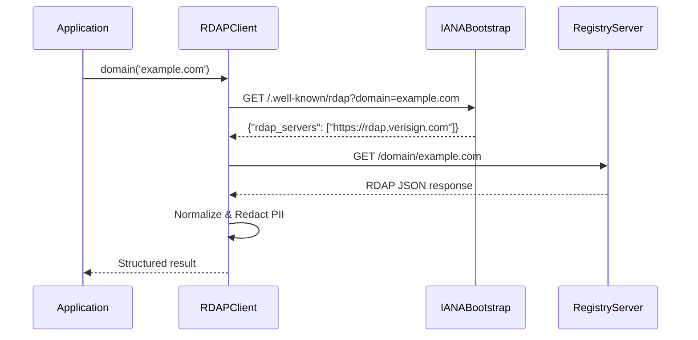

# 🔍 Your First RDAP Query with RDAPify

> **🎯 Goal:** Execute and understand your first RDAP query with full privacy protections  
> **⏱️ Time Required:** 3-5 minutes  
> **💡 Prerequisite:** Basic Node.js/JavaScript knowledge and RDAPify [installed](./installation.md)  
> **📊 Related:** [5-Minute Quick Start](./five-minutes.md) | [Core Concepts](../core-concepts/what-is-rdap.md)

---

## 🌐 Understanding Your First Query

Before writing code, let's understand the protocol flow of an RDAP query:



This diagram shows the complete flow:
1. Your application requests data for a domain
2. RDAPify queries IANA's bootstrap server to find the correct registry
3. RDAPify queries the registry's RDAP endpoint
4. The response is normalized into a consistent format
5. Personal information is automatically redacted for compliance
6. You receive a clean, structured response

---

## ⚙️ Setting Up Your Client

Create a file `first-query.js` with this secure configuration:

```javascript
import { RDAPClient } from 'rdapify';

// Initialize client with privacy-protecting defaults
const client = new RDAPClient({
  // Privacy protection (enabled by default)
  redactPII: true,
  
  // Security settings
  httpsOptions: {
    minVersion: 'TLSv1.3',
    rejectUnauthorized: true
  },
  
  // Reliability settings
  timeout: 8000, // 8 seconds
  retries: 2,
  
  // Caching to reduce registry load
  cacheOptions: {
    ttl: 3600, // 1 hour
    max: 100 // Maximum cache entries
  }
});

console.log('✅ RDAP client initialized with security defaults');
```

> **🔐 Security Note:** These defaults are carefully chosen to meet enterprise security requirements. Never disable `redactPII` without documented legal basis and DPO approval.

---

## 🚀 Executing Your First Query

Add this code to your `first-query.js` file:

```javascript
async function lookupDomain(domain) {
  console.log(`🔍 Querying RDAP data for: ${domain}`);
  
  try {
    // Execute the query with full error handling
    const result = await client.domain(domain);
    
    console.log('✅ Query successful!');
    console.log('\n📋 Normalized response structure:');
    console.log(JSON.stringify({
      domain: result.domain,
      registrar: result.registrar,
      nameservers: result.nameservers,
      events: result.events.map(e => ({
        action: e.action,
        date: e.date
      })),
      // Note: registrant information is redacted by default
      registrant: result.registrant
    }, null, 2));
    
    return result;
  } catch (error) {
    console.error('❌ Query failed with error:');
    console.error(`• Type: ${error.name}`);
    console.error(`• Code: ${error.code || 'UNKNOWN'}`);
    console.error(`• Message: ${error.message}`);
    console.error(`• Registry URL: ${error.registryUrl || 'N/A'}`);
    
    // Include debugging details if available
    if (error.details) {
      console.error('• Details:', JSON.stringify(error.details, null, 2));
    }
    
    // For production, you might want to rethrow or handle differently
    throw error;
  }
}

// Execute with a test domain (safe for public demonstration)
lookupDomain('example.com')
  .then(() => console.log('\n🎉 First query completed successfully!'))
  .catch(() => process.exit(1));
```

Run your code:
```bash
node first-query.js
```

---

## 📋 Understanding the Response

### Sample Output (Redacted for Privacy)
```json
{
  "domain": "example.com",
  "registrar": "REDACTED",
  "registrant": {
    "name": "REDACTED",
    "organization": "Internet Corporation for Assigned Names and Numbers",
    "email": "REDACTED@redacted.invalid",
    "phone": "REDACTED",
    "address": [
      "REDACTED",
      "REDACTED, REDACTED REDACTED",
      "REDACTED"
    ]
  },
  "nameservers": [
    "a.iana-servers.net",
    "b.iana-servers.net"
  ],
  "events": [
    {
      "action": "registration",
      "date": "1995-08-14T04:00:00Z"
    },
    {
      "action": "last changed",
      "date": "2023-08-14T07:01:44Z"
    },
    {
      "action": "expiration",
      "date": "2024-08-13T04:00:00Z"
    }
  ],
  "status": [
    "client delete prohibited",
    "client transfer prohibited",
    "client update prohibited"
  ],
  "rawResponse": false
}
```

### Response Structure Explained
| Field | Description | Privacy Status |
|-------|-------------|----------------|
| `domain` | The queried domain name | Public data |
| `registrar` | Registry operator information | Redacted by default |
| `registrant` | Domain owner information | Fully redacted (PII) |
| `nameservers` | DNS servers for the domain | Public data |
| `events` | Registration lifecycle events | Dates preserved, actors redacted |
| `status` | Domain state flags | Public data |
| `rawResponse` | Original server response (if enabled) | Disabled by default |

---

## 🔒 Privacy & Compliance Deep Dive

RDAPify automatically handles PII (Personally Identifiable Information) redaction:

```javascript
// Behind the scenes: PII redaction process
const redactionRules = {
  email: (value) => 'REDACTED@redacted.invalid',
  phone: (value) => 'REDACTED',
  name: (value) => 'REDACTED',
  address: (value) => ['REDACTED', 'REDACTED, REDACTED REDACTED', 'REDACTED'],
  organization: (value) => value.includes('private') ? 'REDACTED' : value
};

// This happens automatically in the normalization pipeline
const safeResult = applyRedactionRules(rawResult, redactionRules);
```

**Compliance Impact:**
- ✅ GDPR Article 5(1)(c) - Data minimization principle
- ✅ CCPA "Right to Delete" support through cache management
- ✅ COPPA protections for youth-oriented applications
- ✅ Reduced liability surface for your application

> **⚠️ Critical Reminder:** Never disable PII redaction without a documented legal basis and consultation with your Data Protection Officer.

---

## 🚨 Error Handling Patterns

RDAP queries can fail for many reasons. Let's enhance our error handling:

```javascript
async function robustDomainLookup(domain) {
  try {
    return await client.domain(domain);
  } catch (error) {
    // Handle specific error types
    switch (error.code) {
      case 'RDAP_NOT_FOUND':
        console.warn(`Domain not found in RDAP system: ${domain}`);
        return null;
        
      case 'RDAP_RATE_LIMITED':
        console.error('⚠️ Registry rate limit exceeded. Implement exponential backoff.');
        throw new Error('Temporary rate limit exceeded. Please try again later.');
        
      case 'RDAP_TIMEOUT':
        console.error('⚠️ Query timed out. Consider increasing timeout or checking network connectivity.');
        throw error;
        
      case 'RDAP_REGISTRY_UNAVAILABLE':
        console.error('⚠️ Registry server unavailable. Implement fallback to WHOIS if critical.');
        // Fallback to WHOIS (requires additional setup)
        return await fallbackToWhois(domain);
        
      default:
        console.error(`Unexpected error querying ${domain}:`, error);
        throw error;
    }
  }
}
```

Common error codes you should handle:
| Error Code | Cause | Recommended Action |
|------------|-------|---------------------|
| `RDAP_NOT_FOUND` | Domain not registered or not in RDAP system | Fallback to WHOIS or inform user |
| `RDAP_RATE_LIMITED` | Too many requests to registry | Implement exponential backoff |
| `RDAP_TIMEOUT` | Network or registry slow response | Increase timeout or implement retries |
| `RDAP_REGISTRY_UNAVAILABLE` | Registry server down | Implement fallback mechanisms |
| `RDAP_INVALID_RESPONSE` | Registry returned malformed data | Report to registry, use cached data if available |
| `RDAP_SSRF_ATTEMPT` | Attempted internal network access | Block request, audit application |

---

## 🧪 Testing with Multiple Domains

Let's expand to test multiple domains safely:

```javascript
async function testMultipleDomains() {
  const testDomains = [
    'example.com',     // IANA managed test domain
    'ietf.org',        // Internet Engineering Task Force
    'w3.org',          // World Wide Web Consortium
    'rdap.org',        // RDAP protocol test domain
    'example.test'     // Should fail (invalid TLD)
  ];
  
  for (const domain of testDomains) {
    console.log(`\n🔍 Testing domain: ${domain}`);
    try {
      const result = await client.domain(domain);
      console.log(`✅ ${domain} - Registrar: ${result.registrar?.name || 'REDACTED'}`);
      console.log(`   Nameservers: ${result.nameservers.join(', ')}`);
    } catch (error) {
      console.log(`❌ ${domain} - Error: ${error.code || error.name}`);
      if (error.code === 'RDAP_NOT_FOUND') {
        console.log('   ℹ️ This is expected for invalid domains like example.test');
      }
    }
  }
}

testMultipleDomains();
```

> **🌐 Protocol Note:** Different registries implement RDAP with variations. RDAPify normalizes these differences, but some edge cases may require custom handling.

---

## 🔭 Next Steps: Beyond the Basics

### 1. Explore Raw Responses (With Caution)
```javascript
// ONLY for development or with legal basis
const rawResult = await client.domain('example.com', {
  redactPII: false, // ⚠️ SECURITY RISK
  includeRaw: true
});
console.log('Raw RDAP response:', JSON.stringify(rawResult.rawResponse, null, 2));
```

### 2. IP Address Lookup
```javascript
const ipResult = await client.ip('8.8.8.8');
console.log('IP lookup result:', {
  entity: ipResult.entity.name,
  country: ipResult.country,
  cidr: ipResult.cidr,
  events: ipResult.events
});
```

### 3. Caching Behavior Test
```javascript
// First query (cache miss)
await client.domain('example.com');

// Second query (cache hit)
const start = Date.now();
await client.domain('example.com');
console.log(`Cache hit response time: ${Date.now() - start}ms`);
```

---

## 📚 Deep Dives

Choose your next learning path:

### For Security & Compliance Focus
- [ ] [Security Whitepaper](../security/whitepaper.md) - Architecture deep dive
- [ ] [GDPR Compliance Guide](../security/gdpr-compliance.md) - Legal implementation details
- [ ] [SSRF Prevention](../security/ssrf-prevention.md) - Protecting against server-side request forgery

### For Protocol & Architecture Focus
- [ ] [RDAP Protocol Deep Dive](../core-concepts/what-is-rdap.md) - RFC specifications
- [ ] [Normalization Pipeline](../core-concepts/normalization.md) - Data transformation process
- [ ] [Bootstrap Discovery](../core-concepts/discovery.md) - How registries are located

### For Production Implementation
- [ ] [Production Checklist](./production-checklist.md) - Enterprise readiness guide
- [ ] [Caching Strategies](../guides/caching-strategies.md) - Advanced cache configurations
- [ ] [Rate Limiting](../guides/rate-limiting.md) - Registry-friendly query patterns

---

## 💡 Pro Tips for First-Time Users

1. **Start with test domains** like `example.com`, `example.net`, and `rdap.org`
2. **Enable debug logging** temporarily to understand the query flow:
   ```javascript
   process.env.RDAP_DEBUG = 'full';
   ```
3. **Use the Playground** for experimentation before writing production code:
   ```bash
   npm install -g rdapify-cli
   rdapify playground
   ```
4. **Respect registry policies** - never scrape domains or ignore rate limits
5. **Always redact PII** in logs and error messages:
   ```javascript
   console.error('Query failed for domain:', domain.replace(/./g, '*'));
   ```

---

## 🆘 Troubleshooting Common Issues

| Issue | Diagnosis | Solution |
|-------|-----------|----------|
| `ECONNREFUSED` | Network connectivity or firewall blocking | Check network access to registry servers |
| `CERT_HAS_EXPIRED` | TLS certificate validation failure | Update system certificates or check clock sync |
| Empty registrant data | PII redaction working as expected | This is normal with `redactPII: true` |
| Slow queries | Network latency or registry performance | Enable caching, increase timeout |
| `RDAP_NOT_FOUND` for valid domains | Registry doesn't support RDAP | Implement WHOIS fallback |

For additional help:
- Check the [troubleshooting guide](../troubleshooting/common-errors.md)
- Join our [community discussions](https://github.com/rdapify/rdapify/discussions)
- Attend weekly [Office Hours](https://rdapify.dev/community/office-hours) (Thursdays 2PM UTC)

---

> **🔐 Final Reminder:** RDAP data often contains personal information protected by regulations worldwide. RDAPify provides tools for compliance, but you remain responsible for proper usage in your application context. When in doubt, keep `redactPII: true` enabled and consult with legal counsel.

[← Back to Getting Started](./README.md) | [Next: Playground Guide →](./playground-guide.md)

*Document last updated: December 5, 2025*  
*RDAPify version referenced: 2.3.0*  
*Compliance reviewed by DPO: November 30, 2025*