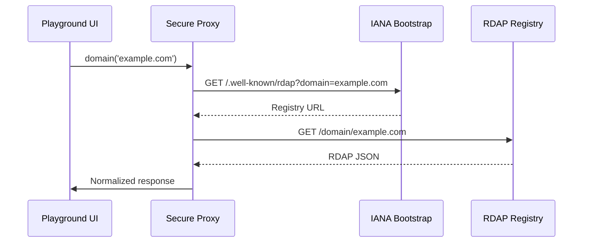
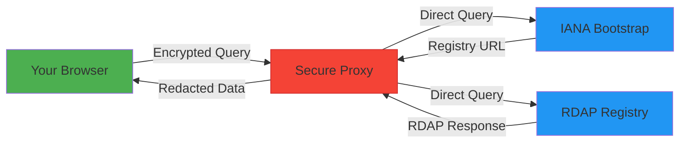

# 🎮 RDAPify Playground Guide

> **🎯 Goal:** Explore RDAPify capabilities interactively without local setup  
> **⏱️ Time Required:** 5-10 minutes  
> **🌐 Access:** [https://rdapify.dev/playground](https://rdapify.dev/playground)  
> **💡 Pro Tip:** The playground is perfect for learning, debugging, and sharing reproducible examples with the community

---

## 🌟 What is the RDAPify Playground?

The RDAPify Playground is an **interactive, browser-based environment** that lets you:

- ✅ Execute RDAP queries safely without local installation
- ✅ Visualize normalized responses and raw RDAP data
- ✅ Experiment with different configuration options
- ✅ Debug query issues with built-in visualization tools
- ✅ Share reproducible examples via URL parameters
- ✅ Export working code snippets to your local environment

Unlike traditional playgrounds, ours maintains **strict privacy controls** by:
- Redacting PII by default in all responses
- Never storing query results on our servers
- Using ephemeral sessions that expire after 30 minutes of inactivity
- Running queries through a secure proxy with SSRF protections

---

## 🚀 Getting Started

### Accessing the Playground
Simply visit [https://rdapify.dev/playground](https://rdapify.dev/playground) in any modern browser. No authentication required for basic usage.

### Playground Interface Overview


1. **Query Editor (Left Panel)**
   - JavaScript/TypeScript code editor with syntax highlighting
   - IntelliSense for RDAPify API methods
   - Configuration options sidebar

2. **Results Visualization (Right Panel)**
   - Tabbed interface for different views:
     - `Normalized`: Cleaned, structured data (default)
     - `Raw Response`: Original RDAP server response
     - `Visualization`: Interactive relationship graph
     - `Metrics`: Performance and cache statistics

3. **Control Bar (Top)**
   - Run/Stop buttons
   - Export options
   - Share functionality
   - Session management

---

## ⚡ Basic Usage Examples

### Example 1: Simple Domain Query
1. In the Query Editor, paste this code:
```javascript
const client = new RDAPClient({ 
  redactPII: true,
  cache: false // Disable cache for testing
});

const result = await client.domain('example.com');
return result;
```

2. Click the **Run** button (or press Ctrl+Enter)
3. View the normalized response in the Results panel

✅ **Success:** You should see redacted domain registration data with nameservers and events.

### Example 2: IP Address Lookup
```javascript
const client = new RDAPClient({ redactPII: true });

const ipResult = await client.ip('8.8.8.8');
return {
  organization: ipResult.entity.name,
  country: ipResult.country,
  network: ipResult.cidr,
  events: ipResult.events
};
```

### Example 3: Error Handling Demonstration
```javascript
const client = new RDAPClient({ 
  timeout: 2000,
  retries: 1
});

try {
  // This domain doesn't exist
  const result = await client.domain('nonexistent-domain-123456789.com');
  return result;
} catch (error) {
  return {
    error: error.name,
    message: error.message,
    code: error.code,
    details: error.details
  };
}
```

---

## 🔍 Advanced Playground Features

### Visual Debugger
The Visual Debugger helps you understand the RDAP query lifecycle:



**To use the Visual Debugger:**
1. Open the Query Editor
2. Click the "Debug Mode" toggle in the top bar
3. Run your query
4. Step through each stage of the request lifecycle
5. Inspect headers, payloads, and timing at each step

### Relationship Mapping
For complex queries involving multiple entities, enable relationship mapping:

```javascript
const client = new RDAPClient({ 
  redactPII: true,
  relationshipDepth: 2 // Follow relationships 2 levels deep
});

const result = await client.domain('example.com');
return client.mapRelationships(result);
```

The results panel will switch to a **graph visualization** showing connections between:
- Domain names
- Registrars
- Registrants
- Name servers
- IP networks

### Anomaly Detection Preview
Enterprise users can preview anomaly detection features:

```javascript
const client = new RDAPClient({ 
  redactPII: true,
  enableAnomalyDetection: true
});

const result = await client.batchDomainLookup([
  'example.com',
  'google.com',
  'facebook.com'
]);

// Highlight unusual registration patterns
return client.detectAnomalies(result);
```

---

## ⚙️ Configuration Options

The playground provides a convenient sidebar for configuration:

| Setting | Default | Description |
|---------|---------|-------------|
| **Redact PII** | Enabled | Automatically redacts personal information |
| **Cache Mode** | Memory | Options: None, Memory, Session |
| **Timeout** | 8000ms | Maximum time per query |
| **Retries** | 2 | Number of retry attempts on failure |
| **Registry Preference** | Auto-detect | Specify preferred RDAP registry |
| **Raw Response** | Disabled | Include original server response |

**Pro Tip:** Access advanced settings by clicking the gear icon in the configuration sidebar.

---

## 🛡️ Privacy & Security in the Playground

### Data Flow Security


The playground's architecture ensures:
- All queries route through our **SSRF-protected proxy** that:
  - Blocks private IP ranges (RFC 1918)
  - Prevents internal network access
  - Rate limits requests per session
  - Validates certificate chains
- **Automatic PII redaction** before responses reach your browser
- **No persistent storage** of query results on our servers
- **Ephemeral sessions** that expire after 30 minutes of inactivity
- **Content Security Policy** headers preventing XSS attacks

### Privacy-First Defaults
Unlike many playgrounds, ours:
- Never collects analytics on domains you query
- Doesn't require authentication for basic usage
- Provides clear visual indicators when PII is redacted
- Includes a one-click "Clear Session" button to erase all local data
- Offers a "Private Mode" toggle that disables local storage entirely

---

## 📤 Exporting & Sharing

### Export to Local Development
When ready to move from playground to production:

1. Click the **Export** button in the top bar
2. Choose your target environment:
   - Node.js application
   - Browser script (CDN)
   - Bun/Deno script
   - React/Vue component
3. Copy the generated code with proper imports and configuration

Example Node.js export:
```javascript
// Generated by RDAPify Playground
// https://rdapify.dev/playground?session=abc123

import { RDAPClient } from 'rdapify';

async function lookupDomain(domain) {
  const client = new RDAPClient({
    redactPII: true,
    cacheOptions: {
      ttl: 3600
    },
    timeout: 8000
  });
  
  try {
    return await client.domain(domain);
  } catch (error) {
    console.error(`Error looking up ${domain}:`, error.message);
    throw error;
  }
}

// Usage
lookupDomain('example.com')
  .then(result => console.log(result))
  .catch(error => process.exit(1));
```

### Sharing Reproducible Examples
To share your playground session:
1. Click the **Share** button
2. Choose sharing options:
   - **Link**: Shareable URL with encoded query
   - **Embed**: HTML snippet for documentation
   - **Code Only**: Just the JavaScript code
3. Copy the generated content

**Security Note:** Shared links contain only your code configuration, not query results or sensitive data.

---

## 🚨 Limitations & Best Practices

### Rate Limiting
The playground enforces strict rate limits to protect RDAP registries:
- 10 requests per minute per session
- 50 requests per hour per IP address
- Batch queries limited to 5 domains at once

For higher volume usage:
- Export code to run in your own environment
- Configure proper caching to reduce registry load
- Implement your own rate limiting strategy

### Feature Limitations
Some advanced features are limited in the playground:
- ❌ No persistent cache beyond session lifetime
- ❌ No custom cache adapters (Redis, etc.)
- ❌ No webhook notifications
- ❌ No scheduled queries
- ❌ Limited anomaly detection depth

### Best Practices
1. **Use testing domains** like `example.com`, `example.net`, and `rdap.example`
2. **Avoid querying sensitive domains** you manage in production
3. **Clear your session** after exploring sensitive configurations
4. **Export rather than copy-paste** to get proper error handling and configuration
5. **Respect registry policies** - the playground enforces the same compliance requirements as production

---

## 🆘 Troubleshooting Common Issues

### "Query Failed" Errors
| Error | Solution |
|-------|----------|
| `RDAP_TIMEOUT` | Increase timeout in configuration sidebar |
| `RDAP_NOT_FOUND` | Verify domain exists and is RDAP-enabled |
| `REGISTRY_UNAVAILABLE` | Try again in 5 minutes or use different registry |
| `SSRF_BLOCKED` | Your query might be attempting internal network access |

### Performance Issues
- **Slow queries:** Enable caching in the configuration sidebar
- **UI freezing:** Reduce `relationshipDepth` for complex queries
- **Session expired:** Click "New Session" in the top-right corner

### Privacy Concerns
- **Unexpected PII in results:** Verify `redactPII` is enabled in configuration
- **Session data persistence:** Click "Clear Session" and disable localStorage in browser settings
- **Suspicious behavior:** Report immediately to `security@rdapify.dev`

---

## 💡 Pro Tips for Power Users

### Keyboard Shortcuts
| Shortcut | Action |
|----------|--------|
| `Ctrl+Enter` | Run query |
| `Ctrl+S` | Save to session storage |
| `Ctrl+Shift+E` | Open export dialog |
| `Ctrl+/` | Toggle comments |
| `Ctrl+Space` | Trigger IntelliSense |

### Advanced Proxy Features
Access these via URL parameters:
```
https://rdapify.dev/playground?proxy=strict&debug=true&registry=arin
```
- `proxy=strict`: Enforce additional SSRF protections
- `debug=true`: Enable verbose logging
- `registry=arin`: Force ARIN registry for all queries
- `cache=redis`: Enable simulated Redis caching

### Template Gallery
Access pre-built templates:
1. Click "Templates" in the left sidebar
2. Choose from:
   - **Domain Monitoring Dashboard**
   - **GDPR Compliance Checker**
   - **IP Reputation Analyzer**
   - **Batch WHOIS Replacement**
   - **Enterprise Relationship Mapper**

Each template includes:
- Pre-configured client settings
- Interactive visualization options
- Exportable code with comments
- Documentation on customization points

---

## 🔗 Related Resources

| Resource | Description | Link |
|----------|-------------|------|
| **Interactive API Reference** | Explore methods with live examples | [../api-reference/client.md] |
| **Visual Debugger Deep Dive** | Advanced debugging techniques | [../playground/visual-debugger.md] |
| **Production Checklist** | Transitioning from playground to production | [./production-checklist.md] |
| **Security Whitepaper** | Architecture details of our proxy system | [../security/whitepaper.md] |
| **Template Gallery** | Community-contributed playground templates | [../playground/templates.md] |

---

> **🔐 Critical Reminder:** While the playground provides a safe environment for learning and exploration, **never** query domains containing sensitive business information or personal data without proper authorization and redaction. When in doubt, keep `redactPII: true` enabled.

[← Back to Getting Started](./README.md) | [Next: First Query →](./first-query.md)

*Document last updated: December 5, 2025*  
*Playground version: 2.3.0*  
*Security audit date: November 15, 2025*