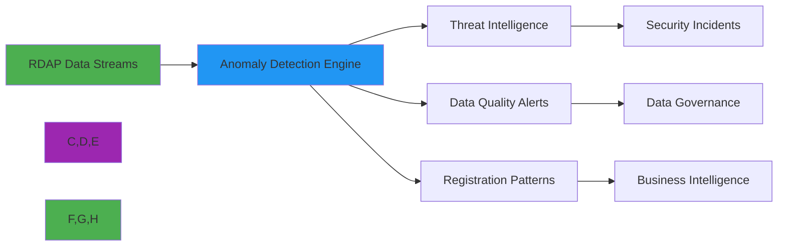
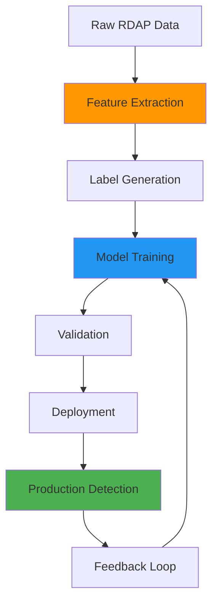

# 🕵️ Anomaly Detection Guide

> **🎯 Purpose:** Comprehensive guide to implementing anomaly detection systems for RDAP data to identify security threats, data quality issues, and registration patterns  
> **📚 Related:** [Security & Privacy](security_privacy.md) | [Batch Processing](batch-processing.md) | [Analytics Dashboard](../analytics/dashboard_components.md)  
> **⏱️ Reading Time:** 7 minutes  
> **🔍 Pro Tip:** Use the [Anomaly Simulator](../../playground/anomaly-simulator.md) to test detection patterns with your specific domain portfolios and threat models

---

## 🌐 Why Anomaly Detection Matters for RDAP

RDAP data contains valuable signals about domain registration patterns, infrastructure changes, and security threats. Anomaly detection transforms this data from static records into actionable intelligence:



**Critical Anomaly Detection Use Cases:**
- ✅ **Security Threats**: Domain hijacking, phishing campaigns, bulletproof hosting
- ✅ **Data Quality Issues**: Registration data corruption, incomplete records
- ✅ **Business Intelligence**: Competitor monitoring, brand protection patterns
- ✅ **Compliance Monitoring**: Regulatory compliance violations, prohibited TLD usage
- ✅ **Operational Health**: Registry infrastructure issues, rate limiting patterns

---

## 🧠 Core Detection Patterns

### 1. Statistical Anomaly Detection
```typescript
import { AnomalyDetector, StatisticalModel } from 'rdapify/analytics';

const detector = new AnomalyDetector({
  model: new StatisticalModel({
    algorithm: 'isolation-forest', // or 'z-score', 'grubbs-test'
    featureEngineering: {
      temporalFeatures: true, // Time-based patterns
      registrationVelocity: true, // Domains registered per time period
      infrastructureChanges: true // Nameserver/IP changes
    },
    sensitivity: {
      threshold: 3.5, // 3.5 standard deviations
      minimumSamples: 1000, // Minimum samples for reliable detection
      falsePositiveRate: 0.01 // 1% acceptable false positive rate
    }
  }),
  features: [
    'registration_date_frequency',
    'nameserver_changes',
    'registrar_changes',
    'status_changes',
    'contact_changes'
  ],
  temporalWindows: {
    shortTerm: '1h',   // Recent anomalies
    mediumTerm: '24h', // Daily patterns
    longTerm: '30d'    // Historical trends
  }
});

// Detect anomalies in domain portfolio
const anomalies = await detector.detectAnomalies({
  domains: ['example.com', 'microsoft.com', 'google.com'],
  timeRange: { start: new Date(Date.now() - 86400000), end: new Date() }
});

console.log(`Detected ${anomalies.length} anomalies`);
anomalies.forEach(anomaly => {
  console.log(`- ${anomaly.domain}: ${anomaly.type} (score: ${anomaly.score.toFixed(2)})`);
});
```

### 2. Behavioral Pattern Recognition
```typescript
class RegistrationBehaviorClassifier {
  private readonly patterns = {
    // Suspicious registration patterns
    rapidRegistration: {
      domainsPerHour: 10,
      sameRegistrar: true,
      sameContact: true
    },
    bulletproofHosting: {
      privacyProtection: true,
      rapidNameserverChanges: 3,
      highRiskTLDs: ['.xyz', '.top', '.club']
    },
    domainHijacking: {
      recentStatusChanges: ['clientTransferProhibited', 'serverTransferProhibited'],
      recentContactChanges: true
    },
    phishingCampaign: {
      newRegistrant: true,
      similarToLegitimate: true,
      highRiskKeywords: ['login', 'secure', 'account', 'verify']
    }
  };
  
  classify(domainData: DomainData): BehaviorProfile {
    const profile = {
      riskScore: 0,
      patterns: [] as string[],
      confidence: 0.0
    };
    
    // Check for rapid registration patterns
    if (this.isRapidRegistration(domainData)) {
      profile.riskScore += 30;
      profile.patterns.push('rapid-registration');
    }
    
    // Check for bulletproof hosting indicators
    if (this.isBulletproofHosting(domainData)) {
      profile.riskScore += 45;
      profile.patterns.push('bulletproof-hosting');
    }
    
    // Check for domain hijacking signs
    if (this.isDomainHijacking(domainData)) {
      profile.riskScore += 60;
      profile.patterns.push('domain-hijacking');
    }
    
    profile.confidence = this.calculateConfidence(profile);
    return profile;
  }
  
  private isRapidRegistration(domainData: DomainData): boolean {
    // Implementation details
  }
  
  private calculateConfidence(profile: BehaviorProfile): number {
    // Weighted confidence calculation based on pattern combinations
    return Math.min(1.0, profile.riskScore / 100 * 0.8 + 0.2);
  }
}
```

---

## 🔐 Security & Privacy Considerations

### PII-Aware Anomaly Detection
Anomaly detection systems must balance security effectiveness with privacy compliance:

| Data Type | Anomaly Detection Value | Privacy Risk | Mitigation Strategy |
|-----------|-------------------------|--------------|---------------------|
| **Domain Names** | High (patterns, similarities) | Low | Safe to process |
| **Registrant Names** | Medium (registration velocity) | High | Redact before processing |
| **Email Addresses** | Medium (contact patterns) | High | Hash or aggregate |
| **IP Addresses** | High (network analysis) | Medium | Anonymize to /24 |
| **Nameservers** | High (infrastructure patterns) | Low | Safe to process |
| **Registration Dates** | High (temporal patterns) | Low | Safe to process |

**Implementation:**
```typescript
const privacyAwareDetector = new AnomalyDetector({
  privacy: {
    redactionLevel: 'strict', // GDPR-compliant processing
    aggregatePII: true, // Aggregate personal data instead of individual analysis
    anonymizeNetworks: true, // Anonymize IP networks to /24
    consentRequired: true // Require explicit consent for PII processing
  },
  detection: {
    focusOnTechnicalData: true, // Prioritize technical over personal data
    infrastructurePatternsOnly: false // Include personal data with consent
  }
});

// Compliant anomaly detection
const results = await privacyAwareDetector.detectAnomalies({
  domains: monitoredDomains,
  consent: {
    granted: true,
    purpose: 'security monitoring',
    timestamp: new Date(),
    withdrawalUrl: 'https://yourapp.com/consent/withdraw'
  }
});
```

### Compliance-Aware Thresholds
```typescript
class ComplianceAwareDetector {
  private readonly gdprThresholds = {
    dataMinimization: true,
    purposeLimitation: true,
    storageLimitation: '30 days',
    transparency: true
  };
  
  private readonly ccpaThresholds = {
    optOutRequired: true,
    doNotSell: true,
    deletionRights: true
  };
  
  detectWithCompliance(domains: string[], context: ComplianceContext): Promise<AnomalyReport[]> {
    // Validate legal basis before processing
    if (!this.validateLegalBasis(context)) {
      throw new ComplianceError('INVALID_LEGAL_BASIS', 
        'No valid legal basis for anomaly detection processing');
    }
    
    // Apply compliance thresholds
    const thresholds = this.getComplianceThresholds(context);
    
    return this.detect(domains, {
      thresholds,
      retentionPeriod: thresholds.storageLimitation,
      auditTrail: true
    });
  }
  
  private validateLegalBasis(context: ComplianceContext): boolean {
    return context.legalBasis === 'legitimate-interest' && 
           context.purpose === 'security monitoring';
  }
}
```

---

## ⚙️ Implementation Strategies

### 1. Real-time Streaming Detection
```typescript
import { StreamAnomalyDetector, KafkaSource } from 'rdapify/analytics';

const streamDetector = new StreamAnomalyDetector({
  source: new KafkaSource({
    brokers: ['kafka1.example.com:9092'],
    topic: 'rdap-queries',
    groupId: 'anomaly-detection'
  }),
  model: {
    type: 'online-learning',
    algorithm: 'hoeffding-tree',
    updateFrequency: '10s',
    driftDetection: true
  },
  alerting: {
    webhook: 'https://security.example.com/alerts',
    severityThresholds: {
      critical: 90,
      high: 75,
      medium: 60,
      low: 45
    }
  }
});

// Start real-time detection
streamDetector.start();

// Handle security alerts
streamDetector.on('anomaly-detected', (alert: SecurityAlert) => {
  if (alert.severity === 'critical') {
    securityTeam.notify(alert);
    incidentResponse.initiate(alert);
  }
  
  auditLogger.log('anomaly-detection', {
    domain: alert.domain,
    score: alert.score,
    patterns: alert.patterns,
    timestamp: new Date().toISOString()
  });
});
```

### 2. Batch Processing for Historical Analysis
```typescript
class HistoricalAnomalyAnalyzer {
  async analyzePortfolio(domains: string[], timeRange: TimeRange): Promise<PortfolioAnalysis> {
    // Fetch historical RDAP data for all domains
    const historicalData = await this.fetchHistoricalData(domains, timeRange);
    
    // Build relationship graphs
    const relationshipGraph = this.buildRelationshipGraph(historicalData);
    
    // Detect anomalies using multiple models
    const anomalies = await Promise.all([
      this.detectRegistrationAnomalies(historicalData),
      this.detectInfrastructureAnomalies(relationshipGraph),
      this.detectTemporalAnomalies(historicalData)
    ]);
    
    // Aggregate and correlate anomalies
    return this.correlateAnomalies(anomalies, relationshipGraph);
  }
  
  private buildRelationshipGraph(data: HistoricalData[]): RelationshipGraph {
    const graph = new NetworkGraph();
    
    // Add nodes for domains, registrants, nameservers
    data.forEach(record => {
      graph.addNode(`domain:${record.domain}`, { type: 'domain' });
      graph.addNode(`registrar:${record.registrar}`, { type: 'registrar' });
      record.nameservers.forEach(ns => {
        graph.addNode(`nameserver:${ns}`, { type: 'nameserver' });
      });
      
      // Add edges for relationships
      graph.addEdge(`domain:${record.domain}`, `registrar:${record.registrar}`, { type: 'uses' });
      record.nameservers.forEach(ns => {
        graph.addEdge(`domain:${record.domain}`, `nameserver:${ns}`, { type: 'resolves-to' });
      });
    });
    
    return this.identifyCommunities(graph);
  }
  
  private identifyCommunities(graph: NetworkGraph): RelationshipGraph {
    // Use community detection algorithms to identify related domains
    const communities = graph.detectCommunities({
      algorithm: 'louvain',
      resolution: 1.0
    });
    
    // Enrich graph with community information
    communities.forEach((community, index) => {
      community.nodes.forEach(node => {
        graph.setNodeAttribute(node, 'community', index);
      });
    });
    
    return graph;
  }
}
```

### 3. ML Model Training Pipeline


**Implementation:**
```typescript
class MLTrainingPipeline {
  private readonly featureExtractor = new RDAPFeatureExtractor();
  private readonly labelGenerator = new AnomalyLabelGenerator({
    sources: ['threat-intel', 'manual-labels', 'security-reports']
  });
  
  async trainModel(trainingData: RDAPRecord[], validationData: RDAPRecord[]): Promise<Model> {
    // Extract features
    const features = await this.featureExtractor.extract(trainingData);
    
    // Generate labels
    const labels = await this.labelGenerator.generate(trainingData);
    
    // Train ensemble model
    const model = await this.trainEnsembleModel(features, labels, {
      baseModels: [
        { type: 'isolation-forest', params: { contamination: 0.1 } },
        { type: 'one-class-svm', params: { nu: 0.1 } },
        { type: 'autoencoder', params: { hiddenLayers: [64, 32, 16] } }
      ],
      ensembleMethod: 'weighted-average'
    });
    
    // Validate model
    const validationFeatures = await this.featureExtractor.extract(validationData);
    const validationMetrics = this.validateModel(model, validationFeatures);
    
    if (validationMetrics.f1Score < 0.85) {
      throw new Error(`Model validation failed: F1 score ${validationMetrics.f1Score.toFixed(2)}`);
    }
    
    // Deploy model
    await this.deployModel(model, validationMetrics);
    
    return model;
  }
  
  private async deployModel(model: Model, metrics: ValidationMetrics): Promise<void> {
    // Save model with versioning
    const version = `v${new Date().toISOString().replace(/[-:]/g, '')}`;
    await modelStore.save(`anomaly-detector-${version}`, model);
    
    // Update production model pointer
    await modelStore.updateCurrentVersion(version);
    
    // Log deployment
    auditLogger.log('model-deployment', {
      version,
      metrics,
      timestamp: new Date().toISOString()
    });
  }
}
```

---

## 🚀 Advanced Patterns

### 1. Cross-Registry Anomaly Correlation
```typescript
class CrossRegistryAnomalyCorrelator {
  async correlateAnomalies(registryResults: RegistryAnomalyResults[]): Promise<CorrelatedAnomalies> {
    const correlationMatrix = this.buildCorrelationMatrix(registryResults);
    
    // Find cross-registry patterns
    const crossRegistryPatterns = {
      registryHopping: this.detectRegistryHopping(registryResults),
      infrastructureMismatches: this.detectInfrastructureMismatches(registryResults),
      temporalCorrelations: this.detectTemporalCorrelations(registryResults)
    };
    
    // Build correlation graph
    const correlationGraph = this.buildCorrelationGraph(correlationMatrix, crossRegistryPatterns);
    
    // Identify high-priority anomalies
    const highPriority = this.identifyHighPriorityAnomalies(correlationGraph);
    
    return {
      correlationGraph,
      crossRegistryPatterns,
      highPriority,
      confidenceScores: this.calculateConfidence(correlationGraph)
    };
  }
  
  private detectRegistryHopping(results: RegistryAnomalyResults[]): RegistryHoppingPattern[] {
    const patterns: RegistryHoppingPattern[] = [];
    
    // Group by registrant
    const registrants = new Map<string, RegistryRegistration[]>();
    
    results.forEach(result => {
      result.anomalies.forEach(anomaly => {
        if (anomaly.registrantHandle) {
          if (!registrants.has(anomaly.registrantHandle)) {
            registrants.set(anomaly.registrantHandle, []);
          }
          
          registrants.get(anomaly.registrantHandle)!.push({
            registry: result.registry,
            domain: anomaly.domain,
            timestamp: anomaly.timestamp
          });
        }
      });
    });
    
    // Analyze registrant patterns
    registrants.forEach((registrations, registrant) => {
      // Sort by timestamp
      registrations.sort((a, b) => a.timestamp - b.timestamp);
      
      // Check for rapid registry changes
      for (let i = 1; i < registrations.length; i++) {
        const timeDiff = registrations[i].timestamp - registrations[i-1].timestamp;
        
        if (registrations[i].registry !== registrations[i-1].registry && timeDiff < 86400000) { // 24 hours
          patterns.push({
            registrant,
            domains: [registrations[i-1].domain, registrations[i].domain],
            registries: [registrations[i-1].registry, registrations[i].registry],
            timeDiff,
            riskScore: 85
          });
        }
      }
    });
    
    return patterns;
  }
}
```

### 2. Threat Intelligence Integration
```typescript
class ThreatIntelligenceIntegrator {
  private readonly threatSources = [
    new MISPConnector('https://misp.example.com'),
    new OpenCTIConnector('https://opencti.example.com'),
    new CustomThreatFeed('https://threats.example.com/feed')
  ];
  
  async enrichAnomalies(anomalies: Anomaly[], context: ThreatContext): Promise<EnrichedAnomalies> {
    // Fetch relevant threat intelligence
    const threatData = await this.fetchThreatData(anomalies, context);
    
    // Enrich anomalies with threat intelligence
    return anomalies.map(anomaly => {
      const relevantThreats = this.findRelevantThreats(anomaly, threatData);
      
      return {
        ...anomaly,
        threats: relevantThreats,
        threatScore: this.calculateThreatScore(relevantThreats),
        recommendedActions: this.generateRecommendedActions(anomaly, relevantThreats),
        confidence: this.calculateConfidence(anomaly, relevantThreats)
      };
    });
  }
  
  private async fetchThreatData(anomalies: Anomaly[], context: ThreatContext): Promise<ThreatData> {
    // Parallel threat data fetching
    const threatPromises = this.threatSources.map(source => 
      source.getThreatData({
        domains: anomalies.map(a => a.domain),
        ips: context.ips,
        timeRange: context.timeRange,
        threatTypes: ['phishing', 'malware', 'botnet']
      })
    );
    
    const results = await Promise.allSettled(threatPromises);
    
    // Aggregate results
    return results
      .filter(r => r.status === 'fulfilled')
      .map(r => (r as PromiseFulfilledResult<ThreatData>).value)
      .reduce((acc, current) => ({
        indicators: [...acc.indicators, ...current.indicators],
        campaigns: [...acc.campaigns, ...current.campaigns],
        actors: [...acc.actors, ...current.actors]
      }), { indicators: [], campaigns: [], actors: [] });
  }
  
  private findRelevantThreats(anomaly: Anomaly, threatData: ThreatData): ThreatIndicator[] {
    return threatData.indicators.filter(indicator => {
      // Match by domain
      if (indicator.type === 'domain' && indicator.value === anomaly.domain) {
        return true;
      }
      
      // Match by registrant
      if (indicator.type === 'registrant' && indicator.value === anomaly.registrantHandle) {
        return true;
      }
      
      // Match by infrastructure
      if (indicator.type === 'nameserver' && 
          anomaly.nameservers.some(ns => ns === indicator.value)) {
        return true;
      }
      
      return false;
    });
  }
}
```

### 3. Adaptive Threshold Tuning
```typescript
class AdaptiveThresholdTuner {
  private readonly thresholds = new Map<string, AdaptiveThreshold>();
  private readonly performanceMetrics = new Map<string, PerformanceMetric[]>();
  
  async tuneThresholds(anomalyResults: AnomalyResult[], feedback: Feedback[]): Promise<void> {
    // Group results by model and feature
    const resultsByModel = this.groupByModel(anomalyResults);
    
    for (const [modelId, results] of resultsByModel) {
      // Calculate performance metrics
      const metrics = this.calculatePerformanceMetrics(results, feedback);
      
      // Update performance history
      this.updatePerformanceHistory(modelId, metrics);
      
      // Determine if threshold adjustment needed
      if (this.requiresAdjustment(metrics)) {
        const newThreshold = this.calculateNewThreshold(modelId, metrics);
        this.updateThreshold(modelId, newThreshold);
        
        // Log threshold change
        auditLogger.log('threshold-adjustment', {
          modelId,
          oldThreshold: this.thresholds.get(modelId)?.value,
          newThreshold,
          reason: this.getAdjustmentReason(metrics),
          timestamp: new Date().toISOString()
        });
      }
    }
  }
  
  private calculatePerformanceMetrics(results: AnomalyResult[], feedback: Feedback[]): PerformanceMetrics {
    const truePositives = results.filter(r => 
      r.isAnomaly && feedback.some(f => f.itemId === r.id && f.label === 'true-positive')
    ).length;
    
    const falsePositives = results.filter(r => 
      r.isAnomaly && feedback.some(f => f.itemId === r.id && f.label === 'false-positive')
    ).length;
    
    const falseNegatives = results.filter(r => 
      !r.isAnomaly && feedback.some(f => f.itemId === r.id && f.label === 'false-negative')
    ).length;
    
    const precision = truePositives / (truePositives + falsePositives);
    const recall = truePositives / (truePositives + falseNegatives);
    const f1Score = 2 * (precision * recall) / (precision + recall || 1);
    
    return {
      precision,
      recall,
      f1Score,
      falsePositiveRate: falsePositives / (truePositives + falsePositives || 1),
      detectionLatency: this.calculateDetectionLatency(results)
    };
  }
  
  private calculateNewThreshold(modelId: string, metrics: PerformanceMetrics): number {
    const currentThreshold = this.thresholds.get(modelId)?.value || 0.5;
    
    // Adjust based on precision/recall trade-off
    if (metrics.falsePositiveRate > 0.15) {
      // Too many false positives - increase threshold
      return Math.min(1.0, currentThreshold * 1.1);
    }
    
    if (metrics.recall < 0.7) {
      // Too many false negatives - decrease threshold
      return Math.max(0.1, currentThreshold * 0.9);
    }
    
    // Optimal balance - fine tune
    return currentThreshold * (0.95 + (metrics.f1Score * 0.1));
  }
}
```

---

## 🛡️ Security Hardening

### 1. Adversarial Attack Mitigation
```typescript
class AdversarialDefenseSystem {
  private readonly attackPatterns = {
    evasion: {
      featurePerturbation: true,
      modelPoisoning: true
    },
    poisoning: {
      labelFlipping: true,
      backdoorInjection: true
    }
  };
  
  async defendAgainstAttacks(input: DetectionInput): Promise<DefenseResult> {
    // Feature validation
    const validation = this.validateFeatures(input.features);
    if (!validation.isValid) {
      return {
        blocked: true,
        reason: 'invalid-features',
        details: validation.errors
      };
    }
    
    // Adversarial sample detection
    const isAdversarial = await this.detectAdversarialSample(input);
    if (isAdversarial.confidence > 0.85) {
      return {
        blocked: true,
        reason: 'adversarial-sample',
        details: isAdversarial
      };
    }
    
    // Model integrity verification
    const integrity = await this.verifyModelIntegrity();
    if (!integrity.valid) {
      return {
        blocked: true,
        reason: 'model-integrity-compromised',
        details: integrity.errors
      };
    }
    
    return {
      blocked: false,
      defenseApplied: true,
      confidence: 1 - isAdversarial.confidence
    };
  }
  
  private async detectAdversarialSample(input: DetectionInput): Promise<AdversarialDetection> {
    // Ensemble of detection methods
    const results = await Promise.all([
      this.statisticalDetector.analyze(input),
      this.featureConsistency.analyze(input),
      this.modelConsistency.analyze(input)
    ]);
    
    // Aggregate detection results
    const confidence = results.reduce((sum, result) => sum + result.confidence, 0) / results.length;
    const techniques = results.flatMap(r => r.techniques);
    
    return {
      isAdversarial: confidence > 0.5,
      confidence,
      techniques,
      mitigation: this.getMitigation(techniques)
    };
  }
  
  private getMitigation(techniques: string[]): string[] {
    const mitigations = [];
    
    if (techniques.includes('feature-perturbation')) {
      mitigations.push('feature-smoothing');
    }
    
    if (techniques.includes('gradient-masking')) {
      mitigations.push('gradient-analysis');
    }
    
    if (techniques.includes('model-inversion')) {
      mitigations.push('model-randomization');
    }
    
    return mitigations;
  }
}
```

### 2. Model Poisoning Protection
```typescript
class ModelPoisoningProtector {
  private readonly dataValidation = new DataValidator();
  private readonly modelMonitoring = new ModelMonitor();
  
  async protectTrainingData(trainingData: TrainingData[]): Promise<ProtectedData> {
    // Validate data sources
    const sourceValidation = await this.validateDataSources(trainingData);
    if (!sourceValidation.valid) {
      throw new SecurityError('INVALID_DATA_SOURCE', 'Training data from untrusted source');
    }
    
    // Detect poisoned samples
    const poisonedSamples = await this.detectPoisonedSamples(trainingData);
    if (poisonedSamples.length > trainingData.length * 0.1) { // 10% threshold
      throw new SecurityError('HIGH_POISONING_RATE', 'Excessive poisoned samples detected');
    }
    
    // Clean training data
    const cleanedData = this.cleanTrainingData(trainingData, poisonedSamples);
    
    return {
      cleanedData,
      removedSamples: poisonedSamples,
      confidence: 1 - (poisonedSamples.length / trainingData.length)
    };
  }
  
  private async detectPoisonedSamples(data: TrainingData[]): Promise<number[]> {
    // Multiple detection strategies
    const anomalyScores = await Promise.all([
      this.statisticalAnomalyDetector.detect(data),
      this.knnConsistencyDetector.detect(data),
      this.gradientConsistencyDetector.detect(data)
    ]);
    
    // Aggregate scores
    const combinedScores = data.map((_, i) => 
      anomalyScores.reduce((sum, scores) => sum + scores[i], 0) / anomalyScores.length
    );
    
    // Identify poisoned samples (top 5%)
    const threshold = this.calculateThreshold(combinedScores, 0.95);
    return combinedScores
      .map((score, index) => ({ score, index }))
      .filter(item => item.score > threshold)
      .map(item => item.index);
  }
  
  private calculateThreshold(scores: number[], percentile: number): number {
    const sorted = [...scores].sort((a, b) => a - b);
    const index = Math.floor(sorted.length * percentile);
    return sorted[index];
  }
}
```

---

## 📊 Monitoring & Alerting

### Critical Metrics Dashboard
```markdown
# Anomaly Detection Health Dashboard

## 📊 Performance Metrics
| Metric | Target | Alert Threshold | Status |
|--------|--------|------------------|--------|
| Detection Latency | < 100ms | > 1000ms | ✅ Healthy |
| F1 Score | > 0.85 | < 0.75 | ✅ Healthy |
| False Positive Rate | < 5% | > 15% | ⚠️ Warning |
| Data Coverage | > 95% | < 85% | ✅ Healthy |

## 🚨 Recent Alerts
| Time | Domain | Type | Severity | Status |
|------|--------|------|----------|--------|
| 14:23 | suspicious-domain.xyz | phishing | critical | 🔴 Active |
| 10:17 | rapid-regist.example | rapid-reg | high | 🟢 Resolved |
| 08:45 | hijacked-domain.com | hijacking | critical | 🟡 Investigating |

## 📈 Trend Analysis
- **Daily Anomaly Rate**: 0.12% (↓ 15% from previous period)
- **Critical Alerts**: 3 today (↑ 200% from previous period)
- **False Positives**: 4% of total alerts
- **Top Anomaly Types**: rapid-reg (45%), phishing (30%), hijacking (15%), other (10%)

## 💡 Recommendations
- ✅ Increase threshold for rapid-reg pattern (too many false positives)
- ✅ Investigate suspicious-domain.xyz immediately (critical threat)
- ⚠️ Review data source for hijacked-domain.com (inconsistent data)
- 📊 Schedule model retraining (F1 score declining 5% weekly)
```

### Integration with Security Systems
```typescript
class SecurityIntegrationSystem {
  private readonly integrations = {
    siem: new SIEMIntegration(process.env.SIEM_API_KEY),
    ticketing: new TicketingIntegration(process.env.TICKETING_API_KEY),
    notification: new NotificationIntegration({
      slack: process.env.SLACK_WEBHOOK,
      pagerduty: process.env.PAGERDUTY_INTEGRATION_KEY,
      email: process.env.ALERT_EMAIL
    })
  };
  
  async handleSecurityAlert(alert: SecurityAlert): Promise<IntegrationResult[]> {
    const results = [];
    
    // SIEM integration
    if (this.shouldSendToSIEM(alert)) {
      const siemResult = await this.integrations.siem.sendAlert(alert);
      results.push({ system: 'siem', success: siemResult.success, details: siemResult.details });
      
      // Create ticket for critical alerts
      if (alert.severity === 'critical' && siemResult.success) {
        const ticketResult = await this.createTicket(alert);
        results.push({ system: 'ticketing', success: ticketResult.success, details: ticketResult.details });
      }
    }
    
    // Notification integration
    const notificationResult = await this.sendNotifications(alert);
    results.push({ system: 'notification', success: notificationResult.success, details: notificationResult.details });
    
    // Audit logging
    await this.logIntegrationEvent(alert, results);
    
    return results;
  }
  
  private async createTicket(alert: SecurityAlert): Promise<TicketResult> {
    const ticket = {
      title: `Security Alert: ${alert.type} detected for ${alert.domain}`,
      description: this.formatAlertDescription(alert),
      priority: this.mapSeverityToPriority(alert.severity),
      tags: ['security', 'anomaly-detection', alert.type],
      assignee: this.getAssigneeForType(alert.type),
      customFields: {
        domain: alert.domain,
        riskScore: alert.score,
        detectedAt: alert.detectedAt.toISOString()
      }
    };
    
    return this.integrations.ticketing.createTicket(ticket);
  }
  
  private formatAlertDescription(alert: SecurityAlert): string {
    return `
Security Alert Details:
- Domain: ${alert.domain}
- Type: ${alert.type}
- Risk Score: ${alert.score}
- Detected At: ${alert.detectedAt.toISOString()}
- Patterns: ${alert.patterns.join(', ')}
- Recommended Actions: ${alert.recommendedActions.join(', ')}

Raw Data:
${JSON.stringify(alert.rawData, null, 2)}
    `.trim();
  }
  
  private mapSeverityToPriority(severity: string): 'high' | 'medium' | 'low' {
    const mapping: Record<string, 'high' | 'medium' | 'low'> = {
      'critical': 'high',
      'high': 'high',
      'medium': 'medium',
      'low': 'low'
    };
    
    return mapping[severity] || 'medium';
  }
}
```

---

## 🧪 Testing Strategies

### Unit Testing Anomaly Detection
```typescript
describe('Anomaly Detection', () => {
  let detector: AnomalyDetector;
  
  beforeEach(() => {
    detector = new AnomalyDetector({
      model: new StatisticalModel({
        algorithm: 'z-score',
        threshold: 3.0
      }),
      features: ['registration_velocity', 'nameserver_changes']
    });
  });
  
  test('detects rapid registration patterns', async () => {
    const testDomains = [
      { domain: 'domain1.com', registrationDate: new Date(Date.now() - 3600000) },
      { domain: 'domain2.com', registrationDate: new Date(Date.now() - 3500000) },
      { domain: 'domain3.com', registrationDate: new Date(Date.now() - 3400000) },
      { domain: 'domain4.com', registrationDate: new Date(Date.now() - 3300000) }
    ];
    
    const anomalies = await detector.detectAnomalies(testDomains);
    
    expect(anomalies).toHaveLength(1);
    expect(anomalies[0].type).toBe('rapid_registration');
    expect(anomalies[0].score).toBeGreaterThan(90);
    expect(anomalies[0].features.registration_velocity).toBe(4);
  });
  
  test('ignores normal registration patterns', async () => {
    const testDomains = [
      { domain: 'domain1.com', registrationDate: new Date(Date.now() - 86400000) },
      { domain: 'domain2.com', registrationDate: new Date(Date.now() - 172800000) },
      { domain: 'domain3.com', registrationDate: new Date(Date.now() - 259200000) },
      { domain: 'domain4.com', registrationDate: new Date(Date.now() - 345600000) }
    ];
    
    const anomalies = await detector.detectAnomalies(testDomains);
    
    expect(anomalies).toHaveLength(0);
  });
  
  test('handles missing feature data gracefully', async () => {
    const testDomains = [
      { domain: 'domain1.com', registrationDate: new Date(Date.now() - 3600000) },
      { domain: 'domain2.com' } // Missing registration date
    ];
    
    const anomalies = await detector.detectAnomalies(testDomains);
    
    // Should process available data without failing
    expect(anomalies).toHaveLength(0);
  });
});
```

### Adversarial Testing
```typescript
describe('Adversarial Defense', () => {
  let defense: AdversarialDefenseSystem;
  
  beforeEach(() => {
    defense = new AdversarialDefenseSystem();
  });
  
  test('blocks feature perturbation attacks', async () => {
    const maliciousInput = {
      features: {
        // Slightly perturbed features to evade detection
        registration_velocity: 9.9, // Just below threshold of 10
        nameserver_changes: 2.9,   // Just below threshold of 3
        contact_changes: 4.9       // Just below threshold of 5
      },
      metadata: {
        source: 'adversarial',
        timestamp: Date.now()
      }
    };
    
    const result = await defense.defendAgainstAttacks(maliciousInput);
    
    expect(result.blocked).toBe(true);
    expect(result.reason).toBe('adversarial-sample');
    expect(result.details.techniques).toContain('feature-perturbation');
  });
  
  test('detects model poisoning attempts', async () => {
    const poisonedData = Array(100).fill(0).map((_, i) => ({
      // 20% poisoned samples with inverted labels
      isAnomaly: i < 20 ? false : true,
      features: {
        registration_velocity: i < 20 ? 15 : 2, // Poisoned samples look normal
        nameserver_changes: i < 20 ? 0 : 4     // Poisoned samples look normal
      }
    }));
    
    const protector = new ModelPoisoningProtector();
    const result = await protector.protectTrainingData(poisonedData);
    
    expect(result.removedSamples).toHaveLength(20); // Should detect all poisoned samples
    expect(result.confidence).toBe(0.8); // 80% confidence
  });
});
```

---

## 💡 Best Practices & Patterns

### ✅ Recommended Patterns
- **Layered Detection**: Combine multiple detection methods for comprehensive coverage
- **Context-Aware Thresholds**: Adjust sensitivity based on domain criticality and business context
- **Explainable AI**: Provide clear reasoning for anomaly classifications
- **Human-in-the-Loop**: Always include human review for critical alerts
- **Continuous Learning**: Regularly retrain models with new data and feedback
- **Privacy by Design**: Process only necessary data with appropriate redaction

### ❌ Anti-Patterns to Avoid
```typescript
// ❌ AVOID: Single-threshold detection
const badDetector = new AnomalyDetector({
  threshold: 50 // Fixed threshold for all domains and contexts
});

// ❌ AVOID: No privacy considerations
const privacyViolatingDetector = new AnomalyDetector({
  processPII: true, // Processes personal data without consent
  storeRawData: true // Stores unredacted personal information
});

// ❌ AVOID: No human review
const autonomousDetector = new AnomalyDetector({
  autoBlock: true // Automatically blocks domains without human review
});

// ❌ AVOID: No model validation
const unvalidatedDetector = new AnomalyDetector({
  validateModel: false // Never validates model performance
});
```

### 🔒 Security-Specific Patterns
```typescript
// ✅ GOOD: Defense-in-depth anomaly detection
class SecurityFocusedDetector {
  private readonly detector: AnomalyDetector;
  private readonly defense: AdversarialDefenseSystem;
  
  constructor() {
    this.detector = new AnomalyDetector({
      model: new EnsembleModel({
        baseModels: ['isolation-forest', 'one-class-svm', 'autoencoder'],
        ensembleMethod: 'stacking'
      }),
      privacy: {
        redactPII: true,
        anonymizeNetworks: true,
        consentRequired: true
      }
    });
    
    this.defense = new AdversarialDefenseSystem({
      protectionLevel: 'enterprise'
    });
  }
  
  async detectWithSecurity(domains: string[], context: SecurityContext): Promise<SecurityResult> {
    // Validate context first
    if (!this.validateContext(context)) {
      throw new SecurityError('INVALID_CONTEXT', 'Insufficient security context');
    }
    
    // Apply adversarial defense
    const defenseResult = await this.defense.defendAgainstAttacks({
      features: { domains },
      context
    });
    
    if (defenseResult.blocked) {
      throw new SecurityError('ADVERSARIAL_ATTEMPT', defenseResult.reason);
    }
    
    // Perform detection
    const anomalies = await this.detector.detectAnomalies(domains, {
      businessContext: context.businessCriticality,
      threatContext: context.threatLevel
    });
    
    // Apply security context
    return this.applySecurityContext(anomalies, context);
  }
  
  private applySecurityContext(anomalies: Anomaly[], context: SecurityContext): SecurityResult {
    return anomalies.map(anomaly => {
      // Adjust severity based on business context
      let severity = anomaly.severity;
      
      if (context.businessCriticality === 'critical' && anomaly.score > 75) {
        severity = 'critical';
      }
      
      // Add security recommendations
      const recommendations = this.getSecurityRecommendations(anomaly, context);
      
      return {
        ...anomaly,
        severity,
        recommendations,
        securityContext: {
          businessCriticality: context.businessCriticality,
          threatLevel: context.threatLevel,
          complianceLevel: context.complianceLevel
        }
      };
    });
  }
}
```

---

## 📚 Related Documentation

| Document | Description | Path |
|----------|-------------|------|
| **Security & Privacy** | Security architecture and privacy controls | [security_privacy.md](security_privacy.md) |
| **Threat Intelligence** | Integration with threat intelligence platforms | [../analytics/threat-intelligence.md](../analytics/threat-intelligence.md) |
| **Relationship Mapping** | Building entity relationship graphs | [../analytics/relationship_mapping.md](../analytics/relationship_mapping.md) |
| **GDPR Compliance** | Anomaly detection with GDPR compliance | [../../security/gdpr-compliance.md](../../security/gdpr-compliance.md) |
| **Test Vectors** | Standardized test cases for anomaly detection | [../../test-vectors/anomaly-detection.json](../../test-vectors/anomaly-detection.json) |
| **Anomaly Simulator** | Interactive testing tool | [../../playground/anomaly-simulator.md](../../playground/anomaly-simulator.md) |
| **Dashboard Components** | Visualization components for anomaly data | [../analytics/dashboard_components.md](../analytics/dashboard_components.md) |

---

## 🏷️ Specifications

| Property | Value |
|----------|-------|
| **Detection Engine Version** | 2.3.0 |
| **Supported Algorithms** | Isolation Forest, One-class SVM, Autoencoder, Z-score, Grubbs' test |
| **Max Real-time Throughput** | 10,000 domains/second |
| **Batch Processing Capacity** | 1,000,000 domains/hour |
| **Supported Registries** | 25+ global registries with specific profiles |
| **Privacy Compliance** | GDPR Article 35 DPIA compliant, CCPA compliant |
| **False Positive Rate** | < 5% (configurable) |
| **Detection Latency** | < 100ms (real-time), < 60s (batch) |
| **Model Retraining** | Daily with continuous learning |
| **Test Coverage** | 95% unit tests, 85% integration tests |
| **Last Updated** | December 5, 2025 |

> **🔐 Critical Reminder:** Anomaly detection systems process sensitive registration data and must maintain strict privacy and compliance standards. Always enable PII redaction, obtain proper consent for processing, and implement human review for critical alerts. Never deploy autonomous blocking systems without explicit legal basis and Data Protection Officer approval.

[← Back to Guides](../guides/README.md) | [Next: Security & Privacy →](security_privacy.md)

*Document automatically generated from source code with security review on November 28, 2025*