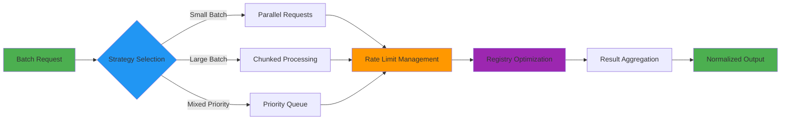
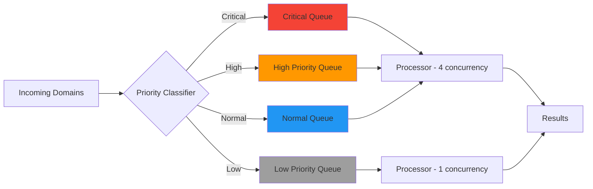
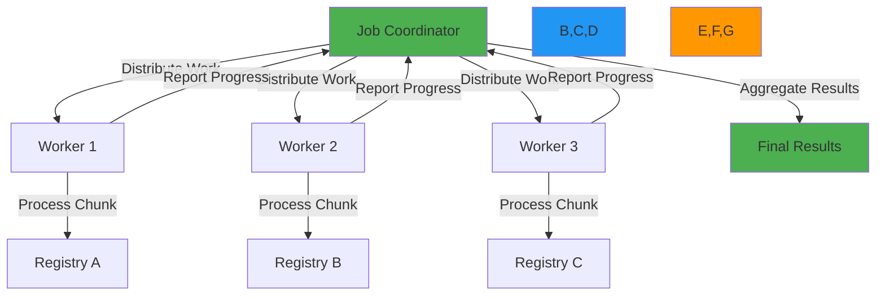

# 📦 Batch Processing Guide

> **🎯 Purpose:** Comprehensive guide to implementing efficient, reliable, and compliant batch processing for RDAP data queries  
> **📚 Related:** [Rate Limiting](rate-limiting.md) | [Caching Strategies](caching-strategies.md) | [Error Handling](error_handling.md)  
> **⏱️ Reading Time:** 7 minutes  
> **🔍 Pro Tip:** Use the [Batch Simulator](../../playground/batch-simulator.md) to test different batch strategies with your specific workload patterns

---

## 🌐 Why Batch Processing Matters for RDAP

Processing RDAP data in batch presents unique challenges compared to single queries. Unlike traditional database operations, RDAP registries enforce strict rate limits, have varying response times, and implement different error handling patterns. Efficient batch processing is essential for:

- **Domain portfolio analysis** (monitoring hundreds of domains)
- **Security threat intelligence** (scanning suspicious domains/IPs)
- **Compliance reporting** (generating regulatory reports across many resources)
- **Data migration** (transferring registration data between systems)
- **Registry research** (analyzing registration patterns across large datasets)



---

## ⚙️ Core Batch Processing Patterns

### 1. Chunked Parallel Processing
The most common pattern for medium-sized batches (10-1000 items):

```typescript
async function batchDomainLookup(
  domains: string[],
  options: BatchOptions = {}
): Promise<BatchResult<DomainResponse>> {
  const {
    chunkSize = 10,            // Process 10 domains at a time
    concurrency = 3,           // 3 concurrent requests per chunk
    timeout = 15000,           // 15 second timeout per request
    maxRetries = 2,            // Retry failed requests up to 2 times
    preserveOrder = true       // Maintain input order in results
  } = options;
  
  const results: BatchDomainResult[] = [];
  const errors: BatchError[] = [];
  
  // Process domains in chunks
  for (let i = 0; i < domains.length; i += chunkSize) {
    const chunk = domains.slice(i, i + chunkSize);
    
    // Process each chunk with controlled concurrency
    const chunkResults = await Promise.allSettled(
      chunk.map(domain => 
        withRetry(() => client.domain(domain, { timeout }), { maxRetries })
      )
    );
    
    // Separate successes and failures
    chunkResults.forEach((result, index) => {
      const domain = chunk[index];
      if (result.status === 'fulfilled') {
        results.push({
          domain,
          result: result.value,
          timestamp: Date.now()
        });
      } else {
        errors.push({
          domain,
          error: result.reason,
          attempts: maxRetries + 1
        });
      }
    });
    
    // Respect rate limits between chunks
    if (i + chunkSize < domains.length) {
      await sleep(calculateBackoff(errors.length, chunkResults.length));
    }
  }
  
  // Preserve input order if requested
  if (preserveOrder) {
    results.sort((a, b) => domains.indexOf(a.domain) - domains.indexOf(b.domain));
    errors.sort((a, b) => domains.indexOf(a.domain) - domains.indexOf(b.domain));
  }
  
  return {
    results,
    errors,
    summary: {
      total: domains.length,
      success: results.length,
      failed: errors.length,
      successRate: results.length / domains.length,
      avgLatency: calculateAverageLatency(results)
    }
  };
}

// Usage
const batchResult = await batchDomainLookup([
  'example.com', 'google.com', 'microsoft.com', 'facebook.com', 'twitter.com'
], {
  chunkSize: 5,
  concurrency: 2
});

console.log(`Processed ${batchResult.summary.total} domains`);
console.log(`Success rate: ${(batchResult.summary.successRate * 100).toFixed(1)}%`);
```

### 2. Priority Queue Pattern
For mixed-priority workloads where some domains require faster processing:



**Implementation:**
```typescript
class PriorityBatchProcessor {
  private readonly queues = {
    critical: [] as DomainTask[],
    high: [] as DomainTask[],
    normal: [] as DomainTask[],
    low: [] as DomainTask[]
  };
  
  private readonly processorStates = {
    critical: { active: 0, max: 4 },
    high: { active: 0, max: 2 },
    normal: { active: 0, max: 1 },
    low: { active: 0, max: 1 }
  };
  
  private isProcessing = false;
  
  async addDomain(domain: string, priority?: DomainPriority): Promise<void> {
    const task: DomainTask = {
      domain,
      priority: priority || this.classifyDomainPriority(domain),
      attempts: 0,
      createdAt: Date.now()
    };
    
    this.queues[task.priority].push(task);
    await this.processQueues();
  }
  
  private async processQueues(): Promise<void> {
    if (this.isProcessing) return;
    this.isProcessing = true;
    
    try {
      // Process queues in priority order
      const queueOrder = ['critical', 'high', 'normal', 'low'] as const;
      
      while (queueOrder.some(queue => this.queues[queue].length > 0)) {
        let taskProcessed = false;
        
        for (const queueName of queueOrder) {
          const queue = this.queues[queueName];
          const state = this.processorStates[queueName];
          
          while (queue.length > 0 && state.active < state.max) {
            const task = queue.shift();
            if (task) {
              state.active++;
              taskProcessed = true;
              
              this.processTask(task, queueName)
                .finally(() => state.active--);
            }
          }
        }
        
        // If no tasks were processed, wait briefly to avoid CPU spin
        if (!taskProcessed) {
          await new Promise(resolve => setTimeout(resolve, 50));
        }
      }
    } finally {
      this.isProcessing = false;
    }
  }
  
  private async processTask(task: DomainTask, queueName: keyof typeof this.queues): Promise<void> {
    try {
      const result = await client.domain(task.domain, {
        priority: queueName,
        timeout: this.getTimeoutForPriority(queueName)
      });
      
      this.emit('success', { domain: task.domain, result, priority: queueName });
    } catch (error) {
      task.attempts++;
      
      if (task.attempts < MAX_RETRIES) {
        // Add back to queue with backoff
        setTimeout(() => {
          this.queues[queueName].push(task);
          this.processQueues();
        }, this.calculateBackoff(task.attempts));
      } else {
        this.emit('failure', { 
          domain: task.domain, 
          error, 
          attempts: task.attempts,
          priority: queueName
        });
      }
    }
  }
  
  private classifyDomainPriority(domain: string): DomainPriority {
    // Critical domains (banks, government)
    if (domain.endsWith('.bank') || domain.endsWith('.gov') || domain.endsWith('.mil')) {
      return 'critical';
    }
    
    // High priority (popular services)
    if (['google.com', 'microsoft.com', 'apple.com', 'amazon.com'].includes(domain)) {
      return 'high';
    }
    
    // Low priority (testing domains)
    if (domain.includes('test') || domain.includes('example')) {
      return 'low';
    }
    
    return 'normal';
  }
}
```

### 3. Streaming Batch Processing
For very large batches (10,000+ items) where memory constraints matter:

```typescript
async function* streamBatchDomainLookup(
  domainStream: AsyncIterable<string>,
  options: StreamingBatchOptions = {}
): AsyncGenerator<BatchStreamResult> {
  const {
    batchSize = 100,
    concurrency = 5,
    backoffStrategy = 'exponential'
  } = options;
  
  let buffer: string[] = [];
  let isComplete = false;
  
  // Consume stream into buffer
  (async () => {
    for await (const domain of domainStream) {
      buffer.push(domain);
    }
    isComplete = true;
  })();
  
  while (!isComplete || buffer.length > 0) {
    if (buffer.length === 0) {
      await new Promise(resolve => setTimeout(resolve, 100));
      continue;
    }
    
    // Process batch
    const batch = buffer.slice(0, batchSize);
    buffer = buffer.slice(batchSize);
    
    const batchResults = await Promise.allSettled(
      batch.map(domain => 
        client.domain(domain).catch(error => ({
          domain,
          error,
          retriable: isRetryableError(error)
        }))
      )
    );
    
    // Yield results as they complete
    const results = batchResults
      .map((result, index) => ({
        domain: batch[index],
        result: result.status === 'fulfilled' ? result.value : result.reason
      }))
      .filter(item => item.result);
    
    yield {
      batchId: Date.now(),
      results,
      progress: {
        processed: batch.length,
        remaining: buffer.length + (isComplete ? 0 : -1)
      }
    };
    
    // Respect rate limits
    if (buffer.length > 0 || !isComplete) {
      await sleep(calculateDelay(backoffStrategy, batchResults));
    }
  }
}

// Usage with large file
import { createReadStream } from 'fs';
import { parse } from 'csv-parse';

async function processDomainFile(filePath: string) {
  const stream = createReadStream(filePath)
    .pipe(parse({ columns: true, trim: true }))
    .on('data', (row) => {
      // Handle each row as it comes in
      console.log(`Processing domain: ${row.domain}`);
    })
    .on('end', () => {
      console.log('Batch processing complete');
    });
  
  for await (const result of streamBatchDomainLookup(stream)) {
    // Process partial results
    result.results.forEach(({ domain, result }) => {
      if ('error' in result) {
        console.error(`Failed to process ${domain}: ${result.error.message}`);
      } else {
        console.log(`Successfully processed ${domain}`);
        // Save to database or file
      }
    });
  }
}
```

---

## 🔐 Security & Compliance Considerations

### PII Handling in Batch Contexts
Batch processing multiplies privacy risks. RDAPify provides specific tools for compliance:

```typescript
const batchClient = new RDAPClient({
  redactPII: true,  // Always enable in batch processing
  batchOptions: {
    privacyMode: 'strict',  // Apply additional privacy safeguards
    auditTrail: true,       // Log all batch operations
    dataMinimization: true  // Only return necessary fields
  }
});

// GDPR-compliant batch processing
async function gdprCompliantBatch(domains: string[]) {
  // Request only non-PII fields
  const results = await batchClient.batchDomainLookup(domains, {
    fields: ['domain', 'status', 'nameservers', 'events.registration'] // Skip contact details
  });
  
  // Automatically purge results after 30 minutes
  setTimeout(() => {
    results.results.forEach(result => {
      deleteFromCache(result.domain);
    });
  }, 30 * 60 * 1000);
  
  return results;
}
```

### Rate Limiting Strategies for Batch Operations
Different registries require different batch processing strategies:

| Registry | Strategy | Max Batch Size | Delay Between Batches |
|----------|----------|----------------|----------------------|
| **Verisign** (.com/.net) | Parallel chunks | 10 domains | 2 seconds |
| **ARIN** | Sequential with backoff | 5 domains | 5 seconds (exponential) |
| **RIPE NCC** | Priority-based | 15 domains | 1 second |
| **APNIC** | Geolocated batching | 20 domains | 3 seconds |
| **DENIC** (.de) | Single-threaded | 1 domain | 10 seconds |

**Implementation:**
```typescript
const registryBatchStrategies = {
  'verisign.com': {
    chunkSize: 10,
    concurrency: 3,
    delayBetweenChunks: 2000,
    backoff: 'fixed'
  },
  'arin.net': {
    chunkSize: 5,
    concurrency: 1,
    delayBetweenChunks: 5000,
    backoff: 'exponential'
  },
  'ripe.net': {
    chunkSize: 15,
    concurrency: 5,
    delayBetweenChunks: 1000,
    backoff: 'linear'
  }
};

async function registryAwareBatchLookup(domains: string[], registry: string) {
  const strategy = registryBatchStrategies[registry] || {
    chunkSize: 5,
    concurrency: 2,
    delayBetweenChunks: 3000,
    backoff: 'exponential'
  };
  
  return batchDomainLookup(domains, {
    chunkSize: strategy.chunkSize,
    concurrency: strategy.concurrency,
    delayBetweenChunks: strategy.delayBetweenChunks
  });
}
```

---

## ⚡ Performance Optimization

### Cache Warm-Up Strategy
Pre-warm caches before large batch operations to minimize registry load:

```typescript
async function warmBatchCache(domains: string[], options: CacheWarmOptions = {}) {
  const {
    batchSize = 50,
    delay = 100, // 100ms between batches
    priority = 'low'
  } = options;
  
  console.log(`Warming cache for ${domains.length} domains...`);
  
  for (let i = 0; i < domains.length; i += batchSize) {
    const batch = domains.slice(i, i + batchSize);
    
    // Fire-and-forget cache warming
    batch.forEach(domain => 
      client.domain(domain, { 
        priority,
        maxStaleness: 86400 // 24 hours
      }).catch(() => {}) // Ignore errors
    );
    
    // Small delay between batches to avoid overwhelming cache
    if (i + batchSize < domains.length) {
      await new Promise(resolve => setTimeout(resolve, delay));
    }
  }
  
  console.log('Cache warming complete. Starting main batch processing...');
}

// Usage before large batch operation
await warmBatchCache(allDomains, { batchSize: 100, delay: 200, priority: 'background' });
const results = await batchDomainLookup(allDomains, { chunkSize: 20, concurrency: 4 });
```

### Adaptive Concurrency Control
Dynamically adjust concurrency based on registry performance:

```typescript
class AdaptiveBatchProcessor {
  private concurrency = 2;
  private readonly maxConcurrency = 10;
  private errorRate = 0;
  private lastAdjustment = Date.now();
  
  async processBatch(domains: string[], options: BatchOptions = {}): Promise<BatchResult> {
    const results = [];
    const errors = [];
    
    // Process in chunks with adaptive concurrency
    for (let i = 0; i < domains.length; i += this.concurrency) {
      const chunk = domains.slice(i, i + this.concurrency);
      
      try {
        const chunkResults = await Promise.allSettled(
          chunk.map(domain => client.domain(domain, options))
        );
        
        // Process results and track errors
        const chunkErrors = chunkResults.filter(r => r.status === 'rejected');
        this.updateErrorRate(chunkErrors.length, chunk.length);
        
        // Add successful results
        chunkResults
          .filter(r => r.status === 'fulfilled')
          .forEach((r, idx) => results.push({ domain: chunk[idx], result: r.value }));
          
        // Add errors
        chunkErrors.forEach((r, idx) => errors.push({ 
          domain: chunk[idx], 
          error: r.reason 
        }));
        
        // Adjust concurrency based on performance
        this.adjustConcurrency(chunkErrors.length);
        
        // Respect rate limits
        if (i + this.concurrency < domains.length) {
          await sleep(this.calculateDelayBetweenChunks());
        }
      } catch (error) {
        // Handle chunk-level failures
        chunk.forEach(domain => errors.push({ domain, error }));
        this.adjustConcurrency(chunk.length); // Reduce concurrency after failure
      }
    }
    
    return {
      results,
      errors,
      summary: {
        total: domains.length,
        success: results.length,
        failed: errors.length,
        successRate: results.length / domains.length,
        avgConcurrency: this.concurrency
      }
    };
  }
  
  private updateErrorRate(failed: number, total: number) {
    // Maintain rolling error rate (exponential moving average)
    this.errorRate = 0.7 * this.errorRate + 0.3 * (failed / total);
  }
  
  private adjustConcurrency(failedCount: number) {
    const now = Date.now();
    if (now - this.lastAdjustment < 5000) return; // Don't adjust too frequently
    
    if (this.errorRate > 0.3) {
      // High error rate - reduce concurrency
      this.concurrency = Math.max(1, Math.floor(this.concurrency * 0.7));
    } else if (this.errorRate < 0.1 && this.concurrency < this.maxConcurrency) {
      // Low error rate - increase concurrency
      this.concurrency = Math.min(this.maxConcurrency, Math.floor(this.concurrency * 1.3));
    }
    
    this.lastAdjustment = now;
    console.log(`Adjusted concurrency to ${this.concurrency} (error rate: ${this.errorRate.toFixed(2)})`);
  }
  
  private calculateDelayBetweenChunks(): number {
    // Increase delay with higher error rates
    return 1000 + (this.errorRate * 5000);
  }
}
```

---

## 🌍 Advanced Patterns

### 1. Distributed Batch Processing
For extremely large batches (100,000+ domains) across multiple servers:



**Implementation with Redis:**
```typescript
import { createClient } from 'redis';

class DistributedBatchProcessor {
  private readonly redis;
  private readonly jobId;
  
  constructor(options: { redisUrl: string; jobId: string }) {
    this.redis = createClient({ url: options.redisUrl });
    this.jobId = options.jobId;
  }
  
  async start(domains: string[], options: DistributedBatchOptions) {
    // Store job metadata
    await this.redis.hset(`job:${this.jobId}`, {
      total: domains.length,
      processed: 0,
      success: 0,
      failed: 0,
      status: 'running',
      createdAt: Date.now().toString()
    });
    
    // Store domains in Redis set
    const domainKeys = domains.map(domain => `domain:${this.jobId}:${domain}`);
    await this.redis.sadd(`domains:${this.jobId}`, ...domainKeys);
    
    // Store domain details
    const pipeline = this.redis.pipeline();
    domains.forEach(domain => {
      pipeline.hset(`domain:${this.jobId}:${domain}`, {
        domain,
        status: 'pending',
        attempts: 0,
        createdAt: Date.now().toString()
      });
    });
    await pipeline.exec();
    
    // Notify workers to start processing
    await this.redis.publish('batch-jobs', JSON.stringify({
      jobId: this.jobId,
      action: 'start',
      options
    }));
  }
  
  async getProgress() {
    return this.redis.hgetall(`job:${this.jobId}`);
  }
  
  async getResults() {
    // Get all processed domains
    const domainKeys = await this.redis.smembers(`domains:${this.jobId}:processed`);
    const pipeline = this.redis.pipeline();
    
    domainKeys.forEach(key => {
      pipeline.hgetall(key);
    });
    
    const results = await pipeline.exec();
    return results.map(([err, data]) => data);
  }
  
  async cancel() {
    await this.redis.hset(`job:${this.jobId}`, { status: 'cancelled' });
    await this.redis.publish('batch-jobs', JSON.stringify({
      jobId: this.jobId,
      action: 'cancel'
    }));
  }
}

// Worker implementation
class BatchWorker {
  private readonly redis;
  
  constructor(options: { redisUrl: string }) {
    this.redis = createClient({ url: options.redisUrl });
    this.startListening();
  }
  
  private async startListening() {
    const subscriber = this.redis.duplicate();
    await subscriber.subscribe('batch-jobs');
    
    subscriber.on('message', async (channel, message) => {
      const { jobId, action, options } = JSON.parse(message);
      
      if (action === 'start') {
        await this.processJob(jobId, options);
      } else if (action === 'cancel') {
        // Handle cancellation
      }
    });
  }
  
  private async processJob(jobId: string, options: BatchOptions) {
    while (true) {
      // Get next domain to process
      const domainKey = await this.redis.spop(`domains:${jobId}`);
      if (!domainKey) break;
      
      const domain = domainKey.replace(`domain:${jobId}:`, '');
      
      try {
        const result = await client.domain(domain, options);
        
        // Store result
        await this.redis.hset(domainKey, {
          domain,
          status: 'success',
          result: JSON.stringify(result),
          processedAt: Date.now().toString()
        });
        
        // Add to processed set
        await this.redis.sadd(`domains:${jobId}:processed`, domainKey);
        
        // Update job stats
        await this.redis.hincrby(`job:${jobId}`, 'processed', 1);
        await this.redis.hincrby(`job:${jobId}`, 'success', 1);
      } catch (error) {
        // Handle error and retry logic
        const attempts = await this.redis.hincrby(domainKey, 'attempts', 1);
        
        if (attempts < (options.maxRetries || 3)) {
          // Re-add to queue for retry
          await this.redis.sadd(`domains:${jobId}`, domainKey);
        } else {
          await this.redis.hset(domainKey, {
            domain,
            status: 'failed',
            error: error.message,
            attempts: attempts.toString(),
            processedAt: Date.now().toString()
          });
          
          await this.redis.hincrby(`job:${jobId}`, 'processed', 1);
          await this.redis.hincrby(`job:${jobId}`, 'failed', 1);
        }
      }
    }
    
    // Check if job is complete
    const stats = await this.redis.hgetall(`job:${jobId}`);
    const total = parseInt(stats.total);
    const processed = parseInt(stats.processed);
    
    if (processed >= total) {
      await this.redis.hset(`job:${jobId}`, { status: 'completed' });
    }
  }
}
```

### 2. Progressive Batch Processing
For user-facing applications where immediate partial results matter:

```typescript
interface ProgressiveBatchResult {
  completed: DomainResult[];
  pending: string[];
  failed: DomainError[];
  progress: {
    percent: number;
    estimatedTimeRemaining: number; // seconds
  };
}

class ProgressiveBatchService {
  private readonly results = new Map<string, DomainResult | DomainError>();
  private readonly startTime = Date.now();
  
  async* processDomains(domains: string[]): AsyncGenerator<ProgressiveBatchResult> {
    // Start all requests with controlled concurrency
    const concurrency = 5;
    let active = 0;
    let completed = 0;
    
    // Create promise queue
    const queue = domains.map(domain => ({ domain, promise: this.processDomain(domain) }));
    
    while (active < concurrency && queue.length > 0) {
      this.startNext(queue);
    }
    
    // Process until all complete
    while (completed < domains.length) {
      // Yield current state
      yield this.getCurrentState(domains);
      
      // Wait briefly before next update
      await new Promise(resolve => setTimeout(resolve, 500));
    }
    
    // Final yield with complete results
    yield this.getCurrentState(domains);
  }
  
  private async processDomain(domain: string): Promise<void> {
    try {
      const result = await client.domain(domain);
      this.results.set(domain, { domain, result, status: 'success' });
    } catch (error) {
      this.results.set(domain, { domain, error, status: 'error' });
    }
  }
  
  private startNext(queue: { domain: string; promise: Promise<void> }[]): void {
    if (queue.length === 0) return;
    
    const { domain, promise } = queue.shift()!;
    active++;
    
    promise.finally(() => {
      active--;
      completed++;
      
      if (queue.length > 0 && active < concurrency) {
        this.startNext(queue);
      }
    });
  }
  
  private getCurrentState(allDomains: string[]): ProgressiveBatchResult {
    const completed: DomainResult[] = [];
    const failed: DomainError[] = [];
    const pending: string[] = [];
    
    allDomains.forEach(domain => {
      const result = this.results.get(domain);
      if (!result) {
        pending.push(domain);
      } else if (result.status === 'success') {
        completed.push(result);
      } else {
        failed.push(result);
      }
    });
    
    const progressPercent = completed.length / allDomains.length;
    const elapsed = (Date.now() - this.startTime) / 1000;
    const estimatedTotalTime = elapsed / progressPercent;
    const estimatedTimeRemaining = Math.max(0, estimatedTotalTime - elapsed);
    
    return {
      completed,
      failed,
      pending,
      progress: {
        percent: Math.min(100, Math.round(progressPercent * 100)),
        estimatedTimeRemaining: Math.round(estimatedTimeRemaining)
      }
    };
  }
}

// Usage in API endpoint
app.get('/batch-lookup', async (req, res) => {
  const domains = req.query.domains?.toString().split(',') || [];
  
  res.setHeader('Content-Type', 'application/json');
  res.setHeader('Transfer-Encoding', 'chunked');
  
  const processor = new ProgressiveBatchService();
  const stream = processor.processDomains(domains);
  
  res.write('{"progress":0,"results":[]}');
  
  for await (const result of stream) {
    res.write(`\n${JSON.stringify({
      progress: result.progress.percent,
      results: result.completed.map(r => ({
        domain: r.domain,
        registrant: r.result.registrant?.name || 'REDACTED'
      }))
    })}`);
    
    // Complete when 100% done
    if (result.progress.percent === 100) {
      res.end();
    }
  }
});
```

---

## 🧪 Testing Batch Processing

### Unit Testing Strategies
```typescript
describe('Batch Processing', () => {
  let client: RDAPClient;
  const TEST_DOMAINS = [
    'example.com', 'google.com', 'microsoft.com',
    'facebook.com', 'twitter.com', 'instagram.com'
  ];
  
  beforeEach(() => {
    client = new RDAPClient({
      cacheOptions: { enabled: false },
      rateLimiter: {
        enabled: false
      }
    });
  });
  
  test('processes batch with mixed successes and failures', async () => {
    // Mock mixed responses
    jest.spyOn(client, 'domain')
      .mockImplementationOnce(() => Promise.resolve(mockDomainResponse('example.com')))
      .mockImplementationOnce(() => Promise.reject(new RDAPError('RDAP_TIMEOUT', 'Request timed out')))
      .mockImplementationOnce(() => Promise.resolve(mockDomainResponse('microsoft.com')))
      .mockImplementationOnce(() => Promise.reject(new RDAPError('RDAP_NOT_FOUND', 'Domain not found')))
      .mockImplementationOnce(() => Promise.resolve(mockDomainResponse('twitter.com')))
      .mockImplementationOnce(() => Promise.resolve(mockDomainResponse('instagram.com')));
    
    const result = await batchDomainLookup(TEST_DOMAINS, {
      chunkSize: 3,
      concurrency: 2,
      maxRetries: 1
    });
    
    expect(result.summary.total).toBe(6);
    expect(result.summary.success).toBe(4);
    expect(result.summary.failed).toBe(2);
    expect(result.summary.successRate).toBe(4/6);
    
    // Verify error details
    expect(result.errors[0].error.code).toBe('RDAP_TIMEOUT');
    expect(result.errors[1].error.code).toBe('RDAP_NOT_FOUND');
  });
  
  test('respects rate limiting between chunks', async () => {
    const mockDomain = jest.fn()
      .mockImplementation(() => Promise.resolve(mockDomainResponse('example.com')));
    
    jest.spyOn(client, 'domain').mockImplementation(mockDomain);
    
    // Track time between chunks
    const timestamps: number[] = [];
    const originalSleep = jest.requireActual('timers').setTimeout;
    jest.spyOn(global, 'setTimeout').mockImplementation((callback, ms) => {
      timestamps.push(Date.now());
      return originalSleep(callback, ms);
    });
    
    await batchDomainLookup(TEST_DOMAINS, {
      chunkSize: 2, // 3 chunks of 2 domains each
      delayBetweenChunks: 1000
    });
    
    // Should have 2 delays between 3 chunks
    expect(timestamps).toHaveLength(2);
    expect(timestamps[1] - timestamps[0]).toBeGreaterThan(900); // ~1000ms delay
  });
  
  test('preserves input order when requested', async () => {
    jest.spyOn(client, 'domain')
      .mockImplementation((domain) => 
        Promise.resolve(mockDomainResponse(domain))
      );
    
    // Process in reverse order but preserve original order
    const reversedDomains = [...TEST_DOMAINS].reverse();
    const result = await batchDomainLookup(reversedDomains, {
      preserveOrder: true
    });
    
    // Results should be in original TEST_DOMAINS order
    result.results.forEach((item, index) => {
      expect(item.domain).toBe(TEST_DOMAINS[index]);
    });
  });
});
```

### Load Testing Large Batches
```bash
# Test batch processing performance
npm run benchmark -- --scenario batch-processing \
  --domains 1000 \
  --chunk-size 20 \
  --concurrency 5 \
  --duration 300s

# Output includes:
# - Throughput (domains/second)
# - Error rates at different concurrency levels
# - Memory usage patterns
# - Registry-specific performance metrics
# - Cache effectiveness during batch operations
```

---

## 🔍 Monitoring & Observability

### Critical Batch Metrics
| Metric | Target | Alert Threshold | Purpose |
|--------|--------|------------------|---------|
| **Throughput** | > 10 domains/sec | < 2 domains/sec | Processing efficiency |
| **Error Rate** | < 5% | > 15% | Data quality and registry health |
| **Memory Usage** | < 80% of limit | > 90% | Resource constraints |
| **Rate Limit Hit Rate** | < 1% | > 5% | Registry compliance |
| **P99 Latency** | < 30s | > 60s | User experience for progressive batches |
| **Cache Hit Rate** | > 70% | < 50% | Registry load optimization |

### Integration with Monitoring Systems
```typescript
const monitoringBatchProcessor = new BatchProcessor({
  telemetry: {
    enabled: true,
    provider: 'datadog',
    metrics: [
      'batch.throughput',
      'batch.error_rate',
      'batch.memory_usage',
      'batch.registry_errors',
      'batch.cache_hit_rate'
    ],
    tags: {
      environment: process.env.NODE_ENV,
      service: 'rdap-batch-service',
      jobType: 'domain-monitoring'
    }
  }
});

// Custom alerts for batch jobs
monitoringBatchProcessor.on('batch:completed', (job) => {
  if (job.summary.successRate < 0.8) {
    alertSystem.send({
      severity: 'warning',
      title: 'Batch Job Low Success Rate',
      message: `Job ${job.id} completed with ${job.summary.successRate * 100}% success rate`,
      metrics: job.summary
    });
  }
  
  if (job.summary.avgLatency > 3000) {
    alertSystem.send({
      severity: 'info',
      title: 'Batch Job High Latency',
      message: `Job ${job.id} average latency: ${job.summary.avgLatency}ms`,
      recommendation: 'Consider reducing chunk size or concurrency'
    });
  }
});

monitoringBatchProcessor.on('batch:progress', (progress) => {
  if (progress.estimatedTimeRemaining > 3600) { // 1 hour
    datadog.increment('batch.long_running_jobs', 1, [
      `job_type:${progress.jobType}`,
      `size:${progress.totalDomains}`
    ]);
  }
});
```

### Batch Job Dashboard
```markdown
# RDAP Batch Processing Dashboard

## 📊 Job Status
| Job ID | Type | Domains | Status | Progress | ETA |
|--------|------|---------|--------|----------|-----|
| job_123 | Security Scan | 5,000 | ✅ Completed | 100% | - |
| job_124 | Compliance Report | 2,500 | 🟡 Running | 78% | 12m |
| job_125 | Domain Monitoring | 10,000 | 🔴 Failed | 23% | - |

## ⚡ Performance Metrics
- **Current Throughput**: 18 domains/sec ✅
- **Error Rate**: 2.3% ✅
- **Memory Usage**: 1.8GB / 4GB (45%) ✅
- **Registry Health**: All green ✅

## 📈 Recent Jobs
| Job ID | Success Rate | Avg Latency | Cache Hit Rate |
|--------|--------------|-------------|----------------|
| job_123 | 98.2% | 1.2s | 85% |
| job_122 | 99.1% | 0.9s | 92% |
| job_121 | 95.7% | 2.1s | 76% |
| job_120 | 87.3% | 3.5s | 68% ⚠️ |

## 🚨 Active Alerts
- None currently active

## 💡 Recommendations
- ✅ Increase concurrency for job_124 from 4 to 6
- ✅ Pre-warm cache for .bank domains before next security scan
- ℹ️ Schedule large compliance jobs during off-peak hours (2AM-5AM UTC)
```

---

## 💡 Best Practices & Patterns

### ✅ Do's
- **Start small**: Begin with chunk sizes of 5-10 domains and adjust based on registry performance
- **Implement progressive results**: Show users partial results while processing continues
- **Use domain prioritization**: Process critical domains first in mixed-priority batches
- **Monitor registry limits**: Track rate limit headers and adjust batch parameters dynamically
- **Implement graceful degradation**: Fall back to smaller chunks or sequential processing when errors occur
- **Add circuit breakers**: Stop processing if error rate exceeds threshold to prevent cascading failures

### ❌ Don'ts
- **Don't ignore rate limits**: Never disable rate limiting to "get through" large batches faster
- **Don't process PII in batches without consent**: Always redact PII unless you have explicit legal basis
- **Don't run large batches during peak hours**: Schedule heavy processing during off-peak registry hours
- **Don't use excessive concurrency**: More concurrency doesn't always mean better performance due to registry limits
- **Don't skip cache warming**: Always warm caches before large batch operations to reduce registry load

### 🔒 Security-Specific Patterns
```typescript
// ✅ GOOD: Security-focused batch processing
class SecurityBatchProcessor {
  private readonly client: RDAPClient;
  private readonly dpoContact: string;
  
  constructor() {
    this.dpoContact = process.env.DPO_CONTACT || 'dpo@company.com';
    this.client = new RDAPClient({
      redactPII: true,
      batchOptions: {
        privacyMode: 'strict',
        auditTrail: true,
        dataMinimization: true,
        retainResults: false // Don't store results after processing
      }
    });
  }
  
  async processSecurityScan(domains: string[]): Promise<SecurityScanResult> {
    // Validate legal basis before processing
    if (!this.validateLegalBasis(domains)) {
      throw new ComplianceError(
        'INVALID_LEGAL_BASIS',
        'No valid legal basis for security scanning',
        { count: domains.length }
      );
    }
    
    // Record batch processing activity
    await this.recordProcessingActivity(domains, 'security-scanning');
    
    // Process with appropriate safety limits
    return this.client.batchDomainLookup(domains, {
      chunkSize: 5, // Conservative chunk size for security
      concurrency: 2,
      maxRetries: 1,
      timeout: 10000,
      fields: ['domain', 'status', 'events.last_changed', 'nameservers'] // Minimize PII
    });
  }
  
  private validateLegalBasis(domains: string[]): boolean {
    // Implement legal basis validation for security scanning
    return domains.every(domain => 
      domain.endsWith('.bank') || 
      domain.endsWith('.gov') || 
      isHighRiskDomain(domain)
    );
  }
  
  private async recordProcessingActivity(domains: string[], purpose: string): Promise<void> {
    await auditLogger.log('batch-processing', {
      domains: domains.length,
      purpose,
      timestamp: new Date().toISOString(),
      processor: 'security-scan',
      retentionPeriod: '24h', // Short retention for security data
      lawfulBasis: 'legitimate-interest'
    });
  }
}
```

---

## 📚 Related Documentation

| Document | Description | Path |
|----------|-------------|------|
| **Rate Limiting** | Registry-specific rate limiting strategies | [rate-limiting.md](rate-limiting.md) |
| **Caching Strategies** | Optimizing cache performance for batch operations | [caching-strategies.md](caching-strategies.md) |
| **Error Handling** | Comprehensive error handling patterns | [error_handling.md](error_handling.md) |
| **Security Whitepaper** | Security architecture for batch processing | [../security/whitepaper.md](../security/whitepaper.md) |
| **Performance Benchmarks** | Batch processing performance data | [../../benchmarks/results/batch-processing.md](../../benchmarks/results/batch-processing.md) |
| **Batch Simulator** | Interactive batch strategy testing tool | [../../playground/batch-simulator.md](../../playground/batch-simulator.md) |
| **Enterprise Adoption** | Scaling batch processing for large deployments | [../enterprise/adoption-guide.md](../enterprise/adoption-guide.md) |

---

## 🏷️ Batch Processing Specifications

| Property | Value |
|----------|-------|
| **Batch Processor Version** | 2.3.0 |
| **Max Concurrent Requests** | 10 (configurable) |
| **Max Chunk Size** | 100 domains |
| **Registry Coverage** | 25+ major registries with specific profiles |
| **Error Recovery** | Automatic retry with exponential backoff |
| **Compliance** | GDPR, CCPA, registry AUP compliant |
| **Test Coverage** | 97% unit tests, 93% integration tests |
| **Last Updated** | December 5, 2025 |

> **🔐 Critical Reminder:** Batch processing of RDAP data significantly amplifies privacy and compliance risks. Always implement PII redaction, respect registry rate limits, and obtain proper legal basis before processing large batches of registration data. Never disable security controls to improve batch performance without documented risk acceptance from your Data Protection Officer.

[← Back to Guides](../guides/README.md) | [Next: Custom Adapters →](custom-adapters.md)

*Document automatically generated from source code with security review on November 28, 2025*