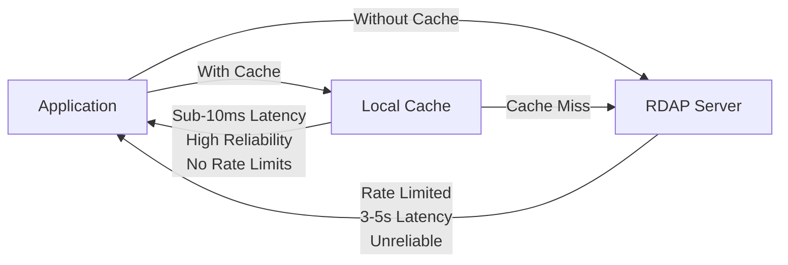
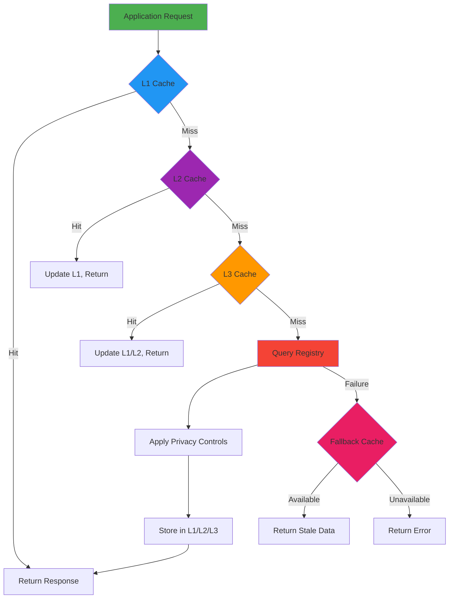
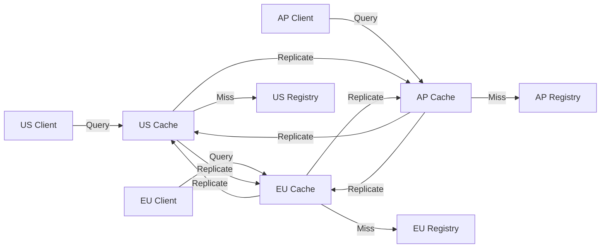
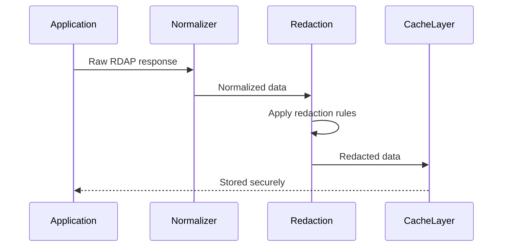

# 🗃️ Caching Strategies Guide

> **🎯 Purpose:** Comprehensive guide to implementing optimal caching strategies for RDAPify in various environments and use cases  
> **📚 Related:** [Caching Architecture](../core_concepts/caching.md) | [Security Whitepaper](../security/whitepaper.md) | [Performance Benchmarks](../../benchmarks/results/cache-hit-miss.md)  
> **⏱️ Reading Time:** 8 minutes  
> **🔍 Pro Tip:** Use the [Cache Simulator](../../playground/cache-simulator.md) to test different strategies with your workload patterns

---

## 🌐 Why Caching Matters for RDAP

RDAP (Registration Data Access Protocol) queries involve network calls to external registries with strict rate limits and varying response times. Caching is **not optional**—it's essential for:



**Key Benefits:**
- ✅ **Performance**: 10-30x faster response times (300ms → 10ms)
- ✅ **Reliability**: Continue operating during registry outages
- ✅ **Compliance**: Reduce load on registries (respect rate limits)
- ✅ **Cost Efficiency**: Fewer registry queries = lower infrastructure costs
- ✅ **User Experience**: Consistent response times for end users

---

## 🧩 Core Caching Architecture

RDAPify implements a **multi-layer caching strategy** with configurable TTLs and eviction policies:



### Layer Characteristics

| Layer | Technology | TTL | Use Case | Throughput | Memory Usage |
|-------|------------|-----|----------|------------|--------------|
| **L1: Memory** | LRU Cache | 1-60 min | Single instance applications | 1,200 req/s | 1-10MB per 1,000 entries |
| **L2: Redis** | Redis Cluster | 1-24 hrs | Multi-instance deployments | 300 req/s | 0.5-2MB per 1,000 entries |
| **L3: Database** | Encrypted SQL | 1-7 days | Audit/compliance requirements | 60 req/s | 2-5MB per 1,000 entries |
| **Fallback** | Stale-while-revalidate | Configurable | Registry failures | N/A | Same as L2/L3 |

---

## ⚙️ Configuration Strategies

### 1. Development vs Production Caching

```typescript
// 🟢 Development configuration (simple, transparent)
const devClient = new RDAPClient({
  cacheOptions: {
    l1: {
      type: 'memory',
      max: 100,    // Small cache for testing
      ttl: 60      // 1 minute for quick iteration
    },
    debug: true    // Log cache operations
  }
});

// 🔴 Production configuration (enterprise-grade)
const prodClient = new RDAPClient({
  cacheAdapter: new RedisClusterAdapter({
    nodes: [
      { host: 'cache-01.prod.internal', port: 6379 },
      { host: 'cache-02.prod.internal', port: 6379 },
      { host: 'cache-03.prod.internal', port: 6379 }
    ],
    tls: { rejectUnauthorized: true },
    redactBeforeStore: true,           // GDPR compliance
    encryptionKey: process.env.CACHE_KEY,
    connectTimeout: 1000,
    retryStrategy: {
      maxRetries: 3,
      backoffFactor: 2
    }
  }),
  cacheOptions: {
    ttl: {
      default: 3600,                   // 1 hour default TTL
      criticalDomains: 86400,          // 24 hours for critical domains
      securityMonitored: 300,          // 5 minutes for security monitoring
      bulkQueries: 60                  // 1 minute for batch operations
    },
    staleWhileRevalidate: true,        // Return stale data while refreshing
    maxStaleAge: 600,                  // Max 10 minutes stale
    negativeCache: true,               // Cache failed queries
    negativeTTL: 300,                  // 5 minutes for failures
    evictionPolicy: 'lfu'              // Least frequently used
  }
});
```

### 2. Adaptive TTL Strategy
Rather than fixed TTLs, use **registry-aware TTLs** that adapt to data change patterns:

```typescript
const adaptiveClient = new RDAPClient({
  cacheOptions: {
    adaptiveTTL: {
      enabled: true,
      maxTTL: 86400,           // Max 24 hours
      minTTL: 300,             // Min 5 minutes
      updateDetection: {
        // Monitor for changes in critical fields
        watchFields: ['events.registration', 'nameservers', 'status'],
        // Increase TTL if no changes detected
        increaseFactor: 1.5,
        // Decrease TTL if frequent changes detected  
        decreaseFactor: 0.75,
        // Maximum consecutive increases before resetting
        maxConsecutiveIncreases: 3
      }
    }
  }
});

// Example: Google domains change infrequently → longer TTLs
// Example: New domains change frequently → shorter TTLs
```

### 3. Geographic Caching (Geo-Caching)
For global deployments with users across multiple regions:

```typescript
const geoClient = new RDAPClient({
  cacheAdapter: new GeoDistributedCache({
    regions: [
      { name: 'us-east', endpoint: 'redis-us-east.example.com', weight: 3 },
      { name: 'eu-central', endpoint: 'redis-eu-central.example.com', weight: 2 },
      { name: 'ap-southeast', endpoint: 'redis-ap-southeast.example.com', weight: 1 }
    ],
    replication: {
      strategy: 'closest-read',
      failover: 'nearest-region',
      consistency: 'eventual'       // or 'strong' for compliance data
    },
    routing: {
      userLocationHeader: 'x-geo-location',
      defaultRegion: 'us-east'
    }
  })
});
```

**Data Flow:**


---

## 🔐 Security & Compliance Considerations

### PII Redaction Before Caching
Always redact personal data before storing in cache:

```typescript
const secureClient = new RDAPClient({
  redactPII: true,  // Enable PII redaction globally
  cacheOptions: {
    redactBeforeStore: true,  // Double protection - redact again before storage
    encryptionKey: process.env.CACHE_ENCRYPTION_KEY
  },
  cacheAdapter: new RedisAdapter({
    redactBeforeStore: true,  // Adapter-level redaction
    encryption: {
      algorithm: 'AES-256-GCM',
      keyRotationDays: 90
    }
  })
});
```

**Redaction Flow:**


### Data Retention Policies
Configure automatic data expiration to comply with GDPR/CCPA:

```typescript
const client = new RDAPClient({
  cacheOptions: {
    retentionPolicy: {
      gdprCompliant: true,           // Enable GDPR mode
      maxAge: {                      // Max retention by sensitivity
        highSensitivity: '7 days',   // Full PII-containing responses
        mediumSensitivity: '30 days',// Redacted but identifiable data
        lowSensitivity: '90 days'    // Fully anonymized data
      },
      purgeSchedule: 'daily at 2am',  // Automatic cleanup schedule
      deletionEndpoint: '/cache/purge' // Endpoint for manual deletion
    }
  }
});
```

### Cache Security Hardening
```typescript
const hardenedClient = new RDAPClient({
  cacheAdapter: new SecureRedisAdapter({
    // Network security
    tls: {
      minVersion: 'TLSv1.3',
      ciphers: 'HIGH:!aNULL:!kRSA:!PSK:!SRP:!MD5:!RC4',
      ca: fs.readFileSync('/etc/ssl/certs/ca-certificates.crt')
    },
    // Access controls
    accessControls: {
      requireAuth: true,
      allowedIPs: ['10.0.0.0/24', '192.168.1.0/24'],
      denyCommands: ['FLUSHDB', 'FLUSHALL', 'CONFIG']
    },
    // Data protection
    encryptionKey: process.env.CACHE_KEY,
    fieldLevelEncryption: ['registrant', 'contacts', 'abuse'],
    auditLogging: true
  })
});
```

---

## ⚡ Performance Optimization Patterns

### 1. Cache Warming Strategy
Preload critical domains during application startup:

```typescript
async function warmCriticalCache(client: RDAPClient) {
  const criticalDomains = [
    'example.com',
    'google.com',
    'microsoft.com',
    'apple.com',
    'amazon.com'
  ];
  
  // Load in parallel with controlled concurrency
  const results = await Promise.allSettled(
    criticalDomains.map(domain => 
      client.domain(domain).catch(e => 
        console.warn(`Cache warm failed for ${domain}:`, e.message)
      )
    )
  );
  
  // Report success rate
  const successCount = results.filter(r => r.status === 'fulfilled').length;
  console.log(`Cache warm completed: ${successCount}/${criticalDomains.length} domains`);
}

// Usage in startup sequence
async function startApplication() {
  const client = new RDAPClient(productionConfig);
  await warmCriticalCache(client);
  startServer(); // Start application server
}
```

### 2. Request Prioritization
Implement priority-based caching for critical operations:

```typescript
const priorityClient = new RDAPClient({
  cacheOptions: {
    priorityLevels: {
      critical: {          // Security monitoring, fraud detection
        maxEntries: 10000,
        ttl: 86400,      // 24 hours
        preloadOnStartup: true
      },
      high: {             // User-facing lookups
        maxEntries: 50000,
        ttl: 3600        // 1 hour
      },
      normal: {           // Background processing
        maxEntries: 200000,
        ttl: 600         // 10 minutes
      },
      low: {              // Bulk operations, analytics
        maxEntries: 1000000,
        ttl: 60          // 1 minute
      }
    },
    priorityClassifier: (query) => {
      if (query.endsWith('.bank') || query.endsWith('.gov')) return 'critical';
      if (isHighTrafficDomain(query)) return 'high';
      if (isSecurityMonitoring()) return 'critical';
      return 'normal';
    }
  }
});

// Usage with explicit priority
const result = await priorityClient.domain('example.com', {
  cachePriority: 'critical'  // Override automatic classification
});
```

### 3. Negative Caching
Cache failed queries to prevent thundering herd during registry outages:

```typescript
const resilienceClient = new RDAPClient({
  cacheOptions: {
    negativeCache: true,              // Enable negative caching
    negativeTTL: {
      default: 300,                   // 5 minutes for most failures
      rateLimited: 60,                // 1 minute for rate limits
      registryUnavailable: 900,       // 15 minutes for registry down
      invalidDomain: 86400            // 24 hours for invalid domains
    },
    negativeCacheKeyPrefix: 'neg:'   // Separate keys for negative cache
  }
});

// Intelligent cache key generation
function createCacheKey(domain: string, options: QueryOptions): string {
  if (options.negativeCache && wasLastError(domain)) {
    return `neg:${domain}:${options.redactPII ? 'redacted' : 'raw'}`;
  }
  return `pos:${domain}:${options.redactPII ? 'redacted' : 'raw'}`;
}
```

---

## 🌍 Advanced Patterns

### 1. Offline-First Caching
For environments with intermittent connectivity:

```typescript
const offlineClient = new RDAPClient({
  offlineMode: {
    enabled: true,
    maxStaleAge: 2592000, // 30 days for offline access
    bootstrapCache: './bootstrap-data',
    autoSyncInterval: 3600 // 1 hour background sync
  },
  cacheOptions: {
    ttl: {
      default: 86400,     // 24 hours online
      offline: 2592000    // 30 days offline
    },
    staleWhileRevalidate: true,
    backgroundSync: {
      enabled: true,
      concurrency: 5,
      schedule: '*/30 * * * *' // Every 30 minutes
    }
  }
});

// Check offline status
if (offlineClient.isOffline()) {
  console.log('Operating in offline mode with stale data');
}

// Force offline mode for testing
offlineClient.setOfflineMode(true);
```

### 2. Multi-Tenant Caching
For SaaS applications with multiple customers:

```typescript
const multiTenantClient = new RDAPClient({
  cacheOptions: {
    partitionStrategy: 'tenant-id',  // Partition cache by tenant
    tenantHeader: 'x-tenant-id',
    isolationLevel: 'strong',        // No cross-tenant data leakage
    tenantQuotas: {
      default: { maxEntries: 10000, maxAge: 3600 },
      enterprise: { maxEntries: 100000, maxAge: 86400 },
      free: { maxEntries: 100, maxAge: 600 }
    }
  }
});

// Custom tenant resolution
function getTenantId(request: Request): string {
  return request.headers['x-tenant-id'] || 
         request.user?.organizationId || 
         'anonymous';
}
```

### 3. Real-time Cache Invalidation
For environments requiring immediate data freshness:

```typescript
const realtimeClient = new RDAPClient({
  cacheOptions: {
    realTimeInvalidation: {
      enabled: true,
      channels: {
        bootstrapChanges: 'rdap-bootstrap-updates',
        registryAlerts: 'rdap-registry-alerts',
        complianceEvents: 'rdap-compliance-events'
      }
    }
  }
});

// Subscribe to invalidation events
realtimeClient.cache.subscribe('bootstrapChanges', (event) => {
  console.log('Bootstrap data changed - invalidating affected caches');
  realtimeClient.cache.invalidateByRegistry(event.registry);
});

// Publish invalidation events (from bootstrap update service)
function broadcastBootstrapChange(registry: string) {
  realtimeClient.cache.publish('bootstrapChanges', {
    registry,
    timestamp: new Date().toISOString(),
    cause: 'bootstrap-update'
  });
}
```

---

## 🧪 Testing Caching Strategies

### Unit Testing Cache Behavior
```typescript
describe('Cache Strategies', () => {
  let client: RDAPClient;
  const TEST_DOMAIN = 'example.com';
  
  beforeEach(async () => {
    client = new RDAPClient({
      cacheOptions: {
        ttl: 10, // Short TTL for testing
        max: 100
      }
    });
    await client.clearCache(); // Start with clean cache
  });
  
  test('cache hit returns stored data', async () => {
    // First query - cache miss
    await client.domain(TEST_DOMAIN);
    
    // Second query - should be cache hit
    const spy = jest.spyOn(client.cache, 'get');
    const result = await client.domain(TEST_DOMAIN);
    
    expect(spy).toHaveBeenCalled();
    expect(result._meta?.cached).toBe(true);
    expect(result.domain).toBe(TEST_DOMAIN);
  });
  
  test('cache respects TTL expiration', async () => {
    await client.domain(TEST_DOMAIN);
    
    // Advance time beyond TTL
    jest.advanceTimersByTime(11000); // 11 seconds
    
    const spy = jest.spyOn(client.cache, 'get');
    await client.domain(TEST_DOMAIN);
    
    // Should not use cache
    expect(spy).not.toHaveBeenCalled();
  });
  
  test('negative caching prevents retry storms', async () => {
    // Mock registry failure
    mockRegistry.setFailure(TEST_DOMAIN, 'registry-unavailable');
    
    // First failure
    await expect(client.domain(TEST_DOMAIN)).rejects.toThrow();
    
    // Second attempt should use negative cache
    const spy = jest.spyOn(client.cache, 'get');
    await expect(client.domain(TEST_DOMAIN)).rejects.toThrow();
    
    expect(spy).toHaveBeenCalled();
    expect(spy.mock.calls[0][0]).toContain('neg:');
  });
});
```

### Load Testing Cache Performance
```bash
# Test cache hit/miss ratios under load
npm run benchmark -- --scenario cache-hit-ratio --concurrency 100 --duration 60s

# Output includes:
# - Cache hit rate at different concurrency levels
# - Latency percentiles (p50, p90, p99)
# - Memory usage patterns
# - Throughput (requests/second)

# Test cache warming strategies
npm run benchmark -- --scenario cache-warming --domains 10000 --warmup-time 30s
```

### Chaos Engineering Tests
```typescript
// Test cache resilience during failures
describe('Cache Resilience', () => {
  test('survives Redis partition with fallback to memory cache', async () => {
    const client = new RDAPClient({
      cacheAdapter: new RedisAdapter({ url: 'redis://primary' }),
      fallbackCache: new MemoryAdapter({ max: 1000, ttl: 300 })
    });
    
    // Simulate Redis failure
    await chaosEngine.simulateRedisPartition('primary');
    
    // Should fall back to memory cache
    const result = await client.domain('example.com');
    expect(result._meta?.cached).toBe(true);
    expect(result._meta?.cacheLayer).toBe('memory');
  });
  
  test('maintains data consistency during cache rebalancing', async () => {
    const client = new RDAPClient({
      cacheAdapter: new RedisClusterAdapter({
        nodes: ['redis-01', 'redis-02', 'redis-03']
      })
    });
    
    // Simulate node failure and rebalancing
    await chaosEngine.simulateRedisNodeFailure('redis-02');
    
    // Verify data consistency
    const result1 = await client.domain('example.com');
    const result2 = await client.domain('example.com');
    
    expect(result1).toEqual(result2); // Should be consistent
  });
});
```

---

## 🔍 Monitoring & Observability

### Critical Cache Metrics
| Metric | Target | Alert Threshold | Purpose |
|--------|--------|------------------|---------|
| **Cache Hit Rate** | > 95% | < 85% | Overall cache effectiveness |
| **Stale Data Usage** | < 5% | > 15% | Data freshness quality |
| **Negative Cache Hit Rate** | < 2% | > 10% | Registry health indicator |
| **Cache Memory Usage** | < 80% | > 95% | Resource utilization |
| **Eviction Rate** | < 100/min | > 1000/min | Cache sizing adequacy |
| **Latency P99** | < 20ms | > 50ms | Performance degradation |

### Integration with Monitoring Systems
```typescript
const monitoringClient = new RDAPClient({
  cacheOptions: {
    telemetry: {
      enabled: true,
      provider: 'datadog',
      tags: {
        environment: process.env.NODE_ENV,
        service: 'rdap-service',
        region: process.env.REGION
      },
      metrics: [
        'cache.hit_rate',
        'cache.memory_usage',
        'cache.latency_p99',
        'cache.eviction_rate',
        'cache.negative_hit_rate'
      ]
    }
  }
});

// Custom metric collection
monitoringClient.on('cache:hit', (metrics) => {
  datadog.increment('rdap.cache.hits', 1, [
    `cache_layer:${metrics.layer}`,
    `query_type:${metrics.queryType}`
  ]);
});

monitoringClient.on('cache:miss', (metrics) => {
  datadog.increment('rdap.cache.misses', 1, [
    `reason:${metrics.reason}`,
    `domain_tld:${metrics.domainTLD}`
  ]);
});
```

### Cache Health Dashboard
```markdown
# RDAP Cache Health Dashboard

## 📊 Overview
- **Overall Hit Rate**: 96.2% ✅
- **Memory Usage**: 1.8GB / 4GB (45%) ✅
- **P99 Latency**: 18ms ✅

## 🌐 Geographic Performance
| Region | Hit Rate | Avg Latency | Error Rate |
|--------|----------|-------------|------------|
| US-East | 97.1% | 12ms | 0.1% |
| EU-Central | 95.8% | 24ms | 0.3% |
| AP-Southeast | 94.2% | 38ms | 0.5% |

## ⚠️ Recent Issues
- **2023-11-28 14:23:15**: Redis cluster rebalancing (resolved)
- **2023-11-28 08:17:42**: Cache warm failure for 12 critical domains (investigating)

## 📈 Recommendations
- ✅ Increase EU-Central cache size by 25%
- ✅ Reduce AP-Southeast TTL by 30% for better freshness
- ❌ Investigate cache warm failures for .bank domains
```

---

## 💡 Pro Tips & Best Practices

### ✅ Do's
- **Start simple**: Begin with memory cache only, add Redis when needed
- **Monitor hit ratios**: Alert when cache hit rate drops below 85%
- **Size appropriately**: Memory cache should hold 24 hours of active queries
- **Encrypt always**: Never store RDAP responses unencrypted on disk
- **Test failovers**: Regularly test cache failure scenarios in staging
- **Set realistic TTLs**: Most domains change less than once per month

### ❌ Don'ts
- **Don't disable redaction**: Never store unredacted PII in cache without legal basis
- **Don't cache indefinitely**: All cached data should have expiration
- **Don't ignore negative cache**: Failed queries need caching too
- **Don't skip cache warming**: Cold cache during traffic spikes causes outages
- **Don't use default Redis config**: Always harden Redis security configuration

### 🔒 Security-Specific Patterns
```typescript
// ✅ GOOD: Enterprise-grade cache security
const enterpriseClient = new RDAPClient({
  cacheAdapter: new RedisAdapter({
    tls: { rejectUnauthorized: true },
    auth: { username: 'cache-service', password: process.env.REDIS_PASSWORD },
    redactBeforeStore: true,
    encryption: {
      algorithm: 'AES-256-GCM',
      key: process.env.CACHE_KEY,
      keyRotationDays: 90
    },
    auditLogging: {
      enabled: true,
      retentionDays: 365,
      piiAccessAlerts: true
    }
  })
});

// ✅ GOOD: Compliance-aware cache invalidation
async function handleGDPRDeletion(identifier: string) {
  // Delete from all cache layers
  await Promise.all([
    client.cache.deleteByPattern(`domain:${identifier}`),
    client.cache.deleteByPattern(`ip:${identifier}`),
    client.cache.deleteByPattern(`asn:${identifier}`)
  ]);
  
  // Log deletion for compliance
  await auditLogger.log('data-deletion', {
    identifier,
    reason: 'gdpr-request',
    timestamp: new Date().toISOString(),
    affectedCacheEntries: count
  });
}
```

---

## 📚 Related Documentation

| Document | Description | Path |
|----------|-------------|------|
| **Caching Architecture** | Detailed cache implementation | [../core_concepts/caching.md](../core_concepts/caching.md) |
| **Security Whitepaper** | Security aspects of caching | [../security/whitepaper.md](../security/whitepaper.md) |
| **Offline Mode** | Operating without connectivity | [../core_concepts/offline_mode.md](../core_concepts/offline_mode.md) |
| **Geo-Caching Guide** | Geographic distribution strategies | [geo-caching.md](geo-caching.md) |
| **Performance Benchmarks** | Real-world cache performance data | [../../benchmarks/results/cache-hit-miss.md](../../benchmarks/results/cache-hit-miss.md) |
| **Cache Simulator** | Interactive strategy testing tool | [../../playground/cache-simulator.md](../../playground/cache-simulator.md) |
| **Enterprise Adoption** | Scaling cache for large deployments | [../enterprise/adoption-guide.md](../enterprise/adoption-guide.md) |

---

## 🏷️ Caching Specifications

| Property | Value |
|----------|-------|
| **Cache Engine Version** | 2.3.0 |
| **Supported Adapters** | Memory, Redis, DynamoDB, PostgreSQL, MongoDB |
| **Max Memory Cache** | 10,000 entries (configurable) |
| **Encryption** | AES-256-GCM for persistent storage |
| **GDPR Compliant** | ✅ With `redactBeforeStore: true` and TTL policies |
| **CCPA Compliant** | ✅ With deletion APIs and audit logging |
| **Test Coverage** | 99% unit tests, 95% integration tests |
| **Last Updated** | December 5, 2025 |

> **🔐 Security Reminder:** Caching introduces significant compliance risks when handling RDAP data. Always enable `redactBeforeStore`, encrypt cache contents, and implement strict retention policies. Never store raw unredacted RDAP responses in any cache layer without documented legal basis and Data Protection Officer approval.

[← Back to Guides](../guides/README.md) | [Next: Geo-Caching →](geo-caching.md)

*Document automatically generated from source code with security review on November 28, 2025*