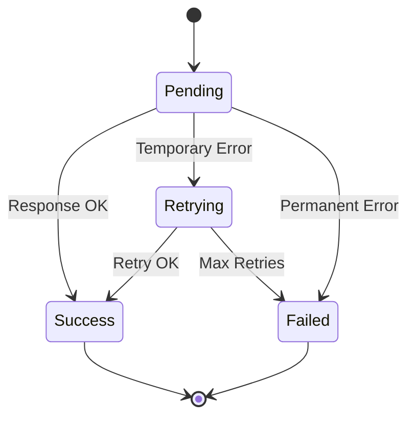

# Error Handling Guide

## Overview

RDAPify implements a comprehensive error handling system with structured error codes, retry logic, and detailed error information.

## Error Types

### Network Errors

```typescript
try {
  const result = await client.domain('example.com');
} catch (error) {
  if (error.code === 'NETWORK_ERROR') {
    console.log('Network connection failed');
    console.log('Retry after:', error.retryAfter);
  }
}
```

### RDAP Protocol Errors

```typescript
// 404 - Not Found
if (error.code === 'NOT_FOUND') {
  console.log('Resource does not exist');
}

// 429 - Rate Limited
if (error.code === 'RATE_LIMIT_EXCEEDED') {
  console.log('Too many requests');
  console.log('Retry after:', error.retryAfter);
}

// 500 - Server Error
if (error.code === 'SERVER_ERROR') {
  console.log('Registry server error');
}
```

### Validation Errors

```typescript
if (error.code === 'INVALID_DOMAIN') {
  console.log('Invalid domain format');
}

if (error.code === 'INVALID_IP_ADDRESS') {
  console.log('Invalid IP address format');
}

if (error.code === 'INVALID_ASN') {
  console.log('Invalid ASN format');
}
```

## Error State Machine

RDAPify uses a state machine for intelligent error handling:



## Retry Logic

### Automatic Retries

```typescript
const client = new RDAPClient({
  retry: {
    maxAttempts: 3,
    backoff: 'exponential',
    initialDelay: 1000,
    maxDelay: 10000
  }
});
```

### Manual Retry Control

```typescript
try {
  const result = await client.domain('example.com');
} catch (error) {
  if (error.retryable) {
    // Wait and retry
    await sleep(error.retryAfter || 1000);
    const result = await client.domain('example.com');
  }
}
```

## Error Information

All errors include detailed information:

```typescript
interface RDAPError extends Error {
  code: string;
  message: string;
  statusCode?: number;
  retryable: boolean;
  retryAfter?: number;
  details?: any;
  timestamp: Date;
}
```

## Best Practices

### 1. Always Handle Errors

```typescript
async function safeLookup(domain: string) {
  try {
    return await client.domain(domain);
  } catch (error) {
    logger.error('Domain lookup failed', { domain, error });
    return null;
  }
}
```

### 2. Implement Circuit Breaker

```typescript
class CircuitBreaker {
  private failures = 0;
  private threshold = 5;
  private timeout = 60000;
  private lastFailure?: Date;

  async execute(fn: () => Promise<any>) {
    if (this.isOpen()) {
      throw new Error('Circuit breaker open');
    }

    try {
      const result = await fn();
      this.onSuccess();
      return result;
    } catch (error) {
      this.onFailure();
      throw error;
    }
  }

  private isOpen(): boolean {
    if (this.failures < this.threshold) return false;
    if (!this.lastFailure) return false;
    return Date.now() - this.lastFailure.getTime() < this.timeout;
  }

  private onSuccess() {
    this.failures = 0;
  }

  private onFailure() {
    this.failures++;
    this.lastFailure = new Date();
  }
}
```

### 3. Log Errors Properly

```typescript
try {
  const result = await client.domain('example.com');
} catch (error) {
  logger.error('RDAP query failed', {
    domain: 'example.com',
    errorCode: error.code,
    statusCode: error.statusCode,
    retryable: error.retryable,
    timestamp: error.timestamp
  });
}
```

## Error Recovery Strategies

### Fallback to Cache

```typescript
async function lookupWithFallback(domain: string) {
  try {
    return await client.domain(domain);
  } catch (error) {
    // Try cache
    const cached = await cache.get(domain);
    if (cached) {
      logger.warn('Using cached data due to error', { domain });
      return cached;
    }
    throw error;
  }
}
```

### Graceful Degradation

```typescript
async function robustLookup(domain: string) {
  try {
    return await client.domain(domain);
  } catch (error) {
    if (error.code === 'RATE_LIMIT_EXCEEDED') {
      // Return partial data
      return { domain, status: 'rate_limited', error: true };
    }
    throw error;
  }
}
```

## See Also

- [Error State Machine](../core_concepts/error_state_machine.md)
- [Rate Limiting Guide](./rate_limiting.md)
- [Logging Guide](./logging.md)
