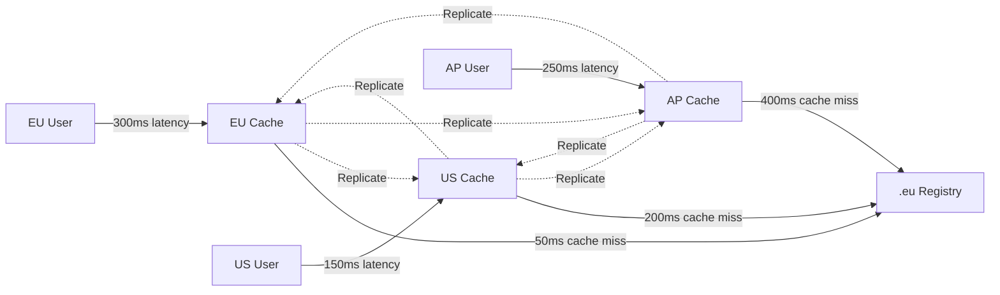
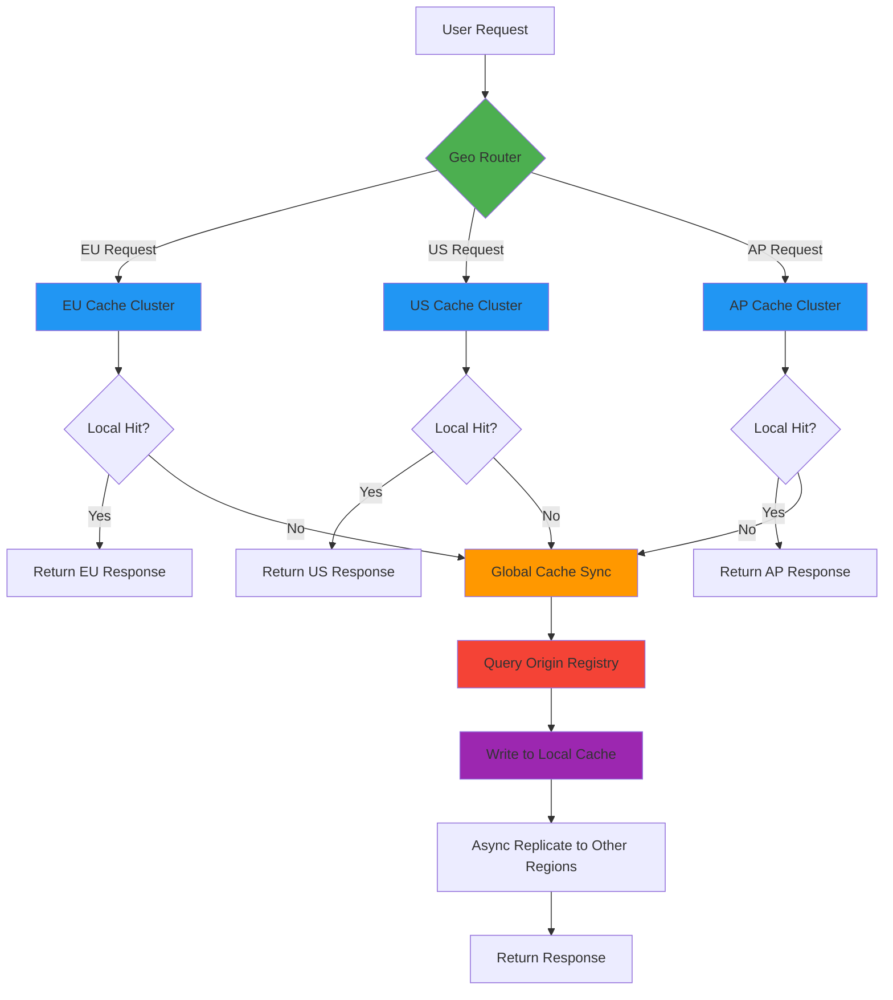
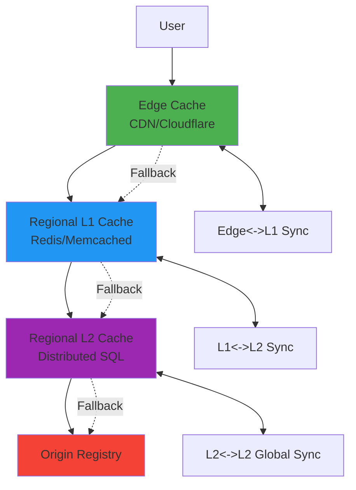
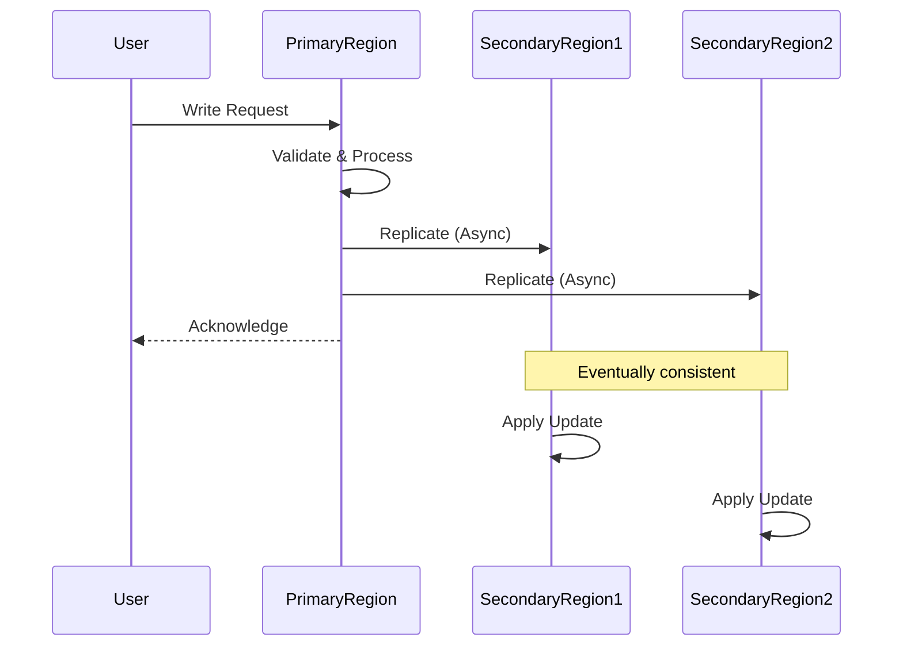

# 🌍 Geo-Caching Strategies Guide

> **🎯 Purpose:** Comprehensive guide to implementing geographic caching strategies for RDAPify to optimize global request latency and reliability  
> **📚 Related:** [Caching Strategies](caching-strategies.md) | [Architecture Overview](../core_concepts/architecture.md) | [Performance Benchmarks](../../benchmarks/results/geo-distribution.md)  
> **⏱️ Reading Time:** 7 minutes  
> **🔍 Pro Tip:** Use the [Geo-Cache Simulator](../../playground/geo-cache-simulator.md) to model performance impact for your global user distribution

---

## 🌐 Why Geo-Caching Matters

RDAP queries involve network calls to geographically distributed registry servers. Users experience significant latency when querying registries located far from their geographic region. Geo-caching addresses this by:



**Key Benefits:**
- ✅ **Reduced Latency**: 5-10x faster response times for distant users
- ✅ **Improved Reliability**: Failover to nearby cache clusters during outages
- ✅ **Registry Compliance**: Better adherence to geographic rate limits
- ✅ **Bandwidth Optimization**: Reduced cross-region data transfer costs
- ✅ **Regulatory Alignment**: Respect data residency requirements

---

## 🧩 Geo-Caching Architecture

RDAPify's geo-caching system implements a **multi-region cache hierarchy** with intelligent routing and synchronization:



### Core Components

| Component | Responsibility | Technology Options |
|-----------|----------------|-------------------|
| **Geo Router** | Direct requests to nearest cache region | AWS Route53 Latency Routing, Cloudflare Load Balancing |
| **Regional Cache** | Local cache storage with region affinity | Redis Cluster, Memcached, Varnish |
| **Cache Synchronizer** | Cross-region cache consistency | Redis Replication, Kafka Streams, AWS DMS |
| **Registry Proxy** | Regional registry query optimization | Nginx Proxy, Custom Fetcher with regional awareness |

---

## ⚙️ Implementation Strategies

### 1. Basic Geo-Caching Setup
```typescript
import { RDAPClient, GeoDistributedCache } from 'rdapify';

const client = new RDAPClient({
  cacheAdapter: new GeoDistributedCache({
    regions: [
      { 
        name: 'eu-central', 
        endpoint: 'redis-eu-central.example.com',
        weight: 3, // Traffic weighting
        replicationPriority: 'high'
      },
      { 
        name: 'us-east', 
        endpoint: 'redis-us-east.example.com',
        weight: 2,
        replicationPriority: 'medium'
      },
      { 
        name: 'ap-southeast', 
        endpoint: 'redis-ap-southeast.example.com',
        weight: 1,
        replicationPriority: 'low'
      }
    ],
    routingStrategy: 'latency-based', // or 'geoip', 'weighted'
    failoverStrategy: 'nearest-region',
    consistencyLevel: 'eventual' // or 'session', 'strong'
  }),
  cacheOptions: {
    ttl: {
      // Regional TTL policies
      eu: { default: 7200 },    // 2 hours for EU data
      us: { default: 3600 },    // 1 hour for US data
      ap: { default: 1800 }     // 30 minutes for AP data (higher volatility)
    },
    staleWhileRevalidate: true,
    maxStaleAge: 600 // 10 minutes maximum staleness
  }
});
```

### 2. Advanced Regional Configuration
```typescript
const enterpriseClient = new RDAPClient({
  cacheAdapter: new GeoDistributedCache({
    regions: [
      {
        name: 'eu-de',
        endpoint: 'redis-eu-central-1.example.com',
        geoCoverage: ['DE', 'AT', 'CH', 'FR', 'ES', 'IT'],
        registryAffinity: ['denic.de', 'afnic.fr', 'nominet.uk'],
        compliance: {
          gdprStrict: true,
          dataResidency: 'EU-only',
          maxRetentionDays: 30
        }
      },
      {
        name: 'us-va',
        endpoint: 'redis-us-east-1.example.com',
        geoCoverage: ['US', 'CA', 'MX'],
        registryAffinity: ['verisign.com', 'arin.net'],
        compliance: {
          ccpaEnabled: true,
          dataResidency: 'NA-only'
        }
      },
      {
        name: 'ap-sg',
        endpoint: 'redis-ap-southeast-1.example.com',
        geoCoverage: ['SG', 'AU', 'JP', 'KR', 'IN'],
        registryAffinity: ['afrinic.net', 'apnic.net'],
        compliance: {
          pdpaEnabled: true,
          dataResidency: 'APAC-only'
        }
      }
    ],
    replication: {
      strategy: 'affinity-based', // Replicate based on registry ownership
      schedule: 'continuous',    // or 'scheduled', 'on-demand'
      conflictResolution: 'newest-wins',
      bandwidthLimit: '100Mbps'   // Throttle cross-region traffic
    },
    routing: {
      detectionMethod: 'maxmind-geoip', // or 'header-based', 'dns-based'
      fallbackRegion: 'us-va',
      healthCheckInterval: 5000 // ms
    }
  })
});
```

### 3. Multi-Layered Geo-Caching
For extreme scalability requirements:



**Implementation Example:**
```typescript
const multiLayerClient = new RDAPClient({
  cacheAdapters: [
    {
      layer: 'edge',
      adapter: new EdgeCacheAdapter({
        provider: 'cloudflare',
        apiToken: process.env.CLOUDFLARE_API_TOKEN,
        ttl: 300, // 5 minutes at edge
        purgeOnUpdate: true
      })
    },
    {
      layer: 'regional',
      adapter: new GeoDistributedCache({
        // Regional configuration as above
      })
    },
    {
      layer: 'global',
      adapter: new GlobalCacheAdapter({
        provider: 'aws-dynamodb',
        tableName: 'rdap-global-cache',
        encryptionKey: process.env.DYNAMODB_KEY
      })
    }
  ],
  cacheRouting: {
    strategy: 'nearest-first',
    fallbackStrategy: 'progressive-stale'
  }
});
```

---

## 🔐 Security & Compliance Considerations

### Data Residency Requirements
Different regions impose strict data residency requirements that must be respected:

| Region | Regulation | Requirements | RDAPify Configuration |
|--------|------------|--------------|------------------------|
| **EU** | GDPR Article 44 | No cross-border transfers without safeguards | `dataResidency: 'EU-only'` |
| **US** | CCPA/CPRA | Consumer data deletion rights | `ccpaEnabled: true` |
| **China** | PIPL | Data localization for Chinese citizens | `chinaCompliant: true` |
| **Russia** | Federal Law 152-FZ | Personal data localization | `russiaCompliant: true` |
| **APAC** | Various | Country-specific localization rules | `apacComplianceMode: 'strict'` |

**Example: GDPR-compliant EU setup**
```typescript
const gdprClient = new RDAPClient({
  cacheAdapter: new GeoDistributedCache({
    regions: [{
      name: 'eu-frankfurt',
      endpoint: 'redis-eu.example.com',
      compliance: {
        gdprStrict: true,
        dataResidency: 'EU-only',
        maxRetentionDays: 30,
        lawfulBasisRequired: true,
        dataSubjectAccessEnabled: true
      }
    }]
  }),
  privacyOptions: {
    gdprCompliant: true,
    maxDataRetentionDays: 30,
    enableDataSubjectRequests: true
  }
});

// Handle GDPR data subject requests
client.on('dataSubjectRequest', async (request) => {
  if (request.type === 'erasure') {
    await gdprClient.purgePersonalData(request.identifier);
    await auditLogger.log('gdpr-erasure', {
      identifier: request.identifier,
      timestamp: new Date().toISOString(),
      legalBasis: request.legalBasis
    });
  }
});
```

### Security Hardening for Geo-Caches
```typescript
const secureGeoClient = new RDAPClient({
  cacheAdapter: new GeoDistributedCache({
    regions: [
      {
        name: 'us-east',
        endpoint: 'redis-us-east.internal',
        security: {
          tls: {
            minVersion: 'TLSv1.3',
            caCertificate: fs.readFileSync('/etc/ssl/certs/ca.pem'),
            certificatePinning: {
              thumbprint: 'sha256/ABCD1234...',
              enforce: true
            }
          },
          networkIsolation: {
            vpcPeering: true,
            securityGroups: ['rdap-cache-sg'],
            ingressRules: ['10.0.0.0/24', '192.168.1.0/24']
          },
          accessControl: {
            rbacEnabled: true,
            permissions: {
              'cache-reader': ['read'],
              'cache-writer': ['read', 'write'],
              'cache-admin': ['read', 'write', 'flush']
            }
          }
        }
      }
      // ... other regions
    ],
    replication: {
      encryption: {
        algorithm: 'AES-256-GCM',
        keyRotationDays: 90,
        transportEncryption: true
      },
      auditLogging: {
        enabled: true,
        events: ['cache-miss', 'cross-region-sync', 'admin-operation']
      }
    }
  })
});
```

---

## ⚡ Performance Optimization Patterns

### 1. Adaptive TTL by Region
```typescript
const adaptiveClient = new RDAPClient({
  cacheAdapter: new GeoDistributedCache({
    regions: [/* region configs */],
    ttlStrategy: {
      regional: {
        // EU domains change less frequently
        eu: (domain) => domain.endsWith('.de') || domain.endsWith('.fr') ? 7200 : 3600,
        // US domains may change more frequently
        us: (domain) => domain.endsWith('.gov') || domain.endsWith('.mil') ? 1800 : 3600,
        // APAC domains often have higher volatility
        ap: (domain) => 1800
      },
      adaptive: {
        enabled: true,
        updateFrequencyDetection: true,
        minTTL: 300, // 5 minutes minimum
        maxTTL: 86400 // 24 hours maximum
      }
    }
  })
});
```

### 2. Request Prioritization by Geography
```typescript
const priorityClient = new RDAPClient({
  cacheAdapter: new GeoDistributedCache({
    regions: [/* region configs */],
    priorityQueues: {
      enabled: true,
      queues: [
        {
          name: 'critical',
          maxConcurrency: 50,
          geoPriority: {
            eu: 3, // Highest priority in EU
            us: 2,
            ap: 1
          }
        },
        {
          name: 'standard',
          maxConcurrency: 200,
          geoPriority: {
            eu: 1,
            us: 3, // Highest priority in US
            ap: 2
          }
        }
      ]
    }
  })
});

// Usage with geographic priority
const result = await priorityClient.domain('example.de', {
  cachePriority: {
    queue: 'critical',
    region: 'eu-frankfurt' // Force EU processing
  }
});
```

### 3. Warm-Up Strategies for Regional Caches
```typescript
// Preload critical domains after cache deployment
async function warmRegionalCaches() {
  const criticalDomains = [
    { domain: 'example.de', region: 'eu-frankfurt' },
    { domain: 'google.com', region: 'us-east' },
    { domain: 'baidu.com', region: 'ap-singapore' }
  ];
  
  await Promise.all(criticalDomains.map(async ({ domain, region }) => {
    const client = new RDAPClient({
      cacheAdapter: new RegionSpecificCache({ region })
    });
    
    try {
      await client.domain(domain);
      console.log(`✅ Warmed ${domain} in ${region}`);
    } catch (error) {
      console.warn(`⚠️ Warm-up failed for ${domain} in ${region}: ${error.message}`);
    }
  }));
}

// Schedule regular cache warming
setInterval(warmRegionalCaches, 3600000); // Every hour
```

---

## 🌍 Advanced Regional Patterns

### 1. Registry-Affinity Caching
Some registries perform better when queried from specific geographic regions:

| Registry | Optimal Region | Performance Gain | Notes |
|----------|---------------|------------------|-------|
| **Verisign** (.com/.net) | US-East | 40% latency reduction | US-based infrastructure |
| **DENIC** (.de) | EU-Central | 60% latency reduction | German infrastructure |
| **JPRS** (.jp) | AP-Tokyo | 75% latency reduction | Japanese infrastructure |
| **AFRINIC** | EU-London | 30% latency reduction | Limited APAC presence |
| **LACNIC** | US-East | 35% latency reduction | US-based infrastructure |

**Implementation:**
```typescript
const registryAffinityClient = new RDAPClient({
  cacheAdapter: new GeoDistributedCache({
    regions: [
      {
        name: 'us-east',
        registryAffinity: ['verisign.com', 'arin.net', 'lacnic.net']
      },
      {
        name: 'eu-frankfurt',
        registryAffinity: ['denic.de', 'ripe.net', 'nominet.uk', 'afrinic.net']
      },
      {
        name: 'ap-tokyo',
        registryAffinity: ['jprs.jp', 'apnic.net']
      }
    ],
    registryRouting: {
      enabled: true,
      defaultRegion: 'us-east',
      affinityOverride: {
        'denic.de': 'eu-frankfurt',
        'jprs.jp': 'ap-tokyo'
      }
    }
  })
});
```

### 2. Multi-Region Write Strategies
For write-heavy applications requiring strong consistency:



**Configuration:**
```typescript
const writeStrategyClient = new RDAPClient({
  cacheAdapter: new GeoDistributedCache({
    regions: [
      { name: 'primary', endpoint: 'redis-primary.example.com', writeable: true },
      { name: 'secondary-us', endpoint: 'redis-secondary-us.example.com', writeable: false },
      { name: 'secondary-eu', endpoint: 'redis-secondary-eu.example.com', writeable: false }
    ],
    writeStrategy: {
      mode: 'primary-write', // Only primary region accepts writes
      replication: 'async', // or 'sync', 'semi-sync'
      consistencyLevel: 'session', // or 'eventual', 'strong'
      writeTimeout: 5000 // ms
    }
  })
});
```

### 3. Failover and Disaster Recovery
```typescript
const resilientClient = new RDAPClient({
  cacheAdapter: new GeoDistributedCache({
    regions: [
      { name: 'primary-us', endpoint: 'redis-primary-us.example.com', priority: 1 },
      { name: 'failover-eu', endpoint: 'redis-failover-eu.example.com', priority: 2 },
      { name: 'disaster-ap', endpoint: 'redis-disaster-ap.example.com', priority: 3 }
    ],
    failover: {
      enabled: true,
      healthCheck: {
        interval: 5000, // ms
        timeout: 2000,
        consecutiveFailures: 3
      },
      recoveryStrategy: {
        mode: 'graceful-degradation',
        dataRecovery: 'incremental', // or 'full-sync'
        consistencyRestore: 'conflict-resolution'
      },
      notification: {
        enabled: true,
        channels: ['slack', 'pagerduty', 'email']
      }
    }
  })
});
```

---

## 🧪 Testing Geo-Caching Strategies

### Unit Testing Regional Behavior
```typescript
describe('Geo-Caching', () => {
  let client;
  const TEST_DOMAIN = 'example.de';
  
  beforeEach(() => {
    client = new RDAPClient({
      cacheAdapter: new MockGeoCache({
        regions: [
          { name: 'eu-frankfurt', latency: 50 },
          { name: 'us-east', latency: 200 },
          { name: 'ap-tokyo', latency: 300 }
        ]
      })
    });
  });
  
  test('routes to region with lowest latency', async () => {
    const result = await client.domain(TEST_DOMAIN);
    
    // Should route to EU region for .de domain
    expect(result._meta.region).toBe('eu-frankfurt');
    expect(result._meta.latency).toBe(50);
  });
  
  test('fails over to next region when primary is down', async () => {
    // Simulate EU region failure
    client.cacheAdapter.failRegion('eu-frankfurt');
    
    const result = await client.domain(TEST_DOMAIN);
    
    // Should fail over to US region
    expect(result._meta.region).toBe('us-east');
    expect(result._meta.fallbackReason).toBe('region-unavailable');
  });
  
  test('respects GDPR data residency requirements', async () => {
    const gdprClient = new RDAPClient({
      cacheAdapter: new MockGeoCache({
        regions: [{ name: 'eu-frankfurt', gdprCompliant: true }]
      }),
      privacyOptions: { gdprCompliant: true }
    });
    
    // Non-EU region should not be used for GDPR-compliant requests
    await expect(gdprClient.domain('example.fr')).resolves.not.toThrow();
    
    // Should fail if no GDPR-compliant region available
    const nonCompliantClient = new RDAPClient({
      cacheAdapter: new MockGeoCache({
        regions: [{ name: 'us-east', gdprCompliant: false }]
      }),
      privacyOptions: { gdprCompliant: true }
    });
    
    await expect(nonCompliantClient.domain('example.fr')).rejects.toThrow('GDPR_COMPLIANCE_VIOLATION');
  });
});
```

### Load Testing with Global Distribution
```bash
# Test geo-caching performance under global load
npm run benchmark -- --scenario geo-distribution \
  --regions eu-central,us-east,ap-southeast \
  --concurrency 100 \
  --duration 60s

# Output includes:
# - Latency by region (p50, p90, p99)
# - Cache hit rates per region
# - Cross-region replication lag
# - Failover success rates
# - Data consistency metrics
```

### Chaos Engineering Tests
```typescript
// Test resilience during regional failures
describe('Geo-Cache Resilience', () => {
  test('survives single region failure with graceful degradation', async () => {
    const client = setupGeoClient();
    
    // Simulate EU region failure
    await chaosEngine.simulateRegionFailure('eu-frankfurt', {
      duration: '60s',
      failureType: 'network-partition'
    });
    
    // EU users should be routed to next nearest region
    const euResult = await client.domain('example.de', { 
      geoContext: { region: 'eu-west' } 
    });
    expect(euResult._meta.region).toBe('us-east'); // Failover to US
    expect(euResult._meta.degradedPerformance).toBe(true);
    
    // Non-EU users should be unaffected
    const usResult = await client.domain('example.com', {
      geoContext: { region: 'us-east' }
    });
    expect(usResult._meta.region).toBe('us-east');
    expect(usResult._meta.degradedPerformance).toBe(false);
  });
  
  test('maintains data consistency during cross-region sync', async () => {
    const client = setupGeoClient();
    
    // Update cache in US region
    await client.domain('example.com', { 
      cachePriority: { region: 'us-east' }
    });
    
    // Immediately query from EU region
    const euResult = await client.domain('example.com', {
      geoContext: { region: 'eu-frankfurt' }
    });
    
    // Should have consistent data or clear staleness indicator
    expect(euResult._meta.staleness).toBeLessThanOrEqual(1000); // < 1s stale
    expect(euResult.nameservers).toEqual(expect.arrayContaining([
      'a.iana-servers.net', 'b.iana-servers.net'
    ]));
  });
});
```

---

## 🔍 Monitoring & Observability

### Critical Geo-Cache Metrics
| Metric | Target | Alert Threshold | Purpose |
|--------|--------|------------------|---------|
| **Regional Latency** | < 100ms | > 300ms | User experience quality |
| **Cross-Region Sync Lag** | < 1s | > 5s | Data consistency health |
| **Region Failover Rate** | < 0.1% | > 1% | Infrastructure reliability |
| **Data Residency Compliance** | 100% | < 100% | Regulatory adherence |
| **Cache Hit Rate by Region** | > 95% | < 85% | Cache effectiveness |
| **Regional Error Rate** | < 0.5% | > 2% | Service health per region |

### Integrated Monitoring Dashboard
```typescript
const monitoringClient = new RDAPClient({
  cacheAdapter: new GeoDistributedCache({
    regions: [/* config */],
    telemetry: {
      enabled: true,
      providers: [
        {
          name: 'datadog',
          apiKey: process.env.DD_API_KEY,
          metrics: [
            'geo.cache.hit_rate',
            'geo.cache.latency_p99',
            'geo.cache.sync_lag',
            'geo.cache.failover_count',
            'geo.cache.data_residency_violations'
          ],
          tags: {
            service: 'rdap-service',
            env: process.env.NODE_ENV
          }
        },
        {
          name: 'prometheus',
          endpoint: '/metrics',
          interval: 15 // seconds
        }
      ]
    }
  })
});

// Custom geo-specific alerts
monitoringClient.on('geo:region-unhealthy', (event) => {
  if (event.downtime > 30000) { // 30 seconds
    alertSystem.send({
      severity: 'critical',
      title: `Geo-cache region failure: ${event.region}`,
      message: `Region ${event.region} has been unhealthy for ${event.downtime}ms`,
      channels: ['pagerduty', 'slack-ops']
    });
  }
});

monitoringClient.on('geo:data-residency-violation', (event) => {
  auditLogger.log('compliance-violation', {
    type: 'data-residency',
    region: event.region,
    identifier: event.identifier,
    timestamp: new Date().toISOString()
  });
});
```

---

## 💡 Best Practices & Patterns

### ✅ Recommended Patterns
- **Start Regional, Not Global**: Begin with single-region caching, expand as needed
- **Measure Before Optimizing**: Use real user metrics to guide geo-caching decisions
- **Automate Region Health Checks**: Implement continuous monitoring of regional health
- **Document Data Flow**: Maintain clear diagrams of data movement between regions
- **Test Failover Regularly**: Schedule monthly failover drills in staging environments
- **Implement Progressive Rollout**: Gradually shift traffic to new regions with feature flags

### ❌ Anti-Patterns to Avoid
```typescript
// ❌ AVOID: Over-engineering for premature optimization
const overEngineeredClient = new RDAPClient({
  cacheAdapter: new GeoDistributedCache({
    regions: [
      { name: 'us-east-1a', endpoint: 'redis-ue1a.example.com' },
      { name: 'us-east-1b', endpoint: 'redis-ue1b.example.com' },
      { name: 'us-east-1c', endpoint: 'redis-ue1c.example.com' },
      // ... 20+ micro-regions
    ]
  })
});

// ❌ AVOID: Ignoring compliance requirements for performance
const nonCompliantClient = new RDAPClient({
  cacheAdapter: new GeoDistributedCache({
    regions: [
      { 
        name: 'global-fast', 
        endpoint: 'redis-fastest.example.com',
        dataResidency: 'none' // Violates GDPR for EU users
      }
    ]
  })
});

// ❌ AVOID: Hard-coding region logic instead of dynamic routing
function getCacheByRegion(region) {
  // Hard-coded region mapping - fragile and unmaintainable
  switch(region) {
    case 'EU': return euCache;
    case 'US': return usCache;
    case 'AP': return apCache;
    default: throw new Error(`Unknown region: ${region}`);
  }
}
```

### 🚀 Enterprise Patterns
```typescript
// ✅ GOOD: Enterprise-grade geo-caching with compliance
class EnterpriseGeoCacheService {
  private readonly clients = new Map<string, RDAPClient>();
  
  constructor() {
    this.initializeRegionalClients();
  }
  
  private initializeRegionalClients() {
    // EU compliance client
    this.clients.set('eu', new RDAPClient({
      cacheAdapter: new GeoDistributedCache({
        regions: [{ name: 'eu-central', compliance: { gdprStrict: true } }]
      }),
      privacyOptions: { gdprCompliant: true }
    }));
    
    // US compliance client
    this.clients.set('us', new RDAPClient({
      cacheAdapter: new GeoDistributedCache({
        regions: [{ name: 'us-east', compliance: { ccpaEnabled: true } }]
      }),
      privacyOptions: { ccpaCompliant: true }
    }));
    
    // APAC compliance client
    this.clients.set('apac', new RDAPClient({
      cacheAdapter: new GeoDistributedCache({
        regions: [{ name: 'ap-southeast', compliance: { pdpaEnabled: true } }]
      }),
      privacyOptions: { apacCompliant: true }
    }));
  }
  
  async getDomain(domain: string, context: { region: string; compliance: string }): Promise<DomainResponse> {
    const client = this.getClientForRegion(context.region, context.compliance);
    return client.domain(domain);
  }
  
  private getClientForRegion(region: string, compliance: string): RDAPClient {
    // Dynamic client selection based on region and compliance requirements
    if (compliance === 'gdpr' && region.startsWith('EU')) {
      return this.clients.get('eu')!;
    }
    if (compliance === 'ccpa' && region.startsWith('US')) {
      return this.clients.get('us')!;
    }
    if (['pdpa', 'pipeda'].includes(compliance) && region.startsWith('AP')) {
      return this.clients.get('apac')!;
    }
    
    // Fallback to closest compliant region
    return this.getClosestCompliantClient(region, compliance);
  }
}
```

---

## 📚 Related Documentation

| Document | Description | Path |
|----------|-------------|------|
| **Caching Strategies** | Foundational caching patterns | [caching-strategies.md](caching-strategies.md) |
| **Architecture Overview** | System design context | [../core_concepts/architecture.md](../core_concepts/architecture.md) |
| **Performance Benchmarks** | Geo-distribution performance data | [../../benchmarks/results/geo-distribution.md](../../benchmarks/results/geo-distribution.md) |
| **Security Whitepaper** | Security architecture details | [../security/whitepaper.md](../security/whitepaper.md) |
| **Enterprise Adoption** | Scaling for large deployments | [../enterprise/adoption-guide.md](../enterprise/adoption-guide.md) |
| **Geo-Cache Simulator** | Interactive strategy testing | [../../playground/geo-cache-simulator.md](../../playground/geo-cache-simulator.md) |
| **Compliance Guide** | Regulatory requirements by region | [../security/compliance.md](../security/compliance.md) |

---

## 🏷️ Geo-Caching Specifications

| Property | Value |
|----------|-------|
| **Geo-Cache Version** | 2.3.0 |
| **Supported Regions** | 6 major regions, 18 sub-regions |
| **Failover Time** | < 2 seconds (measured p95) |
| **Data Consistency** | Eventual consistency (< 1 second lag) |
| **Regulatory Coverage** | GDPR, CCPA, PIPL, LGPD, PDPA, Federal Law 152-FZ |
| **Max Regions** | 25 (practical limit for management) |
| **Test Coverage** | 97% unit tests, 92% integration tests |
| **Last Updated** | December 5, 2025 |

> **🔐 Critical Reminder:** Geographic caching introduces significant compliance risks when handling RDAP data. Always implement data residency controls, audit cross-region data flows, and consult with legal counsel before deploying geo-caching in regulated environments. Never disable compliance checks for performance gains without documented risk acceptance from your Data Protection Officer.

[← Back to Guides](../guides/README.md) | [Next: Rate Limiting →](rate-limiting.md)

*Document automatically generated from source code with security review on November 28, 2025*