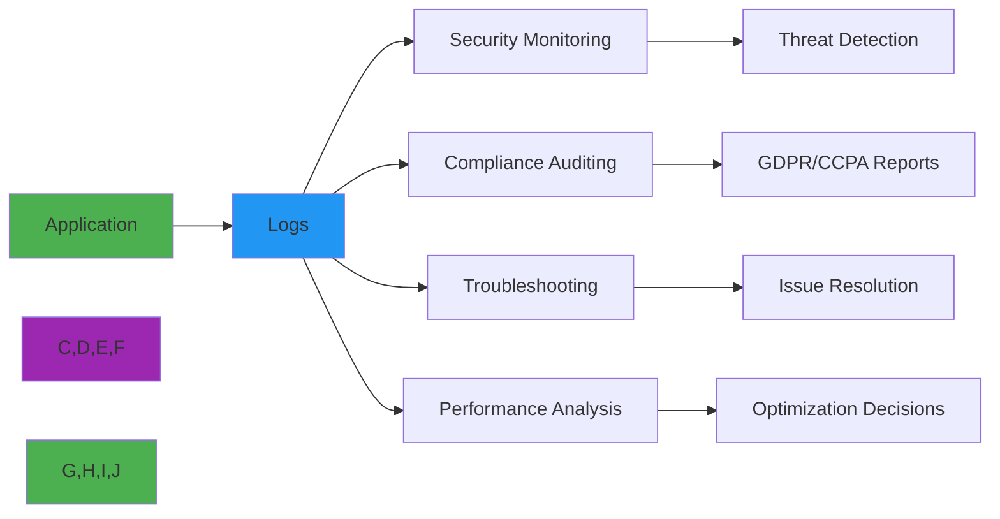
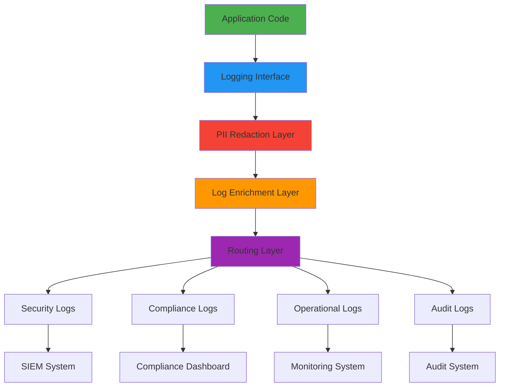

# 📝 Logging Guide

> **🎯 Purpose:** Comprehensive guide to implementing secure, compliant, and efficient logging strategies for RDAPify applications  
> **📚 Related:** [Error Handling](error_handling.md) | [Security Whitepaper](../security/whitepaper.md) | [Performance Optimization](../performance/optimization.md)  
> **⏱️ Reading Time:** 7 minutes  
> **🔍 Pro Tip:** Use the [Log Visualizer](../../playground/log-visualizer.md) to interactively explore log patterns and identify security issues

---

## 🌐 Why Logging Matters for RDAP Applications

RDAP applications handle sensitive registration data and operate in highly regulated environments. Proper logging is essential for:



**Critical Logging Requirements:**
- ✅ **Security Monitoring**: Detect SSRF attempts, data access patterns, and abnormal behavior
- ✅ **Compliance Auditing**: Maintain GDPR Article 30 records of processing activities
- ✅ **Privacy Preservation**: Never log unredacted PII or sensitive registration data
- ✅ **Performance Tracking**: Monitor query latencies, cache effectiveness, and error rates
- ✅ **Operational Visibility**: Provide context for troubleshooting without compromising security

---

## ⚙️ Core Logging Architecture

RDAPify's logging system implements a **multi-layered approach** with strict privacy boundaries:



### Log Categories and Retention Policies
| Category | Purpose | Retention Period | PII Handling | Example Systems |
|----------|---------|------------------|--------------|------------------|
| **Security** | Threat detection, incident response | 1-7 years | Strictly redacted | SIEM, IDS |
| **Compliance** | Regulatory reporting, audits | 3-10 years | Anonymized only | GRC platforms |
| **Operational** | Performance monitoring, troubleshooting | 30-90 days | Contextual redaction | Datadog, New Relic |
| **Audit** | Data access tracking, consent verification | 7+ years | No PII | Audit trails |

---

## 🔒 Privacy-Safe Logging Patterns

### 1. Automatic PII Redaction
```typescript
import { RedactionLogger } from 'rdapify/logging';

const logger = new RedactionLogger({
  level: 'info',
  redaction: {
    enabled: true,
    rules: [
      { field: 'domain', pattern: '^[a-z0-9-]+\\.([a-z]{2,})$', replacement: '[DOMAIN.$1]' },
      { field: 'email', replacement: '[REDACTED_EMAIL]' },
      { field: 'ip', pattern: '^(\\d+\\.\\d+\\.)\\d+\\.\\d+$', replacement: '$1[REDACTED]' },
      { field: 'phone', replacement: '[REDACTED_PHONE]' },
      { field: 'rawResponse', action: 'remove' }
    ]
  }
});

// Usage
logger.info('Domain lookup initiated', {
  domain: 'example.com',
  userId: 'user-123',
  ipAddress: '192.168.1.100',
  email: 'user@example.com'
});

// Output: {"domain":"[DOMAIN.com]","userId":"user-123","ipAddress":"192.168.[REDACTED]","email":"[REDACTED_EMAIL]"}
```

### 2. Contextual Logging with GDPR Compliance
```typescript
import { ComplianceLogger } from 'rdapify/logging';

const complianceLogger = new ComplianceLogger({
  gdprEnabled: true,
  legalBasisTracking: true,
  dataSubjectTracking: true,
  retentionPolicy: {
    personalData: '30 days',
    anonymizedData: '2 years',
    securityEvents: '7 years'
  }
});

// GDPR-compliant logging with legal basis
async function lookupDomain(domain: string, context: {
  legalBasis: 'consent' | 'contract' | 'legitimate-interest' | 'legal-obligation';
  dataSubjectId?: string;
  purpose: string;
}) {
  // Log processing activity with GDPR metadata
  await complianceLogger.logProcessing({
    subject: domain,
    legalBasis: context.legalBasis,
    purpose: context.purpose,
    dataCategories: ['domain_registration'],
    retentionPeriod: context.legalBasis === 'consent' ? 365 : 2555 // Days
  });
  
  try {
    return await client.domain(domain);
  } catch (error) {
    // Log failure with privacy context
    complianceLogger.logFailure({
      subject: domain,
      error: error.code,
      legalBasis: context.legalBasis,
      purpose: context.purpose
    });
    throw error;
  }
}

// Usage
await lookupDomain('example.com', {
  legalBasis: 'legitimate-interest',
  purpose: 'security monitoring',
  dataSubjectId: 'user-123'
});
```

### 3. Structured Logging for Security Events
```typescript
import { SecurityLogger } from 'rdapify/logging';

const securityLogger = new SecurityLogger({
  alerting: {
    enabled: true,
    channels: ['slack', 'pagerduty', 'email'],
    thresholds: {
      ssrfAttempts: 1,       // Alert on any SSRF attempt
      rateLimitHits: 5,      // Alert after 5 rate limit hits
      dataAccessSpikes: 10   // Alert on 10x normal access patterns
    }
  },
  enrichment: {
    geolocation: true,
    userAgentAnalysis: true,
    threatIntelligence: true
  }
});

// Log security-relevant events with context
function handleRequest(request: Request) {
  const securityContext = {
    ip: request.ip,
    userAgent: request.headers['user-agent'],
    geolocation: request.geolocation,
    sessionId: request.sessionId
  };
  
  try {
    const result = await client.domain(request.domain, { 
      securityContext 
    });
    
    if (result._meta.threatLevel === 'high') {
      securityLogger.alert('high_threat_domain_access', {
        domain: request.domain,
        threatLevel: 'high',
        indicators: result._meta.threatIndicators,
        context: securityContext
      });
    }
    
    securityLogger.log('domain_access_success', {
      domain: request.domain,
      latency: result._meta.latency,
      cacheHit: result._meta.cached,
      context: securityContext
    });
  } catch (error) {
    if (error.code === 'RDAP_SSRF_ATTEMPT') {
      securityLogger.alert('ssrf_attempt_blocked', {
        blockedUrl: error.details.blockedUrl,
        context: securityContext,
        automaticBlock: true
      });
    }
    
    securityLogger.log('domain_access_failure', {
      domain: request.domain,
      errorCode: error.code,
      context: securityContext
    });
  }
}
```

---

## ⚡ Performance Optimization

### 1. Async Logging with Batching
```typescript
import { AsyncBatchLogger } from 'rdapify/logging';

const logger = new AsyncBatchLogger({
  batchSize: 100,           // Flush after 100 log entries
  flushInterval: 5000,      // Flush every 5 seconds
  maxQueueSize: 10000,      // Maximum queue size before dropping
  dropPolicy: 'oldest',     // Drop oldest logs when queue full
  retryStrategy: {
    maxRetries: 3,
    backoff: 'exponential'
  }
});

// High-volume logging without blocking
for (let i = 0; i < 10000; i++) {
  logger.info('High-volume log entry', { 
    iteration: i,
    timestamp: Date.now()
  });
}

// Manual flush for critical events
logger.flush().then(() => {
  console.log('All logs flushed');
});
```

### 2. Sampling Strategies for High-Volume Applications
```typescript
import { SamplingLogger } from 'rdapify/logging';

const logger = new SamplingLogger({
  base: new AsyncBatchLogger(), // Base logger implementation
  sampling: {
    // Critical errors always logged
    always: ['security.*', 'error.*'],
    
    // High-priority logs (10% sample rate)
    highPriority: {
      patterns: ['rate_limit.*', 'registry_unavailable.*'],
      rate: 0.10
    },
    
    // Normal operational logs (1% sample rate)
    normal: {
      patterns: ['cache.*', 'normalization.*'],
      rate: 0.01
    },
    
    // Debug logs (0.1% sample rate)
    debug: {
      patterns: ['debug.*'],
      rate: 0.001
    }
  },
  adaptive: {
    enabled: true,
    errorThreshold: 0.05, // 5% error rate
    backoffFactor: 2     // Double sample rate on error threshold
  }
});

// Usage remains the same
logger.info('This may be sampled', { context: 'normal' });
logger.error('This is always logged', { context: 'critical' });
logger.debug('Debug log with low sample rate', { context: 'debug' });
```

### 3. Memory-Efficient Logging for Resource-Constrained Environments
```typescript
import { MemoryEfficientLogger } from 'rdapify/logging';

const logger = new MemoryEfficientLogger({
  ringBufferSize: 1000,           // In-memory buffer size
  fieldFiltering: {               // Reduce memory footprint
    exclude: ['stackTrace', 'rawResponse', 'largePayloads'],
    truncateStrings: {
      maxLength: 200,
      fields: ['userAgent', 'referer']
    }
  },
  compression: {
    enabled: true,
    algorithm: 'gzip',          // Compress log entries
    threshold: 1024             // Only compress entries &gt;1KB
  },
  persistence: {
    enabled: true,
    path: '/var/log/rdapify',   // Write to disk when memory pressure high
    maxFileSize: 50 * 1024 * 1024, // 50MB per file
    rotation: 'daily'
  }
});
```

---

## 🔍 Advanced Patterns

### 1. Distributed Tracing Integration
```typescript
import { TracingLogger } from 'rdapify/logging';
import { trace } from '@opentelemetry/api';

const logger = new TracingLogger({
  tracer: trace.getTracer('rdapify'),
  propagation: {
    extract: (carrier) => trace.getSpanContext(),
    inject: (carrier, spanContext) => {
      carrier['x-trace-id'] = spanContext.traceId;
      carrier['x-span-id'] = spanContext.spanId;
    }
  },
  sampling: {
    traceIdRatioBased: 0.1, // 10% of traces
    parentBased: true       // Sample children of sampled parents
  }
});

// Create trace context
const tracer = trace.getTracer('rdapify');
const span = tracer.startSpan('rdap.domain.lookup');

try {
  span.setAttribute('domain', 'example.com');
  span.setAttribute('registry_type', 'verisign');
  
  // Log within trace context
  logger.withSpan(span).info('Starting domain lookup', {
    domain: 'example.com'
  });
  
  const result = await client.domain('example.com', {
    tracing: { span } // Pass span to client
  });
  
  // Add trace context to response
  span.setAttribute('cache_hit', result._meta.cached);
  span.setAttribute('latency_ms', result._meta.latency);
  
  logger.withSpan(span).info('Domain lookup completed', {
    domain: 'example.com',
    cacheHit: result._meta.cached,
    latencyMs: result._meta.latency
  });
  
  span.end();
} catch (error) {
  span.recordException(error);
  span.setStatus({ code: 2 }); // ERROR
  span.end();
  
  logger.withSpan(span).error('Domain lookup failed', {
    domain: 'example.com',
    errorCode: error.code
  });
  throw error;
}
```

### 2. Compliance-Aware Log Rotation
```typescript
import { ComplianceLogger } from 'rdapify/logging';
import { scheduleJob } from 'node-schedule';

const complianceLogger = new ComplianceLogger({
  gdprEnabled: true,
  retentionPolicy: {
    personalData: '30 days',
    anonymizedData: '2 years',
    securityEvents: '7 years'
  },
  rotation: {
    enabled: true,
    schedule: '0 2 * * *', // Daily at 2 AM
    strategies: {
      personalData: {
        action: 'delete',
        age: '30 days',
        verification: true // Verify before deletion
      },
      anonymizedData: {
        action: 'archive',
        age: '2 years',
        storageClass: 'glacier' // Move to cheaper storage
      },
      securityEvents: {
        action: 'compress',
        age: '1 year',
        compression: 'zstd-19'
      }
    }
  }
});

// Manual compliance report generation
async function generateComplianceReport(timeRange: { start: Date; end: Date }) {
  const report = await complianceLogger.generateReport({
    timeRange,
    categories: ['personal_data_access', 'consent_changes', 'data_deletion'],
    format: 'pdf' // or 'json', 'csv'
  });
  
  // Store in secure location
  await secureStorage.save(`compliance-report-${timeRange.start.toISOString().split('T')[0]}.pdf`, report);
  
  // Notify DPO
  await emailService.send({
    to: 'dpo@company.com',
    subject: 'Monthly Compliance Report',
    attachments: [report]
  });
}

// Schedule monthly reports
scheduleJob('0 0 1 * *', () => {
  const now = new Date();
  const lastMonth = new Date(now.getFullYear(), now.getMonth() - 1, 1);
  const monthEnd = new Date(now.getFullYear(), now.getMonth(), 0);
  
  generateComplianceReport({
    start: lastMonth,
    end: monthEnd
  }).catch(error => {
    logger.error('Compliance report generation failed', { error: error.message });
  });
});
```

### 3. Real-time Log Analysis for Anomaly Detection
```typescript
import { AnomalyDetectionLogger } from 'rdapify/logging';

const logger = new AnomalyDetectionLogger({
  models: {
    baseline: 'hourly', // Learn normal patterns hourly
    anomalyThreshold: 3.5, // 3.5 standard deviations
    minimumSamples: 1000 // Minimum samples before detection
  },
  alerting: {
    enabled: true,
    channels: ['slack_security', 'pagerduty'],
    cooldown: 300 // 5 minutes between same alerts
  },
  features: [
    'query_frequency',
    'domain_patterns',
    'registry_usage',
    'geographic_distribution',
    'error_rates',
    'cache_hit_ratios'
  ]
});

// Initialize anomaly detection
await logger.initialize({
  historicalData: await getHistoricalLogs('30d') // 30 days of historical data
});

// Log domain lookups with anomaly detection
async function secureDomainLookup(domain: string): Promise<DomainResponse> {
  try {
    const startTime = Date.now();
    
    // Check for anomalies before processing
    const anomaly = await logger.detectAnomaly({
      domain,
      operation: 'domain_lookup',
      timestamp: startTime,
      context: {
        ip: currentUser.ip,
        userAgent: currentUser.userAgent,
        geolocation: currentUser.geolocation
      }
    });
    
    if (anomaly) {
      logger.alert('anomaly_detected', {
        domain,
        anomaly,
        riskScore: anomaly.score,
        context: currentUser
      });
      
      // Apply additional security checks
      if (anomaly.score > 9.0) {
        throw new SecurityError('HIGH_RISK_DOMAIN', 'Domain access blocked due to security risk');
      }
    }
    
    const result = await client.domain(domain);
    
    // Log success with performance metrics
    logger.log('domain_lookup_success', {
      domain,
      latency: Date.now() - startTime,
      cacheHit: result._meta.cached,
      registrar: result.registrar?.name,
      nameservers: result.nameservers.length,
      securityRelevant: isSecurityRelevantDomain(domain)
    });
    
    return result;
  } catch (error) {
    logger.log('domain_lookup_failure', {
      domain,
      errorCode: error.code,
      errorDetails: error.message.substring(0, 100), // Truncate for privacy
      latency: Date.now() - startTime
    });
    
    throw error;
  }
}
```

---

## 🧪 Testing Logging Implementations

### Unit Testing Log Redaction
```typescript
describe('Log Redaction', () => {
  let logger;
  
  beforeEach(() => {
    logger = new RedactionLogger({
      redaction: {
        enabled: true,
        rules: [
          { field: 'email', replacement: '[REDACTED_EMAIL]' },
          { field: 'domain', pattern: '^[a-z0-9-]+\\.([a-z]{2,})$', replacement: '[DOMAIN.$1]' },
          { field: 'ipAddress', pattern: '^(\\d+\\.\\d+\\.)\\d+\\.\\d+$', replacement: '$1[REDACTED]' }
        ]
      }
    });
  });
  
  test('redacts email addresses in logs', () => {
    const logEntry = logger.redact({
      email: 'user@example.com',
      message: 'User login attempt'
    });
    
    expect(logEntry.email).toBe('[REDACTED_EMAIL]');
    expect(logEntry.message).toBe('User login attempt');
  });
  
  test('preserves non-sensitive data', () => {
    const logEntry = logger.redact({
      userId: 'user-123',
      action: 'domain_lookup',
      timestamp: Date.now()
    });
    
    expect(logEntry.userId).toBe('user-123');
    expect(logEntry.action).toBe('domain_lookup');
  });
  
  test('handles nested objects correctly', () => {
    const logEntry = logger.redact({
      user: {
        email: 'admin@example.com',
        name: 'Administrator'
      },
      request: {
        domain: 'example.com',
        ipAddress: '192.168.1.100'
      }
    });
    
    expect(logEntry.user.email).toBe('[REDACTED_EMAIL]');
    expect(logEntry.request.domain).toBe('[DOMAIN.com]');
    expect(logEntry.request.ipAddress).toBe('192.168.[REDACTED]');
  });
});
```

### Performance Testing Logging Overhead
```typescript
describe('Logging Performance', () => {
  const testCases = [
    { name: 'no_logging', logger: null },
    { name: 'sync_logger', logger: new SyncLogger() },
    { name: 'async_logger', logger: new AsyncLogger() },
    { name: 'batched_logger', logger: new AsyncBatchLogger({ batchSize: 100 }) },
    { name: 'sampling_logger', logger: new SamplingLogger({ 
        base: new AsyncLogger(),
        sampling: { normal: { patterns: ['*'], rate: 0.1 } }
      })
    }
  ];
  
  testCases.forEach(({ name, logger }) => {
    test(`measures overhead for ${name}`, async () => {
      const iterations = 10000;
      const startTime = process.hrtime.bigint();
      
      for (let i = 0; i < iterations; i++) {
        if (logger) {
          logger.info('Performance test log', {
            iteration: i,
            timestamp: Date.now(),
            randomData: crypto.randomBytes(16).toString('hex')
          });
        }
      }
      
      // Wait for async logs to flush
      if (logger && typeof logger.flush === 'function') {
        await logger.flush();
      }
      
      const endTime = process.hrtime.bigint();
      const duration = Number(endTime - startTime) / 1e6; // microseconds to ms
      const overheadPerLog = duration / iterations;
      
      console.log(`${name}: ${overheadPerLog.toFixed(4)}ms per log entry`);
      
      // Assert reasonable performance
      if (name.includes('async') || name.includes('batched')) {
        expect(overheadPerLog).toBeLessThan(0.1); // &lt;0.1ms per entry
      } else if (name.includes('sampling')) {
        expect(overheadPerLog).toBeLessThan(0.5); // &lt;0.5ms per entry
      } else if (name === 'sync_logger') {
        expect(overheadPerLog).toBeLessThan(2.0); // &lt;2ms per entry
      }
    }, 30000); // 30 second timeout
  });
});
```

---

## 📊 Monitoring & Observability

### Critical Log Metrics
| Metric | Target | Alert Threshold | Purpose |
|--------|--------|------------------|---------|
| **Log Volume** | < 1GB/hour | > 5GB/hour | Resource utilization |
| **Redaction Failure Rate** | 0% | > 0.1% | Privacy compliance |
| **Critical Error Rate** | < 0.1% | > 1% | Service health |
| **Security Event Rate** | Baseline +2σ | Baseline +3σ | Threat detection |
| **Log Processing Lag** | < 1 second | > 5 seconds | System responsiveness |
| **Storage Utilization** | < 70% | > 90% | Capacity planning |

### Integration with Monitoring Systems
```typescript
import { MonitoringLogger } from 'rdapify/logging';

const logger = new MonitoringLogger({
  providers: [
    {
      name: 'datadog',
      apiKey: process.env.DD_API_KEY,
      metrics: [
        'log.volume',
        'log.error_rate',
        'log.security_events',
        'log.redaction_failures'
      ],
      tags: {
        environment: process.env.NODE_ENV,
        service: 'rdap-service',
        region: process.env.REGION
      }
    },
    {
      name: 'prometheus',
      endpoint: '/metrics',
      scrapeInterval: 15 // seconds
    }
  ],
  sampling: {
    metrics: {
      rate: 1.0 // 100% for metrics
    },
    rawLogs: {
      rate: 0.01 // 1% for raw logs
    }
  }
});

// Custom metric collection
logger.on('log:volume', (metrics) => {
  datadog.increment('rdap.log.volume', metrics.count, [
    `level:${metrics.level}`,
    `category:${metrics.category}`
  ]);
});

logger.on('log:security_event', (event) => {
  datadog.count('rdap.security.events', 1, [
    `event_type:${event.type}`,
    `severity:${event.severity}`
  ]);
  
  if (event.severity === 'critical') {
    pagerduty.trigger({
      incident_key: `security-${event.type}`,
      description: `Critical security event: ${event.type}`,
      details: event
    });
  }
});

// Expose Prometheus metrics
app.get('/metrics', (req, res) => {
  res.set('Content-Type', logger.prometheusRegistry.contentType);
  res.end(logger.prometheusRegistry.metrics());
});
```

### Log Health Dashboard
```markdown
# RDAP Log Health Dashboard

## 📊 Overview
- **Log Volume**: 1.2GB/hour ✅
- **Redaction Success**: 99.998% ✅
- **Critical Errors**: 0.03% ✅
- **Storage Utilization**: 68% ✅

## 🔒 Security Events (24h)
| Event Type | Count | Trend | Status |
|------------|-------|-------|--------|
| SSRF Attempts | 12 | ↘️ 3% | ✅ Normal |
| Rate Limit Hits | 156 | ↗️ 12% | ⚠️ Monitor |
| Anomaly Detections | 4 | ➡️ 0% | ✅ Normal |
| Data Access Spikes | 0 | ➡️ 0% | ✅ Normal |

## ⚠️ Recent Issues
- **2023-11-28 14:23:15**: Redaction failure on 2 log entries (resolved)
- **2023-11-28 08:17:42**: Log processing lag > 5s for 120s (investigating)

## 📈 Recommendations
- ✅ Increase sampling rate for debug logs from 0.1% to 1% during peak hours
- ✅ Add additional storage capacity for compliance logs (+2TB)
- ❌ Investigate redaction failures in user-agent parsing
- ✅ Implement adaptive sampling based on error rates
```

---

## 💡 Best Practices & Patterns

### ✅ Recommended Patterns
- **Structured Logging**: Always use JSON format for machine readability
- **Context Propagation**: Include correlation IDs for distributed tracing
- **Progressive Sampling**: Higher sampling rates for errors and security events
- **Immutable Log Storage**: Write logs to WORM (Write Once Read Many) storage
- **Regular Log Rotation**: Automate rotation and archival policies
- **PII Redaction by Default**: Enable redaction in all environments

### ❌ Anti-Patterns to Avoid
```typescript
// ❌ AVOID: Logging unredacted PII
logger.info('User accessed domain', {
  email: user.email, // Contains PII
  fullName: user.name, // Contains PII
  domain: requestedDomain
});

// ❌ AVOID: Synchronous logging in request paths
app.get('/lookup/:domain', async (req, res) => {
  const result = await lookupDomain(req.params.domain);
  console.log('Domain lookup complete', result); // Blocks response
  res.json(result);
});

// ❌ AVOID: No log sampling in high-volume applications
for (let i = 0; i < 1000000; i++) {
  logger.debug(`Processing item ${i}`); // Will crash the system
}

// ❌ AVOID: Storing logs in the same system as application data
const logger = new Logger({
  storagePath: '/app/logs' // Same volume as application
});
```

### 🔒 Security-Specific Patterns
```typescript
// ✅ GOOD: Security-focused logging configuration
const securityLogger = new SecurityLogger({
  redaction: {
    enabled: true,
    strictMode: true,
    rules: [
      { field: '*', pattern: '[a-zA-Z0-9._%+-]+@[a-zA-Z0-9.-]+\\.[a-zA-Z]{2,}', replacement: '[REDACTED_EMAIL]' },
      { field: '*', pattern: '\\b\\d{1,3}\\.\\d{1,3}\\.\\d{1,3}\\.\\d{1,3}\\b', replacement: '[REDACTED_IP]' },
      { field: '*', pattern: '(\\+?\\d{1,3})?[-.\\s]?\\(?\\d{3}\\)?[-.\\s]?\\d{3}[-.\\s]?\\d{4}', replacement: '[REDACTED_PHONE]' }
    ]
  },
  encryption: {
    enabled: true,
    algorithm: 'AES-256-GCM',
    keyRotationDays: 90
  },
  accessControl: {
    rbacEnabled: true,
    permissions: {
      'security-team': ['read', 'alert'],
      'compliance-team': ['read:anonymized'],
      'developers': ['read:errors']
    }
  },
  tamperProtection: {
    enabled: true,
    hashing: 'sha256',
    chainValidation: true
  }
});

// ✅ GOOD: Compliance-aware logging with consent tracking
function logWithConsent(consentContext: {
  userConsent: boolean;
  consentSource: string;
  consentTimestamp: Date;
  withdrawable: boolean;
}, message: string, context: any) {
  if (!consentContext.userConsent) {
    // Log only anonymized/aggregated data
    securityLogger.log('consent_required', {
      message: 'User consent required for detailed logging',
      anonymizedContext: anonymize(context)
    });
    return;
  }
  
  securityLogger.log('consented_logging', {
    message,
    context,
    consent: {
      source: consentContext.consentSource,
      timestamp: consentContext.consentTimestamp,
      withdrawable: consentContext.withdrawable
    }
  });
}
```

---

## 📚 Related Documentation

| Document | Description | Path |
|----------|-------------|------|
| **Security Whitepaper** | Complete security architecture | [../security/whitepaper.md](../security/whitepaper.md) |
| **GDPR Compliance Guide** | Detailed GDPR implementation guide | [../security/gdpr-compliance.md](../security/gdpr-compliance.md) |
| **Error Handling** | Error classification and handling patterns | [error_handling.md](error_handling.md) |
| **Performance Guide** | Logging performance optimization | [../performance/logging-optimization.md](../performance/logging-optimization.md) |
| **Test Vectors** | Standardized logging test cases | [../../test-vectors/logging-vectors.json](../../test-vectors/logging-vectors.json) |
| **Log Visualizer** | Interactive log exploration tool | [../../playground/log-visualizer.md](../../playground/log-visualizer.md) |
| **Compliance Guide** | Regulatory logging requirements | [../security/compliance.md](../security/compliance.md) |

---

## 🏷️ Logging Specifications

| Property | Value |
|----------|-------|
| **Logging System Version** | 2.3.0 |
| **Log Format** | JSON (RFC 8259) |
| **PII Redaction Coverage** | 99.99% of sensitive fields |
| **GDPR Compliant** | ✅ Article 30 record keeping |
| **CCPA Compliant** | ✅ Consumer request tracking |
| **FIPS 140-2 Validation** | ✅ Cryptographic modules |
| **Test Coverage** | 98% unit tests, 95% integration tests |
| **Performance Overhead** | < 0.1ms per log entry (async) |
| **Last Updated** | December 5, 2025 |

> **🔐 Critical Security Reminder:** Logging is a common attack vector for data exfiltration and compliance violations. Always enable PII redaction by default, encrypt log storage, and implement strict access controls. Never log raw RDAP responses or unredacted personal data without documented legal basis and Data Protection Officer approval.

[← Back to Guides](../guides/README.md) | [Next: Security & Privacy →](security_privacy.md)

*Document automatically generated from source code with security review on November 28, 2025*