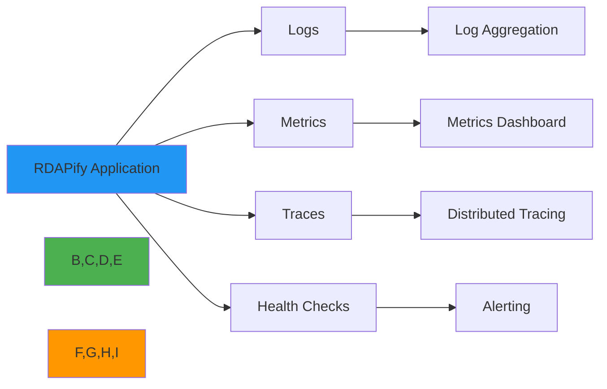

# 👁️ Observability Guide

> **🎯 Purpose:** Comprehensive guide for monitoring, logging, and tracing RDAPify applications  
> **📚 Related:** [Deployment](deployment.md) | [Performance](performance.md) | [Troubleshooting](../troubleshooting/debugging.md)  
> **⏱️ Reading Time:** 12 minutes

---

## 🌟 Observability Overview

Observability is the ability to understand the internal state of your system by examining its outputs. For RDAPify, this includes:



---

## 📝 Logging

### Structured Logging

```javascript
import { RDAPClient } from 'rdapify';
import winston from 'winston';

// Configure structured logger
const logger = winston.createLogger({
  level: process.env.LOG_LEVEL || 'info',
  format: winston.format.combine(
    winston.format.timestamp(),
    winston.format.errors({ stack: true }),
    winston.format.json()
  ),
  defaultMeta: { service: 'rdapify-app' },
  transports: [
    new winston.transports.File({ filename: 'error.log', level: 'error' }),
    new winston.transports.File({ filename: 'combined.log' }),
    new winston.transports.Console({
      format: winston.format.combine(
        winston.format.colorize(),
        winston.format.simple()
      )
    })
  ]
});

// Initialize client with logging
const client = new RDAPClient({
  logger: {
    enabled: true,
    level: 'info',
    customLogger: logger
  }
});

// Log RDAP queries
client.on('query', (event) => {
  logger.info('RDAP query initiated', {
    type: event.type,
    query: event.query,
    timestamp: event.timestamp
  });
});

client.on('response', (event) => {
  logger.info('RDAP response received', {
    type: event.type,
    query: event.query,
    duration: event.duration,
    cached: event.cached,
    statusCode: event.statusCode
  });
});

client.on('error', (event) => {
  logger.error('RDAP query failed', {
    type: event.type,
    query: event.query,
    error: event.error.message,
    stack: event.error.stack
  });
});
```

### Log Levels

| Level | Usage | Example |
|-------|-------|---------|
| **error** | System errors, failures | Failed RDAP queries, connection errors |
| **warn** | Warnings, degraded performance | Rate limiting, cache misses |
| **info** | General information | Successful queries, cache hits |
| **debug** | Detailed debugging | Request/response details |
| **trace** | Very detailed tracing | Internal state changes |

---

## 📊 Metrics

### Prometheus Integration

```javascript
import { RDAPClient } from 'rdapify';
import { register, Counter, Histogram, Gauge } from 'prom-client';

// Define metrics
const rdapQueriesTotal = new Counter({
  name: 'rdap_queries_total',
  help: 'Total number of RDAP queries',
  labelNames: ['type', 'status']
});

const rdapQueryDuration = new Histogram({
  name: 'rdap_query_duration_seconds',
  help: 'RDAP query duration in seconds',
  labelNames: ['type'],
  buckets: [0.1, 0.5, 1, 2, 5]
});

const rdapCacheHitRate = new Gauge({
  name: 'rdap_cache_hit_rate',
  help: 'RDAP cache hit rate'
});

const rdapActiveConnections = new Gauge({
  name: 'rdap_active_connections',
  help: 'Number of active RDAP connections'
});

// Initialize client with metrics
const client = new RDAPClient({
  metrics: {
    enabled: true,
    provider: 'prometheus'
  }
});

// Track metrics
client.on('query', (event) => {
  rdapActiveConnections.inc();
  rdapQueriesTotal.inc({ type: event.type, status: 'started' });
});

client.on('response', (event) => {
  rdapActiveConnections.dec();
  rdapQueriesTotal.inc({ type: event.type, status: 'success' });
  rdapQueryDuration.observe({ type: event.type }, event.duration / 1000);
  
  if (event.cached) {
    rdapCacheHitRate.set(event.cacheHitRate);
  }
});

client.on('error', (event) => {
  rdapActiveConnections.dec();
  rdapQueriesTotal.inc({ type: event.type, status: 'error' });
});

// Expose metrics endpoint
import express from 'express';
const app = express();

app.get('/metrics', async (req, res) => {
  res.set('Content-Type', register.contentType);
  res.end(await register.metrics());
});

app.listen(9090);
```

### Key Metrics to Monitor

| Metric | Type | Description | Alert Threshold |
|--------|------|-------------|-----------------|
| **rdap_queries_total** | Counter | Total queries | - |
| **rdap_query_duration** | Histogram | Query latency | p95 > 2s |
| **rdap_cache_hit_rate** | Gauge | Cache effectiveness | < 70% |
| **rdap_error_rate** | Counter | Error frequency | > 5% |
| **rdap_active_connections** | Gauge | Concurrent requests | > 100 |
| **rdap_rate_limit_hits** | Counter | Rate limit violations | > 10/min |

---

## 🔍 Distributed Tracing

### OpenTelemetry Integration

```javascript
import { RDAPClient } from 'rdapify';
import { NodeTracerProvider } from '@opentelemetry/sdk-trace-node';
import { registerInstrumentations } from '@opentelemetry/instrumentation';
import { HttpInstrumentation } from '@opentelemetry/instrumentation-http';
import { JaegerExporter } from '@opentelemetry/exporter-jaeger';
import { Resource } from '@opentelemetry/resources';
import { SemanticResourceAttributes } from '@opentelemetry/semantic-conventions';

// Configure tracer
const provider = new NodeTracerProvider({
  resource: new Resource({
    [SemanticResourceAttributes.SERVICE_NAME]: 'rdapify-app',
  }),
});

const exporter = new JaegerExporter({
  endpoint: 'http://localhost:14268/api/traces',
});

provider.addSpanProcessor(
  new BatchSpanProcessor(exporter)
);

provider.register();

// Register instrumentations
registerInstrumentations({
  instrumentations: [
    new HttpInstrumentation(),
  ],
});

// Initialize client with tracing
const client = new RDAPClient({
  tracing: {
    enabled: true,
    provider: 'opentelemetry',
    serviceName: 'rdapify-app'
  }
});

// Traces will automatically include:
// - Query type (domain/IP/ASN)
// - Query value
// - Registry used
// - Cache hit/miss
// - Response time
// - Error details
```

### Trace Visualization

```
Trace: RDAP Domain Query
├─ rdapify.query [2.3s]
│  ├─ cache.lookup [0.1s] ❌ MISS
│  ├─ registry.discover [0.2s] ✅ SUCCESS
│  ├─ http.request [1.8s]
│  │  ├─ dns.resolve [0.1s]
│  │  ├─ tcp.connect [0.2s]
│  │  ├─ tls.handshake [0.3s]
│  │  └─ http.transfer [1.2s]
│  ├─ response.normalize [0.1s]
│  └─ cache.store [0.1s] ✅ SUCCESS
```

---

## 🏥 Health Checks

### Comprehensive Health Endpoint

```javascript
import { RDAPClient } from 'rdapify';

const client = new RDAPClient();

export async function healthCheck() {
  const health = {
    status: 'healthy',
    timestamp: new Date().toISOString(),
    uptime: process.uptime(),
    version: process.env.APP_VERSION,
    checks: {}
  };
  
  // Check RDAP connectivity
  try {
    const start = Date.now();
    await client.domain('example.com');
    health.checks.rdap = {
      status: 'healthy',
      responseTime: Date.now() - start
    };
  } catch (error) {
    health.checks.rdap = {
      status: 'unhealthy',
      error: error.message
    };
    health.status = 'degraded';
  }
  
  // Check cache
  try {
    await cacheClient.ping();
    health.checks.cache = {
      status: 'healthy',
      hitRate: await cacheClient.getHitRate()
    };
  } catch (error) {
    health.checks.cache = {
      status: 'unhealthy',
      error: error.message
    };
    health.status = 'degraded';
  }
  
  // Check memory
  const memUsage = process.memoryUsage();
  health.checks.memory = {
    status: memUsage.heapUsed < memUsage.heapTotal * 0.9 ? 'healthy' : 'warning',
    heapUsed: Math.round(memUsage.heapUsed / 1024 / 1024) + 'MB',
    heapTotal: Math.round(memUsage.heapTotal / 1024 / 1024) + 'MB'
  };
  
  return health;
}

// Liveness probe (is the app running?)
export function livenessCheck() {
  return { status: 'alive', timestamp: new Date().toISOString() };
}

// Readiness probe (is the app ready to serve traffic?)
export async function readinessCheck() {
  try {
    await client.domain('example.com');
    return { status: 'ready', timestamp: new Date().toISOString() };
  } catch (error) {
    return { 
      status: 'not_ready', 
      error: error.message,
      timestamp: new Date().toISOString() 
    };
  }
}
```

---

## 🚨 Alerting

### Alert Rules

```yaml
# prometheus-alerts.yml
groups:
  - name: rdapify_alerts
    interval: 30s
    rules:
      - alert: HighErrorRate
        expr: rate(rdap_queries_total{status="error"}[5m]) > 0.05
        for: 5m
        labels:
          severity: warning
        annotations:
          summary: "High RDAP error rate"
          description: "Error rate is {{ $value | humanizePercentage }}"
      
      - alert: SlowQueries
        expr: histogram_quantile(0.95, rdap_query_duration_seconds) > 2
        for: 5m
        labels:
          severity: warning
        annotations:
          summary: "Slow RDAP queries"
          description: "95th percentile latency is {{ $value }}s"
      
      - alert: LowCacheHitRate
        expr: rdap_cache_hit_rate < 0.7
        for: 10m
        labels:
          severity: info
        annotations:
          summary: "Low cache hit rate"
          description: "Cache hit rate is {{ $value | humanizePercentage }}"
      
      - alert: ServiceDown
        expr: up{job="rdapify"} == 0
        for: 1m
        labels:
          severity: critical
        annotations:
          summary: "RDAPify service is down"
          description: "Service has been down for more than 1 minute"
```

### Alert Notification

```javascript
import { RDAPClient } from 'rdapify';
import axios from 'axios';

const client = new RDAPClient();

// Monitor error rate
let errorCount = 0;
let totalCount = 0;

client.on('response', () => {
  totalCount++;
});

client.on('error', async (event) => {
  errorCount++;
  
  const errorRate = errorCount / totalCount;
  
  if (errorRate > 0.05) {
    await sendAlert({
      severity: 'warning',
      title: 'High RDAP Error Rate',
      message: `Error rate: ${(errorRate * 100).toFixed(2)}%`,
      details: {
        errorCount,
        totalCount,
        lastError: event.error.message
      }
    });
  }
});

async function sendAlert(alert) {
  // Send to Slack
  await axios.post(process.env.SLACK_WEBHOOK, {
    text: `🚨 ${alert.title}`,
    attachments: [{
      color: alert.severity === 'critical' ? 'danger' : 'warning',
      fields: [
        { title: 'Message', value: alert.message },
        { title: 'Details', value: JSON.stringify(alert.details, null, 2) }
      ]
    }]
  });
  
  // Send to PagerDuty for critical alerts
  if (alert.severity === 'critical') {
    await axios.post('https://events.pagerduty.com/v2/enqueue', {
      routing_key: process.env.PAGERDUTY_KEY,
      event_action: 'trigger',
      payload: {
        summary: alert.title,
        severity: alert.severity,
        source: 'rdapify-app',
        custom_details: alert.details
      }
    });
  }
}
```

---

## 📈 Dashboards

### Grafana Dashboard

```json
{
  "dashboard": {
    "title": "RDAPify Monitoring",
    "panels": [
      {
        "title": "Query Rate",
        "targets": [{
          "expr": "rate(rdap_queries_total[5m])"
        }]
      },
      {
        "title": "Error Rate",
        "targets": [{
          "expr": "rate(rdap_queries_total{status=\"error\"}[5m])"
        }]
      },
      {
        "title": "Query Duration (p95)",
        "targets": [{
          "expr": "histogram_quantile(0.95, rdap_query_duration_seconds)"
        }]
      },
      {
        "title": "Cache Hit Rate",
        "targets": [{
          "expr": "rdap_cache_hit_rate"
        }]
      }
    ]
  }
}
```

---

## 🔧 Performance Profiling

### CPU Profiling

```javascript
import { RDAPClient } from 'rdapify';
import v8Profiler from 'v8-profiler-next';

const client = new RDAPClient();

// Start CPU profiling
v8Profiler.startProfiling('rdapify-profile', true);

// Run workload
async function runWorkload() {
  const domains = ['example.com', 'google.com', 'github.com'];
  
  for (const domain of domains) {
    await client.domain(domain);
  }
}

await runWorkload();

// Stop profiling and save
const profile = v8Profiler.stopProfiling('rdapify-profile');
profile.export((error, result) => {
  fs.writeFileSync('rdapify-profile.cpuprofile', result);
  profile.delete();
});
```

### Memory Profiling

```javascript
import { RDAPClient } from 'rdapify';

const client = new RDAPClient();

// Take heap snapshot
function takeHeapSnapshot() {
  const snapshot = v8.writeHeapSnapshot();
  console.log('Heap snapshot written to:', snapshot);
}

// Monitor memory usage
setInterval(() => {
  const usage = process.memoryUsage();
  console.log({
    rss: Math.round(usage.rss / 1024 / 1024) + 'MB',
    heapTotal: Math.round(usage.heapTotal / 1024 / 1024) + 'MB',
    heapUsed: Math.round(usage.heapUsed / 1024 / 1024) + 'MB',
    external: Math.round(usage.external / 1024 / 1024) + 'MB'
  });
  
  // Take snapshot if memory usage is high
  if (usage.heapUsed > usage.heapTotal * 0.9) {
    takeHeapSnapshot();
  }
}, 60000);
```

---

## 📚 Additional Resources

- [Deployment Guide](deployment.md)
- [Performance Optimization](performance.md)
- [Troubleshooting](../troubleshooting/debugging.md)
- [Monitoring Integration](../integrations/monitoring/)
- [Prometheus Configuration](../../templates/monitoring/prometheus_config.yaml)
- [Grafana Dashboard](../../templates/monitoring/grafana_dashboard.json)

---

**Need help with observability?** Check our [support guide](../support/getting_help.md).
