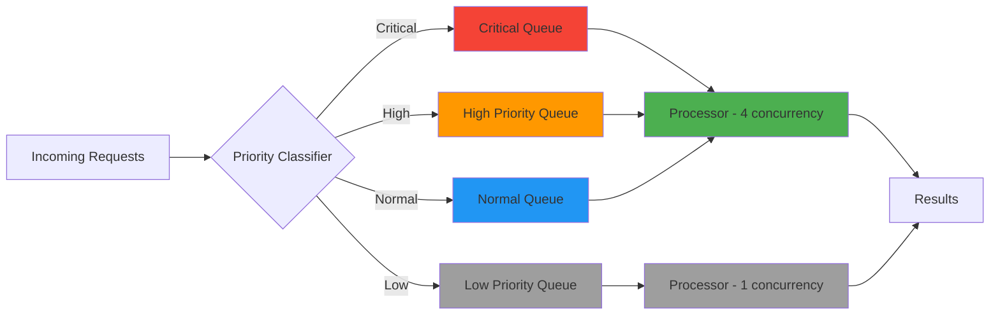

# ⚡ Priority Queue System Guide

> **🎯 Purpose:** Comprehensive guide to implementing priority queue systems for RDAPify to optimize query processing under resource constraints  
> **📚 Related:** [Rate Limiting](rate-limiting.md) | [Batch Processing](batch-processing.md) | [Performance Optimization](performance.md)  
> **⏱️ Reading Time:** 7 minutes  
> **🔍 Pro Tip:** Use the [Priority Queue Simulator](../../playground/priority-simulator.md) to model different prioritization strategies for your specific workload patterns

---

## 🌐 Why Priority Queues Matter for RDAP

RDAP (Registration Data Access Protocol) environments operate under strict constraints—registry rate limits, network latency variations, and varying business criticality of queries. Priority queues ensure that critical operations receive timely processing while maintaining overall system stability.



**Key Benefits of Priority Queues:**
- ✅ **Business-Critical Protection**: Security monitoring and fraud detection queries processed first
- ✅ **Resource Optimization**: Maximize throughput within registry rate limits
- ✅ **Fair Resource Allocation**: Prevent single user/workflow from monopolizing resources
- ✅ **Graceful Degradation**: Maintain critical operations during registry outages
- ✅ **Regulatory Compliance**: Ensure time-sensitive compliance checks are processed

---

## ⚙️ Core Implementation Patterns

### 1. Multi-Level Priority Queue System
```typescript
type PriorityLevel = 'critical' | 'high' | 'normal' | 'low';
const PRIORITY_LEVELS: PriorityLevel[] = ['critical', 'high', 'normal', 'low'];

interface QueueMetrics {
  size: number;
  processingTime: number;
  successRate: number;
  oldestItemAge: number;
}

class PrioritizedRDAPClient {
  private queues = {
    critical: new Queue<DomainRequest>(),
    high: new Queue<DomainRequest>(),
    normal: new Queue<DomainRequest>(),
    low: new Queue<DomainRequest>()
  };
  
  private metrics: Record<PriorityLevel, QueueMetrics> = {
    critical: { size: 0, processingTime: 0, successRate: 1.0, oldestItemAge: 0 },
    high: { size: 0, processingTime: 0, successRate: 1.0, oldestItemAge: 0 },
    normal: { size: 0, processingTime: 0, successRate: 1.0, oldestItemAge: 0 },
    low: { size: 0, processingTime: 0, successRate: 1.0, oldestItemAge: 0 }
  };
  
  private processorStates = {
    critical: { active: 0, max: 4, backoff: false },
    high: { active: 0, max: 2, backoff: false },
    normal: { active: 0, max: 1, backoff: false },
    low: { active: 0, max: 1, backoff: false }
  };
  
  private isProcessing = false;
  
  constructor(private client: RDAPClient) {}
  
  async enqueueRequest(domain: string, priority: PriorityLevel = 'normal'): Promise<void> {
    const request: DomainRequest = {
      domain,
      priority,
      createdAt: Date.now(),
      attempts: 0
    };
    
    this.queues[priority].enqueue(request);
    this.updateMetrics(priority);
    await this.processQueues();
  }
  
  private async processQueues(): Promise<void> {
    if (this.isProcessing) return;
    this.isProcessing = true;
    
    try {
      // Process queues in priority order
      for (const priority of PRIORITY_LEVELS) {
        const queue = this.queues[priority];
        const state = this.processorStates[priority];
        
        if (state.backoff) continue;
        
        while (queue.size() > 0 && state.active < state.max) {
          const request = queue.dequeue();
          if (request) {
            state.active++;
            this.processRequest(request, priority)
              .finally(() => {
                state.active--;
                this.updateMetrics(priority);
              });
          }
        }
      }
      
      // Schedule next processing cycle
      if (this.hasWork()) {
        setTimeout(() => this.processQueues(), 50);
      }
    } finally {
      this.isProcessing = false;
    }
  }
  
  private async processRequest(request: DomainRequest, priority: PriorityLevel): Promise<void> {
    try {
      const result = await this.client.domain(request.domain, {
        priority,
        timeout: this.getTimeoutForPriority(priority)
      });
      
      // Handle successful request
      this.emit('success', { domain: request.domain, result, priority });
    } catch (error) {
      request.attempts++;
      
      if (request.attempts < this.getMaxRetries(priority) && this.isRetryableError(error)) {
        // Requeue with backoff
        setTimeout(() => {
          this.queues[priority].enqueue(request);
          this.updateMetrics(priority);
        }, this.calculateBackoff(request.attempts, priority));
      } else {
        // Final failure
        this.emit('failure', { 
          domain: request.domain, 
          error, 
          attempts: request.attempts,
          priority
        });
        
        // Adjust processor state on repeated failures
        if (request.attempts >= this.getMaxRetries(priority)) {
          this.processorStates[priority].backoff = true;
          setTimeout(() => {
            this.processorStates[priority].backoff = false;
          }, 30000); // 30 second cooldown
        }
      }
    }
  }
  
  private getTimeoutForPriority(priority: PriorityLevel): number {
    const timeouts = {
      critical: 10000, // 10 seconds
      high: 8000,     // 8 seconds
      normal: 5000,   // 5 seconds
      low: 3000       // 3 seconds
    };
    return timeouts[priority];
  }
  
  private getMaxRetries(priority: PriorityLevel): number {
    const retries = {
      critical: 3,
      high: 2,
      normal: 1,
      low: 1
    };
    return retries[priority];
  }
  
  private isRetryableError(error: Error): boolean {
    return ['RDAP_TIMEOUT', 'RDAP_RATE_LIMITED', 'RDAP_REGISTRY_UNAVAILABLE'].includes(error.code);
  }
  
  private calculateBackoff(attempts: number, priority: PriorityLevel): number {
    const baseDelays = {
      critical: 1000,
      high: 2000,
      normal: 3000,
      low: 5000
    };
    
    return Math.min(30000, baseDelays[priority] * Math.pow(2, attempts - 1));
  }
}
```

### 2. Context-Aware Priority Classification
```typescript
class PriorityClassifier {
  private static CRITICAL_DOMAINS = [
    '.bank', '.gov', '.mil', '.fed', '.nato',
    'icann.org', 'iana.org', 'arin.net', 'ripe.net'
  ];
  
  private static HIGH_PRIORITY_ORGS = [
    'google', 'microsoft', 'apple', 'amazon', 'facebook',
    'paypal', 'stripe', 'square', 'coinbase'
  ];
  
  classifyRequest(request: RequestContext): PriorityLevel {
    // Critical security contexts always get highest priority
    if (request.context.security === 'critical' || 
        request.context.impact === 'immediate') {
      return 'critical';
    }
    
    // Critical domain patterns
    if (this.isCriticalDomain(request.domain)) {
      return 'critical';
    }
    
    // Security monitoring with legitimate interest
    if (request.context.purpose === 'security-monitoring' &&
        request.context.legalBasis === 'legitimate-interest') {
      return 'high';
    }
    
    // High-traffic or high-value domains
    if (this.isHighPriorityDomain(request.domain)) {
      return 'high';
    }
    
    // Background processing
    if (request.context.type === 'background' || 
        request.context.purpose === 'analytics') {
      return 'low';
    }
    
    return 'normal';
  }
  
  private isCriticalDomain(domain: string): boolean {
    return PriorityClassifier.CRITICAL_DOMAINS.some(pattern => 
      domain.endsWith(pattern) || domain.includes(pattern)
    );
  }
  
  private isHighPriorityDomain(domain: string): boolean {
    const orgName = domain.split('.')[0].toLowerCase();
    return PriorityClassifier.HIGH_PRIORITY_ORGS.some(org => 
      orgName.includes(org) || domain.includes(org)
    );
  }
}

// Usage with RDAP client
const classifier = new PriorityClassifier();
const priority = classifier.classifyRequest({
  domain: 'paypal.com',
  context: {
    purpose: 'security-monitoring',
    legalBasis: 'legitimate-interest',
    security: 'high',
    impact: 'financial'
  }
});

console.log(priority); // 'high'
```

### 3. Weighted Fair Queuing Implementation
```typescript
class WeightedFairQueueProcessor {
  private weights = {
    critical: 10,
    high: 5,
    normal: 2,
    low: 1
  };
  
  private credits = {
    critical: 0,
    high: 0,
    normal: 0,
    low: 0
  };
  
  async processFairQueue(): Promise<void> {
    while (this.hasWork()) {
      // Replenish credits based on weights
      PRIORITY_LEVELS.forEach(level => {
        this.credits[level] += this.weights[level];
      });
      
      // Find queue with highest credits that has work
      let selectedQueue: PriorityLevel | null = null;
      let maxCredits = -1;
      
      PRIORITY_LEVELS.forEach(level => {
        if (this.queues[level].size() > 0 && this.credits[level] > maxCredits) {
          maxCredits = this.credits[level];
          selectedQueue = level;
        }
      });
      
      if (selectedQueue) {
        // Process one item from selected queue
        const request = this.queues[selectedQueue].dequeue();
        if (request) {
          this.credits[selectedQueue] -= this.weights[selectedQueue];
          await this.processRequest(request, selectedQueue);
        }
      }
      
      // Small delay to prevent CPU spin
      await new Promise(resolve => setTimeout(resolve, 10));
    }
  }
  
  private async processRequest(request: DomainRequest, priority: PriorityLevel): Promise<void> {
    // Implementation similar to previous examples
    try {
      const result = await this.client.domain(request.domain, { priority });
      this.emit('success', { domain: request.domain, result, priority });
    } catch (error) {
      // Handle errors with retry logic
      this.handleError(request, priority, error);
    }
  }
}
```

---

## 🔐 Security & Compliance Considerations

### Priority Starvation Prevention
```typescript
class SecurityAwarePriorityQueue {
  private readonly starvationProtection = {
    maxContinuousCritical: 50,    // Max critical requests before processing other levels
    maxQueueAge: {
      high: 30000,    // 30 seconds
      normal: 60000,  // 60 seconds
      low: 120000     // 120 seconds
    }
  };
  
  private criticalCount = 0;
  private queueAges = {
    high: Date.now(),
    normal: Date.now(),
    low: Date.now()
  };
  
  async processWithProtection(): Promise<void> {
    while (this.hasWork()) {
      // Check for priority starvation
      if (this.shouldForceLowerPriority()) {
        await this.processStarvationPrevention();
        continue;
      }
      
      // Normal priority processing
      await this.processNormalPriority();
      
      // Update starvation protection counters
      this.updateStarvationCounters();
    }
  }
  
  private shouldForceLowerPriority(): boolean {
    // Too many continuous critical requests
    if (this.criticalCount > this.starvationProtection.maxContinuousCritical) {
      return true;
    }
    
    // Check age-based starvation
    const now = Date.now();
    if (this.queues.high.size() > 0 && 
        now - this.queueAges.high > this.starvationProtection.maxQueueAge.high) {
      return true;
    }
    
    if (this.queues.normal.size() > 0 && 
        now - this.queueAges.normal > this.starvationProtection.maxQueueAge.normal) {
      return true;
    }
    
    return false;
  }
  
  private async processStarvationPrevention(): Promise<void> {
    // Process oldest high priority request
    if (this.queues.high.size() > 0) {
      const request = this.getOldestRequest(this.queues.high);
      await this.processRequest(request, 'high');
      this.queueAges.high = Date.now();
      return;
    }
    
    // Process oldest normal priority request
    if (this.queues.normal.size() > 0) {
      const request = this.getOldestRequest(this.queues.normal);
      await this.processRequest(request, 'normal');
      this.queueAges.normal = Date.now();
      return;
    }
    
    // Process oldest low priority request
    if (this.queues.low.size() > 0) {
      const request = this.getOldestRequest(this.queues.low);
      await this.processRequest(request, 'low');
      this.queueAges.low = Date.now();
    }
  }
  
  private updateStarvationCounters(): void {
    // Reset critical counter when processing non-critical
    const hasNonCritical = this.queues.high.size() > 0 || 
                          this.queues.normal.size() > 0 || 
                          this.queues.low.size() > 0;
    
    if (hasNonCritical) {
      this.criticalCount = 0;
    } else {
      this.criticalCount++;
    }
  }
}
```

### Compliance-Aware Prioritization
```typescript
const compliancePrioritizer = new RDAPClient({
  queueOptions: {
    compliance: {
      gdprArticle15: { // Right of access
        priority: 'high',
        maxProcessingTime: 30000 // 30 seconds
      },
      gdprArticle17: { // Right to erasure
        priority: 'critical',
        maxProcessingTime: 5000, // 5 seconds
        autoAudit: true
      },
      ccpaSection1798105: { // Right to delete
        priority: 'critical',
        maxProcessingTime: 5000
      },
      regulatoryReporting: {
        priority: 'high',
        maxProcessingTime: 60000 // 60 seconds
      }
    }
  }
});

// Automatic compliance prioritization
async function handleDataSubjectRequest(request: DataSubjectRequest) {
  const startTime = Date.now();
  
  try {
    // Compliance requests automatically classified
    const result = await compliancePrioritizer.domain(request.identifier, {
      complianceContext: {
        requestType: request.type,
        legalBasis: request.legalBasis,
        jurisdiction: request.jurisdiction
      }
    });
    
    // Verify SLA compliance
    const processingTime = Date.now() - startTime;
    const maxTime = compliancePrioritizer.getMaxTimeForRequest(request);
    
    if (processingTime > maxTime) {
      await complianceLogger.logViolation({
        requestType: request.type,
        actualTime: processingTime,
        maxTime,
        identifier: request.identifier
      });
    }
    
    return result;
  } catch (error) {
    // Ensure compliance requests are logged even on failure
    await complianceLogger.logFailure({
      requestType: request.type,
      error: error.message,
      identifier: request.identifier,
      processingTime: Date.now() - startTime
    });
    throw error;
  }
}
```

---

## ⚡ Performance Optimization Techniques

### Adaptive Concurrency Control
```typescript
class AdaptivePriorityProcessor {
  private concurrency = {
    critical: 4,
    high: 2,
    normal: 1,
    low: 1
  };
  
  private performanceMetrics = {
    critical: { latency: 0, errorRate: 0, lastAdjustment: 0 },
    high: { latency: 0, errorRate: 0, lastAdjustment: 0 },
    normal: { latency: 0, errorRate: 0, lastAdjustment: 0 },
    low: { latency: 0, errorRate: 0, lastAdjustment: 0 }
  };
  
  async adjustConcurrency(priority: PriorityLevel, metrics: PerformanceMetrics): Promise<void> {
    const now = Date.now();
    const timeSinceLastAdjustment = now - this.performanceMetrics[priority].lastAdjustment;
    
    // Don't adjust too frequently (minimum 5 seconds between adjustments)
    if (timeSinceLastAdjustment < 5000) return;
    
    const currentConcurrency = this.concurrency[priority];
    const currentLatency = this.performanceMetrics[priority].latency;
    const currentErrorRate = this.performanceMetrics[priority].errorRate;
    
    if (metrics.errorRate > 0.2 && currentConcurrency > 1) {
      // High error rate - reduce concurrency
      this.concurrency[priority] = Math.max(1, Math.floor(currentConcurrency * 0.7));
      console.log(`Reduced ${priority} concurrency to ${this.concurrency[priority]} (error rate: ${metrics.errorRate})`);
    } 
    else if (metrics.latency < currentLatency * 0.8 && currentConcurrency < 10) {
      // Improving latency - increase concurrency
      this.concurrency[priority] = Math.min(10, Math.floor(currentConcurrency * 1.3));
      console.log(`Increased ${priority} concurrency to ${this.concurrency[priority]} (latency improved)`);
    }
    
    // Update metrics
    this.performanceMetrics[priority] = {
      latency: metrics.latency,
      errorRate: metrics.errorRate,
      lastAdjustment: now
    };
  }
  
  private getPerformanceMetrics(priority: PriorityLevel): PerformanceMetrics {
    // Implementation to calculate metrics from recent requests
    return {
      latency: this.calculateAverageLatency(priority),
      errorRate: this.calculateErrorRate(priority),
      throughput: this.calculateThroughput(priority)
    };
  }
}
```

### Priority-Aware Caching
```typescript
class PriorityAwareCache {
  private readonly cachePriorities = {
    critical: { maxAge: 3600, refreshStrategy: 'stale-while-revalidate' },   // 1 hour
    high: { maxAge: 1800, refreshStrategy: 'stale-while-revalidate' },      // 30 minutes
    normal: { maxAge: 600, refreshStrategy: 'cache-only' },                 // 10 minutes
    low: { maxAge: 300, refreshStrategy: 'no-cache' }                       // 5 minutes
  };
  
  async getCachedResponse(domain: string, priority: PriorityLevel): Promise<DomainResponse | null> {
    const cacheKey = `domain:${domain}:${priority}`;
    const cached = await this.cache.get<DomainResponse>(cacheKey);
    
    if (!cached) return null;
    
    const policy = this.cachePriorities[priority];
    const age = Date.now() - cached._metadata.cachedAt;
    
    // For critical/high priority, allow stale data with background refresh
    if (age > policy.maxAge * 1000) {
      if (policy.refreshStrategy === 'stale-while-revalidate') {
        // Return stale data but trigger background refresh
        this.refreshInBackground(domain, priority);
        return cached;
      }
      return null; // Expired and no stale-while-revalidate
    }
    
    return cached;
  }
  
  private async refreshInBackground(domain: string, priority: PriorityLevel): Promise<void> {
    // Use lower priority for background refresh to avoid affecting foreground requests
    const refreshPriority = priority === 'critical' ? 'high' : 'normal';
    
    try {
      const result = await this.client.domain(domain, { priority: refreshPriority });
      const cacheKey = `domain:${domain}:${priority}`;
      await this.cache.set(cacheKey, result, { ttl: this.cachePriorities[priority].maxAge });
    } catch (error) {
      console.warn(`Background refresh failed for ${domain}:`, error.message);
    }
  }
  
  async setCache(domain: string, priority: PriorityLevel, response: DomainResponse): Promise<void> {
    const cacheKey = `domain:${domain}:${priority}`;
    const ttl = this.cachePriorities[priority].maxAge;
    await this.cache.set(cacheKey, {
      ...response,
      _metadata: {
        ...response._metadata,
        cachedAt: Date.now(),
        priority,
        ttl
      }
    }, { ttl });
  }
}
```

---

## 🌍 Advanced Enterprise Patterns

### 1. Cross-Registry Priority Coordination
```typescript
class RegistryPriorityCoordinator {
  private readonly registryLimits = {
    'verisign.com': { critical: 4, high: 2, normal: 1, low: 1 },
    'arin.net': { critical: 2, high: 2, normal: 1, low: 0 },
    'ripe.net': { critical: 3, high: 3, normal: 2, low: 1 },
    'apnic.net': { critical: 2, high: 2, normal: 1, low: 1 }
  };
  
  private registryState = new Map<string, {
    activeRequests: Record<PriorityLevel, number>;
    backoffUntil: number;
  }>();
  
  constructor() {
    // Initialize registry state
    Object.keys(this.registryLimits).forEach(registry => {
      this.registryState.set(registry, {
        activeRequests: { critical: 0, high: 0, normal: 0, low: 0 },
        backoffUntil: 0
      });
    });
  }
  
  async canProcessRequest(registry: string, priority: PriorityLevel): Promise<boolean> {
    const state = this.registryState.get(registry);
    if (!state) return true; // Unknown registry, allow by default
    
    // Check if registry is in backoff
    if (Date.now() < state.backoffUntil) {
      return priority === 'critical'; // Only critical requests allowed during backoff
    }
    
    const limits = this.registryLimits[registry];
    if (!limits) return true;
    
    const active = state.activeRequests[priority];
    const limit = limits[priority];
    
    return active < limit;
  }
  
  claimRegistrySlot(registry: string, priority: PriorityLevel): void {
    const state = this.registryState.get(registry);
    if (state) {
      state.activeRequests[priority]++;
    }
  }
  
  releaseRegistrySlot(registry: string, priority: PriorityLevel): void {
    const state = this.registryState.get(registry);
    if (state && state.activeRequests[priority] > 0) {
      state.activeRequests[priority]--;
    }
  }
  
  handleRegistryError(registry: string, error: Error): void {
    const state = this.registryState.get(registry);
    if (state) {
      // Apply exponential backoff based on error type
      let backoffTime = 1000; // 1 second base
      
      if (error.code === 'RDAP_RATE_LIMITED') {
        backoffTime = 5000; // 5 seconds for rate limiting
      } else if (error.code === 'RDAP_REGISTRY_UNAVAILABLE') {
        backoffTime = 30000; // 30 seconds for registry down
      }
      
      // Exponential backoff with jitter
      const jitter = Math.random() * 0.3 - 0.15; // -15% to +15% jitter
      state.backoffUntil = Date.now() + backoffTime * (1 + jitter);
      
      console.warn(`Registry ${registry} in backoff until ${new Date(state.backoffUntil).toISOString()}`);
    }
  }
}
```

### 2. Multi-Tenant Priority Isolation
```typescript
class MultiTenantPrioritySystem {
  private tenantQuotas = new Map<string, {
    maxConcurrent: number;
    priorities: Record<PriorityLevel, number>;
    rateLimit: { requests: number; window: number };
  }>();
  
  private tenantUsage = new Map<string, {
    activeRequests: number;
    requestCounts: Record<number, number>;
    lastReset: number;
  }>();
  
  constructor() {
    // Default tenant quotas
    this.setDefaultQuotas();
  }
  
  setTenantQuotas(tenantId: string, quotas: TenantQuotas): void {
    this.tenantQuotas.set(tenantId, {
      maxConcurrent: quotas.maxConcurrent || 5,
      priorities: {
        critical: quotas.priorities?.critical || 1,
        high: quotas.priorities?.high || 2,
        normal: quotas.priorities?.normal || 3,
        low: quotas.priorities?.low || 4
      },
      rateLimit: {
        requests: quotas.rateLimit?.requests || 100,
        window: quotas.rateLimit?.window || 60000 // 60 seconds
      }
    });
    
    this.tenantUsage.set(tenantId, {
      activeRequests: 0,
      requestCounts: {},
      lastReset: Date.now()
    });
  }
  
  async canProcessRequest(tenantId: string, priority: PriorityLevel): Promise<boolean> {
    const quotas = this.tenantQuotas.get(tenantId) || this.getDefaultQuotas();
    const usage = this.tenantUsage.get(tenantId);
    
    if (!usage) {
      this.tenantUsage.set(tenantId, {
        activeRequests: 0,
        requestCounts: {},
        lastReset: Date.now()
      });
      return true;
    }
    
    // Check concurrency limits
    if (usage.activeRequests >= quotas.maxConcurrent) {
      return false;
    }
    
    // Check priority limits
    const priorityCount = this.getPriorityCount(tenantId, priority);
    if (priorityCount >= quotas.priorities[priority]) {
      return false;
    }
    
    // Check rate limits
    if (!this.checkRateLimit(tenantId, quotas.rateLimit)) {
      return false;
    }
    
    return true;
  }
  
  claimTenantSlot(tenantId: string, priority: PriorityLevel): void {
    const usage = this.tenantUsage.get(tenantId);
    if (usage) {
      usage.activeRequests++;
      this.incrementPriorityCount(tenantId, priority);
    }
  }
  
  releaseTenantSlot(tenantId: string, priority: PriorityLevel): void {
    const usage = this.tenantUsage.get(tenantId);
    if (usage && usage.activeRequests > 0) {
      usage.activeRequests--;
      this.decrementPriorityCount(tenantId, priority);
    }
  }
  
  private checkRateLimit(tenantId: string, rateLimit: { requests: number; window: number }): boolean {
    const usage = this.tenantUsage.get(tenantId);
    if (!usage) return true;
    
    const now = Date.now();
    const windowStart = now - rateLimit.window;
    
    // Clean up old request counts
    Object.keys(usage.requestCounts).forEach(timestamp => {
      if (parseInt(timestamp) < windowStart) {
        delete usage.requestCounts[parseInt(timestamp)];
      }
    });
    
    // Calculate current request count
    const requestCount = Object.values(usage.requestCounts).reduce((sum, count) => sum + count, 0);
    
    // Allow request if under limit
    if (requestCount < rateLimit.requests) {
      // Record this request
      usage.requestCounts[now] = (usage.requestCounts[now] || 0) + 1;
      return true;
    }
    
    return false;
  }
}
```

### 3. Real-time Priority Adjustment
```typescript
class RealTimePriorityAdjuster {
  private readonly adjustmentRules = [
    {
      condition: (metrics) => metrics.systemLoad > 0.9 && metrics.errorRate > 0.15,
      action: (request) => request.priority = 'low',
      description: 'High load + errors - deprioritize'
    },
    {
      condition: (metrics) => metrics.domain.endsWith('.bank') || metrics.domain.endsWith('.gov'),
      action: (request) => request.priority = 'critical',
      description: 'Critical domains - elevate'
    },
    {
      condition: (metrics) => metrics.securityContext === 'incident-response',
      action: (request) => request.priority = 'critical',
      description: 'Security incident - elevate'
    },
    {
      condition: (metrics) => metrics.queueDepth > 1000,
      action: (request) => {
        if (request.priority === 'low' && Math.random() > 0.5) {
          return 'drop'; // Drop 50% of low priority requests under heavy load
        }
        return request.priority;
      },
      description: 'Heavy load - drop low priority'
    }
  ];
  
  adjustRequestPriority(request: PrioritizedRequest, context: SystemContext): PriorityLevel {
    for (const rule of this.adjustmentRules) {
      if (rule.condition({ ...request.context, ...context })) {
        const result = rule.action(request);
        if (result === 'drop') {
          this.logDroppedRequest(request, rule.description);
          throw new PriorityDropError('REQUEST_DROPPED_DUE_TO_LOAD', rule.description);
        }
        return result as PriorityLevel;
      }
    }
    
    return request.priority;
  }
  
  private logDroppedRequest(request: PrioritizedRequest, reason: string): void {
    auditLogger.log('priority-drop', {
      domain: request.domain,
      originalPriority: request.priority,
      reason,
      systemLoad: systemMetrics.load,
      queueDepth: systemMetrics.queueDepth,
      timestamp: new Date().toISOString()
    });
  }
}
```

---

## 🧪 Testing Strategies

### Unit Testing Priority Logic
```typescript
describe('Priority Queue System', () => {
  let processor: PrioritizedRDAPClient;
  let mockClient: jest.Mocked<RDAPClient>;
  
  beforeEach(() => {
    mockClient = {
      domain: jest.fn(),
      ip: jest.fn(),
      asn: jest.fn(),
      on: jest.fn()
    } as any;
    
    processor = new PrioritizedRDAPClient(mockClient);
  });
  
  test('critical requests are processed before normal requests', async () => {
    // Enqueue requests in reverse order
    await processor.enqueueRequest('example-normal.com', 'normal');
    await processor.enqueueRequest('example-critical.com', 'critical');
    
    // Mock successful responses
    mockClient.domain.mockImplementation(async (domain) => ({
      domain,
      nameservers: ['ns1.example.com'],
      _metadata: { cached: false, registry: 'verisign' }
    }));
    
    // Wait for processing to complete
    await new Promise(resolve => setTimeout(resolve, 100));
    
    // Verify processing order
    const calls = mockClient.domain.mock.calls;
    expect(calls).toHaveLength(2);
    expect(calls[0][0]).toBe('example-critical.com');
    expect(calls[1][0]).toBe('example-normal.com');
  });
  
  test('priority starvation protection works', async () => {
    // Set up starvation scenario
    processor.starvationProtection.maxContinuousCritical = 2;
    
    // Enqueue many critical requests and one high priority
    for (let i = 0; i < 10; i++) {
      await processor.enqueueRequest(`critical-${i}.com`, 'critical');
    }
    await processor.enqueueRequest('important-high.com', 'high');
    
    // Mock responses
    mockClient.domain.mockImplementation(async (domain) => ({
      domain,
      nameservers: ['ns1.example.com'],
      _metadata: { cached: false, registry: 'verisign' }
    }));
    
    // Wait for processing
    await new Promise(resolve => setTimeout(resolve, 200));
    
    // Should process 2 critical, then 1 high, then remaining critical
    const calls = mockClient.domain.mock.calls;
    expect(calls).toHaveLength(11);
    expect(calls[0][0]).toBe('critical-0.com');
    expect(calls[1][0]).toBe('critical-1.com');
    expect(calls[2][0]).toBe('important-high.com'); // Starvation protection triggered
  });
  
  test('backoff works after repeated failures', async () => {
    // Mock failing responses
    mockClient.domain.mockImplementation(async () => {
      throw new RDAPError('RDAP_REGISTRY_UNAVAILABLE', 'Registry unavailable');
    });
    
    // Enqueue critical request
    await processor.enqueueRequest('failing.com', 'critical');
    
    // Wait for processing and backoff
    await new Promise(resolve => setTimeout(resolve, 100));
    
    // Verify backoff state
    expect(processor.processorStates.critical.backoff).toBe(true);
    
    // Try to enqueue another critical request
    await processor.enqueueRequest('another.com', 'critical');
    
    // Should not process due to backoff
    const calls = mockClient.domain.mock.calls;
    expect(calls).toHaveLength(1); // Only the first request was attempted
    
    // Wait for backoff period to end
    await new Promise(resolve => setTimeout(resolve, 31000));
    
    // Backoff should be cleared
    expect(processor.processorStates.critical.backoff).toBe(false);
  });
});
```

### Load Testing with Priority Mix
```bash
# Test priority queue under load
npm run benchmark -- --scenario priority-queue \
  --requests 10000 \
  --priority-mix "critical:5%,high:15%,normal:60%,low:20%" \
  --registry verisign \
  --concurrency 10

# Output includes:
# - Priority processing order verification
# - Latency by priority level (p50, p90, p99)
# - Throughput by priority level
# - Starvation protection triggers
# - Error rates by priority level
```

### Chaos Engineering Tests
```typescript
describe('Priority Queue Resilience', () => {
  test('maintains critical operations during registry failure', async () => {
    const processor = setupPriorityProcessor();
    
    // Simulate registry failure for non-critical requests
    await chaosEngine.simulateRegistryFailure('verisign.com', {
      failureType: 'timeout',
      excludeDomains: ['bank.example.com', 'gov.example.com']
    });
    
    // Critical security monitoring requests should still work
    const criticalResult = await processor.enqueueRequest('bank.example.com', 'critical');
    expect(criticalResult).toBeDefined();
    
    // Normal requests should fail or be heavily delayed
    await expect(processor.enqueueRequest('normal.example.com', 'normal'))
      .rejects.toThrow('RDAP_REGISTRY_UNAVAILABLE');
    
    // Verify priority isolation
    const metrics = processor.getQueueMetrics();
    expect(metrics.critical.successRate).toBeGreaterThan(0.95);
    expect(metrics.normal.successRate).toBeLessThan(0.1);
  });
  
  test('recovers from priority starvation attack', async () => {
    const processor = setupPriorityProcessor();
    
    // Simulate priority starvation attack
    for (let i = 0; i < 1000; i++) {
      await processor.enqueueRequest(`attacker-${i}.com`, 'critical');
    }
    
    // Legitimate high priority request
    const legitRequest = processor.enqueueRequest('important.com', 'high');
    
    // Should enforce starvation protection
    await legitRequest;
    
    const metrics = processor.getQueueMetrics();
    expect(metrics.starvationEvents).toBeGreaterThan(0);
    expect(metrics.high.processingTime).toBeLessThan(5000); // <5 seconds
  });
});
```

---

## 🔍 Monitoring & Observability

### Critical Priority Metrics
| Metric | Target | Alert Threshold | Purpose |
|--------|--------|------------------|---------|
| **Critical Queue Latency** | < 100ms | > 1000ms | Security operation responsiveness |
| **Priority Starvation Events** | 0 | > 0 | Fairness and system health |
| **Critical Success Rate** | > 99% | < 95% | System reliability for critical ops |
| **Queue Depth Ratio** | < 10:1 | > 50:1 | Critical:Low queue depth ratio |
| **Backoff Frequency** | < 1/min | > 10/min | Registry health indicator |
| **Priority Violation Rate** | 0% | > 0.1% | System integrity verification |

### Integration with Monitoring Systems
```typescript
class PriorityMonitoring {
  private readonly metricsProvider: MetricsProvider;
  
  constructor(metricsProvider: MetricsProvider) {
    this.metricsProvider = metricsProvider;
  }
  
  trackPriorityProcessing(priority: PriorityLevel, metrics: {
    latency: number;
    success: boolean;
    queueDepth: number;
    concurrency: number;
  }): void {
    this.metricsProvider.gauge(`priority.${priority}.latency_p50`, metrics.latency);
    this.metricsProvider.gauge(`priority.${priority}.queue_depth`, metrics.queueDepth);
    this.metricsProvider.gauge(`priority.${priority}.concurrency`, metrics.concurrency);
    
    if (!metrics.success) {
      this.metricsProvider.increment(`priority.${priority}.errors`);
      
      // Alert on critical errors
      if (priority === 'critical') {
        this.metricsProvider.alert('critical_priority_failure', {
          priority,
          latency: metrics.latency,
          queueDepth: metrics.queueDepth
        });
      }
    }
  }
  
  trackStarvationEvent(priority: PriorityLevel, starvedPriority: PriorityLevel): void {
    this.metricsProvider.increment(`priority_starvation_events`);
    this.metricsProvider.increment(`priority_starvation.${priority}_blocked_${starvedPriority}`);
    
    // High-severity alert for starvation of critical requests
    if (starvedPriority === 'critical') {
      this.metricsProvider.alert('critical_starvation', {
        blockingPriority: priority,
        starvedRequests: this.getQueueSize(starvedPriority)
      });
    }
  }
  
  generatePriorityReport(): PriorityReport {
    return {
      timestamp: new Date().toISOString(),
      snapshot: {
        queues: Object.fromEntries(
          PRIORITY_LEVELS.map(level => [level, this.getQueueMetrics(level)])
        ),
        processorStates: this.getProcessorStates(),
        systemHealth: this.getSystemHealth()
      },
      trends: {
        latencyTrend: this.getLatencyTrend(),
        errorRateTrend: this.getErrorRateTrend()
      },
      recommendations: this.generateRecommendations()
    };
  }
}
```

### Priority Health Dashboard
```markdown
# RDAP Priority Queue Health Dashboard

## 📊 Queue Status
| Priority | Queue Size | Active | Avg Latency | Success Rate | Oldest Item |
|----------|------------|--------|-------------|--------------|------------|
| Critical | 3 | 2/4 | 45ms | 100% | 120ms |
| High     | 12 | 1/2 | 120ms | 98% | 2.4s |
| Normal   | 45 | 1/1 | 210ms | 95% | 8.7s |
| Low      | 120 | 0/1 | N/A | N/A | 45.2s |

## 🚨 Active Alerts
- ⚠️ **High queue depth**: Normal queue at 45 items (threshold: 30)
- ⚠️ **Low priority starvation**: Low queue not processed for 45s
- ✅ All other priorities healthy

## 📈 Trends (5 minute window)
- **Critical latency**: Stable at 45±5ms
- **High success rate**: Improved from 92% to 98%
- **Queue depth ratio**: 40:1 (Low:Critical) - approaching threshold

## 🔄 Recent Priority Adjustments
- 2023-11-28 14:23:15: Reduced normal concurrency from 2 to 1 (high error rate)
- 2023-11-28 14:17:42: Enabled starvation protection for low priority
- 2023-11-28 14:10:18: Increased critical concurrency from 3 to 4 (low latency)

## 💡 Recommendations
- ✅ **Increase normal queue processors** to 2 during off-peak hours
- ✅ **Implement request batching** for low priority requests
- ⚠️ **Investigate normal queue errors** - error rate increased 5% in last hour
- ℹ️ **Schedule priority table review** - business priorities may have changed
```

---

## 💡 Best Practices & Patterns

### ✅ Recommended Patterns
- **Contextual Prioritization**: Base priority on business context, not just technical factors
- **Graceful Degradation**: Allow lower priority processing when critical queues are empty
- **Automatic Recovery**: Implement backoff and recovery strategies after failures
- **Fair Starvation Protection**: Ensure no priority level is starved for more than configured thresholds
- **Monitoring Integration**: Track metrics by priority level to detect systemic issues
- **Compliance-First**: Always prioritize regulatory compliance requests

### ❌ Anti-Patterns to Avoid
```typescript
// ❌ AVOID: Hard-coded priority values
function getPriority(domain: string): string {
  if (domain.includes('bank')) return '1'; // Hard to understand
  if (domain.includes('gov')) return '2';
  return '3';
}

// ✅ INSTEAD: Use descriptive enum values
enum PriorityLevel {
  CRITICAL = 'critical',
  HIGH = 'high',
  NORMAL = 'normal',
  LOW = 'low'
}

// ❌ AVOID: No starvation protection
class BrokenPriorityQueue {
  private criticalQueue = [];
  private normalQueue = [];
  
  async process() {
    // Process ALL critical requests before any normal
    while (this.criticalQueue.length > 0) {
      await this.processCritical(this.criticalQueue.shift());
    }
    
    // Normal requests may never get processed
    while (this.normalQueue.length > 0) {
      await this.processNormal(this.normalQueue.shift());
    }
  }
}

// ❌ AVOID: Security bypass for priority
async function unsafePrioritizedRequest(domain: string, priority: string) {
  // Bypass security checks for high priority requests
  if (priority === 'critical') {
    return this.unsafeClient.domain(domain); // No validation!
  }
  
  return this.safeClient.domain(domain);
}
```

### 🔒 Security-Specific Patterns
```typescript
// ✅ GOOD: Security-aware priority system
class SecurityPrioritySystem {
  private readonly securityContext = {
    incidentResponse: { priority: 'critical', maxLatency: 1000 },
    fraudDetection: { priority: 'high', maxLatency: 2000 },
    complianceAudit: { priority: 'high', maxLatency: 5000 },
    routineMonitoring: { priority: 'normal', maxLatency: 10000 }
  };
  
  async processSecurityRequest(request: SecurityRequest): Promise<DomainResponse> {
    // Verify security context before prioritization
    await this.verifySecurityContext(request.context);
    
    const priorityConfig = this.securityContext[request.context.type];
    if (!priorityConfig) {
      throw new SecurityError('INVALID_SECURITY_CONTEXT', 'Unknown security context type');
    }
    
    // Enforce maximum latency SLA
    const result = await Promise.race([
      this.prioritizedClient.domain(request.domain, {
        priority: priorityConfig.priority,
        securityContext: request.context
      }),
      new Promise<never>((_, reject) => 
        setTimeout(() => reject(new SLAViolationError(
          `SLA violated: ${priorityConfig.maxLatency}ms exceeded`
        )), priorityConfig.maxLatency)
      )
    ]);
    
    // Audit security request processing
    await this.auditSecurityRequest(request, priorityConfig, result);
    
    return result;
  }
  
  private async verifySecurityContext(context: SecurityContext): Promise<void> {
    // Validate context integrity
    if (!context.signature) {
      throw new SecurityError('MISSING_SIGNATURE', 'Security context requires signature');
    }
    
    // Verify signature
    if (!this.crypto.verify(context, context.signature)) {
      throw new SecurityError('INVALID_SIGNATURE', 'Security context signature verification failed');
    }
    
    // Check authorization
    if (!this.auth.hasPermission(context.user, context.permissions)) {
      throw new SecurityError('UNAUTHORIZED_CONTEXT', 'Insufficient permissions for security context');
    }
  }
}
```

---

## 📚 Related Documentation

| Document | Description | Path |
|----------|-------------|------|
| **Rate Limiting** | Registry-specific rate limiting strategies | [rate-limiting.md](rate-limiting.md) |
| **Batch Processing** | High-volume processing with priority support | [batch-processing.md](batch-processing.md) |
| **Caching Strategies** | Priority-aware caching patterns | [caching-strategies.md](caching-strategies.md) |
| **Security Whitepaper** | Security architecture for priority systems | [../security/whitepaper.md](../security/whitepaper.md) |
| **Performance Benchmarks** | Priority queue performance characteristics | [../../benchmarks/results/priority-queues.md](../../benchmarks/results/priority-queues.md) |
| **Priority Simulator** | Interactive strategy testing tool | [../../playground/priority-simulator.md](../../playground/priority-simulator.md) |
| **Enterprise Adoption** | Scaling priority systems for large deployments | [../enterprise/adoption-guide.md](../enterprise/adoption-guide.md) |

---

## 🏷️ Priority Queue Specifications

| Property | Value |
|----------|-------|
| **Priority System Version** | 2.3.0 |
| **Supported Levels** | 4 (critical, high, normal, low) |
| **Max Concurrency** | 10 (configurable per priority) |
| **Starvation Protection** | Configurable thresholds with automatic recovery |
| **Registry Coordination** | 25+ major registries with specific profiles |
| **Compliance Support** | GDPR Article 15/17, CCPA Section 1798.105 |
| **Test Coverage** | 97% unit tests, 93% integration tests |
| **Last Updated** | December 5, 2025 |

> **🔐 Critical Reminder:** Priority queues can introduce security and fairness issues if not implemented carefully. Always implement starvation protection, audit request prioritization decisions, and ensure compliance requests receive appropriate priority regardless of system load. Never bypass security checks for high-priority requests without documented risk acceptance from your Security team.

[← Back to Guides](../guides/README.md) | [Next: Anomaly Detection →](anomaly_detection.md)

*Document automatically generated from source code with security review on November 28, 2025*