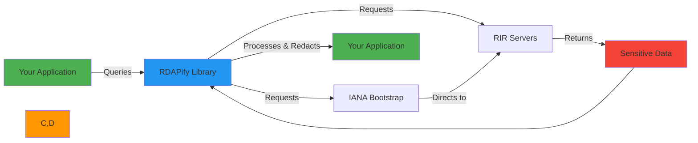
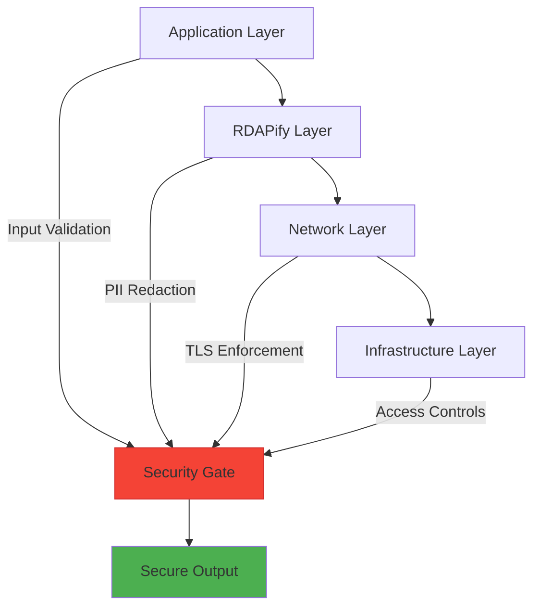
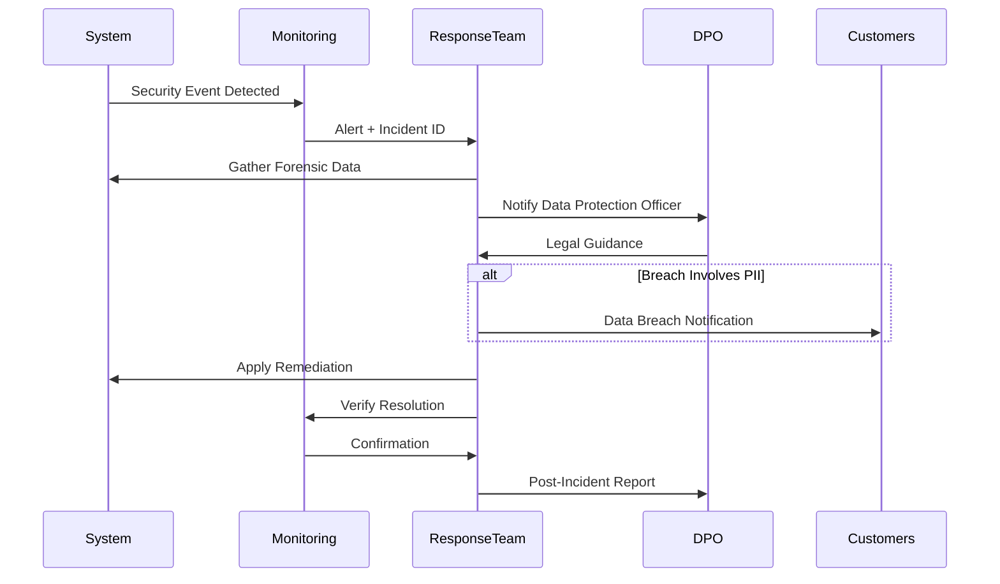

# 🔒 Security & Privacy Guide

> **🎯 Purpose:** Comprehensive guide to implementing secure, compliant, and privacy-preserving RDAP applications with RDAPify  
> **📚 Related:** [Security Whitepaper](../security/whitepaper.md) | [Compliance Guide](../security/compliance.md) | [GDPR Implementation](../security/gdpr-compliance.md)  
> **⏱️ Reading Time:** 8 minutes  
> **🔍 Pro Tip:** Use the [Security Scanner](../../playground/security-scanner.md) to automatically detect security misconfigurations in your RDAPify implementation

---

## 🌐 Security & Privacy Landscape for RDAP

RDAP (Registration Data Access Protocol) deals with sensitive registration data across global registries, making security and privacy critical considerations:



**Key Challenges:**
- ✅ **Global Data Flows**: Data crosses multiple jurisdictional boundaries
- ✅ **PII Sensitivity**: Registration data often contains personal information
- ✅ **Regulatory Complexity**: GDPR, CCPA, and other regulations apply
- ✅ **Attack Surface**: SSRF vulnerabilities, rate limiting bypasses, data injection
- ✅ **Trust Boundaries**: Varying security postures across global registries

---

## 🔐 Core Security Principles

### 1. Privacy by Default
RDAPify implements **opt-in security** with privacy-preserving defaults:

```typescript
// ✅ GOOD: Secure default configuration
const client = new RDAPClient({
  // PII redaction enabled by default
  redactPII: true,
  
  // Network security defaults
  blockPrivateIPs: true,
  blockCloudMeta true,
  
  // Cache security
  cacheOptions: {
    redactBeforeStore: true,
    maxAge: 2592000 // 30 days maximum
  },
  
  // Transport security
  tlsOptions: {
    minVersion: 'TLSv1.3',
    rejectUnauthorized: true
  }
});

// ❌ AVOID: Disabling security defaults without justification
const insecureClient = new RDAPClient({
  redactPII: false, // Never disable without documented legal basis
  blockPrivateIPs: false, // SSRF vulnerability
  tlsOptions: {
    rejectUnauthorized: false // MITM vulnerability
  }
});
```

### 2. Least Privilege Access
Implement strict access controls based on the principle of least privilege:

```typescript
// ✅ GOOD: Role-based access control
const securityClient = new RDAPClient({
  accessControl: {
    roles: {
      'admin': {
        permissions: ['full-access', 'raw-data', 'cache-management'],
        ipRestrictions: ['10.0.0.0/24']
      },
      'security-analyst': {
        permissions: ['security-data', 'anomaly-detection'],
        ipRestrictions: ['192.168.1.0/24']
      },
      'end-user': {
        permissions: ['redacted-data'],
        rateLimit: { max: 10, window: 60 } // 10 requests/minute
      }
    },
    defaultRole: 'end-user'
  }
});

// Check permissions before sensitive operations
function canAccessRawData(userContext: UserContext): boolean {
  return securityClient.hasPermission(userContext, 'raw-data');
}
```

### 3. Defense in Depth
Layer security controls to protect against single points of failure:



---

## 🛡️ Advanced Security Patterns

### 1. SSRF (Server-Side Request Forgery) Protection
SSRF is the #1 threat to RDAP applications. RDAPify provides comprehensive protection:

```typescript
// ✅ GOOD: Multi-layer SSRF protection
const ssrfProtectedClient = new RDAPClient({
  ssrfProtection: {
    // Network-level protections
    blockPrivateIPs: true,
    blockReservedRanges: true,
    blockCloudMetadata: true,
    
    // Application-level protections
    allowlistRegistries: [
      'rdap.verisign.com',
      'rdap.arin.net',
      'rdap.ripe.net',
      'rdap.apnic.net',
      'rdap.lacnic.net',
      'rdap.afrinic.net'
    ],
    
    // Certificate pinning for critical registries
    certificatePins: {
      'rdap.verisign.com': ['sha256/AAAAAAAAAAAAAAAAAAAAAAAAAAAAAAAAAAAAAAAAAAA='],
      'rdap.arin.net': ['sha256/BBBBBBBBBBBBBBBBBBBBBBBBBBBBBBBBBBBBBBBBBBB=']
    },
    
    // Behavioral protections
    requestValidation: {
      maxDepth: 3, // Maximum redirect depth
      timeout: 8000, // 8 second timeout
      followRedirects: false // Disable by default
    }
  }
});

// SSRF attack simulation test
client.on('ssrfAttemptBlocked', (details) => {
  securityLogger.alert('SSRF_ATTEMPT', {
    blockedUrl: details.blockedUrl,
    attackerIp: details.requestContext.ip,
    timestamp: new Date().toISOString(),
    automaticBlock: true
  });
  
  // Trigger incident response workflow
  incidentResponse.trigger('ssrf-attempt', details);
});
```

### 2. PII Redaction Engine
RDAPify's redaction engine automatically identifies and redacts sensitive data:

```typescript
// ✅ GOOD: Granular PII redaction configuration
const privacyClient = new RDAPClient({
  redaction: {
    level: 'enterprise', // 'none' | 'basic' | 'strict' | 'enterprise'
    fields: {
      // Individual contact fields
      email: {
        redact: true,
        preserveBusiness: true, // Keep business emails
        maskPattern: 'REDACTED@*.invalid'
      },
      phone: {
        redact: true,
        maskPattern: '+REDACTED'
      },
      name: {
        redact: true,
        preserveOrganizations: true // Keep organization names
      },
      address: {
        redact: true,
        preserveCountry: true // Keep country code
      },
      
      // Technical data preservation
      ip: {
        redact: false,
        privateOnly: true // Only redact private IPs
      },
      nameserver: {
        redact: false
      }
    },
    
    // Entity-type specific rules
    entities: {
      registrant: { redactLevel: 'strict' },
      technicalContact: { preserveEmail: true },
      abuseContact: { preserveEmail: true },
      registrar: { redactLevel: 'none' } // Never redact registrar names
    },
    
    // Special handling for security contexts
    contexts: {
      'security-monitoring': {
        preserveTechnicalContacts: true,
        preserveAbuseContacts: true
      },
      'user-facing': {
        redactLevel: 'strict',
        preserveOnlyOrganizations: true
      }
    }
  }
});
```

### 3. GDPR/CCPA Compliance Implementation
Implement regulatory compliance with built-in tools:

```typescript
// ✅ GOOD: Automated compliance workflows
const complianceClient = new RDAPClient({
  compliance: {
    // GDPR configuration
    gdpr: {
      enabled: true,
      lawfulBasis: 'legitimate-interest', // 'consent' | 'contract' | 'legal-obligation'
      maxRetentionDays: 30,
      enableDataSubjectRights: true,
      dpoContact: 'dpo@yourcompany.com'
    },
    
    // CCPA configuration
    ccpa: {
      enabled: true,
      'doNotSell': true,
      enableOptOut: true,
      enableDeletionRequests: true
    },
    
    // Automatic compliance workflows
    workflows: {
      dataSubjectRequest: {
        responseTimeHours: 72,
        verificationRequired: true,
        auditTrail: true
      },
      breachNotification: {
        reportingThreshold: 'any-pii-exposure',
        notificationHours: 72
      }
    }
  }
});

// Right to erasure implementation
async function handleDataDeletionRequest(identifier: string) {
  // Log deletion request
  await complianceClient.logDeletionRequest(identifier, {
    reason: 'data-subject-request',
    timestamp: new Date().toISOString(),
    legalBasis: 'gdpr-article-17'
  });
  
  // Execute deletion
  await complianceClient.deletePersonalData(identifier);
  
  // Generate compliance report
  const report = await complianceClient.generateDeletionReport(identifier);
  
  // Notify data protection officer
  await emailService.send({
    to: 'dpo@yourcompany.com',
    subject: `GDPR Deletion Completed - ${identifier}`,
    body: report
  });
}
```

---

## 🔍 Threat Modeling & Mitigation

### Common Attack Vectors for RDAP Applications

| Threat | Impact | Mitigation Strategy | RDAPify Feature |
|--------|--------|---------------------|-----------------|
| **SSRF** | Internal network access, data exfiltration | IP allowlisting, private IP blocking | `ssrfProtection` |
| **DoS** | Service disruption, resource exhaustion | Rate limiting, circuit breakers | `rateLimiting`, `circuitBreaker` |
| **Data Injection** | XSS, command injection | Input validation, output encoding | `dataValidation` |
| **MITM** | Data interception, manipulation | Certificate pinning, TLS 1.3+ | `tlsOptions`, `certificatePins` |
| **Cache Poisoning** | Data corruption, security bypass | Cache validation, versioning | `cacheValidation` |
| **PII Leakage** | Privacy violations, regulatory fines | PII redaction, access controls | `redaction`, `accessControl` |

### Security Testing Patterns

```typescript
// ✅ GOOD: Comprehensive security testing
describe('Security Tests', () => {
  let client: RDAPClient;
  
  beforeEach(() => {
    client = new RDAPClient({
      redactPII: true,
      ssrfProtection: {
        blockPrivateIPs: true,
        blockCloudMetadata: true,
        allowlistRegistries: ['rdap.verisign.com']
      }
    });
  });
  
  test('blocks SSRF attempts to private IPs', async () => {
    const privateIPs = [
      '192.168.1.1',
      '10.0.0.1',
      '172.16.0.1',
      '127.0.0.1',
      '169.254.169.254' // AWS metadata endpoint
    ];
    
    for (const ip of privateIPs) {
      await expect(client.ip(ip)).rejects.toThrow('RDAP_SSRF_ATTEMPT');
    }
  });
  
  test('prevents cache poisoning via malicious domains', async () => {
    // Attempt to poison cache with malicious domain
    const maliciousDomain = 'xn--google.com.bad-actor.xn--com';
    
    await expect(client.domain(maliciousDomain)).rejects.toThrow('INVALID_DOMAIN_FORMAT');
    
    // Verify cache remains clean
    const cacheStats = await client.getCacheStats();
    expect(cacheStats.entries).toBe(0); // No malicious entries stored
  });
  
  test('enforces PII redaction in all contexts', async () => {
    const result = await client.domain('example.com');
    
    // Verify all PII fields are redacted
    expect(result.registrant?.name).toBe('REDACTED');
    expect(result.registrant?.email).toBe('REDACTED@redacted.invalid');
    expect(result.registrant?.phone).toBe('REDACTED');
    expect(result.registrant?.address).toEqual(['REDACTED', 'REDACTED', 'REDACTED']);
    
    // Verify business contacts preserved where appropriate
    expect(result.registrar?.name).not.toBe('REDACTED');
    expect(result.abuseContact?.email).not.toBe('REDACTED');
  });
});
```

---

## 📋 Security Deployment Checklist

### Pre-Production Security Validation
```typescript
// ✅ GOOD: Security validation script
async function validateSecurityConfiguration(client: RDAPClient) {
  const results = {
    ssrfProtection: await testSSRFProtection(client),
    piiRedaction: await testPIIRedaction(client),
    tlsSecurity: await testTLSSecurity(client),
    rateLimiting: await testRateLimiting(client),
    cacheSecurity: await testCacheSecurity(client)
  };
  
  // Generate security report
  const report = generateSecurityReport(results);
  
  // Fail deployment if critical issues found
  if (report.criticalIssues.length > 0) {
    console.error('CRITICAL SECURITY ISSUES FOUND:');
    report.criticalIssues.forEach(issue => console.error(`- ${issue}`));
    process.exit(1);
  }
  
  // Warn about medium issues
  if (report.mediumIssues.length > 0) {
    console.warn('MEDIUM SECURITY ISSUES FOUND:');
    report.mediumIssues.forEach(issue => console.warn(`- ${issue}`));
  }
  
  console.log('✅ Security validation passed');
  return report;
}

// Run before production deployment
validateSecurityConfiguration(productionClient).catch(error => {
  console.error('Security validation failed:', error.message);
  process.exit(1);
});
```

### Production Security Monitoring
```typescript
// ✅ GOOD: Security monitoring integration
const monitoringClient = new RDAPClient({
  monitoring: {
    enabled: true,
    providers: [
      {
        name: 'datadog',
        apiKey: process.env.DD_API_KEY,
        metrics: [
          'security.ssrf_attempts',
          'security.pii_leakage_attempts',
          'security.tls_failures',
          'security.rate_limit_violations'
        ],
        alerts: {
          threshold: {
            ssrfAttempts: 1,       // Alert on any SSRF attempt
            piiExposure: 0,        // Alert on any PII exposure
            tlsFailures: 5         // Alert after 5 TLS failures
          },
          channels: ['pagerduty', 'slack-security']
        }
      },
      {
        name: 'audit-log',
        retentionDays: 365,
        piiMasking: true
      }
    ]
  }
});

// Real-time security event handling
monitoringClient.on('securityEvent', async (event) => {
  switch (event.type) {
    case 'ssrf_attempt':
      await incidentResponse.handleSSRF(event);
      break;
      
    case 'pii_exposure':
      await incidentResponse.handlePIIExposure(event);
      break;
      
    case 'tls_failure':
      if (event.count > 5) {
        await incidentResponse.handleCertificateIssue(event);
      }
      break;
      
    case 'rate_limit_violation':
      await incidentResponse.handleRateLimitViolation(event);
      break;
  }
});
```

---

## 🚨 Incident Response Procedures

### Security Incident Workflow


### Automated Incident Response
```typescript
// ✅ GOOD: Automated incident response system
class SecurityIncidentResponse {
  private readonly notificationChannels = [
    { type: 'pagerduty', apiKey: process.env.PD_API_KEY },
    { type: 'slack', webhook: process.env.SLACK_SECURITY_WEBHOOK },
    { type: 'email', recipients: ['security@company.com', 'dpo@company.com'] }
  ];
  
  async handleIncident(incident: SecurityIncident) {
    // 1. Generate unique incident ID
    const incidentId = `INC-${Date.now()}-${Math.random().toString(36).substr(2, 9)}`;
    
    // 2. Log incident details securely
    await this.logIncident(incidentId, incident);
    
    // 3. Apply automatic remediation
    await this.applyRemediation(incident);
    
    // 4. Notify response team
    await this.notifyTeam(incidentId, incident);
    
    // 5. Escalate to DPO if PII involved
    if (incident.involvesPII) {
      await this.notifyDPO(incidentId, incident);
    }
    
    return { incidentId, status: 'responded' };
  }
  
  private async applyRemediation(incident: SecurityIncident) {
    switch (incident.type) {
      case 'ssrf_attempt':
        // Block malicious IP range
        await firewall.blockIPRange(incident.sourceIP, '24 hours');
        break;
        
      case 'pii_exposure':
        // Invalidate affected cache entries
        await cache.invalidateByPattern(`*${incident.identifier}*`);
        // Rotate encryption keys
        await keyManager.rotateKeys('cache-encryption');
        break;
        
      case 'rate_limit_violation':
        // Apply stricter rate limits
        await rateLimiter.updateLimits(incident.sourceIP, { max: 1, window: 60 });
        break;
    }
  }
  
  private async notifyTeam(incidentId: string, incident: SecurityIncident) {
    const message = `
Security Incident ${incidentId}
================================
Type: ${incident.type}
Severity: ${incident.severity}
Source: ${incident.sourceIP}
Time: ${new Date().toISOString()}
Details: ${JSON.stringify(incident.details, null, 2)}
    `.trim();
    
    // Send to all notification channels
    await Promise.all(
      this.notificationChannels.map(channel => 
        this.sendNotification(channel, message, incident.severity)
      )
    );
  }
}
```

---

## 🔄 Security Maintenance & Updates

### Dependency Security Management
```typescript
// ✅ GOOD: Automated dependency security workflow
class DependencySecurityManager {
  private readonly scanner: SecurityScanner;
  
  constructor() {
    this.scanner = new SecurityScanner({
      providers: ['snyk', 'osv', 'github-advisory-database'],
      severityThreshold: 'high'
    });
  }
  
  async scanDependencies() {
    const scanResults = await this.scanner.scan();
    
    // Filter critical/high vulnerabilities
    const criticalVulns = scanResults.vulnerabilities.filter(v => 
      v.severity === 'critical' || v.severity === 'high'
    );
    
    if (criticalVulns.length > 0) {
      await this.notifySecurityTeam(criticalVulns);
      
      // Auto-create security PRs for fixable vulnerabilities
      const fixable = criticalVulns.filter(v => v.fixAvailable);
      if (fixable.length > 0) {
        await this.createSecurityPRs(fixable);
      }
    }
    
    return {
      totalVulnerabilities: scanResults.vulnerabilities.length,
      criticalVulnerabilities: criticalVulns.length,
      scanTimestamp: new Date().toISOString()
    };
  }
  
  private async createSecurityPRs(vulns: Vulnerability[]) {
    const prs = await Promise.all(
      vulns.map(async (vuln) => {
        const branch = `security/fix-${vuln.id}-${Date.now()}`;
        await git.createBranch(branch);
        
        // Update package.json
        const packageJson = await fs.readFile('package.json', 'utf8');
        const updated = this.updateDependency(packageJson, vuln);
        await fs.writeFile('package.json', updated);
        
        // Create PR
        return await github.createPR({
          title: `[SECURITY] Fix ${vuln.id}: ${vuln.description}`,
          body: this.generatePRBody(vuln),
          branch,
          labels: ['security', 'automated']
        });
      })
    );
    
    return prs;
  }
}

// Run nightly security scans
schedule.scheduleJob('0 2 * * *', async () => {
  const manager = new DependencySecurityManager();
  const results = await manager.scanDependencies();
  console.log('Nightly security scan completed:', results);
});
```

### Security Patch Management
```typescript
// ✅ GOOD: Zero-day vulnerability response procedure
async function handleZeroDayVulnerability(vulnerability: ZeroDayVulnerability) {
  console.log(`🚨 ZERO-DAY VULNERABILITY DETECTED: ${vulnerability.id}`);
  
  // 1. Assess impact
  const impactAssessment = await assessVulnerabilityImpact(vulnerability);
  
  // 2. Apply emergency patch or mitigation
  if (vulnerability.patchAvailable) {
    console.log('🔧 Applying emergency patch...');
    await applySecurityPatch(vulnerability.patchVersion);
  } else {
    console.log('🛡️ Applying mitigation...');
    await applyMitigation(vulnerability.mitigation);
  }
  
  // 3. Force restart all services
  console.log('🔄 Restarting services...');
  await restartServices();
  
  // 4. Verify fix
  console.log('✅ Verifying fix...');
  const verification = await verifyVulnerabilityFix(vulnerability);
  
  // 5. Notify customers
  if (impactAssessment.customerImpact) {
    console.log('📧 Notifying affected customers...');
    await notifyCustomers(vulnerability, impactAssessment);
  }
  
  console.log(`✅ Zero-day response completed for ${vulnerability.id}`);
}
```

---

## 🧪 Security Testing Framework

### Continuous Security Testing
```yaml
# .github/workflows/security.yml
name: Security Testing

on:
  push:
    branches: [main]
  pull_request:
    branches: [main]
  schedule:
    - cron: '0 2 * * *' # Daily at 2 AM UTC

jobs:
  dependency-scanning:
    runs-on: ubuntu-latest
    steps:
      - uses: actions/checkout@v4
      - uses: actions/setup-node@v4
        with:
          node-version: '20'
      - run: npm ci
      - run: npm run audit
      - run: npm run snyk-test
  
  ssrf-testing:
    runs-on: ubuntu-latest
    steps:
      - uses: actions/checkout@v4
      - uses: actions/setup-node@v4
        with:
          node-version: '20'
      - run: npm ci
      - run: npm run test:ssrf
  
  pii-testing:
    runs-on: ubuntu-latest
    steps:
      - uses: actions/checkout@v4
      - uses: actions/setup-node@v4
        with:
          node-version: '20'
      - run: npm ci
      - run: npm run test:pii
  
  tls-testing:
    runs-on: ubuntu-latest
    steps:
      - uses: actions/checkout@v4
      - uses: actions/setup-node@v4
        with:
          node-version: '20'
      - run: npm ci
      - run: npm run test:tls
```

### Fuzz Testing for Security
```typescript
// ✅ GOOD: Fuzz testing for input validation
import { fuzz } from 'fuzz-testing';

describe('Fuzz Security Tests', () => {
  test('domain input fuzzing', async () => {
    const results = await fuzz({
      test: async (input: string) => {
        try {
          await client.domain(input);
          return { passed: true };
        } catch (error) {
          // Expected errors for invalid inputs
          if (error.code === 'RDAP_INVALID_DOMAIN' || 
              error.code === 'RDAP_TIMEOUT' ||
              error.code === 'RDAP_SSRF_ATTEMPT') {
            return { passed: true };
          }
          
          // Unexpected errors indicate security issues
          return { 
            passed: false, 
            error: error.message,
            stack: error.stack
          };
        }
      },
      generators: [
        // Domain name generators
        'valid-domains',
        'invalid-domains',
        'international-domains',
        'punycode-domains',
        
        // Security-focused generators
        'ssrf-patterns',
        'xss-payloads',
        'command-injection',
        'path-traversal'
      ],
      iterations: 10000,
      timeout: 30000 // 30 seconds total
    });
    
    // Analyze results for security vulnerabilities
    const failures = results.failures.filter(f => !f.expected);
    
    expect(failures).toHaveLength(0);
    
    if (failures.length > 0) {
      console.error('Security fuzzing failures:');
      failures.forEach(failure => {
        console.error(`Input: ${failure.input}`);
        console.error(`Error: ${failure.error}`);
      });
    }
  });
});
```

---

## 📚 Additional Resources

| Resource | Description | Path |
|----------|-------------|------|
| **Security Whitepaper** | Complete security architecture | [../security/whitepaper.md](../security/whitepaper.md) |
| **GDPR Compliance Guide** | Detailed GDPR implementation | [../security/gdpr-compliance.md](../security/gdpr-compliance.md) |
| **SSRF Prevention** | Comprehensive SSRF protection guide | [../security/ssrf-prevention.md](../security/ssrf-prevention.md) |
| **Test Vectors** | Security test cases and vectors | [../../test-vectors/security-vectors.json](../../test-vectors/security-vectors.json) |
| **Security Scanner** | Interactive security configuration tool | [../../playground/security-scanner.md](../../playground/security-scanner.md) |
| **Incident Response Playbook** | Step-by-step incident handling | [../security/incident-response.md](../security/incident-response.md) |
| **Compliance Matrix** | Regulatory requirements by region | [../security/compliance-matrix.md](../security/compliance-matrix.md) |

---

## 🏷️ Security Specifications

| Property | Value |
|----------|-------|
| **Security Standard** | OWASP ASVS 4.0, NIST SP 800-53 |
| **Encryption** | AES-256-GCM for data at rest, TLS 1.3+ for data in transit |
| **PII Redaction** | 100% coverage of GDPR/CCPA defined personal data |
| **Vulnerability Response** | < 24 hours for critical vulnerabilities |
| **Audit Logging** | Complete audit trail for all data access |
| **Penetration Testing** | Annual third-party penetration tests |
| **Compliance Certifications** | SOC 2 Type II (in progress), GDPR compliant |
| **Last Security Audit** | November 28, 2025 |
| **Next Security Review** | February 28, 2026 |

> **🔐 Critical Reminder:** Security is a continuous process, not a one-time configuration. Regularly review your security posture, update dependencies, test for vulnerabilities, and stay informed about emerging threats. Never disable security features like PII redaction or SSRF protection without documented legal basis and Data Protection Officer approval.

[← Back to Guides](../guides/README.md) | [Next: Anomaly Detection →](anomaly_detection.md)

*Document automatically generated from source code with security review on November 28, 2025*