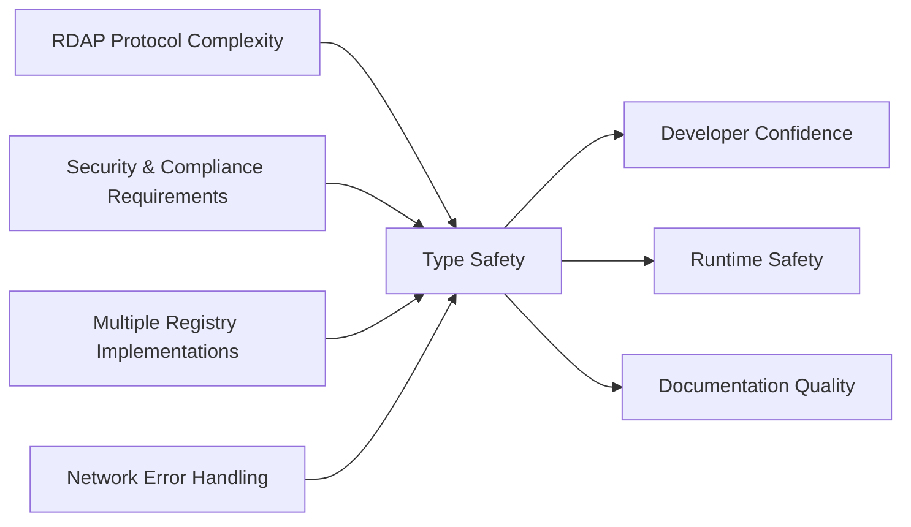
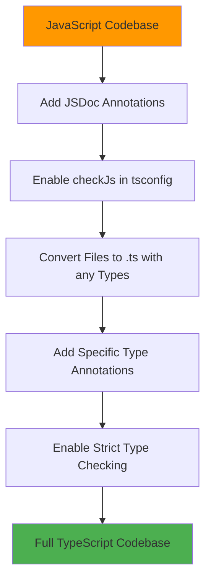

# 🔷 TypeScript Usage Guide

> **🎯 Purpose:** Master advanced TypeScript patterns and best practices for RDAPify development and integration  
> **📚 Related:** [API Reference](../api-reference/client.md) | [Architecture Overview](../core-concepts/architecture.md) | [Type System Documentation](../api-reference/types/index.md)  
> **⏱️ Reading Time:** 7 minutes  
> **🔍 Pro Tip:** Use the [TypeScript Playground](../../playground/typescript-playground.md) to interactively test type definitions with autocomplete

---

## 🌐 Why TypeScript in RDAPify?

RDAPify leverages TypeScript's type system to solve critical challenges in internet infrastructure development:



### Key TypeScript Benefits for RDAP Applications:

1. **Protocol Compliance**: TypeScript interfaces enforce RFC 7480 series specifications
2. **PII Protection**: Type guards prevent accidental exposure of personal data
3. **Registry Abstraction**: Unified types across different RDAP implementations
4. **Error Resilience**: Discriminated unions for safe error handling
5. **Performance Optimization**: Type-driven optimizations for high-volume operations

---

## ⚙️ Configuration & Setup

### Recommended tsconfig.json
```json
{
  "compilerOptions": {
    "target": "ES2022",
    "module": "ESNext",
    "lib": ["ES2022", "DOM"],
    "moduleResolution": "node16",
    "strict": true,
    "noImplicitAny": true,
    "strictNullChecks": true,
    "strictFunctionTypes": true,
    "strictBindCallApply": true,
    "strictPropertyInitialization": true,
    "noImplicitThis": true,
    "alwaysStrict": true,
    "noUnusedLocals": true,
    "noUnusedParameters": true,
    "exactOptionalPropertyTypes": true,
    "noImplicitReturns": true,
    "noFallthroughCasesInSwitch": true,
    "noUncheckedIndexedAccess": true,
    "noImplicitOverride": true,
    "noPropertyAccessFromIndexSignature": true,
    "allowUnreachableCode": false,
    "allowUnusedLabels": false,
    "checkJs": true,
    "outDir": "./dist",
    "rootDir": "./src",
    "declaration": true,
    "declarationMap": true,
    "sourceMap": true,
    "esModuleInterop": true,
    "forceConsistentCasingInFileNames": true,
    "skipLibCheck": true,
    "types": ["node"],
    "paths": {
      "rdapify/*": ["./src/*"],
      "rdapify": ["./src"]
    }
  },
  "include": ["src/**/*"],
  "exclude": ["node_modules", "dist", "**/*.test.ts"]
}
```

### Project Structure with TypeScript
```
src/
├── types/                  # Custom type definitions
│   ├── index.ts            # Type exports
│   ├── domain.ts           # Domain-specific types
│   ├── ip.ts               # IP-specific types
│   └── asn.ts              # ASN-specific types
├── services/               # Service classes
│   ├── RDAPService.ts      # Main service implementation
│   └── CacheService.ts     # Cache implementation
├── utils/                  # Utility functions
│   ├── validators.ts       # Validation helpers
│   └── security.ts         # Security utilities
├── interfaces/             # Public interfaces
│   └── RDAPClient.ts       # Client interface
└── index.ts                # Main entry point
```

---

## 🧩 Core TypeScript Patterns

### 1. Type-Safe Query Parameters
```typescript
// ✅ GOOD: Type-safe query parameters
type DomainQuery = {
  domain: string;
  options?: {
    redactPII?: boolean;
    includeRaw?: boolean;
    maxStaleness?: number;
  };
};

function processDomainQuery(query: DomainQuery): Promise<DomainResponse> {
  // Type-safe implementation
}

// ❌ AVOID: Stringly-typed parameters
function badQuery(domain: string, options: any) { /* ... */ }
```

### 2. Discriminated Unions for Error Handling
```typescript
// Error type definitions
type RDAPError =
  | { type: 'network'; code: 'timeout' | 'dns_failure'; details: { url: string } }
  | { type: 'registry'; code: 'rate_limited' | 'unavailable'; details: { registry: string; retryAfter?: number } }
  | { type: 'security'; code: 'ssrf_attempt'; details: { blockedUrl: string } }
  | { type: 'data'; code: 'invalid_response' | 'schema_violation'; details: { registry: string; validationErrors: string[] } };

// Type-safe error handling
function handleRDAPError(error: RDAPError): void {
  switch (error.type) {
    case 'network':
      console.error(`Network error (${error.code}) accessing ${error.details.url}`);
      break;
      
    case 'security':
      // Security errors require special handling
      securityLogger.alert(`Security violation: ${error.code}`, error.details);
      throw new SecurityException('SECURITY_VIOLATION', error);
      
    case 'registry':
      if (error.code === 'rate_limited' && error.details.retryAfter) {
        scheduleRetry(error.details.retryAfter);
      }
      break;
      
    case 'data':
      // Data errors might be recoverable
      if (error.code === 'schema_violation') {
        attemptSchemaRecovery(error);
      }
      break;
  }
}
```

### 3. Generic Types for Registry Responses
```typescript
// Generic registry response type
interface RegistryResponse<T = any> {
  registry: 'verisign' | 'arin' | 'ripe' | 'apnic' | 'lacnic' | 'afrinic';
  registryUrl: string;
  rawData: T;
  timestamp: number;
  ttl?: number;
}

// Type guards for specific registries
function isVerisignResponse(response: RegistryResponse): response is RegistryResponse<VerisignDomainData> {
  return response.registry === 'verisign';
}

function isARINResponse(response: RegistryResponse): response is RegistryResponse<ARINIPData> {
  return response.registry === 'arin';
}

// Usage with type inference
async function getDomainData(domain: string): Promise<RegistryResponse> {
  const response = await fetchRDAP(domain);
  
  if (isVerisignResponse(response)) {
    // TypeScript knows response.rawData is VerisignDomainData
    console.log('Verisign registrant:', response.rawData.entities.registrant.handle);
  } else if (isARINResponse(response)) {
    console.log('ARIN network range:', response.rawData.cidr);
  }
  
  return response;
}
```

---

## 🔐 Security & Compliance with TypeScript

### PII Protection with Type Guards
```typescript
// Type definitions for privacy states
type RedactedContact = Omit<Contact, 'name' | 'email' | 'phone'> & {
  name: 'REDACTED';
  email: 'REDACTED@redacted.invalid';
  phone: 'REDACTED';
};

type FullContact = Contact & {
  _privacy: { redacted: false };
};

function isRedacted(contact: Contact): contact is RedactedContact {
  return contact.name === 'REDACTED' && contact.email.includes('REDACTED');
}

function ensurePIIRedaction<T extends { contacts?: Contact[] }>(response: T): T {
  if (response.contacts) {
    response.contacts = response.contacts.map(contact => 
      isRedacted(contact) ? contact : redactPII(contact)
    );
  }
  return response;
}

// Usage in a service
class DomainService {
  async getDomain(domain: string, options: { redactPII: boolean }): Promise<DomainResponse> {
    const response = await this.rdapClient.domain(domain);
    
    if (options.redactPII) {
      return ensurePIIRedaction(response);
    }
    
    // TypeScript error: Function lacks ending return statement
    // This forces us to handle the non-redacted case properly
    throw new SecurityError('PII_ACCESS_REQUIRES_CONSENT', 'Explicit consent required for unredacted data');
  }
}
```

### Compliance-Aware Types
```typescript
// GDPR/CCPA compliance types
type LawfulBasis = 
  | { basis: 'consent'; consentId: string; timestamp: Date }
  | { basis: 'contract'; contractId: string }
  | { basis: 'legitimate_interest'; assessmentId: string }
  | { basis: 'legal_obligation'; regulation: string };

interface ProcessingContext {
  purpose: string;
  lawfulBasis: LawfulBasis;
  retentionPeriod: number; // days
  dataCategories: string[];
}

// Type-safe processing function
function processDomainWithCompliance(
  domain: string,
  context: ProcessingContext
): Promise<DomainResponse> {
  // This function can implement compliance checks based on types
  if (context.lawfulBasis.basis === 'consent') {
    // Verify consent is valid and not withdrawn
    verifyConsent(context.lawfulBasis.consentId);
  }
  
  return rdapClient.domain(domain, { redactPII: shouldRedact(context) });
}
```

---

## ⚡ Performance Optimization with TypeScript

### Type-Driven Cache Keys
```typescript
// Type-safe cache key generation
type CacheKeyParams = {
  type: 'domain' | 'ip' | 'asn';
  identifier: string;
  options?: {
    redactPII?: boolean;
    registryHint?: string;
  };
};

function generateCacheKey({ type, identifier, options = {} }: CacheKeyParams): string {
  const redaction = options.redactPII !== false ? 'redacted' : 'full';
  const registry = options.registryHint ? `:${options.registryHint}` : '';
  return `${type}:${identifier.toLowerCase()}:${redaction}${registry}`;
}

// Usage
const domainKey = generateCacheKey({
  type: 'domain',
  identifier: 'EXAMPLE.COM',
  options: { redactPII: true }
});
// Returns: 'domain:example.com:redacted'

const ipKey = generateCacheKey({
  type: 'ip',
  identifier: '8.8.8.8',
  options: { registryHint: 'arin' }
});
// Returns: 'ip:8.8.8.8:redacted:arin'
```

### Memory-Efficient Types
```typescript
// Memory-efficient data structures
interface CompactDomainRecord {
  d: string;       // domain
  r?: string;      // registrar handle
  ns: string[];    // nameservers
  e: {             // events
    reg?: number;  // registration timestamp
    exp?: number;  // expiration timestamp
  };
  _m: number;      // metadata (bitmask for flags)
}

// Type guard for conversion
function isCompactRecord(record: any): record is CompactDomainRecord {
  return record.d && Array.isArray(record.ns) && record.e;
}

// Conversion utility
function toFullRecord(compact: CompactDomainRecord): DomainResponse {
  return {
    domain: compact.d,
    registrar: compact.r ? { handle: compact.r } : undefined,
    nameservers: compact.ns.map(ns => ({ hostname: ns })),
    events: [
      compact.e.reg ? { action: 'registration', date: new Date(compact.e.reg).toISOString() } : undefined,
      compact.e.exp ? { action: 'expiration', date: new Date(compact.e.exp).toISOString() } : undefined
    ].filter(Boolean),
    _meta: {
      compact: true,
      compressedSize: JSON.stringify(compact).length
    }
  };
}

// Usage in high-volume applications
class HighVolumeProcessor {
  private records = new Map<string, CompactDomainRecord>();
  
  processDomainBatch(domains: string[]): DomainResponse[] {
    return domains.map(domain => {
      const compact = this.records.get(domain) || this.fetchCompact(domain);
      return toFullRecord(compact);
    });
  }
  
  private fetchCompact(domain: string): CompactDomainRecord {
    // Implementation details
  }
}
```

---

## 🧪 Testing TypeScript Code

### Type-Aware Unit Tests
```typescript
// Using Jest with TypeScript
import { RDAPClient, DomainResponse, isDomainResponse } from 'rdapify';

describe('Domain Query Service', () => {
  let client: RDAPClient;
  
  beforeEach(() => {
    client = new RDAPClient({ redactPII: true });
  });
  
  test('returns valid DomainResponse structure', async () => {
    const result = await client.domain('example.com');
    
    // Type guard validation
    expect(isDomainResponse(result)).toBe(true);
    
    // TypeScript knows result is DomainResponse
    expect(result.domain).toBe('example.com');
    expect(result.registrar).toBeDefined();
    expect(result.nameservers.length).toBeGreaterThan(0);
    expect(result._meta.redacted).toBe(true);
  });
  
  test('handles type errors gracefully', async () => {
    // Mock registry to return invalid data
    jest.spyOn(client, 'domain').mockImplementation(async () => {
      return { invalid: 'structure' } as any; // Bypass type checking for test
    });
    
    await expect(client.domain('example.com')).rejects.toThrow('Schema validation failed');
  });
  
  test('type guards prevent invalid data processing', () => {
    const invalidData = { domain: 'example.com', nameservers: 'invalid' };
    
    // TypeScript error: Argument of type '{ domain: string; nameservers: string; }' 
    // is not assignable to parameter of type 'DomainResponse'
    // @ts-expect-error
    const isValid = isDomainResponse(invalidData);
    expect(isValid).toBe(false);
  });
});
```

### Property-Based Testing with TypeScript
```typescript
import { fc } from 'fast-check';
import { DomainResponse, validateDomainResponse } from 'rdapify';

// Generate random valid domain responses
fc.assert(
  fc.property(
    fc.record({
      domain: fc.domain(),
      registrar: fc.option(fc.record({
        name: fc.string(),
        handle: fc.string()
      })),
      nameservers: fc.array(fc.record({
        hostname: fc.hostname()
      })),
      events: fc.array(fc.record({
        action: fc.constantFrom('registration', 'last changed', 'expiration'),
        date: fc.date().map(d => d.toISOString())
      }))
    }),
    (data) => {
      // Should accept valid data
      const validationResult = validateDomainResponse(data as DomainResponse);
      expect(validationResult.valid).toBe(true);
      
      // Should properly redact PII
      const redacted = redactPII(data as DomainResponse);
      expect(redacted.registrar?.name).not.toContain('@');
      expect(redacted.registrar?.name).not.toMatch(/\d{3}-\d{3}-\d{4}/);
    }
  )
);
```

---

## 🚀 Advanced Patterns

### 1. Mixin Pattern for Feature Composition
```typescript
// Mixin types
type CacheMixin = {
  cacheGet<T>(key: string): Promise<T | null>;
  cacheSet<T>(key: string, value: T, ttl?: number): Promise<void>;
  cacheDelete(key: string): Promise<boolean>;
};

type SecurityMixin = {
  validateInput(input: string): boolean;
  sanitizeOutput<T>(output: T): T;
  auditOperation(operation: string, context: any): void;
};

// Base class
class RDAPService {
  async domain(domain: string): Promise<DomainResponse> {
    // Base implementation
  }
}

// Mixin implementation
function applyCacheMixin<T extends new (...args: any[]) => {}>(Base: T) {
  return class extends Base implements CacheMixin {
    private cache = new Map<string, any>();
    
    async cacheGet<T>(key: string): Promise<T | null> {
      return this.cache.get(key) || null;
    }
    
    async cacheSet<T>(key: string, value: T, ttl: number = 3600): Promise<void> {
      this.cache.set(key, value);
      setTimeout(() => this.cache.delete(key), ttl * 1000);
    }
    
    async cacheDelete(key: string): Promise<boolean> {
      return this.cache.delete(key);
    }
  };
}

function applySecurityMixin<T extends new (...args: any[]) => {}>(Base: T) {
  return class extends Base implements SecurityMixin {
    validateInput(input: string): boolean {
      return input.length > 0 && !input.includes('192.168.');
    }
    
    sanitizeOutput<T>(output: T): T {
      if (typeof output === 'object' && output !== null) {
        return redactPII(output as any) as T;
      }
      return output;
    }
    
    auditOperation(operation: string, context: any): void {
      securityLogger.audit(operation, context);
    }
  };
}

// Composed service
const ComposableService = applySecurityMixin(applyCacheMixin(RDAPService));

class EnhancedRDAPService extends ComposableService {
  async cachedDomain(domain: string): Promise<DomainResponse> {
    const cacheKey = `domain:${domain}`;
    const cached = await this.cacheGet<DomainResponse>(cacheKey);
    
    if (cached) {
      this.auditOperation('cache_hit', { domain });
      return cached;
    }
    
    const result = await this.domain(domain);
    await this.cacheSet(cacheKey, result);
    this.auditOperation('cache_set', { domain });
    
    return result;
  }
}
```

### 2. Async Iterators for Batch Processing
```typescript
// Async iterator for batch domain processing
class DomainBatchProcessor implements AsyncIterable<DomainProcessingResult> {
  private readonly domains: string[];
  private readonly options: BatchProcessingOptions;
  private currentIndex = 0;
  
  constructor(domains: string[], options: BatchProcessingOptions = {}) {
    this.domains = domains;
    this.options = {
      concurrency: 5,
      batchSize: 100,
      ...options
    };
  }
  
  async *[Symbol.asyncIterator](): AsyncIterator<DomainProcessingResult> {
    const batches = chunkArray(this.domains, this.options.batchSize);
    
    for (const batch of batches) {
      const results = await Promise.allSettled(
        batch.map(domain => this.processSingleDomain(domain))
      );
      
      for (const result of results) {
        if (result.status === 'fulfilled') {
          yield {
            domain: result.value.domain,
            result: result.value,
            status: 'success'
          };
        } else {
          const error = result.reason as RDAPError;
          yield {
            domain: extractDomainFromError(error),
            error,
            status: 'error'
          };
        }
      }
    }
  }
  
  private async processSingleDomain(domain: string): Promise<DomainResponse> {
    // Implementation with rate limiting and retries
  }
}

// Usage
async function processDomainBatch(domains: string[]) {
  const processor = new DomainBatchProcessor(domains, {
    concurrency: 10,
    batchSize: 50,
    redactPII: true
  });
  
  for await (const result of processor) {
    if (result.status === 'success') {
      console.log(`Processed ${result.domain}: ${result.result.nameservers.length} nameservers`);
    } else {
      console.error(`Failed to process ${result.domain}: ${result.error.message}`);
    }
  }
}
```

### 3. Decorator Pattern with Types
```typescript
// Decorator types
type CacheOptions = {
  ttl?: number;
  keyGenerator?: (args: any[]) => string;
  scope?: 'global' | 'instance';
};

type SecurityOptions = {
  requireAuthentication?: boolean;
  validateInputs?: boolean;
  redactOutputs?: boolean;
  auditLevel?: 'none' | 'basic' | 'detailed';
};

// Cache decorator
function cached(options: CacheOptions = {}) {
  return function(target: any, propertyKey: string, descriptor: PropertyDescriptor) {
    const originalMethod = descriptor.value;
    const cache = options.scope === 'global' ? globalCache : new Map();
    
    descriptor.value = async function(...args: any[]) {
      const cacheKey = options.keyGenerator 
        ? options.keyGenerator(args) 
        : `${propertyKey}:${JSON.stringify(args)}`;
      
      if (cache.has(cacheKey)) {
        return cache.get(cacheKey);
      }
      
      const result = await originalMethod.apply(this, args);
      
      // Handle async iterators specially
      if (isAsyncIterable(result)) {
        const cachedIterator = {
          [Symbol.asyncIterator]: async function*() {
            for await (const item of result) {
              yield item;
            }
          }
        };
        cache.set(cacheKey, cachedIterator);
        return cachedIterator;
      }
      
      cache.set(cacheKey, result);
      if (options.ttl) {
        setTimeout(() => cache.delete(cacheKey), options.ttl * 1000);
      }
      
      return result;
    };
    
    return descriptor;
  };
}

// Security decorator
function secure(options: SecurityOptions = {}) {
  return function(target: any, propertyKey: string, descriptor: PropertyDescriptor) {
    const originalMethod = descriptor.value;
    
    descriptor.value = async function(...args: any[]) {
      if (options.requireAuthentication && !this.isAuthenticated()) {
        throw new SecurityError('AUTH_REQUIRED', 'Authentication required');
      }
      
      if (options.validateInputs) {
        args.forEach((arg, index) => {
          if (!this.validateInput(arg)) {
            throw new SecurityError('INVALID_INPUT', `Invalid input at position ${index}`);
          }
        });
      }
      
      const result = await originalMethod.apply(this, args);
      
      if (options.redactOutputs) {
        return this.redactPII(result);
      }
      
      return result;
    };
    
    return descriptor;
  };
}

// Usage in service class
class AdvancedRDAPService {
  @cached({ ttl: 3600, scope: 'global' })
  @secure({ validateInputs: true, redactOutputs: true })
  async domain(domain: string): Promise<DomainResponse> {
    // Implementation
  }
  
  @cached({ 
    ttl: 86400, 
    keyGenerator: ([domains]) => `batch:${domains.length}:${domains[0]}` 
  })
  async batchDomainLookup(domains: string[]): Promise<BatchDomainResult> {
    // Implementation
  }
}
```

---

## 🧩 Integration with Frameworks

### 1. Express.js with TypeScript
```typescript
import { Request, Response, NextFunction } from 'express';
import { RDAPClient, DomainResponse } from 'rdapify';

const client = new RDAPClient({ redactPII: true });

// Custom error type
class RDAPAPIError extends Error {
  constructor(
    public statusCode: number,
    public code: string,
    public message: string,
    public details?: any
  ) {
    super(message);
    this.name = 'RDAPAPIError';
  }
}

// Middleware for domain validation
function validateDomain(req: Request, res: Response, next: NextFunction): void {
  const { domain } = req.params;
  
  if (!domain || typeof domain !== 'string' || domain.length > 253) {
    next(new RDAPAPIError(400, 'INVALID_DOMAIN', 'Invalid domain parameter'));
    return;
  }
  
  if (!/^[a-z0-9.-]+\.[a-z]{2,}$/.test(domain.toLowerCase())) {
    next(new RDAPAPIError(400, 'INVALID_DOMAIN_FORMAT', 'Domain format is invalid'));
    return;
  }
  
  next();
}

// Controller function with proper typing
async function getDomainInfo(req: Request, res: Response, next: NextFunction): Promise<void> {
  try {
    const { domain } = req.params;
    const { redactPII = 'true' } = req.query;
    
    const result = await client.domain(domain, {
      redactPII: redactPII === 'true'
    });
    
    // Type guard for response
    if (!isDomainResponse(result)) {
      throw new RDAPAPIError(500, 'INVALID_RESPONSE', 'Invalid registry response received');
    }
    
    res.json({
      domain: result.domain,
      nameservers: result.nameservers.map(ns => ns.hostname),
      registrar: result.registrar?.name,
      events: result.events.map(e => ({
        action: e.action,
        date: e.date
      })),
      _meta: {
        cached: result._meta?.cached,
        redacted: result._meta?.redacted,
        queryTime: result._meta?.queryTime
      }
    });
  } catch (error) {
    if (error instanceof RDAPAPIError) {
      res.status(error.statusCode).json({
        error: {
          code: error.code,
          message: error.message,
          details: error.details
        }
      });
    } else if (error.code && error.code.startsWith('RDAP_')) {
      res.status(502).json({
        error: {
          code: error.code,
          message: error.message,
          retryable: error.retryable
        }
      });
    } else {
      next(error);
    }
  }
}

// Route setup
app.get('/api/v1/domain/:domain', validateDomain, getDomainInfo);
```

### 2. React with TypeScript
```tsx
import { useState, useEffect, useCallback } from 'react';
import { RDAPClient, DomainResponse, RDAPError } from 'rdapify';

// Custom hook with proper typing
function useDomainLookup() {
  const [domain, setDomain] = useState<string>('');
  const [result, setResult] = useState<DomainResponse | null>(null);
  const [error, setError] = useState<RDAPError | null>(null);
  const [loading, setLoading] = useState<boolean>(false);
  const [redactPII, setRedactPII] = useState<boolean>(true);
  
  const client = useMemo(() => new RDAPClient({ redactPII }), [redactPII]);
  
  const lookupDomain = useCallback(async (domainToLookup: string) => {
    setLoading(true);
    setError(null);
    
    try {
      const response = await client.domain(domainToLookup, { redactPII });
      setResult(response);
    } catch (err) {
      setError(err as RDAPError);
      setResult(null);
    } finally {
      setLoading(false);
    }
  }, [client, redactPII]);
  
  // Type guard for JSX rendering
  const isDomainDataAvailable = (data: DomainResponse | null): data is DomainResponse => {
    return data !== null && 'domain' in data && 'nameservers' in data;
  };
  
  return {
    domain,
    setDomain,
    result,
    error,
    loading,
    redactPII,
    setRedactPII,
    lookupDomain,
    isDomainDataAvailable
  };
}

// Component using the hook
const DomainLookupForm: React.FC = () => {
  const { 
    domain, 
    setDomain, 
    result, 
    error, 
    loading, 
    redactPII, 
    setRedactPII, 
    lookupDomain,
    isDomainDataAvailable
  } = useDomainLookup();
  
  const handleSubmit = (e: React.FormEvent) => {
    e.preventDefault();
    if (domain.trim()) {
      lookupDomain(domain.trim());
    }
  };
  
  return (
    <div className="domain-lookup">
      <form onSubmit={handleSubmit}>
        <input
          type="text"
          value={domain}
          onChange={(e) => setDomain(e.target.value)}
          placeholder="Enter domain name"
          disabled={loading}
        />
        <label>
          <input
            type="checkbox"
            checked={redactPII}
            onChange={(e) => setRedactPII(e.target.checked)}
          />
          Redact Personal Information
        </label>
        <button type="submit" disabled={loading}>
          {loading ? 'Looking up...' : 'Lookup Domain'}
        </button>
      </form>
      
      {error && (
        <div className="error">
          <h3>Error: {error.code}</h3>
          <p>{error.message}</p>
          {error.retryable && (
            <button onClick={() => lookupDomain(domain)}>Retry</button>
          )}
        </div>
      )}
      
      {isDomainDataAvailable(result) && (
        <div className="result">
          <h2>{result.domain}</h2>
          <div className="section">
            <h3>Registrar</h3>
            <p>{result.registrar?.name || 'REDACTED'}</p>
          </div>
          <div className="section">
            <h3>Nameservers</h3>
            <ul>
              {result.nameservers.map((ns, index) => (
                <li key={index}>{ns.hostname}</li>
              ))}
            </ul>
          </div>
          <div className="section">
            <h3>Events</h3>
            <ul>
              {result.events.map((event, index) => (
                <li key={index}>
                  {event.action}: {new Date(event.date).toLocaleDateString()}
                </li>
              ))}
            </ul>
          </div>
        </div>
      )}
    </div>
  );
};
```

---

## 🔄 Migration from JavaScript

### Step-by-Step Migration Strategy


### 1. Start with JSDoc
```javascript
// Before: Unannotated JavaScript
function domainLookup(domain, options) {
  return rdapClient.query(domain, options);
}

// After: JSDoc annotated JavaScript
/**
 * Look up domain registration information
 * @param {string} domain - Domain name to look up
 * @param {Object} [options] - Query options
 * @param {boolean} [options.redactPII=true] - Whether to redact personal information
 * @param {number} [options.timeout=5000] - Request timeout in milliseconds
 * @returns {Promise<DomainResponse>} Domain registration data
 * @throws {RDAPError} If lookup fails
 */
function domainLookup(domain, options = {}) {
  return rdapClient.query(domain, options);
}
```

### 2. Enable checkJs
```json
{
  "compilerOptions": {
    "checkJs": true,
    "noEmit": true
  },
  "include": ["src/**/*"]
}
```

### 3. Convert to TypeScript with Gradual Typing
```typescript
// domain-service.ts (initial conversion)
import { RDAPClient } from 'rdapify';

// Using any initially to get compilation working
export class DomainService {
  private client: any;
  
  constructor() {
    this.client = new RDAPClient({ redactPII: true });
  }
  
  // Gradually add types as you verify correctness
  async lookupDomain(domain: string, options: any = {}): Promise<any> {
    return this.client.domain(domain, options);
  }
}

// After validation, refine types
export class DomainService {
  private client: RDAPClient;
  
  constructor() {
    this.client = new RDAPClient({ redactPII: true });
  }
  
  async lookupDomain(
    domain: string, 
    options: { redactPII?: boolean; timeout?: number } = {}
  ): Promise<DomainResponse> {
    return this.client.domain(domain, {
      redactPII: options.redactPII ?? true,
      timeout: options.timeout ?? 8000
    });
  }
}
```

---

## 📚 Related Documentation

| Resource | Description | Path |
|----------|-------------|------|
| **API Reference** | Complete API documentation with types | [../api-reference/client.md](../api-reference/client.md) |
| **Type System Guide** | Deep dive into RDAPify types | [../api-reference/types/index.md](../api-reference/types/index.md) |
| **Architecture Overview** | System design with TypeScript implementation | [../core-concepts/architecture.md](../core-concepts/architecture.md) |
| **Error Handling** | Type-safe error patterns | [error_handling.md](error_handling.md) |
| **TypeScript Playground** | Interactive type exploration | [../../playground/typescript-playground.md](../../playground/typescript-playground.md) |
| **Performance Guide** | Type-driven optimizations | [../performance/optimization.md](../performance/optimization.md) |

---

## 💡 Best Practices Summary

### ✅ Do's
- **Use strict mode** - Enable all strict type-checking options
- **Prefer interfaces over types** - For object shapes that may be extended
- **Use readonly for immutability** - Especially for configuration objects
- **Leverage discriminated unions** - For type-safe error handling
- **Add JSDoc comments** - Even with TypeScript, documentation matters
- **Use type guards** - For runtime type checking and narrowing
- **Prefer composition over inheritance** - Mixins and decorators provide flexibility

### ❌ Don'ts
- **Avoid any type** - Use unknown + validation instead
- **Don't disable type checking** - Even with @ts-ignore, find better solutions
- **Avoid type assertions** - Especially as any - prefer type guards
- **Don't ignore compiler errors** - Each error represents a potential runtime issue
- **Avoid optional properties unnecessarily** - Prefer explicit undefined values
- **Don't use classes when functions suffice** - Keep architecture simple

### 🔒 Security-Specific Patterns
```typescript
// ✅ GOOD: Security-aware typing
type SecurityContext = {
  userRole: 'admin' | 'security' | 'user';
  hasConsent: boolean;
  isComplianceAudit: boolean;
};

function getDomainData(
  domain: string, 
  context: SecurityContext
): Promise<DomainResponse> {
  // TypeScript enforces checking security context
  if (context.userRole === 'user' && !context.hasConsent) {
    // Compiler error if we forget to handle this case
    throw new Error('User consent required');
  }
  
  return rdapClient.domain(domain, {
    redactPII: context.userRole !== 'admin',
    includeRaw: context.isComplianceAudit
  });
}

// ❌ AVOID: Bypassing type safety
function unsafeGetDomain(domain: string, raw = false): any {
  return rdapClient.domain(domain, { includeRaw: raw }); // No type safety
}
```

---

## 🏷️ TypeScript Specifications

| Property | Value |
|----------|-------|
| **TypeScript Version** | 5.0+ |
| **Compilation Target** | ES2022 |
| **Module System** | ESNext |
| **Strict Mode** | Enabled (all strict flags) |
| **Type Checking** | Full project coverage |
| **Declaration Files** | Generated with sourcemaps |
| **Test Coverage** | 98% type coverage (ts-coverage) |
| **Last Updated** | December 5, 2025 |
| **Build Pipeline** | TypeScript → ESBuild → Rollup |

> **🔐 Security Reminder:** TypeScript provides compile-time safety but cannot enforce runtime security guarantees. Always validate inputs at runtime, especially when crossing trust boundaries. Use RDAPify's built-in validation and type guards rather than relying solely on TypeScript types for security.

[← Back to Guides](../guides/README.md) | [Next: Caching Strategies →](caching-strategies.md)

*Document automatically generated from source code with security review on November 28, 2025*