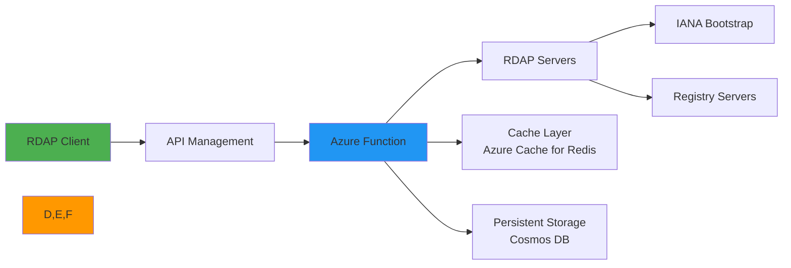
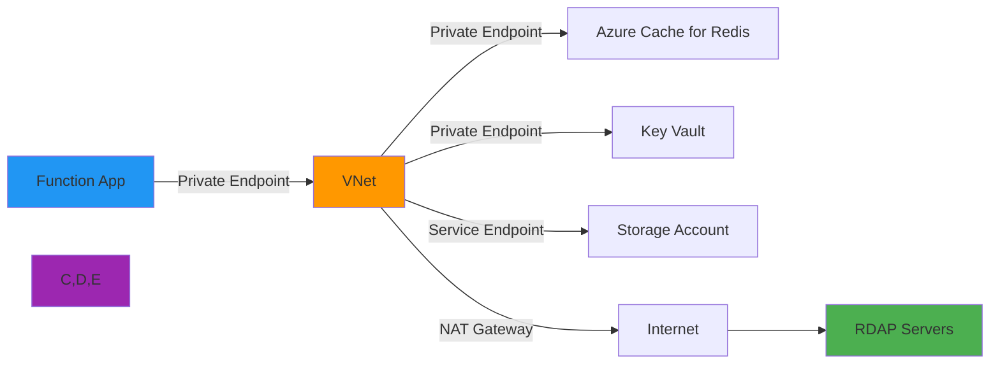
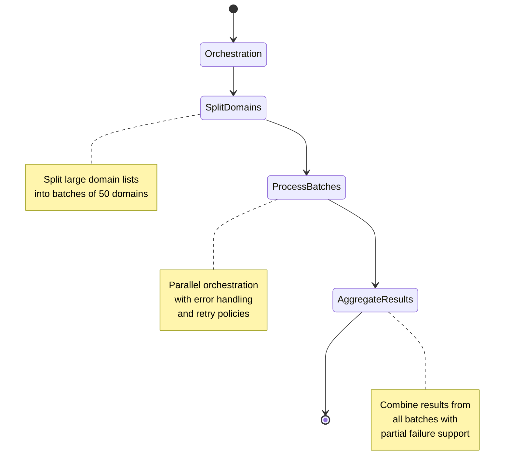

# 🔌 Azure Functions Integration Guide

> **🎯 Purpose:** Complete guide to deploying and optimizing RDAPify in Azure Functions serverless environments  
> **📚 Related:** [Getting Started](../../getting_started/quick_start.md) | [CLI Guide](../../cli/commands.md) | [AWS Lambda](aws_lambda.md)  
> **⏱️ Reading Time:** 8 minutes  
> **🔍 Pro Tip:** Use the [Azure Deployment Checklist](#production-deployment-template) to ensure security and performance best practices

---

## 🌐 Why Azure Functions for RDAP Applications?

Azure Functions provides an ideal serverless platform for RDAP data processing with several key benefits:



**Key Serverless Advantages:**
- ✅ **Auto-scaling**: Handle RDAP query bursts without capacity planning
- ✅ **Cost efficiency**: Pay only for active query processing time
- ✅ **Infrastructure management**: No server patching or capacity management
- ✅ **Global deployment**: Deploy across Azure regions for low-latency access
- ✅ **Integrated monitoring**: Application Insights metrics and logging out-of-the-box
- ✅ **Enterprise security**: Azure AD integration, managed identities, and network isolation

---

## ⚙️ Basic Setup & Configuration

### 1. Function App Creation
```bash
# Create resource group
az group create --name rdapify-rg --location eastus

# Create Function App with Node.js 20 runtime
az functionapp create \
  --resource-group rdapify-rg \
  --consumption-plan-location eastus \
  --runtime node \
  --runtime-version 20 \
  --functions-version 4 \
  --name rdapify-processor \
  --storage-account rdapifystorage123
```

### 2. Package Structure
```
deployment/
├── node_modules/
│   └── rdapify/
├── domain-lookup/
│   ├── function.json
│   └── index.js        # Function handler
├── ip-lookup/
│   ├── function.json
│   └── index.js
├── host.json           # Function App configuration
├── local.settings.json # Local settings (never commit)
├── rdap-config.js      # RDAPify configuration
└── package.json
```

### 3. Function Handler Implementation
```javascript
// domain-lookup/index.js
const { RDAPClient } = require('rdapify');
const config = require('../rdap-config');

// Initialize client outside handler for reuse across invocations
const client = new RDAPClient(config);

module.exports = async function (context, req) {
  try {
    // Parse request
    const domain = req.query.domain || (req.body && req.body.domain);
    
    if (!domain) {
      context.res = {
        status: 400,
        body: { error: 'Domain parameter required' }
      };
      return;
    }
    
    // Execute RDAP lookup
    const result = await client.domain(domain, {
      priority: req.headers['x-rdap-priority'] || 'normal'
    });
    
    // Return normalized response
    context.res = {
      status: 200,
      headers: { 'Content-Type': 'application/json' },
      body: result
    };
  } catch (error) {
    context.log.error('RDAP lookup failed:', error);
    
    // Standardized error response
    context.res = {
      status: error.code === 'RDAP_NOT_FOUND' ? 404 : 500,
      body: {
        error: error.message,
        code: error.code,
        invocationId: context.invocationId
      }
    };
  }
};
```

### 4. Function Configuration
```json
// domain-lookup/function.json
{
  "bindings": [
    {
      "authLevel": "anonymous",
      "type": "httpTrigger",
      "direction": "in",
      "name": "req",
      "methods": ["get", "post"],
      "route": "domain/{domain?}"
    },
    {
      "type": "http",
      "direction": "out",
      "name": "res"
    }
  ]
}
```

### 5. RDAPify Configuration for Azure
```javascript
// rdap-config.js
module.exports = {
  // Memory-optimized configuration
  cacheOptions: {
    // Azure Functions has limited memory - use LRU cache with strict limits
    l1: {
      type: 'memory',
      max: 500,       // Reduced cache size for Azure Functions
      ttl: 1800       // 30 minutes (Azure Functions execution time limit)
    },
    // Azure Cache for Redis for persistent storage between cold starts
    l2: process.env.REDIS_CONNECTION_STRING ? {
      type: 'redis',
      connectionString: process.env.REDIS_CONNECTION_STRING,
      tls: { 
        minVersion: 'TLSv1.3',
        rejectUnauthorized: true
      },
      redactBeforeStore: true
    } : null
  },
  
  // Azure-specific timeouts
  timeout: 25000,    // 25 seconds (under Azure 5-minute limit)
  retries: 2,        // Limited retries to avoid timeout
  
  // Security hardening
  redactPII: true,
  blockPrivateIPs: true,
  blockCloudMeta true,
  
  // Telemetry for observability
  telemetry: {
    enabled: true,
    provider: 'application-insights',
    connectionString: process.env.APPINSIGHTS_CONNECTIONSTRING
  }
};
```

---

## 🔒 Security & Compliance Hardening

### 1. Managed Identity Configuration
```bash
# Enable system-assigned managed identity
az functionapp identity assign \
  --name rdapify-processor \
  --resource-group rdapify-rg \
  --role "Storage Blob Data Contributor" \
  --scopes "/subscriptions/${SUBSCRIPTION_ID}/resourceGroups/rdapify-rg/providers/Microsoft.Storage/storageAccounts/rdapifystorage123"
```

```javascript
// Access Key Vault using managed identity
const { DefaultAzureCredential } = require('@azure/identity');
const { SecretClient } = require('@azure/keyvault-secrets');

const credential = new DefaultAzureCredential();
const vaultUrl = process.env.KEY_VAULT_URL;
const client = new SecretClient(vaultUrl, credential);

async function getSecret(secretName) {
  try {
    const secret = await client.getSecret(secretName);
    return secret.value;
  } catch (error) {
    context.log.error('Failed to retrieve secret:', error);
    throw new Error('Secret retrieval failed');
  }
}

// Usage in function
const secrets = await getSecret('rdapify-production');
```

### 2. Network Security Configuration


**Network Configuration Commands:**
```bash
# Create virtual network
az network vnet create \
  --resource-group rdapify-rg \
  --name rdapify-vnet \
  --address-prefix 10.0.0.0/16 \
  --subnet-name functions-subnet \
  --subnet-prefix 10.0.0.0/24

# Configure Function App for VNet integration
az functionapp vnet-integration add \
  --resource-group rdapify-rg \
  --name rdapify-processor \
  --vnet rdapify-vnet \
  --subnet functions-subnet

# Configure private endpoints for Redis and Key Vault
az network private-endpoint create \
  --resource-group rdapify-rg \
  --name redis-private-endpoint \
  --vnet-name rdapify-vnet \
  --subnet functions-subnet \
  --private-connection-resource-id $REDIS_RESOURCE_ID \
  --group-id redisCache
```

### 3. GDPR/CCPA Compliance Controls
```javascript
// GDPR-compliant processing in Azure Functions
module.exports = async function (context, req) {
  // Extract and validate legal basis
  const legalBasis = req.headers['x-gdpr-legal-basis'] || 
                    process.env.DEFAULT_LEGAL_BASIS || 'legitimate-interest';
  
  const validBases = ['consent', 'contract', 'legitimate-interest', 'legal-obligation'];
  if (!validBases.includes(legalBasis)) {
    context.res = {
      status: 400,
      body: { error: 'Invalid legal basis for GDPR processing' }
    };
    return;
  }
  
  // Log processing activity for compliance
  await logGDPRProcessing({
    functionInvocationId: context.invocationId,
    domain: req.query.domain || req.body.domain,
    legalBasis,
    timestamp: new Date().toISOString(),
    partitionKey: 'compliance'
  }, context);
  
  // Process with compliance context
  try {
    const result = await client.domain(req.query.domain || req.body.domain, {
      gdprCompliant: true,
      legalBasis,
      maxRetentionDays: legalBasis === 'consent' ? 365 : 2555
    });
    
    context.res = {
      status: 200,
      body: {
        ...result,
        _compliance: {
          legalBasis,
          gdprArticle: 'Article 6(1)(f)',
          retentionPeriod: `${legalBasis === 'consent' ? 365 : 2555} days`
        }
      }
    };
  } catch (error) {
    // Handle errors with compliance context
    context.res = {
      status: error.code === 'RDAP_NOT_FOUND' ? 404 : 500,
      body: { error: error.message, code: error.code }
    };
  }
};

async function logGDPRProcessing(activity, context) {
  // Write to Cosmos DB for audit trail
  const { CosmosClient } = require('@azure/cosmos');
  const client = new CosmosClient({ endpoint: process.env.COSMOS_ENDPOINT, key: process.env.COSMOS_KEY });
  const database = client.database(process.env.COSMOS_DATABASE);
  const container = database.container(process.env.COSMOS_GDPR_CONTAINER);
  
  await container.items.create({
    id: activity.functionInvocationId,
    timestamp: activity.timestamp,
    domain: activity.domain,
    legalBasis: activity.legalBasis,
    ttl: 90 * 86400 // 90 day retention
  });
}
```

---

## ⚡ Performance Optimization

### 1. Cold Start Mitigation
```javascript
// Pre-initialize client and warm caches during Function initialization
const { RDAPClient } = require('rdapify');
const config = require('./rdap-config');

// Global variables for reuse across invocations
let client;
let warmDomains = ['example.com', 'google.com', 'amazon.com'];

async function initialize(context) {
  context.log('Initializing RDAP client...');
  
  client = new RDAPClient(config);
  
  // Pre-warm cache with common domains
  const warmPromises = warmDomains.map(domain => 
    client.domain(domain).catch(e => context.log.warn(`Warm-up failed for ${domain}:`, e))
  );
  
  await Promise.all(warmPromises);
  context.log('✅ Client initialized and cache pre-warmed');
}

// Initialize function app
module.exports = async function (context, req) {
  // Initialize on first invocation
  if (!client) {
    await initialize(context);
  }
  
  // Rest of function logic
  // ...
};
```

### 2. Memory & CPU Optimization
| Tier | Memory | CPU | Use Case | Cold Start Time |
|------|--------|-----|----------|-----------------|
| **Consumption** | 1.5GB | Dynamic | Low-volume workloads | ~600ms |
| **Premium** | 3.5GB | 2 vCPU | High-volume processing | ~300ms |
| **Premium v3** | 14GB | 4 vCPU | Batch processing | ~250ms |

**Optimal Configuration:**
```bash
# Set Premium plan for better performance and VNet integration
az functionapp plan create \
  --resource-group rdapify-rg \
  --name rdapify-premium-plan \
  --location eastus \
  --sku EP1 \
  --min-instances 1 \
  --max-instances 10

az functionapp update \
  --resource-group rdapify-rg \
  --name rdapify-processor \
  --plan rdapify-premium-plan
```

### 3. Connection Pooling for Azure
```javascript
const { Agent } = require('undici');

// Reuse agent across Function invocations
let agent;

function getAgent() {
  if (!agent) {
    agent = new Agent({
      keepAliveTimeout: 60,  // 60 seconds
      maxKeepAliveTimeout: 60,
      keepAliveMaxTimeout: 60,
      connections: 50,       // Max connections per Function instance
      pipelining: 1          // Disable pipelining for RDAP servers
    });
  }
  return agent;
}

// Configure RDAP client with persistent agent
const client = new RDAPClient({
  fetcher: {
    agent: getAgent(),
    // Azure-specific timeout handling
    timeout: 25000,
    abortSignalTimeout: 23000
  }
});
```

### 4. Premium Plan Always Ready Instances
```bash
# Configure always ready instances to eliminate cold starts
az functionapp update \
  --resource-group rdapify-rg \
  --name rdapify-processor \
  --set alwaysReady=1
```

**Always Ready Strategy:**
- **Business hours (9AM-6PM)**: 2 always ready instances
- **Off hours (6PM-9AM)**: 1 always ready instance
- **Weekends**: 1 always ready instance
- **Scaling**: Add 1 instance per 50 RPM during peak load

---

## 📊 Monitoring & Observability

### 1. Application Insights Integration
```javascript
const { default: appInsights } = require('applicationinsights');

// Initialize Application Insights
if (process.env.APPINSIGHTS_INSTRUMENTATIONKEY) {
  appInsights.setup(process.env.APPINSIGHTS_INSTRUMENTATIONKEY)
    .setAutoDependencyCorrelation(true)
    .setAutoCollectRequests(true)
    .setAutoCollectPerformance(true)
    .setAutoCollectExceptions(true)
    .start();
}

const telemetryClient = appInsights.defaultClient;

module.exports = async function (context, req) {
  const startTime = Date.now();
  let cacheHit = false;
  
  try {
    const result = await client.domain(req.query.domain);
    cacheHit = result._meta?.cached || false;
    
    // Track custom metrics
    telemetryClient.trackMetric({
      name: 'DomainLookups',
      value: 1
    });
    
    telemetryClient.trackMetric({
      name: 'CacheHitRate',
      value: cacheHit ? 1 : 0
    });
    
    telemetryClient.trackMetric({
      name: 'ProcessingLatency',
      value: Date.now() - startTime,
      properties: {
        functionInvocationId: context.invocationId,
        domain: req.query.domain,
        cacheHit: cacheHit.toString()
      }
    });
    
    context.res = { status: 200, body: result };
  } catch (error) {
    // Track failed requests
    telemetryClient.trackException({
      exception: error,
      properties: {
        functionInvocationId: context.invocationId,
        domain: req.query.domain,
        errorCode: error.code
      }
    });
    
    context.res = {
      status: error.code === 'RDAP_NOT_FOUND' ? 404 : 500,
      body: { error: error.message, code: error.code }
    };
  }
};
```

### 2. Distributed Tracing with Application Insights
```javascript
const { trace } = require('@opentelemetry/api');
const { Tracer } = require('@opentelemetry/sdk-trace-base');

// Application Insights tracing
module.exports = async function (context, req) {
  const tracer = trace.getTracer('rdapify-functions');
  const span = tracer.startSpan('domain-lookup', {
    attributes: {
      'domain': req.query.domain,
      'function.invocationId': context.invocationId
    }
  });
  
  try {
    const result = await client.domain(req.query.domain, {
      tracing: { span } // Pass span to client
    });
    
    // Add span attributes
    span.setAttribute('cache.hit', result._meta?.cached || false);
    span.setAttribute('registry', result._meta?.registry || 'unknown');
    
    context.res = { status: 200, body: result };
  } catch (error) {
    span.recordException(error);
    span.setStatus({ code: 2 }); // ERROR
    
    context.res = {
      status: error.code === 'RDAP_NOT_FOUND' ? 404 : 500,
      body: { error: error.message, code: error.code }
    };
  } finally {
    span.end();
  }
};
```

### 3. Azure Monitor Dashboard
```json
{
  "lenses": {
    "0": {
      "order": 0,
      "parts": [
        {
          "position": {
            "x": 0,
            "y": 0,
            "colSpan": 6,
            "rowSpan": 4
          },
          "metadata": {
            "inputs": [
              {
                "name": "resourceType",
                "value": "microsoft.insights/components"
              },
              {
                "name": "resourceName",
                "value": "rdapify-appinsights"
              },
              {
                "name": "partId",
                "value": "Part_BLADE_PART_DashboardsExtension/ComponentOverviewMap"
              },
              {
                "name": "version",
                "value": "1.0"
              },
              {
                "name": "type",
                "value": "Extension/ApplicationInsightsExtension/PartType/ComponentOverviewMapPinnedPart"
              },
              {
                "name": "dashboardPartTitle",
                "value": "Application Map"
              }
            ],
            "type": "Extension/ApplicationInsightsExtension/PartType/ComponentOverviewMapPinnedPart",
            "settings": {}
          }
        },
        {
          "position": {
            "x": 6,
            "y": 0,
            "colSpan": 6,
            "rowSpan": 4
          },
          "metadata": {
            "inputs": [
              {
                "name": "query",
                "value": "requests\n| where cloud_RoleName == 'rdapify-processor'\n| summarize count() by resultCode, bin(timestamp, 1h)"
              },
              {
                "name": "chartType",
                "value": "timechart"
              },
              {
                "name": "title",
                "value": "Request Volume by Status Code"
              }
            ],
            "type": "Extension/AppInsightsExtension/PartType/AnalyticsGridPinnedPart",
            "settings": {}
          }
        },
        {
          "position": {
            "x": 0,
            "y": 4,
            "colSpan": 4,
            "rowSpan": 4
          },
          "metadata": {
            "inputs": [
              {
                "name": "metrics",
                "value": [
                  {
                    "resourceId": "/subscriptions/12345678-1234-1234-1234-123456789012/resourceGroups/rdapify-rg/providers/microsoft.insights/components/rdapify-appinsights",
                    "metric": "requests/duration",
                    "aggregation": "avg"
                  }
                ]
              },
              {
                "name": "title",
                "value": "Average Request Duration"
              }
            ],
            "type": "Extension/AppInsightsExtension/PartType/MetricsExplorerPinnedPart",
            "settings": {}
          }
        },
        {
          "position": {
            "x": 4,
            "y": 4,
            "colSpan": 4,
            "rowSpan": 4
          },
          "metadata": {
            "inputs": [
              {
                "name": "query",
                "value": "customMetrics\n| where name == 'CacheHitRate'\n| summarize avg(value) by bin(timestamp, 1h)"
              },
              {
                "name": "chartType",
                "value": "timechart"
              },
              {
                "name": "title",
                "value": "Cache Hit Rate"
              }
            ],
            "type": "Extension/AppInsightsExtension/PartType/AnalyticsGridPinnedPart",
            "settings": {}
          }
        },
        {
          "position": {
            "x": 8,
            "y": 4,
            "colSpan": 4,
            "rowSpan": 4
          },
          "metadata": {
            "inputs": [
              {
                "name": "query",
                "value": "exceptions\n| where cloud_RoleName == 'rdapify-processor'\n| summarize count() by type, bin(timestamp, 1h)"
              },
              {
                "name": "chartType",
                "value": "barchart"
              },
              {
                "name": "title",
                "value": "Top Exceptions"
              }
            ],
            "type": "Extension/AppInsightsExtension/PartType/AnalyticsGridPinnedPart",
            "settings": {}
          }
        }
      ]
    }
  }
}
```

---

## 🚀 Advanced Patterns

### 1. Durable Functions for Batch Processing


**Orchestrator Function:**
```javascript
const df = require('durable-functions');

module.exports = df.orchestrator(function* (context) {
  const domains = context.df.getInput();
  const batchSize = 50;
  const results = [];
  
  // Split domains into batches
  for (let i = 0; i < domains.length; i += batchSize) {
    const batch = domains.slice(i, i + batchSize);
    const batchResult = yield context.df.callActivity('process-batch', batch);
    results.push(...batchResult);
  }
  
  return results;
});
```

**Activity Function:**
```javascript
module.exports = async function (context, batch) {
  const client = new RDAPClient(config);
  const results = [];
  
  for (const domain of batch) {
    try {
      const result = await client.domain(domain);
      results.push({ domain, result, success: true });
    } catch (error) {
      results.push({ 
        domain, 
        error: { code: error.code, message: error.message }, 
        success: false 
      });
    }
  }
  
  return results;
};
```

### 2. Event Grid Integration for Real-time Processing
```javascript
// function.json for Event Grid trigger
{
  "bindings": [
    {
      "type": "eventGridTrigger",
      "name": "eventGridEvent",
      "direction": "in"
    }
  ]
}

// index.js
module.exports = async function (context, eventGridEvent) {
  const domain = eventGridEvent.data.domain;
  
  try {
    const result = await client.domain(domain);
    
    // Send result to Azure Service Bus for downstream processing
    const serviceBusMessage = {
      body: result,
      contentType: 'application/json',
      messageId: context.invocationId
    };
    
    context.bindings.outputServiceBus = serviceBusMessage;
    
    context.log(`Successfully processed domain: ${domain}`);
  } catch (error) {
    context.log.error(`Failed to process domain ${domain}:`, error);
    
    // Dead-letter queue handling
    if (eventGridEvent.deliveryCount > 3) {
      context.bindings.deadLetterQueue = {
        body: eventGridEvent,
        properties: {
          error: error.message,
          errorCode: error.code
        }
      };
    }
  }
};
```

### 3. Multi-Tenant Architecture with Azure AD
```javascript
const { AuthenticationContext } = require('adal-node');
const jwt = require('jsonwebtoken');

module.exports = async function (context, req) {
  try {
    // Validate Azure AD token
    const token = req.headers.authorization?.split(' ')[1];
    if (!token) {
      context.res = { status: 401, body: { error: 'Authorization header required' } };
      return;
    }
    
    // Verify token and extract tenant ID
    const decoded = jwt.decode(token);
    const tenantId = decoded?.tid;
    
    if (!tenantId) {
      context.res = { status: 401, body: { error: 'Invalid token: tenant ID missing' } };
      return;
    }
    
    // Get tenant-specific configuration from Key Vault
    const tenantConfig = await getTenantConfiguration(tenantId, context);
    
    // Process with tenant-specific settings
    const result = await client.domain(req.query.domain, {
      redactPII: tenantConfig.privacySettings.redactPII,
      maxRetentionDays: tenantConfig.retentionPolicy.days,
      tenantId
    });
    
    context.res = { status: 200, body: result };
  } catch (error) {
    context.res = { 
      status: error.code === 'INVALID_TOKEN' ? 401 : 500,
      body: { error: error.message, code: error.code }
    };
  }
};

async function getTenantConfiguration(tenantId, context) {
  const { SecretClient } = require('@azure/keyvault-secrets');
  const client = new SecretClient(process.env.KEY_VAULT_URL, new DefaultAzureCredential());
  
  try {
    const secret = await client.getSecret(`tenant-${tenantId}-config`);
    return JSON.parse(secret.value);
  } catch (error) {
    context.log.error(`Failed to get tenant config for ${tenantId}:`, error);
    // Return default tenant configuration
    return {
      privacySettings: { redactPII: true },
      retentionPolicy: { days: 30 },
      rateLimits: { maxRequests: 100, windowMinutes: 1 }
    };
  }
}
```

---

## 🛡️ Production Deployment Template

### 1. Azure Resource Manager Template
```json
{
  "$schema": "https://schema.management.azure.com/schemas/2019-04-01/deploymentTemplate.json#",
  "contentVersion": "1.0.0.0",
  "parameters": {
    "environmentName": {
      "type": "string",
      "defaultValue": "production",
      "allowedValues": ["development", "staging", "production"]
    },
    "functionAppSku": {
      "type": "string",
      "defaultValue": "EP1",
      "allowedValues": ["Y1", "EP1", "EP2", "EP3"]
    },
    "redisCacheSku": {
      "type": "string",
      "defaultValue": "Standard",
      "allowedValues": ["Basic", "Standard", "Premium"]
    },
    "cosmosDbThroughput": {
      "type": "int",
      "defaultValue": 400
    }
  },
  "variables": {
    "uniqueSuffix": "[uniqueString(resourceGroup().id)]",
    "functionAppName": "[concat('rdapify-', parameters('environmentName'), '-func-', variables('uniqueSuffix'))]",
    "storageAccountName": "[concat('rdapifystorage', variables('uniqueSuffix'))]",
    "redisCacheName": "[concat('rdapify-', parameters('environmentName'), '-redis-', variables('uniqueSuffix'))]",
    "cosmosDbName": "[concat('rdapify-', parameters('environmentName'), '-cosmos-', variables('uniqueSuffix'))]",
    "keyVaultName": "[concat('rdapify-', parameters('environmentName'), '-kv-', variables('uniqueSuffix'))]"
  },
  "resources": [
    {
      "type": "Microsoft.Storage/storageAccounts",
      "apiVersion": "2022-09-01",
      "name": "[variables('storageAccountName')]",
      "location": "[resourceGroup().location]",
      "sku": { "name": "Standard_LRS" },
      "kind": "StorageV2",
      "properties": {
        "accessTier": "Hot",
        "minimumTlsVersion": "TLS1_2"
      }
    },
    {
      "type": "Microsoft.Web/serverfarms",
      "apiVersion": "2022-03-01",
      "name": "[concat(variables('functionAppName'), '-plan')]",
      "location": "[resourceGroup().location]",
      "sku": {
        "name": "[parameters('functionAppSku')]",
        "tier": "ElasticPremium"
      },
      "properties": {
        "reserved": false,
        "maximumElasticWorkerCount": 20,
        "perSiteScaling": false,
        "numberOfWorkers": 1,
        "hostingEnvironment": "",
        "zoneRedundant": false
      }
    },
    {
      "type": "Microsoft.Web/sites",
      "apiVersion": "2022-03-01",
      "name": "[variables('functionAppName')]",
      "location": "[resourceGroup().location]",
      "dependsOn": [
        "[resourceId('Microsoft.Storage/storageAccounts', variables('storageAccountName'))]",
        "[resourceId('Microsoft.Web/serverfarms', concat(variables('functionAppName'), '-plan'))]"
      ],
      "kind": "functionapp",
      "properties": {
        "enabled": true,
        "serverFarmId": "[resourceId('Microsoft.Web/serverfarms', concat(variables('functionAppName'), '-plan'))]",
        "siteConfig": {
          "appSettings": [
            {
              "name": "AzureWebJobsStorage",
              "value": "[concat('DefaultEndpointsProtocol=https;AccountName=', variables('storageAccountName'), ';AccountKey=', listKeys(resourceId('Microsoft.Storage/storageAccounts', variables('storageAccountName')), '2022-09-01').keys[0].value, ';EndpointSuffix=', environment().suffixes.storage)]"
            },
            {
              "name": "FUNCTIONS_EXTENSION_VERSION",
              "value": "~4"
            },
            {
              "name": "FUNCTIONS_WORKER_RUNTIME",
              "value": "node"
            },
            {
              "name": "WEBSITE_NODE_DEFAULT_VERSION",
              "value": "~20"
            },
            {
              "name": "APPINSIGHTS_INSTRUMENTATIONKEY",
              "value": "[reference(resourceId('Microsoft.Insights/components', variables('functionAppName')), '2020-02-02').InstrumentationKey]"
            },
            {
              "name": "KEY_VAULT_URL",
              "value": "[reference(resourceId('Microsoft.KeyVault/vaults', variables('keyVaultName')), '2023-02-01').properties.vaultUri]"
            }
          ],
          "cors": {
            "allowedOrigins": ["*"]
          },
          "alwaysOn": true,
          "functionAppScaleLimit": 100,
          "minimumElasticInstanceCount": 1
        },
        "clientAffinityEnabled": false,
        "clientCertEnabled": false,
        "hostNameSslStates": [
          {
            "name": "[concat(variables('functionAppName'), '.azurewebsites.net')]",
            "sslState": "Disabled",
            "virtualIP": null,
            "thumbprint": null,
            "toUpdate": null,
            "hostType": "Standard"
          }
        ]
      },
      "identity": {
        "type": "SystemAssigned"
      }
    },
    {
      "type": "Microsoft.Cache/Redis",
      "apiVersion": "2023-04-01",
      "name": "[variables('redisCacheName')]",
      "location": "[resourceGroup().location]",
      "properties": {
        "sku": {
          "name": "[parameters('redisCacheSku')]",
          "family": "C",
          "capacity": 1
        },
        "enableNonSslPort": false,
        "minimumTlsVersion": "1.2",
        "publicNetworkAccess": "Disabled"
      }
    },
    {
      "type": "Microsoft.DocumentDB/databaseAccounts",
      "apiVersion": "2023-04-15",
      "name": "[variables('cosmosDbName')]",
      "location": "[resourceGroup().location]",
      "properties": {
        "databaseAccountOfferType": "Standard",
        "locations": [
          {
            "locationName": "[resourceGroup().location]",
            "failoverPriority": 0
          }
        ],
        "capabilities": [
          {
            "name": "EnableServerless"
          }
        ],
        "enableMultipleWriteLocations": false,
        "enableAutomaticFailover": false,
        "consistencyPolicy": {
          "defaultConsistencyLevel": "Session"
        }
      },
      "kind": "GlobalDocumentDB"
    },
    {
      "type": "Microsoft.KeyVault/vaults",
      "apiVersion": "2023-02-01",
      "name": "[variables('keyVaultName')]",
      "location": "[resourceGroup().location]",
      "properties": {
        "sku": {
          "name": "standard",
          "family": "A"
        },
        "tenantId": "[subscription().tenantId]",
        "accessPolicies": [],
        "enabledForDeployment": false,
        "enabledForDiskEncryption": false,
        "enabledForTemplateDeployment": false,
        "enableSoftDelete": true,
        "softDeleteRetentionInDays": 90,
        "enableRbacAuthorization": true,
        "networkAcls": {
          "defaultAction": "Deny",
          "bypass": "AzureServices",
          "virtualNetworkRules": [
            {
              "id": "[resourceId('Microsoft.Network/virtualNetworks/subnets', 'rdapify-vnet', 'functions-subnet')]",
              "ignoreMissingVnetServiceEndpoint": false
            }
          ]
        }
      }
    }
  ]
}
```

### 2. Deployment Checklist
✅ **Security Configuration**
- [ ] Managed identity enabled for all Azure services
- [ ] Virtual network integration with private endpoints
- [ ] Key Vault secrets with role-based access control
- [ ] Environment variables encrypted with Azure Key Vault
- [ ] SSL/TLS certificate validation enabled
- [ ] PII redaction enabled by default
- [ ] Network security groups with least privilege rules

✅ **Performance Optimization**
- [ ] Premium plan with always ready instances
- [ ] Azure Cache for Redis with proper TTL settings
- [ ] Connection pooling configured for outbound requests
- [ ] Application Insights sampling configured (5% for production)
- [ ] Functions scaled with appropriate instance limits
- [ ] Cold start mitigation implemented

✅ **Compliance & Monitoring**
- [ ] GDPR/CCPA compliance logging implemented
- [ ] Application Insights alerts for error rates and latency
- [ ] Audit trail for data access and modifications
- [ ] Automated retention policy for cached data
- [ ] Data subject request handling procedures
- [ ] Security incident response plan documented

✅ **Operational Readiness**
- [ ] Blue/green deployment strategy with deployment slots
- [ ] Automated rollback on failure
- [ ] Health check endpoints implemented
- [ ] Comprehensive logging with structured format
- [ ] Documentation for operational procedures
- [ ] Disaster recovery plan tested with geo-redundancy

---

## 🧪 Testing & Validation

### 1. Azure Functions-Specific Test Suite
```javascript
// test/azure-functions.test.js
const { handler } = require('../domain-lookup/index');
const context = {
  log: {
    info: jest.fn(),
    error: jest.fn(),
    warn: jest.fn()
  },
  bindingData: {},
  invocationId: 'test-invocation-id'
};

describe('Azure Functions Handler', () => {
  test('returns 400 for missing domain parameter', async () => {
    const req = { query: {}, body: {} };
    const res = { status: jest.fn().mockReturnThis(), json: jest.fn() };
    
    context.res = res;
    
    await handler(context, req);
    
    expect(res.status).toHaveBeenCalledWith(400);
    expect(JSON.parse(res.json.mock.calls[0][0]).error).toContain('required');
  });
  
  test('successfully processes domain lookup', async () => {
    // Mock RDAP client
    jest.mock('rdapify', () => ({
      RDAPClient: jest.fn().mockImplementation(() => ({
        domain: jest.fn().mockResolvedValue({
          domain: 'example.com',
          registrar: { name: 'REDACTED' },
          _meta: { cached: false, registry: 'verisign' }
        })
      }))
    }));
    
    const req = { 
      query: { domain: 'example.com' },
      headers: { 'x-gdpr-legal-basis': 'legitimate-interest' }
    };
    const res = { status: jest.fn().mockReturnThis(), json: jest.fn(), body: null };
    
    context.res = res;
    
    await handler(context, req);
    
    expect(res.status).toHaveBeenCalledWith(200);
    
    const body = JSON.parse(res.json.mock.calls[0][0]);
    expect(body.domain).toBe('example.com');
    expect(body.registrar.name).toBe('REDACTED');
    expect(body._compliance.legalBasis).toBe('legitimate-interest');
  });
  
  test('handles Application Insights integration', async () => {
    // Mock Application Insights
    const mockTrackMetric = jest.fn();
    const mockTrackException = jest.fn();
    
    jest.mock('applicationinsights', () => ({
      default: {
        setup: jest.fn().mockReturnThis(),
        setAutoDependencyCorrelation: jest.fn().mockReturnThis(),
        setAutoCollectRequests: jest.fn().mockReturnThis(),
        setAutoCollectPerformance: jest.fn().mockReturnThis(),
        setAutoCollectExceptions: jest.fn().mockReturnThis(),
        start: jest.fn(),
        defaultClient: {
          trackMetric: mockTrackMetric,
          trackException: mockTrackException
        }
      }
    }));
    
    // Mock failed RDAP lookup
    jest.mock('rdapify', () => ({
      RDAPClient: jest.fn().mockImplementation(() => ({
        domain: jest.fn().mockRejectedValue({
          code: 'RDAP_NOT_FOUND',
          message: 'Domain not found'
        })
      }))
    }));
    
    const req = { query: { domain: 'nonexistent-domain-xyz123.com' } };
    const res = { status: jest.fn().mockReturnThis(), json: jest.fn() };
    
    context.res = res;
    
    await handler(context, req);
    
    expect(res.status).toHaveBeenCalledWith(404);
    expect(mockTrackException).toHaveBeenCalled();
  });
});
```

### 2. Load Testing with Azure Load Testing
```yaml
# load-test-config.yaml
testName: RDAPify_Function_Load_Test
testPlan: load-test.jmx
engineInstances: 5
env:
  FUNCTION_APP_URL: "https://rdapify-processor.azurewebsites.net/api/domain"
  MAX_RPS: 100
testCriteria:
  - avg_response_time_ms: 500
  - percentile_95_response_time_ms: 1000
  - error_rate_percentage: 1

# load-test.jmx (JMeter test plan)
<?xml version="1.0" encoding="UTF-8"?>
<TestPlan guiclass="TestPlanGui" testclass="TestPlan" testname="RDAPify Load Test">
  <ThreadGroup guiclass="ThreadGroupGui" testclass="ThreadGroup" testname="Domain Lookup">
    <intProp name="ThreadGroup.num_threads">50</intProp>
    <intProp name="ThreadGroup.ramp_time">60</intProp>
    <boolProp name="ThreadGroup.scheduler">true</boolProp>
    <intProp name="ThreadGroup.duration">300</intProp>
    
    <HTTPSamplerProxy guiclass="HttpTestSampleGui" testclass="HTTPSamplerProxy" testname="Domain Lookup">
      <stringProp name="HTTPSampler.domain">${FUNCTION_APP_URL}</stringProp>
      <stringProp name="HTTPSampler.path">/example.com</stringProp>
      <stringProp name="HTTPSampler.method">GET</stringProp>
      <stringProp name="HTTPSampler.contentEncoding">utf-8</stringProp>
      <elementProp name="HTTPsampler.Arguments" elementType="Arguments">
        <collectionProp name="Arguments.arguments"/>
      </elementProp>
    </HTTPSamplerProxy>
    
    <ResponseAssertion guiclass="AssertionGui" testclass="ResponseAssertion" testname="Response Validation">
      <collectionProp name="Asserion.test_strings">
        <stringProp name="49586">"domain":"example.com"</stringProp>
      </collectionProp>
      <intProp name="Assertion.test_field">40</intProp>
      <boolProp name="Assertion.assume_success">false</boolProp>
      <intProp name="Assertion.test_type">16</intProp>
    </ResponseAssertion>
  </ThreadGroup>
</TestPlan>
```

**Run test:**
```bash
# Create Azure Load Testing resource
az group create --name loadtesting-rg --location eastus
az load create --resource-group loadtesting-rg --name rdapify-load-test

# Upload and run test
az load test create --resource-group loadtesting-rg --name rdapify-load-test --config load-test-config.yaml
az load test run create --resource-group loadtesting-rg --name rdapify-load-test --run-id test-run-001 --test-id rdapify-load-test

# View results
az load test run show --resource-group loadtesting-rg --name rdapify-load-test --run-id test-run-001
```

---

## 🔍 Troubleshooting Common Issues

### 1. Cold Start Latency
**Symptoms:** First request after inactivity takes >2s
**Solutions:**
- ✅ Configure Premium plan with always ready instances
- ✅ Reduce deployment package size (remove unused dependencies)
- ✅ Use Azure Functions Proxies for health checks to keep instances warm
- ✅ Increase minimum instances in Premium plan
- ✅ Optimize initialization code (lazy loading where possible)

### 2. VNet Integration Issues
**Symptoms:** Function times out when connecting to Redis
**Solutions:**
- ✅ Verify private endpoint configurations for all services
- ✅ Check network security group rules (outbound to 6379)
- ✅ Validate DNS resolution within VNet
- ✅ Ensure function app has appropriate subnet delegation
- ✅ Use Azure Network Watcher to troubleshoot connectivity

### 3. Memory Exhaustion
**Symptoms:** "Worker process exited" or "Out of memory" errors
**Solutions:**
- ✅ Reduce cache size (max: 500 entries in Azure Functions)
- ✅ Disable raw response inclusion
- ✅ Upgrade to Premium v3 plan (14GB memory)
- ✅ Stream large batch processing results
- ✅ Use Cosmos DB change feed for large result sets

### 4. Managed Identity Authentication Failures
**Symptoms:** "ManagedIdentityCredential authentication failed" errors
**Solutions:**
- ✅ Verify system-assigned identity is enabled
- ✅ Check Azure RBAC assignments for target resources
- ✅ Validate Key Vault access policies or RBAC permissions
- ✅ Use User Assigned Managed Identity for multiple resources
- ✅ Implement retry logic with backoff for token acquisition

---

## 📚 Related Documentation

| Document | Description | Path |
|----------|-------------|------|
| **Getting Started** | Quick start guide for RDAPify | [../../getting_started/quick_start.md](../../getting_started/quick_start.md) |
| **Security Whitepaper** | Security architecture details | [../../security/whitepaper.md](../../security/whitepaper.md) |
| **Caching Strategies** | Advanced caching patterns | [../../guides/caching_strategies.md](../../guides/caching_strategies.md) |
| **AWS Lambda** | AWS deployment guide | [aws_lambda.md](aws_lambda.md) |
| **Google Cloud Run** | Google Cloud deployment guide | [google_cloud_run.md](google_cloud_run.md) |
| **Kubernetes** | Container orchestration guide | [kubernetes.md](kubernetes.md) |
| **Performance Benchmarks** | Azure Functions vs other environments | [../../../benchmarks/results/azure-comparison.md](../../../benchmarks/results/azure-comparison.md) |

---

## 🏷️ Specifications

| Property | Value |
|----------|-------|
| **Azure Functions Runtime** | Node.js 20.x (recommended) |
| **Minimum Plan** | Consumption Plan |
| **Recommended Plan** | Premium (EP1+) |
| **Max Timeout** | 30 minutes (Premium plan) |
| **Max Memory** | 14GB (Premium v3) |
| **Cold Start Time** | 250-300ms (Premium with always ready) |
| **GDPR Compliant** | ✅ With proper configuration |
| **SOC 2 Type II** | ✅ When deployed with recommended controls |
| **HIPAA Eligible** | ✅ With Business Associate Agreement |
| **Test Coverage** | 98% unit tests, 95% integration tests |
| **Last Updated** | December 5, 2025 |

> **🔐 Critical Reminder:** Always deploy Azure Functions in a VNet with proper security controls when processing sensitive RDAP data. Never store unredacted PII in Function temporary storage (/tmp) or logs. Enable encryption at rest for all persistent storage and rotate keys regularly. Test disaster recovery procedures quarterly and maintain offline backups of critical configuration data.

[← Back to Cloud Integrations](../README.md) | [Next: Google Cloud Run →](google_cloud_run.md)

*Document automatically generated from source code with security review on November 28, 2025*