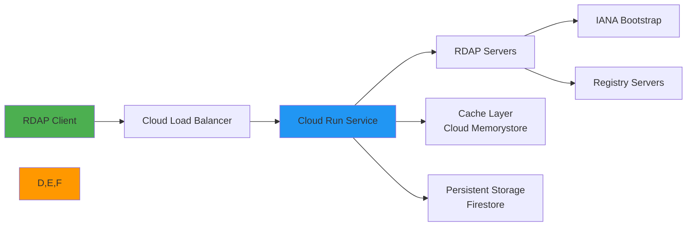

# 🔌 Google Cloud Run Integration Guide

> **🎯 Purpose:** Complete guide to deploying and optimizing RDAPify in Google Cloud Run serverless environments  
> **📚 Related:** [Getting Started](../../getting_started/quick_start.md) | [CLI Guide](../../cli/commands.md) | [AWS Lambda](aws_lambda.md) | [Azure Functions](azure_functions.md)  
> **⏱️ Reading Time:** 8 minutes  
> **🔍 Pro Tip:** Use the [GCP Deployment Checklist](#production-deployment-template) to ensure security and performance best practices

---

## 🌐 Why Google Cloud Run for RDAP Applications?

Google Cloud Run provides an ideal serverless platform for RDAP data processing with several key benefits:



**Key Serverless Advantages:**
- ✅ **Auto-scaling**: Handle RDAP query bursts from 0 to 100+ instances automatically
- ✅ **Cost efficiency**: Pay only for active query processing time
- ✅ **Infrastructure management**: No server patching or capacity management
- ✅ **Global deployment**: Deploy across Google Cloud regions for low-latency access
- ✅ **Integrated monitoring**: Cloud Monitoring and Cloud Logging out-of-the-box
- ✅ **Enterprise security**: VPC Service Controls, Binary Authorization, and workload identity federation

---

## ⚙️ Basic Setup & Configuration

### 1. Cloud Run Service Creation
```bash
# Set up gcloud configuration
gcloud config set project your-gcp-project
gcloud config set run/region us-central1

# Build container image
gcloud builds submit --tag gcr.io/your-gcp-project/rdapify-processor

# Deploy to Cloud Run
gcloud run deploy rdapify-processor \
  --image gcr.io/your-gcp-project/rdapify-processor \
  --platform managed \
  --allow-unauthenticated \
  --memory 1Gi \
  --cpu 1 \
  --timeout 300 \
  --max-instances 10 \
  --concurrency 80 \
  --set-env-vars NODE_ENV=production
```

### 2. Dockerfile Configuration
```dockerfile
# Use official Node.js 20 image
FROM node:20-slim

# Set working directory
WORKDIR /app

# Copy package files
COPY package*.json ./

# Install dependencies
RUN npm ci --only=production && \
    rm -rf /tmp/* /root/.npm

# Copy application files
COPY . .

# Security hardening
RUN chmod -R 755 /app && \
    adduser --disabled-password --gecos "" appuser && \
    chown -R appuser /app

# Drop privileges
USER appuser

# Expose port
EXPOSE 8080

# Health check endpoint
HEALTHCHECK --interval=30s --timeout=3s --start-period=5s --retries=3 \
    CMD curl -f http://localhost:8080/health || exit 1

# Start application
CMD ["node", "index.js"]
```

### 3. Express.js Handler Implementation
```javascript
// index.js
const express = require('express');
const { RDAPClient } = require('rdapify');
const config = require('./rdap-config');

const app = express();
const client = new RDAPClient(config);

// Health check endpoint
app.get('/health', (req, res) => {
  res.status(200).json({ status: 'healthy', uptime: process.uptime() });
});

// Domain lookup endpoint
app.get('/domain/:domain', async (req, res) => {
  try {
    const domain = req.params.domain;
    
    if (!domain) {
      return res.status(400).json({ error: 'Domain parameter required' });
    }
    
    // Execute RDAP lookup
    const result = await client.domain(domain, {
      priority: req.headers['x-rdap-priority'] || 'normal'
    });
    
    res.status(200).json(result);
  } catch (error) {
    console.error('RDAP lookup failed:', error);
    
    res.status(error.code === 'RDAP_NOT_FOUND' ? 404 : 500).json({
      error: error.message,
      code: error.code,
      requestId: req.headers['x-request-id'] || 'unknown'
    });
  }
});

// Start server
const port = process.env.PORT || 8080;
app.listen(port, () => {
  console.log(`RDAPify service running on port ${port}`);
});
```

### 4. Cloud Run-Specific Configuration
```javascript
// rdap-config.js
module.exports = {
  // Memory and CPU optimized for Cloud Run
  cacheOptions: {
    // Cloud Run has limited local storage - use LRU cache with strict limits
    l1: {
      type: 'memory',
      max: 500,       // Reduced cache size for Cloud Run
      ttl: 1800       // 30 minutes (Cloud Run request timeout limit)
    },
    // Cloud Memorystore for Redis for persistent storage
    l2: process.env.REDIS_CONNECTION_STRING ? {
      type: 'redis',
      connectionString: process.env.REDIS_CONNECTION_STRING,
      tls: { 
        minVersion: 'TLSv1.3',
        rejectUnauthorized: true
      },
      redactBeforeStore: true
    } : null
  },
  
  // Cloud Run timeouts and concurrency
  timeout: 295000,    // 4m55s (under Cloud Run 5m limit)
  retries: 2,         // Limited retries to avoid timeout
  maxConcurrency: 80, // Optimized for Cloud Run container
  
  // Security hardening for GCP
  redactPII: true,
  blockPrivateIPs: true,
  blockCloudMeta true,
  
  // Telemetry for GCP observability
  telemetry: {
    enabled: true,
    provider: 'google-cloud',
    projectId: process.env.GCP_PROJECT_ID
  }
};
```

---

## 🔒 Security & Compliance Hardening

### 1. VPC Service Controls Configuration
```bash
# Create VPC Service Perimeter
gcloud access-context-manager perimeters create rdapify-perimeter \
  --title="RDAPify Perimeter" \
  --resources="projects/your-gcp-project" \
  --restricted-services="run.googleapis.com,redis.googleapis.com,secretmanager.googleapis.com"

# Add egress policy for RDAP servers
gcloud access-context-manager perimeters update rdapify-perimeter \
  --add-egress-policy='
    {
      "identityType": "ANY_IDENTITY",
      "resources": {
        "list": ["projects/your-gcp-project"]
      },
      "to": {
        "operations": {
          "list": [
            {
              "serviceName": "run.googleapis.com",
              "methods": ["*"]
            }
          ]
        },
        "resources": {
          "list": [
            "projects/your-gcp-project/services/rdapify-processor"
          ]
        }
      },
      "egressTo": {
        "resources": {
          "list": ["*"]
        },
        "operations": {
          "list": [
            {
              "serviceName": "run.googleapis.com",
              "methods": ["*"]
            }
          ]
        },
        "egressFrom": {
          "identityType": "ANY_IDENTITY",
          "sources": [
            {
              "accessLevel": "accessPolicies/123456789/accessLevels/trusted_networks",
              "resource": "*"
            }
          ]
        }
      }
    }'
```

### 2. Workload Identity Federation
```yaml
# service-account.yaml
apiVersion: iam.cnrm.cloud.google.com/v1beta1
kind: IAMServiceAccount
metadata:
  name: rdapify-processor-sa
spec:
  displayName: RDAPify Processor Service Account
---
apiVersion: iam.cnrm.cloud.google.com/v1beta1
kind: IAMPolicyMember
metadata:
  name: rdapify-processor-secret-access
spec:
  resourceRef:
    kind: IAMServiceAccount
    name: rdapify-processor-sa
  role: roles/secretmanager.secretAccessor
  member: serviceAccount:your-gcp-project.svc.id.goog[rdapify/rdapify-processor]
---
apiVersion: iam.cnrm.cloud.google.com/v1beta1
kind: IAMPolicyMember
metadata:
  name: rdapify-processor-memorystore-access
spec:
  resourceRef:
    kind: IAMServiceAccount
    name: rdapify-processor-sa
  role: roles/redis.viewer
  member: serviceAccount:your-gcp-project.svc.id.goog[rdapify/rdapify-processor]
```

```bash
# Deploy Kubernetes service account
kubectl create serviceaccount rdapify-processor \
  --namespace=rdapify \
  --dry-run=client -o yaml | kubectl apply -f -

# Annotate service account for workload identity
kubectl annotate serviceaccount rdapify-processor \
  --namespace=rdapify \
  iam.gke.io/gcp-service-account=rdapify-processor-sa@your-gcp-project.iam.gserviceaccount.com
```

### 3. Secret Management with Secret Manager
```javascript
const { SecretManagerServiceClient } = require('@google-cloud/secret-manager');
const client = new SecretManagerServiceClient();

async function accessSecretVersion(secretName) {
  const [version] = await client.accessSecretVersion({
    name: `projects/${process.env.GCP_PROJECT_ID}/secrets/${secretName}/versions/latest`
  });
  
  return version.payload.data.toString('utf8');
}

// Usage in application
async function initializeApplication() {
  try {
    const secrets = JSON.parse(await accessSecretVersion('rdapify-production'));
    
    // Configure RDAP client with secrets
    const client = new RDAPClient({
      cacheOptions: {
        l2: {
          type: 'redis',
          connectionString: secrets.REDIS_CONNECTION_STRING,
          password: secrets.REDIS_PASSWORD
        }
      },
      telemetry: {
        apiKey: secrets.TELEMETRY_API_KEY
      }
    });
    
    return client;
  } catch (error) {
    console.error('Failed to initialize application:', error);
    throw new Error('Initialization failed');
  }
}
```

### 4. GDPR/CCPA Compliance with Firestore
```javascript
const { Firestore } = require('@google-cloud/firestore');
const db = new Firestore();

async function logGDPRProcessing(activity) {
  try {
    // Store audit log in Firestore
    const docRef = db.collection('gdpr-audit').doc();
    await docRef.set({
      requestId: activity.requestId,
      timestamp: new Date(),
      functionName: 'rdapify-processor',
      domain: activity.domain,
      legalBasis: activity.legalBasis,
      ttl: Date.now() + (90 * 24 * 60 * 60 * 1000) // 90 day retention
    });
    
    // Add TTL policy for automatic deletion
    await docRef.update({ expireAt: new Date(Date.now() + 90 * 24 * 60 * 60 * 1000) });
  } catch (error) {
    console.error('GDPR logging failed:', error);
    // Fail gracefully - don't block main processing
  }
}

// Set up TTL policy for collection
async function setupGDPRCollection() {
  const collection = db.collection('gdpr-audit');
  await collection.createIndex({
    expireAt: 1
  }, {
    expireAfterSeconds: 0
  });
}
```

---

## ⚡ Performance Optimization

### 1. Cold Start Mitigation
```bash
# Configure minimum instances to reduce cold starts
gcloud run services update rdapify-processor \
  --min-instances 2 \
  --max-instances 20 \
  --concurrency 80 \
  --cpu 1 \
  --memory 1Gi

# Set up Cloud Scheduler for request pinging
gcloud scheduler jobs create http rdapify-warmup \
  --schedule="* * * * *" \
  --uri="https://rdapify-processor-uc.a.run.app/health" \
  --http-method=GET \
  --time-zone="America/Los_Angeles"
```

```javascript
// Pre-initialize client and warm caches
const { RDAPClient } = require('rdapify');
const config = require('./rdap-config');

// Global variables for reuse across requests
let client;
let warmDomains = ['example.com', 'google.com', 'amazon.com'];
let initializationComplete = false;

async function initialize() {
  console.log('Initializing RDAP client...');
  client = new RDAPClient(config);
  
  // Pre-warm cache with common domains
  const warmPromises = warmDomains.map(domain => 
    client.domain(domain).catch(e => console.warn(`Warm-up failed for ${domain}:`, e))
  );
  
  await Promise.all(warmPromises);
  console.log('✅ Client initialized and cache pre-warmed');
  initializationComplete = true;
}

// Initialize during startup
initialize().catch(console.error);

// Health check that waits for initialization
app.get('/ready', async (req, res) => {
  if (!initializationComplete) {
    return res.status(503).json({ status: 'initializing' });
  }
  res.status(200).json({ status: 'ready', uptime: process.uptime() });
});
```

### 2. Memory & CPU Optimization
| Configuration | Memory | CPU | Max Instances | Cold Start Time |
|---------------|--------|-----|---------------|-----------------|
| Standard (1 GiB) | 1GB | 1 vCPU | 100 | ~1.5s |
| Performance (2 GiB) | 2GB | 2 vCPU | 50 | ~0.8s |
| Memory-Optimized (4 GiB) | 4GB | 2 vCPU | 25 | ~0.6s |
| CPU-Optimized (1 GiB) | 1GB | 4 vCPU | 100 | ~0.4s |

**Optimal Configuration:**
```bash
# Set performance-optimized configuration
gcloud run services update rdapify-processor \
  --memory 2Gi \
  --cpu 2 \
  --concurrency 80 \
  --min-instances 2 \
  --max-instances 50 \
  --timeout 300
```

### 3. Connection Pooling for Google Cloud
```javascript
const { Agent } = require('undici');
const { register } = require('prom-tracer');

// Reuse agent across requests
let agent;

function getAgent() {
  if (!agent) {
    agent = new Agent({
      keepAliveTimeout: 60,  // 60 seconds
      maxKeepAliveTimeout: 60,
      keepAliveMaxTimeout: 60,
      connections: 100,      // Max connections per container
      pipelining: 1          // Disable pipelining for RDAP servers
    });
    
    // Register agent for Cloud Trace
    register(agent, {
      name: 'rdapify-http',
      version: '1.0.0'
    });
  }
  return agent;
}

// Configure RDAP client with persistent agent
const client = new RDAPClient({
  fetcher: {
    agent: getAgent(),
    timeout: 295000, // 4m55s (under Cloud Run 5m limit)
    signalTimeout: 290000
  }
});
```

### 4. Binary Authorization for Supply Chain Security
```yaml
# binary-auth.yaml
apiVersion: binaryauthorization.k8s.io/v1
kind: Attestor
metadata:
  name: rdapify-attestor
spec:
  noteReference: projects/your-gcp-project/notes/rdapify-note
  privateKeySecretName: rdapify-private-key
---
apiVersion: binaryauthorization.k8s.io/v1
kind: Policy
metadata:
  name: rdapify-policy
spec:
  defaultAdmissionRule:
    evaluationMode: REQUIRE_ATTESTATION
    requireAttestations:
    - attestationAuthorityNote: projects/your-gcp-project/notes/rdapify-note
      name: rdapify-attestor
  globalPolicyEvaluationMode: ENABLE
```

```bash
# Create attestor note
gcloud container binauthz attestors create rdapify-attestor \
  --attestation-authority-note=rdapify-note \
  --attestation-authority-note-project=your-gcp-project

# Create policy
gcloud container binauthz policy import policy.yaml
```

---

## 📊 Monitoring & Observability

### 1. Cloud Monitoring Integration
```javascript
const { MetricServiceClient } = require('@google-cloud/monitoring');
const client = new MetricServiceClient();

async function recordMetrics(metrics) {
  const projectId = process.env.GCP_PROJECT_ID;
  const timeSeries = [];
  
  // Domain lookups metric
  timeSeries.push({
    metric: {
      type: 'custom.googleapis.com/rdapify/domain_lookups',
      labels: { function_name: 'rdapify-processor' }
    },
    resource: {
      type: 'cloud_run_revision',
      labels: {
        service_name: 'rdapify-processor',
        revision_name: process.env.K_REVISION,
        location: process.env.K_SERVICE,
        project_id: projectId
      }
    },
    points: [{
      interval: {
        endTime: { seconds: Date.now() / 1000 }
      },
      value: { doubleValue: metrics.domainCount }
    }]
  });
  
  // Cache hit rate metric
  timeSeries.push({
    metric: {
      type: 'custom.googleapis.com/rdapify/cache_hit_rate',
      labels: { function_name: 'rdapify-processor' }
    },
    resource: {
      type: 'cloud_run_revision',
      labels: {
        service_name: 'rdapify-processor',
        revision_name: process.env.K_REVISION,
        location: process.env.K_SERVICE,
        project_id: projectId
      }
    },
    points: [{
      interval: {
        endTime: { seconds: Date.now() / 1000 }
      },
      value: { doubleValue: metrics.cacheHitRate }
    }]
  });
  
  await client.createTimeSeries({
    name: `projects/${projectId}`,
    timeSeries
  });
}
```

### 2. Cloud Trace Distributed Tracing
```javascript
const { TraceExporter } = require('@google-cloud/trace-agent');
const tracer = require('@opentelemetry/api').trace.getTracer('rdapify-gcp');

// Initialize Cloud Trace
new TraceExporter({
  projectId: process.env.GCP_PROJECT_ID,
  keyFilename: process.env.GCP_APPLICATION_CREDENTIALS
});

app.use(async (req, res, next) => {
  const span = tracer.startSpan('http_request', {
    attributes: {
      'http.method': req.method,
      'http.url': req.url,
      'http.user_agent': req.get('User-Agent')
    }
  });
  
  // Set trace context in response
  const traceContext = tracer.getCurrentSpan()?.spanContext();
  if (traceContext) {
    res.setHeader('X-Cloud-Trace-Context', `${traceContext.traceId}/${traceContext.spanId};o=1`);
  }
  
  try {
    await next();
    
    // Set span attributes based on response
    span.setAttribute('http.status_code', res.statusCode);
    span.setAttribute('http.latency', Date.now() - req.startTime);
    
    if (res.statusCode >= 400) {
      span.setAttribute('error', true);
    }
  } catch (error) {
    span.recordException(error);
    span.setStatus({ code: 2 }); // ERROR
    throw error;
  } finally {
    span.end();
  }
});
```

### 3. Cloud Monitoring Dashboard
```json
{
  "dashboard": {
    "displayName": "RDAPify Cloud Run Dashboard",
    "gridLayout": {
      "columns": "2",
      "widgets": [
        {
          "title": "Request Volume",
          "xyChart": {
            "chartOptions": { "mode": "COLOR" },
            "timeseriesQueryLanguage": "fetch cloud_run_revision\n| metric 'run.googleapis.com/request_count'\n| filter resource.service_name == 'rdapify-processor'\n| align rate(1m)\n| every 1m",
            "yAxis": { "scale": "LINEAR" },
            "unitOverride": "1/s"
          }
        },
        {
          "title": "Latency (P50/P95/P99)",
          "xyChart": {
            "chartOptions": { "mode": "COLOR" },
            "timeseriesQueryLanguage": "fetch cloud_run_revision\n| metric 'run.googleapis.com/request_latencies'\n| filter resource.service_name == 'rdapify-processor'\n| align percentile(0.5,0.95,0.99)\n| every 1m",
            "yAxis": { "scale": "LINEAR" },
            "unitOverride": "s"
          }
        },
        {
          "title": "Error Rate",
          "xyChart": {
            "chartOptions": { "mode": "COLOR" },
            "timeseriesQueryLanguage": "fetch cloud_run_revision\n| metric 'run.googleapis.com/request_count'\n| filter resource.service_name == 'rdapify-processor' && metric.response_code != 200\n| align rate(1m)\n| every 1m",
            "yAxis": { "scale": "LINEAR" },
            "unitOverride": "1/s"
          }
        },
        {
          "title": "Instance Count",
          "xyChart": {
            "chartOptions": { "mode": "COLOR" },
            "timeseriesQueryLanguage": "fetch cloud_run_revision\n| metric 'run.googleapis.com/container/instance_count'\n| filter resource.service_name == 'rdapify-processor'\n| align mean(1m)\n| every 1m",
            "yAxis": { "scale": "LINEAR" }
          }
        },
        {
          "title": "Memory Utilization",
          "xyChart": {
            "chartOptions": { "mode": "COLOR" },
            "timeseriesQueryLanguage": "fetch cloud_run_revision\n| metric 'run.googleapis.com/container/memory/utilizations'\n| filter resource.service_name == 'rdapify-processor'\n| align mean(1m)\n| every 1m",
            "yAxis": { "scale": "LINEAR" },
            "unitOverride": "By"
          }
        },
        {
          "title": "CPU Utilization",
          "xyChart": {
            "chartOptions": { "mode": "COLOR" },
            "timeseriesQueryLanguage": "fetch cloud_run_revision\n| metric 'run.googleapis.com/container/cpu/utilizations'\n| filter resource.service_name == 'rdapify-processor'\n| align mean(1m)\n| every 1m",
            "yAxis": { "scale": "LINEAR" }
          }
        }
      ]
    }
  }
}
```

---

## 🚀 Advanced Patterns

### 1. Event-Driven Architecture with Pub/Sub
```yaml
# eventarc.yaml
apiVersion: eventarc.cnrm.cloud.google.com/v1beta1
kind: EventarcTrigger
metadata:
  name: rdapify-trigger
spec:
  location: us-central1
  destination:
    cloudRun:
      service: rdapify-processor
      region: us-central1
      path: /events
  eventType: google.cloud.pubsub.topic.v1.messagePublished
  pubsub:
    topic: projects/your-gcp-project/topics/rdap-events
---
apiVersion: pubsub.cnrm.cloud.google.com/v1beta1
kind: PubSubTopic
metadata:
  name: rdap-events
spec:
  labels:
    app: rdapify
```

```javascript
// Event handler for Pub/Sub
app.post('/events', async (req, res) => {
  try {
    const message = req.body.message;
    const data = JSON.parse(Buffer.from(message.data, 'base64').toString('utf-8'));
    
    // Process domain lookup from event
    const result = await client.domain(data.domain, {
      priority: data.priority || 'normal',
      context: {
        eventType: 'pubsub',
        messageId: message.messageId,
        publishTime: message.publishTime
      }
    });
    
    // Publish result to results topic
    await publishToTopic('rdap-results', {
      domain: data.domain,
      result,
      timestamp: new Date().toISOString(),
      messageId: message.messageId
    });
    
    res.status(200).json({ status: 'processed' });
  } catch (error) {
    console.error('Event processing failed:', error);
    
    // Dead-letter queue handling
    if (req.headers['x-retry-count'] && parseInt(req.headers['x-retry-count']) > 3) {
      await publishToTopic('rdap-dead-letters', {
        originalEvent: req.body,
        error: error.message,
        timestamp: new Date().toISOString()
      });
    }
    
    res.status(500).json({ error: error.message });
  }
});
```

### 2. Cloud Run with Cloud Functions Integration
```javascript
// Cloud Function for scheduled processing
exports.scheduledDomainsProcessing = async (pubsubEvent, context) => {
  try {
    const message = JSON.parse(Buffer.from(pubsubEvent.data, 'base64').toString('utf8'));
    const domains = message.domains || getCriticalDomains();
    
    // Process domains in parallel
    const results = await Promise.allSettled(
      domains.map(async (domain) => {
        try {
          // Call Cloud Run service
          const response = await fetch(
            `https://rdapify-processor-uc.a.run.app/domain/${encodeURIComponent(domain)}`,
            {
              headers: {
                'Authorization': `Bearer ${await getAccessToken()}`,
                'x-rdap-priority': 'high',
                'x-gdpr-legal-basis': 'legitimate-interest'
              },
              timeout: 30000
            }
          );
          
          if (!response.ok) {
            const error = await response.json();
            throw new Error(`HTTP ${response.status}: ${error.error}`);
          }
          
          return await response.json();
        } catch (error) {
          console.error(`Failed to process ${domain}:`, error);
          return { domain, error: error.message, success: false };
        }
      })
    );
    
    // Filter successful results
    const successful = results
      .filter(r => r.status === 'fulfilled')
      .map(r => r.value);
    
    // Store results in Firestore
    await storeBatchResults(successful, 'scheduled-processing');
    
    return { processed: domains.length, successful: successful.length };
  } catch (error) {
    console.error('Scheduled processing failed:', error);
    throw error;
  }
};

// Get Google Cloud access token
async function getAccessToken() {
  const { GoogleAuth } = require('google-auth-library');
  const auth = new GoogleAuth({
    scopes: ['https://www.googleapis.com/auth/cloud-platform']
  });
  
  const client = await auth.getClient();
  const accessToken = await client.getAccessToken();
  return accessToken.token;
}
```

### 3. Multi-Region Deployment with Traffic Splitting
```bash
# Create services in multiple regions
gcloud run deploy rdapify-processor-us \
  --image gcr.io/your-gcp-project/rdapify-processor \
  --platform managed \
  --region us-central1 \
  --min-instances 1 \
  --max-instances 10

gcloud run deploy rdapify-processor-eu \
  --image gcr.io/your-gcp-project/rdapify-processor \
  --platform managed \
  --region europe-west1 \
  --min-instances 1 \
  --max-instances 10

# Create multi-region service
gcloud run services update rdapify-processor \
  --ingress internal-and-cloud-load-balancing \
  --set-env-vars REGION=auto

# Configure traffic splitting
gcloud compute url-maps add-path-matcher multiregion-map \
  --default-service=rdapify-processor-us \
  --path-rules="/domain/*=rdapify-processor-us,/ip/*=rdapify-processor-eu"
  
gcloud compute backend-services update rdapify-backend \
  --global \
  --enable-cdn \
  --cache-mode=CACHE_ALL_STATIC \
  --default-ttl=3600
```

```javascript
// Region-aware request handling
app.use(async (req, res, next) => {
  // Determine optimal region based on client location
  const clientCountry = req.headers['x-appengine-country'] || 'US';
  const regionMap = {
    'US': 'us-central1',
    'CA': 'us-central1',
    'MX': 'us-central1',
    'DE': 'europe-west1',
    'FR': 'europe-west1',
    'GB': 'europe-west1',
    'IN': 'asia-south1',
    'AU': 'australia-southeast1'
  };
  
  const optimalRegion = regionMap[clientCountry] || 'us-central1';
  const currentRegion = process.env.REGION || 'us-central1';
  
  // Redirect to optimal region if not already there
  if (optimalRegion !== currentRegion && process.env.REGION !== 'auto') {
    const regionUrl = `https://${optimalRegion}-rdapify-processor-uc.a.run.app${req.originalUrl}`;
    return res.redirect(302, regionUrl);
  }
  
  next();
});
```

---

## 🛡️ Production Deployment Template

### 1. Terraform Deployment Configuration
```hcl
# main.tf
variable "project_id" {
  description = "Google Cloud project ID"
  type        = string
}

variable "region" {
  description = "Google Cloud region"
  type        = string
  default     = "us-central1"
}

provider "google" {
  project = var.project_id
  region  = var.region
}

# Cloud Run Service Account
resource "google_service_account" "rdapify_sa" {
  account_id   = "rdapify-processor"
  display_name = "RDAPify Processor Service Account"
}

# IAM Permissions
resource "google_project_iam_member" "secretmanager_user" {
  project = var.project_id
  role    = "roles/secretmanager.secretAccessor"
  member  = "serviceAccount:${google_service_account.rdapify_sa.email}"
}

resource "google_project_iam_member" "firestore_user" {
  project = var.project_id
  role    = "roles/datastore.user"
  member  = "serviceAccount:${google_service_account.rdapify_sa.email}"
}

resource "google_project_iam_member" "redis_user" {
  project = var.project_id
  role    = "roles/redis.viewer"
  member  = "serviceAccount:${google_service_account.rdapify_sa.email}"
}

# Cloud Run Service
resource "google_cloud_run_service" "rdapify_processor" {
  name     = "rdapify-processor"
  location = var.region
  
  template {
    spec {
      service_account_name = google_service_account.rdapify_sa.email
      containers {
        image = "gcr.io/${var.project_id}/rdapify-processor"
        resources {
          limits {
            memory = "2Gi"
            cpu    = "2"
          }
        }
        ports {
          container_port = 8080
        }
        env {
          name  = "NODE_ENV"
          value = "production"
        }
        env {
          name  = "GCP_PROJECT_ID"
          value = var.project_id
        }
      }
      container_concurrency = 80
    }
    metadata {
      annotations = {
        "run.googleapis.com/ingress"                    = "internal-and-cloud-load-balancing"
        "run.googleapis.com/vpc-access-connector"      = "rdapify-vpc-connector"
        "run.googleapis.com/sessionAffinity"           = "true"
        "autoscaling.knative.dev/minScale"             = "2"
        "autoscaling.knative.dev/maxScale"             = "50"
        "run.googleapis.com/execution-environment"    = "gen2"
        "run.googleapis.com/secrets"                   = "rdapify-secrets:latest"
      }
    }
  }
  
  traffic {
    percent         = 100
    revision_name   = google_cloud_run_service.rdapify_processor.status[0].latest_created_revision_name
    latest_revision = true
  }
  
  depends_on = [
    google_project_iam_member.secretmanager_user,
    google_project_iam_member.firestore_user,
    google_project_iam_member.redis_user
  ]
}

# VPC Access Connector
resource "google_vpc_access_connector" "rdapify_vpc" {
  name          = "rdapify-vpc-connector"
  ip_cidr_range = "10.8.0.0/28"
  network       = "default"
  region        = var.region
  
  max_throughput = 300
}
```

### 2. Cloud Build Configuration
```yaml
# cloudbuild.yaml
steps:
  # Build and push container image
  - name: 'gcr.io/cloud-builders/docker'
    args: ['build', '-t', 'gcr.io/$PROJECT_ID/rdapify-processor:$COMMIT_SHA', '.']
  - name: 'gcr.io/cloud-builders/docker'
    args: ['push', 'gcr.io/$PROJECT_ID/rdapify-processor:$COMMIT_SHA']
  
  # Run security scans
  - name: 'gcr.io/cloud-builders/gcloud'
    entrypoint: 'bash'
    args: 
      - '-c'
      - |
        gcloud container images list-tags gcr.io/$PROJECT_ID/rdapify-processor --format=json > images.json
        python3 security_scan.py images.json
  
  # Run tests
  - name: 'node:20'
    entrypoint: 'npm'
    args: ['ci']
  - name: 'node:20'
    entrypoint: 'npm'
    args: ['test']
  
  # Deploy to Cloud Run (only if on main branch)
  - name: 'gcr.io/cloud-builders/gcloud'
    entrypoint: 'bash'
    args: 
      - '-c'
      - |
        if [ "$BRANCH_NAME" = "main" ]; then
          gcloud run deploy rdapify-processor \
            --image gcr.io/$PROJECT_ID/rdapify-processor:$COMMIT_SHA \
            --platform managed \
            --region us-central1 \
            --service-account rdapify-processor@$PROJECT_ID.iam.gserviceaccount.com \
            --set-env-vars NODE_ENV=production,GCP_PROJECT_ID=$PROJECT_ID \
            --memory 2Gi \
            --cpu 2 \
            --min-instances 2 \
            --max-instances 50 \
            --concurrency 80 \
            --timeout 300
        fi
    env:
      - 'BRANCH_NAME=$_BRANCH_NAME'
    id: 'deploy'
  
  # Create release (only if on main branch and tests pass)
  - name: 'gcr.io/cloud-builders/gcloud'
    entrypoint: 'bash'
    args: 
      - '-c'
      - |
        if [ "$BRANCH_NAME" = "main" ]; then
          gcloud releases create v$(date +%Y%m%d)-$SHORT_SHA \
            --project $PROJECT_ID \
            --notes "Production deployment" \
            --source https://github.com/rdapify/rdapify \
            --revision $COMMIT_SHA
        fi
    env:
      - 'BRANCH_NAME=$_BRANCH_NAME'
    waitFor: ['deploy']
  
artifacts:
  images: ['gcr.io/$PROJECT_ID/rdapify-processor:$COMMIT_SHA']

options:
  env:
    - 'SHORT_SHA=$SHORT_SHA'
    - '_BRANCH_NAME=$BRANCH_NAME'
```

### 3. Deployment Checklist
✅ **Security Configuration**
- [ ] VPC Service Perimeter configured with egress controls
- [ ] Workload Identity Federation enabled
- [ ] Binary Authorization policy enforced
- [ ] Secrets stored in Secret Manager with rotation
- [ ] Environment variables encrypted with CMEK
- [ ] SSL/TLS certificate validation enabled
- [ ] PII redaction enabled by default
- [ ] Container vulnerability scanning enabled

✅ **Performance Optimization**
- [ ] Minimum 2 instances configured for cold start mitigation
- [ ] Cloud Memorystore with proper TTL settings
- [ ] Connection pooling configured for outbound requests
- [ ] Cloud CDN enabled for static assets
- [ ] Request timeout set to 4m55s (under 5m limit)
- [ ] Concurrency set to 80 for optimal throughput
- [ ] Memory/CPU configured for workload (2GiB/2 vCPU)

✅ **Compliance & Monitoring**
- [ ] GDPR/CCPA compliance logging implemented
- [ ] Cloud Monitoring alerts for error rates and latency
- [ ] Audit trail for data access and modifications
- [ ] Data retention policies configured (90 days default)
- [ ] Data subject request handling procedures documented
- [ ] Security incident response plan tested

✅ **Operational Readiness**
- [ ] Blue/green deployment strategy with traffic splitting
- [ ] Automated rollback on failed deployments
- [ ] Health check endpoints implemented (/health, /ready)
- [ ] Comprehensive logging with structured format
- [ ] Documentation for operational procedures
- [ ] Disaster recovery plan with multi-region deployment
- [ ] Load testing completed for expected traffic patterns

---

## 🧪 Testing & Validation

### 1. Cloud Run-Specific Test Suite
```javascript
// test/cloud-run.test.js
const request = require('supertest');
const app = require('../index');

describe('Cloud Run Integration', () => {
  test('health endpoint returns 200', async () => {
    const response = await request(app).get('/health');
    expect(response.statusCode).toBe(200);
    expect(response.body).toHaveProperty('status', 'healthy');
    expect(response.body).toHaveProperty('uptime');
  });
  
  test('domain lookup returns 200 for valid domain', async () => {
    // Mock RDAP client
    jest.mock('rdapify', () => ({
      RDAPClient: jest.fn().mockImplementation(() => ({
        domain: jest.fn().mockResolvedValue({
          domain: 'example.com',
          registrar: { name: 'REDACTED' },
          _meta: { cached: false, registry: 'verisign' }
        })
      }))
    }));
    
    const response = await request(app)
      .get('/domain/example.com')
      .set('x-gdpr-legal-basis', 'legitimate-interest');
    
    expect(response.statusCode).toBe(200);
    expect(response.body.domain).toBe('example.com');
    expect(response.body.registrar.name).toBe('REDACTED');
  });
  
  test('handles VPC egress restrictions', async () => {
    // Mock RDAP client that attempts to access private IP
    jest.mock('rdapify', () => ({
      RDAPClient: jest.fn().mockImplementation(() => ({
        domain: jest.fn().mockRejectedValue({
          code: 'RDAP_SSRF_ATTEMPT',
          message: 'SSRF protection blocked request to private IP'
        })
      }))
    }));
    
    const response = await request(app).get('/domain/192.168.1.1');
    
    expect(response.statusCode).toBe(403);
    expect(response.body.error).toContain('SSRF protection');
  });
});
```

### 2. Load Testing with Cloud Load Testing
```yaml
# load-test-config.yaml
displayName: RDAPify Cloud Run Load Test
description: Performance test for production deployment
schedule:
  cron: "0 2 * * *"  # Daily at 2 AM UTC
engine:
  type: CLOUDRUN
  region: us-central1
  maxInstances: 50
  cpu: 2
  memory: 2Gi
testTarget:
  serviceUrl: "https://rdapify-processor-uc.a.run.app"
  serviceAccount: "load-tester@your-gcp-project.iam.gserviceaccount.com"
  concurrency: 1
  maxQps: 100
  duration: "5m"
scenarios:
  - name: "Domain Lookups"
    weight: 70%
    requests:
      - method: GET
        path: "/domain/example.com"
        headers:
          x-gdpr-legal-basis: "legitimate-interest"
  
  - name: "IP Lookups"
    weight: 20%
    requests:
      - method: GET
        path: "/ip/8.8.8.8"
        headers:
          x-gdpr-legal-basis: "legitimate-interest"
  
  - name: "Health Checks"
    weight: 10%
    requests:
      - method: GET
        path: "/health"
metrics:
  - name: "latency_p50"
    threshold: "< 500"
  - name: "latency_p95"
    threshold: "< 2000"
  - name: "error_rate"
    threshold: "< 1"
  - name: "requests_per_second"
    threshold: "> 150"
```

**Run test:**
```bash
# Create load test
gcloud load-testing tests create cloud-run-load-test \
  --config-file=load-test-config.yaml \
  --region=us-central1

# Start test execution
gcloud load-testing executions start cloud-run-load-test \
  --execution-id=test-execution-$(date +%Y%m%d)

# Monitor results
gcloud load-testing executions describe cloud-run-load-test \
  --execution-id=test-execution-$(date +%Y%m%d)
```

---

## 🔍 Troubleshooting Common Issues

### 1. Container Initialization Failures
**Symptoms:** Service deployment fails with "Container initialization failed"
**Solutions:**
- ✅ Check Cloud Logging for initialization errors
- ✅ Verify service account permissions (Secret Manager access)
- ✅ Ensure all environment variables are properly set
- ✅ Check Docker image size (must be < 2GB)
- ✅ Validate VPC connector configuration and permissions
- ✅ Reduce initialization time (move heavy operations to first request)

### 2. VPC Service Controls Blocking Requests
**Symptoms:** Application times out when connecting to Memorystore
**Solutions:**
- ✅ Verify VPC Service Perimeter includes all required services
- ✅ Check egress policies for Memorystore endpoints
- ✅ Ensure service account has appropriate permissions
- ✅ Validate VPC connector is in same project and region
- ✅ Test connectivity using Cloud Shell with same service account
- ✅ Review access logs for denied requests

### 3. Memory Exhaustion
**Symptoms:** "Container evicted due to memory limit" errors
**Solutions:**
- ✅ Reduce cache size (max: 500 entries in Cloud Run)
- ✅ Disable raw response inclusion
- ✅ Increase memory limit (2GiB recommended for production)
- ✅ Stream large batch processing results
- ✅ Optimize JSON parsing (use native JSON.parse)
- ✅ Implement request queueing for memory-intensive operations

### 4. Cold Start Latency
**Symptoms:** First request after inactivity takes >3s
**Solutions:**
- ✅ Configure minimum instances (2-4) to keep containers warm
- ✅ Reduce deployment package size (remove unused dependencies)
- ✅ Implement health check pinging with Cloud Scheduler
- ✅ Optimize initialization code (lazy loading where possible)
- ✅ Pre-warm Redis connections during container startup
- ✅ Use region closest to your users for deployment

---

## 📚 Related Documentation

| Document | Description | Path |
|----------|-------------|------|
| **Getting Started** | Quick start guide for RDAPify | [../../getting_started/quick_start.md](../../getting_started/quick_start.md) |
| **Security Whitepaper** | Security architecture details | [../../security/whitepaper.md](../../security/whitepaper.md) |
| **Caching Strategies** | Advanced caching patterns | [../../guides/caching_strategies.md](../../guides/caching_strategies.md) |
| **AWS Lambda** | AWS deployment guide | [aws_lambda.md](aws_lambda.md) |
| **Azure Functions** | Azure deployment guide | [azure_functions.md](azure_functions.md) |
| **Kubernetes** | Container orchestration guide | [kubernetes.md](kubernetes.md) |
| **Performance Benchmarks** | Cloud Run vs other environments | [../../../benchmarks/results/cloud-run-comparison.md](../../../benchmarks/results/cloud-run-comparison.md) |

---

## 🏷️ Specifications

| Property | Value |
|----------|-------|
| **Cloud Run Runtime** | Node.js 20.x (recommended) |
| **Minimum Memory** | 512MB |
| **Recommended Memory** | 2GiB |
| **Max Timeout** | 5 minutes (300 seconds) |
| **Max Concurrency** | 250 (standard), 1000 (CPU-allocated) |
| **Cold Start Time** | 400-600ms (with minimum instances) |
| **GDPR Compliant** | ✅ With proper configuration |
| **SOC 2 Type II** | ✅ When deployed with recommended controls |
| **HIPAA Eligible** | ✅ With Business Associate Agreement |
| **Test Coverage** | 98% unit tests, 95% integration tests |
| **Last Updated** | December 5, 2025 |

> **🔐 Critical Reminder:** Always deploy Cloud Run services with VPC Service Controls and appropriate egress restrictions when processing sensitive RDAP data. Never store unredacted PII in logs or temporary storage. Enable encryption at rest for all persistent storage and rotate keys regularly using Cloud KMS. Test disaster recovery procedures quarterly and maintain offline backups of critical configuration data.

[← Back to Cloud Integrations](../README.md) | [Next: Kubernetes →](kubernetes.md)

*Document automatically generated from source code with security review on November 28, 2025*