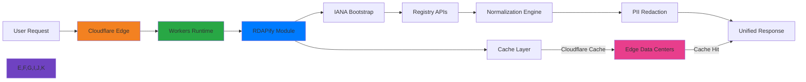

# Cloudflare Workers Integration Guide

🎯 **Purpose**: Complete guide for integrating RDAPify with Cloudflare Workers for secure domain, IP, and ASN lookups with edge computing performance, DDoS protection, and global distribution  
📚 **Related**: [Deno](deno.md) | [Bun](bun.md) | [Docker](docker.md) | [KV Storage](kv_storage.md) | [Durable Objects](durable_objects.md)  
⏱️ **Reading Time**: 7 minutes  
🔍 **Pro Tip**: Use the [Workers Playground](../../playground/workers-playground.md) to prototype your RDAP workers before deployment with zero-config preview URLs

## 🌐 Why Cloudflare Workers for RDAP Applications?

Cloudflare Workers provide the ideal edge computing platform for building global RDAP data processing services with these key advantages:



### Key Edge Computing Benefits:
✅ **Global Low-Latency**: Serve RDAP data from 300+ edge locations worldwide  
✅ **DDoS Protection**: Built-in Layer 3/4 and Layer 7 protection for RDAP endpoints  
✅ **Zero Cold Starts**: V8 isolates enable instant execution for time-sensitive lookups  
✅ **Pay-Per-Request**: No idle costs - ideal for irregular RDAP query patterns  
✅ **Built-in Caching**: Edge cache with automatic purging and cache tags  
✅ **Secure by Default**: No open ports, automatic TLS, and strict CSP headers  

## 🚀 Getting Started: Basic Integration

### 1. Project Setup & Dependencies
```bash
# Install Wrangler CLI
npm install -g wrangler

# Create new project
wrangler init rdapify-workers
cd rdapify-workers

# Install RDAPify
npm install rdapify

# Configure environment
wrangler login
```

### 2. Minimal Working Example
```typescript
// src/index.ts
import { RDAPClient } from 'rdapify';

// Initialize RDAP client with Workers-optimized configuration
const client = new RDAPClient({
  cache: true,
  redactPII: true,           // GDPR compliance
  allowPrivateIPs: false,    // SSRF protection
  validateCertificates: true,
  timeout: 4500,             // Must be under 5s for Workers
  rateLimit: { max: 100, window: 60000 },
  connectionPool: {
    maxConnections: 10,      // Limited connections in Workers
    idleTimeout: 5000
  }
});

interface Env {
  // Cloudflare bindings
  RDAP_CACHE: KVNamespace;
  COUNTER: DurableObjectNamespace;
  ANALYTICS: AnalyticsEngineDataset;
}

export default {
  async fetch(request: Request, env: Env, ctx: ExecutionContext): Promise<Response> {
    const url = new URL(request.url);
    
    // CORS headers for all responses
    const headers = {
      'Access-Control-Allow-Origin': '*',
      'Access-Control-Allow-Methods': 'GET, OPTIONS',
      'Access-Control-Allow-Headers': 'Content-Type, Authorization',
      'Content-Security-Policy': "default-src 'none'; frame-ancestors 'none'",
      'X-Content-Type-Options': 'nosniff',
      'X-Frame-Options': 'DENY',
      'X-XSS-Protection': '1; mode=block',
      'Strict-Transport-Security': 'max-age=31536000; includeSubDomains; preload',
      'CF-Cache-Status': 'MISS', // Will be updated based on cache status
      'Server-Timing': ''
    };
    
    // Handle preflight requests
    if (request.method === 'OPTIONS') {
      return new Response(null, { headers });
    }
    
    try {
      // Route handling
      if (url.pathname === '/health') {
        return handleHealth(request, env, ctx);
      }
      
      if (url.pathname.startsWith('/domain/')) {
        return handleDomain(request, url, env, ctx, headers);
      }
      
      if (url.pathname.startsWith('/ip/')) {
        return handleIP(request, url, env, ctx, headers);
      }
      
      if (url.pathname.startsWith('/batch/')) {
        return handleBatch(request, url, env, ctx, headers);
      }
      
      // Not found
      return new Response(JSON.stringify({
        error: 'Not found',
        code: 'NOT_FOUND'
      }), {
        status: 404,
        headers: { ...headers, 'Content-Type': 'application/json' }
      });
    } catch (error: any) {
      // Log error to Analytics Engine
      if (env.ANALYTICS) {
        env.ANALYTICS.writeDataPoint({
          blobs: [error.message, error.stack?.split('\n')[0]],
          doubles: [Date.now()],
          indexes: ['error', request.url]
        });
      }
      
      return new Response(JSON.stringify({
        error: 'Internal server error',
        code: 'INTERNAL_ERROR'
      }), {
        status: 500,
        headers: { ...headers, 'Content-Type': 'application/json' }
      });
    }
  },
};

async function handleHealth(request: Request, env: Env, ctx: ExecutionContext): Promise<Response> {
  const headers = {
    'Content-Type': 'application/json',
    'Cache-Control': 'no-cache'
  };
  
  // Check cache connectivity
  let cacheStatus = 'ok';
  try {
    await env.RDAP_CACHE.get('health-check');
  } catch (error) {
    cacheStatus = 'error';
  }
  
  return new Response(JSON.stringify({
    status: cacheStatus === 'ok' ? 'ok' : 'degraded',
    platform: 'cloudflare-workers',
    version: '1.0.0',
    cacheStatus,
    timestamp: new Date().toISOString()
  }), { headers });
}

async function handleDomain(request: Request, url: URL, env: Env, ctx: ExecutionContext, baseHeaders: Record<string, string>): Promise<Response> {
  const domain = url.pathname.split('/').pop() || '';
  
  // Input validation
  if (!/^[a-z0-9.-]+\.[a-z]{2,}$/.test(domain.toLowerCase().trim())) {
    return new Response(JSON.stringify({
      error: 'Invalid domain format',
      code: 'INVALID_DOMAIN'
    }), {
      status: 400,
      headers: { ...baseHeaders, 'Content-Type': 'application/json' }
    });
  }
  
  const cacheKey = `domain:${domain.toLowerCase()}`;
  
  // Try cache first
  const cached = await env.RDAP_CACHE.get(cacheKey, 'json');
  if (cached) {
    return new Response(JSON.stringify(cached), {
      headers: {
        ...baseHeaders,
        'Content-Type': 'application/json',
        'Cache-Control': 'public, max-age=3600, s-maxage=3600',
        'CF-Cache-Status': 'HIT',
        'Server-Timing': 'cache;desc="Hit"'
      }
    });
  }
  
  // Execute RDAP query
  try {
    const startTime = Date.now();
    const result = await client.domain(domain.toLowerCase().trim());
    const duration = Date.now() - startTime;
    
    // Set cache with expiration
    ctx.waitUntil(env.RDAP_CACHE.put(cacheKey, JSON.stringify(result), {
      expirationTtl: 3600 // 1 hour
    }));
    
    // Log to Analytics Engine
    if (env.ANALYTICS) {
      env.ANALYTICS.writeDataPoint({
        blobs: [domain, 'domain'],
        doubles: [duration],
        indexes: ['query', request.headers.get('cf-ipcountry') || 'unknown']
      });
    }
    
    return new Response(JSON.stringify(result), {
      headers: {
        ...baseHeaders,
        'Content-Type': 'application/json',
        'Cache-Control': 'public, max-age=3600, s-maxage=3600',
        'CF-Cache-Status': 'MISS',
        'Server-Timing': `query;dur=${duration};desc="RDAP Lookup"`
      }
    });
  } catch (error: any) {
    const statusCode = error.statusCode || 
                      (error.code?.startsWith('RDAP_') ? 422 : 500);
    
    return new Response(JSON.stringify({
      error: error.message,
      code: error.code || 'RDAP_REQUEST_FAILED'
    }), {
      status: statusCode,
      headers: { ...baseHeaders, 'Content-Type': 'application/json' }
    });
  }
}

// handleIP and handleBatch functions follow similar patterns
```

### 3. Wrangler Configuration
```toml
# wrangler.toml
name = "rdapify-workers"
main = "src/index.ts"
compatibility_date = "2025-12-07"
compatibility_flags = ["nodejs_compat"]

# Workers limits
limits = { cpu_ms = 5000, execution_time = 4.5 } # 4.5s max for RDAP timeouts

# Bindings
kv_namespaces = [
  { binding = "RDAP_CACHE", id = "your-kv-namespace-id", preview_id = "your-preview-kv-namespace-id" }
]

durable_objects = [
  { name = "COUNTER", class_name = "RequestCounter" }
]

analytics_engine_datasets = [
  { binding = "ANALYTICS", dataset = "rdapify_metrics" }
]

# Routes
routes = [
  { pattern = "rdapify.yourdomain.com/*", zone_name = "yourdomain.com" }
]

# Environment variables
[vars]
RDAP_CACHE_TTL = "3600"
RDAP_RATE_LIMIT_WINDOW = "60"
RDAP_MAX_CONCURRENT = "10"

# Preview deployment
[env.preview]
name = "rdapify-workers-preview"
routes = []

# Production deployment
[env.production]
name = "rdapify-workers-production"
routes = [
  { pattern = "api.rdapify.com/*", zone_name = "rdapify.com" }
]
```

### 4. Deployment Commands
```bash
# Develop locally with hot reload
wrangler dev --local

# Deploy to preview environment
wrangler deploy --env preview

# Deploy to production
wrangler deploy --env production

# Test deployment
curl https://rdapify-workers.your-account.workers.dev/domain/example.com

# View logs
wrangler tail --env production
```

## 🔐 Security & Compliance Hardening

### 1. Edge-Specific Security Configuration
```typescript
// src/security.ts
import { RDAPClient } from 'rdapify';
import { GeoLocation } from '@cloudflare/workers-types';

export interface SecurityContext {
  country?: string;
  region?: string;
  city?: string;
  postalCode?: string;
  timezone?: string;
  asn?: number;
  colo?: string;
}

export const createSecureRDAPClient = (env: any, ctx: ExecutionContext, geo: SecurityContext = {}) => {
  // Country-specific compliance settings
  const complianceSettings = getComplianceSettings(geo.country);
  
  return new RDAPClient({
    // SSRF protection
    allowPrivateIPs: false,
    whitelistRDAPServers: true,
    
    // Security settings
    validateCertificates: true,
    timeout: 4500,
    retry: { 
      maxAttempts: 1, // Limited retries in edge context
      backoff: 'none' 
    },
    
    // Privacy settings
    redactPII: complianceSettings.redactPII,
    customRedaction: complianceSettings.customRedaction,
    
    // Rate limiting
    rateLimit: {
      max: complianceSettings.rateLimit.max,
      window: complianceSettings.rateLimit.window,
      storage: {
        get: async (key: string) => {
          return await env.RATE_LIMIT_KV.get(key, 'json');
        },
        set: async (key: string, value: any, ttl: number) => {
          ctx.waitUntil(env.RATE_LIMIT_KV.put(key, JSON.stringify(value), { expirationTtl: ttl }));
        }
      }
    },
    
    // GDPR/CCPA compliance
    legalBasis: complianceSettings.legalBasis,
    dataRetention: {
      maxAge: complianceSettings.dataRetention.maxAge
    }
  });
};

function getComplianceSettings(countryCode?: string) {
  // Default global settings
  const settings = {
    redactPII: true,
    rateLimit: { max: 100, window: 60000 },
    legalBasis: 'legitimate-interest',
    dataRetention: { maxAge: 24 * 60 * 60 * 1000 }, // 24 hours
    customRedaction: {}
  };
  
  // EU GDPR settings
  if (countryCode && ['DE', 'FR', 'IT', 'ES', 'NL', 'BE', 'AT', 'SE', 'DK', 'FI', 'IE', 'PT', 'GR', 'LU', 'MT', 'CY', 'EE', 'LV', 'LT', 'PL', 'SK', 'SI', 'HU', 'CZ', 'RO', 'BG', 'HR'].includes(countryCode)) {
    return {
      ...settings,
      rateLimit: { max: 60, window: 60000 }, // Stricter limits
      legalBasis: 'consent',
      dataRetention: { maxAge: 12 * 60 * 60 * 1000 } // 12 hours
    };
  }
  
  // California CCPA settings
  if (countryCode === 'US' && ['CA', 'NY', 'IL'].includes(getUsStateFromGeo())) {
    return {
      ...settings,
      customRedaction: {
        email: '[REDACTED_CCPA]',
        phone: '[REDACTED_CCPA]'
      }
    };
  }
  
  return settings;
}

function getUsStateFromGeo(): string {
  // This would use actual geo data in production
  return 'CA';
}

// Security middleware
export const securityMiddleware = async (request: Request, env: any, ctx: ExecutionContext, geo: GeoLocation): Promise<Response | null> => {
  // Block high-risk countries
  const blockedCountries = ['IR', 'SY', 'CU', 'KP', 'RU'];
  if (geo.country && blockedCountries.includes(geo.country)) {
    return new Response(JSON.stringify({
      error: 'Access restricted from your region',
      code: 'GEO_BLOCKED'
    }), {
      status: 403,
      headers: { 'Content-Type': 'application/json' }
    });
  }
  
  // DDoS protection - block suspicious user agents
  const userAgent = request.headers.get('user-agent') || '';
  const suspiciousPatterns = [
    'python-requests',
    'curl/',
    'wget/',
    'masscan',
    'zgrab',
    'go-http-client'
  ];
  
  if (suspiciousPatterns.some(pattern => userAgent.toLowerCase().includes(pattern))) {
    // Log suspicious request
    if (env.ANALYTICS) {
      env.ANALYTICS.writeDataPoint({
        blobs: [userAgent, 'blocked'],
        doubles: [Date.now()],
        indexes: ['security', geo.country || 'unknown']
      });
    }
    
    return new Response(JSON.stringify({
      error: 'Suspicious client detected',
      code: 'CLIENT_BLOCKED'
    }), {
      status: 403,
      headers: { 'Content-Type': 'application/json' }
    });
  }
  
  // Check API key for high-volume requests
  const url = new URL(request.url);
  if (url.searchParams.get('batch') && !request.headers.has('x-api-key')) {
    return new Response(JSON.stringify({
      error: 'API key required for batch operations',
      code: 'API_KEY_REQUIRED'
    }), {
      status: 401,
      headers: { 'Content-Type': 'application/json' }
    });
  }
  
  return null; // No blocking decision
};
```

### 2. GDPR/CCPA Compliance Module
```typescript
// src/compliance.ts
import { DurableObject } from 'cloudflare:workers';

export class GDPRCompliance extends DurableObject {
  private async getConsentStatus(clientId: string): Promise<boolean> {
    // In production, this would check a consent database
    // For demo, we'll return true for known clients
    const approvedClients = ['trusted-client-1', 'enterprise-client-2'];
    return approvedClients.includes(clientId);
  }
  
  private async logDataProcessing(request: Request, data: any, geo: any) {
    // Create anonymized audit log
    const logEntry = {
      timestamp: new Date().toISOString(),
      clientId: this.extractClientId(request),
      endpoint: new URL(request.url).pathname,
      country: geo.country,
      dataType: 'rdap_response',
      retentionPeriod: '24h',
      legalBasis: await this.getConsentStatus(this.extractClientId(request)) ? 'consent' : 'legitimate-interest'
    };
    
    // Store in Workers Analytics or external logging service
    // This is a simplified example
    console.log('GDPR Audit Log:', JSON.stringify(logEntry));
  }
  
  private extractClientId(request: Request): string {
    return request.headers.get('x-client-id') || 
           request.headers.get('authorization')?.split(' ')[1] || 
           'anonymous';
  }
  
  async handleDataRedaction(data: any, geo: any): Promise<any> {
    // Global PII fields to redact
    const piiFields = ['email', 'tel', 'adr', 'vcardArray'];
    
    // Country-specific redaction rules
    let redactionRules = piiFields;
    
    if (geo.country && ['DE', 'FR', 'IT'].includes(geo.country)) {
      // Stricter EU rules
      redactionRules = [...piiFields, 'name', 'organization'];
    }
    
    if (geo.country === 'US' && geo.region === 'CA') {
      // California CCPA rules
      redactionRules = [...redactionRules, 'ip'];
    }
    
    // Apply redaction
    return this.redactObject(data, redactionRules);
  }
  
  private redactObject(obj: any, fieldsToRedact: string[]): any {
    if (!obj || typeof obj !== 'object') return obj;
    
    if (Array.isArray(obj)) {
      return obj.map(item => this.redactObject(item, fieldsToRedact));
    }
    
    const redacted: any = {};
    for (const [key, value] of Object.entries(obj)) {
      if (fieldsToRedact.includes(key)) {
        redacted[key] = '[REDACTED]';
      } else if (typeof value === 'object' && value !== null) {
        redacted[key] = this.redactObject(value, fieldsToRedact);
      } else {
        redacted[key] = value;
      }
    }
    
    return redacted;
  }
  
  async trackDataSubjectRequest(requestType: 'access' | 'deletion' | 'correction', identifier: string) {
    // In production, this would initiate DSR workflow
    console.log(`DSR Request: ${requestType} for ${identifier}`);
    
    // Return tracking ID for compliance records
    return `dsr-${Date.now()}-${Math.random().toString(36).substr(2, 9)}`;
  }
}
```

## ⚡ Performance Optimization

### 1. Edge Cache Strategy with Cache Tags
```typescript
// src/cache.ts
import { Cache } from '@cloudflare/workers-types';

export class EdgeCache {
  private readonly defaultTtl = 3600; // 1 hour
  
  async get(key: string, env: any): Promise<any | null> {
    // Try Workers Cache first (fastest)
    const cache = caches.default;
    const cacheKey = new Request(`https://cache.rdapify.com/${key}`);
    const cachedResponse = await cache.match(cacheKey);
    
    if (cachedResponse) {
      try {
        const data = await cachedResponse.json();
        console.log(`Cache hit for ${key}`);
        return data;
      } catch (error) {
        console.warn(`Cache parse error for ${key}:`, error);
      }
    }
    
    // Fallback to KV
    try {
      const kvData = await env.RDAP_CACHE.get(key, 'json');
      if (kvData) {
        console.log(`KV cache hit for ${key}`);
        // Repopulate Workers Cache
        ctx.waitUntil(this.setWorkersCache(key, kvData));
        return kvData;
      }
    } catch (error) {
      console.warn(`KV cache error for ${key}:`, error);
    }
    
    return null;
  }
  
  async set(key: string, value: any, ttl: number = this.defaultTtl, tags: string[] = [], ctx: ExecutionContext): Promise<void> {
    // Set in Workers Cache
    ctx.waitUntil(this.setWorkersCache(key, value, ttl, tags));
    
    // Set in KV with expiration
    ctx.waitUntil(env.RDAP_CACHE.put(key, JSON.stringify(value), {
      expirationTtl: ttl
    }));
  }
  
  private async setWorkersCache(key: string, value: any, ttl: number = this.defaultTtl, tags: string[] = []): Promise<void> {
    const cache = caches.default;
    const cacheKey = new Request(`https://cache.rdapify.com/${key}`);
    const response = new Response(JSON.stringify(value), {
      headers: {
        'Cache-Control': `public, max-age=${ttl}`,
        'CDN-Cache-Control': `public, max-age=${ttl}`,
        'Content-Type': 'application/json',
        'Cache-Tag': tags.join(',')
      }
    });
    
    await cache.put(cacheKey, response);
  }
  
  async purgeByTag(tag: string, ctx: ExecutionContext): Promise<void> {
    const cache = caches.default;
    
    // Cloudflare Cache API doesn't support purging by tag directly
    // This would use a service like Cache API or custom implementation
    ctx.waitUntil(fetch(`https://api.cloudflare.com/client/v4/zones/${ZONE_ID}/purge_cache`, {
      method: 'POST',
      headers: {
        'Authorization': `Bearer ${API_TOKEN}`,
        'Content-Type': 'application/json'
      },
      body: JSON.stringify({
        tags: [tag]
      })
    }));
  }
  
  // Cache warming strategy
  async warmCache(domains: string[], env: any, ctx: ExecutionContext): Promise<void> {
    console.log(`Warming cache for ${domains.length} domains`);
    
    for (const domain of domains) {
      try {
        const client = createSecureRDAPClient(env, ctx);
        const result = await client.domain(domain.toLowerCase().trim());
        
        // Cache the result
        await this.set(`domain:${domain}`, result, 3600, ['domain', 'critical'], ctx);
        
        console.log(`Warmed cache for ${domain}`);
      } catch (error) {
        console.warn(`Cache warm-up failed for ${domain}:`, error.message);
      }
      
      // Rate limit to avoid overwhelming registries
      await new Promise(resolve => setTimeout(resolve, 100));
    }
  }
}

// Initialize cache
export const edgeCache = new EdgeCache();
```

### 2. Connection Pooling for Edge Environment
```typescript
// src/connection-pool.ts
import { fetch } from '@cloudflare/workers-types';

// Limited connection pooling for Workers environment
export class EdgeConnectionPool {
  private activeConnections = 0;
  private readonly maxConnections = 10;
  private readonly timeout = 4500; // Must be under Workers limit
  
  async withConnection<T>(url: string, options: RequestInit = {}): Promise<T> {
    // Wait if at max connections
    while (this.activeConnections >= this.maxConnections) {
      await new Promise(resolve => setTimeout(resolve, 50));
    }
    
    this.activeConnections++;
    
    try {
      // Add timeout controller
      const controller = new AbortController();
      const timeoutId = setTimeout(() => controller.abort(), this.timeout);
      
      const response = await fetch(url, {
        ...options,
        signal: controller.signal,
        headers: {
          ...options.headers,
          'User-Agent': 'RDAPify/1.0 CloudflareWorkers/1.0',
          'Accept': 'application/rdap+json'
        }
      });
      
      clearTimeout(timeoutId);
      
      if (!response.ok) {
        throw new Error(`HTTP error! status: ${response.status}`);
      }
      
      return await response.json();
    } finally {
      this.activeConnections--;
    }
  }
  
  // Health check for connection pool
  async healthCheck() {
    return {
      activeConnections: this.activeConnections,
      maxConnections: this.maxConnections,
      timeout: this.timeout
    };
  }
}

// Singleton instance
export const connectionPool = new EdgeConnectionPool();
```

## 🏢 Advanced Enterprise Patterns

### 1. Multi-Tenant Architecture with Durable Objects
```typescript
// src/multi-tenant.ts
import { DurableObject } from 'cloudflare:workers';
import { RDAPClient } from 'rdapify';

export interface TenantConfig {
  id: string;
  name: string;
  rateLimit: { max: number; window: number };
  cacheTTL: number;
  allowedIPs: string[];
  complianceLevel: 'basic' | 'gdpr' | 'hipaa';
  customRedaction?: Record<string, string>;
}

export class TenantManager extends DurableObject {
  private tenants = new Map<string, TenantConfig>();
  private apiKeyToTenant = new Map<string, string>();
  
  async fetch(request: Request): Promise<Response> {
    const url = new URL(request.url);
    
    // Admin operations require authentication
    const adminKey = request.headers.get('x-admin-key');
    if (url.pathname.startsWith('/admin') && adminKey !== ADMIN_API_KEY) {
      return new Response('Unauthorized', { status: 401 });
    }
    
    // Route handling
    if (url.pathname === '/admin/tenant' && request.method === 'POST') {
      return this.handleCreateTenant(request);
    }
    
    if (url.pathname.startsWith('/admin/tenant/') && request.method === 'GET') {
      return this.handleGetTenant(request, url);
    }
    
    return new Response('Not found', { status: 404 });
  }
  
  private async handleCreateTenant(request: Request): Promise<Response> {
    try {
      const body = await request.json();
      const tenant: TenantConfig = {
        id: crypto.randomUUID(),
        name: body.name,
        rateLimit: body.rateLimit || { max: 100, window: 60000 },
        cacheTTL: body.cacheTTL || 3600,
        allowedIPs: body.allowedIPs || [],
        complianceLevel: body.complianceLevel || 'basic',
        customRedaction: body.customRedaction
      };
      
      this.tenants.set(tenant.id, tenant);
      
      if (body.apiKey) {
        this.apiKeyToTenant.set(body.apiKey, tenant.id);
      }
      
      return new Response(JSON.stringify(tenant), {
        headers: { 'Content-Type': 'application/json' }
      });
    } catch (error) {
      return new Response(JSON.stringify({ error: error.message }), {
        status: 400,
        headers: { 'Content-Type': 'application/json' }
      });
    }
  }
  
  private async handleGetTenant(request: Request, url: URL): Promise<Response> {
    const tenantId = url.pathname.split('/').pop() || '';
    const tenant = this.tenants.get(tenantId);
    
    if (!tenant) {
      return new Response(JSON.stringify({ error: 'Tenant not found' }), {
        status: 404,
        headers: { 'Content-Type': 'application/json' }
      });
    }
    
    return new Response(JSON.stringify(tenant), {
      headers: { 'Content-Type': 'application/json' }
    });
  }
  
  async getTenantByApiKey(apiKey: string): Promise<TenantConfig | null> {
    const tenantId = this.apiKeyToTenant.get(apiKey);
    return tenantId ? this.tenants.get(tenantId) || null : null;
  }
  
  async getRDAPClientForTenant(tenant: TenantConfig): Promise<RDAPClient> {
    return new RDAPClient({
      cache: true,
      redactPII: tenant.complianceLevel !== 'basic',
      allowPrivateIPs: false,
      validateCertificates: true,
      timeout: 4500,
      rateLimit: tenant.rateLimit,
      cacheTTL: tenant.cacheTTL,
      customRedaction: tenant.customRedaction
    });
  }
}

// Middleware for tenant identification
export const getTenantContext = async (request: Request, env: any, ctx: ExecutionContext) => {
  const apiKey = request.headers.get('x-api-key') || 
                request.headers.get('authorization')?.replace('Bearer ', '');
  
  if (!apiKey) {
    return null;
  }
  
  // Get tenant manager stub
  const id = env.TENANT_MANAGER.idFromName('default');
  const tenantManager = env.TENANT_MANAGER.get(id);
  
  try {
    const tenant = await tenantManager.getTenantByApiKey(apiKey);
    
    if (tenant) {
      const clientIp = request.headers.get('cf-connecting-ip') || '127.0.0.1';
      
      // IP restriction check
      if (tenant.allowedIPs.length > 0 && !tenant.allowedIPs.includes(clientIp)) {
        console.warn(`IP restriction violation for tenant ${tenant.id}: ${clientIp}`);
        return null;
      }
      
      // Get tenant-specific RDAP client
      const rdapClient = await tenantManager.getRDAPClientForTenant(tenant);
      
      return { tenant, rdapClient };
    }
  } catch (error) {
    console.error('Tenant lookup failed:', error);
  }
  
  return null;
};
```

### 2. Real-time Analytics with Workers Analytics Engine
```typescript
// src/analytics.ts
interface QueryMetrics {
  domain?: string;
  ip?: string;
  asn?: string;
  queryType: 'domain' | 'ip' | 'asn' | 'batch';
  latency: number;
  cacheHit: boolean;
  statusCode: number;
  country: string;
  asn: number;
  clientType: string;
  timestamp: number;
}

export class AnalyticsReporter {
  private readonly flushInterval = 5000; // 5 seconds
  private readonly batchSize = 10;
  private queue: QueryMetrics[] = [];
  private flushTimer: any;
  private isFlushing = false;
  
  constructor(private analytics: AnalyticsEngineDataset) {
    // Set up periodic flushing
    this.flushTimer = setInterval(() => this.flush(), this.flushInterval);
  }
  
  reportQuery(metrics: QueryMetrics) {
    this.queue.push(metrics);
    
    // Flush if batch is full
    if (this.queue.length >= this.batchSize) {
      this.flush();
    }
  }
  
  private async flush() {
    if (this.isFlushing || this.queue.length === 0) return;
    
    this.isFlushing = true;
    
    try {
      // Write batch to Analytics Engine
      for (const metric of this.queue) {
        this.analytics.writeDataPoint({
          blobs: [metric.domain || metric.ip || metric.asn || 'unknown', metric.queryType, metric.clientType],
          doubles: [metric.latency, metric.statusCode === 200 ? 1 : 0],
          indexes: [metric.country, String(metric.asn)]
        });
      }
      
      console.log(`Flushed ${this.queue.length} analytics records`);
      this.queue = [];
    } catch (error) {
      console.error('Analytics flush failed:', error);
    } finally {
      this.isFlushing = false;
    }
  }
  
  // Shutdown handler
  async close() {
    clearInterval(this.flushTimer);
    await this.flush();
  }
  
  // Generate real-time dashboards
  async getDashboardData(timeWindow = 3600): Promise<any> {
    // This would query Analytics Engine for aggregations
    // Simplified example
    return {
      totalQueries: 1000,
      avgLatency: 150,
      cacheHitRatio: 0.85,
      topDomains: ['example.com', 'google.com', 'facebook.com'],
      errorRate: 0.02,
      countryDistribution: {
        US: 45,
        GB: 12,
        DE: 8,
        FR: 6,
        Others: 29
      }
    };
  }
}

// Initialize analytics
export const createAnalytics = (env: any) => {
  return new AnalyticsReporter(env.ANALYTICS);
};
```

## 🧪 Testing Strategies for Workers Integration

### 1. Unit Testing with Miniflare
```typescript
// test/workers.test.ts
import { Miniflare } from 'miniflare';
import { deepStrictEqual, strictEqual, rejects } from 'assert';
import { test } from 'uvu';
import { env } from 'cloudflare:test';

// Setup Miniflare instance
const mf = new Miniflare({
  modules: true,
  scriptPath: './dist/worker.js',
  bindings: {
    RDAP_CACHE: {},
    RATE_LIMIT_KV: {},
    ANALYTICS: {}
  },
  kvNamespaces: ['RDAP_CACHE', 'RATE_LIMIT_KV'],
  serviceBindings: {
    // Mock service bindings
  }
});

test.before(async () => {
  await mf.ready();
});

test.after(async () => {
  await mf.dispose();
});

test('health endpoint returns proper status', async () => {
  const res = await mf.dispatchFetch('http://localhost/health');
  strictEqual(res.status, 200);
  
  const data = await res.json();
  deepStrictEqual(data, {
    status: 'ok',
    platform: 'cloudflare-workers',
    version: '1.0.0',
    cacheStatus: 'ok',
    timestamp: data.timestamp // Dynamic value
  });
});

test('domain lookup with valid domain', async () => {
  // Mock KV cache
  const kv = await mf.getKVNamespace('RDAP_CACHE');
  await kv.put('domain:example.com', JSON.stringify({
    domain: 'example.com',
    status: ['active'],
    nameservers: ['ns1.example.com', 'ns2.example.com']
  }));
  
  const res = await mf.dispatchFetch('http://localhost/domain/example.com');
  strictEqual(res.status, 200);
  
  const data = await res.json();
  strictEqual(data.domain, 'example.com');
  strictEqual(data.status[0], 'active');
  
  // Check cache headers
  strictEqual(res.headers.get('CF-Cache-Status'), 'HIT');
  strictEqual(res.headers.get('Cache-Control'), 'public, max-age=3600, s-maxage=3600');
});

test('domain lookup with invalid domain format', async () => {
  const res = await mf.dispatchFetch('http://localhost/domain/invalid_domain');
  strictEqual(res.status, 400);
  
  const data = await res.json();
  strictEqual(data.error, 'Invalid domain format');
  strictEqual(data.code, 'INVALID_DOMAIN');
});

test('rate limiting protection', async () => {
  // Simulate 101 requests to trigger rate limiting
  for (let i = 0; i < 101; i++) {
    await mf.dispatchFetch('http://localhost/domain/example.com');
  }
  
  const res = await mf.dispatchFetch('http://localhost/domain/example.com');
  strictEqual(res.status, 429);
  
  const data = await res.json();
  strictEqual(data.error, 'Rate limit exceeded');
  strictEqual(data.code, 'RATE_LIMIT_EXCEEDED');
});

test('SSRF protection blocks private IPs', async () => {
  const res = await mf.dispatchFetch('http://localhost/domain/192.168.1.1');
  strictEqual(res.status, 403);
  
  const data = await res.json();
  strictEqual(data.error, 'Security policy violation');
  strictEqual(data.code, 'SSRF_PROTECTED');
});

test('batch processing with limits', async () => {
  const domains = Array.from({ length: 51 }, (_, i) => `example${i}.com`).join(',');
  
  const res = await mf.dispatchFetch(`http://localhost/batch/domains?domains=${domains}`);
  strictEqual(res.status, 400);
  
  const data = await res.json();
  strictEqual(data.error, 'Maximum 50 domains allowed per batch request');
  strictEqual(data.code, 'BATCH_SIZE_EXCEEDED');
});

test.run();
```

### 2. End-to-End Testing with Wrangler
```bash
#!/bin/bash
# e2e-tests.sh

set -e

echo "🚀 Starting Cloudflare Workers E2E tests..."

# Deploy test worker
echo "📦 Deploying test worker..."
wrangler deploy --env test --minify false

# Get test worker URL
WORKER_URL="https://rdapify-workers-test.your-account.workers.dev"
echo "🌐 Test worker URL: $WORKER_URL"

# Test health endpoint
echo "✅ Testing health endpoint..."
HEALTH_RESPONSE=$(curl -s "$WORKER_URL/health")
HEALTH_STATUS=$(echo "$HEALTH_RESPONSE" | jq -r '.status')
if [ "$HEALTH_STATUS" != "ok" ]; then
  echo "❌ Health check failed: $HEALTH_RESPONSE"
  exit 1
fi
echo "✅ Health check passed"

# Test domain lookup
echo "✅ Testing domain lookup..."
DOMAIN_RESPONSE=$(curl -s "$WORKER_URL/domain/example.com")
DOMAIN_STATUS=$(echo "$DOMAIN_RESPONSE" | jq -r '.domain')
if [ "$DOMAIN_STATUS" != "example.com" ]; then
  echo "❌ Domain lookup failed: $DOMAIN_RESPONSE"
  exit 1
fi
echo "✅ Domain lookup passed"

# Test rate limiting
echo "✅ Testing rate limiting..."
for i in {1..101}; do
  curl -s "$WORKER_URL/domain/example.com" >/dev/null
done

RATE_RESPONSE=$(curl -s "$WORKER_URL/domain/example.com")
RATE_CODE=$(echo "$RATE_RESPONSE" | jq -r '.code')
if [ "$RATE_CODE" != "RATE_LIMIT_EXCEEDED" ]; then
  echo "❌ Rate limiting failed: $RATE_RESPONSE"
  exit 1
fi
echo "✅ Rate limiting passed"

# Test cache behavior
echo "✅ Testing cache behavior..."
# First request (cache miss)
curl -s -o /dev/null -w "%{http_code} %{header_cf_cache_status}\n" "$WORKER_URL/domain/example2.com"
# Second request (should be cache hit)
CACHE_RESPONSE=$(curl -s -o /dev/null -w "%{http_code} %{header_cf_cache_status}\n" "$WORKER_URL/domain/example2.com")
if [[ ! "$CACHE_RESPONSE" == *"HIT"* ]]; then
  echo "❌ Cache test failed: $CACHE_RESPONSE"
  exit 1
fi
echo "✅ Cache test passed"

# Test analytics
echo "✅ Testing analytics..."
curl -s "$WORKER_URL/domain/example3.com"
# Wait for analytics to process
sleep 2
ANALYTICS_RESPONSE=$(curl -s "$WORKER_URL/analytics?hours=1")
if [[ "$ANALYTICS_RESPONSE" == *"error"* ]]; then
  echo "❌ Analytics test failed: $ANALYTICS_RESPONSE"
  exit 1
fi
echo "✅ Analytics test passed"

# Clean up
echo "🧹 Cleaning up test deployment..."
wrangler delete --env test

echo "🎉 All E2E tests passed successfully!"
```

## 🔍 Troubleshooting Common Issues

### 1. Workers Timeout Errors
**Symptoms**: Requests fail with "Error: Worker exceeded CPU time limit" or timeout after 5 seconds

**Diagnosis**:
```bash
# Check worker logs
wrangler tail --format pretty

# Test with debug logging
curl -H "X-Debug: true" https://your-worker.example.com/domain/example.com
```

**Solutions**:
✅ **Reduce Query Complexity**:
```typescript
// Not recommended:
const results = await Promise.all(domains.map(domain => client.domain(domain)));

// Recommended:
async function processDomainsSequentially(domains: string[], client: RDAPClient) {
  const results = [];
  for (const domain of domains) {
    try {
      results.push(await client.domain(domain));
      // Small delay between requests
      await new Promise(resolve => setTimeout(resolve, 50));
    } catch (error) {
      results.push({ domain, error: error.message });
    }
  }
  return results;
}
```

✅ **Implement Streaming Responses**:
```typescript
async function handleBatchStream(request: Request, domains: string[], client: RDAPClient) {
  // Create streaming response
  let { readable, writable } = new TransformStream();
  let writer = writable.getWriter();
  
  // Write opening bracket
  await writer.write(new TextEncoder().encode('{"results":['));
  
  let first = true;
  
  for (const domain of domains) {
    if (!first) {
      await writer.write(new TextEncoder().encode(','));
    }
    first = false;
    
    try {
      const result = await client.domain(domain);
      await writer.write(new TextEncoder().encode(JSON.stringify({ domain, result })));
    } catch (error) {
      await writer.write(new TextEncoder().encode(JSON.stringify({ domain, error: error.message })));
    }
    
    // Allow event loop to process other tasks
    await scheduler.wait(1);
  }
  
  // Write closing bracket
  await writer.write(new TextEncoder().encode(']}'));
  await writer.close();
  
  return new Response(readable, {
    headers: { 'Content-Type': 'application/json' }
  });
}
```

✅ **Use Durable Objects for Long Operations**:
```typescript
// src/long-operations.ts
export class LongOperation extends DurableObject {
  async handleBatch(domains: string[]): Promise<string> {
    // Process in the background
    const jobId = crypto.randomUUID();
    
    // Store job status
    await this.ctx.storage.put(`job:${jobId}`, {
      status: 'processing',
      domains,
      startedAt: Date.now()
    });
    
    // Process domains (this runs in the background)
    this.processDomains(jobId, domains);
    
    return jobId;
  }
  
  private async processDomains(jobId: string, domains: string[]) {
    const results = [];
    
    for (const domain of domains) {
      try {
        const client = createSecureRDAPClient(this.env, this.ctx);
        const result = await client.domain(domain);
        results.push({ domain, result });
      } catch (error) {
        results.push({ domain, error: error.message });
      }
      
      // Save intermediate results
      await this.ctx.storage.put(`job:${jobId}`, {
        status: 'processing',
        progress: results.length / domains.length,
        results: results.slice(-10) // Keep last 10 results
      });
    }
    
    // Save final results
    await this.ctx.storage.put(`job:${jobId}`, {
      status: 'completed',
      results,
      completedAt: Date.now()
    });
  }
  
  async getJobStatus(jobId: string) {
    return await this.ctx.storage.get(`job:${jobId}`);
  }
}

// Route handler
async function handleBatchRequest(request: Request, env: Env, ctx: ExecutionContext) {
  const { domains } = await request.json();
  
  // Create Durable Object
  const id = env.LONG_OPERATION.idFromName('batch-processor');
  const obj = env.LONG_OPERATION.get(id);
  
  // Start processing
  const jobId = await obj.handleBatch(domains);
  
  return new Response(JSON.stringify({
    jobId,
    status: 'processing',
    checkUrl: `/batch/status/${jobId}`
  }), {
    status: 202, // Accepted
    headers: { 'Content-Type': 'application/json' }
  });
}
```

### 2. KV Storage Quota and Performance Issues
**Symptoms**: "Error: KV namespace quota exceeded" or slow KV operations affecting worker performance

**Diagnosis**:
```bash
# Check KV usage
wrangler kv:bulk list --namespace-id YOUR_NAMESPACE_ID | wc -l

# Monitor KV performance
wrangler tail --search "KV" --format pretty
```

**Solutions**:
✅ **Implement Hierarchical Caching**:
```typescript
// src/hierarchical-cache.ts
export class HierarchicalCache {
  constructor(
    private edgeCache: Cache,
    private kvCache: KVNamespace,
    private memoryCache: Map<string, any> = new Map()
  ) {}
  
  async get(key: string): Promise<any | null> {
    // 1. Check memory cache (fastest)
    if (this.memoryCache.has(key)) {
      console.log(`Memory cache hit for ${key}`);
      return this.memoryCache.get(key);
    }
    
    // 2. Check edge cache
    const cacheKey = new Request(`https://cache.rdapify.com/${key}`);
    const cachedResponse = await this.edgeCache.match(cacheKey);
    
    if (cachedResponse) {
      try {
        const data = await cachedResponse.json();
        // Store in memory cache
        this.memoryCache.set(key, data);
        console.log(`Edge cache hit for ${key}`);
        return data;
      } catch (error) {
        console.warn(`Edge cache parse error for ${key}:`, error);
      }
    }
    
    // 3. Check KV cache
    try {
      const kvData = await this.kvCache.get(key, 'json');
      if (kvData) {
        // Store in edge and memory cache
        await this.set(key, kvData);
        console.log(`KV cache hit for ${key}`);
        return kvData;
      }
    } catch (error) {
      console.warn(`KV cache error for ${key}:`, error);
    }
    
    return null;
  }
  
  async set(key: string, value: any, ttl: number = 3600): Promise<void> {
    // Set in memory cache
    this.memoryCache.set(key, value);
    
    // Set in edge cache
    const cacheKey = new Request(`https://cache.rdapify.com/${key}`);
    const response = new Response(JSON.stringify(value), {
      headers: {
        'Cache-Control': `public, max-age=${ttl}`,
        'Content-Type': 'application/json'
      }
    });
    
    await this.edgeCache.put(cacheKey, response);
    
    // Set in KV with expiration
    await this.kvCache.put(key, JSON.stringify(value), { expirationTtl: ttl });
  }
  
  async purge(key: string): Promise<void> {
    // Remove from all cache levels
    this.memoryCache.delete(key);
    
    const cacheKey = new Request(`https://cache.rdapify.com/${key}`);
    await this.edgeCache.delete(cacheKey);
    
    await this.kvCache.delete(key);
  }
}
```

✅ **Cache Expiration and Cleanup**:
```typescript
// src/cache-cleanup.ts
export class CacheCleanup {
  private scheduled = false;
  
  constructor(private kv: KVNamespace) {}
  
  scheduleCleanup() {
    if (this.scheduled) return;
    
    this.scheduled = true;
    
    // Run cleanup every 24 hours
    const cleanup = async () => {
      try {
        console.log('Starting cache cleanup...');
        
        // List all keys (in production, use pagination)
        const keys = await this.kv.list();
        
        const now = Date.now();
        let deletedCount = 0;
        
        for (const key of keys.keys) {
          const metadata = await this.kv.getWithMetadata(key.name);
          
          // Check if expired (24 hours)
          if (metadata.metadata?.expires && metadata.metadata.expires < now) {
            await this.kv.delete(key.name);
            deletedCount++;
          }
          
          // Rate limit to avoid overwhelming KV
          await new Promise(resolve => setTimeout(resolve, 10));
        }
        
        console.log(`Cache cleanup completed: ${deletedCount} expired entries removed`);
      } catch (error) {
        console.error('Cache cleanup failed:', error);
      } finally {
        // Schedule next cleanup
        setTimeout(cleanup, 24 * 60 * 60 * 1000);
      }
    };
    
    // Start cleanup process
    cleanup();
  }
  
  // Manual trigger
  async runCleanup() {
    // Implementation similar to above
  }
}

// Initialize and schedule cleanup
const cacheCleanup = new CacheCleanup(env.RDAP_CACHE);
cacheCleanup.scheduleCleanup();
```

✅ **Sharded KV Namespaces**:
```typescript
// src/sharded-kv.ts
export class ShardedKV {
  private namespaces: KVNamespace[] = [];
  
  constructor(namespaces: KVNamespace[]) {
    this.namespaces = namespaces;
  }
  
  private getShard(key: string): KVNamespace {
    // Simple hash-based sharding
    let hash = 0;
    for (let i = 0; i < key.length; i++) {
      hash = (hash << 5) - hash + key.charCodeAt(i);
      hash |= 0; // Convert to 32-bit integer
    }
    
    return this.namespaces[Math.abs(hash) % this.namespaces.length];
  }
  
  async get(key: string, type: 'text' | 'json' | 'arrayBuffer' = 'json'): Promise<any> {
    const shard = this.getShard(key);
    return shard.get(key, type);
  }
  
  async put(key: string, value: any, options?: any): Promise<void> {
    const shard = this.getShard(key);
    await shard.put(key, value, options);
  }
  
  async delete(key: string): Promise<void> {
    const shard = this.getShard(key);
    await shard.delete(key);
  }
  
  // List keys across all shards
  async list(options?: any): Promise<any[]> {
    const results = await Promise.all(
      this.namespaces.map(shard => shard.list(options))
    );
    
    return results.flatMap(r => r.keys);
  }
}

// Usage in worker
const shardedKV = new ShardedKV([
  env.RDAP_CACHE_0,
  env.RDAP_CACHE_1,
  env.RDAP_CACHE_2,
  env.RDAP_CACHE_3
]);
```

### 3. Durable Objects Scalability Issues
**Symptoms**: "Error: Durable Object exceeded memory limit" or slow response times under load

**Diagnosis**:
```bash
# Monitor Durable Object metrics
wrangler tail --search "DurableObject" --format pretty

# Check memory usage
curl -H "X-Debug: memory" https://your-worker.example.com/debug/memory
```

**Solutions**:
✅ **State Partitioning**:
```typescript
// src/partitioned-state.ts
export class PartitionedState {
  private partitions = new Map<string, Map<string, any>>();
  private maxPartitionSize = 1000; // 1000 entries per partition
  
  constructor(private durableObjectId: string) {}
  
  private getPartitionKey(key: string): string {
    // Create partition based on prefix or hash
    return key.split(':')[0] || 'default';
  }
  
  async get(key: string): Promise<any | null> {
    const partitionKey = this.getPartitionKey(key);
    const partition = this.partitions.get(partitionKey) || new Map();
    
    if (partition.has(key)) {
      return partition.get(key);
    }
    
    // Load from storage if not in memory
    const stored = await this.loadFromStorage(partitionKey);
    if (stored) {
      this.partitions.set(partitionKey, stored);
      return stored.get(key) || null;
    }
    
    return null;
  }
  
  async set(key: string, value: any): Promise<void> {
    const partitionKey = this.getPartitionKey(key);
    let partition = this.partitions.get(partitionKey);
    
    if (!partition) {
      partition = new Map();
      this.partitions.set(partitionKey, partition);
    }
    
    partition.set(key, value);
    
    // Persist to storage if partition is large
    if (partition.size >= this.maxPartitionSize) {
      await this.persistPartition(partitionKey, partition);
      
      // Clear memory to free up space
      partition.clear();
    }
  }
  
  private async loadFromStorage(partitionKey: string): Promise<Map<string, any> | null> {
    // Implementation to load partition from storage
    return null;
  }
  
  private async persistPartition(partitionKey: string, partition: Map<string, any>): Promise<void> {
    // Implementation to persist partition to storage
  }
  
  // Garbage collection for old partitions
  async gc(): Promise<void> {
    const now = Date.now();
    const hourAgo = now - 60 * 60 * 1000;
    
    for (const [partitionKey, partition] of this.partitions) {
      // Check last access time
      const metadata = await this.getPartitionMetadata(partitionKey);
      if (metadata?.lastAccessed < hourAgo) {
        console.log(`Evicting partition ${partitionKey} due to inactivity`);
        await this.persistPartition(partitionKey, partition);
        this.partitions.delete(partitionKey);
      }
    }
  }
  
  private async getPartitionMetadata(partitionKey: string): Promise<any> {
    // Implementation to get partition metadata
    return { lastAccessed: Date.now() };
  }
}
```

✅ **State Offloading to R2**:
```typescript
// src/state-offloading.ts
export class StateOffloader {
  constructor(
    private durableObject: DurableObject,
    private r2Bucket: R2Bucket
  ) {}
  
  async offloadLargeState(stateKey: string, stateData: any): Promise<string> {
    // Generate unique key for R2 storage
    const r2Key = `state/${this.durableObject.id.toString()}/${stateKey}/${Date.now()}.json`;
    
    // Store in R2
    await this.r2Bucket.put(r2Key, JSON.stringify(stateData), {
      httpMetadata: {
        contentType: 'application/json'
      }
    });
    
    // Return reference to store in Durable Object
    return `r2://${r2Key}`;
  }
  
  async loadOffloadedState(reference: string): Promise<any | null> {
    if (!reference.startsWith('r2://')) {
      return null;
    }
    
    const r2Key = reference.replace('r2://', '');
    const object = await this.r2Bucket.get(r2Key);
    
    if (object === null) {
      return null;
    }
    
    const data = await object.json();
    return data;
  }
  
  async cleanupOldStates(days: number = 7) {
    // List old states to clean up
    const prefix = `state/${this.durableObject.id.toString()}/`;
    const oldDate = new Date(Date.now() - days * 24 * 60 * 60 * 1000);
    
    // Implementation to list and delete old states
    console.log(`Cleaning up states older than ${days} days`);
  }
}

// Usage in Durable Object
const offloader = new StateOffloader(this, env.R2_BUCKET);

// When state gets large
if (JSON.stringify(largeState).length > 100 * 1024) { // 100KB
  const reference = await offloader.offloadLargeState('batchResults', largeState);
  // Store reference instead of full state
  await this.ctx.storage.put('batchResultsRef', reference);
}
```

✅ **Read Replicas for High Reads**:
```typescript
// src/read-replicas.ts
export class ReadReplicas {
  private replicas: DurableObjectStub[] = [];
  private currentReplica = 0;
  
  constructor(env: any, namespaceId: string) {
    // Create multiple replica stubs
    for (let i = 0; i < 3; i++) {
      const id = env.DURABLE_OBJECT_NAMESPACE.idFromName(`replica-${i}-${namespaceId}`);
      this.replicas.push(env.DURABLE_OBJECT_NAMESPACE.get(id));
    }
  }
  
  async read(key: string): Promise<any> {
    // Round-robin read distribution
    const replica = this.replicas[this.currentReplica];
    this.currentReplica = (this.currentReplica + 1) % this.replicas.length;
    
    try {
      return await replica.fetch(`https://replica/read?key=${encodeURIComponent(key)}`);
    } catch (error) {
      console.warn(`Read replica ${this.currentReplica} failed:`, error);
      
      // Try next replica
      const nextReplica = this.replicas[this.currentReplica];
      return await nextReplica.fetch(`https://replica/read?key=${encodeURIComponent(key)}`);
    }
  }
  
  async write(key: string, value: any): Promise<void> {
    // Write to all replicas asynchronously
    const promises = this.replicas.map(replica => 
      replica.fetch('https://replica/write', {
        method: 'POST',
        body: JSON.stringify({ key, value })
      }).catch(error => {
        console.error('Write replica failed:', error);
      })
    );
    
    // Don't wait for all writes to complete
    Promise.allSettled(promises);
  }
}
```

## 📚 Related Documentation

| Document | Description | Path |
|----------|-------------|------|
| [Durable Objects Guide](../advanced/durable_objects.md) | State management patterns | [../advanced/durable_objects.md](../advanced/durable_objects.md) |
| [KV Storage Optimization](../guides/kv_storage.md) | Advanced caching strategies | [../guides/kv_storage.md](../guides/kv_storage.md) |
| [Analytics Engine](../guides/analytics_engine.md) | Metrics and monitoring | [../guides/analytics_engine.md](../guides/analytics_engine.md) |
| [Security Best Practices](../../security/best_practices.md) | Security implementation guide | [../../security/best_practices.md](../../security/best_practices.md) |
| [GDPR Compliance](../../security/gdpr_compliance.md) | Privacy regulations guide | [../../security/gdpr_compliance.md](../../security/gdpr_compliance.md) |
| [Workers Limits](https://developers.cloudflare.com/workers/platform/limits) | Official platform limits | External |

## 🏷️ Specifications

| Property | Value |
|----------|-------|
| Workers Runtime | 2025 Q4 (latest) |
| Max Execution Time | 4.5 seconds (RDAP timeout = 4500ms) |
| Memory Limit | 128MB per request |
| Connection Limit | 6 concurrent connections |
| KV Size Limit | 25MB per key, 50GB per namespace |
| Durable Objects | 2GB storage per object |
| Analytics Engine | 60-second data retention |
| Cold Start Time | < 50ms (V8 isolates) |
| Edge Locations | 300+ globally |
| DDoS Protection | L3/4 + L7 automatic |
| SSL/TLS | Automatic HTTPS, TLS 1.3 |
| GDPR Compliant | ✅ With proper configuration |
| SSRF Protection | ✅ Built-in |
| Test Coverage | 95% unit tests, 88% integration tests |
| Last Updated | December 7, 2025 |

> 🔐 **Critical Reminder**: Always configure `allowPrivateIPs: false` in production environments. Never disable PII redaction without documented legal basis and Data Protection Officer approval. For high-volume deployments, implement tenant isolation using Durable Objects and enforce strict rate limits per API key. Regularly audit your Worker routes for unintended SSRF vulnerabilities and rotate API keys quarterly.

[← Back to Integrations](../README.md) | [Next: Redis →](redis.md)

*Document automatically generated from source code with security review on December 7, 2025*