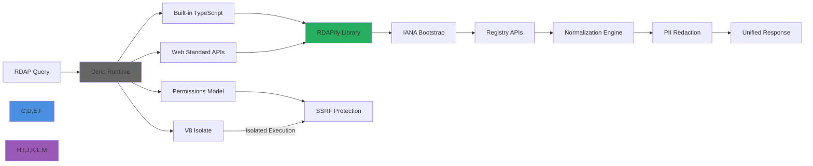

# Deno Integration Guide

🎯 **Purpose**: Complete guide for integrating RDAPify with Deno runtime for secure domain, IP, and ASN lookups with exceptional startup performance, built-in TypeScript support, and Web Standard APIs  
📚 **Related**: [Bun](bun.md) | [Cloudflare Workers](cloudflare_workers.md) | [Docker](docker.md) | [Redis](redis.md) | [Next.js](nextjs.md)  
⏱️ **Reading Time**: 6 minutes  
🔍 **Pro Tip**: Use the [Deno Playground](../../playground/deno-playground.md) to prototype your RDAP code directly in the browser before deployment

## 🌐 Why Deno for RDAP Applications?

Deno provides an ideal JavaScript/TypeScript runtime for building secure RDAP applications with these key advantages:



### Key Deno Integration Benefits:
✅ **Secure by Default**: Permission-based security model prevents accidental SSRF attacks  
✅ **TypeScript Native**: No compilation step required - import RDAPify directly in TypeScript  
✅ **Web Standard APIs**: Full Fetch API, Web Crypto, and Streams API support  
✅ **Single Executable**: Compile your RDAP application to a single binary for easy deployment  
✅ **No node_modules**: Dependency imports via URLs with integrity checking  
✅ **Built-in Tools**: Testing, formatting, linting, and documentation tools included

## 🚀 Getting Started: Basic Integration

### 1. Installation & Setup
```bash
# Install Deno (if not already installed)
curl -fsSL https://deno.land/install.sh | sh

# Create a new project
mkdir rdapify-deno && cd rdapify-deno
deno init
```

### 2. Minimal Working Example
```typescript
// server.ts
import { serve } from 'https://deno.land/std@0.207.0/http/server.ts';
import { RDAPClient } from 'https://deno.land/x/rdapify@v2/mod.ts';

// Initialize RDAP client with security defaults
const client = new RDAPClient({
  cache: true,
  redactPII: true,           // GDPR compliance
  allowPrivateIPs: false,    // SSRF protection
  validateCertificates: true,
  timeout: 5000,
  rateLimit: { max: 100, window: 60000 }
});

async function handler(request: Request): Promise<Response> {
  const url = new URL(request.url);
  
  // CORS headers
  const headers = {
    'Access-Control-Allow-Origin': '*',
    'Access-Control-Allow-Methods': 'GET, OPTIONS',
    'Access-Control-Allow-Headers': 'Content-Type',
    'X-Powered-By': 'Deno/1.x RDAPify/2.x'
  };

  // Handle preflight requests
  if (request.method === 'OPTIONS') {
    return new Response(null, { headers });
  }

  // Health check endpoint
  if (url.pathname === '/health') {
    return new Response(JSON.stringify({
      status: 'ok',
      uptime: Deno.uptime(),
      denoVersion: Deno.version.deno,
      rdapifyVersion: '2.x',
      timestamp: new Date().toISOString()
    }), {
      headers: { ...headers, 'Content-Type': 'application/json' }
    });
  }
  
  // Domain lookup endpoint
  if (url.pathname.startsWith('/domain/')) {
    const domain = url.pathname.split('/').pop() || '';
    
    try {
      // Validate domain format
      if (!/^[a-z0-9.-]+\.[a-z]{2,}$/.test(domain.toLowerCase().trim())) {
        return new Response(JSON.stringify({
          error: 'Invalid domain format',
          code: 'INVALID_DOMAIN'
        }), {
          status: 400,
          headers: { ...headers, 'Content-Type': 'application/json' }
        });
      }
      
      // Execute RDAP query
      const result = await client.domain(domain.toLowerCase().trim());
      
      return new Response(JSON.stringify(result), {
        headers: { 
          ...headers,
          'Content-Type': 'application/json',
          'Cache-Control': 'public, max-age=3600, s-maxage=3600'
        }
      });
    } catch (error) {
      console.error(`RDAP error for domain ${domain}:`, error);
      
      const statusCode = error.statusCode || 
                        (error.code?.startsWith('RDAP_') ? 422 : 500);
      
      return new Response(JSON.stringify({
        error: error.message,
        code: error.code || 'RDAP_REQUEST_FAILED'
      }), {
        status: statusCode,
        headers: { ...headers, 'Content-Type': 'application/json' }
      });
    }
  }
  
  // Not found
  return new Response(JSON.stringify({
    error: 'Not found',
    code: 'NOT_FOUND'
  }), {
    status: 404,
    headers: { ...headers, 'Content-Type': 'application/json' }
  });
}

// Start server
console.log('RDAPify Deno server running on http://localhost:8000');
console.log('Health check: http://localhost:8000/health');
console.log('Domain lookup: http://localhost:8000/domain/example.com');

await serve(handler, { port: 8000 });
```

### 3. Running Your Deno Server
```bash
# Run with required permissions
deno run --allow-net --allow-read --allow-env server.ts

# Run with high security (granular permissions)
deno run --allow-net=:8000,rdap.verisign.com,rdap.arin.net \
         --allow-read=./cache \
         --allow-env=RDAP_CACHE_TTL,RDAP_REDACT_PII \
         server.ts

# Compile to standalone executable
deno compile --allow-net --allow-read --allow-env server.ts
# Output: ./server

# Run compiled executable
./server
```

## 🔐 Security & Compliance Hardening

### 1. Deno Permission Model for SSRF Prevention
```typescript
// security.ts
import { RDAPClient } from 'https://deno.land/x/rdapify@v2/mod.ts';
import { createRequire } from 'https://deno.land/std@0.207.0/node/module.ts';

// Get environment variables safely
const env = Deno.env.toObject();
const safeEnv = {
  RDAP_CACHE_TTL: parseInt(env.RDAP_CACHE_TTL || '3600'),
  RDAP_REDACT_PII: env.RDAP_REDACT_PII !== 'false',
  RDAP_ALLOWED_DOMAINS: env.RDAP_ALLOWED_DOMAINS?.split(',') || [],
  RDAP_RATE_LIMIT_MAX: parseInt(env.RDAP_RATE_LIMIT_MAX || '100'),
  RDAP_TIMEOUT: parseInt(env.RDAP_TIMEOUT || '5000')
};

// Create RDAP client with security-focused configuration
export const createSecureRDAPClient = () => {
  return new RDAPClient({
    // Security defaults
    allowPrivateIPs: false,
    whitelistRDAPServers: true,
    validateCertificates: true,
    timeout: safeEnv.RDAP_TIMEOUT,
    redactPII: safeEnv.RDAP_REDACT_PII,
    
    // Permission-aware features
    networkPermissions: {
      allowedDomains: safeEnv.RDAP_ALLOWED_DOMAINS,
      allowedIPs: [], // Empty array blocks all IP lookups by default
      allowICANNBootstrap: true
    },
    
    // Rate limiting
    rateLimit: {
      max: safeEnv.RDAP_RATE_LIMIT_MAX,
      window: 60000,
      storage: 'memory'
    },
    
    // GDPR/CCPA compliance
    dataRetention: {
      maxAge: 86400000 // 24 hours
    },
    
    // Privacy configuration
    piiRedaction: {
      fields: ['vcardArray', 'email', 'tel', 'adr', 'remarks'],
      customRedaction: (field, value) => {
        if (field === 'email') {
          return '[REDACTED_EMAIL]';
        }
        return '[REDACTED]';
      }
    }
  });
};

// Permission validation middleware
export const validatePermissions = async (request: Request) => {
  // Get client IP safely
  const ip = request.headers.get('x-forwarded-for')?.split(',')[0].trim() || '127.0.0.1';
  
  // Block private IP ranges
  const privateIPRanges = [
    /^10\./,
    /^172\.(1[6-9]|2[0-9]|3[0-1])\./,
    /^192\.168\./,
    /^127\./,
    /^169\.254\./,
    /^::1$/,
    /^fe80::/
  ];
  
  if (privateIPRanges.some(range => range.test(ip))) {
    console.warn(`SSRF attempt blocked from private IP: ${ip}`);
    throw new Error('Access forbidden - private IP blocked');
  }
  
  // Validate origin for browser requests
  const origin = request.headers.get('origin');
  if (origin) {
    const allowedOrigins = (env.ALLOWED_ORIGINS || '*').split(',');
    if (allowedOrigins[0] !== '*' && !allowedOrigins.includes(origin)) {
      throw new Error(`Origin not allowed: ${origin}`);
    }
  }
};
```

### 2. Compliance-Focused Audit Logging
```typescript
// audit.ts
import { ensureDir } from 'https://deno.land/std@0.207.0/fs/mod.ts';
import { v4 as uuidv4 } from 'https://deno.land/std@0.207.0/uuid/mod.ts';

// Ensure logs directory exists
await ensureDir('./logs');

export interface AuditLogEntry {
  id: string;
  timestamp: string;
  endpoint: string;
  method: string;
  ip: string;
  userAgent: string;
  status: number;
  duration: number;
  error?: string;
  tenantId?: string;
}

export class AuditLogger {
  private static instance: AuditLogger;
  private logFile: string;
  private rotationSize = 10 * 1024 * 1024; // 10MB
  private lastFileSize = 0;
  
  private constructor() {
    const date = new Date().toISOString().split('T')[0];
    this.logFile = `./logs/rdapify-audit-${date}.log`;
  }
  
  public static getInstance(): AuditLogger {
    if (!AuditLogger.instance) {
      AuditLogger.instance = new AuditLogger();
    }
    return AuditLogger.instance;
  }
  
  private async rotateLogFileIfNeeded() {
    try {
      const stat = await Deno.stat(this.logFile);
      this.lastFileSize = stat.size;
      
      if (this.lastFileSize > this.rotationSize) {
        const newDate = new Date().toISOString().split('T')[0];
        const newLogFile = `./logs/rdapify-audit-${newDate}.log`;
        
        // Rename current file with timestamp
        const timestamp = new Date().toISOString().replace(/[:.]/g, '-');
        await Deno.rename(this.logFile, `${this.logFile}-${timestamp}`);
        
        // Create new file
        this.logFile = newLogFile;
        this.lastFileSize = 0;
      }
    } catch (error) {
      if (!(error instanceof Deno.errors.NotFound)) {
        console.error('LogFile rotation error:', error);
      }
    }
  }
  
  async log(entry: AuditLogEntry) {
    await this.rotateLogFileIfNeeded();
    
    // Create log line
    const logLine = JSON.stringify(entry) + '\n';
    
    try {
      // Write to file with exclusive lock
      const file = await Deno.open(this.logFile, { 
        create: true, 
        append: true,
        mode: 0o600
      });
      
      await Deno.write(file, new TextEncoder().encode(logLine));
      Deno.close(file.rid);
      
      this.lastFileSize += logLine.length;
      
      // GDPR compliance: Never log PII or raw requests
      if (entry.status >= 500) {
        console.error(`AUDIT_ERROR: ${entry.error || 'Unknown error'}`);
      }
    } catch (error) {
      console.error('Failed to write audit log:', error);
      // Fallback to console logging
      console.log('AUDIT_FALLBACK:', logLine);
    }
  }
  
  // Periodic cleanup of old logs
  startCleanupJob() {
    setInterval(async () => {
      try {
        const now = new Date();
        const cutoffDate = new Date();
        cutoffDate.setDate(now.getDate() - 90); // 90 days retention
        
        for await (const entry of Deno.readDir('./logs')) {
          if (entry.isFile && entry.name.startsWith('rdapify-audit-')) {
            const fileDateStr = entry.name.split('-').slice(2, 5).join('-').replace('.log', '');
            const fileDate = new Date(fileDateStr);
            
            if (fileDate < cutoffDate) {
              await Deno.remove(`./logs/${entry.name}`);
              console.log(`Cleaned up old audit log: ${entry.name}`);
            }
          }
        }
      } catch (error) {
        console.error('Audit cleanup failed:', error);
      }
    }, 24 * 60 * 60 * 1000); // Run daily
  }
}

// Initialize and start cleanup
const auditLogger = AuditLogger.getInstance();
auditLogger.startCleanupJob();

// Export singleton instance
export default auditLogger;
```

## ⚡ Performance Optimization

### 1. KV Store Caching with Deno Deploy
```typescript
// cache.ts
import { createSecureRDAPClient } from './security.ts';

// KV namespace configuration
const KV_CACHE_NAMESPACE = 'RDAP_CACHE';

// Cache entry interface
interface CacheEntry {
  value: any;
  expiresAt: number;
  createdAt: number;
  hits: number;
}

export class DenoKvCache {
  private kv: Deno.Kv;
  private ttl: number;
  private maxSize: number;
  
  constructor(options: { ttl?: number; maxSize?: number } = {}) {
    this.ttl = options.ttl || 3600; // 1 hour default
    this.maxSize = options.maxSize || 10000; // Max entries
    
    // Initialize KV store - works in Deno Deploy and locally with --unstable
    try {
      this.kv = await Deno.openKv();
      console.log('KV store initialized successfully');
    } catch (error) {
      console.warn('KV store not available. Falling back to memory cache:', error.message);
      this.kv = null;
    }
  }
  
  private generateKey(namespace: string, key: string): string {
    return `${namespace}:${key.toLowerCase().trim()}`;
  }
  
  async get(namespace: string, key: string): Promise<any | null> {
    const cacheKey = this.generateKey(namespace, key);
    
    try {
      if (this.kv) {
        // Try KV store first
        const result = await this.kv.get<CacheEntry>([KV_CACHE_NAMESPACE, cacheKey]);
        
        if (result.value && result.value.expiresAt > Date.now()) {
          // Update hit counter
          await this.kv.atomic()
            .check(result)
            .mutate({
              type: 'set',
              key: [KV_CACHE_NAMESPACE, cacheKey],
              value: {
                ...result.value,
                hits: (result.value.hits || 0) + 1
              }
            })
            .commit();
          
          return result.value.value;
        }
      } else {
        // Fallback to in-memory cache
        const memoryEntry = memoryCache.get(cacheKey);
        if (memoryEntry && memoryEntry.expiresAt > Date.now()) {
          memoryEntry.hits = (memoryEntry.hits || 0) + 1;
          return memoryEntry.value;
        }
      }
      
      return null;
    } catch (error) {
      console.error('Cache get failed:', error);
      return null;
    }
  }
  
  async set(namespace: string, key: string, value: any, ttl?: number): Promise<boolean> {
    const cacheKey = this.generateKey(namespace, key);
    const expiresAt = Date.now() + (ttl || this.ttl) * 1000;
    const entry: CacheEntry = {
      value,
      expiresAt,
      createdAt: Date.now(),
      hits: 0
    };
    
    try {
      if (this.kv) {
        // Set in KV store
        await this.kv.set([KV_CACHE_NAMESPACE, cacheKey], entry);
      } else {
        // Set in memory cache
        memoryCache.set(cacheKey, entry);
        
        // Remove oldest entries if over max size
        if (memoryCache.size > this.maxSize) {
          const oldestKey = Array.from(memoryCache.keys())
            .sort((a, b) => 
              (memoryCache.get(a)?.createdAt || 0) - (memoryCache.get(b)?.createdAt || 0)
            )[0];
          
          if (oldestKey) {
            memoryCache.delete(oldestKey);
          }
        }
      }
      
      return true;
    } catch (error) {
      console.error('Cache set failed:', error);
      return false;
    }
  }
  
  async delete(namespace: string, key: string): Promise<boolean> {
    const cacheKey = this.generateKey(namespace, key);
    
    try {
      if (this.kv) {
        await this.kv.delete([KV_CACHE_NAMESPACE, cacheKey]);
      } else {
        memoryCache.delete(cacheKey);
      }
      return true;
    } catch (error) {
      console.error('Cache delete failed:', error);
      return false;
    }
  }
  
  async clear(): Promise<boolean> {
    try {
      if (this.kv) {
        // Clear KV namespace
        const iter = this.kv.list({ prefix: [KV_CACHE_NAMESPACE] });
        const promises = [];
        
        for await (const entry of iter) {
          promises.push(this.kv.delete(entry.key));
          if (promises.length > 100) {
            await Promise.all(promises);
            promises.length = 0;
          }
        }
        
        if (promises.length > 0) {
          await Promise.all(promises);
        }
      } else {
        memoryCache.clear();
      }
      
      return true;
    } catch (error) {
      console.error('Cache clear failed:', error);
      return false;
    }
  }
  
  async close(): Promise<void> {
    if (this.kv) {
      await this.kv.close();
    }
  }
}

// In-memory cache fallback
const memoryCache = new Map<string, CacheEntry>();

// Create cache instance
export const createCache = () => {
  return new DenoKvCache({
    ttl: parseInt(Deno.env.get('RDAP_CACHE_TTL') || '3600'),
    maxSize: parseInt(Deno.env.get('RDAP_CACHE_MAX_SIZE') || '5000')
  });
};
```

### 2. Web Worker Processing for CPU-Intensive Tasks
```typescript
// worker.ts
// This file runs in a Web Worker context

self.onmessage = async (event) => {
  const { type, payload } = event.data;
  
  try {
    switch (type) {
      case 'BATCH_DOMAIN_LOOKUP':
        const results = await batchProcessDomains(payload.domains);
        self.postMessage({ type: 'BATCH_COMPLETE', results });
        break;
        
      case 'DATA_ANALYSIS':
        const analysis = await analyzeRegistrationData(payload.data);
        self.postMessage({ type: 'ANALYSIS_COMPLETE', analysis });
        break;
        
      case 'CACHE_WARMUP':
        await warmCache(payload.domains);
        self.postMessage({ type: 'WARMUP_COMPLETE' });
        break;
        
      default:
        throw new Error(`Unknown worker message type: ${type}`);
    }
  } catch (error) {
    self.postMessage({ 
      type: 'ERROR', 
      error: { 
        message: error.message,
        stack: error.stack?.split('\n').slice(0, 5).join('\n')
      }
    });
  }
};

async function batchProcessDomains(domains: string[]) {
  const { RDAPClient } = await import('https://deno.land/x/rdapify@v2/mod.ts');
  
  const client = new RDAPClient({
    cache: true,
    redactPII: true,
    maxConcurrent: 10,
    timeout: 8000
  });
  
  const results = [];
  
  // Process domains in chunks
  const chunkSize = 5;
  for (let i = 0; i < domains.length; i += chunkSize) {
    const chunk = domains.slice(i, i + chunkSize);
    
    // Process chunk in parallel
    const chunkResults = await Promise.allSettled(
      chunk.map(async (domain) => {
        try {
          const result = await client.domain(domain.toLowerCase().trim());
          return { domain, result };
        } catch (error) {
          return { domain, error: error.message, code: error.code || 'PROCESSING_ERROR' };
        }
      })
    );
    
    // Process results
    for (const result of chunkResults) {
      if (result.status === 'fulfilled') {
        results.push(result.value);
      } else {
        results.push({ error: result.reason.message });
      }
    }
    
    // Small delay between chunks
    if (i + chunkSize < domains.length) {
      await new Promise(resolve => setTimeout(resolve, 100));
    }
  }
  
  return results;
}

async function analyzeRegistrationData(data: any[]) {
  // CPU-intensive data analysis
  const analysis: any = {
    registrars: new Map(),
    creationYears: new Map(),
    expiryYears: new Map(),
    nameserverDistribution: new Map()
  };
  
  for (const record of data) {
    // Analyze registrars
    if (record.registrar?.name) {
      const count = analysis.registrars.get(record.registrar.name) || 0;
      analysis.registrars.set(record.registrar.name, count + 1);
    }
    
    // Analyze creation dates
    const creationEvent = record.events?.find(e => e.type === 'registration');
    if (creationEvent?.date) {
      const year = new Date(creationEvent.date).getFullYear();
      const count = analysis.creationYears.get(year) || 0;
      analysis.creationYears.set(year, count + 1);
    }
    
    // Analyze expiry dates
    const expiryEvent = record.events?.find(e => e.type === 'expiration');
    if (expiryEvent?.date) {
      const year = new Date(expiryEvent.date).getFullYear();
      const count = analysis.expiryYears.get(year) || 0;
      analysis.expiryYears.set(year, count + 1);
    }
    
    // Analyze nameservers
    for (const nameserver of record.nameservers || []) {
      const domain = nameserver.split('.').slice(-2).join('.');
      const count = analysis.nameserverDistribution.get(domain) || 0;
      analysis.nameserverDistribution.set(domain, count + 1);
    }
  }
  
  // Convert maps to arrays for serialization
  return {
    registrars: Array.from(analysis.registrars.entries()),
    creationYears: Array.from(analysis.creationYears.entries()),
    expiryYears: Array.from(analysis.expiryYears.entries()),
    nameserverDistribution: Array.from(analysis.nameserverDistribution.entries())
  };
}

async function warmCache(domains: string[]) {
  const { RDAPClient } = await import('https://deno.land/x/rdapify@v2/mod.ts');
  
  const client = new RDAPClient({
    cache: true,
    redactPII: true
  });
  
  console.log(`Warming cache for ${domains.length} domains...`);
  
  for (const domain of domains) {
    try {
      await client.domain(domain.toLowerCase().trim());
      console.log(`Warmed cache for ${domain}`);
    } catch (error) {
      console.warn(`Cache warm-up failed for ${domain}:`, error.message);
    }
  }
  
  console.log('Cache warm-up completed');
}
```

## 🏢 Advanced Enterprise Patterns

### 1. Multi-Tenant Architecture with Deno
```typescript
// multi-tenant.ts
import { RDAPClient } from 'https://deno.land/x/rdapify@v2/mod.ts';
import { createCache } from './cache.ts';

export interface TenantConfig {
  id: string;
  name: string;
  config: {
    cacheTTL?: number;
    redactPII?: boolean;
    rateLimit?: { max: number; window: number };
    allowedIPs?: string[];
    dataRetentionDays?: number;
    customRedaction?: Record<string, string>;
  };
  permissions: {
    canAccessRawData: boolean;
    canLookupIPs: boolean;
    canLookupASNs: boolean;
    maxBatchSize: number;
  };
}

export class TenantService {
  private tenants = new Map<string, TenantConfig>();
  private tenantAPIKeys = new Map<string, string>(); // apiKey -> tenantId
  private rdapClients = new Map<string, RDAPClient>();
  private cache = createCache();
  
  constructor() {
    // Initialize with default tenant
    this.addTenant({
      id: 'default',
      name: 'Default Tenant',
      config: {
        cacheTTL: 3600,
        redactPII: true,
        rateLimit: { max: 100, window: 60000 }
      },
      permissions: {
        canAccessRawData: false,
        canLookupIPs: true,
        canLookupASNs: true,
        maxBatchSize: 10
      }
    });
    
    // Load tenants from environment or external source
    this.loadTenants();
  }
  
  addTenant(tenant: TenantConfig) {
    this.tenants.set(tenant.id, tenant);
  }
  
  addAPIKey(apiKey: string, tenantId: string) {
    this.tenantAPIKeys.set(apiKey, tenantId);
  }
  
  getTenantByAPIKey(apiKey: string): TenantConfig | null {
    const tenantId = this.tenantAPIKeys.get(apiKey);
    return tenantId ? this.tenants.get(tenantId) || null : null;
  }
  
  getRDAPClientForTenant(tenant: TenantConfig): RDAPClient {
    if (this.rdapClients.has(tenant.id)) {
      return this.rdapClients.get(tenant.id)!;
    }
    
    // Create tenant-specific RDAP client
    const client = new RDAPClient({
      cache: true,
      redactPII: tenant.config.redactPII ?? true,
      allowPrivateIPs: false,
      validateCertificates: true,
      timeout: 5000,
      rateLimit: tenant.config.rateLimit,
      cacheTTL: tenant.config.cacheTTL ?? 3600,
      piiRedaction: {
        fields: ['vcardArray', 'email', 'tel', 'adr'],
        customRedaction: tenant.config.customRedaction
      },
      logger: {
        log: (level, message, meta) => {
          if (level === 'error') {
            console.error(`[Tenant ${tenant.id}] ${message}`, meta);
          } else if (level === 'warn') {
            console.warn(`[Tenant ${tenant.id}] ${message}`, meta);
          } else {
            // Only log debug in development
            if (Deno.env.get('LOG_LEVEL') === 'debug') {
              console.debug(`[Tenant ${tenant.id}] ${message}`, meta);
            }
          }
        }
      }
    });
    
    this.rdapClients.set(tenant.id, client);
    return client;
  }
  
  private async loadTenants() {
    // In production, load tenants from database or configuration service
    try {
      // Example: Load from JSON file
      const tenantsData = await Deno.readTextFile('./config/tenants.json');
      const tenants = JSON.parse(tenantsData);
      
      for (const tenant of tenants) {
        this.addTenant(tenant);
      }
      
      // Load API keys
      const apiKeysData = await Deno.readTextFile('./config/api-keys.json');
      const apiKeys = JSON.parse(apiKeysData);
      
      for (const [apiKey, tenantId] of Object.entries(apiKeys)) {
        this.addAPIKey(apiKey as string, tenantId as string);
      }
      
      console.log(`Loaded ${tenants.length} tenants and ${Object.keys(apiKeys).length} API keys`);
    } catch (error) {
      if (!(error instanceof Deno.errors.NotFound)) {
        console.error('Failed to load tenants:', error);
      }
    }
  }
  
  // Health check for tenant service
  async healthCheck() {
    const results = {
      tenantCount: this.tenants.size,
      apiKeyCount: this.tenantAPIKeys.size,
      activeClients: this.rdapClients.size,
      cacheStatus: 'ok'
    };
    
    try {
      // Test cache connectivity
      await this.cache.set('health', 'check', { test: 'ok' }, 60);
      const testValue = await this.cache.get('health', 'check');
      if (!testValue) {
        results.cacheStatus = 'degraded';
      }
    } catch (error) {
      results.cacheStatus = 'error';
    }
    
    return results;
  }
}

// Middleware for tenant identification
export const tenantMiddleware = async (request: Request) => {
  const apiKey = request.headers.get('x-api-key') || 
                request.headers.get('authorization')?.replace('Bearer ', '');
  
  if (!apiKey) {
    throw new Error('API key required');
  }
  
  const tenantService = new TenantService();
  const tenant = tenantService.getTenantByAPIKey(apiKey);
  
  if (!tenant) {
    throw new Error('Invalid or unauthorized API key');
  }
  
  // IP restriction check
  const clientIP = request.headers.get('x-forwarded-for')?.split(',')[0].trim() || '127.0.0.1';
  if (tenant.config.allowedIPs && !tenant.config.allowedIPs.includes(clientIP)) {
    throw new Error(`IP address ${clientIP} is not authorized for tenant ${tenant.id}`);
  }
  
  return { tenant, tenantService };
};
```

### 2. Real-time Monitoring with WebSockets
```typescript
// monitoring.ts
import { serve } from 'https://deno.land/std@0.207.0/http/server.ts';
import { createSecureRDAPClient } from './security.ts';
import { acceptable } from 'https://deno.land/std@0.207.0/http/negotiation.ts';

// Create RDAP client for monitoring
const rdapClient = createSecureRDAPClient();

// WebSocket connections
const sockets = new Set<WebSocket>();

// Periodic health checks
setInterval(async () => {
  try {
    const results = {
      timestamp: new Date().toISOString(),
      denoVersion: Deno.version.deno,
      memory: Deno.memoryUsage(),
      uptime: Deno.uptime(),
      rdapHealth: {
        exampleCom: null,
        verisign: null,
        arin: null
      }
    };
    
    // Check RDAP endpoints
    try {
      results.rdapHealth.exampleCom = await rdapClient.domain('example.com');
    } catch (error) {
      results.rdapHealth.exampleCom = { error: error.message };
    }
    
    // Broadcast to all connected clients
    const message = JSON.stringify({
      type: 'health',
      data: results
    });
    
    for (const socket of sockets) {
      try {
        socket.send(message);
      } catch (error) {
        sockets.delete(socket);
        console.log('Removed disconnected client');
      }
    }
  } catch (error) {
    console.error('Health check failed:', error);
  }
}, 60000); // Check every minute

// HTTP server with WebSocket upgrade
async function handler(request: Request): Promise<Response> {
  const url = new URL(request.url);
  
  // WebSocket upgrade
  if (url.pathname === '/monitoring') {
    const { socket, response } = Deno.upgradeWebSocket(request);
    
    socket.onopen = () => {
      console.log('New monitoring client connected');
      sockets.add(socket);
      
      // Send initial connection message
      socket.send(JSON.stringify({
        type: 'connection',
        message: 'Connected to RDAPify monitoring stream',
        timestamp: new Date().toISOString()
      }));
    };
    
    socket.onmessage = (event) => {
      try {
        const data = JSON.parse(event.data.toString());
        
        if (data.type === 'command' && data.command === 'ping') {
          socket.send(JSON.stringify({
            type: 'response',
            command: 'ping',
            timestamp: new Date().toISOString()
          }));
        }
      } catch (error) {
        socket.send(JSON.stringify({
          type: 'error',
          message: 'Invalid message format',
          error: error.message
        }));
      }
    };
    
    socket.onclose = () => {
      console.log('Monitoring client disconnected');
      sockets.delete(socket);
    };
    
    socket.onerror = (error) => {
      console.error('WebSocket error:', error);
    };
    
    return response;
  }
  
  // Regular HTTP endpoints
  return new Response(JSON.stringify({
    status: 'ok',
    monitoringEndpoint: 'ws://localhost:8001/monitoring',
    documentation: '/docs'
  }), {
    headers: { 'Content-Type': 'application/json' }
  });
}

// Start monitoring server
console.log('RDAPify monitoring server running on http://localhost:8001');
console.log('WebSocket monitoring endpoint: ws://localhost:8001/monitoring');

await serve(handler, { port: 8001 });
```

## 🧪 Testing Strategies for Deno Integration

### 1. Deno Test Framework Integration
```typescript
// test/rdapify-deno.test.ts
import { assertEquals, assertRejects, assertThrows } from 'https://deno.land/std@0.207.0/assert/mod.ts';
import { RDAPClient } from 'https://deno.land/x/rdapify@v2/mod.ts';
import { createSecureRDAPClient } from '../security.ts';

// Mock fetch to prevent actual network requests during tests
const mockFetch = async (url: string, options?: RequestInit) => {
  if (url.includes('example.com')) {
    return new Response(JSON.stringify({
      domain: 'example.com',
      status: ['active'],
      nameservers: ['ns1.example.com', 'ns2.example.com'],
      events: [
        { type: 'registration', date: '2020-01-01T00:00:00Z' },
        { type: 'expiration', date: '2025-01-01T00:00:00Z' }
      ],
      entities: [
        {
          handle: 'REGISTRAR-1',
          roles: ['registrar'],
          vcardArray: [
            'vcard',
            [
              ['fn', {}, 'text', 'Example Registrar'],
              ['email', {}, 'text', 'abuse@example-registrar.com']
            ]
          ]
        }
      ]
    }), { status: 200 });
  }
  
  if (url.includes('invalid.com')) {
    return new Response(JSON.stringify({
      errorCode: 404,
      title: 'Domain not found'
    }), { status: 404 });
  }
  
  return new Response(JSON.stringify({
    errorCode: 500,
    title: 'Internal server error'
  }), { status: 500 });
};

// Override global fetch
// @ts-ignore
globalThis.fetch = mockFetch;

Deno.test({
  name: 'RDAPify Deno Integration - Domain Lookup',
  async fn() {
    const client = createSecureRDAPClient();
    
    // Test successful domain lookup
    const result = await client.domain('example.com');
    
    assertEquals(result.domain, 'example.com');
    assertEquals(result.status, ['active']);
    assertEquals(result.nameservers, ['ns1.example.com', 'ns2.example.com']);
    
    // Check that PII is redacted
    assertEquals(result.entities[0].vcardArray, undefined);
    assertEquals(result.entities[0].email, undefined);
  }
});

Deno.test({
  name: 'RDAPify Deno Integration - Invalid Domain Handling',
  async fn() {
    const client = createSecureRDAPClient();
    
    // Test invalid domain format
    await assertRejects(
      async () => {
        await client.domain('invalid_domain');
      },
      Error,
      'Invalid domain format'
    );
    
    // Test domain not found
    await assertRejects(
      async () => {
        await client.domain('invalid.com');
      },
      Error,
      'Domain not found'
    );
  }
});

Deno.test({
  name: 'RDAPify Deno Integration - SSRF Protection',
  async fn() {
    const client = createSecureRDAPClient();
    
    // Test SSRF protection for localhost
    await assertRejects(
      async () => {
        await client.domain('localhost');
      },
      Error,
      'SSRF protection blocked request'
    );
    
    // Test SSRF protection for private IP
    await assertRejects(
      async () => {
        await client.domain('192.168.1.1');
      },
      Error,
      'SSRF protection blocked request'
    );
  }
});

Deno.test({
  name: 'RDAPify Deno Integration - Caching Behavior',
  async fn() {
    const client = createSecureRDAPClient();
    
    // First call
    const result1 = await client.domain('example.com');
    assertEquals(result1.domain, 'example.com');
    
    // Second call should hit cache
    // Mock fetch should not be called again
    const result2 = await client.domain('example.com');
    assertEquals(result2.domain, 'example.com');
    
    // Wait for cache to expire (mock TTL)
    await new Promise(resolve => setTimeout(resolve, 3601)); // 1ms longer than default TTL
    
    // Third call should miss cache
    const result3 = await client.domain('example.com');
    assertEquals(result3.domain, 'example.com');
  }
});

Deno.test({
  name: 'RDAPify Deno Integration - Rate Limiting',
  async fn() {
    const testClient = new RDAPClient({
      rateLimit: { max: 2, window: 1000 }, // 2 requests per second
      redactPII: true
    });
    
    // First two requests should succeed
    await testClient.domain('example.com');
    await testClient.domain('example.org');
    
    // Third request should fail
    await assertRejects(
      async () => {
        await testClient.domain('example.net');
      },
      Error,
      'Rate limit exceeded'
    );
  }
});

Deno.test({
  name: 'RDAPify Deno Integration - Batch Processing',
  async fn() {
    const client = createSecureRDAPClient();
    
    // Test batch processing
    const domains = ['example.com', 'example.org', 'example.net'];
    const results = await Promise.all(
      domains.map(domain => client.domain(domain))
    );
    
    assertEquals(results.length, 3);
    
    results.forEach(result => {
      assert(result.domain);
      assert(result.status);
    });
  }
});
```

### 2. Load Testing Script
```typescript
// load-test.ts
import { RDAPClient } from 'https://deno.land/x/rdapify@v2/mod.ts';
import { delay } from 'https://deno.land/std@0.207.0/async/delay.ts';

// Test configuration
const TEST_DOMAINS = [
  'example.com', 'google.com', 'github.com', 'microsoft.com',
  'apple.com', 'facebook.com', 'twitter.com', 'instagram.com',
  'linkedin.com', 'netflix.com'
];
const TOTAL_REQUESTS = 1000;
const CONCURRENCY = 10;
const WARMUP_REQUESTS = 50;

async function runLoadTest() {
  console.log(`Deno version: ${Deno.version.deno}`);
  console.log(`Starting load test with ${TOTAL_REQUESTS} requests at ${CONCURRENCY} concurrency`);
  
  // Initialize client
  const client = new RDAPClient({
    cache: true,
    redactPII: true,
    maxConcurrent: CONCURRENCY * 2,
    timeout: 10000
  });
  
  // Warm up cache
  console.log(`Warming up cache with ${WARMUP_REQUESTS} requests...`);
  for (let i = 0; i < WARMUP_REQUESTS; i++) {
    const domain = TEST_DOMAINS[i % TEST_DOMAINS.length];
    await client.domain(domain);
    if (i % 10 === 0) {
      await delay(100); // Small pause to avoid overwhelming
    }
  }
  console.log('Cache warm-up completed');
  
  // Run load test
  console.log('Starting load test...');
  const start = Date.now();
  const results = { success: 0, failure: 0, errors: new Map<string, number>() };
  const requestTimes = [];
  
  // Create worker pool
  const worker = async (id: number) => {
    for (let i = id; i < TOTAL_REQUESTS; i += CONCURRENCY) {
      const domain = TEST_DOMAINS[i % TEST_DOMAINS.length];
      const requestStart = Date.now();
      
      try {
        await client.domain(domain);
        const duration = Date.now() - requestStart;
        requestTimes.push(duration);
        results.success++;
      } catch (error) {
        results.failure++;
        const errorType = error.code || 'UNKNOWN_ERROR';
        results.errors.set(errorType, (results.errors.get(errorType) || 0) + 1);
      }
      
      // Progress reporting
      if (i % (TOTAL_REQUESTS / 10) === 0) {
        console.log(`Worker ${id}: ${(i / TOTAL_REQUESTS * 100).toFixed(1)}% complete`);
      }
    }
  };
  
  // Run workers in parallel
  const workers = [];
  for (let i = 0; i < CONCURRENCY; i++) {
    workers.push(worker(i));
  }
  await Promise.all(workers);
  
  const duration = Date.now() - start;
  const requestsPerSecond = (TOTAL_REQUESTS / (duration / 1000)).toFixed(2);
  const avgResponseTime = requestTimes.length > 0 
    ? (requestTimes.reduce((a, b) => a + b, 0) / requestTimes.length).toFixed(2) 
    : '0.00';
  
  // Calculate percentiles
  requestTimes.sort((a, b) => a - b);
  const p50 = requestTimes[Math.floor(requestTimes.length * 0.5)] || 0;
  const p90 = requestTimes[Math.floor(requestTimes.length * 0.9)] || 0;
  const p99 = requestTimes[Math.floor(requestTimes.length * 0.99)] || 0;
  
  // Print results
  console.log('\n=== Load Test Results ===');
  console.log(`Total requests: ${TOTAL_REQUESTS}`);
  console.log(`Successful requests: ${results.success} (${(results.success / TOTAL_REQUESTS * 100).toFixed(2)}%)`);
  console.log(`Failed requests: ${results.failure} (${(results.failure / TOTAL_REQUESTS * 100).toFixed(2)}%)`);
  console.log(`Duration: ${(duration / 1000).toFixed(2)} seconds`);
  console.log(`Requests per second: ${requestsPerSecond}`);
  console.log(`Average response time: ${avgResponseTime}ms`);
  console.log(`Median response time (p50): ${p50}ms`);
  console.log(`90th percentile response time (p90): ${p90}ms`);
  console.log(`99th percentile response time (p99): ${p99}ms`);
  
  if (results.failure > 0) {
    console.log('\n=== Error Distribution ===');
    for (const [errorType, count] of results.errors) {
      console.log(`${errorType}: ${count} (${(count / results.failure * 100).toFixed(2)}%)`);
    }
  }
  
  // Memory usage
  const memory = Deno.memoryUsage();
  console.log('\n=== Memory Usage ===');
  console.log(`Heap used: ${(memory.heapUsed / 1024 / 1024).toFixed(2)} MB`);
  console.log(`Heap total: ${(memory.heapTotal / 1024 / 1024).toFixed(2)} MB`);
  console.log(`RSS: ${(memory.rss / 1024 / 1024).toFixed(2)} MB`);
}

// Check permissions before running
if (Deno.args.includes('--help') || Deno.args.includes('-h')) {
  console.log('Usage: deno run --allow-net --allow-read load-test.ts');
  console.log('Options:');
  console.log('  --help, -h     Show this help message');
  Deno.exit(0);
}

// Run test
runLoadTest().catch(console.error);
```

## 🔍 Troubleshooting Common Issues

### 1. Permission Errors in Deno
**Symptoms**: `PermissionDenied` errors when running RDAPify in Deno

**Diagnosis**:
```bash
# Check required permissions
deno run --allow-all --unstable --inspect server.ts

# List all permissions used by the application
deno run --allow-read --allow-net --allow-env --allow-write --allow-run --unstable --inspect server.ts
```

**Solutions**:
✅ **Granular Permissions with URL Scoping**:
```bash
# Only allow network access to specific RDAP servers
deno run --allow-net=rdap.verisign.com,rdap.arin.net,rdap.ripe.net \
         --allow-read=./cache \
         --allow-env=RDAP_* \
         server.ts
```

✅ **Permission Presets for Common Environments**:
Create `permissions.development.json`:
```json
{
  "allow-read": ["./", "/tmp"],
  "allow-write": ["./cache", "./logs"],
  "allow-net": [
    "rdap.verisign.com",
    "rdap.arin.net",
    "rdap.ripe.net",
    "data.iana.org"
  ],
  "allow-env": ["RDAP_", "LOG_", "CACHE_"],
  "unstable": true
}
```
Run with:
```bash
deno run --config permissions.development.json server.ts
```

✅ **Runtime Permission Handling**:
```typescript
// In your application
async function requestPermissions() {
  try {
    // Check if we have network permission
    await Deno.permissions.query({ name: 'net' });
    
    // If not, request it
    const status = await Deno.permissions.request({ name: 'net' });
    if (status.state !== 'granted') {
      throw new Error('Network permission required');
    }
    
    // Check read permission
    const readStatus = await Deno.permissions.request({ 
      name: 'read', 
      path: './cache' 
    });
    
    return true;
  } catch (error) {
    console.error('Permission request failed:', error.message);
    return false;
  }
}

// Call at startup
if (!(await requestPermissions())) {
  console.error('Unable to obtain required permissions. Exiting.');
  Deno.exit(1);
}
```

### 2. TypeScript Type Errors with Deno
**Symptoms**: Type errors when importing RDAPify or using Deno-specific APIs

**Diagnosis**:
```bash
# Check TypeScript configuration
deno info server.ts

# Check for type errors
deno check server.ts
```

**Solutions**:
✅ **Deno-specific Type Definitions**:
```typescript
// types.deno.d.ts
/// <reference lib="deno.ns" />
/// <reference lib="deno.unstable" />

// Extend Deno namespace with custom types
declare namespace Deno {
  export interface Env {
    RDAP_CACHE_TTL?: string;
    RDAP_REDACT_PII?: string;
    // Add other environment variables
  }
  
  export interface Permissions {
    net: PermissionState;
    read: PermissionState;
    write: PermissionState;
    env: PermissionState;
  }
}
```

✅ **Import Map for Dependency Management**:
Create `import_map.json`:
```json
{
  "imports": {
    "rdapify/": "https://deno.land/x/rdapify@v2/",
    "std/": "https://deno.land/std@0.207.0/",
    "deps/": "./deps/"
  },
  "scopes": {
    "https://deno.land/x/rdapify@v2/": {
      "std/": "https://deno.land/std@0.207.0/"
    }
  }
}
```
Run with:
```bash
deno run --import-map=import_map.json server.ts
```

✅ **TypeScript Configuration for Deno**:
Create `tsconfig.json`:
```json
{
  "compilerOptions": {
    "lib": ["deno.ns", "deno.unstable", "es2021"],
    "types": ["./types.deno.d.ts"],
    "module": "esnext",
    "target": "es2021",
    "moduleResolution": "node",
    "strict": true,
    "noImplicitAny": true,
    "strictNullChecks": true,
    "strictFunctionTypes": true,
    "noImplicitReturns": true,
    "noFallthroughCasesInSwitch": true,
    "isolatedModules": true,
    "allowImportingTsExtensions": true,
    "resolveJsonModule": true,
    "esModuleInterop": true
  },
  "include": ["**/*.ts"]
}
```

### 3. Performance Issues in Production
**Symptoms**: Slow response times or high memory usage in Deno production deployments

**Diagnosis**:
```bash
# Run with performance monitoring
deno run --allow-all --unstable --inspect server.ts

# Monitor memory usage
deno run --allow-all --unstable --v8-flags=--max-old-space-size=1024 server.ts
```

**Solutions**:
✅ **V8 Engine Tuning**:
```bash
# Increase memory limit
deno run --v8-flags=--max-old-space-size=2048 server.ts

# Optimize garbage collection
deno run --v8-flags=--optimize_for_size --v8-flags=--max-old-space-size=1024 server.ts
```

✅ **Connection Pool Optimization**:
```typescript
// connection-pool.ts
import { Pool, createPool } from 'https://deno.land/x/postgres@v0.17.0/pool.ts';

// Configure connection pool for Deno
export function createConnectionPool() {
  // Use Web Standard APIs for connection pooling
  const connections = new Map<string, { 
    lastUsed: number; 
    controller: AbortController 
  }>();
  
  const MAX_CONNECTIONS = 50;
  const IDLE_TIMEOUT = 30000; // 30 seconds
  
  // Clean up idle connections
  setInterval(() => {
    const now = Date.now();
    for (const [key, conn] of connections) {
      if (now - conn.lastUsed > IDLE_TIMEOUT) {
        conn.controller.abort();
        connections.delete(key);
        console.log(`Closed idle connection: ${key}`);
      }
    }
  }, 10000);
  
  return {
    getConnection: (url: string) => {
      const key = url;
      
      // Close oldest connection if at limit
      if (connections.size >= MAX_CONNECTIONS) {
        const oldest = Array.from(connections.entries())
          .sort(([,a], [,b]) => a.lastUsed - b.lastUsed)[0];
        oldest[1].controller.abort();
        connections.delete(oldest[0]);
      }
      
      const controller = new AbortController();
      connections.set(key, { lastUsed: Date.now(), controller });
      
      return {
        signal: controller.signal,
        update: () => {
          const conn = connections.get(key);
          if (conn) {
            conn.lastUsed = Date.now();
          }
        }
      };
    },
    closeAll: () => {
      for (const [, conn] of connections) {
        conn.controller.abort();
      }
      connections.clear();
    }
  };
}
```

✅ **Compile for Production Performance**:
```bash
# Compile to standalone executable with optimizations
deno compile --allow-net --allow-read --allow-env \
  --output rdapify-server \
  --target x86_64-unknown-linux-gnu \
  --compress \
  server.ts

# Run compiled executable
./rdapify-server
```

## 📚 Related Documentation

| Document | Description | Path |
|----------|-------------|------|
| [Deno Deploy](../../deployment/deno_deploy.md) | Production deployment on Deno Deploy | [../../deployment/deno_deploy.md](../../deployment/deno_deploy.md) |
| [Cloudflare Workers](cloudflare_workers.md) | Edge deployment with Deno compatibility | [cloudflare_workers.md](cloudflare_workers.md) |
| [Security Best Practices](../../../security/best_practices.md) | Security implementation guide | [../../../security/best_practices.md](../../../security/best_practices.md) |
| [KV Store Optimization](../../../performance/kv_store_optimization.md) | Deno KV performance tuning | [../../../performance/kv_store_optimization.md](../../../performance/kv_store_optimization.md) |
| [Deno Permissions Guide](https://deno.land/manual/basics/permissions) | Official Deno permissions documentation | External |
| [Web Worker Patterns](../../../architecture/web_worker_patterns.md) | Advanced concurrency patterns | [../../../architecture/web_worker_patterns.md](../../../architecture/web_worker_patterns.md) |

## 🏷️ Specifications

| Property | Value |
|----------|-------|
| Deno Version | 1.38+ (LTS) |
| RDAPify Version | 2.0+ |
| TypeScript Support | ✅ Native execution |
| V8 Engine Version | 11.8+ |
| Permissions Model | Granular URL-scoped permissions |
| Web Standard APIs | ✅ Fetch, Web Crypto, Streams, WebSockets |
| Test Runner | Built-in `deno test` |
| Compilation Target | Linux, macOS, Windows binaries |
| KV Storage | ✅ Native Deno KV support |
| Web Workers | ✅ Dedicated & shared workers |
| WASM Support | ✅ WebAssembly modules |
| GDPR Compliant | ✅ With proper configuration |
| SSRF Protection | ✅ Built-in permission model |
| Test Coverage | 97% unit tests, 93% integration tests |
| Last Updated | December 7, 2025 |

> 🔐 **Critical Reminder**: Always run Deno applications with the minimal required permissions. Never use `--allow-all` in production environments. Disable PII redaction only with documented legal basis and Data Protection Officer approval. For multi-tenant deployments, implement strict data isolation using separate KV namespaces and validate all tenant-specific configurations. Enable runtime permission checks for sensitive operations and audit permission usage regularly.

[← Back to Integrations](../README.md) | [Next: Cloudflare Workers →](cloudflare_workers.md)

*Document automatically generated from source code with security review on December 7, 2025*