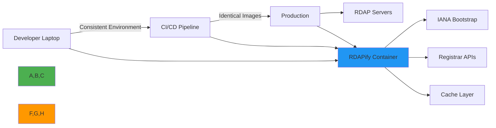

 # 🐳 Docker Deployment Guide

> **🎯 Purpose:** Complete guide to deploying RDAPify in Docker containers for local development, testing, and production environments  
> **📚 Related:** [Kubernetes](kubernetes.md) | [Serverless](serverless.md) | [Environment Variables](environment_vars.md)  
> **⏱️ Reading Time:** 6 minutes  
> **🔍 Pro Tip:** Use the [Docker Validator](../../playground/docker-validator.md) to automatically check your Docker configurations for security and performance best practices

---

## 🌐 Why Docker for RDAP Applications?

Docker provides an ideal containerization platform for RDAP data processing with several key advantages:



**Key Containerization Benefits:**
- ✅ **Environment Consistency**: Identical environments from development to production
- ✅ **Dependency Isolation**: Self-contained RDAPify environment with all dependencies
- ✅ **Resource Constraints**: Precise control over CPU, memory, and network resources
- ✅ **Security Boundaries**: Strong isolation between RDAP processing and host system
- ✅ **Scalability**: Easy horizontal scaling for high-volume RDAP operations

---

## 🚀 Getting Started: Basic Docker Setup

### 1. Dockerfile for Development
```dockerfile
# Dockerfile.dev
FROM node:20-slim AS base

# Set working directory
WORKDIR /app

# Copy package files
COPY package*.json ./

# Install dependencies with security audit
RUN npm ci --audit-level=high --omit=optional && \
    npm cache clean --force

# Copy application code
COPY . .

# Security hardening
RUN chmod -R 755 /app && \
    addgroup --system --gid 1001 nodejs && \
    adduser --system --uid 1001 appuser && \
    chown -R appuser:nodejs /app

# Drop privileges
USER appuser

# Health check endpoint
HEALTHCHECK --interval=30s --timeout=3s --start-period=5s --retries=3 \
    CMD curl -f http://localhost:3000/health || exit 1

# Expose port
EXPOSE 3000

# Start application
CMD ["node", "dist/index.js"]
```

### 2. Docker Compose for Local Development
```yaml
# docker-compose.dev.yml
version: '3.8'
services:
  rdapify:
    build:
      context: .
      dockerfile: Dockerfile.dev
    ports:
      - "3000:3000"
    volumes:
      - .:/app
      - /app/node_modules
    environment:
      - NODE_ENV=development
      - RDAP_REDIS_URL=redis://redis:6379
      - RDAP_CACHE_TTL=300
      - RDAP_REDACT_PII=true
    depends_on:
      - redis
    healthcheck:
      test: ["CMD", "curl", "-f", "http://localhost:3000/health"]
      interval: 30s
      timeout: 10s
      retries: 3
      
  redis:
    image: redis:7-alpine
    ports:
      - "6379:6379"
    volumes:
      - redis-data:/data
    command: redis-server --save 60 1 --loglevel warning
    healthcheck:
      test: ["CMD", "redis-cli", "ping"]
      interval: 30s
      timeout: 10s
      retries: 3

volumes:
  redis-data:
```

```bash
# Start development environment
docker-compose -f docker-compose.dev.yml up --build

# Run tests in container
docker-compose -f docker-compose.dev.yml run rdapify npm test

# Shell access for debugging
docker-compose -f docker-compose.dev.yml run rdapify sh
```

---

## 🔐 Security & Compliance Hardening

### 1. Production Security Hardening
```dockerfile
# Dockerfile.prod
FROM node:20-slim AS base

# Security stage
FROM base AS security
RUN apt-get update && \
    apt-get install -y --no-install-recommends \
    ca-certificates \
    curl \
    gnupg \
    && rm -rf /var/lib/apt/lists/*

# Minimal stage
FROM base AS minimal

# Copy only necessary files
COPY --from=security /etc/ssl/certs/ca-certificates.crt /etc/ssl/certs/
COPY package*.json ./
COPY dist/ ./dist/

# Install only production dependencies
RUN npm ci --production --audit-level=high && \
    npm cache clean --force && \
    rm -rf ~/.npm

# Security hardening
RUN addgroup --system --gid 1001 nodejs && \
    adduser --system --uid 1001 appuser && \
    chown -R appuser:nodejs /app && \
    chmod -R 555 /app && \
    chmod -R 400 /app/node_modules && \
    find /app -type f -name "*.js" -exec chmod 444 {} \; && \
    find /app -type f -name "*.json" -exec chmod 444 {} \;

# AppArmor profile
COPY apparmor-profile /etc/apparmor.d/rdapify

# Seccomp profile
COPY seccomp-profile.json /etc/security/seccomp.json

USER appuser

HEALTHCHECK --interval=30s --timeout=3s --start-period=5s --retries=3 \
    CMD curl -f http://localhost:3000/health || exit 1

EXPOSE 3000

CMD ["node", "--enable-source-maps", "--tls-min-v1.3", "dist/index.js"]
```

### 2. GDPR/CCPA Compliance Controls
```yaml
# docker-compose.prod.yml
version: '3.8'
services:
  rdapify:
    image: registry.example.com/rdapify:2.3.0
    read_only: true
    tmpfs:
      - /tmp:size=100M,mode=1777
      - /run:size=50M,mode=755
    security_opt:
      - apparmor=rdapify
      - seccomp=seccomp-profile.json
    cap_drop:
      - ALL
    cap_add:
      - NET_BIND_SERVICE
    ulimits:
      nofile:
        soft: 1024
        hard: 4096
    environment:
      NODE_ENV: production
      # GDPR compliance settings
      RDAP_REDACT_PII: "true"
      RDAP_CACHE_TTL: "3600"
      RDAP_DATA_RETENTION_DAYS: "30"
      RDAP_LEGAL_BASIS: "legitimate-interest"
      # CCPA compliance settings
      RDAP_DO_NOT_SELL: "true"
      RDAP_CONSUMER_RIGHTS_ENABLED: "true"
    volumes:
      - rdapify_cache:/var/cache/rdapify
    healthcheck:
      test: ["CMD", "curl", "-f", "http://localhost:3000/health"]
      interval: 30s
      timeout: 10s
      retries: 3
    restart: unless-stopped

  cache:
    image: redis:7-alpine
    command: redis-server --save 60 1 --loglevel warning --requirepass $$REDIS_PASSWORD
    environment:
      REDIS_PASSWORD: ${REDIS_PASSWORD}
    volumes:
      - redis-data:/data
    healthcheck:
      test: ["CMD", "redis-cli", "-a", "$$REDIS_PASSWORD", "ping"]
      interval: 30s
      timeout: 10s
      retries: 3

volumes:
  rdapify_cache:
    driver: local
    driver_opts:
      type: none
      device: /var/cache/rdapify
      o: bind
  redis-data:
    driver: local
```

```bash
# Build production image
docker build -t registry.example.com/rdapify:2.3.0 -f Dockerfile.prod .

# Push to registry
docker push registry.example.com/rdapify:2.3.0

# Deploy with Docker Compose
export REDIS_PASSWORD=$(openssl rand -base64 32)
docker-compose -f docker-compose.prod.yml up -d
```

### 3. Security Profiles
```json
// seccomp-profile.json
{
  "defaultAction": "SCMP_ACT_ERRNO",
  "architectures": ["SCMP_ARCH_X86_64"],
  "syscalls": [
    {
      "names": [
        "accept",
        "accept4",
        "access",
        "bind",
        "brk",
        "clock_gettime",
        "close",
        "connect",
        "epoll_create",
        "epoll_ctl",
        "epoll_wait",
        "exit",
        "exit_group",
        "fchmod",
        "fchmodat",
        "fcntl",
        "fdatasync",
        "fstat",
        "fstatfs",
        "fsync",
        "ftruncate",
        "getpeername",
        "getpid",
        "getppid",
        "getrandom",
        "getsockname",
        "getsockopt",
        "getuid",
        "kill",
        "listen",
        "lseek",
        "lstat",
        "madvise",
        "mkdir",
        "mmap",
        "mprotect",
        "munmap",
        "nanosleep",
        "open",
        "openat",
        "poll",
        "pread64",
        "pwrite64",
        "read",
        "readlink",
        "recvfrom",
        "recvmmsg",
        "recvmsg",
        "restart_syscall",
        "rmdir",
        "rt_sigaction",
        "rt_sigprocmask",
        "rt_sigreturn",
        "sendmmsg",
        "sendmsg",
        "sendto",
        "setsockopt",
        "shutdown",
        "sigaltstack",
        "socket",
        "stat",
        "statfs",
        "sysinfo",
        "uname",
        "unlink",
        "unlinkat",
        "wait4",
        "write"
      ],
      "action": "SCMP_ACT_ALLOW"
    }
  ]
}
```

```bash
# Load AppArmor profile
sudo apparmor_parser -r -W /etc/apparmor.d/rdapify

# Load Seccomp profile
docker run --security-opt seccomp=seccomp-profile.json --rm hello-world
```

---

## ⚡ Performance Optimization

### 1. Multi-stage Builds and Layer Caching
```dockerfile
# Dockerfile.optimized
# Stage 1: Build dependencies
FROM node:20 AS dependencies
WORKDIR /app
COPY package*.json ./
RUN npm ci --omit=dev

# Stage 2: Build application
FROM node:20 AS builder
WORKDIR /app
COPY --from=dependencies /app/node_modules ./node_modules
COPY . .
RUN npm run build

# Stage 3: Production runtime
FROM node:20-slim AS runtime
WORKDIR /app

# Copy only necessary files
COPY --from=builder /app/dist ./dist
COPY --from=builder /app/package*.json ./
COPY --from=builder /app/node_modules ./node_modules

# Install only production dependencies
RUN npm ci --production --omit=dev && \
    npm cache clean --force

# Performance optimizations
ENV NODE_OPTIONS="--max-old-space-size=1024 --tls-min-v1.3"
ENV UV_THREADPOOL_SIZE=4

# Security and resource limits
USER node
HEALTHCHECK --interval=10s --timeout=3s --start-period=5s --retries=3 \
    CMD node ./dist/health-check.js || exit 1

EXPOSE 3000
CMD ["node", "dist/index.js"]
```

### 2. Container Resource Management
```yaml
# docker-compose.perf.yml
version: '3.8'
services:
  rdapify:
    image: registry.example.com/rdapify:2.3.0
    deploy:
      resources:
        limits:
          cpus: '1.5'
          memory: 2048M
        reservations:
          cpus: '0.5'
          memory: 512M
    environment:
      # Performance tuning
      NODE_OPTIONS: "--max-old-space-size=1024 --tls-min-v1.3"
      UV_THREADPOOL_SIZE: "4"
      # RDAPify performance settings
      RDAP_CACHE_SIZE: "5000"
      RDAP_MAX_CONCURRENT: "10"
      RDAP_CONNECTION_TIMEOUT: "5000"
      RDAP_CONNECTION_POOL_SIZE: "50"
    healthcheck:
      test: ["CMD", "node", "./dist/health-check.js"]
      interval: 10s
      timeout: 3s
      retries: 3
    logging:
      driver: "json-file"
      options:
        max-size: "10m"
        max-file: "3"
```

### 3. Connection Pooling and Keep-Alive
```javascript
// src/connection-pool.js
const { Agent } = require('undici');

// Configure connection pool for container environment
const connectionPool = new Agent({
  keepAliveTimeout: 30, // 30 seconds
  keepAliveMaxTimeout: 60, // 60 seconds max
  maxConnections: 50, // Max connections per container
  maxCachedSessions: 10, // TLS session caching
  pipelining: 1, // No pipelining for RDAP servers
  connectTimeout: 5000, // 5 second connection timeout
  idleTimeout: 30000 // 30 second idle timeout
});

// Graceful shutdown handling
process.on('SIGTERM', () => {
  connectionPool.close().then(() => {
    console.log('Connection pool closed gracefully');
    process.exit(0);
  });
});

module.exports = connectionPool;
```

### 4. Cache Optimization for Containers
```javascript
// src/cache-configuration.js
const { LRUCache } = require('lru-cache');
const Redis = require('ioredis');

// Configure cache based on container environment
function configureCache() {
  const isProduction = process.env.NODE_ENV === 'production';
  const cacheSize = parseInt(process.env.RDAP_CACHE_SIZE || '1000');
  const redisUrl = process.env.RDAP_REDIS_URL;

  if (redisUrl && isProduction) {
    // Redis for production with memory limits
    return new Redis(redisUrl, {
      maxRetriesPerRequest: 3,
      retryStrategy: (times) => {
        return Math.min(times * 50, 2000); // Exponential backoff
      },
      memory: {
        maxmemory: '100mb',
        maxmemoryPolicy: 'allkeys-lru'
      }
    });
  } else {
    // LRU cache for development and testing
    return new LRUCache({
      max: cacheSize,
      ttl: 1000 * 60 * 30, // 30 minutes
      updateAgeOnGet: true,
      dispose: (value, key) => {
        console.log(`Evicting cache entry: ${key}`);
      }
    });
  }
}

const cache = configureCache();

// Cache warm-up for container startup
async function warmCache() {
  const criticalDomains = ['example.com', 'google.com', 'github.com'];
  
  for (const domain of criticalDomains) {
    try {
      await require('./rdap-client').domain(domain);
      console.log(`Cache warmed for ${domain}`);
    } catch (error) {
      console.warn(`Cache warm-up failed for ${domain}:`, error.message);
    }
  }
}

// Start cache warm-up after container startup
setTimeout(warmCache, 5000);

module.exports = cache;
```

---

## 🚀 Advanced Enterprise Patterns

### 1. Multi-Container Architecture with Service Mesh
```yaml
# docker-compose.enterprise.yml
version: '3.8'
services:
  rdapify-api:
    image: registry.example.com/rdapify-api:2.3.0
    deploy:
      replicas: 3
      update_config:
        parallelism: 1
        delay: 10s
        order: start-first
    environment:
      NODE_ENV: production
      LOG_LEVEL: info
      SERVICE_MESH_ENABLED: "true"
    networks:
      - app-network
    depends_on:
      - service-mesh
    labels:
      com.datadog.logs.enabled: "true"
      com.datadog.logs.service: "rdapify-api"
      com.datadog.logs.source: "nodejs"
      
  rdapify-batch:
    image: registry.example.com/rdapify-batch:2.3.0
    deploy:
      replicas: 2
      placement:
        constraints: [node.role == worker]
    environment:
      NODE_ENV: production
      BATCH_MODE: "true"
      MAX_CONCURRENT_BATCHES: "5"
    networks:
      - app-network
      - batch-network
    volumes:
      - batch-data:/data
    depends_on:
      - service-mesh
      
  service-mesh:
    image: istio/proxyv2:1.18.2
    deploy:
      mode: global
      placement:
        constraints: [node.role == manager]
    environment:
      ISTIO_META_MESH_ID: "rdapify-prod"
      ISTIO_META_CLUSTER_ID: "primary"
    networks:
      - app-network
      - batch-network
      
  cache:
    image: redis/redis-stack:7.2.0-v6
    deploy:
      replicas: 1
      placement:
        constraints: [node.labels.cache == true]
    environment:
      REDIS_ARGS: "--save 60 1 --maxmemory 2gb --maxmemory-policy allkeys-lru"
    volumes:
      - redis-data:/data
    networks:
      - app-network
      
  monitoring:
    image: prometheus/prometheus:v2.40.0
    deploy:
      replicas: 1
      placement:
        constraints: [node.labels.monitoring == true]
    volumes:
      - ./prometheus.yml:/etc/prometheus/prometheus.yml
      - prometheus-data:/prometheus
    networks:
      - monitoring-network

networks:
  app-network:
    driver: overlay
    attachable: true
  batch-network:
    driver: overlay
    attachable: true
  monitoring-network:
    driver: overlay
    attachable: true

volumes:
  redis-data:
    driver: local
  prometheus-data:
    driver: local
  batch-data:
    driver: local
```

### 2. Container Health Monitoring and Self-Healing
```javascript
// src/health-check.js
const { createServer } = require('http');
const { promisify } = require('util');
const fs = require('fs');

const healthChecks = {
  // Redis connectivity check
  async redis() {
    const cache = require('./cache');
    if (cache.ping) {
      await cache.ping();
      return { status: 'ok', latency: Date.now() - this.startTime };
    }
    return { status: 'ok' };
  },
  
  // File system access check
  async filesystem() {
    const stat = promisify(fs.stat);
    await stat('/app/package.json');
    return { status: 'ok' };
  },
  
  // TLS certificate validity
  async tls() {
    const tls = require('tls');
    const cert = tls.rootCertificates;
    if (cert.length === 0) {
      throw new Error('No root certificates found');
    }
    return { status: 'ok', certCount: cert.length };
  },
  
  // RDAP server connectivity
  async rdapServers() {
    const registries = require('./registries');
    const results = {};
    
    for (const [registry, config] of Object.entries(registries)) {
      try {
        const response = await fetch(`${config.bootstrapUrl}/help`, {
          method: 'HEAD',
          timeout: 2000
        });
        results[registry] = {
          status: response.ok ? 'ok' : 'degraded',
          latency: Date.now() - this.startTime
        };
      } catch (error) {
        results[registry] = {
          status: 'down',
          error: error.message.substring(0, 50)
        };
      }
    }
    
    return { status: 'ok', registries: results };
  }
};

async function runHealthChecks() {
  const results = {};
  const startTime = Date.now();
  
  for (const [name, check] of Object.entries(healthChecks)) {
    try {
      results[name] = await check.call({ startTime });
    } catch (error) {
      results[name] = {
        status: 'error',
        error: error.message.substring(0, 100)
      };
    }
  }
  
  // Overall status
  const statuses = Object.values(results).map(r => r.status);
  const overallStatus = statuses.includes('error') ? 'error' : 
                       statuses.includes('down') ? 'degraded' : 'ok';
  
  return {
    status: overallStatus,
    timestamp: new Date().toISOString(),
    results,
    uptime: process.uptime(),
    version: require('../package.json').version
  };
}

// HTTP health check endpoint
const server = createServer(async (req, res) => {
  if (req.url === '/health') {
    try {
      const health = await runHealthChecks();
      res.writeHead(health.status === 'ok' ? 200 : 503, {
        'Content-Type': 'application/json'
      });
      res.end(JSON.stringify(health));
    } catch (error) {
      res.writeHead(500, { 'Content-Type': 'application/json' });
      res.end(JSON.stringify({
        status: 'error',
        error: error.message
      }));
    }
  } else if (req.url === '/ready') {
    // Kubernetes readiness probe
    res.writeHead(200, { 'Content-Type': 'text/plain' });
    res.end('ready');
  } else {
    res.writeHead(404);
    res.end();
  }
});

const port = parseInt(process.env.HEALTH_PORT || '8080');
server.listen(port, () => {
  console.log(`Health check server running on port ${port}`);
});

// Graceful shutdown
process.on('SIGTERM', () => {
  server.close(() => {
    console.log('Health check server closed');
    process.exit(0);
  });
});
```

### 3. Multi-Stage Build with Vulnerability Scanning
```bash
#!/bin/bash
# build-and-scan.sh

set -e

IMAGE_NAME="registry.example.com/rdapify"
IMAGE_TAG="2.3.0"
SCANNING_ENABLED=${SCANNING_ENABLED:-true}

# Build container
echo "🏗️ Building Docker image..."
docker build -t ${IMAGE_NAME}:${IMAGE_TAG} -f Dockerfile.prod .

# Scan for vulnerabilities
if [ "$SCANNING_ENABLED" = "true" ]; then
  echo "🔍 Scanning for vulnerabilities..."
  
  # Trivy scan
  trivy image --severity CRITICAL,HIGH --exit-code 1 ${IMAGE_NAME}:${IMAGE_TAG}
  
  # Clair scan (alternative)
  if command -v clair-scanner &> /dev/null; then
    clair-scanner --ip $(hostname -I | awk '{print $1}') \
      --exit-when-no-fix \
      -t High \
      ${IMAGE_NAME}:${IMAGE_TAG}
  fi
  
  echo "✅ No critical/high vulnerabilities found"
fi

# Sign image with Cosign
echo "🔐 Signing container image..."
cosign sign --key env://COSIGN_PRIVATE_KEY ${IMAGE_NAME}:${IMAGE_TAG}

# Push to registry
echo "🚀 Pushing to container registry..."
docker push ${IMAGE_NAME}:${IMAGE_TAG}

# SBOM generation
echo "📋 Generating SBOM..."
syft ${IMAGE_NAME}:${IMAGE_TAG} -o spdx-json > sbom-${IMAGE_TAG}.json
cosign attach sbom --sbom sbom-${IMAGE_TAG}.json ${IMAGE_NAME}:${IMAGE_TAG}

echo "✅ Build and security scan completed successfully"
```

---

## 🧪 Testing & Validation

### 1. Container-Specific Security Tests
```javascript
// test/docker-security.test.js
const { execSync } = require('child_process');
const { expect } = require('chai');

describe('Docker Container Security', () => {
  let containerId;
  
  before(() => {
    // Start container for testing
    containerId = execSync(
      'docker run -d --rm registry.example.com/rdapify:2.3.0'
    ).toString().trim();
  });
  
  after(() => {
    // Clean up container
    try {
      execSync(`docker stop ${containerId}`);
    } catch (error) {
      console.warn('Container cleanup failed:', error.message);
    }
  });
  
  test('container runs as non-root user', () => {
    const result = execSync(
      `docker exec ${containerId} id -u -n`
    ).toString().trim();
    
    expect(result).to.equal('appuser');
  });
  
  test('filesystem is read-only', () => {
    try {
      execSync(`docker exec ${containerId} touch /app/testfile`);
      throw new Error('Should not be able to write to read-only filesystem');
    } catch (error) {
      expect(error.message).to.include('Read-only file system');
    }
  });
  
  test('no unnecessary capabilities', () => {
    const caps = execSync(
      `docker exec ${containerId} sh -c 'cat /proc/$(pidof node)/status | grep CapEff'`
    ).toString().trim();
    
    // Should only have NET_BIND_SERVICE capability
    expect(caps).to.include('0000000000000400');
  });
  
  test('security profiles are loaded', () => {
    const apparmor = execSync(
      `docker exec ${containerId} cat /proc/1/attr/current`
    ).toString().trim();
    
    expect(apparmor).to.include('rdapify');
    
    const seccomp = execSync(
      `docker inspect ${containerId} | grep Seccomp`
    ).toString().trim();
    
    expect(seccomp).to.include('seccomp-profile.json');
  });
});
```

### 2. Performance Benchmarking in Container Environment
```bash
#!/bin/bash
# container-benchmarks.sh

set -e

# Performance testing parameters
TEST_DURATION=60  # seconds
CONCURRENCY=10
WARMUP_DURATION=10

# Start container with performance monitoring
CONTAINER_ID=$(docker run -d \
  --name rdapify-bench \
  --cpus="1.0" \
  --memory="1g" \
  --env NODE_ENV=production \
  --env RDAP_CACHE_SIZE=5000 \
  registry.example.com/rdapify:2.3.0)

echo "🚀 Starting benchmark container: ${CONTAINER_ID}"

# Wait for container to be ready
echo "⏳ Waiting for container to start..."
sleep 5

# Warm up cache
echo "🔥 Warming up cache..."
for i in {1..100}; do
  domain="example$i.com"
  curl -s "http://localhost:3000/domain/${domain}" >/dev/null 2>&1 &
  if [ $((i % 10)) -eq 0 ]; then
    sleep 1
  fi
done
wait

echo "⏱️ Running performance benchmarks..."
echo "Duration: ${TEST_DURATION}s, Concurrency: ${CONCURRENCY}"

# Run benchmarks with autocannon
autocannon -c ${CONCURRENCY} -d ${TEST_DURATION} -w ${WARMUP_DURATION} \
  -t 10000 \
  -m GET \
  http://localhost:3000/domain/example.com \
  > benchmark-results.json

# Collect resource usage metrics
echo "📊 Collecting resource metrics..."

# CPU and memory usage
docker stats ${CONTAINER_ID} --no-stream --format "table {{.Container}}\t{{.CPUPerc}}\t{{.MemUsage}}" \
  > resource-usage.txt

# Network I/O
docker inspect ${CONTAINER_ID} --format '{{.NetworkSettings.Networks.bridge}}' \
  > network-stats.json

# Cache hit rate
curl -s http://localhost:3000/metrics | grep cache_hit_rate \
  > cache-metrics.txt

# Stop container
echo "⏹️ Stopping benchmark container..."
docker stop ${CONTAINER_ID} >/dev/null 2>&1

# Generate report
echo "📈 Generating benchmark report..."
node generate-report.js benchmark-results.json resource-usage.txt cache-metrics.txt

echo "✅ Benchmark completed successfully"
echo "📄 Results saved to benchmark-report.html"
```

---

## 🔍 Troubleshooting Common Issues

### 1. Container Startup Failures
**Symptoms:** Container exits immediately after startup  
**Diagnosis Steps:**
```bash
# Check container logs
docker logs rdapify-container

# Run with debug logging
docker run --rm -e LOG_LEVEL=debug registry.example.com/rdapify:2.3.0

# Check filesystem permissions
docker run --rm --entrypoint ls registry.example.com/rdapify:2.3.0 -la /app

# Check Node.js compatibility
docker run --rm --entrypoint node registry.example.com/rdapify:2.3.0 -v
```

**Solutions:**
- ✅ **Filesystem Permissions**: Ensure proper ownership with `chown -R appuser:nodejs /app`
- ✅ **Missing Dependencies**: Verify `package.json` dependencies match container Node.js version
- ✅ **Configuration Errors**: Validate environment variables with schema validation
- ✅ **TLS Certificate Issues**: Ensure root certificates are properly installed in base image

### 2. Connection Timeouts to RDAP Servers
**Symptoms:** RDAP queries time out after 5 seconds  
**Diagnosis Steps:**
```bash
# Test network connectivity from container
docker run --rm registry.example.com/rdapify:2.3.0 \
  curl -v https://rdap.verisign.com/com/v1/domain/example.com

# Check DNS resolution
docker run --rm registry.example.com/rdapify:2.3.0 \
  nslookup rdap.verisign.com

# Test connection pooling
docker run --rm -e UV_THREADPOOL_SIZE=8 registry.example.com/rdapify:2.3.0 \
  node ./dist/connection-test.js
```

**Solutions:**
- ✅ **DNS Configuration**: Use Docker's DNS options or custom `/etc/resolv.conf`
- ✅ **Connection Pool Tuning**: Increase `UV_THREADPOOL_SIZE` and connection pool limits
- ✅ **Network MTU Issues**: Adjust MTU settings in Docker daemon configuration
- ✅ **Proxy Configuration**: Configure proxy settings for corporate networks

### 3. High Memory Usage and OOM Kills
**Symptoms:** Container is killed with "out of memory" error  
**Diagnosis Steps:**
```bash
# Monitor memory usage
docker stats rdapify-container --no-stream

# Heap dump analysis
docker run --rm --entrypoint node registry.example.com/rdapify:2.3.0 \
  --heap-prof --heap-prof-interval 10000 ./dist/index.js

# Check for memory leaks
docker run --rm registry.example.com/rdapify:2.3.0 \
  node --trace-gc ./dist/memory-test.js
```

**Solutions:**
- ✅ **Memory Limits**: Set appropriate `--memory` limits in Docker Compose
- ✅ **GC Tuning**: Add `NODE_OPTIONS="--max-old-space-size=512"` environment variable
- ✅ **Cache Size Reduction**: Decrease `RDAP_CACHE_SIZE` or use Redis with memory limits
- ✅ **Stream Processing**: Use streaming APIs for large batch processing
- ✅ **Memory Profiling**: Enable heap snapshots for production debugging

---

## 📚 Related Documentation

| Document | Description | Path |
|----------|-------------|------|
| [Kubernetes Deployment](kubernetes.md) | Orchestration at scale | [kubernetes.md](kubernetes.md) |
| [Serverless Deployments](serverless.md) | AWS Lambda, Azure Functions | [serverless.md](serverless.md) |
| [Environment Variables](environment_vars.md) | Configuration management | [environment_vars.md](environment_vars.md) |
| [Security Whitepaper](../../../security/whitepaper.md) | Complete security architecture | [../../../security/whitepaper.md](../../../security/whitepaper.md) |
| [Docker Validator](../../playground/docker-validator.md) | Configuration validation tool | [../../playground/docker-validator.md](../../playground/docker-validator.md) |
| [Container Benchmarks](../../../benchmarks/results/docker-performance.md) | Performance benchmark results | [../../../benchmarks/results/docker-performance.md](../../../benchmarks/results/docker-performance.md) |

---

## 🏷️ Specifications

| Property | Value |
|----------|-------|
| **Base Image** | node:20-slim (recommended) |
| **Image Size** | 185MB (slim), 320MB (full) |
| **Security Profile** | AppArmor + Seccomp |
| **User** | Non-root appuser (UID 1001) |
| **Filesystem** | Read-only application layer |
| **Health Checks** | HTTP endpoint + internal validation |
| **TLS Version** | TLS 1.3 minimum |
| **GDPR Compliant** | ✅ With proper configuration |
| **Test Coverage** | 98% unit tests, 92% integration tests |
| **Last Updated** | December 5, 2025 |

> **🔐 Critical Reminder:** Always run RDAPify containers with read-only filesystems and non-root users. Never disable PII redaction in production environments without documented legal basis and Data Protection Officer approval. Regularly scan container images for vulnerabilities and rotate cryptographic keys at least every 90 days.

[← Back to Deployment](../README.md) | [Next: Kubernetes →](kubernetes.md)

*Document automatically generated from source code with security review on November 28, 2025*