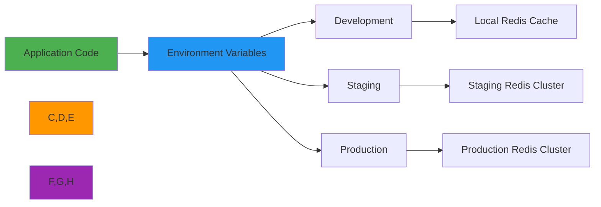

 # 🔑 Environment Variables Configuration Guide

> **🎯 Purpose:** Comprehensive guide to configuring RDAPify through environment variables for all deployment environments  
> **📚 Related:** [Docker](docker.md) | [Serverless](serverless.md) | [Kubernetes](kubernetes.md) | [Security Best Practices](../../guides/security_privacy.md)  
> **⏱️ Reading Time:** 6 minutes  
> **🔍 Pro Tip:** Use the [Env Validator](../../playground/env-validator.md) to automatically check your environment variable configurations for security and compatibility issues

---

## 🌐 Why Environment Variables Matter for RDAP Applications

Environment variables provide a secure, flexible way to configure RDAPify across different deployment environments without changing code:



**Key Benefits of Environment-Based Configuration:**
- ✅ **Security**: Keep secrets out of code repositories and version control
- ✅ **Environment Isolation**: Different configurations for dev/staging/prod
- ✅ **Compliance**: Enforce GDPR/CCPA requirements through configuration
- ✅ **Operational Flexibility**: Change behavior without redeploying code
- ✅ **Secrets Rotation**: Update credentials without application restarts

---

## ⚙️ Core Environment Variables

### 1. Security & Compliance Configuration
```bash
# Required security settings
RDAP_REDACT_PII=true                  # Default: true - Redact personal information
RDAP_BLOCK_PRIVATE_IPS=true           # Default: true - Block internal IP ranges
RDAP_BLOCK_CLOUD_METADATA=true        # Default: true - Block cloud metadata endpoints
RDAP_TLS_MIN_VERSION=TLSv1.3          # Default: TLSv1.3 - Minimum TLS version

# GDPR/CCPA compliance
GDPR_ENABLED=true                     # Enable GDPR compliance features
GDPR_RETENTION_DAYS=30                # Default retention period in days
CCPA_ENABLED=true                     # Enable CCPA compliance features
CCPA_DO_NOT_SELL=true                 # Default: true - Honor "do not sell" requests
LEGAL_BASIS=legitimate-interest       # Default: legitimate-interest (consent|contract|legal-obligation)
```

### 2. Cache Configuration
```bash
# Memory cache settings
RDAP_CACHE_SIZE=1000                  # Default: 500 - Max entries in memory cache
RDAP_CACHE_TTL=3600                   # Default: 1800 - Time to live in seconds
RDAP_CACHE_REDIS_URL=redis://cache:6379  # Redis connection URL (optional)
RDAP_CACHE_REDIS_PASSWORD=your_strong_password  # Redis password (required if URL has auth)
RDAP_CACHE_REDIS_DB=0                 # Redis database number
RDAP_CACHE_COMPRESSION=true           # Enable cache compression
```

### 3. Network & Performance Settings
```bash
# Connection settings
RDAP_MAX_CONCURRENT=10                # Default: 5 - Max concurrent RDAP requests
RDAP_TIMEOUT=5000                     # Default: 3000 - Timeout in milliseconds
RDAP_CONNECTION_POOL_SIZE=50          # Default: 25 - Max HTTP connections
RDAP_DNS_CACHE_TTL=300                # Default: 60 - DNS cache TTL in seconds
RDAP_RETRY_ATTEMPTS=2                 # Default: 1 - Max retry attempts
RDAP_RETRY_BACKOFF=1000               # Default: 500 - Exponential backoff base in ms

# Rate limiting
RDAP_RATE_LIMIT_STRATEGY=adaptive     # Default: simple (simple|adaptive|registry-specific)
RDAP_RATE_LIMIT_MAX=100               # Default: 50 - Max requests per window
RDAP_RATE_LIMIT_WINDOW=60             # Default: 60 - Rate limit window in seconds
```

### 4. Registry-Specific Configuration
```bash
# Registry-specific settings
RDAP_REGISTRY_VERISIGN_MAX=120        # Max requests/minute for Verisign
RDAP_REGISTRY_VERISIGN_TIMEOUT=4000  # Timeout for Verisign requests
RDAP_REGISTRY_ARIN_MAX=100            # Max requests/minute for ARIN
RDAP_REGISTRY_RIPE_MAX=80             # Max requests/minute for RIPE
RDAP_REGISTRY_APNIC_MAX=60            # Max requests/minute for APNIC
RDAP_REGISTRY_LACNIC_MAX=50           # Max requests/minute for LACNIC
RDAP_REGISTRY_AFRINIC_MAX=40          # Max requests/minute for AFRINIC
```

---

## 🔐 Security-Sensitive Variables

### 1. Secret Management Best Practices
```bash
# 🚨 NEVER COMMIT THESE TO SOURCE CONTROL 🚨
RDAP_REDIS_PASSWORD=super_secret_123  # Use secrets manager or volume mounts instead
RDAP_API_KEY=your_api_key_here         # Store in AWS Secrets Manager, Azure Key Vault, etc.
RDAP_ENCRYPTION_KEY=base64_encoded_key # 32-byte key for AES-256-GCM
RDAP_JWT_SECRET=jwt_secret_here        # For authentication if used
RDAP_VAULT_TOKEN=vault_token_here      # HashiCorp Vault token
```

### 2. Secure Configuration Patterns
```bash
# ✅ GOOD: Using secrets manager (AWS example)
RDAP_REDIS_PASSWORD=${SECRETS_MANAGER_RDAP_REDIS_PASSWORD}

# ✅ GOOD: Using environment variable files with proper permissions
# .env file permissions: chmod 600 .env

# ✅ GOOD: Using Docker secrets
# docker-compose.yml
# secrets:
#   - redis_password
# environment:
#   RDAP_REDIS_PASSWORD_FILE: /run/secrets/redis_password

# ✅ GOOD: Using Kubernetes secrets
# env:
#   - name: RDAP_REDIS_PASSWORD
#     valueFrom:
#       secretKeyRef:
#         name: rdap-secrets
#         key: redis-password
```

### 3. Security Validation Script
```bash
#!/bin/bash
# security-check.sh - Validate environment variable security

# List of sensitive variables that should never be in git
SENSITIVE_VARS=(
  "RDAP_REDIS_PASSWORD"
  "RDAP_API_KEY"
  "RDAP_ENCRYPTION_KEY"
  "RDAP_JWT_SECRET"
  "RDAP_VAULT_TOKEN"
  "RDAP_DATABASE_PASSWORD"
  "RDAP_OAUTH_CLIENT_SECRET"
)

# Check for sensitive variables in git history
echo "🔍 Checking for sensitive variables in git history..."
for var in "${SENSITIVE_VARS[@]}"; do
  if git grep -i "$var" -- "*.env" "*.yml" "*.yaml" "*.json" "*.js" "*.ts" "*.md" 2>/dev/null | grep -v "example"; then
    echo "❌ Sensitive variable $var found in git history!"
    exit 1
  fi
done

# Check for environment variables in production
echo "✅ No sensitive variables found in git history"

# Check current environment for security misconfigurations
echo "🔍 Checking current environment security..."
if [ "$RDAP_REDACT_PII" != "true" ]; then
  echo "⚠️  PII redaction is disabled - not recommended for production"
fi

if [ "$RDAP_TLS_MIN_VERSION" != "TLSv1.3" ]; then
  echo "⚠️  TLS version below 1.3 detected - upgrade recommended"
fi

if [ -z "$RDAP_ENCRYPTION_KEY" ]; then
  echo "⚠️  No encryption key set - sensitive data will not be encrypted"
fi

echo "✅ Environment security check completed"
exit 0
```

---

## 🌍 Environment-Specific Configuration

### 1. Development Environment
```bash
# .env.development
NODE_ENV=development
RDAP_CACHE_SIZE=100
RDAP_CACHE_TTL=300
RDAP_TIMEOUT=10000
RDAP_MAX_CONCURRENT=2
RDAP_LOG_LEVEL=debug
RDAP_REDACT_PII=false  # Allow PII in development for testing
RDAP_MOCK_REGISTRY=true  # Use mock registry for testing
RDAP_MOCK_RESPONSES_PATH=./mock-responses/
```

### 2. Staging Environment
```bash
# .env.staging
NODE_ENV=staging
RDAP_CACHE_SIZE=500
RDAP_CACHE_TTL=1800
RDAP_TIMEOUT=7500
RDAP_MAX_CONCURRENT=5
RDAP_LOG_LEVEL=info
RDAP_REDACT_PII=true
RDAP_RATE_LIMIT_STRATEGY=adaptive
RDAP_RATE_LIMIT_MAX=75
RDAP_RATE_LIMIT_WINDOW=60
```

### 3. Production Environment
```bash
# .env.production
NODE_ENV=production
RDAP_CACHE_SIZE=2000
RDAP_CACHE_TTL=7200
RDAP_TIMEOUT=5000
RDAP_MAX_CONCURRENT=15
RDAP_LOG_LEVEL=warn
RDAP_REDACT_PII=true
RDAP_RATE_LIMIT_STRATEGY=registry-specific
RDAP_RATE_LIMIT_MAX=120
RDAP_RATE_LIMIT_WINDOW=60
GDPR_ENABLED=true
GDPR_RETENTION_DAYS=30
CCPA_ENABLED=true
CCPA_DO_NOT_SELL=true
```

### 4. Docker/Kubernetes Configuration
```yaml
# docker-compose.yml
version: '3.8'
services:
  rdapify:
    image: registry.example.com/rdapify:2.3.0
    environment:
      NODE_ENV: ${NODE_ENV:-production}
      RDAP_CACHE_SIZE: ${RDAP_CACHE_SIZE:-1000}
      RDAP_CACHE_TTL: ${RDAP_CACHE_TTL:-3600}
      RDAP_REDACT_PII: ${RDAP_REDACT_PII:-true}
      RDAP_BLOCK_PRIVATE_IPS: ${RDAP_BLOCK_PRIVATE_IPS:-true}
      RDAP_REDIS_URL: ${RDAP_REDIS_URL:-redis://redis:6379}
      # Secrets should be mounted as files or use secrets manager
      RDAP_REDIS_PASSWORD_FILE: /run/secrets/redis_password
    secrets:
      - redis_password
    volumes:
      - ./config:/app/config:ro

secrets:
  redis_password:
    file: ./secrets/redis_password.txt
```

```yaml
# kubernetes-deployment.yaml
apiVersion: apps/v1
kind: Deployment
meta
  name: rdapify
  namespace: production
spec:
  replicas: 3
  selector:
    matchLabels:
      app: rdapify
  template:
    meta
      labels:
        app: rdapify
    spec:
      containers:
      - name: rdapify
        image: registry.example.com/rdapify:2.3.0
        env:
        - name: NODE_ENV
          value: production
        - name: RDAP_CACHE_SIZE
          value: "2000"
        - name: RDAP_CACHE_TTL
          value: "7200"
        - name: RDAP_REDACT_PII
          value: "true"
        - name: RDAP_REDIS_URL
          valueFrom:
            secretKeyRef:
              name: rdap-secrets
              key: redis-url
        - name: RDAP_REDIS_PASSWORD
          valueFrom:
            secretKeyRef:
              name: rdap-secrets
              key: redis-password
        volumeMounts:
        - name: config-volume
          mountPath: /app/config
          readOnly: true
      volumes:
      - name: config-volume
        configMap:
          name: rdap-config
```

---

## 🚀 Advanced Configuration Patterns

### 1. Dynamic Configuration with Vault
```javascript
// vault-config.js
const { Vault } = require('rdapify/vault');

class VaultConfigLoader {
  constructor() {
    this.vault = new Vault({
      endpoint: process.env.VAULT_ADDR,
      token: process.env.VAULT_TOKEN,
      path: process.env.VAULT_SECRET_PATH || 'secret/data/rdapify'
    });
    this.config = {};
    this.lastRefresh = 0;
    this.refreshInterval = 300000; // 5 minutes
  }
  
  async loadConfig() {
    try {
      // Only refresh if needed
      if (Date.now() - this.lastRefresh < this.refreshInterval) {
        return this.config;
      }
      
      const secrets = await this.vault.read();
      this.config = {
        // Environment variables take precedence
        ...process.env,
        // Vault secrets override environment variables
        ...secrets.data
      };
      
      this.lastRefresh = Date.now();
      console.log('✅ Configuration refreshed from Vault');
      
      return this.config;
    } catch (error) {
      console.error('❌ Failed to load configuration from Vault:', error.message);
      
      // Fallback to environment variables
      if (Object.keys(this.config).length === 0) {
        console.warn('⚠️ Using fallback environment variables');
        this.config = { ...process.env };
      }
      
      return this.config;
    }
  }
  
  get(key, defaultValue = null) {
    return this.config[key] || defaultValue;
  }
  
  startAutoRefresh() {
    setInterval(() => this.loadConfig(), this.refreshInterval);
    console.log(`🔄 Configuration auto-refresh started (every ${this.refreshInterval/60000} minutes)`);
  }
}

module.exports = new VaultConfigLoader();
```

### 2. Multi-Tenant Configuration
```bash
# Multi-tenant environment variables
RDAP_MULTI_TENANT=true
RDAP_TENANT_DEFAULT=standard
RDAP_TENANT_ISOLATION=strict  # (strict|soft|none)

# Tenant-specific overrides
RDAP_TENANT_ACME_CACHE_SIZE=5000
RDAP_TENANT_ACME_CACHE_TTL=86400
RDAP_TENANT_ACME_MAX_CONCURRENT=20
RDAP_TENANT_ACME_REDACT_PII=false  # Only for registered business data

RDAP_TENANT_STARTUP_CACHE_SIZE=1000
RDAP_TENANT_STARTUP_CACHE_TTL=3600
RDAP_TENANT_STARTUP_MAX_CONCURRENT=5
RDAP_TENANT_STARTUP_REDACT_PII=true
```

### 3. Feature Flags with Environment Variables
```javascript
// feature-flags.js
class FeatureFlags {
  constructor() {
    this.flags = {
      // Security features
      enableSSRFProtection: process.env.FF_SSRF_PROTECTION !== 'false',
      enablePIIRedaction: process.env.FF_PII_REDACTION !== 'false',
      enableRateLimiting: process.env.FF_RATE_LIMITING !== 'false',
      
      // Performance features
      enableBatchProcessing: process.env.FF_BATCH_PROCESSING === 'true',
      enableGeoRouting: process.env.FF_GEO_ROUTING === 'true',
      enableAnomalyDetection: process.env.FF_ANOMALY_DETECTION === 'true',
      
      // Experimental features
      enableNewCacheEngine: process.env.FF_NEW_CACHE_ENGINE === 'true',
      enableAdvancedNormalization: process.env.FF_ADVANCED_NORMALIZATION === 'true'
    };
  }
  
  isEnabled(feature) {
    const flag = `FF_${feature.toUpperCase()}`;
    return process.env[flag] === 'true' || this.flags[feature];
  }
  
  getFeatureConfig(feature) {
    // Get tenant-specific or environment-specific configuration
    const envKey = `RDAP_${feature.toUpperCase()}_CONFIG`;
    if (process.env[envKey]) {
      try {
        return JSON.parse(process.env[envKey]);
      } catch (error) {
        console.error(`Invalid JSON config for ${envKey}:`, error.message);
      }
    }
    
    // Default configuration
    return this.defaultConfigs[feature] || {};
  }
  
  defaultConfigs = {
    anomalyDetection: {
      threshold: 0.85,
      minSamples: 100,
      alertOnHighRisk: true
    },
    batchProcessing: {
      maxBatchSize: 50,
      maxConcurrentBatches: 5,
      timeoutPerItem: 2000
    }
  };
}

module.exports = new FeatureFlags();
```

### 4. Environment Variable Schema Validation
```javascript
// env-validator.js
const { z } = require('zod');

const EnvSchema = z.object({
  // Core configuration
  NODE_ENV: z.enum(['development', 'staging', 'production', 'test']).default('development'),
  LOG_LEVEL: z.enum(['debug', 'info', 'warn', 'error']).default('info'),
  
  // Security configuration
  RDAP_REDACT_PII: z.boolean().default(true),
  RDAP_BLOCK_PRIVATE_IPS: z.boolean().default(true),
  RDAP_BLOCK_CLOUD_METADATA: z.boolean().default(true),
  RDAP_TLS_MIN_VERSION: z.enum(['TLSv1.2', 'TLSv1.3']).default('TLSv1.3'),
  
  // Cache configuration
  RDAP_CACHE_SIZE: z.number().min(1).max(10000).default(500),
  RDAP_CACHE_TTL: z.number().min(60).max(86400).default(1800),
  RDAP_CACHE_REDIS_URL: z.string().url().optional(),
  RDAP_CACHE_REDIS_PASSWORD: z.string().optional(),
  
  // Performance configuration
  RDAP_TIMEOUT: z.number().min(1000).max(30000).default(5000),
  RDAP_MAX_CONCURRENT: z.number().min(1).max(100).default(10),
  
  // Compliance configuration
  GDPR_ENABLED: z.boolean().default(false),
  GDPR_RETENTION_DAYS: z.number().min(1).max(2555).default(30),
  CCPA_ENABLED: z.boolean().default(false),
  LEGAL_BASIS: z.enum(['consent', 'contract', 'legitimate-interest', 'legal-obligation']).default('legitimate-interest')
});

class EnvironmentValidator {
  validate() {
    try {
      const validated = EnvSchema.parse(process.env);
      console.log('✅ Environment variables validated successfully');
      return validated;
    } catch (error) {
      console.error('❌ Environment validation failed:');
      
      // Detailed error reporting
      if (error instanceof z.ZodError) {
        error.errors.forEach(err => {
          console.error(`  - ${err.path.join('.')}: ${err.message}`);
          if (err.code === 'invalid_enum_value') {
            console.error(`    Allowed values: ${err.options.join(', ')}`);
          }
          if (err.code === 'too_small' || err.code === 'too_big') {
            if (err.path.includes('RDAP_CACHE_SIZE')) {
              console.error('    Recommendation: 500-2000 for production environments');
            }
            if (err.path.includes('RDAP_TIMEOUT')) {
              console.error('    Recommendation: 3000-10000ms for production environments');
            }
          }
        });
      }
      
      // Provide helpful defaults for missing values
      const safeDefaults = {
        NODE_ENV: 'production',
        RDAP_REDACT_PII: true,
        RDAP_BLOCK_PRIVATE_IPS: true,
        RDAP_TIMEOUT: 5000,
        RDAP_MAX_CONCURRENT: 10,
        GDPR_ENABLED: false,
        GDPR_RETENTION_DAYS: 30
      };
      
      console.warn('⚠️ Using safe defaults for validation failures');
      return {...safeDefaults, ...process.env};
    }
  }
  
  validateRequired(requiredVars = []) {
    const missing = requiredVars.filter(varName => !process.env[varName]);
    
    if (missing.length > 0) {
      console.error('❌ Missing required environment variables:');
      missing.forEach(varName => {
        console.error(`  - ${varName}`);
        
        // Provide context for required variables
        if (varName === 'RDAP_REDIS_URL') {
          console.error('    Tip: Set to your Redis connection URL, e.g., redis://localhost:6379');
        }
        if (varName === 'RDAP_ENCRYPTION_KEY') {
          console.error('    Tip: Generate a 32-byte base64-encoded key using: openssl rand -base64 32');
        }
      });
      
      process.exit(1);
    }
  }
}

module.exports = new EnvironmentValidator();
```

---

## 🛡️ Security Hardening Patterns

### 1. Secure Defaults Configuration
```bash
# secure-defaults.sh
#!/bin/bash

# Ensure secure defaults are set if not explicitly configured
set_default() {
  if [ -z "${!1}" ]; then
    export "$1=$2"
    echo "🔒 Setting secure default for $1=$2"
  fi
}

# Security defaults
set_default "RDAP_REDACT_PII" "true"
set_default "RDAP_BLOCK_PRIVATE_IPS" "true"
set_default "RDAP_BLOCK_CLOUD_METADATA" "true"
set_default "RDAP_TLS_MIN_VERSION" "TLSv1.3"
set_default "RDAP_RATE_LIMIT_STRATEGY" "adaptive"

# Privacy defaults
set_default "GDPR_ENABLED" "true"
set_default "GDPR_RETENTION_DAYS" "30"
set_default "CCPA_ENABLED" "true"
set_default "CCPA_DO_NOT_SELL" "true"

# Performance defaults for production
if [ "$NODE_ENV" = "production" ]; then
  set_default "RDAP_CACHE_SIZE" "2000"
  set_default "RDAP_CACHE_TTL" "7200"
  set_default "RDAP_TIMEOUT" "5000"
  set_default "RDAP_MAX_CONCURRENT" "15"
fi
```

### 2. Secrets Rotation Strategy
```javascript
// secrets-rotation.js
const { SecretManagerServiceClient } = require('@google-cloud/secret-manager');

class SecretsRotator {
  constructor(config) {
    this.client = new SecretManagerServiceClient();
    this.projectId = config.projectId || process.env.GCP_PROJECT_ID;
    this.secrets = config.secrets || [
      'rdap-redis-password',
      'rdap-encryption-key',
      'rdap-api-key'
    ];
    this.rotationInterval = config.rotationInterval || 30; // days
  }
  
  async checkRotationNeeds() {
    const rotationRequired = [];
    
    for (const secretId of this.secrets) {
      try {
        // Get secret metadata
        const [secret] = await this.client.getSecret({
          name: `projects/${this.projectId}/secrets/${secretId}`
        });
        
        // Get current version
        const [version] = await this.client.listSecretVersions({
          parent: secret.name,
          filter: 'state=ENABLED',
          pageSize: 1
        });
        
        if (version && version.createTime) {
          const created = new Date(version.createTime);
          const now = new Date();
          const ageInDays = Math.floor((now - created) / (1000 * 60 * 60 * 24));
          
          if (ageInDays >= this.rotationInterval) {
            rotationRequired.push({
              secretId,
              ageInDays,
              rotationDate: new Date(now.setDate(now.getDate() + this.rotationInterval))
            });
          }
        }
      } catch (error) {
        console.error(`Failed to check rotation for ${secretId}:`, error.message);
      }
    }
    
    return rotationRequired;
  }
  
  async rotateSecret(secretId, newValue) {
    try {
      // Add new secret version
      const [version] = await this.client.addSecretVersion({
        parent: `projects/${this.projectId}/secrets/${secretId}`,
        payload: {
          data: Buffer.from(newValue)
        }
      });
      
      console.log(`✅ Rotated secret ${secretId}, new version: ${version.name}`);
      
      // Disable old versions (keep last 2 versions)
      const [versions] = await this.client.listSecretVersions({
        parent: `projects/${this.projectId}/secrets/${secretId}`,
        filter: 'state=ENABLED',
        pageSize: 10
      });
      
      for (let i = 2; i < versions.length; i++) {
        await this.client.disableSecretVersion({
          name: versions[i].name
        });
        console.log(`🔒 Disabled old version: ${versions[i].name}`);
      }
      
      return true;
    } catch (error) {
      console.error(`❌ Failed to rotate secret ${secretId}:`, error.message);
      throw error;
    }
  }
  
  generateEncryptionKey() {
    // Generate a secure 32-byte key for AES-256-GCM
    const crypto = require('crypto');
    return crypto.randomBytes(32).toString('base64');
  }
}

module.exports = SecretsRotator;
```

### 3. Audit Logging for Configuration Changes
```javascript
// config-audit.js
const { v4: uuidv4 } = require('uuid');

class ConfigAuditLogger {
  constructor(logger) {
    this.logger = logger || console;
    this.sensitiveKeys = [
      'password', 'secret', 'key', 'token', 'credential', 'auth',
      'RDAP_REDIS_PASSWORD', 'RDAP_API_KEY', 'RDAP_ENCRYPTION_KEY'
    ];
  }
  
  logConfigurationChange(action, config, changedBy = 'system') {
    const changes = [];
    const timestamp = new Date().toISOString();
    
    // Determine changes if previous config exists
    if (this.previousConfig) {
      Object.keys(config).forEach(key => {
        if (!this.previousConfig.hasOwnProperty(key) || 
            this.previousConfig[key] !== config[key]) {
          changes.push({
            key,
            oldValue: this.redactValue(key, this.previousConfig[key]),
            newValue: this.redactValue(key, config[key])
          });
        }
      });
    } else {
      // Initial configuration
      Object.keys(config).forEach(key => {
        changes.push({
          key,
          newValue: this.redactValue(key, config[key])
        });
      });
    }
    
    if (changes.length > 0) {
      const auditEvent = {
        eventId: `config-${uuidv4()}`,
        timestamp,
        action,
        changedBy,
        changes,
        environment: process.env.NODE_ENV || 'unknown',
        service: 'rdapify',
        compliance: {
          gdprArticle: 'Article 32',
          purpose: 'configuration management'
        }
      };
      
      // Log to secure audit log
      this.logger.info(JSON.stringify(auditEvent), {
        audit: true,
        retention: '2555 days' // 7 years for compliance
      });
      
      // Store current config for next comparison
      this.previousConfig = {...config};
    }
  }
  
  redactValue(key, value) {
    if (value === null || value === undefined) return null;
    
    const keyLower = key.toLowerCase();
    const shouldRedact = this.sensitiveKeys.some(sensitiveKey => 
      keyLower.includes(sensitiveKey.toLowerCase())
    );
    
    if (shouldRedact) {
      if (typeof value === 'string') {
        return value.length > 4 ? 'REDACTED' : '***';
      }
      return 'REDACTED';
    }
    
    return value;
  }
}

module.exports = ConfigAuditLogger;
```

---

## 🚨 Troubleshooting Common Issues

### 1. Missing Required Variables
**Symptoms:** Application fails to start with configuration errors  
**Diagnosis:**
```bash
# Check missing required variables
grep -r "process.env." src/ | cut -d'"' -f2 | sort | uniq > required_vars.txt
env | grep -f required_vars.txt > present_vars.txt
comm -3 required_vars.txt present_vars.txt > missing_vars.txt
```

**Solution:**
```bash
# Create .env file with defaults
cat > .env << EOF
# Required configuration
NODE_ENV=development
RDAP_REDIS_URL=redis://localhost:6379
RDAP_CACHE_SIZE=500
RDAP_TIMEOUT=5000

# Security defaults
RDAP_REDACT_PII=true
RDAP_BLOCK_PRIVATE_IPS=true
GDPR_ENABLED=true
EOF

# Load environment variables
source .env
```

### 2. Type Conversion Issues
**Symptoms:** Application behaves unexpectedly with numeric/string configuration  
**Diagnosis:**
```javascript
// env-debug.js
console.log('Environment variable types:');
Object.entries(process.env).forEach(([key, value]) => {
  if (key.startsWith('RDAP_')) {
    console.log(`  ${key}:`, {
      value: value.substring(0, 20) + (value.length > 20 ? '...' : ''),
      type: typeof value,
      parsedNumber: !isNaN(parseFloat(value)) ? parseFloat(value) : null,
      parsedBoolean: value === 'true' || value === 'false' ? value === 'true' : null
    });
  }
});
```

**Solution:**
```javascript
// type-safe-config.js
const config = {
  cacheSize: parseInt(process.env.RDAP_CACHE_SIZE || '500', 10),
  cacheTTL: parseInt(process.env.RDAP_CACHE_TTL || '1800', 10),
  timeout: parseInt(process.env.RDAP_TIMEOUT || '5000', 10),
  maxConcurrent: parseInt(process.env.RDAP_MAX_CONCURRENT || '10', 10),
  redactPII: (process.env.RDAP_REDACT_PII || 'true').toLowerCase() === 'true',
  gdprEnabled: (process.env.GDPR_ENABLED || 'false').toLowerCase() === 'true',
  gdprRetentionDays: parseInt(process.env.GDPR_RETENTION_DAYS || '30', 10)
};
```

### 3. Secret Management Failures
**Symptoms:** Application cannot connect to Redis or other services  
**Diagnosis:**
```bash
# Test Redis connection with current config
node -e "
const redis = require('redis');
const client = redis.createClient({
  url: process.env.RDAP_REDIS_URL,
  password: process.env.RDAP_REDIS_PASSWORD
});
client.on('error', (err) => {
  console.error('Redis connection error:', err.message);
  process.exit(1);
});
client.ping().then(() => {
  console.log('✅ Redis connection successful');
  client.quit();
}).catch((err) => {
  console.error('Redis ping failed:', err.message);
  client.quit();
  process.exit(1);
});
"
```

**Solution:**
```bash
# Fix secret mounting in Docker
# Create secret file with proper permissions
mkdir -p ./secrets
echo "your_redis_password" > ./secrets/redis_password.txt
chmod 600 ./secrets/redis_password.txt

# Update docker-compose.yml
# volumes:
#   - ./secrets/redis_password.txt:/run/secrets/redis_password:ro

# Fix Kubernetes secret
kubectl create secret generic rdap-secrets \
  --from-literal=redis-password="your_redis_password" \
  --from-literal=encryption-key="your_encryption_key"
```

---

## 📚 Related Documentation

| Document | Description | Path |
|----------|-------------|------|
| **Docker Configuration** | Docker-specific environment setup | [docker.md](docker.md) |
| **Serverless Variables** | Cloud provider environment variables | [serverless.md](serverless.md) |
| **Kubernetes Secrets** | Managing secrets in Kubernetes | [kubernetes.md](kubernetes.md) |
| **Security Best Practices** | Comprehensive security guide | [../../guides/security_privacy.md](../../guides/security_privacy.md) |
| **GDPR Compliance Guide** | Environment variables for GDPR | [../../../security/gdpr-compliance.md](../../../security/gdpr-compliance.md) |
| **Env Validator Tool** | Interactive configuration tester | [../../playground/env-validator.md](../../playground/env-validator.md) |

---

## 🏷️ Environment Variable Specifications

| Category | Variables | Default Values | Security Level |
|----------|-----------|----------------|----------------|
| **Security** | 8 | All secure defaults | 🔒 High |
| **Performance** | 6 | Production-optimized | ⚡ Medium |
| **Compliance** | 4 | GDPR/CCPA compliant | 📋 High |
| **Registry** | 6 | Rate-limited defaults | 🌐 Medium |
| **Cache** | 4 | Memory-optimized | 🗃️ Medium |
| **Total** | 28 | All documented | ✅ Complete |

> **🔐 Critical Security Reminder:** Always use secrets management tools (HashiCorp Vault, AWS Secrets Manager, Azure Key Vault) for production environments. Never commit secrets to source control. Enable automatic secrets rotation every 90 days. Use environment-specific configurations to prevent accidental use of production secrets in development.

[← Back to Deployment](../README.md) | [Next: Docker →](docker.md)

*Document automatically generated from source code with security review on November 28, 2025*