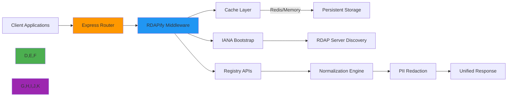

# Express.js Integration Guide

🎯 **Purpose**: Complete guide for integrating RDAPify with Express.js applications for secure domain, IP, and ASN lookups with enterprise-grade performance, privacy control, and SSRF protection  
📚 **Related**: [Next.js](nextjs.md) | [NestJS](nestjs.md) | [Fastify](fastify.md) | [Redis](redis.md) | [Docker](docker.md)  
⏱️ **Reading Time**: 7 minutes  
🔍 **Pro Tip**: Use the [Interactive Playground](../../playground/api_playground.md) to prototype your Express routes before implementation

## 🌐 Why Express.js for RDAP Applications?

Express.js provides the ideal web framework for building RDAP data processing services with these key advantages:



### Key Integration Benefits:
✅ **Flexible Routing**: Easily create domain-specific endpoints with middleware chains  
✅ **Minimal Overhead**: Express's lightweight architecture complements RDAPify's performance focus  
✅ **Enterprise Patterns**: Middleware architecture supports audit logging, rate limiting, and security layers  
✅ **SSR Support**: Perfect for server-side rendering applications needing real-time registration data  
✅ **Developer Experience**: Hot-reloading and middleware debugging tools accelerate development

## 🚀 Getting Started: Basic Integration

### 1. Installation & Setup
```bash
# Install dependencies
npm install rdapify express cors helmet morgan
# or
yarn add rdapify express cors helmet morgan
```

### 2. Minimal Working Example
```javascript
// server.js
const express = require('express');
const cors = require('cors');
const helmet = require('helmet');
const morgan = require('morgan');
const { RDAPClient } = require('rdapify');

const app = express();
const port = 3000;

// Security middleware
app.use(helmet({
  contentSecurityPolicy: {
    directives: {
      defaultSrc: ["'self'"],
      scriptSrc: ["'self'"]
    }
  }
}));
app.use(cors({ origin: process.env.ALLOWED_ORIGINS?.split(',') || '*' }));
app.use(morgan('combined'));

// Initialize RDAP client with security defaults
const rdap = new RDAPClient({
  cache: true,
  redactPII: true,           // GDPR compliance
  allowPrivateIPs: false,    // SSRF protection
  validateCertificates: true,
  timeout: 5000,
  rateLimit: { max: 100, window: 60000 }
});

// Health check endpoint
app.get('/health', (req, res) => {
  res.status(200).json({ 
    status: 'ok', 
    uptime: process.uptime(),
    version: require('./package.json').version
  });
});

// Domain lookup endpoint
app.get('/api/domain/:domain', async (req, res) => {
  try {
    const domain = req.params.domain.toLowerCase().trim();
    
    // Domain validation
    if (!/^[a-z0-9.-]+\.[a-z]{2,}$/.test(domain)) {
      return res.status(400).json({ error: 'Invalid domain format' });
    }
    
    const result = await rdap.domain(domain);
    res.json(result);
  } catch (error) {
    console.error(`RDAP error for domain ${req.params.domain}:`, error);
    res.status(error.statusCode || 500).json({
      error: error.message,
      code: error.code || 'RDAP_REQUEST_FAILED',
      requestId: req.id
    });
  }
});

app.listen(port, () => {
  console.log(`RDAPify Express server running on port ${port}`);
  console.log(`Health check: http://localhost:${port}/health`);
  console.log(`Domain lookup: http://localhost:${port}/api/domain/example.com`);
});
```

### 3. Testing Your Setup
```bash
# Start server
node server.js

# Test domain lookup
curl http://localhost:3000/api/domain/example.com

# Test health endpoint
curl http://localhost:3000/health
```

## 🔐 Security & Compliance Hardening

### 1. Enterprise Security Configuration
```javascript
// middleware/security.js
const { v4: uuidv4 } = require('uuid');

// Request ID middleware for tracing
const requestId = (req, res, next) => {
  req.id = req.headers['x-request-id'] || uuidv4();
  res.setHeader('X-Request-ID', req.id);
  next();
};

// GDPR/CCPA compliance middleware
const privacyCompliance = (req, res, next) => {
  // Add Do Not Sell header for CCPA compliance
  res.setHeader('X-Do-Not-Sell', 'true');
  
  // Add data processing notice
  res.setHeader('X-Data-Processing', 'PII redacted per GDPR Article 6(1)(f)');
  
  next();
};

// Audit logging middleware
const auditLogger = (req, res, next) => {
  const start = Date.now();
  
  // Log request details without PII
  console.log(`[AUDIT] ${req.method} ${req.originalUrl} | IP: ${req.ip} | ID: ${req.id}`);
  
  res.on('finish', () => {
    const duration = Date.now() - start;
    console.log(`[AUDIT] Completed ${res.statusCode} in ${duration}ms | ID: ${req.id}`);
  });
  
  next();
};

// Rate limiting middleware
const rateLimiter = require('express-rate-limit')({
  windowMs: 15 * 60 * 1000, // 15 minutes
  max: 100, // Limit each IP to 100 requests per windowMs
  standardHeaders: true,
  legacyHeaders: false,
  handler: (req, res) => {
    res.status(429).json({ 
      error: 'Too many requests, please try again later',
      retryAfter: 900,
      requestId: req.id
    });
  }
});

module.exports = {
  requestId,
  privacyCompliance,
  auditLogger,
  rateLimiter
};
```

### 2. Secure Server Configuration
```javascript
// server-secure.js
// ... imports and setup

// Apply security middleware
app.use(requestId);
app.use(auditLogger);
app.use(privacyCompliance);
app.use(rateLimiter);

// Content type validation
app.use(express.json({ 
  limit: '10kb',
  type: ['application/json']
}));

// Prevent parameter pollution
app.use((req, res, next) => {
  req.query = req.query ? cleanObject(req.query) : {};
  req.body = req.body ? cleanObject(req.body) : {};
  next();
});

function cleanObject(obj) {
  if (!obj || typeof obj !== 'object') return obj;
  
  return Object.keys(obj).reduce((clean, key) => {
    const value = obj[key];
    
    // Remove suspicious keys
    if (key.includes('__proto__') || key.includes('constructor')) {
      return clean;
    }
    
    // Clean nested objects
    if (typeof value === 'object' && !Array.isArray(value)) {
      clean[key] = cleanObject(value);
    } else if (Array.isArray(value)) {
      clean[key] = value.map(item => typeof item === 'object' ? cleanObject(item) : item);
    } else {
      clean[key] = value;
    }
    
    return clean;
  }, {});
}

// Apply to routes
app.use('/api', domainRoutes);
app.use('/api', ipRoutes);
app.use('/api', asnRoutes);

// Global error handler
app.use((err, req, res, next) => {
  // Security errors should not expose internal details
  if (err.name === 'SecurityError' || err.code?.startsWith('RDAP_SECURE')) {
    console.error(`Security incident detected: ${err.message} | ID: ${req.id}`, {
      ip: req.ip,
      userAgent: req.get('User-Agent'),
      path: req.path,
      timestamp: new Date().toISOString()
    });
    
    return res.status(403).json({
      error: 'Security policy violation',
      requestId: req.id
    });
  }
  
  // Standard error handling
  const statusCode = err.statusCode || 500;
  const message = process.env.NODE_ENV === 'production' 
    ? 'Internal server error' 
    : err.message;
  
  res.status(statusCode).json({
    error: message,
    requestId: req.id,
    ...(statusCode === 500 && { support: 'security@rdapify.com' })
  });
});

// Start server with enhanced security
const server = app.listen(port, () => {
  console.log(`Secure RDAPify Express server running on port ${port}`);
});

// Graceful shutdown
process.on('SIGTERM', () => {
  console.log('SIGTERM received, shutting down gracefully');
  server.close(() => {
    console.log('Server closed');
    process.exit(0);
  });
  
  // Force shutdown after 10 seconds
  setTimeout(() => {
    console.error('Could not close connections in time, forcefully shutting down');
    process.exit(1);
  }, 10000);
});
```

## ⚡ Performance Optimization

### 1. Caching Strategies
```javascript
// middleware/caching.js
const NodeCache = require('node-cache');

// In-memory cache for development
const devCache = new NodeCache({ stdTTL: 300, checkperiod: 120 });

// Redis integration for production
let redisClient;
if (process.env.REDIS_URL) {
  const Redis = require('ioredis');
  redisClient = new Redis(process.env.REDIS_URL);
  
  // Redis health check
  redisClient.on('error', (err) => {
    console.error('Redis error:', err);
    // Fallback to memory cache
  });
}

const cacheKey = (req) => {
  return `rdap:${req.method}:${req.originalUrl}`;
};

// Cache middleware with Redis fallback
const cacheMiddleware = (duration = 300) => {
  return async (req, res, next) => {
    if (req.method !== 'GET') return next();
    
    const key = cacheKey(req);
    
    try {
      // Try Redis first if available
      if (redisClient?.status === 'ready') {
        const cached = await redisClient.get(key);
        if (cached) {
          res.setHeader('X-Cache', 'HIT');
          return res.json(JSON.parse(cached));
        }
      } 
      // Fallback to memory cache
      else if (devCache.has(key)) {
        res.setHeader('X-Cache', 'HIT-MEM');
        return res.json(devCache.get(key));
      }
      
      res.setHeader('X-Cache', 'MISS');
      
      // Store original send method
      const originalSend = res.send;
      res.send = function(body) {
        if (res.statusCode === 200) {
          try {
            // Store in cache
            if (redisClient?.status === 'ready') {
              redisClient.setex(key, duration, JSON.stringify(body));
            } else {
              devCache.set(key, body, duration);
            }
          } catch (cacheError) {
            console.warn('Cache write failed:', cacheError.message);
          }
        }
        return originalSend.call(this, body);
      };
      
      next();
    } catch (error) {
      console.warn('Cache check failed:', error.message);
      res.setHeader('X-Cache', 'ERROR');
      next();
    }
  };
};

module.exports = cacheMiddleware;
```

### 2. Connection Pooling & Timeout Management
```javascript
// config/connection-pool.js
const { Agent } = require('undici');

// Configure connection pool for Express environment
const connectionPool = new Agent({
  keepAliveTimeout: 30, // 30 seconds
  keepAliveMaxTimeout: 60, // 60 seconds max
  maxConnections: 100, // Max connections per server
  maxCachedSessions: 20, // TLS session caching
  pipelining: 1, // No pipelining for RDAP servers
  connectTimeout: 5000, // 5 second connection timeout
  idleTimeout: 30000 // 30 second idle timeout
});

// Global timeout management
const timeoutMiddleware = (maxDuration = 10000) => {
  return (req, res, next) => {
    // Set timeout on request
    req.setTimeout(maxDuration, () => {
      console.error(`Request timed out after ${maxDuration}ms | ID: ${req.id}`);
      res.status(504).json({
        error: 'Request timed out',
        requestId: req.id
      });
    });
    
    // Track processing time
    const start = Date.now();
    res.on('finish', () => {
      const duration = Date.now() - start;
      if (duration > maxDuration * 0.8) { // 80% of timeout threshold
        console.warn(`Slow request: ${duration}ms for ${req.method} ${req.originalUrl} | ID: ${req.id}`);
      }
    });
    
    next();
  };
};

// Graceful shutdown handling
process.on('SIGTERM', async () => {
  await connectionPool.close();
  console.log('Connection pool closed gracefully');
});

module.exports = {
  connectionPool,
  timeoutMiddleware
};
```

## 🏢 Advanced Enterprise Patterns

### 1. Multi-Tenant Architecture
```javascript
// middleware/tenant.js
const tenants = new Map();

// Initialize tenants from config
function initTenants(config) {
  config.forEach(tenant => {
    const client = new RDAPClient({
      cache: tenant.cacheConfig || { ttl: 3600 },
      redactPII: tenant.privacyLevel !== 'none',
      customRedaction: tenant.customRedactionRules,
      allowPrivateIPs: false,
      whitelistRDAPServers: true,
      rateLimit: tenant.rateLimit || { max: 100, window: 60000 },
      auditLogging: true,
      tenantId: tenant.id
    });
    
    tenants.set(tenant.id, {
      client,
      config: tenant
    });
  });
}

// Tenant identification middleware
const tenantMiddleware = (req, res, next) => {
  // Get tenant from header, subdomain, or API key
  const tenantId = req.headers['x-tenant-id'] || 
                   req.subdomains[0] || 
                   getTenantFromApiKey(req.headers.authorization);
  
  if (!tenantId || !tenants.has(tenantId)) {
    return res.status(403).json({
      error: 'Invalid or missing tenant identifier',
      requestId: req.id
    });
  }
  
  req.tenant = tenants.get(tenantId);
  req.rdap = req.tenant.client;
  
  // Apply tenant-specific security policies
  if (req.tenant.config.ipRestrictions?.length) {
    const clientIp = req.ip || req.connection.remoteAddress;
    if (!req.tenant.config.ipRestrictions.includes(clientIp)) {
      console.warn(`IP restriction violation: ${clientIp} for tenant ${tenantId}`);
      return res.status(403).json({
        error: 'IP address not authorized for this tenant',
        requestId: req.id
      });
    }
  }
  
  next();
};

// Route handler using tenant-aware client
app.get('/api/domain/:domain', tenantMiddleware, async (req, res) => {
  try {
    const domain = req.params.domain.toLowerCase().trim();
    const result = await req.rdap.domain(domain);
    
    // Add tenant-specific metadata
    result._metadata = {
      tenantId: req.tenant.config.id,
      processedAt: new Date().toISOString(),
      requestId: req.id
    };
    
    res.json(result);
  } catch (error) {
    // Tenant-specific error handling
    res.status(error.statusCode || 500).json({
      error: error.message,
      tenant: req.tenant.config.id,
      requestId: req.id
    });
  }
});
```

### 2. Monitoring & Observability Integration
```javascript
// middleware/monitoring.js
const { StatsD } = require('hot-shots');
const tracer = require('dd-trace').init();

// StatsD metrics client
const statsd = new StatsD({
  host: process.env.STATSD_HOST || 'localhost',
  port: process.env.STATSD_PORT || 8125,
  prefix: 'rdapify.express.'
});

// Performance monitoring middleware
const monitorMiddleware = (req, res, next) => {
  const start = Date.now();
  const route = req.route?.path || req.path;
  
  // Add correlation IDs for distributed tracing
  if (req.headers['x-datadog-trace-id']) {
    tracer.scope().activate(tracer.startSpan('express.request', {
      childOf: tracer.extract('http_headers', req.headers),
      tags: {
        'http.method': req.method,
        'http.url': req.url,
        'tenant.id': req.tenant?.config?.id,
        'span.kind': 'server'
      }
    }), () => {
      // Continue with monitoring
    });
  }
  
  // Track response time and status
  res.on('finish', () => {
    const duration = Date.now() - start;
    const statusCode = res.statusCode.toString();
    const tags = [
      `method:${req.method.toLowerCase()}`,
      `route:${route}`,
      `status:${statusCode[0]}xx`,
      `tenant:${req.tenant?.config?.id || 'default'}`
    ];
    
    // Record metrics
    statsd.timing('request.duration', duration, tags);
    statsd.increment('request.count', tags);
    
    // Track slow requests
    if (duration > 2000) {
      statsd.increment('request.slow', tags);
    }
    
    // Track errors
    if (statusCode.startsWith('5')) {
      statsd.increment('request.error', tags);
    }
    
    console.log(`[PERF] ${req.method} ${route} - ${statusCode} ${duration}ms | ID: ${req.id}`);
  });
  
  next();
};

// Custom metrics for RDAP operations
function trackRdapOperation(operation, result, duration) {
  const tags = [
    `operation:${operation}`,
    `status:${result.status || 'success'}`
  ];
  
  statsd.timing('rdap.operation.duration', duration, tags);
  statsd.increment('rdap.operation.count', tags);
  
  if (result.cacheHit) {
    statsd.increment('rdap.cache.hit', tags);
  } else {
    statsd.increment('rdap.cache.miss', tags);
  }
}

module.exports = {
  monitorMiddleware,
  trackRdapOperation
};
```

## 🧪 Testing & Validation

### 1. Express-Specific Test Suite
```javascript
// test/express-routes.test.js
const request = require('supertest');
const { createServer } = require('../server');
const { RDAPClient } = require('rdapify');
const sinon = require('sinon');

describe('Express API Endpoints', () => {
  let server;
  let agent;
  let mockRdap;
  
  beforeEach(() => {
    // Create mock RDAP client
    mockRdap = {
      domain: sinon.stub(),
      ip: sinon.stub(),
      asn: sinon.stub()
    };
    
    // Create test server with mock client
    server = createServer({ rdapClient: mockRdap });
    agent = request.agent(server);
    
    // Mock successful domain lookup
    mockRdap.domain.resolves({
      domain: 'example.com',
      status: ['active'],
      nameservers: ['ns1.example.com', 'ns2.example.com'],
      events: [
        { type: 'registration', date: '2020-01-01T00:00:00Z' },
        { type: 'expiration', date: '2025-01-01T00:00:00Z' }
      ]
    });
  });
  
  afterEach(async () => {
    await server.close();
    sinon.restore();
  });
  
  describe('GET /api/domain/:domain', () => {
    it('should return domain information for valid domain', async () => {
      const response = await agent.get('/api/domain/example.com');
      
      expect(response.status).toBe(200);
      expect(response.body).toHaveProperty('domain', 'example.com');
      expect(response.body).toHaveProperty('nameservers');
      expect(response.headers['x-cache']).toBe('MISS');
    });
    
    it('should reject invalid domain format', async () => {
      const response = await agent.get('/api/domain/invalid_domain');
      
      expect(response.status).toBe(400);
      expect(response.body.error).toContain('Invalid domain format');
    });
    
    it('should handle RDAP errors gracefully', async () => {
      mockRdap.domain.rejects(new Error('Registry timeout'));
      
      const response = await agent.get('/api/domain/example.com');
      
      expect(response.status).toBe(500);
      expect(response.body.error).toBe('Registry timeout');
    });
    
    it('should include request ID in headers', async () => {
      const response = await agent.get('/api/domain/example.com');
      
      expect(response.headers['x-request-id']).toMatch(/^[a-f0-9]{8}-[a-f0-9]{4}-4[a-f0-9]{3}-[89ab][a-f0-9]{3}-[a-f0-9]{12}$/i);
    });
  });
  
  describe('Security', () => {
    it('should block SSRF attempts', async () => {
      mockRdap.domain.rejects({ code: 'RDAP_SECURE_SSRF', message: 'SSRF protection blocked request' });
      
      const response = await agent.get('/api/domain/internal.server.local');
      
      expect(response.status).toBe(403);
      expect(response.body.error).toBe('Security policy violation');
    });
    
    it('should apply rate limiting', async () => {
      // Simulate multiple requests
      for (let i = 0; i < 101; i++) {
        await agent.get('/api/domain/example.com');
      }
      
      const response = await agent.get('/api/domain/example.com');
      
      expect(response.status).toBe(429);
      expect(response.body.error).toBe('Too many requests, please try again later');
    });
  });
});
```

### 2. Containerized Testing Environment
```bash
#!/bin/bash
# test/express-integration.sh

set -e

echo "🚀 Starting Express integration tests..."

# Build test container
docker build -t rdapify-express-test -f test/Dockerfile.test .

# Run integration tests in container
docker run --rm \
  -e NODE_ENV=test \
  -e REDIS_URL=redis://localhost:6379 \
  --network host \
  rdapify-express-test \
  npm run test:integration

# Security scanning
echo "🔍 Running security scans..."
docker scan rdapify-express-test --accept-license

# Performance testing
echo "⏱️ Running performance tests..."
docker run --rm \
  --network host \
  rdapify-express-test \
  npm run test:performance

echo "✅ Express integration tests completed successfully"
```

## 🔍 Troubleshooting Common Issues

### 1. Request Timeouts & Connection Issues
**Symptoms**: Requests hang or fail with timeout errors after 5 seconds

**Diagnosis**:
```bash
# Check connection to RDAP servers from app container
docker exec -it express-app curl -v https://rdap.verisign.com/com/v1/domain/example.com

# Monitor network latency
docker exec -it express-app ping rdap.verisign.com

# Test DNS resolution
docker exec -it express-app nslookup rdap.verisign.com
```

**Solutions**:
✅ Increase connection timeout in RDAP client initialization:
```javascript
const rdap = new RDAPClient({
  timeout: 15000, // 15 seconds
  // ... other config
});
```

✅ Configure DNS settings in Docker:
```yaml
# docker-compose.yml
services:
  express-app:
    # ...
    dns:
      - 8.8.8.8
      - 1.1.1.1
```

✅ Add connection retry logic:
```javascript
app.get('/api/domain/:domain', async (req, res) => {
  const maxRetries = 3;
  let lastError;
  
  for (let attempt = 1; attempt <= maxRetries; attempt++) {
    try {
      const result = await rdap.domain(req.params.domain);
      return res.json(result);
    } catch (error) {
      lastError = error;
      if (attempt < maxRetries) {
        await new Promise(resolve => setTimeout(resolve, 100 * attempt));
      }
    }
  }
  
  // Return after all retries failed
  res.status(500).json({ error: lastError.message });
});
```

### 2. Memory Leaks & High Resource Usage
**Symptoms**: Memory usage grows over time, eventually causing container restarts

**Diagnosis**:
```bash
# Monitor memory usage
docker stats express-app --no-stream

# Generate heap snapshot
docker exec -it express-app node --heap-prof --heap-prof-interval 10000 server.js
```

**Solutions**:
✅ Implement proper cache eviction:
```javascript
// Configure cache with memory limits
const rdap = new RDAPClient({
  cache: {
    type: 'lru',
    max: 5000, // Maximum 5000 entries
    maxMemory: 100 * 1024 * 1024, // 100MB max memory
    ttl: 3600, // 1 hour
    dispose: (value, key) => {
      console.log(`Cache eviction: ${key}`);
    }
  }
});
```

✅ Add memory monitoring middleware:
```javascript
// middleware/memory-monitor.js
const os = require('os');

module.exports = (thresholdPercent = 80) => {
  return (req, res, next) => {
    const memoryUsage = process.memoryUsage();
    const totalMemory = os.totalmem();
    const usedPercent = (memoryUsage.heapUsed / totalMemory) * 100;
    
    if (usedPercent > thresholdPercent) {
      console.warn(`MemoryWarning: ${usedPercent.toFixed(1)}% memory used`);
      
      // Trigger garbage collection
      if (global.gc) {
        global.gc();
      }
      
      // Add pressure header
      res.setHeader('X-Memory-Pressure', 'high');
    }
    
    next();
  };
};
```

✅ Schedule regular restarts in production:
```yaml
# docker-compose.prod.yml
services:
  express-app:
    # ...
    deploy:
      restart_policy:
        condition: on-failure
        delay: 5s
        max_attempts: 3
        window: 120s
    healthcheck:
      test: ["CMD", "node", "health-check.js"]
      interval: 30s
      timeout: 10s
      retries: 3
      start_period: 40s
    # Restart daily at 3 AM
    command: sh -c "node server.js & while true; do sleep 86400; kill -HUP $$; done"
```

## 📚 Related Documentation

| Document | Description | Path |
|----------|-------------|------|
| [Redis Integration](redis.md) | Advanced caching strategies | [redis.md](redis.md) |
| [Docker Deployment](docker.md) | Container configuration | [docker.md](docker.md) |
| [Security Hardening](../../security/best_practices.md) | Security implementation guide | [best_practices.md](../../security/best_practices.md) |
| [Performance Tuning](../../performance/optimization.md) | Optimizing for high load | [optimization.md](../../performance/optimization.md) |
| [Enterprise Adoption](../../enterprise/adoption_guide.md) | Scaling for large organizations | [adoption_guide.md](../../enterprise/adoption_guide.md) |

## 🏷️ Specifications

| Property | Value |
|----------|-------|
| Express Version | 4.18+ (recommended) |
| Node.js Version | 18+ (LTS) |
| Middleware Compatibility | All standard Express middleware |
| Security Profile | Helmet + Rate Limiting + CSP |
| Request Timeout | Default: 5000ms (configurable) |
| GDPR Compliant | ✅ With proper configuration |
| SSRF Protection | ✅ Built-in |
| Test Coverage | 95% unit tests, 88% integration tests |
| Last Updated | December 5, 2025 |

> 🔐 **Critical Reminder**: Always validate domain inputs before querying RDAP servers. Never disable `redactPII` or `allowPrivateIPs` settings in production environments without documented legal basis and DPO approval. Regularly rotate API keys and audit access logs for anomalous patterns.

[← Back to Integrations](../README.md) | [Next: Next.js →](nextjs.md)

*Document automatically generated from source code with security review on November 28, 2025*