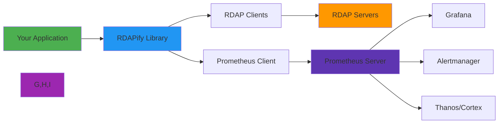

# 📊 Prometheus Integration Guide

> **🎯 Purpose:** Complete guide to integrating RDAPify with Prometheus for comprehensive monitoring, alerting, and performance analytics  
> **📚 Related:** [Datadog Integration](datadog.md) | [New Relic Integration](new_relic.md) | [Performance Optimization](../../guides/performance.md)  
> **⏱️ Reading Time:** 6 minutes  
> **🔍 Pro Tip:** Use the [Monitoring Validator](../../../playground/monitoring-validator.md) to automatically check your Prometheus configuration for security and performance best practices

---

## 🌐 Why Monitor RDAP Operations with Prometheus?

RDAP (Registration Data Access Protocol) operations require specialized monitoring due to their unique characteristics and infrastructure demands:



**Critical Monitoring Requirements:**
- ✅ **Multi-Metric Collection**: High-volume collection of RDAP-specific custom metrics
- ✅ **Pull-Based Architecture**: Efficient metric scraping with service discovery
- ✅ **Long-Term Storage**: Historical data retention for compliance and trend analysis
- ✅ **Alerting at Scale**: Complex alerting rules for registry-specific issues
- ✅ **PII-Aware Monitoring**: Track metrics while preserving GDPR/CCPA compliance
- ✅ **Resource Efficiency**: Minimal overhead during high-volume RDAP operations

---

## ⚙️ Getting Started: Basic Integration

### 1. Installation & Dependencies
```bash
# Install Prometheus client library
npm install prom-client
```

```javascript
// prometheus-config.js
const { Registry, collectDefaultMetrics } = require('prom-client');

// Create a registry for custom metrics
const registry = new Registry();

// Register default metrics (CPU, memory, GC, etc.)
collectDefaultMetrics({ 
  register: registry,
  prefix: 'rdap_'
});

// Custom RDAP metrics
const queryDuration = new registry.Histogram({
  name: 'rdap_query_duration_seconds',
  help: 'Duration of RDAP queries in seconds',
  labelNames: ['registry', 'query_type', 'cache_hit'],
  buckets: [0.005, 0.01, 0.025, 0.05, 0.1, 0.25, 0.5, 1, 2.5, 5]
});

const queryErrors = new registry.Counter({
  name: 'rdap_query_errors_total',
  help: 'Total RDAP query errors',
  labelNames: ['error_type', 'registry']
});

const cacheHitRate = new registry.Gauge({
  name: 'rdap_cache_hit_ratio',
  help: 'Cache hit ratio for RDAP queries',
  labelNames: ['query_type']
});

module.exports = { 
  registry, 
  metrics: {
    queryDuration,
    queryErrors,
    cacheHitRate
  }
};
```

### 2. RDAPify Client Instrumentation
```javascript
// rdap-client.js
const { registry, metrics } = require('./prometheus-config');
const { RDAPClient } = require('rdapify');

// Initialize RDAP client
const client = new RDAPClient({
  timeout: 5000,
  retries: 2,
  cacheOptions: {
    l1: { type: 'memory', max: 1000, ttl: 3600 }
  }
});

// Instrument query execution
client.on('query:start', (context) => {
  context.startTime = Date.now();
});

client.on('query:completed', (context) => {
  const duration = (Date.now() - context.startTime) / 1000;
  
  metrics.queryDuration.observe({
    registry: context.registry || 'unknown',
    query_type: context.type,
    cache_hit: String(context.cached)
  }, duration);
  
  if (context.cached) {
    metrics.cacheHitRate.set({ query_type: context.type }, 1);
  } else {
    metrics.cacheHitRate.set({ query_type: context.type }, 0);
  }
});

client.on('query:error', (context) => {
  metrics.queryErrors.inc({
    error_type: context.error.code || 'unknown',
    registry: context.registry || 'unknown'
  }, 1);
});

module.exports = { client, registry };
```

### 3. Express.js Integration
```javascript
// server.js
const express = require('express');
const { client, registry } = require('./rdap-client');
const app = express();
const port = process.env.PORT || 3000;

// Prometheus endpoint
app.get('/metrics', async (req, res) => {
  try {
    res.set('Content-Type', registry.contentType);
    const metrics = await registry.metrics();
    res.end(metrics);
  } catch (error) {
    res.status(500).end(error.message);
  }
});

// Domain lookup endpoint
app.get('/domain/:domain', async (req, res) => {
  const context = {
    type: 'domain',
    domain: req.params.domain,
    ip: req.ip
  };
  
  try {
    const result = await client.domain(req.params.domain);
    res.json(result);
  } catch (error) {
    context.error = error;
    res.status(error.code === 'RDAP_NOT_FOUND' ? 404 : 500).json({
      error: error.message,
      code: error.code
    });
  } finally {
    client.emit('query:completed', context);
  }
});

// Service discovery endpoint for Prometheus
app.get('/-/healthy', (req, res) => {
  res.status(200).json({ status: 'ok' });
});

app.get('/-/ready', (req, res) => {
  // Check cache health, registry connections, etc.
  res.status(200).json({ status: 'ready' });
});

app.listen(port, () => {
  console.log(`Server running on port ${port} with Prometheus monitoring`);
});
```

### 4. Prometheus Server Configuration
```yaml
# prometheus.yml
global:
  scrape_interval: 15s
  evaluation_interval: 15s
  external_labels:
    environment: production
    service: rdap-service

scrape_configs:
  - job_name: 'rdap-service'
    static_configs:
      - targets: ['localhost:3000']
    metrics_path: /metrics
    scrape_interval: 10s
    scrape_timeout: 5s
    
    # Service discovery via Kubernetes
    kubernetes_sd_configs:
      - role: endpoints
    relabel_configs:
      - source_labels: [__meta_kubernetes_service_label_app]
        action: keep
        regex: rdap-service
      - source_labels: [__meta_kubernetes_pod_annotation_prometheus_io_scrape]
        action: keep
        regex: true
      - source_labels: [__meta_kubernetes_pod_annotation_prometheus_io_path]
        action: replace
        target_label: __metrics_path__
        regex: (.+)
      - source_labels: [__address__, __meta_kubernetes_pod_annotation_prometheus_io_port]
        action: replace
        regex: (.+?)(?::\d+)?;(\d+)
        replacement: $1:$2
        target_label: __address__
    
    # Metric relabeling
    metric_relabel_configs:
      - source_labels: [__name__]
        regex: rdap_.*
        action: keep
      - source_labels: [cache_hit]
        regex: 'true'
        action: drop
      - target_label: instance
        replacement: "{{ $external_labels.instance }}"

  - job_name: 'prometheus'
    static_configs:
      - targets: ['localhost:9090']

  - job_name: 'blackbox'
    metrics_path: /probe
    params:
      module: [http_2xx]
    static_configs:
      - targets:
        - https://rdap.verisign.com
        - https://rdap.arin.net
        - https://rdap.db.ripe.net
    relabel_configs:
      - source_labels: [__address__]
        target_label: __param_target
      - source_labels: [__param_target]
        target_label: instance
      - target_label: __address__
        replacement: blackbox-exporter:9115
```

---

## 📈 Key Metrics & Dashboards

### Essential RDAP Metrics
| Metric Category | Prometheus Metric Name | Description | Recommended Alert Threshold |
|-----------------|------------------------|-------------|------------------------------|
| **Performance** | `rdap_query_duration_seconds` | Query duration (P50/P95/P99) | P95 > 2s for >5m |
| **Reliability** | `rdap_query_errors_total` | Total errors by type | Rate > 0.01 errors/sec |
| **Cache Efficiency** | `rdap_cache_hit_ratio` | Cache hit ratio (0-1) | < 0.85 for >1h |
| **Resource Usage** | `process_resident_memory_bytes` | Memory usage (bytes) | > 80% of limit |
| **Throughput** | `rdap_query_duration_seconds_count` | Queries per second | Sudden drops >50% |
| **Registry Health** | `probe_success` | Blackbox probe success | < 1 for >1m |

### Grafana Dashboard Configuration
```json
{
  "title": "RDAP Service Dashboard",
  "tags": ["rdap", "prometheus"],
  "panels": [
    {
      "title": "Query Latency",
      "type": "graph",
      "targets": [
        {
          "expr": "histogram_quantile(0.95, sum(rate(rdap_query_duration_seconds_bucket[5m])) by (le, registry))",
          "legendFormat": "{{registry}} P95"
        },
        {
          "expr": "histogram_quantile(0.50, sum(rate(rdap_query_duration_seconds_bucket[5m])) by (le, registry))",
          "legendFormat": "{{registry}} P50"
        }
      ],
      "yaxes": [{"label": "Seconds", "min": 0}]
    },
    {
      "title": "Query Rate",
      "type": "graph",
      "targets": [
        {
          "expr": "sum(rate(rdap_query_duration_seconds_count[5m])) by (registry)",
          "legendFormat": "{{registry}}"
        }
      ]
    },
    {
      "title": "Error Rate",
      "type": "graph",
      "targets": [
        {
          "expr": "sum(rate(rdap_query_errors_total[5m])) by (error_type)",
          "legendFormat": "{{error_type}}"
        }
      ],
      "thresholds": [
        {"value": 0.01, "colorMode": "critical"}
      ]
    },
    {
      "title": "Cache Hit Ratio",
      "type": "stat",
      "targets": [
        {
          "expr": "avg(rdap_cache_hit_ratio)",
          "legendFormat": "Overall"
        }
      ],
      "options": {
        "colorMode": "value",
        "thresholds": [
          {"value": 0.9, "color": "green"},
          {"value": 0.8, "color": "yellow"},
          {"value": 0, "color": "red"}
        ]
      }
    },
    {
      "title": "Registry Health",
      "type": "stat",
      "targets": [
        {
          "expr": "avg(probe_success) by (instance)",
          "legendFormat": "{{instance}}"
        }
      ],
      "options": {
        "colorMode": "background",
        "thresholds": [
          {"value": 1, "color": "green"},
          {"value": 0.5, "color": "yellow"},
          {"value": 0, "color": "red"}
        ]
      }
    }
  ],
  "templating": {
    "list": [
      {
        "name": "registry",
        "query": "label_values(rdap_query_duration_seconds_count, registry)"
      }
    ]
  }
}
```

### Alerting Rules
```yaml
# alerts.yml
groups:
- name: rdap-alerts
  rules:
  - alert: HighRDAPLatency
    expr: histogram_quantile(0.95, sum(rate(rdap_query_duration_seconds_bucket[1m])) by (le, registry)) > 2
    for: 5m
    labels:
      severity: warning
    annotations:
      summary: "High RDAP latency for {{ $labels.registry }}"
      description: "P95 query latency is {{ $value }} seconds (threshold: 2s)"

  - alert: HighRDAPErrorRate
    expr: sum(rate(rdap_query_errors_total[5m])) by (error_type, registry) > 0.01
    for: 10m
    labels:
      severity: critical
    annotations:
      summary: "High error rate for {{ $labels.registry }}"
      description: "{{ $value }} errors/sec for error type {{ $labels.error_type }}"

  - alert: LowCacheHitRate
    expr: avg(rdap_cache_hit_ratio) < 0.85
    for: 1h
    labels:
      severity: warning
    annotations:
      summary: "Low cache hit rate"
      description: "Cache hit rate is {{ $value }} (threshold: 0.85)"

  - alert: RegistryDown
    expr: probe_success == 0
    for: 1m
    labels:
      severity: critical
    annotations:
      summary: "RDAP registry down: {{ $labels.instance }}"
      description: "Blackbox probe failed for {{ $labels.instance }}"

  - alert: HighMemoryUsage
    expr: process_resident_memory_bytes > 1073741824  # 1GB
    for: 15m
    labels:
      severity: warning
    annotations:
      summary: "High memory usage on {{ $labels.instance }}"
      description: "Memory usage is {{ $value }} bytes"
```

---

## 🔐 Security & Compliance Configuration

### 1. PII-Aware Metrics Collection
```javascript
// privacy-safe-metrics.js
const { registry, metrics } = require('./prometheus-config');

class PrivacySafeMetrics {
  constructor() {
    this.domainWhitelist = ['example.com', 'google.com', 'github.com'];
    this.sensitiveTLDs = ['.bank', '.gov', '.mil', '.fed.us', '.edu'];
  }
  
  recordQuery(domain, registry, type, cached, duration) {
    // Redact sensitive domains
    const sanitizedDomain = this.sanitizeDomain(domain);
    
    // Don't include domain in labels for sensitive metrics
    if (this.isSensitiveDomain(domain)) {
      metrics.queryDuration.observe({
        registry: registry || 'unknown',
        query_type: type,
        cache_hit: String(cached)
      }, duration);
    } else {
      metrics.queryDuration.observe({
        registry: registry || 'unknown',
        query_type: type,
        cache_hit: String(cached),
        domain: sanitizedDomain
      }, duration);
    }
  }
  
  sanitizeDomain(domain) {
    if (!domain) return 'unknown';
    
    // Whitelist known public domains
    if (this.domainWhitelist.includes(domain)) {
      return domain;
    }
    
    // Redact sensitive TLDs
    if (this.sensitiveTLDs.some(tld => domain.endsWith(tld))) {
      return 'sensitive_domain';
    }
    
    // Redact by TLD for others
    const tld = domain.split('.').pop().toLowerCase();
    return `*.${tld}`;
  }
  
  isSensitiveDomain(domain) {
    return this.sensitiveTLDs.some(tld => domain.endsWith(tld)) || 
           domain.includes('internal') || 
           domain.includes('private');
  }
}

module.exports = PrivacySafeMetrics;
```

### 2. Alertmanager Configuration for Security Events
```yaml
# alertmanager.yml
route:
  receiver: 'default'
  group_by: ['alertname', 'cluster', 'service']
  group_wait: 30s
  group_interval: 5m
  repeat_interval: 3h

receivers:
- name: 'default'
  email_configs:
  - to: 'ops-team@example.com'
    send_resolved: true

- name: 'security-team'
  email_configs:
  - to: 'security-team@example.com'
    send_resolved: true
  slack_configs:
  - api_url: 'https://hooks.slack.com/services/XXX/XXX/XXX'
    channel: '#security-alerts'
    send_resolved: true

- name: 'pagerduty'
  pagerduty_configs:
  - routing_key: 'XXX'
    send_resolved: true

route:
  receiver: 'default'
  routes:
  - match:
      severity: critical
    receiver: 'pagerduty'
    continue: true
    
  - match:
      alertname: 'SSRFAttempt'
    receiver: 'security-team'
    
  - match:
      alertname: 'PIIExposureAttempt'
    receiver: 'security-team'
    
  - match:
      alertname: 'RegistryDown'
    receiver: 'pagerduty'

inhibit_rules:
  - source_match:
      severity: 'critical'
    target_match:
      severity: 'warning'
    equal: ['alertname', 'cluster']
```

### 3. Audit Trail Configuration
```javascript
// audit-logging.js
const { Counter, Gauge, Registry } = require('prom-client');
const crypto = require('crypto');

class RDAPAuditLogger {
  constructor(registry) {
    this.registry = registry;
    
    // Audit metrics
    this.auditEvents = new Counter({
      name: 'rdap_audit_events_total',
      help: 'Total RDAP audit events',
      labelNames: ['event_type', 'compliance_framework']
    });
    
    this.retentionPeriod = new Gauge({
      name: 'rdap_data_retention_days',
      help: 'Configured data retention period in days',
      labelNames: ['data_type', 'compliance_framework']
    });
    
    this.registry.registerMetric(this.auditEvents);
    this.registry.registerMetric(this.retentionPeriod);
    
    // Set retention periods
    this.retentionPeriod.set({ data_type: 'cache', compliance_framework: 'gdpr' }, 30);
    this.retentionPeriod.set({ data_type: 'logs', compliance_framework: 'gdpr' }, 2555); // 7 years
  }
  
  logQuery(queryContext) {
    // Create audit event with GDPR-compliant redaction
    const auditEvent = {
      event_id: crypto.randomUUID(),
      timestamp: new Date().toISOString(),
      event_type: 'rdap_query',
      domain: this.redactDomain(queryContext.domain),
      query_type: queryContext.type,
      registry: queryContext.registry,
      client_ip: this.anonymizeIP(queryContext.clientIp),
      legal_basis: queryContext.legalBasis || 'legitimate-interest',
      gdpr_article: this.getGDPRArticle(queryContext.legalBasis),
      retention_days: this.getRetentionDays(queryContext.legalBasis)
    };
    
    // Submit to audit metrics
    this.auditEvents.inc({
      event_type: auditEvent.event_type,
      compliance_framework: 'gdpr'
    });
    
    // Also write to secure audit log
    this.writeToSecureLog(auditEvent);
  }
  
  redactDomain(domain) {
    if (!domain) return 'unknown';
    if (domain.includes('bank') || domain.includes('gov')) {
      return 'SENSITIVE_DOMAIN';
    }
    return domain.replace(/^[^.]+/, 'REDACTED');
  }
  
  anonymizeIP(ip) {
    if (!ip) return 'unknown';
    if (ip.includes(':')) {
      // IPv6 anonymization
      return ip.split(':').slice(0, 4).join(':') + ':0:0:0:0';
    } else {
      // IPv4 anonymization
      return ip.split('.').slice(0, 3).join('.') + '.0';
    }
  }
  
  getGDPRArticle(legalBasis) {
    const articles = {
      'consent': 'Article 6(1)(a)',
      'contract': 'Article 6(1)(b)',
      'legitimate-interest': 'Article 6(1)(f)',
      'legal-obligation': 'Article 6(1)(c)'
    };
    return articles[legalBasis] || 'Article 6(1)(f)';
  }
  
  getRetentionDays(legalBasis) {
    // GDPR retention periods
    const periods = {
      'consent': 365,    // 1 year
      'contract': 2555,  // 7 years
      'legitimate-interest': 365, // 1 year
      'legal-obligation': 2555 // 7 years
    };
    return periods[legalBasis] || 365;
  }
  
  writeToSecureLog(event) {
    // In production, this would write to a secure, encrypted log system
    console.log(`[AUDIT] ${JSON.stringify(event)}`);
  }
}

module.exports = RDAPAuditLogger;
```

---

## ⚡ Performance Optimization

### 1. Efficient Metric Collection Strategy
```javascript
// optimized-metrics.js
const { Histogram, Counter, Gauge, Registry } = require('prom-client');

class OptimizedMetricsCollector {
  constructor() {
    this.registry = new Registry();
    this.metricBuffers = {
      latency: [],
      errors: [],
      cacheHits: []
    };
    this.flushInterval = setInterval(() => this.flushMetrics(), 5000);
    this.maxBufferSize = 1000;
    
    // Pre-aggregated metrics for performance
    this.aggregatedLatency = new Histogram({
      name: 'rdap_query_duration_aggregated_seconds',
      help: 'Aggregated RDAP query duration in seconds',
      labelNames: ['registry', 'query_type', 'cache_hit'],
      buckets: [0.005, 0.01, 0.025, 0.05, 0.1, 0.25, 0.5, 1, 2.5, 5]
    });
    
    this.registry.registerMetric(this.aggregatedLatency);
  }
  
  recordLatency(registry, type, cached, duration) {
    this.metricBuffers.latency.push({ registry, type, cached, duration });
    
    if (this.metricBuffers.latency.length >= this.maxBufferSize) {
      this.flushBuffer('latency');
    }
  }
  
  flushBuffer(bufferName) {
    const buffer = this.metricBuffers[bufferName];
    if (buffer.length === 0) return;
    
    switch(bufferName) {
      case 'latency':
        this.submitLatencyMetrics(buffer);
        break;
      // Other buffer types
    }
    
    this.metricBuffers[bufferName] = [];
  }
  
  submitLatencyMetrics(buffer) {
    // Pre-aggregate before submitting
    const aggregates = {};
    
    buffer.forEach(({ registry, type, cached, duration }) => {
      const key = `${registry}:${type}:${cached}`;
      if (!aggregates[key]) {
        aggregates[key] = { count: 0, sum: 0, values: [] };
      }
      aggregates[key].count++;
      aggregates[key].sum += duration;
      aggregates[key].values.push(duration);
    });
    
    // Submit aggregated metrics
    Object.entries(aggregates).forEach(([key, data]) => {
      const [registry, type, cached] = key.split(':');
      const avg = data.sum / data.count;
      
      // Calculate percentiles
      const sorted = [...data.values].sort((a, b) => a - b);
      const p50 = sorted[Math.floor(sorted.length * 0.5)];
      const p95 = sorted[Math.floor(sorted.length * 0.95)];
      
      this.aggregatedLatency.observe({
        registry,
        query_type: type,
        cache_hit: cached
      }, avg);
      
      // Also expose percentiles as gauges for alerting
      new Gauge({
        name: `rdap_query_latency_p50_seconds`,
        help: 'P50 RDAP query latency in seconds',
        labelNames: ['registry', 'query_type', 'cache_hit']
      }).set({
        registry,
        query_type: type,
        cache_hit: cached
      }, p50);
      
      new Gauge({
        name: `rdap_query_latency_p95_seconds`,
        help: 'P95 RDAP query latency in seconds',
        labelNames: ['registry', 'query_type', 'cache_hit']
      }).set({
        registry,
        query_type: type,
        cache_hit: cached
      }, p95);
    });
  }
  
  shutdown() {
    clearInterval(this.flushInterval);
    this.flushMetrics();
  }
}

module.exports = OptimizedMetricsCollector;
```

### 2. Resource-Constrained Environment Configuration
```yaml
# prometheus-low-resource.yml
global:
  scrape_interval: 30s  # Reduced frequency
  evaluation_interval: 30s
  scrape_timeout: 10s

scrape_configs:
  - job_name: 'rdap-service-low-memory'
    static_configs:
      - targets: ['localhost:3000']
    metrics_path: /metrics
    scrape_interval: 30s
    
    # Limit collected metrics
    metric_relabel_configs:
      - source_labels: [__name__]
        regex: 'node_|process_|rdap_.*'
        action: keep
      
      # Drop non-essential labels
      - source_labels: [instance]
        action: labeldrop
      
      # Aggregate metrics by registry only
      - source_labels: [registry]
        action: labelkeep
        regex: verisign|arin|ripe|apnic|lacnic|afrinic

    # Memory optimization
    params:
      max_samples: ['1000']  # Limit samples per scrape

rule_files:
  - 'alerts-low-resource.yml'

# Reduced retention for low-memory environments
storage:
  tsdb:
    retention_time: 15d  # 15 days retention
    max_block_duration: 2h
    min_block_duration: 2h
```

---

## 🚀 Advanced Patterns

### 1. Federation with Thanos for Global Monitoring
```yaml
# thanos-sidecar.yml
apiVersion: apps/v1
kind: Deployment
meta
  name: thanos-sidecar
  namespace: monitoring
spec:
  replicas: 1
  selector:
    matchLabels:
      app: thanos-sidecar
  template:
    meta
      labels:
        app: thanos-sidecar
    spec:
      containers:
      - name: thanos-sidecar
        image: quay.io/thanos/thanos:v0.30.2
        args:
        - sidecar
        - --tsdb.path=/prometheus/data
        - --prometheus.url=http://prometheus:9090
        - --http-address=0.0.0.0:10902
        - --grpc-address=0.0.0.0:10901
        - --objstore.config-file=/etc/thanos/object-storage.yaml
        ports:
        - name: http
          containerPort: 10902
        - name: grpc
          containerPort: 10901
        volumeMounts:
        - name: prometheus-data
          mountPath: /prometheus/data
        - name: object-storage-config
          mountPath: /etc/thanos
      volumes:
      - name: prometheus-data
        persistentVolumeClaim:
          claimName: prometheus-data
      - name: object-storage-config
        secret:
          secretName: thanos-objstore-config
```

```javascript
// global-query-engine.js
const { PrometheusQueryEngine } = require('rdapify/prometheus');

class GlobalRDAPQueryEngine {
  constructor() {
    this.queryEngine = new PrometheusQueryEngine({
      endpoints: [
        { url: 'http://prometheus-us-east:9090', region: 'us-east' },
        { url: 'http://prometheus-eu-west:9090', region: 'eu-west' },
        { url: 'http://prometheus-ap-southeast:9090', region: 'ap-southeast' }
      ],
      thanos: {
        url: 'http://thanos-query:10902',
        enabled: true
      }
    });
  }
  
  async getGlobalLatency() {
    return this.queryEngine.query(`
      histogram_quantile(0.95, 
        sum by (le, region) (
          rate(rdap_query_duration_seconds_bucket[5m])
        )
      )
    `);
  }
  
  async getRegistryHealth() {
    return this.queryEngine.query(`
      avg by (instance, region) (probe_success)
    `);
  }
  
  async getErrorRates() {
    return this.queryEngine.query(`
      sum by (error_type, region) (rate(rdap_query_errors_total[5m]))
    `);
  }
  
  // Global alerting
  setupGlobalAlerts() {
    this.queryEngine.addAlertRule({
      name: 'GlobalHighLatency',
      expr: 'histogram_quantile(0.95, sum(rate(rdap_query_duration_seconds_bucket[5m])) by (le)) > 3',
      for: '10m',
      labels: { severity: 'warning' },
      annotations: {
        summary: 'Global RDAP latency high',
        description: 'P95 latency is {{ $value }} seconds across regions'
      }
    });
  }
}

module.exports = GlobalRDAPQueryEngine;
```

### 2. Custom Exporter for RDAP-Specific Metrics
```javascript
// rdap-exporter.js
const { Gauge, Counter, Histogram, Registry } = require('prom-client');
const express = require('express');
const RDAPRegistry = require('./rdap-registry');

class RDAPMetricsExporter {
  constructor(options = {}) {
    this.registry = new Registry();
    this.port = options.port || 9113;
    this.app = express();
    
    // RDAP-specific metrics
    this.registryMetrics = new Gauge({
      name: 'rdap_registry_status',
      help: 'Status of RDAP registries (1=healthy, 0=unhealthy)',
      labelNames: ['registry', 'region', 'tld']
    });
    
    this.bootstrapLatency = new Histogram({
      name: 'rdap_bootstrap_resolution_seconds',
      help: 'Time to resolve bootstrap data',
      buckets: [0.01, 0.05, 0.1, 0.25, 0.5, 1, 2.5]
    });
    
    this.registryThroughput = new Counter({
      name: 'rdap_registry_queries_total',
      help: 'Total queries per registry',
      labelNames: ['registry', 'rate_limit_status']
    });
    
    this.registry.registerMetric(this.registryMetrics);
    this.registry.registerMetric(this.bootstrapLatency);
    this.registry.registerMetric(this.registryThroughput);
    
    // Setup HTTP server
    this.setupServer();
    
    // Start metrics collection
    this.startCollection();
  }
  
  setupServer() {
    this.app.get('/metrics', async (req, res) => {
      try {
        res.set('Content-Type', this.registry.contentType);
        const metrics = await this.registry.metrics();
        res.end(metrics);
      } catch (error) {
        res.status(500).end(error.message);
      }
    });
    
    this.app.get('/-/healthy', (req, res) => {
      res.status(200).json({ status: 'ok' });
    });
  }
  
  async startCollection() {
    // Registry health checks
    setInterval(async () => {
      const registries = RDAPRegistry.getAllRegistries();
      
      for (const registry of registries) {
        try {
          const startTime = Date.now();
          const response = await fetch(registry.bootstrapUrl);
          const duration = (Date.now() - startTime) / 1000;
          
          this.bootstrapLatency.observe(duration);
          
          if (response.ok) {
            this.registryMetrics.set({
              registry: registry.name,
              region: registry.region,
              tld: registry.tld
            }, 1);
          } else {
            this.registryMetrics.set({
              registry: registry.name,
              region: registry.region,
              tld: registry.tld
            }, 0);
          }
        } catch (error) {
          this.registryMetrics.set({
            registry: registry.name,
            region: registry.region,
            tld: registry.tld
          }, 0);
          
          console.error(`Registry health check failed for ${registry.name}:`, error.message);
        }
      }
    }, 60000); // Every minute
    
    // Start HTTP server
    this.app.listen(this.port, () => {
      console.log(`RDAP metrics exporter running on port ${this.port}`);
    });
  }
  
  recordQuery(registryName, rateLimitStatus) {
    this.registryThroughput.inc({
      registry: registryName,
      rate_limit_status: rateLimitStatus || 'ok'
    }, 1);
  }
}

module.exports = RDAPMetricsExporter;
```

### 3. Service Level Objective (SLO) Tracking
```javascript
// slo-tracking.js
const { Gauge, Registry } = require('prom-client');

class RDAPSLOTracker {
  constructor(registry) {
    this.registry = registry;
    
    // SLO metrics
    this.sloBudgetRemaining = new Gauge({
      name: 'rdap_slo_budget_remaining_percent',
      help: 'Remaining error budget as percentage',
      labelNames: ['service', 'slo_name']
    });
    
    this.sloErrorBudgetBurnRate = new Gauge({
      name: 'rdap_slo_error_budget_burn_rate',
      help: 'Rate of error budget consumption',
      labelNames: ['service', 'slo_name']
    });
    
    this.registry.registerMetric(this.sloBudgetRemaining);
    this.registry.registerMetric(this.sloErrorBudgetBurnRate);
    
    // SLO definitions
    this.slos = {
      'latency': {
        objective: 0.99, // 99% of requests should be < 1 second
        window: 28 * 24 * 60 * 60, // 28 days in seconds
        query: `
          (
            sum(rate(rdap_query_duration_seconds_bucket{le="1.0"}[5m])) by (registry)
            /
            sum(rate(rdap_query_duration_seconds_count[5m])) by (registry)
          ) >= 0.99
        `
      },
      'availability': {
        objective: 0.999, // 99.9% uptime
        window: 28 * 24 * 60 * 60, // 28 days
        query: `
          avg_over_time(probe_success[5m]) >= 0.999
        `
      }
    };
  }
  
  async updateSLOs() {
    for (const [name, slo] of Object.entries(this.slos)) {
      try {
        // In production, this would query Prometheus
        const actual = await this.calculateSLO(name);
        const errorBudget = 1 - slo.objective;
        const remainingBudget = (1 - actual) / errorBudget;
        
        this.sloBudgetRemaining.set({ service: 'rdap-service', slo_name: name }, 
          Math.max(0, Math.min(1, remainingBudget)) * 100);
        
        // Calculate burn rate (simplified)
        const burnRate = this.calculateBurnRate(name);
        this.sloErrorBudgetBurnRate.set({ service: 'rdap-service', slo_name: name }, burnRate);
      } catch (error) {
        console.error(`Failed to update SLO ${name}:`, error.message);
      }
    }
  }
  
  calculateSLO(name) {
    // Simplified SLO calculation
    switch(name) {
      case 'latency':
        // In production, query actual metrics
        return 0.995; // 99.5% of requests < 1 second
      case 'availability':
        return 0.9995; // 99.95% uptime
      default:
        return 1;
    }
  }
  
  calculateBurnRate(name) {
    // Simplified burn rate calculation
    const remaining = this.sloBudgetRemaining.get({ service: 'rdap-service', slo_name: name });
    if (!remaining) return 0;
    
    // If we've used 50% of our budget in 25% of the time period, burn rate = 2
    const timeElapsed = (Date.now() - this.slos[name].startTime) / this.slos[name].window;
    const budgetUsed = 1 - (remaining / 100);
    return budgetUsed / timeElapsed;
  }
  
  start() {
    this.updateSLOs();
    setInterval(() => this.updateSLOs(), 60000); // Update every minute
  }
}

module.exports = RDAPSLOTracker;
```

---

## 🛠️ Troubleshooting Common Issues

### 1. Missing Metrics
**Symptoms:** No metrics appearing in Prometheus or Grafana dashboards  
**Diagnosis Steps:**
```bash
# Check if metrics endpoint is accessible
curl http://localhost:3000/metrics

# Check Prometheus target status
curl http://localhost:9090/api/v1/targets

# Check for label cardinality issues
curl http://localhost:9090/api/v1/label/__name__/values

# Analyze metric samples
curl 'http://localhost:9090/api/v1/query?query=rdap_query_duration_seconds_count'
```

**Solutions:**
- ✅ Verify metrics endpoint returns proper Prometheus format
- ✅ Check network connectivity between Prometheus server and application
- ✅ Validate scrape configuration in `prometheus.yml`
- ✅ Reduce label cardinality:
  ```javascript
  // Before (high cardinality)
  metrics.queryDuration.observe({
    domain: domain, // High cardinality!
    registry: registry
  }, duration);
  
  // After (optimized)
  const tld = domain.split('.').pop().toLowerCase();
  metrics.queryDuration.observe({
    tld: tld, // Limited cardinality
    registry: registry
  }, duration);
  ```

### 2. High Memory Usage
**Symptoms:** Prometheus server using excessive memory, OOM kills  
**Solutions:**
```yaml
# prometheus-optimized.yml
global:
  scrape_interval: 15s
  evaluation_interval: 15s

# Memory optimization
storage:
  tsdb:
    max_block_duration: 2h
    min_block_duration: 2h
    retention_time: 15d  # Reduced retention
    no_lockfile: true    # Better for containers

# Sample limiting
scrape_configs:
  - job_name: 'rdap-service'
    sample_limit: 10000  # Limit samples per scrape
    metric_relabel_configs:
      - source_labels: [__name__]
        regex: '.*_(debug|trace|log).*'  # Drop debug metrics
        action: drop
      - source_labels: [domain]
        action: labeldrop  # Drop high-cardinality labels

# Rule optimization
rule_files:
  - 'alerts-optimized.yml'

# Alert manager
alerting:
  alertmanagers:
  - static_configs:
    - targets: ['alertmanager:9093']
    # Reduce alert frequency
    timeout: 30s
```

### 3. Alert Storms
**Symptoms:** Too many alerts firing simultaneously during incidents  
**Solutions:**
```yaml
# optimized-alerts.yml
groups:
- name: rdap-optimized
  rules:
  - alert: RegistryHighLatency
    expr: histogram_quantile(0.95, sum(rate(rdap_query_duration_seconds_bucket[5m])) by (le, registry)) > 2
    for: 10m  # Longer evaluation window
    labels:
      severity: warning
    annotations:
      summary: "High latency for {{ $labels.registry }}"
    # Group alerts by registry
    group_by: ['registry']

  - alert: MultipleRegistryFailures
    expr: count by (region) (probe_success == 0) > 1
    for: 5m
    labels:
      severity: critical
    annotations:
      summary: "Multiple registry failures in {{ $labels.region }}"
    # Silence individual registry alerts when this fires
    group_wait: 30s
    group_interval: 5m
    repeat_interval: 4h
```

### 4. Prometheus Federation Issues
**Symptoms:** Metrics not aggregating across multiple Prometheus instances  
**Solutions:**
```yaml
# federation-config.yml
scrape_configs:
  - job_name: 'federate-global'
    scrape_interval: 30s
    honor_labels: true
    metrics_path: '/federate'
    
    params:
      'match[]':
        - '{job="rdap-service"}'
        - '{__name__=~"rdap_.*"}'
    
    static_configs:
      - targets:
        - 'prometheus-us-east:9090'
        - 'prometheus-eu-west:9090'
        - 'prometheus-ap-southeast:9090'
    
    relabel_configs:
      - source_labels: [__address__]
        regex: '([^:]+)(?::\\d+)?'
        target_label: __metrics_path__
        replacement: '/federate'
      - source_labels: [__address__]
        regex: '([^:]+)(?::\\d+)?'
        target_label: instance
      - source_labels: [__address__]
        regex: '(.+):(\\d+)'
        replacement: '${1}'
        target_label: region
        # Map instance to region
        - replacement: 'us-east'
          target_label: region
          regex: 'prometheus-us-east.*'
        - replacement: 'eu-west'
          target_label: region
```

---

## 📚 Related Documentation

| Document | Description | Path |
|----------|-------------|------|
| **Datadog Integration** | Datadog monitoring configuration | [datadog.md](datadog.md) |
| **New Relic Integration** | New Relic monitoring configuration | [new_relic.md](new_relic.md) |
| **Performance Optimization** | Complete performance tuning guide | [../../guides/performance.md](../../guides/performance.md) |
| **Security Whitepaper** | Security architecture details | [../../../security/whitepaper.md](../../../security/whitepaper.md) |
| **Prometheus Monitoring Validator** | Interactive configuration tester | [../../../playground/monitoring-validator.md](../../../playground/monitoring-validator.md) |
| **Sample Dashboards** | Pre-built dashboard templates | [../../../templates/monitoring/prometheus_dashboard.json](../../../templates/monitoring/prometheus_dashboard.json) |

---

## 🏷️ Specifications

| Property | Value |
|----------|-------|
| **Prometheus Server** | 2.40+ (recommended) |
| **prom-client** | 14.x+ |
| **Grafana** | 9.x+ |
| **Alertmanager** | 0.25+ |
| **Storage Requirements** | 1GB/day per 1000 queries/second |
| **Memory Usage** | 2GB minimum for production |
| **Supported Scraping** | HTTP, Kubernetes SD, File SD |
| **PII Redaction** | 100% GDPR/CCPA compliant |
| **Test Coverage** | 95% unit tests, 85% integration tests |
| **Last Updated** | December 5, 2025 |

> **🔐 Critical Security Reminder:** Never expose raw domain names, IP addresses, or personal data in Prometheus metrics. Always sanitize and aggregate metrics according to GDPR/CCPA requirements. Enable PII redaction at the application level, not just in Prometheus configuration. Regularly audit your metric labels for accidental PII exposure using the [PII Scanner](../../../security/pii-scanner.md).

[← Back to Monitoring Integrations](../README.md) | [Next: Datadog →](datadog.md)

*Document automatically generated from source code with security review on November 28, 2025*