# Next.js Integration Guide

🎯 **Purpose**: Complete guide for integrating RDAPify with Next.js applications for secure domain, IP, and ASN lookups with SSR/SSG support, edge runtime optimization, and enterprise-grade security  
📚 **Related**: [Express.js](express.md) | [NestJS](nestjs.md) | [Fastify](fastify.md) | [Vercel Deployment](vercel.md) | [React Hooks](../guides/react_hooks.md)  
⏱️ **Reading Time**: 8 minutes  
🔍 **Pro Tip**: Use the [Next.js Playground](../../playground/nextjs-playground.md) to prototype your RDAP integrations before implementation

## 🌐 Why Next.js for RDAP Applications?

Next.js provides the ideal framework for building RDAP-powered applications with these key advantages:

```mermaid
graph LR
    A[User] --> B[Next.js Application]
    B --> C[Edge Runtime]
    B --> D[Server Components]
    B --> E[API Routes]
    C --> F[RDAPify Edge Functions]
    D --> G[RDAPify Server Logic]
    E --> H[RDAPify API Handlers]
    F --> I[IANA Bootstrap]
    G --> I
    H --> I
    I --> J[Registry APIs]
    J --> K[Normalization Engine]
    K --> L[PII Redaction]
    L --> M[Unified Response]
    
    style B fill:#000000,stroke:#000
    style C,D,E fill:#1E90FF
    style F,G,H fill:#4CAF50
    style I,J,K,L,M fill:#9C27B0
```



### Key Integration Benefits:
✅ **Hybrid Rendering**: Use RDAP data in server components, static generation, or client-side hooks  
✅ **Edge Optimization**: Run lightweight RDAP queries at the edge with Vercel's global network  
✅ **Security Boundaries**: Isolate sensitive RDAP operations to server-side code, away from client bundles  
✅ **Incremental Static Regeneration**: Cache RDAP data with automatic background updates  
✅ **TypeScript Excellence**: Full end-to-end type safety from RDAP responses to React components  

## 🚀 Getting Started: Basic Integration

### 1. Installation & Setup
```bash
# Install dependencies
npm install rdapify next react
# or
yarn add rdapify next react
# or
pnpm add rdapify next react
```

### 2. Next.js API Route Implementation
```typescript
// pages/api/domain/[domain].ts
import type { NextApiRequest, NextApiResponse } from 'next';
import { RDAPClient } from 'rdapify';

// Initialize RDAP client with security defaults
const client = new RDAPClient({
  cache: true,
  redactPII: true,           // GDPR compliance
  allowPrivateIPs: false,    // SSRF protection
  validateCertificates: true,
  timeout: 5000,
  rateLimit: { max: 100, window: 60000 }
});

export default async function handler(
  req: NextApiRequest,
  res: NextApiResponse
) {
  // Only allow GET requests
  if (req.method !== 'GET') {
    return res.status(405).json({ error: 'Method not allowed' });
  }

  try {
    const domain = req.query.domain as string;
    
    // Input validation
    if (!domain || !/^[a-z0-9.-]+\.[a-z]{2,}$/.test(domain)) {
      return res.status(400).json({ error: 'Invalid domain format' });
    }

    // Execute RDAP query
    const result = await client.domain(domain.toLowerCase().trim());
    
    // Set caching headers (1 hour)
    res.setHeader('Cache-Control', 'public, s-maxage=3600, stale-while-revalidate=7200');
    
    return res.status(200).json(result);
  } catch (error: any) {
    console.error(`RDAP API error for domain ${req.query.domain}:`, error);
    
    // Map RDAP errors to appropriate HTTP status codes
    const statusCode = error.statusCode || 
                      (error.code?.startsWith('RDAP_') ? 422 : 500);
    
    return res.status(statusCode).json({
      error: error.message,
      code: error.code || 'RDAP_REQUEST_FAILED',
      requestId: req.headers['x-vercel-id'] || 'local'
    });
  }
}
```

### 3. Server Component Usage (App Router)
```tsx
// app/domain/[domain]/page.tsx
import { RDAPClient } from 'rdapify';

// Initialize RDAP client for server-side use
const rdap = new RDAPClient({
  cache: true,
  redactPII: true,
  // Note: In server components, we can use longer timeouts
  timeout: 10000
});

export async function generateMetadata({ params }: { params: { domain: string } }) {
  // Fetch domain info for metadata
  const domainData = await rdap.domain(params.domain);
  
  return {
    title: `Domain Information: ${domainData.domain}`,
    description: `Registration details and nameservers for ${domainData.domain}`,
  };
}

export default async function DomainPage({ params }: { params: { domain: string } }) {
  // Validate domain format
  if (!/^[a-z0-9.-]+\.[a-z]{2,}$/.test(params.domain)) {
    return (
      <div className="error-container">
        <h1>Invalid Domain</h1>
        <p>The domain format is not valid. Please check the URL and try again.</p>
      </div>
    );
  }

  try {
    // Fetch domain data server-side
    const domainData = await rdap.domain(params.domain);
    
    return (
      <div className="domain-container">
        <h1>Domain Information: {domainData.domain}</h1>
        
        <div className="info-grid">
          <div className="info-card">
            <h2>Registrar</h2>
            <p>{domainData.registrar?.name}</p>
          </div>
          
          <div className="info-card">
            <h2>Status</h2>
            <ul>
              {domainData.status.map((status, i) => (
                <li key={i}>{status}</li>
              ))}
            </ul>
          </div>
          
          <div className="info-card">
            <h2>Nameservers</h2>
            <ul>
              {domainData.nameservers.map((ns, i) => (
                <li key={i}>{ns}</li>
              ))}
            </ul>
          </div>
          
          <div className="info-card">
            <h2>Dates</h2>
            <p><strong>Created:</strong> {domainData.events.find(e => e.type === 'registration')?.date}</p>
            <p><strong>Expires:</strong> {domainData.events.find(e => e.type === 'expiration')?.date}</p>
          </div>
        </div>
        
        {/* Security note: This data is already redacted server-side */}
        <div className="privacy-notice">
          Personal information has been redacted for privacy compliance.
        </div>
      </div>
    );
  } catch (error: any) {
    return (
      <div className="error-container">
        <h1>Domain Lookup Failed</h1>
        <p>{error.message || 'An error occurred while fetching domain information.'}</p>
        <p className="error-code">Error Code: {error.code || 'UNKNOWN_ERROR'}</p>
      </div>
    );
  }
}
```

## 🔐 Security & Compliance Hardening

### 1. Edge Runtime Security Configuration
```typescript
// app/api/edge-rdap/route.ts
import { NextResponse } from 'next/server';
import { RDAPClient } from 'rdapify';
import type { NextRequest } from 'next/server';

// Edge-compatible RDAP client configuration
const client = new RDAPClient({
  cache: true,
  redactPII: true,
  allowPrivateIPs: false,
  validateCertificates: true,
  // Edge-specific limitations
  timeout: 3000, // Edge functions have lower timeout limits
  maxConcurrent: 2,
  retry: { maxAttempts: 1, backoff: 'none' } // Minimize retries in edge context
});

export const runtime = 'edge'; // Force edge runtime
export const preferredRegion = 'home'; // Prefer home region for privacy

export async function POST(request: NextRequest) {
  // Security headers for edge responses
  const headers = new Headers({
    'X-Content-Type-Options': 'nosniff',
    'X-Frame-Options': 'DENY',
    'Content-Security-Policy': "default-src 'self'; script-src 'self' 'unsafe-eval' https://vercel.live",
    'Strict-Transport-Security': 'max-age=63072000; includeSubDomains; preload',
    'X-XSS-Protection': '1; mode=block',
    'Referrer-Policy': 'strict-origin-when-cross-origin',
    'Permissions-Policy': 'geolocation=(), camera=(), microphone=()'
  });

  try {
    // Rate limiting using edge caching
    const ip = request.ip || '127.0.0.1';
    const rateLimitKey = `ratelimit:${ip}`;
    
    // In a real app, use an edge-compatible KV store like Upstash
    const rateLimitCount = await getRateLimitCount(rateLimitKey);
    
    if (rateLimitCount > 10) {
      return NextResponse.json(
        { error: 'Too many requests' },
        { status: 429, headers }
      );
    }

    // Parse request body
    const body = await request.json();
    const { domains } = body;
    
    if (!domains || !Array.isArray(domains) || domains.length === 0 || domains.length > 10) {
      return NextResponse.json(
        { error: 'Invalid domains parameter. Must be an array with 1-10 domains.' },
        { status: 400, headers }
      );
    }

    // Validate all domains before processing
    const invalidDomain = domains.find(d => !/^[a-z0-9.-]+\.[a-z]{2,}$/.test(d));
    if (invalidDomain) {
      return NextResponse.json(
        { error: `Invalid domain format: ${invalidDomain}` },
        { status: 400, headers }
      );
    }
    
    // Process domains with concurrency control
    const results = await Promise.all(domains.map(domain => 
      client.domain(domain.toLowerCase().trim())
    ));
    
    // Update rate limit counter
    await incrementRateLimit(rateLimitKey);
    
    return NextResponse.json({ results }, { headers });
  } catch (error: any) {
    console.error('Edge RDAP error:', error);
    
    // Sanitize error for edge response
    const safeError = {
      message: process.env.NODE_ENV === 'production' 
        ? 'Failed to process RDAP request' 
        : error.message,
      code: error.code || 'EDGE_REQUEST_FAILED',
      timestamp: new Date().toISOString()
    };
    
    return NextResponse.json(
      { error: safeError },
      { status: error.statusCode || 500, headers }
    );
  }
}

// Mock implementations for edge-compatible rate limiting
// In production, use Upstash Redis or similar edge-compatible KV store
async function getRateLimitCount(key: string): Promise<number> {
  return 0; // Placeholder implementation
}

async function incrementRateLimit(key: string) {
  // Placeholder implementation
}
```

### 2. App Router Security Middleware
```typescript
// middleware.ts
import { NextResponse } from 'next/server';
import type { NextRequest } from 'next/server';
import { Ratelimit } from '@upstash/ratelimit';
import { kv } from '@vercel/kv';

// Initialize rate limiter
const ratelimit = new Ratelimit({
  redis: kv,
  limiter: Ratelimit.slidingWindow(100, '1 h'),
  analytics: true,
  prefix: 'rdapify:ratelimit:'
});

// GDPR/CCPA compliance middleware
export async function middleware(request: NextRequest) {
  const pathname = request.nextUrl.pathname;
  
  // Apply security headers to all responses
  const response = NextResponse.next();
  
  // Set global security headers
  response.headers.set('X-Content-Type-Options', 'nosniff');
  response.headers.set('X-Frame-Options', 'DENY');
  response.headers.set(
    'Content-Security-Policy', 
    "default-src 'self'; script-src 'self' 'unsafe-eval' https://vercel.live; style-src 'self' 'unsafe-inline'; img-src 'self' data: https://*.vercel.app;"
  );
  response.headers.set('Strict-Transport-Security', 'max-age=63072000; includeSubDomains; preload');
  response.headers.set('X-XSS-Protection', '1; mode=block');
  response.headers.set('Referrer-Policy', 'strict-origin-when-cross-origin');
  response.headers.set('Permissions-Policy', 'geolocation=(), camera=(), microphone=()');
  
  // GDPR/CCPA compliance headers
  response.headers.set('X-Do-Not-Sell', 'true');
  response.headers.set('X-Data-Processing', 'PII redacted per GDPR Article 6(1)(f)');
  
  // Rate limiting for RDAP API routes
  if (pathname.startsWith('/api/domain') || pathname.startsWith('/api/batch')) {
    const ip = request.ip || '127.0.0.1';
    const { success, pending, limit, reset, remaining } = await ratelimit.limit(ip);
    
    response.headers.set('X-RateLimit-Limit', limit.toString());
    response.headers.set('X-RateLimit-Remaining', remaining.toString());
    response.headers.set('X-RateLimit-Reset', reset.toString());
    
    if (!success) {
      return new NextResponse(
        JSON.stringify({ 
          error: 'Too many requests', 
          retryAfter: Math.ceil((reset - Date.now()) / 1000) 
        }),
        { 
          status: 429, 
          headers: {
            'Content-Type': 'application/json',
            'Retry-After': Math.ceil((reset - Date.now()) / 1000).toString()
          } 
        }
      );
    }
    
    // Ensure pending operations complete
    response.headers.set('X-RateLimit-Pending', pending.toString());
  }
  
  // Block access to sensitive endpoints based on environment
  if (pathname.startsWith('/api/internal') && process.env.NODE_ENV !== 'development') {
    return new NextResponse('Forbidden', { status: 403 });
  }
  
  return response;
}

// Configure which routes middleware should run on
export const config = {
  matcher: [
    /*
     * Match all request paths except for the ones starting with:
     * - api/health (health check)
     * - _next/static (static files)
     * - _next/image (image optimization files)
     * - favicon.ico (favicon file)
     */
    '/((?!api/health|_next/static|_next/image|favicon.ico).*)',
  ],
};
```

## ⚡ Performance Optimization

### 1. Incremental Static Regeneration (ISR) Pattern
```tsx
// app/domain/[domain]/page.tsx
import { RDAPClient } from 'rdapify';

const rdap = new RDAPClient({
  cache: true,
  redactPII: true,
  // Longer timeout for ISR builds
  timeout: 15000
});

export const dynamicParams = true; // Allow dynamic parameters
export const revalidate = 3600; // ISR: Revalidate every hour

// Generate static paths for popular domains
export async function generateStaticParams() {
  // In production, fetch this from a database or config
  const popularDomains = [
    'google.com',
    'facebook.com',
    'twitter.com',
    'github.com',
    'npmjs.com'
  ];
  
  return popularDomains.map(domain => ({ domain }));
}

export async function generateMetadata({ params }: { params: { domain: string } }) {
  try {
    const domainData = await rdap.domain(params.domain);
    return {
      title: `${domainData.domain} Registration Details`,
      description: `Domain registration information, nameservers, and contact details for ${domainData.domain}`,
      openGraph: {
        title: `${domainData.domain} Registration Details`,
        description: `Check the registration status and details for ${domainData.domain}`,
        type: 'website',
      },
      twitter: {
        card: 'summary',
        title: `${domainData.domain} Registration Details`,
        description: `Domain registration information for ${domainData.domain}`,
      }
    };
  } catch (error) {
    return {
      title: `Domain Lookup Failed - ${params.domain}`,
      description: `Unable to retrieve registration information for ${params.domain}`,
    };
  }
}

export default async function DomainPage({ params }: { params: { domain: string } }) {
  // Same component implementation as before, but now with ISR
  // ...
}
```

### 2. Optimized Data Fetching with React Server Components
```tsx
// app/dashboard/page.tsx
import { RDAPClient } from 'rdapify';
import DomainCard from './components/DomainCard';

// Server component that fetches and displays multiple domains
export default async function DashboardPage() {
  const rdap = new RDAPClient({
    cache: true,
    redactPII: true,
    // Parallel processing optimization
    maxConcurrent: 5,
    timeout: 8000
  });

  // Watchlist of domains to monitor
  const watchlist = [
    'example.com',
    'rdapify.dev',
    'vercel.com',
    'nextjs.org',
    'github.com'
  ];

  // Parallel fetching of domain data
  const domainDataPromises = watchlist.map(async (domain) => {
    try {
      const data = await rdap.domain(domain);
      return { domain, data, error: null };
    } catch (error: any) {
      return { 
        domain, 
        data: null, 
        error: {
          message: error.message,
          code: error.code || 'FETCH_FAILED'
        }
      };
    }
  });

  // Wait for all promises to resolve
  const results = await Promise.all(domainDataPromises);
  
  // Separate successful results from errors
  const successful = results.filter(r => !r.error);
  const failed = results.filter(r => r.error);

  return (
    <div className="dashboard-container">
      <header>
        <h1>Domain Monitoring Dashboard</h1>
        <p>Track registration status and critical changes for your domain portfolio</p>
      </header>
      
      <div className="stats-bar">
        <div className="stat-card">
          <h3>Total Domains</h3>
          <p>{watchlist.length}</p>
        </div>
        <div className="stat-card">
          <h3>Healthy</h3>
          <p>{successful.length}</p>
        </div>
        <div className="stat-card">
          <h3>Issues</h3>
          <p>{failed.length}</p>
        </div>
      </div>
      
      <div className="cards-grid">
        {successful.map(({ domain, data }) => (
          <DomainCard 
            key={domain}
            domain={domain} 
            data={data} 
            lastChecked={new Date().toISOString()}
          />
        ))}
        
        {failed.map(({ domain, error }) => (
          <div key={domain} className="domain-error-card">
            <h3>{domain}</h3>
            <div className="error-content">
              <p>{error?.message || 'Failed to fetch domain information'}</p>
              <code className="error-code">{error?.code}</code>
            </div>
          </div>
        ))}
      </div>
      
      <footer className="dashboard-footer">
        <p>Last updated: {new Date().toLocaleString()}</p>
        <p className="privacy-notice">
          All personal information is redacted per GDPR requirements
        </p>
      </footer>
    </div>
  );
}
```

### 3. Edge Caching with Vercel Cache
```typescript
// lib/cache.ts
import { cache } from 'react';

/**
 * Cached RDAP lookup function using React's cache API
 * This provides automatic deduplication and caching within a single request
 */
export const lookupDomain = cache(async (domain: string) => {
  const rdap = new RDAPClient({
    cache: true,
    redactPII: true,
    timeout: 5000
  });
  
  try {
    return await rdap.domain(domain.toLowerCase().trim());
  } catch (error) {
    console.error(`Cached lookup failed for ${domain}:`, error);
    throw error;
  }
});

/**
 * Cache helper for API routes with Vercel's cache API
 */
export async function apiCache(key: string, fetcher: () => Promise<any>, ttl = 3600) {
  // Check if running on Vercel
  if (process.env.VERCEL) {
    try {
      // Try to get cached value
      const cached = await fetch(`https://api.vercel.com/v1/cache?key=${encodeURIComponent(key)}`, {
        headers: {
          Authorization: `Bearer ${process.env.VERCEL_CACHE_TOKEN}`,
        },
      });
      
      if (cached.ok) {
        const result = await cached.json();
        if (result.value) {
          return JSON.parse(result.value);
        }
      }
    } catch (error) {
      console.warn('Vercel cache read failed:', error);
    }
  }
  
  // Fallback to fetching
  const result = await fetcher();
  
  // Set cache if on Vercel
  if (process.env.VERCEL) {
    try {
      await fetch('https://api.vercel.com/v1/cache', {
        method: 'POST',
        headers: {
          Authorization: `Bearer ${process.env.VERCEL_CACHE_TOKEN}`,
          'Content-Type': 'application/json',
        },
        body: JSON.stringify({
          key,
          value: JSON.stringify(result),
          ttl,
        }),
      });
    } catch (error) {
      console.warn('Vercel cache write failed:', error);
    }
  }
  
  return result;
}
```

## 🏢 Advanced Enterprise Patterns

### 1. Multi-Region Deployment with Data Residency
```typescript
// middleware.ts (enhanced for data residency)
import { NextResponse } from 'next/server';
import type { NextRequest } from 'next/server';
import { getRegionForRequest } from './lib/geoip';

export async function middleware(request: NextRequest) {
  const response = NextResponse.next();
  
  // Determine user's region
  const region = await getRegionForRequest(request);
  
  // Apply region-specific headers
  response.headers.set('X-Data-Region', region);
  
  // GDPR/CCPA compliance headers
  response.headers.set('X-Do-Not-Sell', 'true');
  
  // Data processing notice based on region
  if (region === 'EU') {
    response.headers.set('X-Data-Processing', 'GDPR Compliant - PII redacted');
  } else if (region === 'CA') {
    response.headers.set('X-Data-Processing', 'CCPA Compliant - Do Not Sell respected');
  } else {
    response.headers.set('X-Data-Processing', 'Data processed with privacy safeguards');
  }
  
  // Regional data routing
  if (request.nextUrl.pathname.startsWith('/api/domain')) {
    // Route to region-specific RDAP services
    const regionalRdapEndpoint = getRegionalEndpoint(region);
    response.headers.set('X-RDAP-Endpoint', regionalRdapEndpoint);
  }
  
  return response;
}

function getRegionalEndpoint(region: string): string {
  const endpoints = {
    'US': 'https://us.rdapify.internal',
    'EU': 'https://eu.rdapify.internal',
    'APAC': 'https://apac.rdapify.internal',
    'default': 'https://global.rdapify.internal'
  };
  
  return endpoints[region as keyof typeof endpoints] || endpoints.default;
}
```

### 2. Observability and Monitoring Integration
```typescript
// lib/monitoring.ts
import { headers } from 'next/headers';
import { NextRequest } from 'next/server';

/**
 * Custom monitoring hook for RDAP operations in Next.js
 */
export function useRdapMonitoring() {
  const recordOperation = async (
    operation: string, 
    domain: string, 
    duration: number, 
    success: boolean
  ) => {
    // Get request context if available
    try {
      const headersList = headers();
      const requestId = headersList.get('x-request-id') || headersList.get('x-vercel-id') || 'unknown';
      const userAgent = headersList.get('user-agent') || 'unknown';
      
      // In production, send to monitoring service
      if (process.env.NODE_ENV === 'production') {
        await fetch(process.env.MONITORING_ENDPOINT!, {
          method: 'POST',
          headers: {
            'Content-Type': 'application/json',
            'Authorization': `Bearer ${process.env.MONITORING_TOKEN}`,
          },
          body: JSON.stringify({
            event: 'rdap_operation',
            operation,
            domain,
            duration,
            success,
            requestId,
            userAgent,
            timestamp: new Date().toISOString(),
            environment: process.env.NODE_ENV,
            region: process.env.VERCEL_REGION || 'unknown'
          }),
          // Don't wait for response to avoid delaying user request
          signal: AbortSignal.timeout(1000)
        }).catch(error => {
          console.warn('Monitoring failed:', error.message);
        });
      }
      
      // Local development logging
      if (process.env.NODE_ENV === 'development') {
        console.log(`[MONITOR] RDAP ${operation} for ${domain} - ${success ? 'SUCCESS' : 'FAILED'} (${duration}ms)`);
      }
    } catch (error) {
      // Monitoring failures should not impact application
      console.warn('Monitoring instrumentation failed:', error);
    }
  };
  
  return { recordOperation };
}

/**
 * Monitoring wrapper for API routes
 */
export function withRdapMonitoring(handler: (req: NextRequest) => Promise<Response>) {
  return async (req: NextRequest) => {
    const startTime = Date.now();
    let success = false;
    let domain = 'unknown';
    
    try {
      // Extract domain from request
      const url = new URL(req.url);
      if (url.pathname.startsWith('/api/domain/')) {
        domain = url.pathname.split('/').pop() || 'unknown';
      }
      
      const response = await handler(req);
      
      // Check if request was successful
      success = response.status < 400;
      
      return response;
    } finally {
      const duration = Date.now() - startTime;
      
      // Record operation (don't await to avoid delaying response)
      const { recordOperation } = useRdapMonitoring();
      recordOperation(
        'domain_lookup',
        domain,
        duration,
        success
      );
    }
  };
}
```

### 3. Advanced Caching with Revalidation Strategy
```typescript
// app/api/domains/batch/route.ts
import { RDAPClient } from 'rdapify';
import { NextResponse } from 'next/server';
import { revalidatePath } from 'next/cache';

const rdap = new RDAPClient({
  cache: true,
  redactPII: true,
  maxConcurrent: 10,
  timeout: 15000
});

// Cache configuration for batch operations
const CACHE_CONFIG = {
  ttl: 3600, // 1 hour
  staleWhileRevalidate: 7200, // 2 hours
  maxAge: 86400 // 24 hours absolute max
};

export async function POST(request: Request) {
  try {
    const { domains } = await request.json();
    
    if (!domains || !Array.isArray(domains) || domains.length === 0 || domains.length > 50) {
      return NextResponse.json(
        { error: 'Invalid domains parameter. Must be an array with 1-50 domains.' },
        { status: 400 }
      );
    }

    // Create cache key based on domains
    const sortedDomains = [...domains].sort();
    const cacheKey = `batch_domains_${sortedDomains.join('_')}`;
    
    // Try to get cached result first
    const cachedData = await getFromCache(cacheKey);
    if (cachedData) {
      return NextResponse.json({
        results: cachedData,
        cached: true,
        timestamp: new Date().toISOString()
      });
    }
    
    // Process domains in batches to avoid timeouts
    const batchSize = 10;
    const results = [];
    
    for (let i = 0; i < domains.length; i += batchSize) {
      const batch = domains.slice(i, i + batchSize);
      const batchPromises = batch.map(domain => {
        // Clean and validate domain
        const cleanDomain = domain.toLowerCase().trim();
        if (!/^[a-z0-9.-]+\.[a-z]{2,}$/.test(cleanDomain)) {
          return Promise.resolve({
            domain: cleanDomain,
            error: 'Invalid domain format'
          });
        }
        
        return rdap.domain(cleanDomain)
          .then(data => ({ domain: cleanDomain, data }))
          .catch(error => ({
            domain: cleanDomain,
            error: error.message,
            code: error.code || 'RDAP_ERROR'
          }));
      });
      
      const batchResults = await Promise.all(batchPromises);
      results.push(...batchResults);
      
      // Small delay between batches to avoid rate limiting
      if (i + batchSize < domains.length) {
        await new Promise(resolve => setTimeout(resolve, 100));
      }
    }
    
    // Store in cache
    await setInCache(cacheKey, results, CACHE_CONFIG.ttl);
    
    // Trigger revalidation for domain pages
    domains.forEach(domain => {
      revalidatePath(`/domain/${domain.toLowerCase().trim()}`);
    });
    
    return NextResponse.json({
      results,
      cached: false,
      timestamp: new Date().toISOString()
    });
  } catch (error: any) {
    console.error('Batch domain lookup failed:', error);
    return NextResponse.json(
      { 
        error: 'Batch processing failed',
        message: process.env.NODE_ENV === 'production' ? 'Internal error' : error.message
      },
      { status: 500 }
    );
  }
}

// Simple cache implementation (in production, use Redis or Vercel KV)
async function getFromCache(key: string) {
  // This would use Vercel KV, Upstash, or similar in production
  return null;
}

async function setInCache(key: string, value: any, ttl: number) {
  // This would use Vercel KV, Upstash, or similar in production
  return true;
}
```

## 🧪 Testing Strategies for Next.js Integration

### 1. Component Testing with Mocked RDAP Client
```tsx
// test/domain-page.test.tsx
import { render, screen, waitFor } from '@testing-library/react';
import { RDAPClient } from 'rdapify';
import DomainPage from '@/app/domain/[domain]/page';
import { MockedRDAPClient } from '@/test/utils/mock-rdap-client';

jest.mock('rdapify', () => ({
  RDAPClient: jest.fn()
}));

describe('DomainPage', () => {
  beforeEach(() => {
    // Setup mock client before each test
    (RDAPClient as jest.Mock).mockImplementation(() => new MockedRDAPClient());
  });
  
  afterEach(() => {
    jest.clearAllMocks();
  });
  
  test('displays domain information correctly', async () => {
    render(<DomainPage params={{ domain: 'example.com' }} />);
    
    // Wait for data to load
    await waitFor(() => {
      expect(screen.getByText('Registrar')).toBeInTheDocument();
      expect(screen.getByText('Internet Assigned Numbers Authority')).toBeInTheDocument();
      expect(screen.getByText('Nameservers')).toBeInTheDocument();
    });
    
    // Check specific data points
    expect(screen.getByText('a.iana-servers.net')).toBeInTheDocument();
    expect(screen.getByText('b.iana-servers.net')).toBeInTheDocument();
    
    // Check privacy notice is present
    expect(screen.getByText('Personal information has been redacted for privacy compliance.')).toBeInTheDocument();
  });
  
  test('handles invalid domain format', () => {
    render(<DomainPage params={{ domain: 'invalid_domain' }} />);
    
    expect(screen.getByText('Invalid Domain')).toBeInTheDocument();
    expect(screen.getByText('The domain format is not valid. Please check the URL and try again.')).toBeInTheDocument();
  });
  
  test('handles API errors gracefully', async () => {
    // Configure mock to throw error
    (RDAPClient as jest.Mock).mockImplementation(() => {
      const client = new MockedRDAPClient();
      jest.spyOn(client, 'domain').mockRejectedValue(new Error('Registry timeout'));
      return client;
    });
    
    render(<DomainPage params={{ domain: 'example.com' }} />);
    
    await waitFor(() => {
      expect(screen.getByText('Domain Lookup Failed')).toBeInTheDocument();
      expect(screen.getByText('Registry timeout')).toBeInTheDocument();
    });
  });
  
  test('applies proper security headers', async () => {
    render(<DomainPage params={{ domain: 'example.com' }} />);
    
    // This would be checked in an integration test with a real Next.js server
    // Here we just check that the component doesn't crash with security headers
    await waitFor(() => {
      expect(screen.getByText('Domain Information: example.com')).toBeInTheDocument();
    });
  });
});
```

### 2. API Route Testing with Next.js Test Environment
```typescript
// test/api/domain.test.ts
import { createNextDescribe } from 'e2e-utils';
import { setupTestEnvironment } from '@/test/utils/test-env';

createNextDescribe(
  'Domain API Route',
  () => {
    let testEnv: ReturnType<typeof setupTestEnvironment>;
    
    beforeAll(async () => {
      testEnv = setupTestEnvironment();
      await testEnv.start();
    });
    
    afterAll(async () => {
      await testEnv.stop();
    });
    
    describe('GET /api/domain/:domain', () => {
      it('returns domain information for valid domain', async () => {
        const response = await testEnv.fetch('/api/domain/example.com');
        expect(response.status).toBe(200);
        
        const data = await response.json();
        expect(data).toHaveProperty('domain', 'example.com');
        expect(data).toHaveProperty('nameservers');
        expect(data.nameservers).toEqual(['a.iana-servers.net', 'b.iana-servers.net']);
        
        // Check security headers
        expect(response.headers.get('X-Content-Type-Options')).toBe('nosniff');
        expect(response.headers.get('X-Frame-Options')).toBe('DENY');
        expect(response.headers.get('Cache-Control')).toBe('public, s-maxage=3600, stale-while-revalidate=7200');
      });
      
      it('rejects invalid domain format', async () => {
        const response = await testEnv.fetch('/api/domain/invalid_domain');
        expect(response.status).toBe(400);
        
        const data = await response.json();
        expect(data.error).toContain('Invalid domain format');
      });
      
      it('handles RDAP server errors gracefully', async () => {
        // Mock RDAP server failure
        testEnv.mockRDAPError('registry.com', new Error('Registry unavailable'));
        
        const response = await testEnv.fetch('/api/domain/registry.com');
        expect(response.status).toBe(500);
        
        const data = await response.json();
        expect(data.error).toBe('Registry unavailable');
      });
      
      it('applies rate limiting correctly', async () => {
        // Make 101 requests to trigger rate limiting
        for (let i = 0; i < 101; i++) {
          await testEnv.fetch('/api/domain/example.com');
        }
        
        const response = await testEnv.fetch('/api/domain/example.com');
        expect(response.status).toBe(429);
        
        const data = await response.json();
        expect(data.error).toBe('Too many requests');
      });
      
      it('respects GDPR compliance settings', async () => {
        const response = await testEnv.fetch('/api/domain/example.com');
        const data = await response.json();
        
        // Check that PII fields are redacted
        expect(data.entities).toBeDefined();
        data.entities.forEach((entity: any) => {
          expect(entity.vcardArray).toBeUndefined();
          expect(entity.email).toBeUndefined();
          expect(entity.tel).toBeUndefined();
        });
      });
    });
  },
  {
    dependencies: ['rdapify', '@next/test-utils'],
    timeout: 30000
  }
);
```

## 🔍 Troubleshooting Common Issues

### 1. Edge Runtime Timeout Errors
**Symptoms**: RDAP queries fail with timeout errors specifically when deployed to Vercel Edge Network

**Diagnosis**:
```bash
# Check logs for edge function timeouts
vercel logs --edge

# Test edge function locally with timeout simulation
EDGE_TIMEOUT=3000 next dev
```

**Solutions**:
✅ **Reduce Query Complexity**: Limit to one domain per edge request
```typescript
// Not recommended for edge:
await Promise.all(domains.map(domain => client.domain(domain)));

// Recommended for edge:
// Process one domain per request
const domain = req.query.domain as string;
await client.domain(domain);
```

✅ **Implement Fallbacks**: Use edge for fast cache hits, serverless for complex queries
```typescript
export const runtime = 'experimental-edge'; // Try edge first

export async function GET(request: Request) {
  try {
    // Try edge-friendly operation
    return await edgeHandler(request);
  } catch (error) {
    if (error.name === 'TimeoutError') {
      // Fallback to serverless function
      const url = new URL('/api/fallback/domain', request.url);
      url.search = new URL(request.url).search;
      return fetch(url.toString());
    }
    throw error;
  }
}
```

✅ **Adjust Edge Configuration**: Reduce timeout expectations
```typescript
const client = new RDAPClient({
  timeout: 2500, // Must be under 3000ms for edge runtime
  retry: { maxAttempts: 1 }, // Minimize retries on edge
  cache: true // Maximize cache hits
});
```

### 2. Caching Inconsistencies Between Environments
**Symptoms**: RDAP data shows different results between local development, preview deployments, and production

**Diagnosis**:
```bash
# Check cache headers in different environments
curl -I https://your-app.vercel.app/api/domain/example.com
curl -I http://localhost:3000/api/domain/example.com
```

**Solutions**:
✅ **Standardize Cache Configuration**: Use environment-aware cache settings
```typescript
// lib/cache-config.ts
export function getCacheConfig() {
  // Production gets longest TTL
  if (process.env.NODE_ENV === 'production') {
    return {
      ttl: 3600, // 1 hour
      staleWhileRevalidate: 7200 // 2 hours
    };
  }
  
  // Preview deployments get medium TTL
  if (process.env.VERCEL_ENV === 'preview') {
    return {
      ttl: 600, // 10 minutes
      staleWhileRevalidate: 1800 // 30 minutes
    };
  }
  
  // Development gets shortest TTL
  return {
    ttl: 60, // 1 minute
    staleWhileRevalidate: 300 // 5 minutes
  };
}
```

✅ **Implement Cache Busting**: Use content hashes for cache keys
```typescript
import { createHash } from 'crypto';

function getCacheKey(domain: string, options: any = {}) {
  // Create hash of domain and options
  const hash = createHash('sha256');
  hash.update(JSON.stringify({ domain, ...options }));
  
  return `rdap:${hash.digest('hex')}`;
}
```

✅ **Use Vercel-specific Cache APIs**: Leverage Vercel's cache platform
```typescript
// For Vercel deployments
async function vercelCacheGet(key: string) {
  try {
    const response = await fetch(`https://api.vercel.com/v1/cache?key=${key}`, {
      headers: { Authorization: `Bearer ${process.env.VERCEL_TOKEN}` }
    });
    
    if (response.ok) {
      const { value } = await response.json();
      return value ? JSON.parse(value) : null;
    }
  } catch (error) {
    console.warn('Vercel cache read failed:', error);
  }
  return null;
}
```

### 3. TypeScript Type Errors with Server Components
**Symptoms**: Type errors when passing RDAP data from server components to client components

**Diagnosis**:
```bash
# Check TypeScript compilation errors
next type-check
```

**Solutions**:
✅ **Create Serializable Type Definitions**:
```typescript
// types/rdap.ts
// Serializable version of RDAP types
export interface SerializableDomain {
  domain: string;
  status: string[];
  nameservers: string[];
  registrar?: {
    name: string;
  };
  events: {
    type: string;
    date: string;
  }[];
  // No functions, classes, or complex objects
}
```

✅ **Transform RDAP Responses for Serialization**:
```typescript
// lib/rdap-serialization.ts
import { DomainResponse } from 'rdapify';
import { SerializableDomain } from '@/types/rdap';

export function serializeDomain(response: DomainResponse): SerializableDomain {
  return {
    domain: response.domain,
    status: response.status,
    nameservers: response.nameservers,
    registrar: response.registrar ? {
      name: response.registrar.name
    } : undefined,
    events: response.events.map(event => ({
      type: event.type,
      date: event.date.toISOString() // Ensure Date objects are serialized
    }))
  };
}
```

✅ **Client Component Data Validation**:
```tsx
// components/DomainDisplay.tsx
'use client';

import { z } from 'zod';
import { useEffect, useState } from 'react';
import { SerializableDomain } from '@/types/rdap';

// Define schema for validation
const DomainSchema = z.object({
  domain: z.string(),
  status: z.array(z.string()),
  nameservers: z.array(z.string()),
  registrar: z.object({
    name: z.string()
  }).optional(),
  events: z.array(z.object({
    type: z.string(),
    date: z.string().datetime()
  }))
});

interface DomainDisplayProps {
  initialData: SerializableDomain;
}

export default function DomainDisplay({ initialData }: DomainDisplayProps) {
  const [domainData, setDomainData] = useState<SerializableDomain | null>(null);
  const [error, setError] = useState<string | null>(null);

  useEffect(() => {
    try {
      // Validate data on client side
      const parsed = DomainSchema.parse(initialData);
      setDomainData(parsed);
    } catch (validationError) {
      console.error('Invalid domain data:', validationError);
      setError('Invalid domain data format');
    }
  }, [initialData]);

  if (error) {
    return <div className="error">Error: {error}</div>;
  }

  if (!domainData) {
    return <div className="loading">Loading...</div>;
  }

  // Render validated data
  return (
    <div className="domain-display">
      <h2>{domainData.domain}</h2>
      {/* Rest of component */}
    </div>
  );
}
```

## 📚 Related Documentation

| Document | Description | Path |
|----------|-------------|------|
| [Express.js Integration](express.md) | Backend API integration patterns | [express.md](express.md) |
| [React Hooks Guide](../guides/react_hooks.md) | Client-side RDAP usage patterns | [../guides/react_hooks.md](../guides/react_hooks.md) |
| [Vercel Deployment](vercel.md) | Production deployment strategies | [vercel.md](vercel.md) |
| [Caching Strategies](../guides/caching_strategies.md) | Advanced caching techniques | [../guides/caching_strategies.md](../guides/caching_strategies.md) |
| [Security Best Practices](../../security/best_practices.md) | Security implementation guide | [../../security/best_practices.md](../../security/best_practices.md) |
| [Edge Runtime Optimization](../guides/edge_runtime.md) | Edge-specific performance tips | [../guides/edge_runtime.md](../guides/edge_runtime.md) |

## 🏷️ Specifications

| Property | Value |
|----------|-------|
| Next.js Version | 14.0+ (App Router recommended) |
| React Version | 18.2+ |
| Edge Runtime Support | ✅ Partial (with limitations) |
| Server Components | ✅ Full support |
| ISR Support | ✅ Incremental Static Regeneration |
| TypeScript | ✅ Full type safety |
| Vercel Optimization | ✅ Priority platform |
| Data Residency | ✅ Multi-region support |
| GDPR Compliant | ✅ With proper configuration |
| SSRF Protection | ✅ Built-in |
| Test Coverage | 92% unit tests, 85% integration tests |
| Last Updated | December 5, 2025 |

> 🔐 **Critical Reminder**: Never expose raw RDAP responses directly to clients. Always redact PII using `redactPII: true` setting. For edge functions, ensure timeout settings are under 3 seconds. Regularly audit your Vercel deployments for environment variable leakage and implement proper access controls for sensitive domains.

[← Back to Integrations](../README.md) | [Next: NestJS →](nestjs.md)

*Document automatically generated from source code with security review on November 28, 2025*