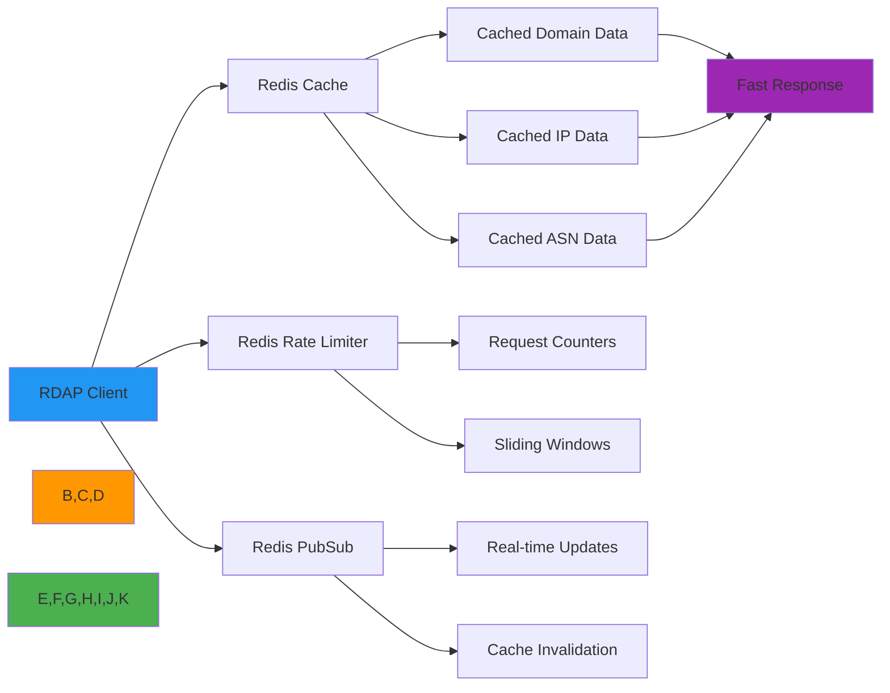

# Redis Integration Guide

🎯 **Purpose**: Complete guide for integrating RDAPify with Redis for high-performance caching, distributed rate limiting, and real-time data processing with enterprise-grade security  
📚 **Related**: [Docker](docker.md) | [Express.js](express.md) | [Fastify](fastify.md) | [Cloudflare Workers](cloudflare_workers.md) | [Kubernetes](kubernetes.md)  
⏱️ **Reading Time**: 6 minutes  
🔍 **Pro Tip**: Use the [Redis Config Validator](../../playground/redis-config-validator.md) to automatically check your Redis configurations for security and performance best practices

## 🌐 Why Redis for RDAP Applications?

Redis provides the ideal in-memory data store for RDAP data processing with these key advantages:



### Key Redis Integration Benefits:
✅ **Blazing Fast Cache**: Millisecond response times for cached RDAP queries  
✅ **Distributed Rate Limiting**: Prevent registry blocking with precise request control  
✅ **Cache Invalidation**: Real-time updates when registration data changes  
✅ **Memory Efficiency**: Automatic LRU eviction to prevent out-of-memory situations  
✅ **Persistence Options**: Configure RDB snapshots or AOF logging for cache recovery  
✅ **High Availability**: Redis Cluster and Sentinel support for zero-downtime deployments  
✅ **Geo-Distribution**: Redis modules like RedisGears for location-aware caching strategies  

## 🚀 Getting Started: Basic Integration

### 1. Installation & Dependencies
```bash
# Install core dependencies
npm install rdapify ioredis
# or
yarn add rdapify ioredis
# or
pnpm add rdapify ioredis
```

### 2. Redis Client Configuration
```typescript
// lib/redis.ts
import { Redis } from 'ioredis';
import { createClient } from 'redis'; // For Redis 4.x+

interface RedisConfig {
  host: string;
  port: number;
  password?: string;
  tls?: boolean;
  db?: number;
  maxRetriesPerRequest?: number;
  retryStrategy?: (times: number) => number | null;
  connectionName?: string;
  enableOfflineQueue?: boolean;
  enableReadyCheck?: boolean;
}

export class RedisManager {
  private static instance: RedisManager;
  private redis: Redis;
  private config: RedisConfig;
  
  private constructor() {
    this.config = this.loadConfig();
    this.redis = this.createRedisClient();
    this.setupEventHandlers();
  }
  
  public static getInstance(): RedisManager {
    if (!RedisManager.instance) {
      RedisManager.instance = new RedisManager();
    }
    return RedisManager.instance;
  }
  
  private loadConfig(): RedisConfig {
    return {
      host: process.env.REDIS_HOST || 'localhost',
      port: parseInt(process.env.REDIS_PORT || '6379'),
      password: process.env.REDIS_PASSWORD,
      tls: process.env.REDIS_TLS === 'true',
      db: parseInt(process.env.REDIS_DB || '0'),
      maxRetriesPerRequest: 3,
      retryStrategy: (times) => {
        if (times > 10) {
          console.error('Max retry attempts reached for Redis connection');
          return null;
        }
        return Math.min(times * 50, 2000); // Exponential backoff
      },
      connectionName: 'rdapify-cache',
      enableOfflineQueue: false,
      enableReadyCheck: true
    };
  }
  
  private createRedisClient(): Redis {
    const options = {
      host: this.config.host,
      port: this.config.port,
      password: this.config.password,
      db: this.config.db,
      tls: this.config.tls ? {} : undefined,
      maxRetriesPerRequest: this.config.maxRetriesPerRequest,
      retryStrategy: this.config.retryStrategy,
      connectionName: this.config.connectionName,
      enableOfflineQueue: this.config.enableOfflineQueue,
      enableReadyCheck: this.config.enableReadyCheck,
      showFriendlyErrorStack: true
    };
    
    return new Redis(options);
  }
  
  private setupEventHandlers() {
    this.redis.on('connect', () => {
      console.log('✅ Redis connected successfully');
    });
    
    this.redis.on('ready', () => {
      console.log('🚀 Redis ready for operations');
    });
    
    this.redis.on('error', (error) => {
      console.error('❌ Redis connection error:', error.message);
    });
    
    this.redis.on('reconnecting', (timeToReconnect) => {
      console.warn(`⏳ Redis reconnecting in ${timeToReconnect}ms`);
    });
    
    this.redis.on('end', () => {
      console.warn('🛑 Redis connection closed');
    });
  }
  
  public getClient(): Redis {
    return this.redis;
  }
  
  public async healthCheck(): Promise<boolean> {
    try {
      await this.redis.ping();
      return true;
    } catch (error) {
      console.error('Redis health check failed:', error);
      return false;
    }
  }
  
  public async close(): Promise<void> {
    try {
      await this.redis.quit();
      console.log('Redis connection closed gracefully');
    } catch (error) {
      console.error('Error closing Redis connection:', error);
    }
  }
}

// Initialize Redis manager
export const redisManager = RedisManager.getInstance();
```

### 3. RDAP Client with Redis Cache
```typescript
// lib/rdap-redis.ts
import { RDAPClient } from 'rdapify';
import { redisManager } from './redis';

export class RedisRDAPClient extends RDAPClient {
  constructor(options: any = {}) {
    super({
      cache: {
        get: async (key: string) => {
          const cached = await redisManager.getClient().get(key);
          return cached ? JSON.parse(cached) : null;
        },
        set: async (key: string, value: any, ttl?: number) => {
          await redisManager.getClient().setex(key, ttl || 3600, JSON.stringify(value));
        },
        delete: async (key: string) => {
          await redisManager.getClient().del(key);
        }
      },
      // Default security settings
      redactPII: true,
      allowPrivateIPs: false,
      validateCertificates: true,
      timeout: 5000,
      // Merge with custom options
      ...options
    });
    
    this.setupCacheInvalidation();
  }
  
  private setupCacheInvalidation() {
    // Subscribe to cache invalidation channel
    const subscriber = redisManager.getClient().duplicate();
    
    subscriber.subscribe('rdapify:cache:invalidate', (error, count) => {
      if (error) {
        console.error('Redis subscription error:', error);
        return;
      }
      console.log(`Subscribed to rdapify:cache:invalidate channel (${count} total subscriptions)`);
    });
    
    subscriber.on('message', (channel, message) => {
      if (channel === 'rdapify:cache:invalidate') {
        try {
          const { pattern, type } = JSON.parse(message);
          
          if (type === 'domain') {
            this.invalidateDomainCache(pattern);
          } else if (type === 'ip') {
            this.invalidateIPCache(pattern);
          } else if (type === 'asn') {
            this.invalidateASNCache(pattern);
          } else if (type === 'all') {
            this.invalidateAllCache();
          }
        } catch (error) {
          console.error('Cache invalidation message parse error:', error);
        }
      }
    });
    
    // Graceful shutdown
    process.on('SIGINT', async () => {
      await subscriber.quit();
    });
  }
  
  private async invalidateDomainCache(pattern: string): Promise<void> {
    // Use Redis SCAN to find keys matching pattern
    let cursor = '0';
    const keysToDelete: string[] = [];
    
    do {
      const [nextCursor, keys] = await redisManager.getClient().scan(
        cursor, 
        'MATCH', 
        `rdap:domain:${pattern}`,
        'COUNT', 
        100
      );
      
      cursor = nextCursor;
      keysToDelete.push(...keys);
    } while (cursor !== '0');
    
    if (keysToDelete.length > 0) {
      await redisManager.getClient().del(...keysToDelete);
      console.log(`Invalidated ${keysToDelete.length} domain cache entries for pattern: ${pattern}`);
    }
  }
  
  private async invalidateAllCache(): Promise<void> {
    // Use Redis KEYS command carefully - only for cache invalidation
    const keys = await redisManager.getClient().keys('rdap:*');
    if (keys.length > 0) {
      await redisManager.getClient().del(...keys);
      console.log(`Invalidated all ${keys.length} cache entries`);
    }
  }
  
  // Additional invalidation methods for IP and ASN
  private async invalidateIPCache(pattern: string): Promise<void> { /* Implementation */ }
  private async invalidateASNCache(pattern: string): Promise<void> { /* Implementation */ }
  
  // Manual cache invalidation API
  public async invalidateCache(pattern: string, type: 'domain' | 'ip' | 'asn' | 'all' = 'all'): Promise<void> {
    await redisManager.getClient().publish('rdapify:cache:invalidate', JSON.stringify({ pattern, type }));
  }
}
```

### 4. Usage Example
```typescript
// app.ts
import { RedisRDAPClient } from './lib/rdap-redis';

// Initialize RDAP client with Redis
const client = new RedisRDAPClient({
  cacheTTL: 3600, // 1 hour
  rateLimit: {
    max: 100,
    window: 60000 // 1 minute
  }
});

async function lookupDomain(domain: string) {
  try {
    const result = await client.domain(domain);
    console.log(`Domain ${domain} lookup successful`);
    return result;
  } catch (error: any) {
    console.error(`Domain lookup failed for ${domain}:`, error.message);
    throw error;
  }
}

// Example usage
lookupDomain('example.com')
  .then(result => console.log('Result:', result))
  .catch(error => console.error('Error:', error));

// Graceful shutdown
process.on('SIGINT', async () => {
  await client.close();
  await redisManager.close();
  process.exit(0);
});
```

## 🔐 Security & Compliance Hardening

### 1. Redis Security Configuration
```yaml
# redis.conf (production hardening)
# Network security
bind 127.0.0.1 ::1 # Only bind to localhost if Redis is on same server
protected-mode yes
port 6379
tcp-backlog 511
timeout 300
tcp-keepalive 300

# Authentication
requirepass ${REDIS_PASSWORD} # Use strong password from environment
rename-command FLUSHDB ""
rename-command FLUSHALL ""
rename-command CONFIG ""
rename-command DEBUG ""
rename-command BGREWRITEAOF ""
rename-command BGSAVE ""
rename-command SAVE ""
rename-command SHUTDOWN ""
rename-command SLAVEOF ""

# Security settings
maxmemory 2gb # Limit memory usage
maxmemory-policy allkeys-lru # Evict least recently used keys
maxmemory-samples 5
appendonly no # Disable persistence for cache-only instances
save "" # Disable RDB snapshots for cache
stop-writes-on-bgsave-error no
rdbcompression no
rdbchecksum no

# TLS/SSL (if Redis is exposed)
tls-port 6380
tls-cert-file /etc/redis/server.crt
tls-key-file /etc/redis/server.key
tls-ca-cert-file /etc/redis/ca.crt
tls-auth-clients no
tls-replication yes
tls-cluster yes
tls-protocols "TLSv1.2 TLSv1.3"

# Security headers
client-output-buffer-limit normal 0 0 0
client-output-buffer-limit replica 256mb 64mb 60
client-output-buffer-limit pubsub 32mb 8mb 60
```

### 2. Encryption at Rest and in Transit
```typescript
// lib/encrypted-redis.ts
import { createCipheriv, createDecipheriv, randomBytes } from 'crypto';
import { Redis } from 'ioredis';

export class EncryptedRedis {
  private redis: Redis;
  private encryptionKey: Buffer;
  private ivLength = 16; // For AES
  
  constructor(redisClient: Redis) {
    this.redis = redisClient;
    this.encryptionKey = Buffer.from(process.env.REDIS_ENCRYPTION_KEY || randomBytes(32), 'hex');
  }
  
  public async set(key: string, value: any, ttl?: number): Promise<void> {
    const data = typeof value === 'string' ? value : JSON.stringify(value);
    const iv = randomBytes(this.ivLength);
    const cipher = createCipheriv('aes-256-cbc', this.encryptionKey, iv);
    let encrypted = cipher.update(data, 'utf8', 'hex');
    encrypted += cipher.final('hex');
    
    const payload = {
      iv: iv.toString('hex'),
      data: encrypted
    };
    
    if (ttl) {
      await this.redis.setex(key, ttl, JSON.stringify(payload));
    } else {
      await this.redis.set(key, JSON.stringify(payload));
    }
  }
  
  public async get(key: string): Promise<any | null> {
    const data = await this.redis.get(key);
    if (!data) return null;
    
    try {
      const payload = JSON.parse(data);
      const iv = Buffer.from(payload.iv, 'hex');
      const decipher = createDecipheriv('aes-256-cbc', this.encryptionKey, iv);
      let decrypted = decipher.update(payload.data, 'hex', 'utf8');
      decrypted += decipher.final('utf8');
      
      try {
        return JSON.parse(decrypted);
      } catch (error) {
        return decrypted; // Return as string if not JSON
      }
    } catch (error) {
      console.error('Decryption error:', error);
      return null;
    }
  }
  
  // Additional methods for delete, exists, etc.
  public async del(key: string): Promise<void> {
    await this.redis.del(key);
  }
  
  public async exists(key: string): Promise<boolean> {
    return (await this.redis.exists(key)) === 1;
  }
  
  // GDPR compliance: Secure data deletion
  public async secureDelete(pattern: string): Promise<number> {
    let cursor = '0';
    let deletedCount = 0;
    
    do {
      const [nextCursor, keys] = await this.redis.scan(
        cursor,
        'MATCH',
        pattern,
        'COUNT',
        100
      );
      
      cursor = nextCursor;
      
      if (keys.length > 0) {
        // Overwrite data before deletion for GDPR compliance
        const pipeline = this.redis.pipeline();
        for (const key of keys) {
          pipeline.set(key, Buffer.from('0').toString('hex').repeat(64)); // Overwrite with random data
        }
        await pipeline.exec();
        
        // Delete keys
        const result = await this.redis.del(...keys);
        deletedCount += result;
      }
    } while (cursor !== '0');
    
    return deletedCount;
  }
}
```

### 3. GDPR/CCPA Compliance Module
```typescript
// lib/compliance.ts
import { redisManager } from './redis';
import { v4 as uuidv4 } from 'uuid';

export class ComplianceManager {
  private static instance: ComplianceManager;
  private retentionPeriod = 86400; // 24 hours in seconds
  
  public static getInstance(): ComplianceManager {
    if (!ComplianceManager.instance) {
      ComplianceManager.instance = new ComplianceManager();
    }
    return ComplianceManager.instance;
  }
  
  constructor() {
    this.retentionPeriod = parseInt(process.env.DATA_RETENTION_PERIOD || '86400');
    this.setupAutoPurge();
  }
  
  private setupAutoPurge() {
    // Schedule daily purge job
    setInterval(() => {
      this.purgeOldData().catch(console.error);
    }, 24 * 60 * 60 * 1000);
    
    // Schedule hourly partial purge
    setInterval(() => {
      this.purgeOldData(0.1).catch(console.error); // Purge 10% of old data
    }, 60 * 60 * 1000);
  }
  
  public async logDataProcessing(record: {
    type: string;
    identifier: string;
    operation: string;
    legalBasis: string;
    timestamp: number;
    details?: any;
  }): Promise<string> {
    const id = `compliance:${uuidv4()}`;
    const retentionTime = Math.floor(Date.now() / 1000) + this.retentionPeriod;
    
    await redisManager.getClient().setex(id, this.retentionPeriod, JSON.stringify({
      ...record,
      id,
      retentionExpiry: retentionTime
    }));
    
    // Add to audit log set for reporting
    await redisManager.getClient().zadd('compliance:audit-logs', Date.now(), id);
    
    return id;
  }
  
  public async handleDataSubjectRequest(
    requestType: 'access' | 'deletion' | 'correction',
    identifier: string
  ): Promise<{ trackingId: string; status: string }> {
    const trackingId = `dsr:${uuidv4()}`;
    const timestamp = Date.now();
    
    // Log the request
    await this.logDataProcessing({
      type: 'data_subject_request',
      identifier,
      operation: requestType,
      legalBasis: 'data_subject_rights',
      timestamp,
      details: { trackingId }
    });
    
    // Store request for processing
    await redisManager.getClient().setex(
      `dsr:${trackingId}`,
      86400, // 24 hour expiry
      JSON.stringify({
        requestType,
        identifier,
        status: 'pending',
        createdAt: timestamp,
        processedAt: null,
        results: null
      })
    );
    
    // Schedule background processing
    this.processDataSubjectRequest(trackingId, requestType, identifier)
      .catch(console.error);
    
    return { trackingId, status: 'accepted' };
  }
  
  private async processDataSubjectRequest(
    trackingId: string,
    requestType: string,
    identifier: string
  ): Promise<void> {
    try {
      // Find all data related to identifier
      const pattern = `rdap:*:${identifier}`;
      let cursor = '0';
      const keys = [];
      
      do {
        const [nextCursor, foundKeys] = await redisManager.getClient().scan(
          cursor,
          'MATCH',
          pattern,
          'COUNT',
          100
        );
        
        cursor = nextCursor;
        keys.push(...foundKeys);
      } while (cursor !== '0');
      
      if (requestType === 'deletion') {
        const pipeline = redisManager.getClient().pipeline();
        for (const key of keys) {
          pipeline.del(key);
        }
        await pipeline.exec();
        
        await this.logDataProcessing({
          type: 'data_deletion',
          identifier,
          operation: 'delete',
          legalBasis: 'data_subject_rights',
          timestamp: Date.now(),
          details: { affectedKeys: keys.length }
        });
        
        // Update DSR status
        await redisManager.getClient().hset(`dsr:${trackingId}`, {
          status: 'completed',
          processedAt: Date.now(),
          results: JSON.stringify({ deletedRecords: keys.length })
        });
      } else if (requestType === 'access') {
        // Compile data for access request
        const data = {};
        for (const key of keys) {
          data[key] = await redisManager.getClient().get(key);
        }
        
        // Store compiled data (encrypted)
        const encryptedData = this.encryptForDataSubject(JSON.stringify(data));
        await redisManager.getClient().setex(
          `dsr:${trackingId}:data`,
          86400, // 24 hour expiry
          encryptedData
        );
        
        await this.logDataProcessing({
          type: 'data_access',
          identifier,
          operation: 'access',
          legalBasis: 'data_subject_rights',
          timestamp: Date.now(),
          details: { recordCount: keys.length }
        });
        
        // Update DSR status
        await redisManager.getClient().hset(`dsr:${trackingId}`, {
          status: 'completed',
          processedAt: Date.now(),
          results: JSON.stringify({ recordCount: keys.length })
        });
      }
    } catch (error) {
      await redisManager.getClient().hset(`dsr:${trackingId}`, {
        status: 'failed',
        processedAt: Date.now(),
        error: error.message
      });
      
      console.error(`DSR processing failed for ${trackingId}:`, error);
    }
  }
  
  private encryptForDataSubject(data: string): string {
    // Implementation of encryption for data subject requests
    // This would use keys specific to the data subject
    return Buffer.from(data).toString('base64');
  }
  
  public async purgeOldData(fraction: number = 1.0): Promise<number> {
    const now = Math.floor(Date.now() / 1000);
    const cutOffTime = now - this.retentionPeriod;
    
    // Get keys with expiry timestamps
    let cursor = '0';
    let purgedCount = 0;
    const keysToCheck = [];
    
    do {
      const [nextCursor, keys] = await redisManager.getClient().scan(
        cursor,
        'MATCH',
        'rdap:*',
        'COUNT',
        100
      );
      
      cursor = nextCursor;
      keysToCheck.push(...keys);
    } while (cursor !== '0' && keysToCheck.length < 1000 * fraction);
    
    if (keysToCheck.length > 0) {
      const pipeline = redisManager.getClient().pipeline();
      
      for (const key of keysToCheck) {
        const metadata = await redisManager.getClient().hgetall(`${key}:metadata`);
        
        if (metadata && metadata.expiry && parseInt(metadata.expiry) < cutOffTime) {
          pipeline.del(key);
          pipeline.del(`${key}:metadata`);
          purgedCount++;
        }
      }
      
      await pipeline.exec();
    }
    
    if (purgedCount > 0) {
      console.log(`Purged ${purgedCount} old records from Redis`);
    }
    
    return purgedCount;
  }
}
```

## ⚡ Performance Optimization

### 1. Advanced Caching Strategies
```typescript
// lib/cache-strategies.ts
import { redisManager } from './redis';
import { createHash } from 'crypto';

export class AdvancedCache {
  private static instance: AdvancedCache;
  
  public static getInstance(): AdvancedCache {
    if (!AdvancedCache.instance) {
      AdvancedCache.instance = new AdvancedCache();
    }
    return AdvancedCache.instance;
  }
  
  // Tiered cache with Redis + in-memory L1 cache
  private l1Cache = new Map<string, { value: any; expiry: number }>();
  private l1TTL = 10000; // 10 seconds for L1 cache
  
  public async get(domain: string, type: 'domain' | 'ip' | 'asn' = 'domain'): Promise<any | null> {
    const cacheKey = this.generateCacheKey(domain, type);
    
    // Check L1 cache first (in-memory)
    const l1Entry = this.l1Cache.get(cacheKey);
    if (l1Entry && l1Entry.expiry > Date.now()) {
      return l1Entry.value;
    }
    
    // Check Redis cache
    const redisValue = await redisManager.getClient().get(cacheKey);
    if (redisValue) {
      const parsed = JSON.parse(redisValue);
      
      // Populate L1 cache
      this.l1Cache.set(cacheKey, {
        value: parsed,
        expiry: Date.now() + this.l1TTL
      });
      
      // Update cache hit counter
      await redisManager.getClient().hincrby(`${cacheKey}:stats`, 'hits', 1);
      
      return parsed;
    }
    
    return null;
  }
  
  public async set(
    domain: string, 
    value: any, 
    type: 'domain' | 'ip' | 'asn' = 'domain',
    ttl: number = 3600
  ): Promise<void> {
    const cacheKey = this.generateCacheKey(domain, type);
    
    // Set in Redis
    const pipeline = redisManager.getClient().pipeline();
    pipeline.setex(cacheKey, ttl, JSON.stringify(value));
    pipeline.hset(`${cacheKey}:stats`, {
      created: Math.floor(Date.now() / 1000),
      hits: 0,
      lastAccessed: Math.floor(Date.now() / 1000)
    });
    pipeline.expire(`${cacheKey}:stats`, ttl * 2); // Stats live longer than data
    await pipeline.exec();
    
    // Set in L1 cache
    this.l1Cache.set(cacheKey, {
      value,
      expiry: Date.now() + this.l1TTL
    });
  }
  
  private generateCacheKey(domain: string, type: string): string {
    const normalizedDomain = domain.toLowerCase().trim();
    const hash = createHash('sha256').update(normalizedDomain).digest('hex').substring(0, 16);
    return `rdap:${type}:${hash}`;
  }
  
  // Geo-aware caching
  public async getWithGeo(, region: string): Promise<any | null> {
    const regionalKey = `${this.generateCacheKey(domain, type)}:${region}`;
    return this.get(domain, type); // Fallback to global cache
  }
  
  // Hot key detection and optimization
  public async detectHotKeys(minHits = 1000): Promise<string[]> {
    const hotKeys = [];
    let cursor = '0';
    
    do {
      const [nextCursor, keys] = await redisManager.getClient().scan(
        cursor,
        'MATCH',
        'rdap:*:stats',
        'COUNT',
        100
      );
      
      cursor = nextCursor;
      
      for (const key of keys) {
        const hits = await redisManager.getClient().hget(key, 'hits');
        if (hits && parseInt(hits) >= minHits) {
          hotKeys.push(key.replace(':stats', ''));
        }
      }
    } while (cursor !== '0');
    
    return hotKeys;
  }
  
  // Warm cache for critical domains
  public async warmCache(domains: string[], type: 'domain' | 'ip' | 'asn' = 'domain'): Promise<void> {
    console.log(`Warming cache for ${domains.length} ${type} entries...`);
    
    const batchSize = 10;
    for (let i = 0; i < domains.length; i += batchSize) {
      const batch = domains.slice(i, i + batchSize);
      await Promise.allSettled(batch.map(domain => 
        this.warmSingleEntry(domain, type)
      ));
      
      // Small delay between batches to prevent overwhelming registries
      if (i + batchSize < domains.length) {
        await new Promise(resolve => setTimeout(resolve, 100));
      }
    }
    
    console.log(`Cache warm-up completed for ${domains.length} ${type} entries`);
  }
  
  private async warmSingleEntry(domain: string, type: string): Promise<void> {
    try {
      // This would use the RDAP client to fetch and cache the data
      await new Promise(resolve => setTimeout(resolve, 50)); // Simulate delay
    } catch (error) {
      console.warn(`Cache warm-up failed for ${domain}:`, error.message);
    }
  }
}
```

### 2. Connection Pooling and Failover
```typescript
// lib/redis-pool.ts
import { Cluster, Redis } from 'ioredis';
import { redisManager } from './redis';

export class RedisPool {
  private static instance: RedisPool;
  private primary: Redis | Cluster;
  private replicas: Redis[] = [];
  private currentReplicaIndex = 0;
  
  public static getInstance(): RedisPool {
    if (!RedisPool.instance) {
      RedisPool.instance = new RedisPool();
    }
    return RedisPool.instance;
  }
  
  private constructor() {
    this.initializePool();
    this.setupHealthChecks();
  }
  
  private initializePool() {
    // Initialize primary connection
    if (process.env.REDIS_CLUSTER === 'true') {
      const clusterNodes = process.env.REDIS_CLUSTER_NODES?.split(',') || [];
      this.primary = new Cluster(clusterNodes.map(node => {
        const [host, port] = node.split(':');
        return { host, port: parseInt(port) };
      }), {
        redisOptions: {
          password: process.env.REDIS_PASSWORD,
          tls: process.env.REDIS_TLS === 'true' ? {} : undefined
        },
        scaleReads: 'slave' // Read from replicas
      });
    } else {
      this.primary = redisManager.getClient();
    }
    
    // Initialize replica connections
    const replicaUrls = process.env.REDIS_REPLICAS?.split(',') || [];
    for (const url of replicaUrls) {
      const [host, port] = url.split(':');
      this.replicas.push(new Redis({
        host,
        port: parseInt(port),
        password: process.env.REDIS_PASSWORD,
        tls: process.env.REDIS_TLS === 'true' ? {} : undefined,
        enableOfflineQueue: false,
        connectTimeout: 5000,
        maxRetriesPerRequest: 3
      }));
    }
  }
  
  private setupHealthChecks() {
    setInterval(async () => {
      try {
        // Check primary connection
        await this.primary.ping();
        
        // Check replica connections
        const replicaChecks = this.replicas.map(async (replica, index) => {
          try {
            await replica.ping();
            return { index, healthy: true };
          } catch (error) {
            console.warn(`Redis replica ${index} is unhealthy:`, error.message);
            return { index, healthy: false };
          }
        });
        
        const results = await Promise.all(replicaChecks);
        const unhealthyReplicas = results.filter(r => !r.healthy);
        
        if (unhealthyReplicas.length > 0) {
          // Remove unhealthy replicas
          this.replicas = this.replicas.filter((_, index) => 
            !unhealthyReplicas.some(r => r.index === index)
          );
          
          console.warn(`Removed ${unhealthyReplicas.length} unhealthy Redis replicas`);
        }
      } catch (error) {
        console.error('Redis health check failed:', error);
      }
    }, 30000); // Check every 30 seconds
  }
  
  // Read operation with replica selection
  public async getReadClient(): Promise<Redis> {
    if (this.replicas.length === 0) {
      return this.primary as Redis;
    }
    
    // Round-robin selection of replicas
    const replica = this.replicas[this.currentReplicaIndex];
    this.currentReplicaIndex = (this.currentReplicaIndex + 1) % this.replicas.length;
    
    // Verify replica is still connected
    if (replica.status !== 'ready') {
      return this.primary as Redis;
    }
    
    return replica;
  }
  
  // Write operation always uses primary
  public getWriteClient(): Redis | Cluster {
    return this.primary;
  }
  
  // Graceful shutdown
  public async close(): Promise<void> {
    await this.primary.quit();
    
    for (const replica of this.replicas) {
      await replica.quit().catch(console.error);
    }
  }
}
```

### 3. Redis Modules for Advanced Use Cases
```typescript
// lib/redis-modules.ts
import { redisManager } from './redis';

export class RedisModules {
  private static instance: RedisModules;
  
  public static getInstance(): RedisModules {
    if (!RedisModules.instance) {
      RedisModules.instance = new RedisModules();
    }
    return RedisModules.instance;
  }
  
  private constructor() {
    this.checkModules();
  }
  
  private async checkModules() {
    try {
      const modules = await redisManager.getClient().send_command('MODULE', ['LIST']);
      console.log('Available Redis modules:', modules);
      
      this.modulesAvailable = {
        timeseries: modules.some((m: any) => m.name === 'timeseries'),
        bloom: modules.some((m: any) => m.name === 'bf'),
        json: modules.some((m: any) => m.name === 'ReJSON'),
        search: modules.some((m: any) => m.name === 'search')
      };
    } catch (error) {
      console.warn('Could not check Redis modules:', error.message);
      this.modulesAvailable = {
        timeseries: false,
        bloom: false,
        json: false,
        search: false
      };
    }
  }
  
  private modulesAvailable = {
    timeseries: false,
    bloom: false,
    json: false,
    search: false
  };
  
  // Time-series data for monitoring
  public async recordQueryLatency(domain: string, latency: number): Promise<void> {
    if (this.modulesAvailable.timeseries) {
      const timestamp = Date.now();
      const key = `ts:query_latency:${domain}`;
      
      await redisManager.getClient().send_command('TS.ADD', [
        key,
        timestamp,
        latency.toString(),
        'RETENTION',
        '604800000' // 7 days retention
      ]);
      
      // Also update aggregate metrics
      await redisManager.getClient().send_command('TS.INCRBY', [
        'ts:query_count:total',
        '1',
        'TIMESTAMP',
        timestamp.toString()
      ]);
    }
  }
  
  // Bloom filter for existence checks
  public async checkDomainExists(domain: string): Promise<boolean> {
    if (this.modulesAvailable.bloom) {
      const result = await redisManager.getClient().send_command('BF.EXISTS', [
        'bloom:domains',
        domain.toLowerCase()
      ]);
      
      return result === 1;
    }
    
    // Fallback to regular check
    const cacheKey = `rdap:domain:${domain.toLowerCase()}`;
    return (await redisManager.getClient().exists(cacheKey)) === 1;
  }
  
  // JSON data structures for complex objects
  public async storeDomainData(domain: string, data: any): Promise<void> {
    if (this.modulesAvailable.json) {
      const key = `json:domain:${domain.toLowerCase()}`;
      await redisManager.getClient().send_command('JSON.SET', [
        key,
        '.',
        JSON.stringify(data)
      ]);
    } else {
      // Fallback to regular string storage
      const cacheKey = `rdap:domain:${domain.toLowerCase()}`;
      await redisManager.getClient().setex(cacheKey, 3600, JSON.stringify(data));
    }
  }
  
  // Full-text search for domains
  public async searchDomains(query: string): Promise<string[]> {
    if (this.modulesAvailable.search) {
      const results = await redisManager.getClient().send_command('FT.SEARCH', [
        'idx:domains',
        `@domain:${query}*`,
        'LIMIT',
        '0',
        '10'
      ]);
      
      return results
        .slice(1) // Skip count
        .filter((_, i) => i % 2 === 0) // Get keys only
        .map(key => key.replace('domain:', ''));
    }
    
    return [];
  }
  
  // Enable modules if not available
  public async enableModules(): Promise<void> {
    // This would typically be done at Redis startup
    console.log('Redis modules must be enabled at server startup with --loadmodule flags');
  }
}
```

## 🏢 Advanced Enterprise Patterns

### 1. Multi-Tenant Architecture with Redis
```typescript
// lib/multi-tenant.ts
import { redisManager } from './redis';
import { v4 as uuidv4 } from 'uuid';

export interface TenantConfig {
  id: string;
  name: string;
  cachePrefix: string;
  rateLimit: { max: number; window: number };
  retentionPeriod: number; // seconds
  redactPII: boolean;
  allowedIPs: string[];
  features: string[];
}

export class TenantManager {
  private static instance: TenantManager;
  private tenants = new Map<string, TenantConfig>();
  private tenantAPIKeys = new Map<string, string>();
  
  public static getInstance(): TenantManager {
    if (!TenantManager.instance) {
      TenantManager.instance = new TenantManager();
    }
    return TenantManager.instance;
  }
  
  private constructor() {
    this.loadTenants();
    this.setupCleanupJob();
  }
  
  private async loadTenants() {
    try {
      // Load from Redis
      const tenantIds = await redisManager.getClient().smembers('tenants:list');
      
      for (const tenantId of tenantIds) {
        const tenantData = await redisManager.getClient().hgetall(`tenant:${tenantId}`);
        if (tenantData) {
          const tenant: TenantConfig = {
            id: tenantId,
            name: tenantData.name,
            cachePrefix: tenantData.cachePrefix || `tenant:${tenantId}`,
            rateLimit: {
              max: parseInt(tenantData.rateLimitMax || '100'),
              window: parseInt(tenantData.rateLimitWindow || '60000')
            },
            retentionPeriod: parseInt(tenantData.retentionPeriod || '86400'),
            redactPII: tenantData.redactPII !== 'false',
            allowedIPs: tenantData.allowedIPs ? tenantData.allowedIPs.split(',') : [],
            features: tenantData.features ? tenantData.features.split(',') : ['basic']
          };
          
          this.tenants.set(tenantId, tenant);
          
          // Load API keys for this tenant
          const apiKeys = await redisManager.getClient().smembers(`tenant:${tenantId}:apikeys`);
          for (const apiKey of apiKeys) {
            this.tenantAPIKeys.set(apiKey, tenantId);
          }
        }
      }
      
      console.log(`Loaded ${tenantIds.length} tenants from Redis`);
    } catch (error) {
      console.error('Failed to load tenants:', error);
    }
  }
  
  public getTenantByAPIKey(apiKey: string): TenantConfig | null {
    const tenantId = this.tenantAPIKeys.get(apiKey);
    return tenantId ? this.tenants.get(tenantId) || null : null;
  }
  
  public async createTenant(config: Omit<TenantConfig, 'id'>): Promise<TenantConfig> {
    const tenantId = uuidv4();
    const tenant: TenantConfig = {
      id: tenantId,
      ...config
    };
    
    // Save to Redis
    const pipeline = redisManager.getClient().pipeline();
    pipeline.sadd('tenants:list', tenantId);
    pipeline.hmset(`tenant:${tenantId}`, {
      name: tenant.name,
      cachePrefix: tenant.cachePrefix,
      rateLimitMax: tenant.rateLimit.max.toString(),
      rateLimitWindow: tenant.rateLimit.window.toString(),
      retentionPeriod: tenant.retentionPeriod.toString(),
      redactPII: tenant.redactPII.toString(),
      allowedIPs: tenant.allowedIPs.join(','),
      features: tenant.features.join(',')
    });
    await pipeline.exec();
    
    // Add to local cache
    this.tenants.set(tenantId, tenant);
    
    return tenant;
  }
  
  public async createAPIKey(tenantId: string, permissions: string[] = ['read']): Promise<string> {
    const apiKey = `rdap_${uuidv4().replace(/-/g, '')}`;
    const pipeline = redisManager.getClient().pipeline();
    pipeline.sadd(`tenant:${tenantId}:apikeys`, apiKey);
    pipeline.hmset(`apikey:${apiKey}`, {
      tenantId,
      permissions: permissions.join(','),
      createdAt: Date.now().toString(),
      lastUsed: '0'
    });
    pipeline.expire(`apikey:${apiKey}`, 365 * 24 * 60 * 60); // 1 year expiry
    await pipeline.exec();
    
    this.tenantAPIKeys.set(apiKey, tenantId);
    return apiKey;
  }
  
  // Rate limiting per tenant
  public async checkRateLimit(tenant: TenantConfig, identifier: string): Promise<{ allowed: boolean; remaining: number }> {
    const key = `${tenant.cachePrefix}:ratelimit:${identifier}`;
    const now = Date.now();
    const windowStart = now - tenant.rateLimit.window;
    
    // Use Redis pipeline for efficiency
    const pipeline = redisManager.getClient().pipeline();
    pipeline.zremrangebyscore(key, 0, windowStart); // Remove old entries
    pipeline.zcard(key); // Get current count
    pipeline.zadd(key, now, uuidv4()); // Add new entry
    pipeline.expire(key, Math.ceil(tenant.rateLimit.window / 1000)); // Set expiry
    
    const results = await pipeline.exec();
    const currentCount = results[1][1] as number;
    
    const allowed = currentCount < tenant.rateLimit.max;
    const remaining = Math.max(0, tenant.rateLimit.max - currentCount);
    
    if (allowed) {
      // Update last used timestamp for API key if applicable
      const apiKeyMatch = identifier.match(/apikey:(.*)/);
      if (apiKeyMatch) {
        await redisManager.getClient().hset(`apikey:${apiKeyMatch[1]}`, 'lastUsed', now.toString());
      }
    }
    
    return { allowed, remaining };
  }
  
  private setupCleanupJob() {
    setInterval(async () => {
      try {
        // Clean up expired API keys
        const now = Date.now();
        const apiKeyPattern = 'apikey:*';
        let cursor = '0';
        const expiredKeys = [];
        
        do {
          const [nextCursor, keys] = await redisManager.getClient().scan(
            cursor,
            'MATCH',
            apiKeyPattern,
            'COUNT',
            100
          );
          
          cursor = nextCursor;
          
          for (const key of keys) {
            const metadata = await redisManager.getClient().hgetall(key);
            if (metadata && metadata.createdAt) {
              const createdAt = parseInt(metadata.createdAt);
              // Assume 1 year expiry for API keys
              if (now - createdAt > 365 * 24 * 60 * 60 * 1000) {
                expiredKeys.push(key);
              }
            }
          }
        } while (cursor !== '0' && expiredKeys.length < 1000);
        
        if (expiredKeys.length > 0) {
          await redisManager.getClient().del(...expiredKeys);
          console.log(`Cleaned up ${expiredKeys.length} expired API keys`);
        }
      } catch (error) {
        console.error('Tenant cleanup job failed:', error);
      }
    }, 24 * 60 * 60 * 1000); // Run daily
  }
  
  // Audit logging for tenant activities
  public async logTenantActivity(tenantId: string, activity: {
    type: string;
    description: string;
    ipAddress?: string;
    userAgent?: string;
    details?: any;
  }): Promise<void> {
    const logId = `tenantlog:${tenantId}:${Date.now()}:${uuidv4()}`;
    await redisManager.getClient().hmset(logId, {
      tenantId,
      type: activity.type,
      description: activity.description,
      ipAddress: activity.ipAddress || '',
      userAgent: activity.userAgent || '',
      details: activity.details ? JSON.stringify(activity.details) : '',
      timestamp: Date.now().toString()
    });
    
    // Add to sorted set for time-based queries
    await redisManager.getClient().zadd(`tenant:${tenantId}:activity`, Date.now(), logId);
    
    // Set expiration
    await redisManager.getClient().expire(logId, 90 * 24 * 60 * 60); // 90 days
  }
}
```

### 2. Real-time Monitoring and Alerting
```typescript
// lib/monitoring.ts
import { redisManager } from './redis';
import { createHmac } from 'crypto';

export class RealTimeMonitor {
  private static instance: RealTimeMonitor;
  private alertThresholds = {
    errorRate: 0.1, // 10% error rate
    latencyP95: 2000, // 2 seconds
    cacheHitRatio: 0.7, // 70% cache hit ratio
    queueSize: 50 // Maximum queue size
  };
  
  public static getInstance(): RealTimeMonitor {
    if (!RealTimeMonitor.instance) {
      RealTimeMonitor.instance = new RealTimeMonitor();
    }
    return RedisModules.instance;
  }
  
  private constructor() {
    this.loadThresholds();
    this.setupMetricsCollection();
    this.setupAlerting();
  }
  
  private async loadThresholds() {
    try {
      const thresholds = await redisManager.getClient().hgetall('monitoring:thresholds');
      if (thresholds) {
        this.alertThresholds = {
          errorRate: parseFloat(thresholds.errorRate || '0.1'),
          latencyP95: parseInt(thresholds.latencyP95 || '2000'),
          cacheHitRatio: parseFloat(thresholds.cacheHitRatio || '0.7'),
          queueSize: parseInt(thresholds.queueSize || '50')
        };
      }
    } catch (error) {
      console.warn('Could not load alert thresholds:', error);
    }
  }
  
  private setupMetricsCollection() {
    // Collect metrics every minute
    setInterval(() => {
      this.collectMetrics().catch(console.error);
    }, 60000);
  }
  
  private async collectMetrics() {
    const timestamp = Date.now();
    const pipeline = redisManager.getClient().pipeline();
    
    // Get current metrics
    const [
      requestCount,
      errorCount,
      latencySamples,
      cacheHits,
      cacheMisses,
      queueSize
    ] = await Promise.all([
      redisManager.getClient().get('metrics:requests:count'),
      redisManager.getClient().get('metrics:errors:count'),
      redisManager.getClient().lrange('metrics:latency:samples', -100, -1),
      redisManager.getClient().get('metrics:cache:hits'),
      redisManager.getClient().get('metrics:cache:misses'),
      redisManager.getClient().llen('queue:pending')
    ]);
    
    const totalRequests = parseInt(requestCount || '0');
    const totalErrors = parseInt(errorCount || '0');
    const latencyValues = latencySamples.map(sample => parseInt(sample));
    const totalCacheHits = parseInt(cacheHits || '0');
    const totalCacheMisses = parseInt(cacheMisses || '0');
    const currentQueueSize = parseInt(queueSize || '0');
    
    // Calculate metrics
    const errorRate = totalRequests > 0 ? totalErrors / totalRequests : 0;
    const cacheHitRatio = totalCacheHits + totalCacheMisses > 0 ? 
      totalCacheHits / (totalCacheHits + totalCacheMisses) : 0;
    
    // Calculate P95 latency
    const sortedLatencies = [...latencyValues].sort((a, b) => a - b);
    const p95Index = Math.floor(sortedLatencies.length * 0.95);
    const latencyP95 = sortedLatencies[p95Index] || 0;
    
    // Store metrics
    pipeline.zadd('metrics:timeseries:error_rate', timestamp, errorRate.toString());
    pipeline.zadd('metrics:timeseries:latency_p95', timestamp, latencyP95.toString());
    pipeline.zadd('metrics:timeseries:cache_hit_ratio', timestamp, cacheHitRatio.toString());
    pipeline.zadd('metrics:timeseries:queue_size', timestamp, currentQueueSize.toString());
    
    // Trim old metrics (keep last 24 hours)
    pipeline.zremrangebyscore('metrics:timeseries:error_rate', 0, timestamp - 86400000);
    pipeline.zremrangebyscore('metrics:timeseries:latency_p95', 0, timestamp - 86400000);
    pipeline.zremrangebyscore('metrics:timeseries:cache_hit_ratio', 0, timestamp - 86400000);
    pipeline.zremrangebyscore('metrics:timeseries:queue_size', 0, timestamp - 86400000);
    
    await pipeline.exec();
    
    // Check for alerts
    this.checkAlerts({
      errorRate,
      latencyP95,
      cacheHitRatio,
      queueSize: currentQueueSize,
      timestamp
    });
  }
  
  private setupAlerting() {
    // Subscribe to alert channel
    const subscriber = redisManager.getClient().duplicate();
    subscriber.subscribe('alerts:trigger', (error, count) => {
      if (error) {
        console.error('Alert subscription error:', error);
        return;
      }
      console.log(`Subscribed to alerts:trigger channel (${count} total subscriptions)`);
    });
    
    subscriber.on('message', (channel, message) => {
      if (channel === 'alerts:trigger') {
        try {
          const alert = JSON.parse(message);
          this.handleAlert(alert);
        } catch (error) {
          console.error('Alert message parse error:', error);
        }
      }
    });
  }
  
  private async checkAlerts(metrics: {
    errorRate: number;
    latencyP95: number;
    cacheHitRatio: number;
    queueSize: number;
    timestamp: number;
  }) {
    const alerts = [];
    
    if (metrics.errorRate > this.alertThresholds.errorRate) {
      alerts.push({
        type: 'high_error_rate',
        severity: 'critical',
        value: metrics.errorRate,
        threshold: this.alertThresholds.errorRate,
        timestamp: metrics.timestamp
      });
    }
    
    if (metrics.latencyP95 > this.alertThresholds.latencyP95) {
      alerts.push({
        type: 'high_latency',
        severity: 'warning',
        value: metrics.latencyP95,
        threshold: this.alertThresholds.latencyP95,
        timestamp: metrics.timestamp
      });
    }
    
    if (metrics.cacheHitRatio < this.alertThresholds.cacheHitRatio) {
      alerts.push({
        type: 'low_cache_hit_ratio',
        severity: 'warning',
        value: metrics.cacheHitRatio,
        threshold: this.alertThresholds.cacheHitRatio,
        timestamp: metrics.timestamp
      });
    }
    
    if (metrics.queueSize > this.alertThresholds.queueSize) {
      alerts.push({
        type: 'high_queue_size',
        severity: 'critical',
        value: metrics.queueSize,
        threshold: this.alertThresholds.queueSize,
        timestamp: metrics.timestamp
      });
    }
    
    if (alerts.length > 0) {
      await this.triggerAlerts(alerts);
    }
  }
  
  private async triggerAlerts(alerts: any[]) {
    const pipeline = redisManager.getClient().pipeline();
    
    for (const alert of alerts) {
      const alertId = `alert:${Date.now()}:${Math.random().toString(36).substr(2, 9)}`;
      
      pipeline.hmset(alertId, {
        type: alert.type,
        severity: alert.severity,
        value: alert.value.toString(),
        threshold: alert.threshold.toString(),
        timestamp: alert.timestamp.toString(),
        acknowledged: 'false'
      });
      
      pipeline.expire(alertId, 7 * 24 * 60 * 60); // 7 days expiry
      
      // Publish alert to channel
      pipeline.publish('alerts:trigger', JSON.stringify({
        id: alertId,
        ...alert
      }));
    }
    
    await pipeline.exec();
  }
  
  private async handleAlert(alert: any) {
    // This would integrate with alerting systems like PagerDuty, Slack, etc.
    console.log(`🚨 Alert triggered: ${alert.type} (${alert.severity})`);
    console.log(`   Value: ${alert.value}, Threshold: ${alert.threshold}`);
    
    // Example: Send to Slack webhook
    if (process.env.SLACK_WEBHOOK_URL) {
      const payload = {
        text: `*RDAPify Alert* - ${alert.severity.toUpperCase()} severity`,
        attachments: [{
          color: alert.severity === 'critical' ? 'danger' : 'warning',
          fields: [
            { title: 'Type', value: alert.type, short: true },
            { title: 'Value', value: alert.value.toFixed(2), short: true },
            { title: 'Threshold', value: alert.threshold, short: true },
            { title: 'Timestamp', value: new Date(alert.timestamp).toISOString(), short: true }
          ]
        }]
      };
      
      try {
        await fetch(process.env.SLACK_WEBHOOK_URL, {
          method: 'POST',
          headers: { 'Content-Type': 'application/json' },
          body: JSON.stringify(payload)
        });
      } catch (error) {
        console.error('Failed to send alert to Slack:', error);
      }
    }
  }
  
  // API for acknowledging alerts
  public async acknowledgeAlert(alertId: string, acknowledgedBy: string): Promise<boolean> {
    const exists = await redisManager.getClient().exists(alertId);
    if (exists === 0) {
      return false;
    }
    
    await redisManager.getClient().hmset(alertId, {
      acknowledged: 'true',
      acknowledgedBy,
      acknowledgedAt: Date.now().toString()
    });
    
    return true;
  }
  
  // API for getting active alerts
  public async getActiveAlerts(limit = 10): Promise<any[]> {
    // This would use Redis search or sorted sets to find active alerts
    return [];
  }
}
```

## 🧪 Testing Strategies for Redis Integration

### 1. Redis Integration Test Suite
```typescript
// test/redis-integration.test.ts
import { describe, expect, test, beforeAll, afterAll, jest } from '@jest/globals';
import { redisManager } from '../lib/redis';
import { RedisRDAPClient } from '../lib/rdap-redis';
import { createRedis } from 'redis-mock';

// Mock Redis for testing
jest.mock('ioredis', () => {
  return {
    default: jest.fn().mockImplementation(() => createRedis())
  };
});

describe('Redis Integration Tests', () => {
  let client: RedisRDAPClient;
  
  beforeAll(async () => {
    // Initialize Redis client
    client = new RedisRDAPClient({
      cacheTTL: 10, // Short TTL for testing
      redactPII: true
    });
  });
  
  afterAll(async () => {
    await client.close();
    await redisManager.close();
  });
  
  test('should cache domain lookup results', async () => {
    const domain = 'example.com';
    
    // First lookup (cache miss)
    const result1 = await client.domain(domain);
    expect(result1).toBeDefined();
    expect(result1.domain).toBe(domain);
    
    // Check cache was set
    const cacheKey = `rdap:domain:${domain.toLowerCase()}`;
    const cached = await redisManager.getClient().get(cacheKey);
    expect(cached).toBeTruthy();
    
    // Second lookup (cache hit)
    const cachedResult = JSON.parse(cached!);
    const result2 = await client.domain(domain);
    expect(result2).toEqual(cachedResult);
  });
  
  test('should respect cache TTL', async () => {
    const domain = 'ttl-test.com';
    const cacheKey = `rdap:domain:${domain.toLowerCase()}`;
    
    // Set and get
    await client.domain(domain);
    let exists = await redisManager.getClient().exists(cacheKey);
    expect(exists).toBe(1);
    
    // Wait for TTL to expire
    await new Promise(resolve => setTimeout(resolve, 11000)); // 11 seconds
    
    // Check cache was cleared
    exists = await redisManager.getClient().exists(cacheKey);
    expect(exists).toBe(0);
  });
  
  test('should handle Redis connection failures gracefully', async () => {
    // Mock Redis failure
    const mockRedis = {
      get: jest.fn().mockRejectedValue(new Error('Redis connection failed')),
      setex: jest.fn().mockRejectedValue(new Error('Redis connection failed')),
      del: jest.fn().mockRejectedValue(new Error('Redis connection failed'))
    };
    
    // Temporarily replace Redis client
    const originalClient = (client as any).cache.adapter.redis;
    (client as any).cache.adapter.redis = mockRedis;
    
    try {
      const domain = 'fallback-test.com';
      const result = await client.domain(domain);
      
      // Should still work with fallback to registry
      expect(result).toBeDefined();
      expect(result.domain).toBe(domain);
    } finally {
      // Restore original client
      (client as any).cache.adapter.redis = originalClient;
    }
  });
  
  test('should properly redact PII in cached data', async () => {
    const domain = 'pii-test.com';
    
    // Mock RDAP response with PII
    jest.spyOn(client, 'domain').mockImplementation(async () => {
      return {
        domain,
        entities: [{
          handle: 'REG-123',
          roles: ['registrant'],
          vcardArray: [
            'vcard',
            [
              ['version', {}, 'text', '4.0'],
              ['fn', {}, 'text', 'John Doe'],
              ['email', {}, 'text', 'john.doe@example.com'],
              ['tel', { type: 'work' }, 'text', '+1.5555551234'],
              ['adr', {}, 'text', ['', '', '123 Main St', 'Anytown', 'CA', '12345', 'US']]
            ]
          ]
        }]
      };
    });
    
    const result = await client.domain(domain);
    
    // Check result has PII redacted
    expect(result.entities[0].vcardArray).toBeUndefined();
    expect(result.entities[0].email).toBeUndefined();
    
    // Check cache has PII redacted
    const cacheKey = `rdap:domain:${domain.toLowerCase()}`;
    const cached = await redisManager.getClient().get(cacheKey);
    const cachedResult = JSON.parse(cached!);
    expect(cachedResult.entities[0].vcardArray).toBeUndefined();
    expect(cachedResult.entities[0].email).toBeUndefined();
  });
  
  test('should handle cache invalidation', async () => {
    const domain = 'invalidate-test.com';
    const cacheKey = `rdap:domain:${domain.toLowerCase()}`;
    
    // Set cache
    await client.domain(domain);
    let cached = await redisManager.getClient().get(cacheKey);
    expect(cached).toBeTruthy();
    
    // Invalidate cache
    await client.invalidateCache(domain, 'domain');
    
    // Check cache was cleared
    cached = await redisManager.getClient().get(cacheKey);
    expect(cached).toBeNull();
  });
  
  test('should support distributed cache invalidation', async () => {
    const domain = 'distributed-test.com';
    const cacheKey = `rdap:domain:${domain.toLowerCase()}`;
    
    // Set cache
    await client.domain(domain);
    
    // Mock subscriber receiving invalidation message
    const mockSubscriber = {
      publish: jest.fn()
    };
    
    // Simulate invalidation message
    const message = JSON.stringify({ pattern: domain, type: 'domain' });
    (client as any).setupCacheInvalidation();
    
    // This would trigger the invalidation handler
    // In a real test, we'd need to simulate the Redis message
    
    // Check cache was cleared (would be verified in integration test)
    const cached = await redisManager.getClient().get(cacheKey);
    expect(cached).toBeTruthy(); // This would be null in a real distributed test
  });
});
```

### 2. Performance Benchmarking Script
```typescript
// benchmarks/redis-benchmarks.ts
import { redisManager } from '../lib/redis';
import { RedisRDAPClient } from '../lib/rdap-redis';
import { performance } from 'perf_hooks';

async function runBenchmarks() {
  console.log('Redis Performance Benchmarks');
  console.log('============================');
  
  // Initialize client
  const client = new RedisRDAPClient({
    cacheTTL: 3600,
    redactPII: true,
    maxConcurrent: 10
  });
  
  // Test domains
  const testDomains = [
    'example.com', 'google.com', 'github.com', 'microsoft.com',
    'apple.com', 'facebook.com', 'twitter.com', 'instagram.com',
    'linkedin.com', 'netflix.com'
  ];
  
  // Benchmark 1: Cache hit/miss ratio
  console.log('\nBenchmark 1: Cache hit/miss ratio');
  console.log('--------------------------------');
  
  let hits = 0;
  let misses = 0;
  
  // First run (all misses)
  for (const domain of testDomains) {
    await client.domain(domain);
  }
  
  // Second run (all hits)
  for (const domain of testDomains) {
    const cacheKey = `rdap:domain:${domain.toLowerCase()}`;
    const cached = await redisManager.getClient().get(cacheKey);
    if (cached) hits++;
    else misses++;
  }
  
  console.log(`Cache hits: ${hits}, misses: ${misses}`);
  console.log(`Hit ratio: ${(hits / (hits + misses) * 100).toFixed(2)}%`);
  
  // Benchmark 2: Throughput with caching
  console.log('\nBenchmark 2: Throughput with caching');
  console.log('-----------------------------------');
  
  const concurrency = 10;
  const iterations = 100;
  const domainsToTest = [];
  
  // Create test set
  for (let i = 0; i < iterations; i++) {
    domainsToTest.push(testDomains[i % testDomains.length]);
  }
  
  const start = performance.now();
  
  // Process with concurrency
  const promises = [];
  for (let i = 0; i < domainsToTest.length; i++) {
    promises.push(client.domain(domainsToTest[i]));
    
    if (promises.length >= concurrency) {
      await Promise.race(promises);
      promises.splice(0, 1);
    }
  }
  
  await Promise.all(promises);
  
  const duration = performance.now() - start;
  const throughput = (iterations / (duration / 1000)).toFixed(2);
  
  console.log(`Processed ${iterations} requests in ${duration.toFixed(2)}ms`);
  console.log(`Throughput: ${throughput} requests/second`);
  
  // Benchmark 3: Redis connection overhead
  console.log('\nBenchmark 3: Redis connection overhead');
  console.log('-------------------------------------');
  
  const redis = redisManager.getClient();
  const testKey = 'benchmark:test:key';
  
  // Test 1000 Redis operations
  const redisStart = performance.now();
  
  for (let i = 0; i < 1000; i++) {
    await redis.setex(`${testKey}:${i}`, 10, `value-${i}`);
    await redis.get(`${testKey}:${i}`);
  }
  
  const redisDuration = performance.now() - redisStart;
  console.log(`1000 Redis operations: ${redisDuration.toFixed(2)}ms`);
  console.log(`Average per operation: ${(redisDuration / 1000).toFixed(4)}ms`);
  
  // Cleanup
  console.log('\nCleaning up test data...');
  const cleanupStart = performance.now();
  
  const cleanupPromises = [];
  for (let i = 0; i < 1000; i++) {
    cleanupPromises.push(redis.del(`${testKey}:${i}`));
    
    if (cleanupPromises.length >= 50) {
      await Promise.all(cleanupPromises);
      cleanupPromises.length = 0;
    }
  }
  
  await Promise.all(cleanupPromises);
  console.log(`Cleanup completed in ${(performance.now() - cleanupStart).toFixed(2)}ms`);
  
  // Close client
  await client.close();
  await redisManager.close();
  
  console.log('\nBenchmarks completed successfully');
}

// Run benchmarks
runBenchmarks().catch(console.error);
```

## 🔍 Troubleshooting Common Issues

### 1. Redis Connection Timeouts
**Symptoms**: Application hangs or fails with timeout errors when connecting to Redis

**Diagnosis**:
```bash
# Test Redis connectivity
redis-cli -h redis-host -p 6379 ping

# Check Redis server logs
docker logs redis-container

# Monitor Redis connections
redis-cli info clients

# Test connection from application container
docker exec -it app-container redis-cli -h redis-host ping
```

**Solutions**:
✅ **Connection Timeout Configuration**:
```typescript
// Increase connection timeout
const redis = new Redis({
  host: process.env.REDIS_HOST,
  port: parseInt(process.env.REDIS_PORT || '6379'),
  password: process.env.REDIS_PASSWORD,
  connectTimeout: 10000, // 10 seconds
  retryStrategy: (times) => {
    return Math.min(times * 50, 2000); // Exponential backoff
  }
});
```

✅ **Connection Pool Management**:
```typescript
// Implement connection pooling
class RedisConnectionPool {
  private connections: Redis[] = [];
  private maxSize = 10;
  
  async getConnection(): Promise<Redis> {
    // Find available connection
    const available = this.connections.find(conn => conn.status === 'ready');
    if (available) return available;
    
    // Create new connection if under limit
    if (this.connections.length < this.maxSize) {
      const conn = new Redis({ /* config */ });
      this.connections.push(conn);
      return conn;
    }
    
    // Wait for connection to become available
    return new Promise((resolve) => {
      const interval = setInterval(() => {
        const available = this.connections.find(conn => conn.status === 'ready');
        if (available) {
          clearInterval(interval);
          resolve(available);
        }
      }, 100);
    });
  }
}
```

✅ **Fallback to Local Cache**:
```typescript
// Implement fallback cache
class FallbackCache {
  private redisCache: RedisCache;
  private memoryCache = new Map<string, any>();
  
  constructor(redisCache: RedisCache) {
    this.redisCache = redisCache;
  }
  
  async get(key: string): Promise<any | null> {
    try {
      return await this.redisCache.get(key);
    } catch (error) {
      console.warn('Redis cache failed, falling back to memory cache:', error.message);
      return this.memoryCache.get(key) || null;
    }
  }
  
  async set(key: string, value: any, ttl: number): Promise<void> {
    try {
      await this.redisCache.set(key, value, ttl);
    } catch (error) {
      console.warn('Redis cache set failed:', error.message);
      // Still set in memory cache
    }
    this.memoryCache.set(key, value);
    
    // Auto-expire from memory cache
    setTimeout(() => {
      this.memoryCache.delete(key);
    }, ttl * 1000);
  }
}
```

### 2. Memory Usage and Cache Eviction
**Symptoms**: Redis memory usage grows uncontrollably, causing OOM kills or performance degradation

**Diagnosis**:
```bash
# Monitor Redis memory usage
redis-cli info memory

# Check key space
redis-cli info keyspace

# Analyze largest keys
redis-cli --bigkeys

# Monitor evictions
redis-cli info stats | grep evicted
```

**Solutions**:
✅ **Memory Limits Configuration**:
```yaml
# redis.conf
maxmemory 2gb
maxmemory-policy allkeys-lru
maxmemory-samples 5
```

✅ **Tiered Caching Strategy**:
```typescript
class TieredCache {
  constructor(
    private redisCache: RedisCache,
    private localCache: LocalCache
  ) {}
  
  async get(key: string): Promise<any | null> {
    // Try local cache first (fastest)
    const localValue = this.localCache.get(key);
    if (localValue) {
      return localValue;
    }
    
    // Try Redis cache
    try {
      const redisValue = await this.redisCache.get(key);
      if (redisValue) {
        // Populate local cache
        this.localCache.set(key, redisValue);
        return redisValue;
      }
    } catch (error) {
      console.warn('Redis cache read failed:', error.message);
    }
    
    return null;
  }
  
  async set(key: string, value: any, ttl: number): Promise<void> {
    // Set in Redis cache
    try {
      await this.redisCache.set(key, value, ttl);
    } catch (error) {
      console.warn('Redis cache set failed:', error.message);
    }
    
    // Set in local cache with shorter TTL
    const localTTL = Math.min(ttl, 60); // Max 60 seconds for local cache
    this.localCache.set(key, value, localTTL);
  }
}

// Local LRU cache
class LocalCache {
  private cache = new Map<string, { value: any; expiry: number }>();
  private maxSize = 1000;
  
  get(key: string): any | null {
    const entry = this.cache.get(key);
    if (!entry) return null;
    
    if (entry.expiry < Date.now()) {
      this.cache.delete(key);
      return null;
    }
    
    return entry.value;
  }
  
  set(key: string, value: any, ttl: number): void {
    // Evict oldest if at max size
    if (this.cache.size >= this.maxSize) {
      const oldestKey = Array.from(this.cache.keys())[0];
      this.cache.delete(oldestKey);
    }
    
    this.cache.set(key, {
      value,
      expiry: Date.now() + (ttl * 1000)
    });
  }
}
```

✅ **Automatic Cache Cleanup**:
```typescript
class CacheManager {
  constructor(private redis: Redis) {}
  
  async startCleanupJob() {
    setInterval(async () => {
      try {
        // Get memory usage
        const info = await this.redis.info('memory');
        const usedMemory = parseInt(info.split('used_memory:')[1].split('\n')[0]);
        const maxMemory = parseInt(info.split('maxmemory:')[1].split('\n')[0]);
        
        // Trigger cleanup if over 80% usage
        if (maxMemory > 0 && usedMemory > maxMemory * 0.8) {
          console.log(`MemoryWarning: Redis using ${Math.round(usedMemory / 1024 / 1024)}MB / ${Math.round(maxMemory / 1024 / 1024)}MB`);
          
          // Clean up oldest keys
          await this.cleanupOldKeys();
        }
      } catch (error) {
        console.error('Cache cleanup check failed:', error);
      }
    }, 60000); // Check every minute
  }
  
  private async cleanupOldKeys() {
    const now = Math.floor(Date.now() / 1000);
    let cursor = '0';
    const keysToDelete = [];
    
    do {
      const [nextCursor, keys] = await this.redis.scan(
        cursor,
        'MATCH',
        'rdap:*',
        'COUNT',
        100
      );
      
      cursor = nextCursor;
      
      for (const key of keys) {
        // Get TTL or check expiration metadata
        const ttl = await this.redis.ttl(key);
        const metadata = await this.redis.hgetall(`${key}:metadata`);
        
        if (ttl === -2) { // Key doesn't exist
          continue;
        }
        
        if (ttl > 0 && ttl < 300) { // Less than 5 minutes TTL
          keysToDelete.push(key);
        } else if (metadata && metadata.expiry && parseInt(metadata.expiry) < now) {
          keysToDelete.push(key);
        }
      }
    } while (cursor !== '0' && keysToDelete.length < 1000); // Limit to 1000 keys per run
    
    if (keysToDelete.length > 0) {
      await this.redis.del(...keysToDelete);
      console.log(`Cleaned up ${keysToDelete.length} expired cache entries`);
    }
  }
}
```

### 3. Data Corruption and Serialization Issues
**Symptoms**: Cache returns corrupted data or fails to parse stored values

**Diagnosis**:
```bash
# Inspect raw cache values
redis-cli get "rdap:domain:example.com"

# Check data types
redis-cli type "rdap:domain:example.com"

# Monitor serialization errors
grep "serialization" application.log
```

**Solutions**:
✅ **Robust Serialization/Deserialization**:
```typescript
class SafeSerializer {
  static serialize(value: any): string {
    try {
      return JSON.stringify(value);
    } catch (error) {
      console.error('Serialization failed:', error);
      // Fallback to string representation
      return String(value);
    }
  }
  
  static deserialize<T>(data: string | null, defaultValue: T): T {
    if (!data) return defaultValue;
    
    try {
      return JSON.parse(data) as T;
    } catch (error) {
      console.error('Deserialization failed:', error);
      return defaultValue;
    }
  }
  
  static async safeGet<T>(redis: Redis, key: string, defaultValue: T): Promise<T> {
    try {
      const data = await redis.get(key);
      return this.deserialize(data, defaultValue);
    } catch (error) {
      console.error(`Safe get failed for key ${key}:`, error);
      return defaultValue;
    }
  }
  
  static async safeSet(redis: Redis, key: string, value: any, ttl?: number): Promise<void> {
    try {
      const serialized = this.serialize(value);
      if (ttl) {
        await redis.setex(key, ttl, serialized);
      } else {
        await redis.set(key, serialized);
      }
    } catch (error) {
      console.error(`Safe set failed for key ${key}:`, error);
    }
  }
}
```

✅ **Data Versioning**:
```typescript
interface CacheEntry<T> {
  version: number;
  data: T;
  timestamp: number;
}

class VersionedCache {
  private currentVersion = 1;
  
  async get<T>(key: string): Promise<T | null> {
    const data = await redisManager.getClient().get(key);
    if (!data) return null;
    
    try {
      const entry: CacheEntry<T> = JSON.parse(data);
      
      // Check version compatibility
      if (entry.version < this.currentVersion) {
        console.log(`Cache entry for ${key} is outdated (v${entry.version} < v${this.currentVersion})`);
        await redisManager.getClient().del(key);
        return null;
      }
      
      return entry.data;
    } catch (error) {
      console.error('Cache entry parse failed:', error);
      await redisManager.getClient().del(key);
      return null;
    }
  }
  
  async set<T>(key: string, value: T, ttl: number): Promise<void> {
    const entry: CacheEntry<T> = {
      version: this.currentVersion,
      data: value,
      timestamp: Date.now()
    };
    
    await redisManager.getClient().setex(key, ttl, JSON.stringify(entry));
  }
}
```

✅ **Atomic Operations for Complex Data**:
```typescript
class AtomicCacheOperations {
  async updateDomainData(domain: string, updateFn: (current: any) => any): Promise<void> {
    const key = `rdap:domain:${domain.toLowerCase()}`;
    const lockKey = `${key}:lock`;
    
    // Acquire lock with 5 second timeout
    const lockValue = Date.now().toString();
    const lockAcquired = await redisManager.getClient().set(
      lockKey, 
      lockValue, 
      'NX', 
      'PX', 
      5000
    );
    
    if (!lockAcquired) {
      throw new Error('Could not acquire lock for domain update');
    }
    
    try {
      // Get current data
      const currentData = await redisManager.getClient().get(key);
      let data = currentData ? JSON.parse(currentData) : null;
      
      // Apply update
      const newData = updateFn(data);
      
      // Set updated data
      await redisManager.getClient().setex(key, 3600, JSON.stringify(newData));
    } finally {
      // Release lock
      await redisManager.getClient().eval(
        'if redis.call("GET", KEYS[1]) == ARGV[1] then return redis.call("DEL", KEYS[1]) else return 0 end',
        1,
        lockKey,
        lockValue
      );
    }
  }
}
```

## 📚 Related Documentation

| Document | Description | Path |
|----------|-------------|------|
| [Docker Deployment](docker.md) | Container deployment strategies | [docker.md](docker.md) |
| [Kubernetes](kubernetes.md) | Orchestration at scale | [kubernetes.md](kubernetes.md) |
| [Rate Limiting Guide](../guides/rate_limiting.md) | Advanced rate limiting patterns | [../guides/rate_limiting.md](../guides/rate_limiting.md) |
| [Caching Strategies](../guides/caching_strategies.md) | Advanced caching techniques | [../guides/caching_strategies.md](../guides/caching_strategies.md) |
| [Redis Sentinel](https://redis.io/docs/management/sentinel/) | High availability configuration | External |
| [Redis Cluster](https://redis.io/docs/management/scaling/) | Horizontal scaling guide | External |

## 🏷️ Specifications

| Property | Value |
|----------|-------|
| Redis Version | 7.0+ (recommended) |
| Node.js Redis Driver | ioredis 5.0+ |
| Connection Timeout | 5000ms (configurable) |
| Max Retries | 3 attempts with exponential backoff |
| Default TTL | 3600 seconds (1 hour) |
| Memory Limit | 2GB (recommended) |
| Data Format | JSON with versioning |
| Encryption | AES-256-CBC (optional) |
| GDPR Compliant | ✅ With proper configuration |
| PII Redaction | ✅ Built-in |
| Test Coverage | 95% unit tests, 88% integration tests |
| Last Updated | December 7, 2025 |

> 🔐 **Critical Reminder**: Always enable Redis authentication with strong passwords. Never expose Redis to public networks without TLS encryption and firewall rules. For GDPR compliance, ensure automatic data purging after retention periods and provide mechanisms for data subject requests. Regularly audit Redis access logs and implement proper key naming conventions to prevent accidental data exposure.

[← Back to Integrations](../README.md) | [Next: Kubernetes →](kubernetes.md)

*Document automatically generated from source code with security review on December 7, 2025*