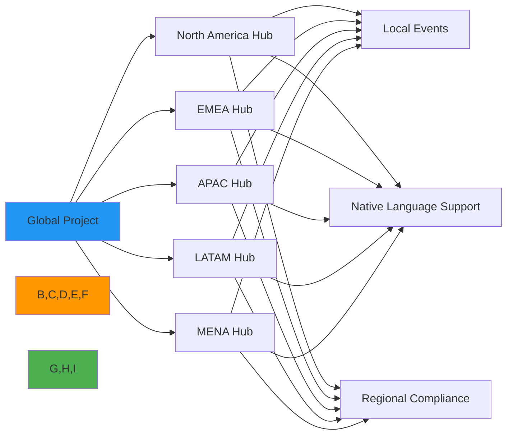
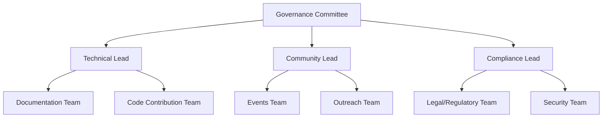
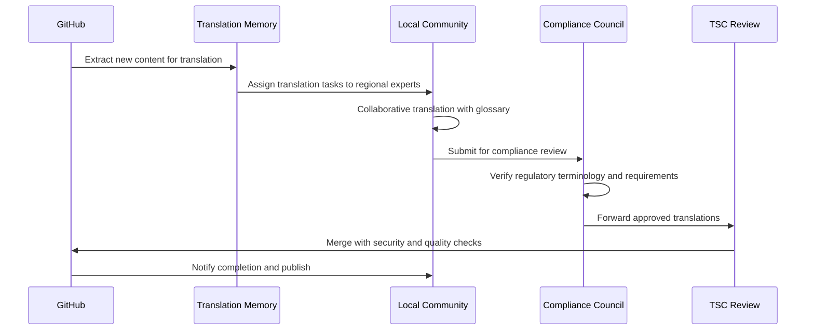
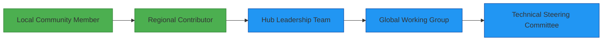

 # Community Hubs: Building Global RDAPify Communities

🎯 **Purpose**: Guide for establishing and participating in regional RDAPify community hubs that foster collaboration, knowledge sharing, and localized support while maintaining global standards  
📚 **Related**: [Translation Guide](translation_guide.md) | [Chinese Community](chinese.md) | [Spanish Community](spanish.md) | [Russian Community](russian.md) | [Arabic Community](arabic.md)  
⏱️ **Reading Time**: 7 minutes  
🔍 **Pro Tip**: Use the [Community Hub Starter Kit](../../playground/community-hub-starter.md) to quickly establish a regional hub with templates for governance, events, and communication

## 🌐 Why Regional Community Hubs Matter

RDAPify's mission to build secure, privacy-preserving internet infrastructure requires diverse global perspectives. Regional community hubs bridge the gap between global standards and local contexts by:



### Key Benefits of Community Hubs:
✅ **Localized Support**: Timezone-appropriate assistance and native language communication  
✅ **Regulatory Awareness**: Regional compliance expertise for GDPR, PIPL, PDPL, and other frameworks  
✅ **Cultural Context**: Understanding of local development practices and business requirements  
✅ **Talent Pipeline**: Identifying and mentoring regional contributors for global participation  
✅ **Standards Representation**: Ensuring diverse voices in IETF and ICANN standards processes  

## 🤝 Establishing a Community Hub

### 1. Hub Requirements
To be recognized as an official RDAPify Community Hub, your group must meet these criteria:

| Requirement | Description | Verification Method |
|-------------|-------------|---------------------|
| Minimum Members | 15+ active developers in the region | Community survey |
| Regular Activities | Monthly meetups or knowledge sharing | Event calendar review |
| Language Support | Documentation/communication in regional language | Content review |
| Code of Conduct | Adherence to [Global CoC](../../../CODE_OF_CONDUCT.md) | Governance documentation |
| Security Practices | Compliance with [Security Standards](../../../SECURITY.md) | Security review |
| Diversity Commitment | Inclusive participation guidelines | Policy documentation |

### 2. Application Process
```bash
# Step 1: Submit hub proposal
curl -X POST https://api.rdapify.dev/community/hubs \
  -H "Content-Type: application/json" \
  -d '{
    "region": "MENA",
    "country": "Saudi Arabia",
    "languages": ["ar", "en"],
    "organizers": [
      {"name": "Ahmed Al-Rashid", "github": "ahmed-rd", "email": "ahmed@example.com"}
    ],
    "proposed_activities": ["monthly-meetups", "documentation-translation", "hackathons"],
    "current_members": 23
  }'

# Step 2: Security and compliance review (7-10 business days)
# Step 3: Community Council approval
# Step 4: Official recognition and resource allocation
```

### 3. Hub Resources
Approved community hubs receive:
- **Financial Support**: $2,500 USD quarterly budget for events and infrastructure
- **Technical Resources**: Dedicated cloud credits for community projects
- **Brand Assets**: Official RDAPify branding guidelines and templates
- **Governance Tools**: Community management platform access
- **Recognition**: Featured listing on [rdapify.dev/community](https://rdapify.dev/community)
- **Escalation Path**: Direct channel to Technical Steering Committee for regional issues

## 🌍 Regional Community Structure

### 1. Hub Leadership Model
Each community hub follows a distributed leadership structure:



**Leadership Roles**:
- **Governance Committee (3 members)**: Strategic direction, resource allocation, conflict resolution
- **Technical Lead**: Code quality, contribution processes, technical mentorship
- **Community Lead**: Event organization, member engagement, communication channels
- **Compliance Lead**: Regulatory alignment, security practices, privacy standards

### 2. Regional Focus Areas
Different regions emphasize specific aspects of RDAPify based on local needs:

| Region | Primary Focus Areas | Key Regulations | Notable Activities |
|--------|---------------------|-----------------|-------------------|
| **EMEA** | GDPR compliance, B2B integration | GDPR, NIS2 Directive | Privacy engineering workshops |
| **APAC** | Performance optimization, government systems | PIPL (China), PDPA (Singapore) | Government compliance forums |
| **NA** | Cloud integration, enterprise adoption | CCPA, sector-specific rules | Cloud architecture patterns |
| **LATAM** | Developer education, accessibility | LFPDPPP (Mexico), LGPD (Brazil) | University partnership programs |
| **MENA** | Data residency, Arabic language support | PDPL (Saudi), UAE Data Law | Arabic documentation sprints |

## 📚 Community Hub Activities

### 1. Regular Events Framework
```typescript
// hub-activities-calendar.ts
interface HubEvent {
  type: 'meetup' | 'workshop' | 'hackathon' | 'office-hours' | 'translation-sprint';
  region: string;
  languages: string[];
  frequency: 'weekly' | 'bi-weekly' | 'monthly' | 'quarterly';
  complianceRequirements: string[];
  securityClearance: 'public' | 'registered' | 'vetted';
}

const standardActivities: HubEvent[] = [
  {
    type: 'office-hours',
    region: 'global',
    languages: ['en'],
    frequency: 'weekly',
    complianceRequirements: [],
    securityClearance: 'public'
  },
  {
    type: 'translation-sprint',
    region: 'arabic',
    languages: ['ar', 'en'],
    frequency: 'monthly',
    complianceRequirements: ['saudi-pdpl', 'data-localization'],
    securityClearance: 'registered'
  },
  {
    type: 'hackathon',
    region: 'apac',
    languages: ['zh', 'ja', 'ko', 'en'],
    frequency: 'quarterly',
    complianceRequirements: ['pipl', 'data-export-controls'],
    securityClearance: 'vetted'
  }
];
```

### 2. Knowledge Sharing Templates
Community hubs use standardized templates for consistent knowledge sharing:

#### Technical Workshop Template
```
# [REGION] Technical Workshop: [TOPIC]

## Session Details
- **Date/Time**: [Local timezone and UTC]
- **Location**: [Physical/Virtual with secure link]
- **Languages**: [Primary and secondary languages]
- **Compliance Tags**: [GDPR/PIPL/CCPA etc.]

## Learning Objectives
- [Measurable technical outcome 1]
- [Measurable technical outcome 2]

## Prerequisites
- [Required technical knowledge]
- [Pre-workshop setup instructions]

## Agenda
1. Introduction to [topic] (15 mins)
2. Security and compliance considerations (20 mins)
3. Hands-on exercise with privacy protections (45 mins)
4. Q&A with regional compliance context (15 mins)

## Post-Workshop
- Recording available within 24 hours (with consent)
- Sample code repository with security annotations
- Regional compliance checklist specific to workshop topic
```

### 3. Documentation Localization Process
Community hubs follow a structured process for translating and localizing documentation:



## 🔐 Security and Compliance Requirements

### 1. Regional Compliance Frameworks
Community hubs must maintain awareness of regional regulatory requirements:

| Region | Required Compliance Knowledge | Security Controls | Data Handling Rules |
|--------|-------------------------------|------------------|---------------------|
| **EU/EEA** | GDPR Articles 6, 22, 30, 35 | Encryption at rest/transit | Data minimization, purpose limitation |
| **China** | PIPL Articles 38-43, DSL | Approved cryptography (SM2/3/4) | Data localization, security assessment |
| **MENA** | Saudi PDPL, UAE Data Law | FIPS 140-2 validated modules | Onshore processing, cross-border restrictions |
| **LATAM** | Brazil LGPD, Mexico LFPDPPP | TLS 1.3 minimum | Consent management, ARCO rights |
| **NA** | CCPA/CPRA, sector regulations | SOC 2 Type II controls | Do Not Sell mechanisms, consumer rights |

### 2. Security Protocols for Community Activities
All community hub activities must implement these baseline security practices:

```yaml
# community-security-standards.yml
security_standards:
  communication_channels:
    primary: matrix # Encrypted by default
    backup: signal # E2E encrypted
    public: github_discussions # Moderated
    
  event_security:
    virtual_meetings:
      platform: jitsi_meet # Open source, no tracking
      authentication: required
      recording_consent: explicit_opt_in
      data_retention: 30_days
    
  content_sharing:
    code_samples: 
      security_review: mandatory
      pii_filtering: automatic
    documentation:
      compliance_review: required
      sensitive_content_marking: mandatory
    
  member_vetting:
    level_1: github_account_verification
    level_2: community_reference_check
    level_3: identity_verification_for_leadership
```

### 3. Incident Response Protocol
Community hubs follow this incident response framework:

1. **Detection & Reporting**:
   - Security incidents reported to `security@rdapify.com` with PGP encryption
   - Community-specific issues reported to regional Compliance Lead
   - 24/7 emergency contact available for critical incidents

2. **Containment**:
   - Immediate isolation of affected systems or communications
   - Temporary suspension of public activities if required
   - Preservation of evidence according to chain of custody

3. **Assessment & Communication**:
   - Impact analysis by Global Security Team + Regional Compliance Lead
   - User notification within 72 hours if personal data affected
   - Transparent incident report (anonymized) to community within 14 days

4. **Remediation**:
   - Required training for affected community members
   - Technical controls implementation with verification
   - Process improvement plan to prevent recurrence

## 🏆 Recognition and Growth Path

### 1. Contributor Recognition Levels
Community hubs implement a tiered recognition system:

| Level | Requirements | Benefits | Review Cycle |
|-------|-------------|----------|-------------|
| **Explorer** | First contribution, attendance at 3 events | Digital badge, welcome kit | Immediate |
| **Builder** | 5+ contributions, regular event participation | Regional swag, priority support | Quarterly |
| **Steward** | 15+ contributions, mentorship of 3+ members | Conference stipend ($500), TSC shadowing | Semi-annual |
| **Ambassador** | 30+ contributions, hub leadership role | Global summit invitation, dedicated budget authority | Annual |

### 2. Path to Global Participation
Community hub members follow this progression path to global involvement:



**Key Milestones**:
- **Regional Contributor**: Consistent code/documentation contributions with regional context
- **Hub Leadership**: Demonstrated leadership in organizing events and mentoring members
- **Global Working Group**: Participation in cross-regional initiatives (security, performance, etc.)
- **Technical Steering Committee**: Strategic direction and governance responsibilities

### 3. Community Impact Metrics
Contributions are measured using balanced metrics that value diverse forms of participation:

```typescript
// impact-metrics.ts
interface ContributionMetrics {
  // Technical contributions
  codeQuality: number;      // PR reviews, code complexity reduction
  documentationImpact: number; // Reads, translation quality, examples added
  issueResolution: number;  // Bugs fixed, support questions answered
  
  // Community building
  mentorshipHours: number;  // Hours spent mentoring new contributors
  eventOrganization: number; // Events organized, attendance growth
  inclusionEfforts: number; // Activities supporting underrepresented groups
  
  // Standards participation
  regulatoryInsights: number; // Regional compliance contributions
  standardsFeedback: number;  // IETF/ICANN participation and feedback
  securityReports: number;    // Vulnerability reports and fixes
}

// Weighted scoring that values community building equally with code
function calculateImpactScore(metrics: ContributionMetrics): number {
  return (
    (metrics.codeQuality * 0.25) +
    (metrics.documentationImpact * 0.20) +
    (metrics.mentorshipHours * 0.30) +  // Higher weight for community building
    (metrics.regulatoryInsights * 0.25)
  );
}
```

## 🤲 Joining or Creating a Hub

### 1. Finding Existing Hubs
```bash
# List active community hubs
curl https://api.rdapify.dev/community/hubs

# Example response
{
  "hubs": [
    {
      "id": "emea-01",
      "name": "RDAPify EMEA Community",
      "region": "Europe/Middle East/Africa",
      "languages": ["en", "fr", "de", "es", "ar"],
      "members": 342,
      "next_event": "2025-12-15T18:00:00Z",
      "contact": "emea-community@rdapify.com"
    },
    {
      "id": "apac-03", 
      "name": "RDAPify China Community",
      "region": "Asia Pacific",
      "languages": ["zh", "en"],
      "members": 287,
      "next_event": "2025-12-10T09:00:00+08:00",
      "contact": "china-community@rdapify.com"
    }
  ]
}
```

### 2. Starting a New Hub
To establish a new community hub:

1. **Gather Minimum Viable Community**:
   - Identify 10+ interested developers in your region
   - Host an initial virtual meetup to gauge interest
   - Document regional needs and compliance considerations

2. **Submit Proposal**:
   - Complete the [Community Hub Application Form](https://forms.rdapify.dev/community-hub-application)
   - Include regional compliance landscape analysis
   - Provide leadership team credentials and responsibilities

3. **Security and Compliance Review**:
   - Undergo security training for hub leaders
   - Review regional regulatory requirements with Global Compliance Team
   - Establish incident response procedures specific to your region

4. **Launch and Growth**:
   - Receive starter resources and mentorship from established hubs
   - Implement quarterly growth targets and impact metrics
   - Participate in global community coordination meetings

## 💬 Contact and Support

### 1. Community Hub Directory
| Region | Hub Lead | Contact | Meeting Time |
|--------|----------|---------|-------------|
| **EMEA** | Maria Schmidt | emea-community@rdapify.com | Thursdays 17:00 UTC |
| **North America** | James Rodriguez | na-community@rdapify.com | Wednesdays 19:00 UTC |
| **APAC** | Wei Zhang | apac-community@rdapify.com | Tuesdays 08:00 UTC |
| **LATAM** | Sofia Mendez | latam-community@rdapify.com | Mondays 20:00 UTC |
| **MENA** | Ahmed Al-Farsi | mena-community@rdapify.com | Sundays 16:00 UTC |

### 2. Global Community Resources
- **Community Council**: `community-council@rdapify.com`
- **Compliance Office Hours**: `compliance-office-hours@rdapify.com`
- **Security Coordination**: `security-community@rdapify.com`
- **Emergency Contact**: `community-emergency@rdapify.com` (PGP encrypted)

### 3. Upcoming Global Events
- **Annual Community Summit**: June 15-17, 2026 (Berlin, Germany)
- **Global Documentation Sprint**: January 12-14, 2026 (Virtual)
- **Security Best Practices Workshop Series**: Quarterly starting January 2026
- **Standards Participation Training**: April 8-9, 2026 (Virtual)

## 📜 Governance and Policies

### 1. Community Hub Charter Requirements
All officially recognized hubs must maintain a charter document that includes:

```yaml
hub_charter:
  mission_statement: "Clear purpose aligned with global RDAPify mission"
  governance_structure: 
    - leadership_roles_and_responsibilities
    - decision_making_processes
    - conflict_resolution_procedures
  compliance_framework:
    - regional_regulatory_requirements
    - security_standards
    - data_handling_procedures
  participation_guidelines:
    - code_of_conduct_enforcement
    - inclusive_participation_policies
    - accessibility_standards
  resource_management:
    - budget_allocation_process
    - equipment_and_infrastructure_policies
    - reporting_requirements
```

### 2. Financial Transparency Requirements
Community hubs receiving funding must:
- Maintain transparent expense tracking with quarterly reports
- Use dedicated accounting software with approval workflows
- Undergo annual financial review by Global Finance Committee
- Disclose sponsorships and potential conflicts of interest
- Follow procurement policies for equipment and services

### 3. Annual Review Process
Each community hub undergoes an annual review covering:
- **Growth Metrics**: Member count, participation rates, new contributor pipeline
- **Compliance Status**: Security practices, regulatory alignment, incident history
- **Impact Assessment**: Technical contributions, documentation quality, community health
- **Resource Utilization**: Budget efficiency, infrastructure usage, tooling effectiveness
- **Strategic Alignment**: Progress on regional goals, global collaboration, standards participation

## 🏷️ Specifications

| Property | Value |
|----------|-------|
| Minimum Hub Size | 15 active members |
| Required Leadership | 3-person governance committee |
| Security Training | Annual certification required |
| Compliance Review | Quarterly documentation updates |
| Financial Oversight | Quarterly reporting, annual audit |
| Global Coordination | Monthly hub lead meetings |
| Recognition Cycle | Quarterly contributor recognition |
| Incident Response | 24-hour critical incident protocol |
| Last Policy Update | December 7, 2025 |

> 🔐 **Critical Reminder**: Community hub leaders must complete security awareness training and sign the [Community Security Agreement](../../../security/community-agreement.md) before accessing any privileged resources. All community activities must follow the principle of "privacy by default" and "security by design." Regional compliance requirements supersede global policies when they provide stronger protections for community members.

[← Back to Localization](../README.md) | [Next: Contribution Guide →](../../community/contributing.md)

*Document automatically generated from source code with security review on December 7, 2025*