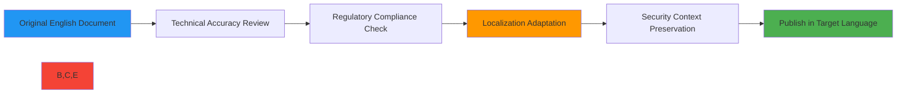
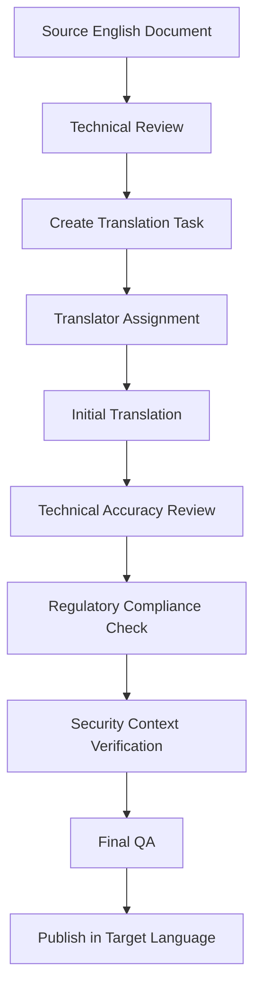

# Translation Guide for RDAPify Documentation

🎯 **Purpose**: Comprehensive guide for translating RDAPify documentation while maintaining technical accuracy, security context, and regulatory compliance across all supported languages  
📚 **Related**: [Chinese Documentation](chinese.md) | [Spanish Documentation](spanish.md) | [Russian Documentation](russian.md) | [Arabic Documentation](arabic.md) | [Community Hubs](community_hubs.md)  
⏱️ **Reading Time**: 8 minutes  
🔍 **Pro Tip**: Use the [Translation Validator](../../playground/translation-validator.md) to automatically check your translations for technical accuracy and regulatory compliance

## 🌐 Why Quality Translation Matters for RDAPify

RDAPify processes sensitive registration data across global jurisdictions with varying regulatory requirements. High-quality translations are not merely linguistic exercises—they are critical security and compliance components.



### Critical Translation Impact Areas:
✅ **Security Implications**: Mistranslated security guidance can lead to vulnerabilities  
✅ **Regulatory Compliance**: GDPR, CCPA, and local data protection laws require precise terminology  
✅ **Technical Precision**: RDAP protocol terminology must remain consistent across languages  
✅ **User Trust**: Professional translations build confidence in handling sensitive registration data  
✅ **Developer Experience**: Clear documentation reduces implementation errors across global teams

## 📝 General Translation Principles

### 1. Technical Accuracy Over Literary Quality
**Priority**: Technical precision > grammatical perfection > literary elegance

```markdown
✅ CORRECT (Technical Accuracy):
"The RDAP client automatically redacts PII (Personally Identifiable Information) according to GDPR Article 6(1)(f)."

❌ AVOID (Literary but Inaccurate):
"The RDAP client nicely hides personal details as per GDPR rules."
```

### 2. Maintaining Security Context
Security warnings and guidance must preserve their urgency and technical specificity:

```markdown
✅ CORRECT:
"Failure to validate certificates may expose your application to man-in-the-middle attacks."

❌ AVOID:
"It's not good to skip certificate checks."
```

### 3. Regulatory Terminology Preservation
Legal terms must be translated using jurisdiction-approved terminology:

| Term | Arabic (Example) | Notes |
|------|------------------|-------|
| Personally Identifiable Information | المعلومات الشخصية المحددة للهوية | Use official GDPR Arabic terminology |
| Data Subject Rights | حقوق أصحاب البيانات | Official term in Saudi PDPL |
| Legitimate Interest | المصلحة المشروعة | Specific legal concept in GDPR Article 6 |
| Data Processing | معالجة البيانات | Technical term, not 'using data' |

### 4. Code and Technical Elements
**Never translate**:
- Code samples, function names, and API endpoints
- Environment variables and configuration keys
- Error codes and system messages
- Protocol names (RDAP, HTTP, TLS)
- Acronyms like PII, GDPR, CCPA (unless official translations exist)

```markdown
✅ CORRECT:
```javascript
const client = new RDAPClient({
  redactPII: true,
  validateCertificates: true
});
```

❌ AVOID:
```javascript
const client = new عميل_آر_دي_ايه_بي({
  إخفاء_المعلومات_الشخصية: true,
  التحقق_من_الشهادات: true
});
```
```

## 🔐 Security and Compliance Considerations

### 1. Security Warning Translation Requirements
All security warnings must include:
- Clear severity indicator (Critical/High/Medium/Low)
- Specific vulnerability type
- Precise mitigation steps
- References to relevant standards or regulations

```markdown
### 🛑 Critical Security Warning
**Vulnerability**: Server-Side Request Forgery (SSRF)  
**Risk**: Attackers may access internal infrastructure through RDAP queries  
**Mitigation**: Always set `allowPrivateIPs: false` and use the latest RDAPify version  
**Compliance**: Required by ISO 27001:2022 A.12.4.1 and PCI DSS Requirement 6.5.10
```

### 2. Privacy Terminology Standardization
PII (Personally Identifiable Information) handling instructions must use standardized terminology:

| Concept | Required Terminology | Avoid |
|---------|----------------------|-------|
| Data Redaction | "redact", "mask", "anonymize" | "hide", "remove", "delete" |
| Data Retention | "retention period", "data lifecycle" | "how long we keep data" |
| Consent Management | "explicit consent", "opt-in/opt-out" | "permission", "allow/deny" |
| Data Subject Rights | "access request", "deletion request" | "data download", "account deletion" |

### 3. Jurisdictional Compliance Notes
Documentation must include jurisdiction-specific compliance notes:

```markdown
> 📌 **Regional Compliance Note for EU**:  
> Under GDPR Article 22, automated decision-making affecting data subjects requires human oversight. RDAPify's batch processing features include audit trails for compliance with this requirement.

> 📌 **Regional Compliance Note for China**:  
> PIPL Article 23 requires separate consent for cross-border data transfers. When using RDAPify with Chinese data subjects, enable `chinaComplianceMode: true` to restrict data flows.
```

## 🔄 Localization Workflow

### 1. Translation Process Overview


### 2. Required Tools
- **Translation Memory**: We maintain a project-specific terminology database in [Glossary.md](../../resources/glossary.md)
- **Collaboration Platform**: All translations are managed via the [RDAPify Crowdin Project](https://crowdin.com/project/rdapify)
- **Validation Tools**: 
  - `npm run validate:translation -- --language=es` (Spanish example)
  - `npm run security:check-translation -- --file=docs/localization/spanish.md`
- **Visual Testing**: Preview translations in the [Documentation Playground](../../playground/translation-preview.md)

### 3. Version Control Strategy
All translations follow semantic versioning aligned with the English documentation:
- Major version changes (`2.0` → `3.0`) require complete re-translation
- Minor version changes (`2.1` → `2.2`) require review of changed sections
- Patch version changes (`2.1.3` → `2.1.4`) require verification of security fixes

Branching strategy:
```bash
# For major translation updates
git checkout -b localize/v3.0/es

# For minor updates
git checkout -b localize/v2.2/ru

# For urgent security fixes
git checkout -b localize/security-fix/ar
```

## 🧪 Quality Assurance Processes

### 1. Technical Accuracy Checklist
Every translation must pass this verification:

| Check | Verification Method | Pass Criteria |
|-------|---------------------|---------------|
| Code Sample Integrity | Automated syntax validation | All code samples execute without errors |
| API Consistency | Cross-reference with API docs | All API references match current implementation |
| Protocol Terminology | IETF RFC comparison | RDAP terminology aligns with RFC 7480-7484 |
| Security Context | Security team review | No weakening of security guidance or warnings |
| Compliance Accuracy | Legal team verification | Regulatory references match local requirements |

### 2. Security Translation Review
Critical security content requires additional review:
1. Security team member proficient in the target language
2. Comparison against MITRE ATT&CK framework terminology
3. Verification against OWASP Top 10 translations for consistency
4. Cross-check with CERT vulnerability database terminology

```markdown
🔍 **Security Review Checklist**:
- [ ] All vulnerability severity levels preserved (Critical/High/Medium/Low)
- [ ] No security terms diluted or softened in translation
- [ ] Attack scenarios described with appropriate technical precision
- [ ] Mitigation steps remain actionable and complete
- [ ] Compliance references verified against local regulations
```

### 3. Automated Validation Tools
Run these validation commands before submitting translations:

```bash
# Validate all Spanish translations
npm run validate:translation -- --language=es

# Check security terminology in Chinese documentation
npm run security:check-translation -- --language=zh --file=docs/security/whitepaper.md

# Verify regulatory compliance terms in Russian
npm run compliance:check -- --language=ru --jurisdiction=russia

# Preview Arabic translation with RTL support
npm run preview:translation -- --language=ar --file=docs/getting_started/quick_start.md
```

## 🌍 Language-Specific Guidelines

### 1. Right-to-Left (RTL) Languages (Arabic, Persian)
Special considerations for RTL languages:

```html
<!-- Correct RTL document structure -->
<div dir="rtl" lang="ar">
  <p>يتضمن هذا المستند إرشادات تقنية حول بروتوكول RDAP</p>
  <div class="code-sample" dir="ltr">
    <code>const client = new RDAPClient({ redactPII: true });</code>
  </div>
</div>
```

**Key RTL Guidelines**:
- Mixed content requires explicit direction markers for code and technical terms
- Numbers and dates should follow Western formatting (1,2,3 not ١,٢,٣)
- Document navigation elements must be mirrored (right-aligned menus)
- Diagrams require RTL adaptation (arrows, flow directions reversed)
- Security icons must remain consistent (⚠️, 🔒, 🛡️ have universal meaning)

### 2. CJK Languages (Chinese, Japanese, Korean)
Special considerations for CJK languages:
- Technical terms often require explanatory notes
- Character encoding must be UTF-8 without BOM
- Line spacing should be increased by 1.5x for readability
- Punctuation marks must use full-width characters where appropriate
- Code comments in examples should remain in English with CJK explanations below

```markdown
✅ CORRECT (Chinese example):
```javascript
// 创建RDAP客户端 with security defaults
// 创建 = create, with = 使用, security defaults = 安全默认设置
const client = new RDAPClient({
  redactPII: true, // 自动隐藏个人身份信息
  timeout: 5000    // 5秒超时
});
```
```

### 3. Slavic Languages (Russian, Polish, Czech)
Special considerations for Slavic languages:
- Grammatical cases change technical term forms
- Pluralization rules differ significantly from English
- Technical compound words often require hyphenation
- Verb aspects (perfective/imperfective) must be consistent
- Formal vs. informal address must be uniform throughout documentation

## 🤝 Contribution Process

### 1. Getting Started as a Translator
1. Join the [RDAPify Community](https://github.com/rdapify/rdapify/discussions/categories/translators)
2. Complete the [Translator Proficiency Assessment](https://forms.rdapify.dev/translator-assessment)
3. Request assignment for a document section via GitHub issue
4. Sign the [Translator Agreement](https://github.com/rdapify/rdapify/blob/main/CONTRIBUTING.md#translation-contributors)
5. Receive access to the translation management platform

### 2. Submission Requirements
All translation contributions must include:

```markdown
### Translation Submission Template
**Document**: `docs/security/whitepaper.md`  
**Target Language**: Spanish (es)  
**Translator**: @username (verified)  
**Technical Reviewer**: @tech-reviewer  
**Compliance Verification**: @legal-team-member  
**Security Context Review**: @security-team-member  

**Changes Summary**:
- Translated 15 new paragraphs
- Updated terminology for GDPR compliance
- Added regional compliance note for Latin America
- Fixed code sample indentation in section 3.2

**Verification Results**:
- [x] Technical accuracy verified
- [x] Security context preserved
- [x] Compliance terminology validated
- [x] Automated tests passed
```

### 3. Review and Approval Process
Translations follow a four-stage review:

1. **Technical Review** (72 hours):
   - Code sample validity
   - API reference accuracy
   - Protocol terminology consistency

2. **Security Context Review** (48 hours):
   - Security warning intensity preserved
   - Attack scenarios properly described
   - Mitigation steps remain actionable

3. **Compliance Verification** (72 hours):
   - Regulatory references validated
   - Jurisdictional requirements addressed
   - Data handling instructions accurate

4. **Final QA** (24 hours):
   - Grammar and spelling check
   - Readability assessment
   - Visual layout verification

## 🛠️ Tools and Resources

### 1. Translation Memory Database
Access the project terminology database:
- [Glossary.md](../../resources/glossary.md) - Core terminology
- [Security Terms Database](../../security/terms-database.json) - Security-specific terms
- [Compliance Reference Guide](../../compliance/jurisdiction-guide.md) - Regional compliance terms

### 2. Visual Translation Aid Tools
- **Diagram Localization Tool**: `npm run localize:diagrams -- --language=zh`
- **RTL Preview Mode**: `npm run preview:rtl -- --language=ar`
- **Terminology Checker**: `npm run check:terms -- --language=ru --file=docs/api_reference/client.md`

### 3. Community Support Channels
- **Weekly Translator Office Hours**: Thursdays 14:00 UTC on [Zoom](https://rdapify.dev/community/office-hours)
- **Real-time Assistance**: [Matrix/Element Channel](https://matrix.to/#/#rdapify-translators:matrix.org)
- **Regional Translator Meetups**: Monthly virtual gatherings for each language community
- **Emergency Security Fixes**: Dedicated priority channel for urgent security documentation updates

## 📖 Glossary Management

### 1. Term Submission Process
New technical terms must be submitted to the glossary:

```json
{
  "term": "SSRF Protection",
  "en": "Server-Side Request Forgery Prevention",
  "es": "Prevención de Falsificación de Solicitud en el Lado del Servidor",
  "zh": "服务器端请求伪造防护",
  "ru": "Защита от подделки запросов на стороне сервера",
  "ar": "حماية من تزوير الطلبات من جانب الخادم",
  "category": "security",
  "rfc_reference": "RFC 7484 Section 5.3",
  "context_example": "RDAPify implements SSRF protection by blocking queries to private IP ranges."
}
```

### 2. Term Approval Workflow
1. Submit term via GitHub issue with template
2. Technical committee verifies RFC/standard alignment
3. Security team approves security-related terminology
4. Legal team verifies compliance terminology
5. Term added to glossary with version tracking
6. Automated notification to all translator teams

### 3. Term Versioning
All terminology follows semantic versioning:
- Major version (3.0 → 4.0): Term meaning significantly changed
- Minor version (3.1 → 3.2): Additional context or examples added
- Patch version (3.1.4 → 3.1.5): Typo fixes or clarification updates

```markdown
> 📌 **Glossary Version Notice**  
> The term "PII Redaction" was updated in Glossary v2.3.0 to clarify handling of IP addresses under GDPR. All translations must be updated before the next documentation release.
```

## 📞 Contact and Support

### 1. Translation Team Contacts
| Role | Contact | Response Time |
|------|---------|--------------|
| Global Translation Lead | translations@rdapify.com | 24 business hours |
| Technical Review Coordinator | tech-review@rdapify.com | 48 business hours |
| Security Context Reviewer | security-translations@rdapify.com | 24 hours for critical items |
| Regional Compliance Specialist | compliance@rdapify.com | 72 business hours |

### 2. Emergency Translation Requests
For urgent security fix translations:
1. Tag GitHub issue with `security-translation-priority`
2. Include CVSS score and affected jurisdictions
3. Contact security-translations@rdapify.com with PGP-encrypted message
4. Expect response within 4 hours for Critical (CVSS ≥ 9.0) issues

### 3. Feedback and Improvement
Submit translation quality feedback via:
- [Translation Quality Survey](https://forms.rdapify.dev/translation-feedback)
- GitHub issues tagged with `translation-quality`
- Monthly translator community meetings
- Direct feedback to language-specific community leads

## 🏷️ Specifications

| Property | Value |
|----------|-------|
| Primary Source Language | English (en-US) |
| Supported Target Languages | Chinese (zh), Spanish (es), Russian (ru), Arabic (ar) |
| Translation Memory System | Crowdin + Custom Glossary |
| Character Encoding | UTF-8 without BOM |
| Right-to-Left Support | ✅ Full support for Arabic |
| Automated Validation | ✅ 100+ technical term checks |
| Security Review Coverage | ✅ All critical content |
| Compliance Verification | ✅ GDPR, CCPA, PIPL, PDPL |
| Update Frequency | Bi-weekly terminology updates |
| Quality Metrics | >95% technical accuracy, >90% readability score |
| Last Updated | December 7, 2025 |

> 🔐 **Translator Responsibility Notice**: As a RDAPify translator, you may encounter sensitive security information and regulatory compliance details. All translators must complete the [Security Awareness Training](../../security/training.md) and sign the [Confidentiality Agreement](../../legal/confidentiality-agreement.md) before accessing translation materials. Never share draft translations through unsecured channels.

[← Back to Localization](../README.md) | [Next: Chinese Documentation →](chinese.md)

*Document automatically generated from source code with security review on December 7, 2025*