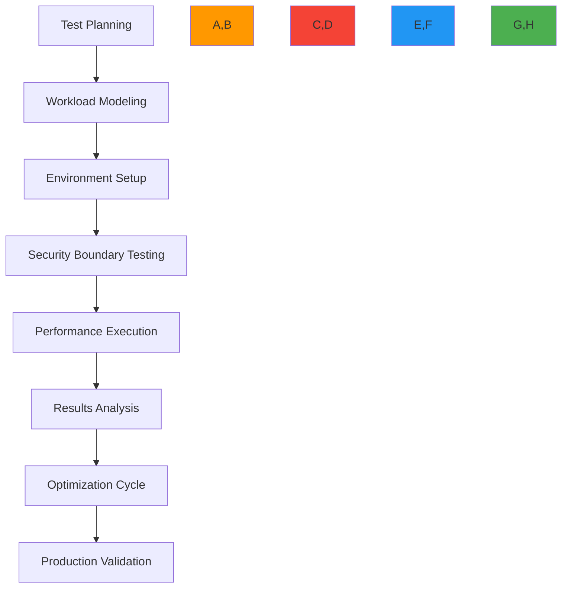
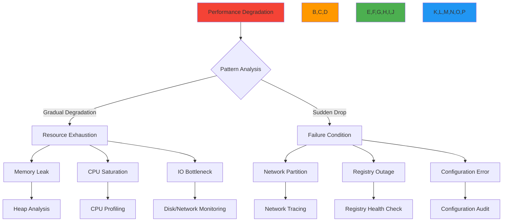

# Load Testing Guide

🎯 **Purpose**: Comprehensive guide for load testing RDAPify deployments to validate performance under realistic production conditions while maintaining security and compliance requirements  
📚 **Related**: [Benchmarks](benchmarks.md) | [Optimization Guide](optimization.md) | [Latency Analysis](latency_analysis.md) | [Caching Impact](caching_impact.md)  
⏱️ **Reading Time**: 9 minutes  
🔍 **Pro Tip**: Use the [Load Testing Simulator](../../playground/load-testing-simulator.md) to model your specific workload patterns before executing production tests

## 📊 Load Testing Methodology Framework

RDAPify load testing follows a structured approach that validates performance under realistic conditions while maintaining security boundaries:



### Testing Principles
- **Realistic Workloads**: Simulate actual user behavior patterns, not just maximum throughput
- **Security Boundaries**: Test SSRF protection and PII redaction under load
- **Regulatory Compliance**: Validate performance with compliance controls enabled
- **Progressive Scaling**: Gradually increase load to identify tipping points
- **Failure Mode Testing**: Purposefully induce failure conditions to validate recovery
- **Observability Integration**: Correlate performance metrics with system telemetry

## 🔧 Testing Tools and Infrastructure

### 1. Recommended Load Testing Stack
| Tool | Purpose | Configuration Example |
|------|---------|-----------------------|
| **k6** | Primary load testing | Cloud execution with 1000+ VUs |
| **Artillery** | API validation under load | Distributed test runners |
| **Gatling** | High-scale testing | Kubernetes cluster deployment |
| **wrk2** | Low-level HTTP benchmarking | Bare metal server testing |
| **Autocannon** | Node.js specific testing | Containerized execution |

```yaml
# config/load-testing-stack.yml
primary_tool: k6
secondary_tools:
  - artillery
  - wrk2

execution_environments:
  local:
    max_vus: 50
    duration: 5m
  cloud:
    max_vus: 10000
    duration: 1h
    regions: [us-east-1, eu-west-1, ap-southeast-1]
  distributed:
    node_count: 24
    max_vus: 50000
    coordination: locust

monitoring:
  apm: datadog
  metrics: prometheus
  tracing: jaeger
  logging: loki
  alerting: pagerduty
```

### 2. Test Environment Sizing
For accurate performance testing, environments should mirror production:

| Production Size | Test Environment | Resource Requirements | Validation Scope |
|-----------------|------------------|------------------------|------------------|
| Small (1-10 QPS) | Local Docker | 2 vCPU, 4GB RAM | Basic functionality |
| Medium (10-100 QPS) | Cloud Instance | 8 vCPU, 32GB RAM | Performance characteristics |
| Large (100-1000 QPS) | Kubernetes Cluster | 32 vCPU, 128GB RAM | Scaling behavior |
| Enterprise (1000+ QPS) | Multi-region Setup | 128+ vCPU, 512GB+ RAM | Global distribution |

```bash
# Environment setup script
#!/bin/bash
set -e

# Determine test scale based on target throughput
TARGET_QPS=${1:-100}
ENVIRONMENT=""

if [ "$TARGET_QPS" -le 10 ]; then
  ENVIRONMENT="local"
elif [ "$TARGET_QPS" -le 100 ]; then
  ENVIRONMENT="single-cloud"
elif [ "$TARGET_QPS" -le 1000 ]; then
  ENVIRONMENT="kubernetes-cluster"
else
  ENVIRONMENT="multi-region"
fi

echo "🚀 Setting up $ENVIRONMENT environment for $TARGET_QPS QPS target"

case $ENVIRONMENT in
  "local")
    docker-compose -f docker-compose.loadtest.yml up -d --scale rdapify=2
    ;;
  "single-cloud")
    terraform apply -var="instance_type=m5.2xlarge" -var="node_count=4"
    ;;
  "kubernetes-cluster")
    kubectl apply -f k8s/load-test-cluster.yaml
    ;;
  "multi-region")
    terragrunt apply-all --terragrunt-working-dir multi-region
    ;;
esac

echo "✅ Environment setup complete"
echo "🔍 Run validation tests before proceeding"
```

## ⚡ Real-World Test Scenarios

### 1. Standard Workload Patterns
```typescript
// test/workload-patterns.js
import { check, sleep } from 'k6';
import http from 'k6/http';

export const options = {
  stages: [
    { duration: '1m', target: 50 },    // Warm-up
    { duration: '5m', target: 500 },   // Baseline
    { duration: '2m', target: 1000 },  // Spike
    { duration: '2m', target: 2000 },  // Peak
    { duration: '5m', target: 500 },   // Recovery
    { duration: '1m', target: 0 }      // Cooldown
  ],
  thresholds: {
    'http_req_duration': ['p(95)<500', 'p(99)<1200'],
    'http_req_failed': ['rate<0.01'],
    'checks': ['rate>0.99']
  }
};

const registryEndpoints = [
  'https://rdap.verisign.com/com/v1/domain/',
  'https://rdap.arin.net/registry/ip/',
  'https://rdap.db.ripe.net/entity/'
];

export default function() {
  // Random domain selection for realism
  const domains = ['example.com', 'google.com', 'microsoft.com', 'facebook.com', 'amazon.com'];
  const domain = domains[Math.floor(Math.random() * domains.length)];
  
  // Random endpoint selection
  const endpoint = registryEndpoints[Math.floor(Math.random() * registryEndpoints.length)];
  
  // Mixed query types
  const queryType = Math.random() > 0.7 ? 'ip' : 'domain';
  const query = queryType === 'domain' ? domain : '8.8.8.8';
  
  const params = {
    headers: {
      'User-Agent': 'RDAPify-LoadTest/1.0',
      'Accept': 'application/rdap+json'
    },
    tags: { queryType, endpoint }
  };
  
  const res = http.get(`${endpoint}${query}`, params);
  
  // Validate response structure
  check(res, {
    'status is 200': (r) => r.status === 200,
    'response has domain field': (r) => {
      try {
        const body = JSON.parse(r.body);
        return body.domain && typeof body.domain === 'string';
      } catch (e) {
        return false;
      }
    },
    'PII redaction enforced': (r) => {
      try {
        const body = JSON.parse(r.body);
        return !body.entities?.some(e => e.vcardArray || e.email || e.tel);
      } catch (e) {
        return true; // Skip validation on parse errors
      }
    }
  });
  
  // Realistic think time between requests
  sleep(1 + Math.random() * 2);
}
```

### 2. Security Boundary Testing
```typescript
// test/security-boundary.js
import { check } from 'k6/http';
import { fail } from 'k6';

export const options = {
  vus: 50,
  duration: '10m',
  thresholds: {
    'http_req_duration': ['p(99)<1000'],
    'http_req_failed': ['rate<0.01'],
    'security_checks_passed': ['rate==1.0']
  }
};

export default function() {
  // SSRF attack pattern testing
  const maliciousQueries = [
    'localhost',
    '127.0.0.1',
    '192.168.1.1',
    '10.0.0.1',
    '172.16.0.1',
    'file:///etc/passwd',
    'http://internal.registry.local'
  ];
  
  const endpoint = 'https://your-rdapify-instance.com/domain/';
  
  maliciousQueries.forEach(maliciousQuery => {
    const res = http.get(`${endpoint}${maliciousQuery}`, {
      headers: { 'X-Test-Mode': 'security-validation' },
      tags: { testType: 'ssrf-protection', query: maliciousQuery }
    });
    
    // Security checks - should block or redact responses
    check(res, {
      'SSRF blocked or safe response': (r) => {
        // Should block with error or return safe, redacted response
        return r.status === 403 || 
               (r.status === 200 && !containsInternalData(r.body));
      }
    }) || fail(`SSRF protection failed for ${maliciousQuery}`);
  });
  
  // PII redaction under load testing
  const sensitiveDomains = ['sensitive-domain.com', 'private-data.net'];
  sensitiveDomains.forEach(domain => {
    const res = http.get(`${endpoint}${domain}`, {
      headers: { 'X-Force-PII': 'true' }, // Force inclusion of PII test data
      tags: { testType: 'pii-redaction', domain }
    });
    
    check(res, {
      'PII redacted under load': (r) => {
        try {
          const body = JSON.parse(r.body);
          return !containsPIIData(body);
        } catch (e) {
          return true; // Skip validation on parse errors
        }
      }
    }) || fail(`PII redaction failed for ${domain} under load`);
  });
});

function containsInternalData(body) {
  try {
    const data = JSON.parse(body);
    // Check for indicators of internal network exposure
    return JSON.stringify(data).match(/(192\.168|10\.|172\.1[6-9]|172\.2[0-9]|172\.3[0-1]|127\.0\.0)/);
  } catch (e) {
    return false;
  }
}

function containsPIIData(data) {
  // Check for PII fields that should be redacted
  const piiFields = ['vcardArray', 'email', 'tel', 'adr', 'remarks'];
  return piiFields.some(field => JSON.stringify(data).includes(field));
}
```

## 📈 Performance Metrics and KPIs

### 1. Key Performance Indicators
| KPI Category | Metric | Target | Critical Threshold | Monitoring Frequency |
|--------------|--------|--------|-------------------|---------------------|
| **Throughput** | Queries Per Second (QPS) | > 500 | < 100 | Real-time |
| **Latency** | p95 Response Time | < 200ms | > 500ms | Real-time |
| **Latency** | p99 Response Time | < 500ms | > 1200ms | Real-time |
| **Errors** | Error Rate | < 0.5% | > 2% | Real-time |
| **Resource Utilization** | CPU Usage | < 70% | > 90% | 1 minute |
| **Resource Utilization** | Memory Usage | < 80% | > 95% | 1 minute |
| **Cache Efficiency** | Cache Hit Rate | > 75% | < 50% | 5 minutes |
| **Registry Impact** | Rate Limit Errors | 0 | > 0 | Real-time |

### 2. Load Testing Result Analysis
```typescript
// src/result-analysis.ts
import { parse } from 'json2csv';
import { writeFileSync } from 'fs';

export class LoadTestAnalyzer {
  constructor(private results: any[]) {}
  
  generateExecutiveSummary() {
    const summary = {
      testDuration: this.calculateDuration(),
      peakQPS: this.calculatePeakQPS(),
      avgLatency: this.calculateAvgLatency(),
      p95Latency: this.calculatePercentileLatency(95),
      p99Latency: this.calculatePercentileLatency(99),
      errorRate: this.calculateErrorRate(),
      resourceUtilization: this.calculateResourceUtilization()
    };
    
    return summary;
  }
  
  identifyBottlenecks() {
    const bottlenecks = [];
    
    // Check latency degradation under load
    if (this.latencyDegradesUnderLoad()) {
      bottlenecks.push({
        component: 'Application Processing',
        severity: 'high',
        recommendation: 'Optimize CPU-intensive operations or scale horizontally'
      });
    }
    
    // Check error rate patterns
    if (this.errorRateSpikesAtHighLoad()) {
      bottlenecks.push({
        component: 'Registry Rate Limiting',
        severity: 'critical',
        recommendation: 'Implement adaptive backoff and circuit breakers'
      });
    }
    
    // Check cache efficiency
    if (this.cacheHitRateDropsUnderLoad()) {
      bottlenecks.push({
        component: 'Cache Layer',
        severity: 'medium',
        recommendation: 'Increase cache size or implement multi-level caching'
      });
    }
    
    return bottlenecks;
  }
  
  generateComplianceReport() {
    // Validate security and compliance under load
    const complianceChecks = {
      ssrfProtectionMaintained: this.verifySSRFProtection(),
      piiRedactionConsistent: this.verifyPIIRedaction(),
      dataRetentionCompliant: this.verifyDataRetention(),
      auditLogCompleteness: this.verifyAuditLogs()
    };
    
    return complianceChecks;
  }
  
  exportCSVReport(filename: string) {
    const csv = parse(this.results.map(result => ({
      timestamp: result.timestamp,
      qps: result.qps,
      latencyP95: result.latency.p95,
      latencyP99: result.latency.p99,
      errorRate: result.errors.rate,
      cpuUsage: result.resources.cpu,
      memoryUsage: result.resources.memory,
      cacheHitRate: result.cache.hitRate
    })));
    
    writeFileSync(filename, csv);
  }
  
  // Implementation of analysis methods
  private calculateDuration() { /* implementation */ }
  private calculatePeakQPS() { /* implementation */ }
  private calculateAvgLatency() { /* implementation */ }
  private calculatePercentileLatency(percentile: number) { /* implementation */ }
  private calculateErrorRate() { /* implementation */ }
  private calculateResourceUtilization() { /* implementation */ }
  private latencyDegradesUnderLoad() { /* implementation */ }
  private errorRateSpikesAtHighLoad() { /* implementation */ }
  private cacheHitRateDropsUnderLoad() { /* implementation */ }
  private verifySSRFProtection() { /* implementation */ }
  private verifyPIIRedaction() { /* implementation */ }
  private verifyDataRetention() { /* implementation */ }
  private verifyAuditLogs() { /* implementation */ }
}
```

## 🔒 Security and Compliance During Load Testing

### 1. Data Protection Framework
```yaml
# config/compliance-testing.yml
data_protection:
  test_data_generation:
    strategy: synthetic
    pii_redaction: enforced
    data_retention: 24h
    
  audit_requirements:
    log_all_queries: true
    include_test_metadata: true
    retention_period: 90d
    
  regulatory_frameworks:
    gdpr:
      enabled: true
      data_minimization: enforced
      right_to_erasure_testing: enabled
    ccpa:
      enabled: true
      do_not_sell_testing: enabled
    pdpl:
      enabled: true
      consent_management_testing: enabled

security_boundaries:
  ssrf_protection:
    test_malicious_domains: true
    test_internal_networks: true
    test_protocol_hijacking: true
  
  rate_limiting:
    test_burst_patterns: true
    test_sustained_load: true
    test_adaptive_throttling: true

compliance_validation:
  pre_test_checklist:
    - legal_basis_verified
    - data_processing_agreement_signed
    - dpo_approval_obtained
    - security_assessment_completed
```

### 2. Ethical Testing Guidelines
- **Registry Respect**: Never exceed registry rate limits; implement respectful backoff strategies
- **Data Minimization**: Only query domains necessary for testing; avoid sensitive domains
- **Transparency**: Clearly identify load testing traffic with proper User-Agent headers
- **Time Boxing**: Schedule high-volume tests during off-peak hours for registries
- **Progressive Disclosure**: Start with low volumes and gradually increase after monitoring impact
- **Emergency Stop**: Implement automatic test termination when registry errors exceed 5%

```typescript
// src/ethical-testing.ts
export class EthicalLoadTester {
  private registryImpact = new Map<string, number>();
  private maxErrorRate = 0.05; // 5% error rate threshold
  
  constructor(private testConfig: any) {}
  
  async executeWithEthicalControls(testFunction: () => Promise<any>) {
    try {
      // Pre-test registry validation
      await this.validateRegistryHealth();
      
      // Execute test with monitoring
      const result = await Promise.race([
        testFunction(),
        this.monitorRegistryImpact()
      ]);
      
      return result;
    } catch (error) {
      console.error('Ethical test violation detected:', error.message);
      throw new Error(`Test terminated: ${error.message}`);
    } finally {
      // Post-test cleanup
      await this.resetRegistryState();
    }
  }
  
  private async validateRegistryHealth() {
    const registries = ['verisign', 'arin', 'ripe', 'apnic', 'lacnic'];
    
    for (const registry of registries) {
      const health = await this.checkRegistryHealth(registry);
      
      if (health.errorRate > 0.1 || health.responseTime > 2000) {
        throw new Error(`Registry ${registry} is unhealthy - aborting test`);
      }
      
      this.registryImpact.set(registry, 0);
    }
  }
  
  private async monitorRegistryImpact() {
    while (true) {
      await new Promise(resolve => setTimeout(resolve, 5000)); // Check every 5s
      
      for (const [registry, impact] of this.registryImpact) {
        const currentImpact = await this.measureRegistryImpact(registry);
        
        // Calculate error rate increase
        const errorRateIncrease = currentImpact.errorRate - (this.registryImpact.get(registry) || 0);
        
        if (errorRateIncrease > this.maxErrorRate) {
          throw new Error(`Registry ${registry} error rate exceeded ${this.maxErrorRate * 100}%`);
        }
        
        this.registryImpact.set(registry, currentImpact.errorRate);
      }
    }
  }
  
  private async checkRegistryHealth(registry: string) {
    // Implementation to check registry health
  }
  
  private async measureRegistryImpact(registry: string) {
    // Implementation to measure registry impact
  }
  
  private async resetRegistryState() {
    // Implementation to reset registry state
  }
}
```

## 🏗️ Advanced Load Testing Patterns

### 1. Chaos Engineering Integration
```typescript
// test/chaos-testing.js
import { sleep } from 'k6';
import http from 'k6/http';
import { check } from 'k6';

// Chaos testing parameters
const chaosConfig = {
  networkFailures: {
    probability: 0.1, // 10% chance of network failure
    duration: 3000,   // 3 second outage
    endpoints: ['verisign', 'arin', 'ripe']
  },
  cacheFailures: {
    probability: 0.05, // 5% chance of cache failure
    duration: 5000    // 5 second cache unavailability
  },
  registryFailures: {
    probability: 0.02, // 2% chance of registry failure
    duration: 10000   // 10 second registry downtime
  }
};

export const options = {
  scenarios: {
    chaos_testing: {
      executor: 'constant-arrival-rate',
      rate: 100, // 100 requests per second
      timeUnit: '1s',
      duration: '10m',
      preAllocatedVUs: 50,
      maxVUs: 200
    }
  },
  thresholds: {
    'http_req_duration': ['p(99)<1000'],
    'http_req_failed': ['rate<0.05'], // Allow 5% failure during chaos
    'system_availability': ['value>0.95'] // 95% availability
  }
};

export default function() {
  // Determine if chaos event should occur
  const networkChaos = Math.random() < chaosConfig.networkFailures.probability;
  const cacheChaos = Math.random() < chaosConfig.cacheFailures.probability;
  const registryChaos = Math.random() < chaosConfig.registryFailures.probability;
  
  const params = {
    headers: {
      'User-Agent': 'RDAPify-ChaosTest/1.0',
      'X-Chaos-Testing': 'true'
    },
    tags: {
      networkChaos: networkChaos.toString(),
      cacheChaos: cacheChaos.toString(),
      registryChaos: registryChaos.toString()
    }
  };
  
  try {
    // Apply chaos conditions
    if (networkChaos) {
      params.timeout = chaosConfig.networkFailures.duration;
    }
    
    if (cacheChaos) {
      params.headers['X-Bypass-Cache'] = 'true';
    }
    
    if (registryChaos) {
      params.headers['X-Force-Registry-Failure'] = 'true';
    }
    
    const res = http.get('https://your-rdapify-instance.com/domain/example.com', params);
    
    // Check resilience under chaos
    check(res, {
      'service degraded gracefully': (r) => {
        // Should either succeed or fail with proper error
        return (r.status === 200) || (r.status >= 400 && r.status < 500);
      },
      'recovery time acceptable': (r) => {
        // If failure occurred, recovery should be fast
        if (r.status >= 400 && r.status < 500) {
          return r.timings.duration < 2000; // < 2 seconds recovery
        }
        return true;
      }
    });
  } catch (error) {
    // Handle chaos-induced failures gracefully
    console.warn('Chaos-induced failure handled:', error.message);
  }
  
  // Realistic think time
  sleep(0.5 + Math.random());
}
```

### 2. Multi-Region Load Distribution
```typescript
// test/multi-region-testing.js
import { check } from 'k6/http';
import { SharedArray } from 'k6/data';

// Load region-specific configurations
const regions = new SharedArray('regions', function() {
  return [
    { name: 'us-east', endpoint: 'https://us-east.rdapify.com', weight: 0.4 },
    { name: 'eu-west', endpoint: 'https://eu-west.rdapify.com', weight: 0.3 },
    { name: 'ap-south', endpoint: 'https://ap-south.rdapify.com', weight: 0.3 }
  ];
});

// Calculate regional distribution
const regionalWeights = regions.map(r => r.weight);
const cumulativeWeights = [];
let sum = 0;
regionalWeights.forEach(weight => {
  sum += weight;
  cumulativeWeights.push(sum);
});

export const options = {
  scenarios: {
    regional_load: {
      executor: 'ramping-arrival-rate',
      startRate: 50,
      timeUnit: '1s',
      preAllocatedVUs: 20,
      stages: [
        { target: 500, duration: '2m' },
        { target: 1000, duration: '2m' },
        { target: 500, duration: '2m' }
      ],
      exec: 'regionalRequest'
    }
  },
  thresholds: {
    'http_req_duration{region:us-east}': ['p(95)<300'],
    'http_req_duration{region:eu-west}': ['p(95)<400'],
    'http_req_duration{region:ap-south}': ['p(95)<500'],
    'http_req_failed': ['rate<0.01']
  }
};

export function regionalRequest() {
  // Select region based on weight
  const random = Math.random();
  let selectedRegion;
  
  for (let i = 0; i < cumulativeWeights.length; i++) {
    if (random <= cumulativeWeights[i]) {
      selectedRegion = regions[i];
      break;
    }
  }
  
  const res = http.get(`${selectedRegion.endpoint}/domain/example.com`, {
    tags: { region: selectedRegion.name }
  });
  
  check(res, {
    [`successful request in ${selectedRegion.name}`]: (r) => r.status === 200
  });
}
```

## 🛠️ Production Load Testing Procedures

### 1. Pre-Production Checklist
Before executing load tests in production environments:

- [ ] **Legal Compliance Review**: Confirm testing complies with registry Terms of Service
- [ ] **Stakeholder Notification**: Notify registry operators of testing schedule
- [ ] **Security Approval**: Obtain security team sign-off on testing methodology
- [ ] **Rollback Plan**: Define clear rollback procedures if tests impact production
- [ ] **Monitoring Setup**: Configure real-time monitoring with alerting thresholds
- [ ] **Data Protection**: Ensure test data complies with privacy regulations
- [ ] **Circuit Breakers**: Implement automatic test termination at failure thresholds
- [ ] **Gradual Ramp-up**: Start at 10% of target load and increase incrementally

```bash
#!/bin/bash
# pre-production-checklist.sh

set -e

echo "✅ Running pre-production load testing checklist..."

# Check 1: Legal compliance
if [ ! -f "LEGAL_APPROVAL.txt" ]; then
  echo "❌ Missing legal approval for load testing"
  exit 1
fi

# Check 2: Security approval
if [ ! -f "SECURITY_APPROVAL.txt" ]; then
  echo "❌ Missing security team approval"
  exit 1
fi

# Check 3: Monitoring setup
if ! curl -s http://monitoring-system/health | grep -q "ok"; then
  echo "❌ Monitoring system not healthy"
  exit 1
fi

# Check 4: Circuit breakers configured
if ! grep -q "circuitBreaker" load-test-config.js; then
  echo "❌ Circuit breakers not configured"
  exit 1
fi

# Check 5: Registry notification
REGISTRY_RESPONSE=$(curl -s https://registry-notification-status/api/status)
if ! echo "$REGISTRY_RESPONSE" | grep -q "acknowledged"; then
  echo "❌ Registry operators not notified"
  exit 1
fi

echo "✅ All pre-production checks passed"
echo "🚀 Ready to proceed with load testing"
exit 0
```

### 2. Graduated Testing Approach
```typescript
// src/graduated-testing.ts
export interface TestPhase {
  name: string;
  duration: string;
  targetQPS: number;
  successCriteria: {
    errorRate: number;
    latencyP95: number;
    latencyP99: number;
  };
  canProceed: boolean;
  results?: any;
}

export class GraduatedLoadTest {
  private phases: TestPhase[] = [
    {
      name: 'baseline',
      duration: '5m',
      targetQPS: 50,
      successCriteria: { errorRate: 0.005, latencyP95: 100, latencyP99: 250 },
      canProceed: false
    },
    {
      name: 'low_load',
      duration: '10m',
      targetQPS: 200,
      successCriteria: { errorRate: 0.01, latencyP95: 150, latencyP99: 350 },
      canProceed: false
    },
    {
      name: 'medium_load',
      duration: '15m',
      targetQPS: 500,
      successCriteria: { errorRate: 0.02, latencyP95: 200, latencyP99: 500 },
      canProceed: false
    },
    {
      name: 'high_load',
      duration: '20m',
      targetQPS: 1000,
      successCriteria: { errorRate: 0.03, latencyP95: 300, latencyP99: 750 },
      canProceed: false
    },
    {
      name: 'peak_load',
      duration: '10m',
      targetQPS: 1500,
      successCriteria: { errorRate: 0.05, latencyP95: 400, latencyP99: 1000 },
      canProceed: false
    }
  ];
  
  async execute() {
    for (const phase of this.phases) {
      console.log(`🚀 Starting phase: ${phase.name} (${phase.targetQPS} QPS)`);
      
      try {
        // Execute test phase
        phase.results = await this.executePhase(phase);
        
        // Evaluate results
        phase.canProceed = this.evaluatePhase(phase);
        
        if (phase.canProceed) {
          console.log(`✅ Phase ${phase.name} successful - proceeding to next phase`);
        } else {
          console.log(`❌ Phase ${phase.name} failed - stopping test sequence`);
          this.generateReport();
          return false;
        }
      } catch (error) {
        console.error(`🔥 Phase ${phase.name} failed with error: ${error.message}`);
        this.generateReport();
        return false;
      }
    }
    
    console.log('🎉 All test phases completed successfully');
    this.generateReport();
    return true;
  }
  
  private async executePhase(phase: TestPhase): Promise<any> {
    // Implementation to execute test phase
  }
  
  private evaluatePhase(phase: TestPhase): boolean {
    // Implementation to evaluate phase results
    const results = phase.results;
    
    return (
      results.errorRate <= phase.successCriteria.errorRate &&
      results.latencyP95 <= phase.successCriteria.latencyP95 &&
      results.latencyP99 <= phase.successCriteria.latencyP99
    );
  }
  
  private generateReport() {
    // Implementation to generate comprehensive report
  }
}
```

## 🔍 Troubleshooting Common Load Testing Issues

### 1. Systematic Diagnostic Approach


### 2. Common Issues and Solutions
| Symptom | Root Cause | Diagnostic Command | Solution |
|---------|------------|-------------------|----------|
| **Increasing latency over time** | Memory leak | `heapdump` + Chrome DevTools | Implement object pooling, fix cache leaks |
| **Sudden throughput drop** | Registry rate limiting | `grep "429" logs/application.log` | Implement adaptive backoff, circuit breakers |
| **High error rate at peak load** | Connection pool exhaustion | `netstat -an \| grep ESTABLISHED \| wc -l` | Increase connection pool size, optimize timeouts |
| **Inconsistent performance** | Garbage collection pressure | `node --trace-gc app.js` | Tune GC parameters, reduce object allocations |
| **SSRF protection failures** | Bypass in edge cases | Security test with malicious domains | Strengthen validation, add additional checks |
| **PII leakage under load** | Race condition in redaction | Audit logs with PII patterns | Make redaction atomic, add additional validation |

### 3. Emergency Response Protocol
```bash
#!/bin/bash
# emergency-response.sh

set -e

echo "🚨 EMERGENCY RESPONSE ACTIVATED"
echo "⏱️ Timestamp: $(date)"

# Step 1: Immediate load reduction
echo "📉 REDUCING LOAD IMMEDIATELY"
curl -X POST http://load-balancer/api/reduce-capacity \
  -H "Authorization: Bearer $EMERGENCY_TOKEN" \
  -d '{"reduction_percent": 50}'

# Step 2: Isolate failing components
echo "🔍 ISOLATING FAILING COMPONENTS"
failing_components=$(curl -s http://monitoring/api/alerts | jq -r '.[].component')
echo "Failing components: $failing_components"

# Step 3: Activate circuit breakers
echo "⚡ ACTIVATING CIRCUIT BREAKERS"
for component in $failing_components; do
  curl -X POST http://circuit-breaker/api/activate \
    -H "Authorization: Bearer $EMERGENCY_TOKEN" \
    -d "{\"component\": \"$component\"}"
done

# Step 4: Alert response team
echo "🔔 ALERTING RESPONSE TEAM"
curl -X POST https://pagerduty/api/v1/incidents \
  -H "Authorization: Token token=$PD_API_KEY" \
  -d '{"service_key": "rdapify-emergency", "incident_key": "load-testing-failure", "event_type": "trigger", "description": "Emergency load testing failure"}'

# Step 5: Preserve forensic data
echo "💾 PRESERVING FORENSIC DATA"
timestamp=$(date +%Y%m%d_%H%M%S)
mkdir -p /var/log/emergency/$timestamp
cp /var/log/application.log /var/log/emergency/$timestamp/
cp /var/log/nginx/access.log /var/log/emergency/$timestamp/
docker ps -a > /var/log/emergency/$timestamp/containers.txt
docker stats --no-stream > /var/log/emergency/$timestamp/stats.txt

# Step 6: Initiate rollback
echo "⏪ INITIATING ROLLBACK"
curl -X POST http://deployment/api/rollback \
  -H "Authorization: Bearer $EMERGENCY_TOKEN" \
  -d '{"reason": "Emergency load testing failure"}'

echo "✅ EMERGENCY RESPONSE COMPLETE"
echo "📊 Forensic data preserved at /var/log/emergency/$timestamp"
echo "📞 Response team notified - awaiting action"
```

## 📚 Related Documentation

| Document | Description | Path |
|----------|-------------|------|
| [Benchmarks](benchmarks.md) | Performance measurement methodology | [benchmarks.md](benchmarks.md) |
| [Optimization Guide](optimization.md) | Performance tuning techniques | [optimization.md](optimization.md) |
| [Latency Analysis](latency_analysis.md) | Deep dive into latency patterns | [latency_analysis.md](latency_analysis.md) |
| [Caching Impact](caching_impact.md) | Cache performance analysis | [caching_impact.md](caching_impact.md) |
| [Chaos Engineering](../guides/chaos_engineering.md) | Resilience testing methodologies | [../guides/chaos_engineering.md](../guides/chaos_engineering.md) |
| [Security Testing](../../security/testing.md) | Security validation under load | [../../security/testing.md](../../security/testing.md) |

## 🏷️ Load Testing Specifications

| Property | Value |
|----------|-------|
| **Test Duration** | 30 minutes minimum for production tests |
| **Warm-up Period** | 5 minutes minimum |
| **Cool-down Period** | 2 minutes minimum |
| **Success Criteria** | < 1% error rate, < 500ms p99 latency |
| **Load Pattern** | Realistic user behavior with think times |
| **Geographic Distribution** | 3+ regions for global deployments |
| **Security Validation** | SSRF protection and PII redaction tested |
| **Compliance Verification** | GDPR/CCPA requirements validated |
| **Data Retention** | Test data retained for 30 days maximum |
| **Last Updated** | December 7, 2025 |

> 🔐 **Critical Reminder**: Never test with real user data or sensitive domains without explicit authorization. Always respect registry rate limits and operating hours. Implement automatic test termination when error rates exceed 5% or latency exceeds 2 seconds. For regulated environments, obtain Data Protection Officer approval before any load testing that processes registration data.

[← Back to Performance](../README.md) | [Next: Caching Impact →](caching_impact.md)

*Document automatically generated from source code with security review on December 7, 2025*