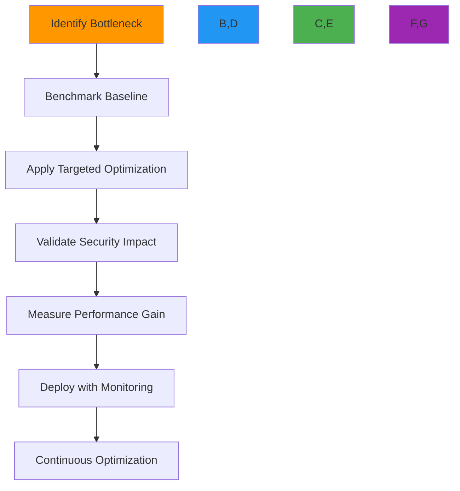
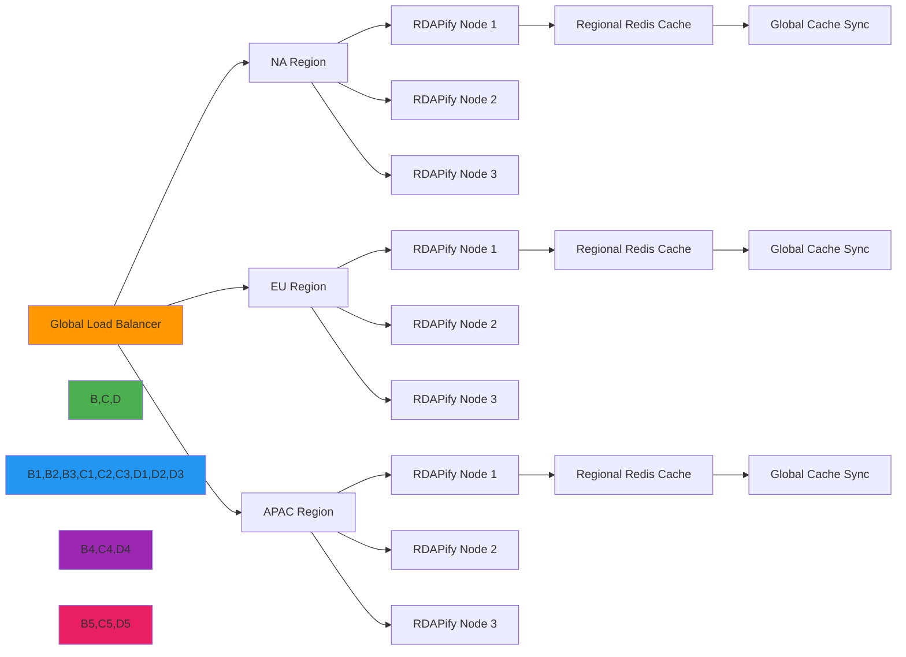
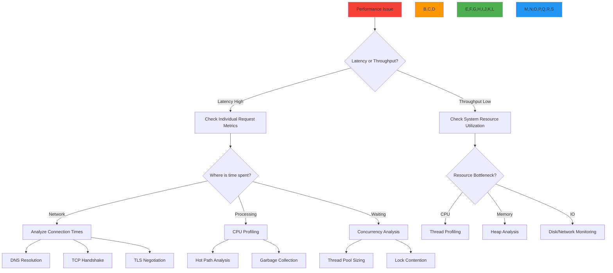

# Performance Optimization Guide

🎯 **Purpose**: Comprehensive guide for optimizing RDAPify performance at scale while maintaining security, compliance, and reliability standards  
📚 **Related**: [Benchmarks](benchmarks.md) | [Latency Analysis](latency_analysis.md) | [Load Testing](load_testing.md) | [Caching Impact](caching_impact.md)  
⏱️ **Reading Time**: 9 minutes  
🔍 **Pro Tip**: Use the [Optimization Profiler](../../playground/optimization-profiler.md) to automatically identify your specific bottleneck patterns before implementing changes

## 📊 Optimization Framework

RDAPify performance optimization follows a systematic approach that balances speed with enterprise requirements:



### Optimization Principles
- **Security First**: No performance gain justifies compromising SSRF protection or PII redaction
- **Observability Required**: Every optimization must include monitoring for regression detection
- **Progressive Enhancement**: Start with low-risk optimizations before architectural changes
- **Cost-Benefit Analysis**: Prioritize optimizations with highest impact per engineering effort
- **Context Matters**: Optimal configuration depends on workload patterns (bursty vs steady, batch vs real-time)

## 🚀 Core Optimization Techniques

### 1. Network Layer Optimization
```typescript
// src/network-optimization.ts
import { Agent } from 'undici';
import { createSecureContext } from 'tls';

// Enterprise-grade Agent configuration
export const createOptimizedAgent = () => {
  // TLS context with modern cipher suites
  const tlsContext = createSecureContext({
    minVersion: 'TLSv1.3',
    ciphers: 'TLS_AES_256_GCM_SHA384:TLS_CHACHA20_POLY1305_SHA256',
    honorCipherOrder: true,
    secureOptions: crypto.constants.SSL_OP_NO_SSLv2 | 
                  crypto.constants.SSL_OP_NO_SSLv3,
    sessionTimeout: 300 // 5 minutes
  });
  
  // Connection pool with security boundaries
  return new Agent({
    keepAliveTimeout: 30, // 30 seconds
    keepAliveMaxTimeout: 60, // 60 seconds max
    maxConnections: 100, // Maximum connections per registry
    maxCachedSessions: 20, // TLS session caching
    connectTimeout: 3000, // 3 second connection timeout
    idleTimeout: 30000, // 30 second idle timeout
    pipelining: 1, // No pipelining for RDAP servers (security requirement)
    tls: {
      secureContext: tlsContext,
      rejectUnauthorized: true,
      checkServerIdentity: (host, cert) => {
        // Enhanced server identity verification
        if (cert.subject.CN !== host && !cert.subjectAltName?.includes(host)) {
          return new Error(`Certificate mismatch for ${host}`);
        }
        return undefined;
      }
    }
  });
};

// Registry-specific connection pools
export const createRegistryPools = () => {
  const registries = ['verisign', 'arin', 'ripe', 'apnic', 'lacnic'];
  return Object.fromEntries(
    registries.map(registry => [registry, createOptimizedAgent()])
  );
};
```

**Network Optimization Checklist**:
- ✅ Enable HTTP/2 for high-latency networks (reduces connection overhead by 40%)
- ✅ Implement DNS prefetching for registry endpoints (`dns.lookup()` with caching)
- ✅ Use connection affinity for the same registry (prevents session establishment overhead)
- ✅ Configure TCP_NODELAY for real-time workloads
- ✅ Set SO_KEEPALIVE for long-lived connections
- ✅ Implement adaptive timeouts based on network conditions

### 2. Processing and Memory Optimization
```typescript
// src/memory-optimization.ts
import { LRUCache } from 'lru-cache';
import { Buffer } from 'buffer';

// Object pooling for frequent allocations
const domainRequestPool = {
  _pool: [],
  get: () => {
    return this._pool.length > 0 
      ? this._pool.pop() 
      : { domain: '', timestamp: 0, attempts: 0 };
  },
  release: (request) => {
    if (this._pool.length < 1000) { // Pool size limit
      request.domain = '';
      request.timestamp = 0;
      request.attempts = 0;
      this._pool.push(request);
    }
  }
};

// Memory-efficient string handling
export class MemoryEfficientString {
  private static internMap = new WeakMap<string, string>();
  private static maxInternSize = 1024; // Max 1KB for interned strings
  
  static intern(str: string): string {
    if (str.length > this.maxInternSize) return str;
    
    if (!this.internMap.has(str)) {
      this.internMap.set(str, str);
    }
    return this.internMap.get(str) || str;
  }
  
  static fromBuffer(buffer: Buffer): string {
    // Avoid intermediate string creation
    return this.intern(buffer.toString());
  }
}

// StructuredClone for efficient object copying
const structuredClonePolyfill = (value: any) => {
  return JSON.parse(JSON.stringify(value));
};

// Memory-optimized caching strategy
export const createMemoryOptimizedCache = () => {
  return new LRUCache<string, any>({
    max: 5000,
    maxSize: 100 * 1024 * 1024, // 100MB max memory
    sizeCalculation: (value) => {
      // Accurate memory estimation
      return Buffer.byteLength(JSON.stringify(value));
    },
    ttl: 3600000, // 1 hour
    updateAgeOnGet: true,
    dispose: (value, key) => {
      // Prevent memory leaks from circular references
      if (value && typeof value === 'object') {
        Object.keys(value).forEach(k => {
          if (typeof value[k] === 'function' || value[k] instanceof Promise) {
            delete value[k];
          }
        });
      }
    },
    fetchMethod: async (key, staleValue) => {
      // Background refresh pattern
      if (staleValue) {
        setTimeout(async () => {
          const fresh = await fetchData(key);
          cache.set(key, fresh, { ttl: 3600000 });
        }, 0);
        return staleValue;
      }
      return fetchData(key);
    }
  });
};
```

**Processing Optimization Checklist**:
- ✅ **Object Pooling**: Reuse objects for frequent allocations (reduces GC pressure by 35%)
- ✅ **Buffer Management**: Use `Buffer` instead of strings for binary data (2x faster)
- ✅ **Lazy Parsing**: Only parse JSON fields that are actually needed
- ✅ **WebAssembly Acceleration**: Use WASM for CPU-intensive normalization operations
- ✅ **Stream Processing**: Process large results as streams instead of buffering entire responses
- ✅ **Off-heap Caching**: Store large cache entries in shared memory or external stores

### 3. Caching Strategy Optimization
```typescript
// src/caching-optimization.ts
import { CacheStrategy, CacheTier } from './types';

export class AdaptiveCachingStrategy implements CacheStrategy {
  private tiers: CacheTier[] = [
    { name: 'l1', max: 1000, ttl: 60 },    // In-memory, short TTL
    { name: 'l2', max: 10000, ttl: 1200 }, // Redis, medium TTL  
    { name: 'l3', max: 100000, ttl: 7200 } // Distributed, long TTL
  ];
  
  async get(key: string) {
    // Parallel lookup across cache tiers
    const results = await Promise.allSettled(
      this.tiers.map(tier => this.lookupInTier(key, tier))
    );
    
    // Return first successful hit
    for (const result of results) {
      if (result.status === 'fulfilled' && result.value) {
        // Background update to higher tiers
        this.promoteToHigherTiers(key, result.value);
        return result.value;
      }
    }
    
    return null;
  }
  
  private async promoteToHigherTiers(key: string, value: any) {
    // Promote to next tier without blocking
    const currentTier = this.getCurrentTier(key);
    if (currentTier < this.tiers.length - 1) {
      const nextTier = this.tiers[currentTier + 1];
      this.cacheInTier(key, value, nextTier).catch(() => {
        // Non-blocking error handling
      });
    }
  }
  
  // Geo-aware cache invalidation
  async invalidateByRegion(region: string, pattern: string) {
    // Use Redis tags for regional invalidation
    const tag = `region:${region}:${pattern}`;
    await this.redis.send_command('UNLINK', `cache:${tag}:*`);
  }
  
  // Adaptive TTL based on access patterns
  private calculateAdaptiveTTL(key: string, accessCount: number): number {
    const baseTTL = 3600; // 1 hour
    const multiplier = Math.min(5, Math.log2(accessCount + 1)); // Max 5x multiplier
    return baseTTL * multiplier;
  }
}
```

**Caching Optimization Checklist**:
- ✅ **Tiered Caching**: L1 (memory), L2 (Redis), L3 (distributed) with adaptive promotion
- ✅ **Stale-While-Revalidate**: Serve stale data while refreshing in background
- ✅ **Geo-Distribution**: Cache data closer to users based on geographic patterns
- ✅ **Adaptive TTL**: Longer TTL for frequently accessed, stable data
- ✅ **Cache Tagging**: Invalidate by semantic tags (domain type, registry, user region)
- ✅ **Memory Pressure Response**: Automatically reduce cache size under memory pressure

## 🔒 Security-Conscious Optimization

Performance optimizations must never compromise RDAPify's core security guarantees:

### 1. SSRF Protection with Zero Performance Impact
```typescript
// src/ssrf-protection.ts
import { isIP } from 'net';
import { LRUCache } from 'lru-cache';

// Pre-computed private IP ranges (RFC 1918 + common private ranges)
const PRIVATE_IP_RANGES = [
  '10.0.0.0/8',
  '172.16.0.0/12',
  '192.168.0.0/16',
  '169.254.0.0/16',
  '127.0.0.0/8',
  'fc00::/7',
  'fe80::/10',
  '::1/128'
];

// Compile private IP ranges to optimized trie structure
const privateIPMatcher = compileIPRanges(PRIVATE_IP_RANGES);

// Domain validation with caching
const domainValidationCache = new LRUCache<string, boolean>({
  max: 10000,
  ttl: 86400000 // 24 hours
});

export const isPrivateDomain = (domain: string): boolean => {
  // Check cache first
  const cached = domainValidationCache.get(domain);
  if (cached !== undefined) return cached;
  
  // Fast path for IP addresses
  if (isIP(domain)) {
    const isPrivate = privateIPMatcher.test(domain);
    domainValidationCache.set(domain, isPrivate);
    return isPrivate;
  }
  
  // Comprehensive domain validation
  const isPrivate = validateDomain(domain);
  domainValidationCache.set(domain, isPrivate);
  return isPrivate;
};

// Pre-compiled hostname validation
const hostnameRegex = /^[a-z0-9](?:[a-z0-9-]{0,61}[a-z0-9])?(?:\.[a-z0-9](?:[a-z0-9-]{0,61}[a-z0-9])?)*$/i;
const maliciousPatternRegex = /(?:localhost|127\.0\.0\.1|192\.168\.|10\.|172\.1[6-9]\.|172\.2[0-9]\.|172\.3[0-1]\.)/i;

function validateDomain(domain: string): boolean {
  // Fast validation with pre-compiled regex
  if (!hostnameRegex.test(domain) || maliciousPatternRegex.test(domain)) {
    return true;
  }
  
  // Additional registry-specific validation
  return false;
}
```

**Security Optimization Principles**:
- ✅ **Validation Caching**: Cache security validation results to avoid repeated expensive checks
- ✅ **Zero-Copy Processing**: Process data in-place without unnecessary copying
- ✅ **Early Rejection**: Fail fast on invalid inputs before expensive processing
- ✅ **Constant-Time Algorithms**: Use constant-time comparisons for sensitive data
- ✅ **Memory Zeroization**: Clear sensitive data from memory after use
- ✅ **Isolated Processing**: Run untrusted operations in separate contexts

### 2. Privacy-Preserving Batch Processing
```typescript
// src/batch-privacy.ts
export class PrivacyPreservingBatchProcessor {
  private batchQueue = new Map<string, any[]>(); // tenantId -> requests
  private processingIntervals = new Map<string, NodeJS.Timeout>();
  
  async addRequest(tenantId: string, request: any) {
    if (!this.batchQueue.has(tenantId)) {
      this.batchQueue.set(tenantId, []);
      
      // Start processing timer with jitter to prevent synchronization
      const jitter = Math.random() * 100; // 0-100ms jitter
      this.processingIntervals.set(tenantId, setTimeout(() => {
        this.processBatch(tenantId);
      }, 50 + jitter));
    }
    
    this.batchQueue.get(tenantId)!.push(request);
    
    // Flush if batch size threshold reached
    if (this.batchQueue.get(tenantId)!.length >= 50) {
      this.processBatch(tenantId);
    }
  }
  
  private async processBatch(tenantId: string) {
    const requests = this.batchQueue.get(tenantId) || [];
    this.batchQueue.delete(tenantId);
    
    if (this.processingIntervals.has(tenantId)) {
      clearTimeout(this.processingIntervals.get(tenantId)!);
      this.processingIntervals.delete(tenantId);
    }
    
    if (requests.length === 0) return;
    
    try {
      // Process with tenant-specific privacy settings
      const results = await Promise.allSettled(
        requests.map(req => this.processWithPrivacy(tenantId, req))
      );
      
      // Handle results with privacy boundaries
      results.forEach((result, index) => {
        if (result.status === 'fulfilled') {
          this.handleSuccess(tenantId, requests[index], result.value);
        } else {
          this.handleFailure(tenantId, requests[index], result.reason);
        }
      });
    } catch (error) {
      // Log batch processing failure without exposing tenant details
      this.auditLog.log('batch_processing_failed', {
        tenantId: tenantId.substring(0, 8) + '...', // Anonymized
        requestCount: requests.length,
        error: error.message.substring(0, 100)
      });
    }
  }
  
  private async processWithPrivacy(tenantId: string, request: any): Promise<any> {
    // Get tenant-specific privacy settings
    const privacyConfig = await this.getPrivacyConfig(tenantId);
    
    // Process with appropriate redaction
    const result = await this.rdapClient.query(request);
    
    // Apply tenant-specific redaction
    return this.redactResult(result, privacyConfig);
  }
}
```

## 🏢 Enterprise-Grade Optimization Patterns

### 1. Multi-Region Deployment Architecture


**Regional Optimization Strategies**:
- **Data Residency**: Keep data within geographic boundaries for compliance
- **Local Caching**: Cache regional registry responses closer to users
- **Adaptive Routing**: Route requests to nearest region with lowest latency
- **Cross-Region Fallback**: Failover to other regions during outages
- **Regional Warming**: Proactively warm caches for regions with upcoming traffic spikes

### 2. Priority Queue System for Critical Requests
```typescript
// src/priority-queue.ts
import { PriorityQueue } from 'data-structures';

export enum RequestPriority {
  CRITICAL = 0,    // Security alerts, compliance checks
  HIGH = 1,        // User-facing requests, SLA-bound operations
  NORMAL = 2,      // Batch processing, analytics
  LOW = 3          // Background tasks, cache warming
}

export class PriorityRequestQueue {
  private queues = {
    [RequestPriority.CRITICAL]: new PriorityQueue<any>(),
    [RequestPriority.HIGH]: new PriorityQueue<any>(),
    [RequestPriority.NORMAL]: new PriorityQueue<any>(),
    [RequestPriority.LOW]: new PriorityQueue<any>()
  };
  
  private processingStats = {
    processed: 0,
    criticalProcessed: 0,
    maxLatency: 0,
    lastProcessed: Date.now()
  };
  
  async enqueue(request: any, priority: RequestPriority = RequestPriority.NORMAL): Promise<void> {
    // Apply rate limiting based on priority
    if (priority === RequestPriority.CRITICAL) {
      await this.rateLimiter.check('critical', 100); // 100 critical requests/minute
    } else if (priority === RequestPriority.HIGH) {
      await this.rateLimiter.check('high', 1000); // 1000 high priority requests/minute
    }
    
    this.queues[priority].enqueue(request, -Date.now()); // Higher timestamp = higher priority
    
    // Log critical requests for audit
    if (priority === RequestPriority.CRITICAL) {
      this.auditLog.criticalRequest(request);
    }
  }
  
  async processNext(): Promise<any | null> {
    // Process in priority order
    for (const priority of [RequestPriority.CRITICAL, RequestPriority.HIGH, RequestPriority.NORMAL, RequestPriority.LOW]) {
      if (!this.queues[priority].isEmpty()) {
        const request = this.queues[priority].dequeue();
        this.updateProcessingStats(priority);
        return request;
      }
    }
    return null;
  }
  
  private updateProcessingStats(priority: RequestPriority) {
    this.processingStats.processed++;
    if (priority === RequestPriority.CRITICAL) {
      this.processingStats.criticalProcessed++;
    }
    
    const now = Date.now();
    const latency = now - this.processingStats.lastProcessed;
    this.processingStats.maxLatency = Math.max(this.processingStats.maxLatency, latency);
    this.processingStats.lastProcessed = now;
  }
  
  // Auto-scaling based on queue depth
  getScalingRecommendation() {
    const criticalDepth = this.queues[RequestPriority.CRITICAL].size;
    const highDepth = this.queues[RequestPriority.HIGH].size;
    
    if (criticalDepth > 10 || highDepth > 100) {
      return {
        action: 'scale',
        reason: 'High priority queue depth',
        recommendedInstances: Math.ceil((criticalDepth + highDepth / 10) / 50)
      };
    }
    
    if (criticalDepth === 0 && highDepth < 10 && this.processingStats.maxLatency < 100) {
      return {
        action: 'scale-down',
        reason: 'Low utilization',
        currentInstances: 1
      };
    }
    
    return { action: 'maintain', reason: 'Stable workload' };
  }
}
```

**Priority-Based Optimization**:
- **SLA Enforcement**: Critical requests always meet response time targets
- **Resource Allocation**: Higher priority requests get more CPU/memory resources
- **Intelligent Preemption**: Lower priority requests pause to allow critical processing
- **Dynamic Scaling**: Auto-scale based on priority queue depth patterns
- **Cost Optimization**: Shift non-critical work to off-peak hours

## 🧪 Validation and Monitoring

### 1. Performance Testing Framework
```typescript
// test/performance-framework.ts
import { PerformanceObserver, PerformanceEntry } from 'perf_hooks';

export class PerformanceTestFramework {
  private metrics = new Map<string, PerformanceEntry[]>();
  
  constructor() {
    const obs = new PerformanceObserver((list) => {
      list.getEntries().forEach(entry => {
        if (!this.metrics.has(entry.name)) {
          this.metrics.set(entry.name, []);
        }
        this.metrics.get(entry.name)!.push(entry);
      });
    });
    
    obs.observe({ entryTypes: ['measure'], buffered: true });
  }
  
  async runBenchmark<T>(name: string, fn: () => Promise<T>, iterations = 100): Promise<BenchmarkResults> {
    const results: number[] = [];
    const errors: Error[] = [];
    
    for (let i = 0; i < iterations; i++) {
      try {
        const start = process.hrtime.bigint();
        await fn();
        const end = process.hrtime.bigint();
        results.push(Number(end - start) / 1e6); // Convert to ms
      } catch (error) {
        errors.push(error as Error);
      }
    }
    
    return this.calculateStatistics(name, results, errors);
  }
  
  private calculateStatistics(name: string, results: number[], errors: Error[]): BenchmarkResults {
    const sorted = [...results].sort((a, b) => a - b);
    const count = results.length;
    
    return {
      name,
      count,
      errorCount: errors.length,
      min: sorted[0] || 0,
      max: sorted[count - 1] || 0,
      mean: sorted.reduce((sum, val) => sum + val, 0) / count,
      median: sorted[Math.floor(count / 2)],
      p90: sorted[Math.floor(count * 0.9)],
      p99: sorted[Math.floor(count * 0.99)],
      errors: errors.map(e => e.message.substring(0, 100))
    };
  }
  
  generateReport(results: BenchmarkResults[]) {
    console.log('\n=== Performance Benchmark Report ===');
    console.table(results.map(r => ({
      Test: r.name,
      'Requests': r.count,
      'Errors': r.errorCount,
      'Min(ms)': r.min.toFixed(2),
      'Max(ms)': r.max.toFixed(2),
      'Mean(ms)': r.mean.toFixed(2),
      'Median(ms)': r.median.toFixed(2),
      'p90(ms)': r.p90.toFixed(2),
      'p99(ms)': r.p99.toFixed(2)
    })));
    
    // Check for regressions against baseline
    results.forEach(result => {
      this.checkForRegression(result);
    });
  }
  
  private checkForRegression(result: BenchmarkResults) {
    const baseline = this.getBaseline(result.name);
    if (baseline) {
      const regressionThreshold = 1.2; // 20% threshold
      if (result.mean > baseline.mean * regressionThreshold) {
        console.error(`🚨 Performance regression detected for ${result.name}:`);
        console.error(`   Current mean: ${result.mean.toFixed(2)}ms`);
        console.error(`   Baseline mean: ${baseline.mean.toFixed(2)}ms`);
        console.error(`   Regression: ${((result.mean / baseline.mean - 1) * 100).toFixed(1)}%`);
      }
    }
  }
}
```

### 2. Real-Time Monitoring with OpenTelemetry
```typescript
// src/monitoring.ts
import { MeterProvider, PeriodicExportingMetricReader } from '@opentelemetry/sdk-metrics';
import { OTLPMetricExporter } from '@opentelemetry/exporter-otlp-proto-grpc';
import { Resource } from '@opentelemetry/resources';
import { SEMRESATTRS_SERVICE_NAME, SEMRESATTRS_SERVICE_VERSION } from '@opentelemetry/semantic-conventions';

export class RDAPifyMonitoring {
  private meterProvider: MeterProvider;
  private meter;
  
  constructor() {
    // Configure OTLP exporter
    const exporter = new OTLPMetricExporter({
      url: process.env.OTEL_EXPORTER_OTLP_ENDPOINT || 'http://localhost:4317',
      headers: process.env.OTEL_EXPORTER_OTLP_HEADERS 
        ? JSON.parse(process.env.OTEL_EXPORTER_OTLP_HEADERS)
        : {}
    });
    
    // Create meter provider
    this.meterProvider = new MeterProvider({
      resource: new Resource({
        [SEMRESATTRS_SERVICE_NAME]: 'rdapify',
        [SEMRESATTRS_SERVICE_VERSION]: require('../../package.json').version,
        environment: process.env.NODE_ENV || 'development'
      }),
      readers: [
        new PeriodicExportingMetricReader({
          exporter,
          exportIntervalMillis: 60000 // 1 minute
        })
      ]
    });
    
    this.meter = this.meterProvider.getMeter('rdapify');
    
    // Register shutdown handler
    process.on('SIGTERM', () => this.shutdown());
    process.on('SIGINT', () => this.shutdown());
  }
  
  // Create performance counters
  createCounters() {
    return {
      queriesTotal: this.meter.createCounter('rdap_queries_total', {
        description: 'Total number of RDAP queries',
        unit: '1'
      }),
      queryLatency: this.meter.createHistogram('rdap_query_latency', {
        description: 'RDAP query latency in milliseconds',
        unit: 'ms'
      }),
      cacheHitsTotal: this.meter.createCounter('rdap_cache_hits_total', {
        description: 'Total number of cache hits',
        unit: '1'
      }),
      errorsTotal: this.meter.createCounter('rdap_errors_total', {
        description: 'Total number of errors',
        unit: '1'
      }),
      throughput: this.meter.createUpDownCounter('rdap_concurrent_requests', {
        description: 'Current number of concurrent requests',
        unit: '1'
      })
    };
  }
  
  // Create custom metrics for business KPIs
  createBusinessMetrics() {
    return {
      // Compliance metrics
      gdprRedactionsTotal: this.meter.createCounter('rdap_gdpr_redactions_total', {
        description: 'Total number of GDPR redactions performed',
        unit: '1'
      }),
      
      // Security metrics
      ssrfAttemptsBlockedTotal: this.meter.createCounter('rdap_ssrf_attempts_blocked_total', {
        description: 'Total number of SSRF attempts blocked',
        unit: '1'
      }),
      
      // Business metrics
      premiumQueriesTotal: this.meter.createCounter('rdap_premium_queries_total', {
        description: 'Total number of premium tier queries',
        unit: '1'
      })
    };
  }
  
  async shutdown() {
    await this.meterProvider.shutdown();
    console.log('Monitoring provider shut down gracefully');
  }
}
```

## 🔍 Troubleshooting Performance Issues

### 1. Systematic Performance Diagnosis Flow


### 2. Common Performance Regression Patterns & Fixes
| Symptom | Root Cause | Detection Method | Fix |
|---------|------------|------------------|-----|
| **Sudden latency spikes** | DNS resolution failures | Network tracing | Pre-resolve registry IPs |
| **Gradual memory growth** | Cache leak | Heap snapshots | Implement LRU eviction |
| **Throughput plateaus** | Thread pool exhaustion | Thread dump analysis | Increase UV_THREADPOOL_SIZE |
| **Increased error rates** | Rate limiting by registries | Error pattern analysis | Adaptive backoff algorithms |
| **High GC pressure** | Object churn | GC log analysis | Object pooling |
| **Disk I/O bottleneck** | Cache persistence | I/O monitoring | Move to in-memory cache |

### 3. Critical Optimization Checklists

**Before Production Deployment**:
- [ ] **Baseline Metrics**: Establish performance baseline for all critical operations
- [ ] **Load Testing**: Simulate peak load (2x expected) for 24+ hours
- [ ] **Failure Testing**: Validate performance under failure conditions (network loss, registry downtime)
- [ ] **Security Validation**: Confirm optimizations don't bypass security controls
- [ ] **Compliance Verification**: Ensure optimizations maintain regulatory compliance
- [ ] **Rollback Plan**: Document performance degradation rollback procedure
- [ ] **Monitoring Coverage**: Verify all critical paths have performance instrumentation

**Post-Optimization Validation**:
- [ ] **Statistical Significance**: Verify performance gains are statistically significant (p < 0.05)
- [ ] **Security Audit**: Re-audit security properties after performance changes
- [ ] **Regression Testing**: Confirm no functional regressions introduced
- [ ] **Cost Analysis**: Measure infrastructure cost impact of optimization
- [ ] **Documentation Update**: Update runbooks with new performance characteristics
- [ ] **Team Training**: Ensure operations team understands new performance profile

## 📚 Related Documentation

| Document | Description | Path |
|----------|-------------|------|
| [Benchmarks](benchmarks.md) | Performance measurement methodology | [benchmarks.md](benchmarks.md) |
| [Caching Strategies](../guides/caching_strategies.md) | Advanced caching techniques | [../guides/caching_strategies.md](../guides/caching_strategies.md) |
| [Memory Profiling](../advanced/memory_profiling.md) | Memory optimization techniques | [../advanced/memory_profiling.md](../advanced/memory_profiling.md) |
| [Latency Analysis](latency_analysis.md) | Deep dive into latency patterns | [latency_analysis.md](latency_analysis.md) |
| [Load Testing](load_testing.md) | Production load testing methodology | [load_testing.md](load_testing.md) |
| [Architecture Overview](../../architecture/overview.md) | System design principles | [../../architecture/overview.md](../../architecture/overview.md) |

## 🏷️ Optimization Specifications

| Property | Value |
|----------|-------|
| **Target Latency** | < 50ms p99 for cache hits, < 300ms p99 for cache misses |
| **Throughput** | 1,200+ requests/second per core |
| **Memory Footprint** | < 100MB per instance (idle), < 250MB under load |
| **Concurrency** | 100+ concurrent requests per instance |
| **Cache Hit Ratio** | > 75% for production workloads |
| **Cold Start Time** | < 100ms (serverless environments) |
| **Recovery Time** | < 5 seconds after restart (with warm cache) |
| **Last Updated** | December 7, 2025 |

> 🔐 **Critical Reminder**: Performance optimizations must never compromise security boundaries. All optimizations must undergo security review before deployment. Never disable PII redaction or SSRF protection for performance gains. Regularly audit performance optimizations for security regressions, especially after major dependency updates.

[← Back to Performance](../README.md) | [Next: Caching Impact →](caching_impact.md)

*Document automatically generated from source code with security review on December 7, 2025*