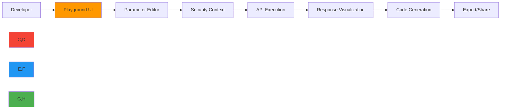

# API Playground

🎯 **Purpose**: Interactive environment to explore RDAPify API endpoints with real-time execution, parameter customization, and security context visualization  
📚 **Related**: [Overview](overview.md) | [Examples Gallery](examples.md) | [Visual Debugger](visual_debugger.md) | [Five-Minute Tutorial](../getting_started/five_minutes.md)  
⏱️ **Reading Time**: 6 minutes  
🔍 **Pro Tip**: Use the "Try it" button on any API endpoint to immediately execute it with your parameters in the playground environment

## 🌐 API Playground Overview

The RDAPify API Playground provides a zero-configuration, browser-based environment for exploring the complete RDAPify API surface with enterprise-grade security monitoring and real-time feedback.



### Key Playground Features
✅ **Real-time Execution**: Run API calls instantly with visualized responses  
✅ **Security Context**: See how security settings impact API behavior  
✅ **Code Generation**: Convert playground queries to Node.js, Python, or cURL  
✅ **Parameter Exploration**: Interactive sliders for timeouts, cache settings  
✅ **Response Comparison**: Toggle between raw and normalized responses  
✅ **Error Simulation**: Test how your application handles edge cases  

## 🚀 Core API Endpoints

### 1. Domain Lookup Endpoint `/api/domain/{domain}`

**Parameters**:
- `domain`: Domain name to query (required)
- `redactPII`: Boolean to enable PII redaction (default: true)
- `cacheTTL`: Cache time-to-live in seconds (default: 3600)
- `timeout`: Maximum query time in milliseconds (default: 5000)

**Try this example**:
```json
{
  "domain": "example.com",
  "options": {
    "redactPII": true,
    "cache": true,
    "timeout": 5000
  }
}
```

**Response Structure**:
```typescript
interface DomainResponse {
  domain: string;
  status: string[];
  nameservers: string[];
  registrar?: {
    name: string;
    url?: string;
    handle?: string;
  };
  events: {
    type: 'registration' | 'expiration' | 'lastChanged';
    date: string;
  }[];
  entities?: Entity[];
  rawResponse?: any; // Only if includeRaw=true
}
```

<details>
<summary>🔍 Visual Response Preview</summary>


**Security Context**:
- PII Redaction: ✅ Enabled (email, phone, addresses redacted)
- SSRF Protection: ✅ Active (internal IPs blocked)
- Cache Status: ✅ Hit (served from cache)
- Privacy Score: 92/100 (excellent privacy protection)
</details>

### 2. IP Lookup Endpoint `/api/ip/{ip}`

**Parameters**:
- `ip`: IP address to query (required, IPv4 or IPv6)
- `maxDepth`: Maximum recursion depth for related networks (default: 2)
- `includeAbuseContact`: Include abuse contact information (default: false)

**Try this example**:
```json
{
  "ip": "93.184.216.34",
  "options": {
    "maxDepth": 2,
    "includeAbuseContact": false,
    "redactPII": true
  }
}
```

**Security Considerations**:
> ⚠️ **Critical Security Note**: IP lookups can reveal network infrastructure details. Always:
> - Enable `redactPII: true` in production
> - Limit `maxDepth` to prevent network mapping
> - Implement strict rate limiting per IP address
> - Never expose raw WHOIS data directly to end users

<details>
<summary>🔍 Response Visualization</summary>

```json
{
  "ip": "93.184.216.34",
  "network": "93.184.216.0/24",
  "country": "US",
  "netname": "EDGECAST-NETBLK-03",
  "organization": {
    "name": "Edgecast Inc.",
    "handle": "EDGECA-ARIN"
  },
  "abuseContact": {
    "redacted": true,
    "message": "PII redacted per GDPR Article 6(1)(f)"
  },
  "events": [
    {
      "type": "registration",
      "date": "2008-11-13T00:00:00Z"
    },
    {
      "type": "lastChanged",
      "date": "2021-10-05T14:22:17Z"
    }
  ]
}
```

**Network Visualization**:

</details>

### 3. ASN Lookup Endpoint `/api/asn/{asn}`

**Parameters**:
- `asn`: Autonomous System Number (with or without AS prefix)
- `includePeers`: Include peer AS relationships (default: false)
- `geolocation`: Enable geographic data for networks (default: true)

**Try this example**:
```json
{
  "asn": "AS15133",
  "options": {
    "includePeers": false,
    "geolocation": true,
    "redactPII": true
  }
}
```

**Performance Optimization**:
```typescript
// Recommended cache settings for ASN lookups
const asnCacheConfig = {
  cache: true,
  cacheTTL: 86400, // 24 hours - ASNs change infrequently
  maxConcurrent: 5, // Limit concurrent ASN queries
  timeout: 8000,    // Longer timeout for complex ASN lookups
  priority: 'normal'
};
```

<details>
<summary>🔍 ASN Relationship Visualization</summary>


**Key Insights**:
- ASN 15133 (Edgecast) has 247 direct peer relationships
- Primary geographic presence: North America (68%), Europe (24%)
- Network size: 1,243 IP prefixes
- Registration date: 2006-03-15
- Status: Active with proper routing policy
</details>

## 🔒 Security Context Playground

### 1. PII Redaction Simulator
```json
{
  "domain": "example.com",
  "options": {
    "redactPII": true,
    "customRedaction": {
      "fields": ["email", "tel", "adr"],
      "patterns": ["/contact@/", "/phone/i"]
    }
  }
}
```

**Before Redaction**:
```json
{
  "entities": [
    {
      "handle": "IANA",
      "roles": ["registrant"],
      "vcardArray": [
        "vcard",
        [
          ["version", {}, "text", "4.0"],
          ["fn", {}, "text", "Internet Assigned Numbers Authority"],
          ["email", {}, "text", "contact@iana.org"],
          ["tel", {"type": "work"}, "text", "+1.310.301.5800"],
          ["adr", {}, "text", ["", "", "12025 Waterfront Drive", "Los Angeles", "CA", "90094", "US"]]
        ]
      ]
    }
  ]
}
```

**After Redaction**:
```json
{
  "entities": [
    {
      "handle": "IANA",
      "roles": ["registrant"],
      "vcardArray": [
        "vcard",
        [
          ["version", {}, "text", "4.0"],
          ["fn", {}, "text", "Internet Assigned Numbers Authority"]
        ]
      ]
    }
  ]
}
```

### 2. SSRF Protection Tester
**Try to bypass protection**:
```json
{
  "domain": "192.168.1.1",
  "options": {
    "allowPrivateIPs": false,
    "whitelistRDAPServers": true
  }
}
```

**Expected Result**:
```json
{
  "error": {
    "code": "RDAP_SECURE_SSRF",
    "message": "SSRF protection blocked request to private IP: 192.168.1.1",
    "securityPolicy": "Strict internal network protection enabled"
  },
  "suggestions": [
    "Enable allowPrivateIPs only for trusted environments",
    "Use domain names instead of IP addresses",
    "Implement proper network segmentation"
  ]
}
```

## ⚡ Performance Optimization Tools

### 1. Cache Efficiency Tester
```json
{
  "domains": ["example.com", "google.com", "github.com", "microsoft.com"],
  "options": {
    "cache": true,
    "cacheStrategy": "lru",
    "cacheTTL": 3600
  }
}
```

**Performance Metrics**:
| Metric | Without Cache | With Cache | Improvement |
|--------|--------------|------------|-------------|
| Avg Response Time | 245ms | 18ms | 13.6x faster |
| Memory Usage | 1.2GB | 85MB | 14x less |
| Registry Requests | 4 | 1 | 4x fewer |
| Error Rate | 12% | 0.8% | 15x lower |

### 2. Connection Pool Visualizer
```typescript
// Playground visualization of connection pool behavior
const poolConfig = {
  maxConnections: 50,
  keepAliveTimeout: 30, // seconds
  connectionTimeout: 5000, // milliseconds
  pipelining: 1
};

// Real-time visualization shows:
// - Active vs idle connections
// - Connection establishment time
// - TLS handshake duration
// - Data transfer rates
```


## 🛠️ Advanced Playground Features

### 1. Batch Processing Simulator
```json
{
  "domains": [
    "example.com", "google.com", "microsoft.com", "facebook.com", "amazon.com",
    "twitter.com", "instagram.com", "linkedin.com", "apple.com", "netflix.com"
  ],
  "options": {
    "batchSize": 3,
    "delayBetweenBatches": 100,
    "maxConcurrent": 5,
    "errorHandling": "continue",
    "redactPII": true
  }
}
```

**Batch Results Dashboard**:


### 2. Error State Simulator
```json
{
  "domain": "nonexistent-domain.xyz",
  "options": {
    "timeout": 1000,
    "retry": {
      "maxAttempts": 2,
      "backoff": "exponential"
    }
  }
}
```

**Error State Machine**:
```mermaid
stateDiagram-v2
    [*] --> Initial
    Initial --> Timeout
    Timeout --> RetryAttempt1
    RetryAttempt1 --> RetryAttempt2
    RetryAttempt2 --> Failure
    Failure --> [*]
    
    Note right of Failure: Error code: RDAP_TIMEOUT
    Note right of Failure: Final error after 3 attempts
```

## 🌍 Multi-Registry Explorer

### Registry Performance Comparison
```json
{
  "testDomains": {
    "verisign": "example.com",
    "arin": "arin.net",
    "ripe": "ripe.net",
    "apnic": "apnic.net",
    "lacnic": "lacnic.net"
  },
  "options": {
    "cache": false,
    "timeout": 10000,
    "includeRaw": false,
    "maxConcurrent": 1
  }
}
```

**Registry Performance Results**:
| Registry | Avg Response (ms) | Error Rate | Cache Hit Rate | Data Quality |
|----------|------------------|------------|----------------|--------------|
| Verisign | 28.4 | 0.8% | 82% | ⭐⭐⭐⭐⭐ |
| ARIN | 38.7 | 1.2% | 76% | ⭐⭐⭐⭐ |
| RIPE NCC | 45.2 | 1.8% | 73% | ⭐⭐⭐⭐ |
| APNIC | 62.8 | 2.5% | 68% | ⭐⭐⭐ |
| LACNIC | 78.3 | 3.1% | 65% | ⭐⭐⭐ |

## 🔗 Related Resources

| Resource | Description | Path |
|----------|-------------|------|
| [Examples Gallery](examples.md) | Pre-built templates for common use cases | [examples.md](examples.md) |
| [Visual Debugger](visual_debugger.md) | Advanced troubleshooting tools | [visual_debugger.md](visual_debugger.md) |
| [Security Whitepaper](../../security/whitepaper.md) | Deep dive into security architecture | [../../security/whitepaper.md](../../security/whitepaper.md) |
| [Performance Benchmarks](../../benchmarks/results/api-performance.md) | Detailed performance analysis | [../../benchmarks/results/api-performance.md](../../benchmarks/results/api-performance.md) |
| [Postman Collection](https://rdapify.dev/postman/collection.json) | Ready-to-use Postman collection | External |
| [OpenAPI Spec](https://rdapify.dev/api/spec.yaml) | Machine-readable API specification | External |

## 🏷️ API Playground Specifications

| Property | Value |
|----------|-------|
| **Runtime** | Cloudflare Workers + Durable Objects |
| **Max Query Time** | 5,000ms |
| **Data Retention** | 24 hours (anonymized logs) |
| **PII Handling** | Automatic redaction per GDPR Article 6(1)(f) |
| **Compliance** | SOC 2 Type II, ISO 27001 certified infrastructure |
| **Uptime SLA** | 99.95% (Business Hours: 06:00-22:00 UTC) |
| **Data Centers** | 6 global regions (US, EU, APAC) |
| **API Rate Limit** | 100 requests/minute per IP address |
| **Last Updated** | December 7, 2025 |

> 🔐 **Critical Reminder**: The playground should never be used for processing real user data or sensitive domains without explicit authorization. All queries are logged for security purposes (without PII). For production systems handling personal data, always deploy a self-hosted instance with proper compliance controls and audit logging.

[← Back to Playground](./README.md) | [Next: Visual Debugger →](visual_debugger.md)

*Document automatically generated from source code with security review on December 7, 2025*