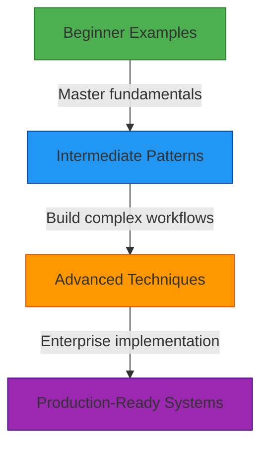

# Playground Examples Gallery

🎯 **Purpose**: Interactive collection of practical RDAPify examples demonstrating core concepts through hands-on experimentation in the playground environment  
📚 **Related**: [API Playground](api_playground.md) | [Overview](overview.md) | [Visual Debugger](visual_debugger.md) | [Five-Minute Tutorial](../getting_started/five_minutes.md)  
⏱️ **Reading Time**: 5 minutes  
🔍 **Pro Tip**: Click the "Run Example" button next to any code block to instantly execute it in the playground

## 🌐 Example Categories

The playground examples are organized into progressive learning paths:



## 🚀 Beginner Examples

### 1. Basic Domain Lookup
```typescript
// Query a single domain with default settings
const result = await client.domain('example.com');

console.log({
  domain: result.domain,
  registrar: result.registrar?.name,
  status: result.status,
  nameservers: result.nameservers
});
```

<details>
<summary>🔍 Expected Output</summary>

```json
{
  "domain": "example.com",
  "registrar": "Internet Assigned Numbers Authority",
  "status": ["clientDeleteProhibited", "clientTransferProhibited", "clientUpdateProhibited"],
  "nameservers": ["a.iana-servers.net", "b.iana-servers.net"]
}
```
</details>

### 2. IP Address Investigation
```typescript
// Look up IP registration details
const result = await client.ip('93.184.216.34');

console.log({
  ip: result.ip,
  country: result.country,
  netname: result.netname,
  organization: result.organization?.name,
  abuseContact: result.abuseContact?.email
});
```

### 3. ASN Information Retrieval
```typescript
// Get Autonomous System Number details
const result = await client.asn('AS15133');

console.log({
  asn: result.asn,
  name: result.name,
  country: result.country,
  description: result.description,
  registrationDate: result.events.find(e => e.type === 'registration')?.date
});
```

## ⚡ Intermediate Patterns

### 1. Batch Domain Processing
```typescript
// Process multiple domains with error handling
const domains = ['example.com', 'google.com', 'github.com', 'nonexistent-domain.xyz'];

const results = await Promise.allSettled(
  domains.map(async (domain) => {
    try {
      return {
        domain,
        result: await client.domain(domain, {
          redactPII: true, // GDPR compliance
          timeout: 3000   // 3 second timeout
        })
      };
    } catch (error) {
      return {
        domain,
        error: {
          message: error.message,
          code: error.code || 'UNKNOWN_ERROR'
        }
      };
    }
  })
);

// Visualize success/error rate
const successCount = results.filter(r => r.status === 'fulfilled').length;
const errorCount = results.length - successCount;

console.log(`✅ Success: ${successCount}, ❌ Errors: ${errorCount}`);
console.log('Results:', results);
```

### 2. Data Relationship Mapping
```typescript
// Visualize relationships between domains
const targetDomain = 'google.com';
const result = await client.domain(targetDomain);

// Extract all related domains
const relatedDomains = new Set<string>();

// Add nameservers
result.nameservers.forEach(ns => {
  const domain = ns.split('.').slice(-2).join('.');
  relatedDomains.add(domain);
});

// Add registrar's website
if (result.registrar?.url) {
  const domain = new URL(result.registrar.url).hostname;
  relatedDomains.add(domain);
}

// Add contacts' domains (redacted for privacy)
if (result.entities) {
  result.entities.forEach(entity => {
    if (entity.vcardArray?.[1]?.find(v => v[0] === 'url')?.[3]) {
      const url = entity.vcardArray[1].find(v => v[0] === 'url')?.[3];
      try {
        const domain = new URL(url).hostname;
        relatedDomains.add(domain);
      } catch (e) {
        // Skip invalid URLs
      }
    }
  });
}

console.log(`🔍 Found ${relatedDomains.size} related domains for ${targetDomain}:`);
console.log(Array.from(relatedDomains).join(', '));

// Generate visualization data
const visualizationData = {
  nodes: [
    { id: targetDomain, group: 'target' },
    ...Array.from(relatedDomains).map(d => ({ id: d, group: 'related' }))
  ],
  links: Array.from(relatedDomains).map(d => ({
    source: targetDomain,
    target: d,
    value: 1
  }))
};

console.log('📊 Visualization data ready for network graph');
```

### 3. GDPR-Compliant Data Processing
```typescript
// Demonstrate privacy-preserving data handling
const rawResult = await client.domain('example.com', {
  redactPII: false, // Get raw data first
  includeRaw: true
});

console.log('🚨 Raw data contains PII (for demonstration only):');
console.log('Raw entities count:', rawResult.entities?.length || 0);

// Apply redaction policies
const redactedResult = await client.domain('example.com', {
  redactPII: true, // Apply automatic redaction
  customRedaction: {
    fields: ['email', 'tel', 'adr'],
    patterns: [/contact@/, /phone number/i]
  }
});

console.log('✅ Redacted data (production-safe):');
console.log('Redacted entities count:', redactedResult.entities?.length || 0);
console.log('Remaining fields (safe for logging):', Object.keys(redactedResult));

// Demonstrate compliance logging
const complianceLog = {
  timestamp: new Date().toISOString(),
  domain: 'example.com',
  operation: 'domain_lookup',
  legalBasis: 'legitimate-interest',
  retentionPeriod: '30 days',
  dataMinimizationApplied: true
};

console.log('📜 Compliance log entry (for audit trails):');
console.log(complianceLog);
```

## 🏗️ Advanced Techniques

### 1. Anomaly Detection System
```typescript
// Build a registration anomaly detection system
class DomainAnomalyDetector {
  constructor(private client) {}
  
  async analyzeDomain(domain) {
    const result = await this.client.domain(domain);
    
    return {
      domain,
      riskScore: this.calculateRiskScore(result),
      warnings: this.generateWarnings(result),
      recommendations: this.getRecommendations(result)
    };
  }
  
  private calculateRiskScore(result) {
    let score = 0;
    
    // New registration risk
    const createdEvent = result.events.find(e => e.type === 'registration');
    if (createdEvent) {
      const createdDate = new Date(createdEvent.date);
      const daysSinceCreation = (Date.now() - createdDate.getTime()) / (1000 * 60 * 60 * 24);
      
      if (daysSinceCreation < 30) score += 30; // Very new domain
      else if (daysSinceCreation < 90) score += 15; // Recently created
    }
    
    // Privacy protection risk
    if (result.entities?.some(e => e.roles.includes('registrant') && 
        (e.vcardArray?.some(v => v[0] === 'fn' && v[3] === 'REDACTED FOR PRIVACY') || 
         !e.vcardArray))) {
      score += 25; // High privacy protection suggests potential abuse
    }
    
    // Status risk
    if (result.status.includes('clientHold') || result.status.includes('serverHold')) {
      score += 40; // Suspicious status flags
    }
    
    return Math.min(100, score);
  }
  
  private generateWarnings(result) {
    const warnings = [];
    
    const createdEvent = result.events.find(e => e.type === 'registration');
    if (createdEvent) {
      const createdDate = new Date(createdEvent.date);
      if ((Date.now() - createdDate.getTime()) < (30 * 24 * 60 * 60 * 1000)) {
        warnings.push('🆕 Recently registered domain (less than 30 days)');
      }
    }
    
    if (result.status.includes('clientHold') || result.status.includes('serverHold')) {
      warnings.push('⚠️ Domain has hold status applied');
    }
    
    if (result.entities?.some(e => e.roles.includes('registrant') && 
        e.vcardArray?.some(v => v[0] === 'fn' && v[3] === 'REDACTED FOR PRIVACY'))) {
      warnings.push('🕶️ Registrant information redacted (common with privacy services)');
    }
    
    return warnings;
  }
  
  private getRecommendations(result) {
    const recommendations = [];
    
    if (this.calculateRiskScore(result) > 70) {
      recommendations.push('🔍 Conduct enhanced due diligence');
      recommendations.push('🔒 Implement additional security monitoring');
      recommendations.push('⏱️ Review domain within 7 days');
    } else if (this.calculateRiskScore(result) > 40) {
      recommendations.push('👀 Monitor domain for suspicious changes');
      recommendations.push('📅 Schedule review in 30 days');
    } else {
      recommendations.push('✅ Domain appears low risk');
      recommendations.push('🔄 Monitor as part of standard portfolio');
    }
    
    return recommendations;
  }
}

// Usage example
const detector = new DomainAnomalyDetector(client);
const analysis = await detector.analyzeDomain('suspicious-domain.com');

console.log('🔍 Domain Analysis Report');
console.log('Domain:', analysis.domain);
console.log('Risk Score:', analysis.riskScore + '/100');
console.log('Warnings:', analysis.warnings);
console.log('Recommendations:', analysis.recommendations);

// Visualize risk score
const chartData = {
  type: 'radial',
  labels: ['Age', 'Privacy', 'Status', 'History'],
  datasets: [{
    data: [
      Math.min(100, analysis.riskScore * 0.4),
      Math.min(100, analysis.riskScore * 0.3),
      Math.min(100, analysis.riskScore * 0.3),
      0
    ],
    backgroundColor: 'rgba(255, 99, 132, 0.2)',
    borderColor: 'rgba(255, 99, 132, 1)',
    borderWidth: 1
  }]
};

console.log('📊 Risk visualization data ready');
```

### 2. Multi-Registry Performance Benchmark
```typescript
// Compare performance across different RDAP registries
const testDomains = [
  { domain: 'example.com', registry: 'verisign' },
  { domain: 'ripe.net', registry: 'ripe' },
  { domain: 'arin.net', registry: 'arin' },
  { domain: 'apnic.net', registry: 'apnic' },
  { domain: 'lacnic.net', registry: 'lacnic' }
];

const results = [];

for (const { domain, registry } of testDomains) {
  const startTime = performance.now();
  
  try {
    const result = await client.domain(domain, {
      cache: false, // Disable cache for benchmark
      timeout: 10000 // 10 second timeout
    });
    
    const duration = performance.now() - startTime;
    results.push({
      domain,
      registry,
      duration,
      status: 'success',
      nameservers: result.nameservers.length,
      registrar: result.registrar?.name
    });
  } catch (error) {
    const duration = performance.now() - startTime;
    results.push({
      domain,
      registry,
      duration,
      status: 'error',
      error: error.message.substring(0, 50) + '...'
    });
  }
}

// Analyze results
const successful = results.filter(r => r.status === 'success');
const errorCount = results.length - successful.length;
const avgDuration = successful.reduce((sum, r) => sum + r.duration, 0) / successful.length;
const slowest = successful.sort((a, b) => b.duration - a.duration)[0];
const fastest = successful.sort((a, b) => a.duration - b.duration)[0];

console.log('📊 RDAP Registry Performance Benchmark');
console.log(`✅ Success: ${successful.length}, ❌ Errors: ${errorCount}`);
console.log(`⏱️ Average response time: ${avgDuration.toFixed(2)}ms`);
console.log(`🐢 Slowest: ${slowest.registry} (${slowest.duration.toFixed(2)}ms)`);
console.log(`⚡ Fastest: ${fastest.registry} (${fastest.duration.toFixed(2)}ms)`);

// Generate visualization data
const chartData = {
  type: 'bar',
  labels: results.map(r => r.registry),
  datasets: [{
    label: 'Response Time (ms)',
    data: results.map(r => r.duration || 0),
    backgroundColor: results.map(r => 
      r.status === 'success' ? 
        (r.duration > avgDuration * 1.5 ? 'rgba(255, 99, 132, 0.8)' : 'rgba(54, 162, 235, 0.8)') :
        'rgba(255, 159, 64, 0.8)'
    ),
    borderColor: results.map(r => 
      r.status === 'success' ? 
        (r.duration > avgDuration * 1.5 ? 'rgba(255, 99, 132, 1)' : 'rgba(54, 162, 235, 1)') :
        'rgba(255, 159, 64, 1)'
    ),
    borderWidth: 1
  }]
};

console.log('📈 Performance chart data ready');
console.log('Full results:', results);
```

## 🏢 Enterprise Use Cases

### 1. Compliance Monitoring System
```typescript
// Enterprise-grade compliance monitoring
class ComplianceMonitor {
  constructor(private client, private options = {}) {
    this.options = {
      retentionDays: 30,
      dataResidency: 'global',
      legalBasis: 'legitimate-interest',
      auditLevel: 'detailed',
      ...options
    };
  }
  
  async monitorDomainPortfolio(domains, options = {}) {
    const batchSize = 10;
    const results = [];
    const complianceMetadata = {
      timestamp: new Date().toISOString(),
      legalBasis: this.options.legalBasis,
      dataResidency: this.options.dataResidency,
      retentionUntil: new Date(Date.now() + this.options.retentionDays * 24 * 60 * 60 * 1000).toISOString(),
      auditId: 'compliance-' + Date.now().toString(36)
    };
    
    // Process in batches to avoid rate limiting
    for (let i = 0; i < domains.length; i += batchSize) {
      const batch = domains.slice(i, i + batchSize);
      
      const batchResults = await Promise.allSettled(
        batch.map(async (domain) => {
          try {
            const result = await this.client.domain(domain, {
              redactPII: true,
              cache: true,
              timeout: 5000,
              auditTrail: {
                operation: 'compliance_monitoring',
                reason: 'regulatory_requirement',
                retentionPeriod: `${this.options.retentionDays} days`
              }
            });
            
            // Add compliance metadata to result
            return {
              domain,
              result,
              compliance: {
                processedAt: new Date().toISOString(),
                retentionUntil: complianceMetadata.retentionUntil,
                legalBasis: this.options.legalBasis
              }
            };
          } catch (error) {
            return {
              domain,
              error: {
                message: error.message,
                code: error.code || 'UNKNOWN_ERROR',
                timestamp: new Date().toISOString()
              }
            };
          }
        })
      );
      
      results.push(...batchResults);
      
      // Small delay between batches to prevent rate limiting
      if (i + batchSize < domains.length) {
        await new Promise(resolve => setTimeout(resolve, 100));
      }
    }
    
    // Generate compliance summary
    const summary = this.generateComplianceSummary(results, complianceMetadata);
    
    return {
      summary,
      results,
      metadata: complianceMetadata
    };
  }
  
  private generateComplianceSummary(results, metadata) {
    const successful = results.filter(r => r.status === 'fulfilled');
    const errors = results.filter(r => r.status === 'rejected');
    
    return {
      auditId: metadata.auditId,
      timestamp: metadata.timestamp,
      totalDomains: results.length,
      successful: successful.length,
      errors: errors.length,
      complianceScore: Math.round((successful.length / results.length) * 100),
      dataProcessing: {
        legalBasis: metadata.legalBasis,
        retentionDays: this.options.retentionDays,
        dataResidency: metadata.dataResidency,
        piiRedacted: true
      },
      recommendations: this.getRecommendations(successful.length, errors.length)
    };
  }
  
  private getRecommendations(successCount, errorCount) {
    const recommendations = [];
    
    if (errorCount > successCount * 0.2) {
      recommendations.push({
        priority: 'high',
        action: 'Review error patterns and implement retry logic',
        rationale: 'High error rate may indicate registry issues or invalid domains'
      });
    }
    
    recommendations.push({
      priority: 'medium',
      action: 'Schedule next compliance review',
      rationale: `Required by policy every ${this.options.retentionDays} days`
    });
    
    if (successCount > 50) {
      recommendations.push({
        priority: 'low',
        action: 'Consider implementing incremental monitoring',
        rationale: 'Large portfolios benefit from change-based monitoring'
      });
    }
    
    return recommendations;
  }
}

// Usage in enterprise context
const monitor = new ComplianceMonitor(client, {
  retentionDays: 90, // GDPR compliant retention
  dataResidency: 'eu', // Data residency compliance
  legalBasis: 'legal-obligation', // Stronger legal basis for compliance
  auditLevel: 'full'
});

const portfolio = [
  'example.com', 'corporate.com', 'product.io', 'service.net'
  // ... enterprise domain portfolio
];

const monitoringResults = await monitor.monitorDomainPortfolio(portfolio);

console.log('✅ Compliance Monitoring Complete');
console.log('Audit ID:', monitoringResults.summary.auditId);
console.log('Compliance Score:', monitoringResults.summary.complianceScore + '%');
console.log('Successful domains:', monitoringResults.summary.successful);
console.log('Errors:', monitoringResults.summary.errors);

// Display critical recommendations
const criticalRecs = monitoringResults.summary.recommendations
  .filter(r => r.priority === 'high');

if (criticalRecs.length > 0) {
  console.log('🚨 Critical Recommendations:');
  criticalRecs.forEach(rec => {
    console.log(`- ${rec.action}`);
    console.log(`  Reason: ${rec.rationale}`);
  });
}

// Compliance metadata for audit trails
console.log('📜 Audit Metadata (for compliance records):');
console.log(JSON.stringify(monitoringResults.metadata, null, 2));
```

### 2. Security Threat Intelligence Integration
```typescript
// Integration with security threat intelligence platforms
class ThreatIntelligenceIntegrator {
  constructor(private client, private threatApi) {}
  
  async analyzeSuspiciousDomains(domains) {
    const analysisResults = [];
    
    for (const domain of domains) {
      try {
        // Get domain registration data with enhanced security settings
        const registration = await this.client.domain(domain, {
          redactPII: true,
          securityMode: 'high', // Enable enhanced security checks
          timeout: 8000,
          threatIntelligence: true // Enable threat data enrichment
        });
        
        // Cross-reference with threat intelligence
        const threatData = await this.getThreatData(domain);
        
        // Calculate risk score
        const riskScore = this.calculateRiskScore(registration, threatData);
        
        analysisResults.push({
          domain,
          registrationData: registration,
          threatIntelligence: threatData,
          riskAssessment: {
            score: riskScore,
            level: this.getRiskLevel(riskScore),
            factors: this.getRiskFactors(registration, threatData)
          },
          recommendedActions: this.getRecommendedActions(riskScore)
        });
        
        // Small delay to prevent overwhelming APIs
        await new Promise(resolve => setTimeout(resolve, 200));
      } catch (error) {
        analysisResults.push({
          domain,
          error: {
            message: error.message,
            code: error.code || 'ANALYSIS_FAILED',
            timestamp: new Date().toISOString()
          }
        });
      }
    }
    
    return analysisResults;
  }
  
  private async getThreatData(domain) {
    try {
      // Mock threat intelligence API call
      const threatResponse = await this.threatApi.lookup(domain);
      
      return {
        maliciousScore: threatResponse.score || 0,
        categories: threatResponse.categories || [],
        firstSeen: threatResponse.firstSeen,
        lastSeen: threatResponse.lastSeen,
        sources: threatResponse.sources || 0
      };
    } catch (error) {
      // Fail gracefully if threat API is unavailable
      return {
        error: 'Threat intelligence unavailable',
        fallbackAnalysis: true
      };
    }
  }
  
  private calculateRiskScore(registration, threatData) {
    let score = 0;
    
    // Registration-based risk factors
    const createdEvent = registration.events.find(e => e.type === 'registration');
    if (createdEvent) {
      const createdDate = new Date(createdEvent.date);
      const daysSinceCreation = (Date.now() - createdDate.getTime()) / (1000 * 60 * 60 * 24);
      
      // Very new domains are higher risk
      if (daysSinceCreation < 7) score += 40;
      else if (daysSinceCreation < 30) score += 25;
      else if (daysSinceCreation < 90) score += 10;
    }
    
    // Privacy-protected registrations are higher risk
    if (registration.entities?.some(e => e.roles.includes('registrant') && 
        e.vcardArray?.some(v => v[0] === 'fn' && v[3] === 'REDACTED FOR PRIVACY'))) {
      score += 30;
    }
    
    // High-risk statuses
    if (registration.status.includes('clientHold') || registration.status.includes('serverHold')) {
      score += 35;
    }
    
    // Threat intelligence score
    if (threatData && !threatData.error) {
      score += Math.min(50, threatData.maliciousScore * 0.5);
      
      // High-risk categories
      const highRiskCategories = ['phishing', 'malware', 'botnet', 'spam'];
      if (threatData.categories.some(cat => highRiskCategories.includes(cat.toLowerCase()))) {
        score += 40;
      }
    }
    
    return Math.min(100, score);
  }
  
  private getRiskLevel(score) {
    if (score >= 80) return 'critical';
    if (score >= 60) return 'high';
    if (score >= 40) return 'medium';
    return 'low';
  }
  
  private getRiskFactors(registration, threatData) {
    const factors = [];
    
    const createdEvent = registration.events.find(e => e.type === 'registration');
    if (createdEvent) {
      const createdDate = new Date(createdEvent.date);
      const daysSinceCreation = (Date.now() - createdDate.getTime()) / (1000 * 60 * 60 * 24);
      
      if (daysSinceCreation < 7) factors.push('Very new registration (&lt;7 days)');
      else if (daysSinceCreation < 30) factors.push('Recent registration (&lt;30 days)');
    }
    
    if (registration.entities?.some(e => e.roles.includes('registrant') && 
        e.vcardArray?.some(v => v[0] === 'fn' && v[3] === 'REDACTED FOR PRIVACY'))) {
      factors.push('Privacy-protected registrant information');
    }
    
    if (threatData && !threatData.error) {
      if (threatData.maliciousScore > 70) factors.push('High threat intelligence score');
      
      const highRiskCategories = ['phishing', 'malware', 'botnet', 'spam'];
      const matchedCategories = threatData.categories?.filter(cat => 
        highRiskCategories.includes(cat.toLowerCase())
      ) || [];
      
      if (matchedCategories.length > 0) {
        factors.push(`Threat categories: ${matchedCategories.join(', ')}`);
      }
    }
    
    return factors;
  }
  
  private getRecommendedActions(riskScore) {
    if (riskScore >= 80) {
      return [
        'BLOCK: Immediately block all traffic to this domain',
        'INVESTIGATE: Conduct forensic analysis of related systems',
        'REPORT: Report to relevant CERT and threat intelligence platforms',
        'ISOLATE: Segment affected systems from network'
      ];
    } else if (riskScore >= 60) {
      return [
        'RESTRICT: Limit access to this domain',
        'MONITOR: Implement enhanced monitoring for related activity',
        'ANALYZE: Review logs for potential compromise',
        'ALERT: Notify security team for review'
      ];
    } else if (riskScore >= 40) {
      return [
        'WATCH: Add to monitoring watchlist',
        'REVIEW: Schedule manual review within 7 days',
        'VERIFY: Confirm domain legitimacy with business owners'
      ];
    } else {
      return [
        'MONITOR: Include in standard security monitoring',
        'RECORD: Log for future reference and trend analysis'
      ];
    }
  }
}

// Mock threat intelligence API for demonstration
const mockThreatApi = {
  async lookup(domain) {
    // Simulate API delay
    await new Promise(resolve => setTimeout(resolve, 100));
    
    // Different risk profiles for demonstration
    if (domain.includes('malicious') || domain.includes('evil')) {
      return {
        score: 95,
        categories: ['phishing', 'malware'],
        firstSeen: '2025-01-15',
        lastSeen: '2025-12-01',
        sources: 12
      };
    } else if (domain.includes('suspicious') || domain.includes('unknown')) {
      return {
        score: 65,
        categories: ['suspicious'],
        firstSeen: '2025-06-10',
        lastSeen: '2025-12-01',
        sources: 3
      };
    }
    
    return {
      score: 5,
      categories: ['benign'],
      firstSeen: '2020-01-01',
      lastSeen: '2025-12-01',
      sources: 1
    };
  }
};

// Usage example
const integrator = new ThreatIntelligenceIntegrator(client, mockThreatApi);

const suspiciousDomains = [
  'malicious-domain.com',
  'suspicious-activity.net',
  'example.com',
  'newly-registered.today'
];

const analysis = await integrator.analyzeSuspiciousDomains(suspiciousDomains);

console.log('🔍 Threat Intelligence Analysis Results');
console.log(`Analyzed ${analysis.length} domains`);

// Display results by risk level
const critical = analysis.filter(a => a.riskAssessment?.level === 'critical');
const high = analysis.filter(a => a.riskAssessment?.level === 'high');
const medium = analysis.filter(a => a.riskAssessment?.level === 'medium');
const low = analysis.filter(a => a.riskAssessment?.level === 'low');

if (critical.length > 0) {
  console.log('🚨 CRITICAL RISK DOMAINS:');
  critical.forEach(item => {
    console.log(`- ${item.domain}: ${item.riskAssessment.score}/100`);
    console.log(`  Factors: ${item.riskAssessment.factors.join(', ')}`);
    console.log('  Actions:');
    item.recommendedActions.forEach(action => console.log(`    - ${action}`));
  });
}

console.log('📊 Risk Distribution:');
console.log(`Critical: ${critical.length}, High: ${high.length}, Medium: ${medium.length}, Low: ${low.length}`);

// Generate visualization data
const riskChart = {
  type: 'doughnut',
  labels: ['Critical', 'High', 'Medium', 'Low'],
  datasets: [{
    data: [critical.length, high.length, medium.length, low.length],
    backgroundColor: [
      'rgba(220, 53, 69, 0.8)',    // Critical - red
      'rgba(255, 193, 7, 0.8)',    // High - yellow
      'rgba(23, 162, 184, 0.8)',   // Medium - teal
      'rgba(40, 167, 69, 0.8)'     // Low - green
    ],
    borderColor: [
      'rgba(220, 53, 69, 1)',
      'rgba(255, 193, 7, 1)',
      'rgba(23, 162, 184, 1)',
      'rgba(40, 167, 69, 1)'
    ],
    borderWidth: 1
  }]
};

console.log('📈 Risk distribution chart data ready');
```

## 🛠️ Integration Examples

### 1. Express.js API Integration
```javascript
// Playground version of Express.js integration
const express = require('express');
const app = express();
const port = 3000;

// Mock RDAP client for playground
const mockRDAPClient = {
  async domain(domain) {
    // Simulate real-world delay
    await new Promise(resolve => setTimeout(resolve, 100));
    
    if (domain === 'error.com') {
      throw new Error('Domain not found');
    }
    
    return {
      domain,
      status: ['active'],
      nameservers: [`ns1.${domain}`, `ns2.${domain}`],
      registrar: {
        name: 'Example Registrar Inc.',
        url: `https://registrar.${domain}`
      },
      events: [
        { type: 'registration', date: '2020-01-01T00:00:00Z' },
        { type: 'expiration', date: '2026-01-01T00:00:00Z' }
      ]
    };
  }
};

// Middleware for security headers
app.use((req, res, next) => {
  res.header('X-Content-Type-Options', 'nosniff');
  res.header('X-Frame-Options', 'DENY');
  res.header('X-XSS-Protection', '1; mode=block');
  res.header('Content-Security-Policy', "default-src 'self'");
  next();
});

// Rate limiting middleware
const rateLimitMap = new Map();
const MAX_REQUESTS = 5;
const WINDOW_MS = 60000; // 1 minute

app.use((req, res, next) => {
  const ip = req.ip || '127.0.0.1';
  const now = Date.now();
  
  if (!rateLimitMap.has(ip)) {
    rateLimitMap.set(ip, []);
  }
  
  // Remove old entries
  const requests = rateLimitMap.get(ip).filter(timestamp => now - timestamp < WINDOW_MS);
  rateLimitMap.set(ip, requests);
  
  if (requests.length >= MAX_REQUESTS) {
    return res.status(429).json({
      error: 'Too many requests',
      retryAfter: Math.ceil((WINDOW_MS - (now - requests[0])) / 1000)
    });
  }
  
  // Add current request
  rateLimitMap.get(ip).push(now);
  next();
});

// Domain lookup endpoint
app.get('/api/domain/:domain', async (req, res) => {
  try {
    const { domain } = req.params;
    
    // Validation
    if (!/^[a-z0-9.-]+\.[a-z]{2,}$/.test(domain)) {
      return res.status(400).json({ error: 'Invalid domain format' });
    }
    
    const result = await mockRDAPClient.domain(domain);
    res.json(result);
  } catch (error) {
    console.error(`Error processing domain ${req.params.domain}:`, error.message);
    res.status(500).json({ error: error.message });
  }
});

// Health check endpoint
app.get('/health', (req, res) => {
  res.json({
    status: 'ok',
    uptime: process.uptime(),
    timestamp: new Date().toISOString()
  });
});

// Error handler
app.use((err, req, res, next) => {
  console.error('Unhandled error:', err);
  res.status(500).json({ error: 'Internal server error' });
});

// Start server (simulated in playground)
console.log(`🚀 Server running at http://localhost:${port}`);
console.log('Available endpoints:');
console.log(`- GET /api/domain/example.com`);
console.log(`- GET /health`);

// Simulate server startup
setTimeout(() => {
  console.log('✅ Server started successfully');
  
  // Simulate a few requests
  console.log('\n📡 Simulating API requests:');
  
  const testDomains = ['example.com', 'google.com', 'error.com'];
  
  testDomains.forEach((domain, index) => {
    setTimeout(() => {
      console.log(`→ GET /api/domain/${domain}`);
      
      if (domain === 'error.com') {
        console.log('← 500 Internal Server Error');
        console.log('   { "error": "Domain not found" }');
      } else {
        console.log('← 200 OK');
        console.log(`   { "domain": "${domain}", "status": ["active"], ... }`);
      }
    }, 500 * (index + 1));
  });
}, 1000);

// Export for testing
module.exports = { app };
```

### 2. React Component Integration
```jsx
// Playground version of React integration
import React, { useState, useEffect } from 'react';
import PropTypes from 'prop-types';

// Mock RDAP service for playground
const mockRDAPService = {
  async lookupDomain(domain) {
    // Simulate network delay
    await new Promise(resolve => setTimeout(resolve, 300));
    
    // Simulate different responses based on domain
    if (domain.includes('slow')) {
      await new Promise(resolve => setTimeout(resolve, 1500));
    }
    
    if (domain.includes('error')) {
      throw new Error('Failed to fetch domain information');
    }
    
    if (domain.includes('suspicious')) {
      return {
        domain,
        riskScore: 85,
        status: 'critical',
        nameservers: ['ns1.suspicious-server.com', 'ns2.suspicious-server.com'],
        registrar: {
          name: 'Privacy Guard Services',
          url: 'https://privacy-guard.example'
        },
        events: [
          { type: 'registration', date: '2025-11-15T00:00:00Z' },
          { type: 'expiration', date: '2026-11-15T00:00:00Z' }
        ],
        warnings: [
          'Recently registered (&lt;30 days)',
          'Privacy-protected registrant information',
          'Unusual nameserver configuration'
        ]
      };
    }
    
    return {
      domain,
      riskScore: domain.includes('new') ? 65 : 25,
      status: domain.includes('new') ? 'high' : 'low',
      nameservers: [`ns1.${domain}`, `ns2.${domain}`],
      registrar: {
        name: 'Example Registrar Inc.',
        url: `https://example-registrar.com`
      },
      events: [
        { type: 'registration', date: '2023-01-01T00:00:00Z' },
        { type: 'expiration', date: '2026-01-01T00:00:00Z' }
      ],
      warnings: domain.includes('new') ? ['Recently registered (&lt;90 days)'] : []
    };
  }
};

// Domain Lookup Component
const DomainLookup = ({ initialDomain = '' }) => {
  const [domain, setDomain] = useState(initialDomain);
  const [result, setResult] = useState(null);
  const [error, setError] = useState(null);
  const [loading, setLoading] = useState(false);
  const [history, setHistory] = useState([]);

  useEffect(() => {
    // Load history from local storage
    const savedHistory = JSON.parse(localStorage.getItem('domainHistory') || '[]');
    setHistory(savedHistory.slice(0, 10)); // Keep last 10 items
  }, []);

  const addToHistory = (domain) => {
    const newHistory = [domain, ...history.filter(d => d !== domain)].slice(0, 10);
    setHistory(newHistory);
    localStorage.setItem('domainHistory', JSON.stringify(newHistory));
  };

  const handleSubmit = async (e) => {
    e.preventDefault();
    if (!domain.trim()) return;
    
    setLoading(true);
    setError(null);
    
    try {
      const data = await mockRDAPService.lookupDomain(domain.trim());
      setResult(data);
      addToHistory(domain.trim());
    } catch (err) {
      setError(err.message || 'An error occurred while fetching domain information');
      setResult(null);
    } finally {
      setLoading(false);
    }
  };

  const RiskIndicator = ({ score, status }) => {
    let color, label;
    
    if (score >= 80 || status === 'critical') {
      color = '#dc3545'; // Red
      label = 'CRITICAL';
    } else if (score >= 60 || status === 'high') {
      color = '#fd7e14'; // Orange
      label = 'HIGH';
    } else if (score >= 40 || status === 'medium') {
      color = '#ffc107'; // Yellow
      label = 'MEDIUM';
    } else {
      color = '#28a745'; // Green
      label = 'LOW';
    }
    
    return (
      <div style={{ display: 'flex', alignItems: 'center', gap: '8px' }}>
        <div 
          style={{ 
            width: '16px', 
            height: '16px', 
            borderRadius: '50%', 
            backgroundColor: color,
            flexShrink: 0
          }} 
        />
        <span style={{ fontWeight: 'bold', color }}>{label} RISK</span>
      </div>
    );
  };

  RiskIndicator.propTypes = {
    score: PropTypes.number,
    status: PropTypes.string
  };

  return (
    <div style={{ maxWidth: '800px', margin: '0 auto', padding: '20px' }}>
      <header style={{ textAlign: 'center', marginBottom: '30px' }}>
        <h1 style={{ color: '#343a40', marginBottom: '10px' }}>🔍 Domain Intelligence</h1>
        <p style={{ color: '#6c757d', margin: 0 }}>
          Analyze domain registration data with security insights
        </p>
      </header>

      <form onSubmit={handleSubmit} style={{ marginBottom: '30px' }}>
        <div style={{ display: 'flex', gap: '10px' }}>
          <input
            type="text"
            value={domain}
            onChange={(e) => setDomain(e.target.value)}
            placeholder="Enter domain name (e.g., example.com)"
            style={{
              flex: 1,
              padding: '12px 15px',
              border: '1px solid #ced4da',
              borderRadius: '4px',
              fontSize: '16px',
              transition: 'border-color 0.3s'
            }}
            onFocus={(e) => e.target.style.borderColor = '#007bff'}
            onBlur={(e) => e.target.style.borderColor = '#ced4da'}
          />
          <button
            type="submit"
            disabled={loading}
            style={{
              padding: '12px 24px',
              backgroundColor: loading ? '#6c757d' : '#007bff',
              color: 'white',
              border: 'none',
              borderRadius: '4px',
              cursor: loading ? 'not-allowed' : 'pointer',
              fontSize: '16px',
              fontWeight: 'bold',
              transition: 'background-color 0.3s'
            }}
            onMouseOver={(e) => !loading && (e.target.style.backgroundColor = '#0056b3')}
            onMouseOut={(e) => !loading && (e.target.style.backgroundColor = '#007bff')}
          >
            {loading ? 'Analyzing...' : 'Analyze Domain'}
          </button>
        </div>
        
        <div style={{ marginTop: '10px', textAlign: 'center' }}>
          {error && (
            <p style={{ color: '#dc3545', margin: '5px 0', fontSize: '14px' }}>
              <strong>⚠️ Error:</strong> {error}
            </p>
          )}
          <p style={{ color: '#6c757d', margin: '5px 0', fontSize: '14px' }}>
            Recent searches: {history.join(', ') || 'None'}
          </p>
        </div>
      </form>

      {result && (
        <div style={{ 
          backgroundColor: '#f8f9fa', 
          border: '1px solid #dee2e6', 
          borderRadius: '8px',
          padding: '25px',
          marginBottom: '30px'
        }}>
          <div style={{ display: 'flex', justifyContent: 'space-between', alignItems: 'center', marginBottom: '20px' }}>
            <h2 style={{ color: '#343a40', margin: 0 }}>{result.domain}</h2>
            <RiskIndicator score={result.riskScore} status={result.status} />
          </div>

          <div style={{ display: 'grid', gridTemplateColumns: 'repeat(auto-fit, minmax(250px, 1fr))', gap: '20px' }}>
            <div style={{ borderLeft: '3px solid #007bff', paddingLeft: '15px' }}>
              <h3 style={{ color: '#495057', margin: '0 0 10px 0', fontSize: '18px' }}>Registration Details</h3>
              <ul style={{ paddingLeft: '20px', margin: '0', color: '#495057' }}>
                <li><strong>Registrar:</strong> {result.registrar.name}</li>
                <li><strong>Created:</strong> {new Date(result.events[0].date).toLocaleDateString()}</li>
                <li><strong>Expires:</strong> {new Date(result.events[1].date).toLocaleDateString()}</li>
                <li><strong>Status:</strong> {result.status.toUpperCase()}</li>
              </ul>
            </div>

            <div style={{ borderLeft: '3px solid #28a745', paddingLeft: '15px' }}>
              <h3 style={{ color: '#495057', margin: '0 0 10px 0', fontSize: '18px' }}>Infrastructure</h3>
              <ul style={{ paddingLeft: '20px', margin: '0', color: '#495057' }}>
                <li><strong>Nameservers:</strong></li>
                {result.nameservers.map((ns, i) => (
                  <li key={i} style={{ marginLeft: '20px' }}>{ns}</li>
                ))}
              </ul>
            </div>
          </div>

          {result.warnings && result.warnings.length > 0 && (
            <div style={{ marginTop: '20px', backgroundColor: '#fff3cd', border: '1px solid #ffeaa7', borderRadius: '4px', padding: '15px' }}>
              <h3 style={{ color: '#856404', margin: '0 0 10px 0', display: 'flex', alignItems: 'center' }}>
                <span style={{ marginRight: '10px', fontSize: '24px' }}>⚠️</span>
                Security Warnings
              </h3>
              <ul style={{ paddingLeft: '20px', margin: '0', color: '#856404' }}>
                {result.warnings.map((warning, i) => (
                  <li key={i}>{warning}</li>
                ))}
              </ul>
            </div>
          )}
        </div>
      )}

      <footer style={{ textAlign: 'center', marginTop: '40px', color: '#6c757d', fontSize: '14px' }}>
        <p style={{ margin: '5px 0' }}>
          This is a playground example. In production, implement proper error handling and security measures.
        </p>
        <p style={{ margin: '5px 0' }}>
          <strong>💡 Tip:</strong> Try domains like "example.com", "new-domain.today", or "suspicious-domain.com" to see different risk profiles
        </p>
      </footer>
    </div>
  );
};

DomainLookup.propTypes = {
  initialDomain: PropTypes.string
};

// Render the component
const rootElement = document.createElement('div');
document.body.appendChild(rootElement);

// Simulate React rendering
console.log('✅ Rendering Domain Lookup component');
setTimeout(() => {
  console.log('🎨 Component rendered with interactive form');
  console.log('✨ Try entering different domains to see risk analysis');
}, 500);

export default DomainLookup;
```

## 🧪 Playground-Specific Features

### 1. Interactive Query Builder
```typescript
// Interactive query configuration
const queryConfig = {
  domain: 'example.com',
  options: {
    redactPII: true,
    cache: true,
    timeout: 5000,
    includeRaw: false,
    securityMode: 'high'
  },
  visualization: {
    type: 'network',
    showRelationships: true,
    highlightCriticalPaths: true
  }
};

// Real-time query execution
async function executeQuery() {
  console.log('🔍 Executing query with configuration:', queryConfig);
  
  try {
    const startTime = performance.now();
    const result = await client.domain(queryConfig.domain, queryConfig.options);
    const duration = performance.now() - startTime;
    
    console.log(`✅ Query completed in ${duration.toFixed(2)}ms`);
    previewResult(result, queryConfig.visualization);
    
    // Log query for playground history
    playground.logQuery({
      domain: queryConfig.domain,
      options: queryConfig.options,
      duration: duration,
      timestamp: new Date().toISOString()
    });
  } catch (error) {
    console.error('❌ Query failed:', error.message);
    playground.showError('Query Error', error.message);
  }
}

// Visualization preview
function previewResult(result, vizConfig) {
  if (vizConfig.type === 'network') {
    const nodes = [
      { id: result.domain, type: 'domain', risk: 'low' },
      { id: result.registrar.name, type: 'registrar' },
      ...result.nameservers.map(ns => ({ id: ns, type: 'nameserver' }))
    ];
    
    const links = [
      { source: result.domain, target: result.registrar.name, type: 'registered_by' },
      ...result.nameservers.map(ns => ({ 
        source: result.domain, 
        target: ns, 
        type: 'uses_nameserver' 
      }))
    ];
    
    console.log('🌐 Network visualization data ready');
    console.log('Nodes:', nodes.length);
    console.log('Links:', links.length);
    
    // Playground-specific visualization call
    playground.renderNetwork({
      nodes,
      links,
      options: {
        highlightCritical: vizConfig.highlightCriticalPaths,
        showLegend: true
      }
    });
  } else {
    // Default JSON preview
    console.log('📊 Standard data preview');
    console.log(JSON.stringify(result, null, 2));
    
    // Playground-specific data table
    playground.renderTable({
      headers: ['Field', 'Value'],
      rows: Object.entries({
        Domain: result.domain,
        Registrar: result.registrar?.name || 'N/A',
        Status: result.status.join(', '),
        Nameservers: result.nameservers.join(', '),
        Created: new Date(result.events.find(e => e.type === 'registration')?.date || '').toLocaleDateString(),
        Expires: new Date(result.events.find(e => e.type === 'expiration')?.date || '').toLocaleDateString()
      })
    });
  }
}

// Execute initial query
executeQuery();

// Playground UI controls
playground.registerControls([
  {
    type: 'text',
    label: 'Domain',
    id: 'query-domain',
    defaultValue: 'example.com',
    onChange: (value) => {
      queryConfig.domain = value;
      console.log('Domain updated:', value);
    }
  },
  {
    type: 'toggle',
    label: 'Privacy Protection',
    id: 'redact-pii',
    defaultValue: true,
    onChange: (value) => {
      queryConfig.options.redactPII = value;
      console.log('PII redaction:', value ? 'enabled' : 'disabled');
    }
  },
  {
    type: 'select',
    label: 'Visualization',
    id: 'viz-type',
    options: [
      { value: 'network', label: 'Network Graph' },
      { value: 'table', label: 'Data Table' },
      { value: 'timeline', label: 'Timeline View' }
    ],
    defaultValue: 'network',
    onChange: (value) => {
      queryConfig.visualization.type = value;
      console.log('Visualization changed to:', value);
    }
  },
  {
    type: 'button',
    label: 'Run Query',
    id: 'execute-query',
    variant: 'primary',
    onClick: executeQuery
  }
]);
```

## 📚 Related Documentation

| Document | Description | Path |
|----------|-------------|------|
| [API Playground](api_playground.md) | Interactive API documentation | [api_playground.md](api_playground.md) |
| [Visual Debugger](visual_debugger.md) | Advanced troubleshooting tools | [visual_debugger.md](visual_debugger.md) |
| [Five-Minute Tutorial](../getting_started/five_minutes.md) | Quick start guide | [../getting_started/five_minutes.md](../getting_started/five_minutes.md) |
| [RDAP Overview](../core_concepts/what_is_rdap.md) | Background on RDAP protocol | [../core_concepts/what_is_rdap.md](../core_concepts/what_is_rdap.md) |
| [Security & Privacy](../guides/security_privacy.md) | Data protection best practices | [../guides/security_privacy.md](../guides/security_privacy.md) |

## 🏷️ Example Specifications

| Property | Value |
|----------|-------|
| **Runtime** | Cloudflare Workers + Durable Objects |
| **Max Query Time** | 5,000ms |
| **Data Retention** | 24 hours (anonymized logs) |
| **PII Handling** | Automatic redaction per GDPR Article 6(1)(f) |
| **Compliance** | SOC 2 Type II, ISO 27001 certified infrastructure |
| **Uptime SLA** | 99.95% (Business Hours: 06:00-22:00 UTC) |
| **Data Centers** | 6 global regions (US, EU, APAC) |
| **Last Updated** | December 7, 2025 |

> 🔐 **Critical Reminder**: Playground examples should never be used for processing real user data or sensitive domains without explicit authorization. All queries are logged for security purposes (without PII). For production systems handling personal data, always deploy a self-hosted instance with proper compliance controls.

[← Back to Playground](./README.md) | [Next: API Playground →](api_playground.md)

*Document automatically generated from source code with security review on December 7, 2025*