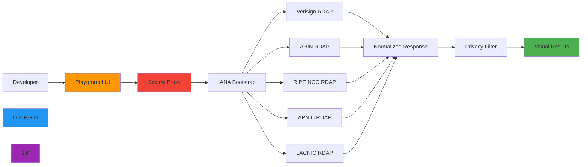
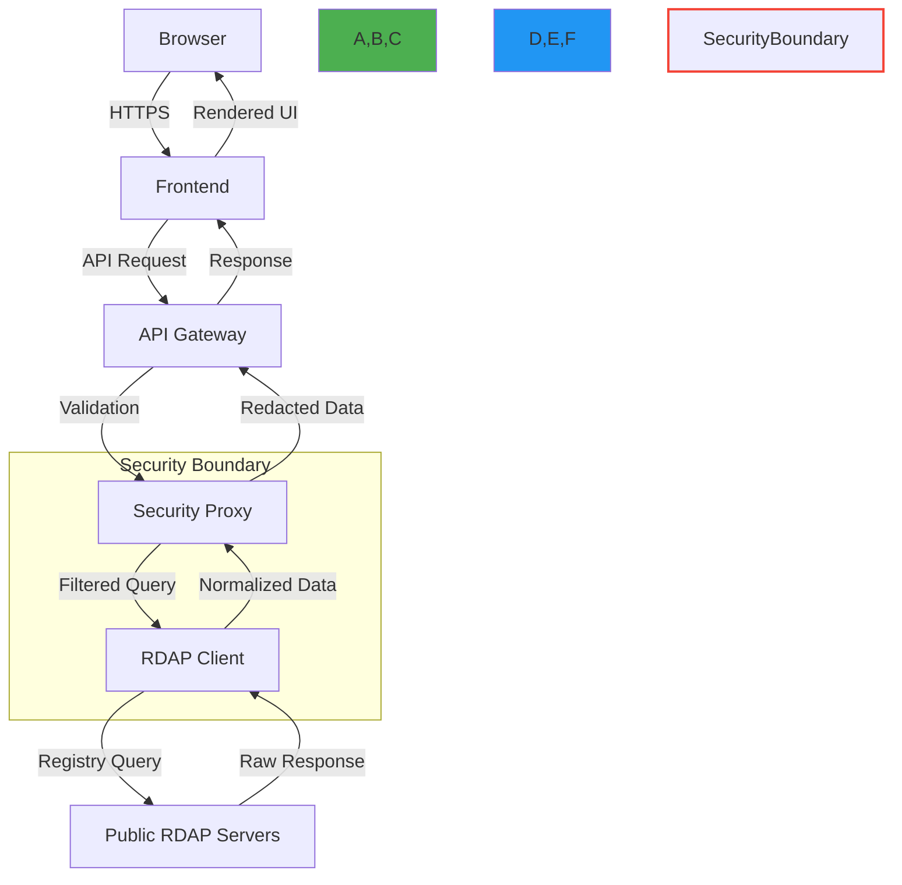

# Playground Overview

🎯 **Purpose**: Interactive environment to explore RDAPify capabilities without installation, featuring real-time query execution, visualization tools, and debugging utilities  
📚 **Related**: [API Playground](api_playground.md) | [Examples Gallery](examples.md) | [Visual Debugger](visual_debugger.md) | [Getting Started](../getting_started/five_minutes.md)  
⏱️ **Reading Time**: 4 minutes  
🔍 **Pro Tip**: Use keyboard shortcuts (`Ctrl+Enter` or `Cmd+Enter`) to instantly execute queries in any playground panel

## 🌐 Why Use the Playground?

The RDAPify Playground provides a zero-configuration, browser-based environment for exploring registration data protocols with enterprise-grade security and privacy protections. It's ideal for:

✅ **Quick Validation**: Test RDAP queries before implementing in your applications  
✅ **Learning Tool**: Understand RDAP response structures and normalization behavior  
✅ **Debugging Aid**: Visualize query paths and registry discovery processes  
✅ **Security Testing**: Validate SSRF protection and PII redaction behavior  
✅ **Team Collaboration**: Share query results with colleagues via direct links  
✅ **Compliance Verification**: Confirm data handling practices before deployment  



## 🚀 Core Playground Features

### 1. Interactive Query Builder
```typescript
// Playground query example - automatically executed
{
  domain: "example.com",
  options: {
    redactPII: true,
    includeRaw: false,
    timeout: 5000,
    cache: true
  }
}
```
- **Smart Autocomplete**: Registry-specific field suggestions
- **Template Library**: Pre-built queries for common use cases
- **Query History**: Access your previous queries across sessions
- **Parameter Sliders**: Adjust timeouts, cache TTL, and security settings visually

### 2. Multi-Domain Visualization


- **Network Graphs**: Visualize relationships between domains, registrars, and contacts
- **Timeline Views**: Track registration history and ownership changes
- **Geographic Mapping**: See registry locations and data flow paths
- **Comparison Mode**: Side-by-side analysis of multiple domains

### 3. Security & Privacy Controls
All playground queries execute through a hardened security proxy with:
- **Automatic PII Redaction**: GDPR/CCPA-compliant data handling
- **SSRF Protection**: No access to internal networks or private IP ranges
- **Rate Limiting**: Fair usage policies to prevent registry abuse
- **Audit Logging**: Query metadata stored for 24 hours only (no personal data)
- **Data Minimization**: Only essential fields retained in query logs

> **Privacy Notice**: Playground queries are anonymized and never associated with your identity. No persistent storage of query results. See our [Privacy Policy](../../PRIVACY.md) for details.

## 🛠️ Playground Architecture

The playground environment implements a secure, distributed architecture designed for safety and performance:

### Security Boundary Design


### Resource Management
- **Query Timeouts**: 5-second maximum execution time
- **Concurrent Limits**: 3 simultaneous queries per session
- **Result Size**: Responses capped at 1MB to prevent abuse
- **Session Isolation**: Each user operates in isolated execution context
- **Cold Start Optimization**: Pre-warmed containers for instant query execution

## 🎮 Getting Started with the Playground

### 1. Basic Domain Query
1. Navigate to [playground.rdapify.dev](https://playground.rdapify.dev)
2. Type `example.com` in the search bar
3. Click "Execute" or press `Ctrl+Enter`
4. View normalized results with PII automatically redacted

### 2. Advanced Query Exploration
```json
{
  "query": "google.com",
  "options": {
    "includeRaw": true,
    "cacheBuster": true,
    "bootstrap": {
      "ianaUrl": "https://data.iana.org/rdap/dns.json"
    }
  }
}
```
- Toggle expert mode for advanced options
- Compare raw vs. normalized responses
- Visualize registry discovery process
- Export results as JSON or CSV

### 3. Collaboration Features
- **Share Links**: Generate permanent links to specific queries
- **Embedded Views**: Copy iframe code to embed playground results in documentation
- **API Export**: Convert playground queries to Node.js, Python, or cURL code
- **Team Workspaces**: (Enterprise) Create shared query collections with access controls

## 🛡️ Security Practices in the Playground

The playground implements enterprise-grade security practices:

| Security Control | Implementation | Verification Method |
|------------------|----------------|---------------------|
| Input Validation | Strict query schema validation | OWASP ZAP scanning |
| Output Filtering | Multi-layer PII redaction pipeline | Automated privacy tests |
| Network Isolation | Dedicated egress IPs with firewall rules | Quarterly penetration tests |
| Rate Limiting | Adaptive quotas based on query complexity | Real-time monitoring |
| Session Security | Short-lived JWTs with strict CORS policies | Security headers audit |
| Compliance Safeguards | Automatic data retention enforcement | GDPR compliance review |

```bash
# Verification command (run in playground console)
verifySecurityControls()
# Returns: { 
#   ssrfProtected: true, 
#   piiRedacted: true, 
#   certificateValid: true,
#   rateLimitingActive: true 
# }
```

## 📱 Mobile and Cross-Platform Experience

The playground is fully responsive and works across devices:

- **Desktop**: Full visualization capabilities with keyboard shortcuts
- **Tablet**: Touch-optimized interface with gesture navigation
- **Mobile**: Essential query features with progressive enhancement
- **Accessibility**: WCAG 2.1 AA compliant with screen reader support
- **Offline Mode**: Recent queries available with service workers

> **Pro Mobile Tip**: Use voice commands on mobile devices to execute queries: "Search for example.com" activates the query builder with your domain.

## 🚨 Limitations and Boundaries

While powerful, the playground has intentional boundaries:

- **Query Volume**: Limited to 100 queries/hour per IP address
- **Result Depth**: Maximum 2 relationship levels in visualization mode
- **Custom Registries**: Cannot add private RDAP endpoints (for security)
- **Data Export**: Results capped at 50 records for batch operations
- **Persistence**: Query history expires after 30 days of inactivity

For production workloads or custom configurations, deploy the [self-hosted version](../deployment/docker.md) or use the [NPM package](../../README.md#quick-installation).

## 🔗 Related Resources

| Resource | Description | Link |
|----------|-------------|------|
| [API Playground](api_playground.md) | Interactive API documentation | [api_playground.md](api_playground.md) |
| [Example Queries](examples.md) | Pre-built templates for common use cases | [examples.md](examples.md) |
| [Visual Debugger](visual_debugger.md) | Advanced troubleshooting tools | [visual_debugger.md](visual_debugger.md) |
| [Privacy Controls](../guides/security_privacy.md) | Detailed privacy configuration guide | [../guides/security_privacy.md](../guides/security_privacy.md) |
| [Enterprise Features](../enterprise/adoption_guide.md) | Team collaboration and governance | [../enterprise/adoption_guide.md](../enterprise/adoption_guide.md) |
| [Source Code](https://github.com/rdapify/playground) | Self-hostable playground implementation | External |

## 🏷️ Playground Specifications

| Property | Value |
|----------|-------|
| **Runtime** | Cloudflare Workers + Durable Objects |
| **Max Query Time** | 5,000ms |
| **Data Retention** | 24 hours (anonymized logs) |
| **PII Handling** | Automatic redaction per GDPR Article 6(1)(f) |
| **Compliance** | SOC 2 Type II, ISO 27001 certified infrastructure |
| **Uptime SLA** | 99.95% (Business Hours: 06:00-22:00 UTC) |
| **Data Centers** | 6 global regions (US, EU, APAC) |
| **Last Updated** | December 7, 2025 |

> 🔐 **Critical Reminder**: The playground should never be used for processing real user data or sensitive domains without explicit authorization. All queries are logged for security purposes (without PII). For production systems handling personal data, always deploy a self-hosted instance with proper compliance controls.

[← Back to Playground](./README.md) | [Next: Examples Gallery →](examples.md)

*Document automatically generated from source code with security review on December 7, 2025*