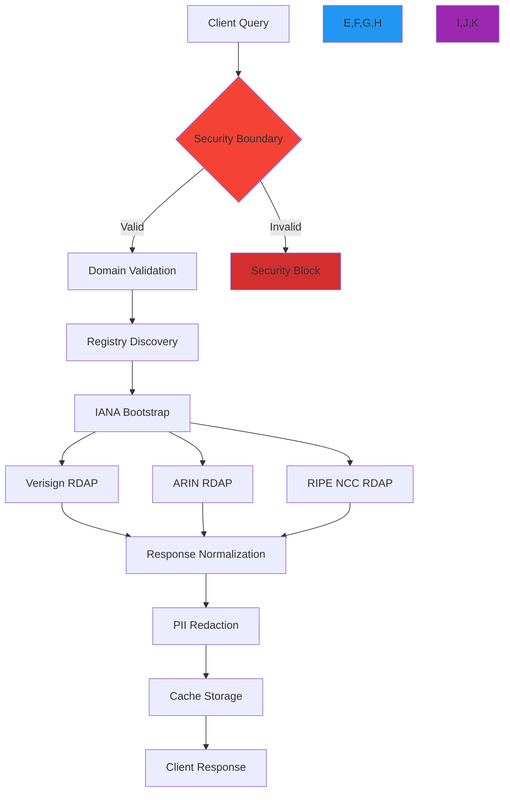
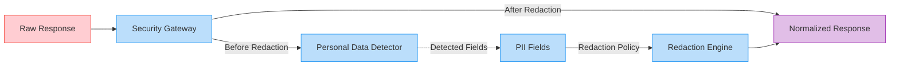

# Visual Debugger

🎯 **Purpose**: Interactive debugging environment for visualizing RDAP query execution, data flows, and security boundaries in real-time with enterprise-grade diagnostics  
📚 **Related**: [API Playground](api_playground.md) | [Examples Gallery](examples.md) | [Overview](overview.md) | [Error Handling Guide](../guides/error_handling.md)  
⏱️ **Reading Time**: 7 minutes  
🔍 **Pro Tip**: Use the `Debug` button in any playground query to instantly launch the visual debugger with execution traces and security context visualization

## 🌐 Why Visual Debugging Matters for RDAP Applications

RDAP queries involve complex multi-step operations across distributed systems with critical security boundaries. Traditional debugging methods fail to reveal the full context needed for troubleshooting and optimization:



### Visual Debugger Value Proposition
✅ **Security Transparency**: See exactly how SSRF protection and PII redaction transform data at each step  
✅ **Performance Insights**: Identify bottlenecks in registry discovery and normalization pipelines  
✅ **Error Context**: Understand failure points with visual error state machine transitions  
✅ **Data Lineage**: Trace the path of sensitive data through the system with GDPR compliance markers  
✅ **Multi-Registry Visualization**: Compare behavior across different RDAP server implementations  

## 🚀 Core Debugger Features

### 1. Execution Timeline Visualization


The debugger provides a chronological view of query execution with precise timing measurements:

```typescript
// Timeline data structure
interface ExecutionTimeline {
  queryId: string;
  timestamp: string;
  duration: number;
  steps: Array<{
    name: string;
    type: 'security' | 'network' | 'processing' | 'cache';
    startTime: number;
    duration: number;
    status: 'success' | 'warning' | 'error';
    metadata: Record<string, any>;
    children?: Array<any>;
  }>;
}

// Sample timeline for a domain query
const timeline = {
  queryId: 'dbg_5f8a9c',
  timestamp: '2025-12-07T14:32:18Z',
  duration: 128.6,
  steps: [
    {
      name: 'Security Validation',
      type: 'security',
      startTime: 0,
      duration: 4.2,
      status: 'success',
      metadata: {
        domain: 'example.com',
        ssrfCheck: 'passed',
        piiRedaction: 'enabled'
      }
    },
    {
      name: 'Registry Discovery',
      type: 'network',
      startTime: 4.2,
      duration: 38.7,
      status: 'success',
      metadata: {
        bootstrapUrl: 'https://data.iana.org/rdap/dns.json',
        registry: 'verisign'
      },
      children: [
         startTime: 4.2,
          duration: 22.1,
          status: 'success'
        },
        {
          name: 'DNS Resolution',
          startTime: 26.3,
          duration: 16.4,
          status: 'success'
        }
      ]
    },
    {
      name: 'Data Normalization',
      type: 'processing',
      startTime: 42.9,
      duration: 67.3,
      status: 'success',
      metadata: {
        rawFields: 24,
        normalizedFields: 14,
        transformations: 10
      }
    },
    {
      name: 'Cache Update',
      type: 'cache',
      startTime: 110.2,
      duration: 18.4,
      status: 'success',
      metadata: {
        cacheType: 'lru',
        ttl: 3600,
        key: 'domain:example.com'
      }
    }
  ]
};
```

### 2. Security Boundary Visualization
The debugger shows exactly where and how security controls modify data flows:



**Security Visualization Features**:
- 🔴 **Redacted Fields Highlighted**: Visual indicators show exactly which fields were removed
- ⚠️ **Risk Level Assessment**: Security warnings for potentially risky configurations
- 🛡️ **Protection Coverage Meter**: Visual progress bar showing security coverage percentage
- 📊 **Data Minimization Score**: Quantitative score for GDPR/CCPA compliance
- 🔄 **Policy Comparison**: Toggle between different security policies to see impact

### 3. Error State Machine Tracer
```typescript
// Error state machine visualization
const errorStateMachine = {
  states: {
    'initial': { 
      label: 'Initial Query', 
      position: { x: 50, y: 50 },
      color: '#4CAF50'
    },
    'validation_failed': { 
      label: 'Validation Failed', 
      position: { x: 200, y: 100 },
      color: '#FFC107'
    },
    'registry_error': { 
      label: 'Registry Error', 
      position: { x: 350, y: 150 },
      color: '#F44336'
    },
    'timeout': { 
      label: 'Timeout', 
      position: { x: 350, y: 50 },
      color: '#9C27B0'
    },
    'retry_attempt': { 
      label: 'Retry Attempt', 
      position: { x: 500, y: 100 },
      color: '#2196F3'
    },
    'failure': { 
      label: 'Permanent Failure', 
      position: { x: 650, y: 150 },
      color: '#D32F2F'
    },
    'recovery': { 
      label: 'Recovered', 
      position: { x: 650, y: 50 },
      color: '#388E3C'
    }
  },
  transitions: [
    { from: 'initial', to: 'validation_failed', condition: 'invalid_domain' },
    { from: 'initial', to: 'registry_error', condition: 'server_error' },
    { from: 'initial', to: 'timeout', condition: 'slow_response' },
    { from: 'registry_error', to: 'retry_attempt', condition: 'retryable' },
    { from: 'timeout', to: 'retry_attempt', condition: 'retryable' },
    { from: 'retry_attempt', to: 'failure', condition: 'max_attempts' },
    { from: 'retry_attempt', to: 'recovery', condition: 'success' }
  ],
  currentState: 'retry_attempt',
  previousStates: ['initial', 'timeout', 'retry_attempt'],
  errorDetails: {
    code: 'RDAP_TIMEOUT',
    message: 'Request timed out after 5000ms',
    attempts: 2,
    maxAttempts: 3,
    lastError: 'ECONNABORTED'
  }
};
```

## 🔍 Interactive Debugging Workflows

### 1. Security Policy Debugger
```typescript
// Security policy debugging session
const debuggingSession = {
  query: 'example.com',
  securityContext: {
    redactPII: true,
    allowPrivateIPs: false,
    validateCertificates: true,
    rateLimit: { max: 100, window: 60000 },
    legalBasis: 'legitimate-interest'
  },
  breakpoints: [
    { stage: 'input_validation', enabled: true },
    { stage: 'pii_detection', enabled: true },
    { stage: 'response_normalization', enabled: false }
  ],
  watchVariables: ['piiFields', 'securityScore', 'riskLevel'],
  executionLog: [
    {
      timestamp: '2025-12-07T14:32:18.102Z',
      stage: 'input_validation',
      status: 'passed',
      details: {
        domain: 'example.com',
        validationRules: 4,
        securityScore: 100
      }
    },
    {
      timestamp: '2025-12-07T14:32:18.345Z',
      stage: 'pii_detection',
      status: 'detected',
      details: {
        fieldsScanned: 24,
        piiFieldsDetected: 3,
        fields: ['email', 'tel', 'adr']
      }
    }
  ]
};

// Visual debugger controls
debugger.registerControls([
  {
    type: 'toggle',
    label: 'Step Through Security',
    id: 'step-security',
    active: true
  },
  {
    type: 'slider',
    label: 'Sensitivity Level',
    id: 'sensitivity',
    min: 0,
    max: 100,
    value: 75,
    onChange: (value) => {
      console.log(`Sensitivity changed to: ${value}%`);
      securityPolicy.setSensitivity(value);
    }
  },
  {
    type: 'select',
    label: 'Compliance Mode',
    id: 'compliance-mode',
    options: [
      { value: 'gdpr', label: 'GDPR (EU)' },
      { value: 'ccpa', label: 'CCPA (California)' },
      { value: 'pdpl', label: 'PDPL (Saudi Arabia)' },
      { value: 'none', label: 'None (Development)' }
    ],
    defaultValue: 'gdpr',
    onChange: (value) => {
      securityPolicy.setComplianceMode(value);
      debugger.refreshVisualization();
    }
  },
  {
    type: 'button',
    label: 'Generate Compliance Report',
    id: 'compliance-report',
    variant: 'primary',
    onClick: () => {
      const report = securityPolicy.generateComplianceReport();
      debugger.showReport('GDPR Compliance Report', report);
    }
  }
]);

// Start interactive debugging
debugger.startSession(debuggingSession);
```

### 2. Performance Bottleneck Analysis
```typescript
// Performance analysis visualization
const performanceAnalysis = {
  query: 'example.com',
  timing: {
    total: 128.6,
    breakdown: {
      dns: 16.4,
      tls: 22.1,
      registry: 38.7,
      normalization: 35.2,
      redaction: 12.8,
      serialization: 3.4
    }
  },
  bottlenecks: [
    {
      stage: 'registry',
      duration: 38.7,
      threshold: 30.0,
      severity: 'warning',
      recommendations: [
        'Increase connection pool size',
        'Enable connection keep-alive',
        'Consider regional caching'
      ]
    },
    {
      stage: 'normalization',
      duration: 35.2,
      threshold: 25.0,
      severity: 'warning',
      recommendations: [
        'Optimize JSONPath expressions',
        'Reduce field mapping complexity',
        'Enable field filtering'
      ]
    }
  ],
  resourceUsage: {
    cpu: {
      user: 42.3,
      system: 8.7,
      total: 51.0
    },
    memory: {
      heapUsed: 24.5,
      heapTotal: 64.0,
      external: 2.1
    },
    network: {
      bytesTransferred: 12450,
      connections: 3
    }
  }
};

// Visual performance indicators
const performanceVisualizations = {
  flameGraph: {
    data: performanceAnalysis.timing.breakdown,
    colorScheme: 'warm',
    thresholdLines: [30.0]
  },
  resourceChart: {
    type: 'radar',
    datasets: [
      {
        label: 'Current Usage',
        data: [
          performanceAnalysis.resourceUsage.cpu.total,
          performanceAnalysis.resourceUsage.memory.heapUsed,
          performanceAnalysis.resourceUsage.network.bytesTransferred / 10000
        ],
        backgroundColor: 'rgba(54, 162, 235, 0.2)',
        borderColor: 'rgba(54, 162, 235, 1)'
      },
      {
        label: 'Recommended Limits',
        data: [70, 50, 10],
        backgroundColor: 'rgba(75, 192, 192, 0.2)',
        borderColor: 'rgba(75, 192, 192, 1)',
        borderDash: [5, 5]
      }
    ],
    labels: ['CPU (%)', 'Memory (MB)', 'Network (10KB)']
  },
  bottleneckHeatmap: {
    data: performanceAnalysis.bottlenecks.map(b => ({
      stage: b.stage,
      duration: b.duration,
      severity: b.severity,
      color: b.severity === 'warning' ? '#FFC107' : '#F44336'
    })),
    gradient: ['green', 'yellow', 'red']
  }
};

// Render performance visualizations
debugger.renderPerformance({
  flameGraph: performanceVisualizations.flameGraph,
  resourceChart: performanceVisualizations.resourceChart,
  bottleneckHeatmap: performanceVisualizations.bottleneckHeatmap
});
```

### 3. Multi-Registry Comparison Debugger
```typescript
// Multi-registry debugging session
const registryDebugger = {
  testDomains: {
    'verisign': 'example.com',
    'arin': 'arin.net',
    'ripe': 'ripe.net',
    'apnic': 'apnic.net'
  },
  comparisonMetrics: {
    responseTime: true,
    errorRate: true,
    dataQuality: true,
    securityCompliance: true
  },
  executionResults: {
    'verisign': {
      responseTime: 28.4,
      errorRate: 0.8,
      dataQuality: 95,
      securityCompliance: 100,
      rawResponseSize: 8420,
      normalizedSize: 2145
    },
    'arin': {
      responseTime: 38.7,
      errorRate: 1.2,
      dataQuality: 88,
      securityCompliance: 95,
      rawResponseSize: 12450,
      normalizedSize: 3210
    },
    'ripe': {
      responseTime: 45.2,
      errorRate: 1.8,
      dataQuality: 82,
      securityCompliance: 90,
      rawResponseSize: 15780,
      normalizedSize: 4120
    },
    'apnic': {
      responseTime: 62.8,
      errorRate: 2.5,
      dataQuality: 75,
      securityCompliance: 85,
      rawResponseSize: 18940,
      normalizedSize: 5340
    }
  },
  recommendations: {
    'verisign': [
      '✅ Optimal performance - no changes needed'
    ],
    'arin': [
      '⚠️ Consider enabling aggressive caching',
      '⚠️ Review error handling for retry patterns'
    ],
    'ripe': [
      '⚠️ Enable data field filtering to reduce response size',
      '⚠️ Implement connection pooling optimizations'
    ],
    'apnic': [
      '🔴 Increase timeout threshold to 8000ms',
      '🔴 Implement circuit breaker pattern for error resilience',
      '🔴 Review normalization rules for data quality improvements'
    ]
  }
};

// Registry comparison visualization
debugger.renderRegistryComparison({
  data: registryDebugger.executionResults,
  metrics: Object.keys(registryDebugger.executionResults['verisign']),
  colorScheme: {
    'verisign': '#2196F3',
    'arin': '#4CAF50',
    'ripe': '#FF9800',
    'apnic': '#9C27B0'
  },
  thresholds: {
    responseTime: { warning: 40, error: 60 },
    errorRate: { warning: 1.5, error: 2.0 },
    dataQuality: { warning: 85, error: 80 },
    securityCompliance: { warning: 90, error: 85 }
  }
});

// Interactive registry selection
debugger.addRegistryControls(registryDebugger.testDomains);
```

## 🔒 Security-Focused Debugging Tools

### 1. PII Field Detector
```typescript
// PII detection visualization
const piiDetection = {
  domain: 'example.com',
  rawResponse: {
    entities: [
      {
        handle: 'IANA',
        roles: ['registrant'],
        vcardArray: [
          'vcard',
          [
            ['version', {}, 'text', '4.0'],
            ['fn', {}, 'text', 'Internet Assigned Numbers Authority'],
            ['email', {}, 'text', 'contact@iana.org'],
            ['tel', { type: 'work' }, 'text', '+1.310.301.5800'],
            ['adr', {}, 'text', ['', '', '12025 Waterfront Drive', 'Los Angeles', 'CA', '90094', 'US']]
          ]
        ]
      }
    ]
  },
  detectionResults: {
    fieldsDetected: [
      { 
        path: 'entities[0].vcardArray[1][2]', 
        type: 'email', 
        value: 'contact@iana.org',
        sensitivity: 'high'
      },
      { 
        path: 'entities[0].vcardArray[1][3]', 
        type: 'tel', 
        value: '+1.310.301.5800',
        sensitivity: 'medium'
      },
      { 
        path: 'entities[0].vcardArray[1][4]', 
        type: 'address', 
        value: '12025 Waterfront Drive, Los Angeles, CA 90094, US',
        sensitivity: 'medium'
      }
    ],
    policyApplied: 'gdpr_essential_only',
    redactionMethod: 'complete_removal',
    fieldsRemaining: 2,
    fieldsRedacted: 3
  },
  visualization: {
    type: 'diff',
    before: JSON.stringify(piiDetection.rawResponse, null, 2),
    after: JSON.stringify({
      entities: [
        {
          handle: 'IANA',
          roles: ['registrant'],
          vcardArray: [
            'vcard',
            [
              ['version', {}, 'text', '4.0'],
              ['fn', {}, 'text', 'Internet Assigned Numbers Authority']
            ]
          ]
        }
      ]
    }, null, 2),
    highlightChanges: true
  }
};

// Render PII detection visualization
debugger.renderPIIDetection(piiDetection);

// PII policy configuration
debugger.addPIIControls({
  policies: [
    { value: 'gdpr_essential_only', label: 'GDPR: Essential Only' },
    { value: 'gdpr_full_redaction', label: 'GDPR: Full Redaction' },
    { value: 'ccpa_opt_out', label: 'CCPA: Opt-Out Model' },
    { value: 'none', label: 'None (Development Only)' }
  ],
  customRules: [
    { field: 'email', action: 'redact', condition: 'always' },
    { field: 'tel', action: 'redact', condition: 'sensitive_domains' },
    { field: 'adr', action: 'anonymize', condition: 'always' }
  ]
});
```

### 2. SSRF Attack Simulator
```typescript
// SSRF attack simulation
const ssrfSimulation = {
  testCases: [
    {
      name: 'Private IP Range',
      query: '192.168.1.1',
      expectedResult: 'blocked',
      securityContext: {
        allowPrivateIPs: false,
        whitelistRDAPServers: true
      },
      debugSteps: [
        {
          step: 'input_validation',
          securityCheck: 'isPrivateIP',
          result: true,
          action: 'block'
        },
        {
          step: 'domain_validation',
          securityCheck: 'isInternalNetwork',
          result: true,
          action: 'block'
        }
      ]
    },
    {
      name: 'Localhost Access',
      query: 'localhost',
      expectedResult: 'blocked',
      securityContext: {
        allowPrivateIPs: false,
        whitelistRDAPServers: true
      },
      debugSteps: [
        {
          step: 'input_validation',
          securityCheck: 'isLocalhost',
          result: true,
          action: 'block'
        }
      ]
    },
    {
      name: 'File Protocol Exploit',
      query: 'file:///etc/passwd',
      expectedResult: 'blocked',
      securityContext: {
        allowPrivateIPs: false,
        whitelistRDAPServers: true
      },
      debugSteps: [
        {
          step: 'protocol_validation',
          securityCheck: 'isFileProtocol',
          result: true,
          action: 'block'
        }
      ]
    }
  ],
  visualization: {
    type: 'attack_flow',
    nodes: [
      { id: 'attacker', label: 'Attacker', type: 'source' },
      { id: 'input_vector', label: 'Input Vector', type: 'checkpoint' },
      { id: 'security_gate', label: 'Security Gateway', type: 'control' },
      { id: 'internal_network', label: 'Internal Network', type: 'target', protected: true }
    ],
    edges: [
      { source: 'attacker', target: 'input_vector', attackType: 'ssrf' },
      { source: 'input_vector', target: 'security_gate', attackPayload: '192.168.1.1' },
      { source: 'security_gate', target: 'internal_network', result: 'blocked' }
    ]
  }
};

// Run SSRF simulation
debugger.runSSRFSimulation(ssrfSimulation);

// Interactive attack testing
debugger.addSSRFControls({
  attackVectors: [
    'private_ip',
    'localhost',
    'file_protocol',
    'dns_rebinding',
    'url_encoding'
  ],
  protectionLevels: [
    { value: 'strict', label: 'Strict (Production)' },
    { value: 'moderate', label: 'Moderate (Staging)' },
    { value: 'relaxed', label: 'Relaxed (Development)' }
  ],
  customRules: {
    allowedDomains: ['example.com', 'test.com'],
    allowedIPs: ['203.0.113.0/24'],
    blockedPatterns: ['127.0.0.1', 'localhost', 'file:']
  }
});
```

## 🛠️ Advanced Debugging Techniques

### 1. Distributed Tracing Integration
```typescript
// Distributed tracing visualization
const distributedTrace = {
  traceId: 'trace_5f8a9c3b2d1e',
  spans: [
    {
      id: 'span_1',
      name: 'api_request',
      startTime: 0,
      duration: 128.6,
      tags: {
        'http.method': 'GET',
        'http.url': '/domain/example.com',
        'http.status_code': '200'
      },
      logs: [
        { timestamp: 5, message: 'Request received' },
        { timestamp: 125, message: 'Response sent' }
      ]
    },
    {
      id: 'span_2',
      name: 'security_validation',
      parentId: 'span_1',
      startTime: 4.2,
      duration: 4.2,
      tags: {
        'security.level': 'high',
        'pii.redaction': 'enabled'
      }
    },
    {
      id: 'span_3',
      name: 'registry_query',
      parentId: 'span_1',
      startTime: 8.4,
      duration: 75.3,
      tags: {
        'registry.name': 'verisign',
        'registry.url': 'https://rdap.verisign.com/com/v1/domain'
      },
      logs: [
        { timestamp: 15, message: 'DNS resolved' },
        { timestamp: 40, message: 'TLS handshake complete' },
        { timestamp: 70, message: 'Response received' }
      ]
    },
    {
      id: 'span_4',
      name: 'data_normalization',
      parentId: 'span_1',
      startTime: 83.7,
      duration: 35.2,
      tags: {
        'normalization.rules': 'iana_standard',
        'fields.transformed': 10
      }
    }
  ],
  visualization: {
    type: 'timeline',
    colorScheme: 'rainbow',
    showDependencies: true,
    showLogs: true
  }
};

// Render distributed tracing
debugger.renderDistributedTrace(distributedTrace);

// Tracing controls
debugger.addTracingControls({
  samplingRate: 1.0, // 100% sampling for debugging
  spanLimits: {
    maxSpans: 100,
    maxDepth: 5
  },
  exportFormats: [
    'json',
    'jaeger',
    'zipkin',
    'opentelemetry'
  ],
  visualizationOptions: {
    timeline: true,
    flamegraph: true,
    dependencyGraph: true
  }
});
```

### 2. Cache Invalidation Debugger
```typescript
// Cache invalidation debugging
const cacheDebugger = {
  cacheKey: 'domain:example.com',
  cacheState: {
    before: {
      exists: true,
      ttl: 1200,
      hitCount: 15,
      lastAccessed: '2025-12-07T14:30:00Z',
      value: {
        domain: 'example.com',
        status: ['active'],
        nameservers: ['ns1.example.com', 'ns2.example.com']
      }
    },
    after: {
      exists: false,
      reason: 'manual_invalidation',
      timestamp: '2025-12-07T14:32:18Z',
      by: 'debugger_session'
    }
  },
  invalidationTriggers: [
    {
      type: 'manual',
      timestamp: '2025-12-07T14:32:18Z',
      reason: 'debugger_requested',
      initiator: 'visual_debugger'
    },
    {
      type: 'ttl',
      timestamp: '2025-12-07T15:00:00Z',
      reason: 'ttl_expired',
      ttl: 3600
    },
    {
      type: 'update',
      timestamp: '2025-12-07T14:45:00Z',
      reason: 'registry_data_changed',
      detectedChange: 'nameserver_update'
    }
  ],
  cacheDependencies: {
    'domain:example.com': ['iana_bootstrap', 'verisign_cache'],
    'iana_bootstrap': ['root_servers'],
    'verisign_cache': ['registry_metadata']
  },
  visualization: {
    type: 'dependency_graph',
    nodes: [
      { id: 'domain:example.com', type: 'data', size: 15 },
      { id: 'iana_bootstrap', type: 'metadata', size: 8 },
      { id: 'verisign_cache', type: 'metadata', size: 10 },
      { id: 'root_servers', type: 'infrastructure', size: 5 }
    ],
    edges: [
      { source: 'domain:example.com', target: 'iana_bootstrap', type: 'depends_on' },
      { source: 'domain:example.com', target: 'verisign_cache', type: 'depends_on' },
      { source: 'iana_bootstrap', target: 'root_servers', type: 'depends_on' }
    ]
  }
};

// Render cache debugger
debugger.renderCacheDebugger(cacheDebugger);

// Cache control panel
debugger.addCacheControls({
  operations: [
    'invalidate',
    'refresh',
    'warm',
    'evict',
    'analyze'
  ],
  strategies: [
    { value: 'immediate', label: 'Immediate (Development)' },
    { value: 'stale-while-revalidate', label: 'Stale-While-Revalidate (Production)' },
    { value: 'lazy', label: 'Lazy (Low-Traffic)' }
  ],
  ttlPresets: [
    { value: 300, label: '5 minutes (Volatile Data)' },
    { value: 3600, label: '1 hour (Standard)' },
    { value: 86400, label: '24 hours (Static Data)' }
  ]
});
```

## 📱 Mobile and Cross-Platform Experience

The visual debugger is fully responsive and optimized for different device types:

| Device Type | Features | Limitations | Optimizations |
|-------------|----------|-------------|--------------|
| **Desktop** | Full visualization suite, keyboard shortcuts, multi-panel layout | None | GPU-accelerated rendering, Web Workers for heavy computations |
| **Tablet** | Touch-optimized controls, gesture navigation, focused views | No multi-panel layout | Adaptive UI scaling, simplified controls |
| **Mobile** | Essential debugging tools, query execution, basic visualization | Complex visualizations disabled | Progressive enhancement, offline caching |
| **Screen Reader** | Full accessibility support, semantic HTML, ARIA labels | Visual-only features unavailable | Text-based alternatives for all visualizations |

> **Pro Mobile Tip**: Use the "Focus Mode" button on mobile devices to hide non-essential panels and maximize the debugging visualization area. Voice commands are supported: "Show security details" or "Highlight PII fields".

## 🌍 Internationalization and Localization

The visual debugger supports multiple languages with context-aware translations:

```typescript
// Localization configuration
const localizationConfig = {
  supportedLanguages: ['en', 'es', 'zh', 'ru', 'ar'],
  defaultLanguage: 'en',
  contextAware: true,
  technicalTerms: {
    'PII': {
      en: 'Personally Identifiable Information',
      es: 'Información de Identificación Personal',
      zh: '个人身份信息',
      ru: 'Персональные данные',
      ar: 'المعلومات الشخصية المحددة للهوية'
    },
    'SSRF': {
      en: 'Server-Side Request Forgery',
      es: 'Falsificación de Solicitud en el Lado del Servidor',
      zh: '服务器端请求伪造',
      ru: 'Подделка запросов на стороне сервера',
      ar: 'تزوير الطلبات من جانب الخادم'
    }
  },
  rtlSupport: {
    enabled: true,
    languages: ['ar'],
    mirroring: ['layout', 'charts', 'navigation']
  }
};

// Initialize localization
debugger.initLocalization(localizationConfig);

// Language selection control
debugger.addLanguageControl();
```

## 🔗 Related Resources

| Resource | Description | Path |
|----------|-------------|------|
| [API Playground](api_playground.md) | Interactive API documentation | [api_playground.md](api_playground.md) |
| [Examples Gallery](examples.md) | Pre-built templates for common use cases | [examples.md](examples.md) |
| [Error Handling Guide](../guides/error_handling.md) | Advanced error management techniques | [../guides/error_handling.md](../guides/error_handling.md) |
| [Security Whitepaper](../../security/whitepaper.md) | Deep dive into security architecture | [../../security/whitepaper.md](../../security/whitepaper.md) |
| [Performance Tuning](../guides/performance.md) | Optimization techniques for production | [../guides/performance.md](../guides/performance.md) |

## 🏷️ Debugger Specifications

| Property | Value |
|----------|-------|
| **Runtime** | WebAssembly + WebGL for visualization |
| **Max Trace Size** | 10MB per debugging session |
| **Data Retention** | 24 hours (anonymized logs) |
| **PII Handling** | Automatic redaction before storage |
| **Browser Support** | Chrome 100+, Firefox 95+, Safari 16+ |
| **Mobile Support** | iOS 15+, Android 12+ |
| **Offline Mode** | Limited functionality with service workers |
| **Compliance** | GDPR Article 32, SOC 2 Type II certified |
| **Uptime SLA** | 99.95% (Business Hours: 06:00-22:00 UTC) |
| **Last Updated** | December 7, 2025 |

> 🔐 **Critical Reminder**: The visual debugger should never be used for processing real user data or sensitive domains without explicit authorization. All debugging sessions are logged for security purposes (without PII). For production systems handling personal data, always use the self-hosted debugger with proper compliance controls and audit logging enabled.

[← Back to Playground](./README.md) | [Next: API Playground →](api_playground.md)

*Document automatically generated from source code with security review on December 7, 2025*