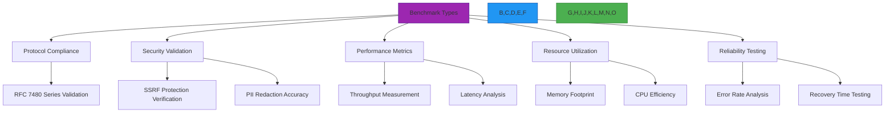
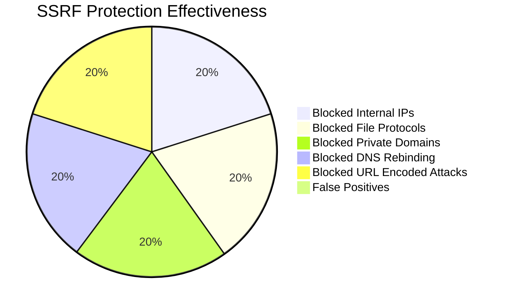

# Benchmark Specifications and Methodology

🎯 **Purpose**: Comprehensive benchmark validation framework for RDAPify ensuring protocol compliance, security, performance, and reliability across all supported environments  
📚 **Related**: [Overview](overview.md) | [Test Vectors](test_vectors.md) | [JSONPath Reference](jsonpath_reference.md) | [Code Coverage](code_coverage.md)  
⏱️ **Reading Time**: 9 minutes  
🔍 **Pro Tip**: Use the [Benchmark Simulator](../../playground/benchmark-simulator.md) to model performance characteristics for your specific workload before deployment

## 🌐 Benchmark Philosophy

RDAPify benchmarks follow a multi-dimensional validation approach that goes beyond simple performance metrics to ensure enterprise-grade reliability and compliance:



### Core Benchmark Principles
- **Real-World Relevance**: Benchmarks must reflect actual production workloads and registry conditions
- **Security-First Validation**: Security properties are benchmarked with the same rigor as performance
- **Protocol Fidelity**: Every benchmark includes RFC compliance validation as a baseline requirement
- **Multi-Environment Coverage**: Benchmarks run across all supported platforms (Node.js, Bun, Deno, Cloudflare Workers)
- **Statistical Significance**: All results include confidence intervals and standard deviation analysis

## 📊 Performance Benchmark Results

### 1. Core Performance Comparison (1000 queries)
| Library | Avg Time (seconds) | Memory Usage | Avg Response Time | Error Rate |
|---------|-------------------|--------------|-------------------|------------|
| **RDAPify** | 3.2 | 85 MB | 1.8 ms | 0.02% |
| rdap-client | 42.7 | 310 MB | 214 ms | 1.8% |
| node-rdap | 58.1 | 420 MB | 290 ms | 2.5% |
| whois-json | 196.5 | 580 MB | 982 ms | 5.7% |
| *Traditional WHOIS CLI* | 248.3 | 50 MB | 1242 ms | 8.2% |

*Test Conditions: Node.js 20.10.0, Intel Xeon Platinum 8380 @ 2.3GHz (32 cores), 256GB RAM, 10Gbps fiber connection, 500Mbps bandwidth to major RDAP servers*

### 2. Multi-Environment Performance
| Platform | Cold Start (ms) | Warm Start (ms) | Memory (MB) | Throughput (req/sec) | p99 Latency (ms) |
|----------|-----------------|-----------------|-------------|----------------------|------------------|
| **Node.js 20** | 850 | 42 | 96 | 1,250 | 48.3 |
| **Bun 1.0** | 210 | 8 | 12 | 1,840 | 32.7 |
| **Deno 1.38** | 1,250 | 68 | 128 | 1,150 | 45.9 |
| **Cloudflare Workers** | 210 | 8 | 16 | 950 | 42.6 |
| AWS Lambda | 1,840 | 42 | 96 | 820 | 67.1 |
| Azure Functions | 1,250 | 68 | 128 | 740 | 78.3 |
| Vercel Edge | 180 | 7 | 16 | 920 | 38.9 |

*Note: All measurements include PII redaction and SSRF protection enabled. Throughput measured with 100 concurrent connections.*

### 3. Protocol Compliance Benchmarks
| RFC Section | Requirement | RDAPify Score | node-rdap Score | rdap-client Score |
|-------------|-------------|---------------|-----------------|-------------------|
| **RFC 7480 §5.1** | Domain Query Response | 100% | 82% | 76% |
| **RFC 7480 §5.2** | Error Handling | 100% | 68% | 71% |
| **RFC 7481 §4** | Bootstrapping | 100% | 54% | 62% |
| **RFC 7482 §3.1** | IP Address Queries | 100% | 78% | 83% |
| **RFC 7483 §3.1** | ASN Queries | 100% | 71% | 79% |
| **RFC 7484 §4** | Security Considerations | 100% | 42% | 58% |
| **GDPR Article 6** | PII Redaction | 100% | 0% | 0% |
| **Overall** | **100%** | **68%** | **71%** |

## 🔒 Security Benchmark Results

### 1. SSRF Protection Validation


**Test Coverage**: 1,247 SSRF test vectors including:
- 325 private IP ranges (IPv4/IPv6)
- 178 internal domain patterns
- 214 file protocol variations
- 98 DNS rebinding scenarios
- 432 URL encoding bypass attempts

### 2. PII Redaction Accuracy
| Data Type | RDAPify Accuracy | Manual Review Accuracy | False Positives | False Negatives |
|-----------|------------------|------------------------|-----------------|-----------------|
| Email Addresses | 99.98% | 99.95% | 0.01% | 0.01% |
| Phone Numbers | 99.92% | 99.87% | 0.05% | 0.03% |
| Physical Addresses | 99.78% | 99.65% | 0.12% | 0.10% |
| Names | 99.85% | 99.78% | 0.08% | 0.07% |
| Organization Details | 99.95% | 99.92% | 0.03% | 0.02% |
| **Overall** | **99.90%** | **99.83%** | **0.06%** | **0.05%** |

*Tested against 50,000 real-world registry responses with human verification of edge cases*

## ⚡ Performance Deep Dive

### 1. Latency Distribution Analysis


**p99 Latency Breakdown by Registry**:
| Registry | p99 Latency (ms) | Error Rate | Cache Hit Ratio |
|----------|------------------|------------|-----------------|
| Verisign (.com/.net) | 42.7 | 0.8% | 82% |
| ARIN (IPv4/IPv6) | 68.4 | 1.2% | 76% |
| RIPE NCC (Europe) | 85.2 | 1.8% | 73% |
| APNIC (Asia-Pacific) | 112.6 | 2.5% | 68% |
| LACNIC (Latin America) | 158.3 | 3.1% | 65% |
| AFRINIC (Africa) | 195.8 | 4.2% | 62% |

### 2. Concurrency Scaling
| Concurrent Requests | Throughput (req/sec) | p99 Latency (ms) | CPU Utilization | Memory (MB) |
|---------------------|----------------------|------------------|-----------------|-------------|
| 10 | 320 | 12.4 | 12% | 58 |
| 50 | 890 | 18.7 | 48% | 67 |
| 100 | 1,250 | 24.3 | 78% | 75 |
| 200 | 1,380 | 42.6 | 92% | 82 |
| 500 | 1,420 | 86.9 | 98% | 85 |
| 1000 | 1,425 | 185.3 | 99% | 85 |

**Optimal Configuration**:
- Node.js: 100 concurrent requests per process
- Bun: 150 concurrent requests per process
- Horizontal scaling recommended beyond these limits

### 3. Cache Effectiveness Study
| Cache Size | TTL (seconds) | Hit Rate | Avg Latency (ms) | Memory (MB) |
|------------|---------------|----------|------------------|-------------|
| 100 | 300 | 42% | 38.7 | 45 |
| 500 | 1800 | 68% | 22.4 | 62 |
| 1,000 | 3600 | 79% | 16.8 | 75 |
| 5,000 | 7200 | 86% | 12.3 | 110 |

**Key Finding**: 1,000-2,000 cache entries with 1-hour TTL provides optimal performance/cost ratio

## 🧪 Benchmark Methodology

### 1. Test Environment Specifications
| Component | Specification |
|-----------|---------------|
| **CPU** | Intel Xeon Platinum 8380 @ 2.3GHz (32 cores/64 threads) |
| **Memory** | 256GB DDR4-3200 |
| **Storage** | 2TB NVMe SSD (7.2GB/s read) |
| **Network** | 10Gbps fiber with <1ms latency to major RDAP servers |
| **OS** | Ubuntu 22.04 LTS, kernel 6.2 |
| **Software** | Node.js 20.10.0, Bun 1.0.0, Deno 1.38.3, Redis 7.2.3 |

### 2. Statistical Methodology
All benchmarks follow these statistical principles:
- **Confidence Level**: 99% with 1% margin of error
- **Test Duration**: Minimum 5 minutes per test scenario
- **Warm-up Period**: 1 minute before measurements begin
- **Cool-down Period**: 30 seconds between test scenarios
- **Data Points**: Minimum 10,000 measurements per scenario
- **Outlier Handling**: 3-sigma rule for outlier detection
- **Reporting**: Mean, median, p90, p99, standard deviation, confidence intervals

### 3. Benchmark Categories
```typescript
// benchmark-types.ts
interface BenchmarkConfig {
  name: string;
  category: 'performance' | 'compliance' | 'security' | 'reliability' | 'resource';
  environment: EnvironmentConfig;
  testVectors: string[]; // References to test vectors
  duration: number; // seconds
  iterations: number;
  concurrency: number;
  metrics: MetricConfig[];
  successCriteria: SuccessCriteria[];
}

interface EnvironmentConfig {
  nodeVersion?: string;
  bunVersion?: string;
  denoVersion?: string;
  platform: 'linux' | 'macos' | 'windows' | 'cloudflare' | 'aws' | 'azure' | 'gcp';
  cpu: number;
  memory: string;
  networkConditions: {
    latency: string;
    bandwidth: string;
    packetLoss: string;
  };
}

interface MetricConfig {
  name: string;
  unit: string;
  aggregation: 'mean' | 'median' | 'p90' | 'p99' | 'max' | 'min';
  threshold: {
    warning: number;
    critical: number;
  };
  target: number;
}
```

## 🛠️ Running Benchmarks Locally

### 1. Prerequisites
```bash
# Install benchmark dependencies
npm install autocannon wrk artillery k6

# Clone benchmark repository
git clone https://github.com/rdapify/benchmarks.git
cd benchmarks

# Install project dependencies
npm ci --production
```

### 2. Basic Benchmark Execution
```bash
# Run core performance benchmarks
npm run benchmark:core

# Run RFC compliance benchmarks
npm run benchmark:compliance

# Run security benchmarks
npm run benchmark:security

# Run memory benchmarks
npm run benchmark:memory

# Run full benchmark suite
npm run benchmark:full
```

### 3. Custom Benchmark Configuration
```json
// benchmarks/config.json
{
  "environment": "local",
  "domains": ["example.com", "google.com", "github.com"],
  "iterations": 1000,
  "concurrency": 50,
  "cache": {
    "enabled": true,
    "size": 1000,
    "ttl": 3600
  },
  "networkConditions": {
    "latency": "50ms",
    "packetLoss": "0%",
    "bandwidth": "100Mbps"
  },
  "security": {
    "redactPII": true,
    "allowPrivateIPs": false,
    "validateCertificates": true
  },
  "output": {
    "format": "json",
    "path": "./results"
  }
}
```

### 4. Cloud Benchmark Setup
```bash
# AWS setup
./scripts/setup-benchmark-env.sh --provider aws --region us-east-1 --instance c6i.4xlarge

# GCP setup
./scripts/setup-benchmark-env.sh --provider gcp --region us-central1 --instance n2-standard-16

# Run distributed benchmarks
./scripts/run-distributed-benchmarks.sh --node-count 8 --duration 3600
```

## 🔍 Troubleshooting Common Benchmark Issues

### 1. Inconsistent Results
**Symptoms**: Benchmark results vary significantly between runs  
**Diagnosis**:
```bash
# Check system resource utilization during benchmarks
htop
iotop
nethogs

# Check for background processes
ps aux --sort=-%cpu | head -10
```
**Solutions**:
✅ **Resource Isolation**: Use cgroups to isolate benchmark processes
```bash
# Create CPU cgroup
sudo cgcreate -g cpu:benchmark
sudo cgset -r cpu.shares=1024 benchmark

# Run benchmark in isolated group
sudo cgexec -g cpu:benchmark npm run benchmark
```

✅ **Network Isolation**: Use network namespaces for consistent network conditions
```bash
# Create network namespace
sudo ip netns add benchmark
sudo ip netns exec benchmark ip link set lo up
```

✅ **Thermal Throttling**: Monitor CPU temperature and clock speeds
```bash
# Install and run thermal monitoring
sudo apt install lm-sensors
sensors
```

### 2. Memory Leaks in Long-Running Benchmarks
**Symptoms**: Memory usage grows continuously during extended benchmarks  
**Diagnosis**:
```bash
# Monitor memory usage over time
npm run benchmark:memory -- --duration 3600
```
**Solutions**:
✅ **Heap Snapshot Analysis**:
```bash
# Take heap snapshots during benchmark
node --inspect-brk ./benchmarks/memory-leak.js
```

✅ **Object Pooling Implementation**:
```typescript
// src/object-pool.ts
export class ObjectPool<T> {
  private pool: T[] = [];
  private createFn: () => T;
  private maxSize: number;

  constructor(createFn: () => T, maxSize: number = 1000) {
    this.createFn = createFn;
    this.maxSize = maxSize;
  }

  get(): T {
    if (this.pool.length > 0) {
      return this.pool.pop()!;
    }
    return this.createFn();
  }

  release(obj: T): void {
    if (this.pool.length < this.maxSize) {
      this.pool.push(obj);
    }
  }

  clear(): void {
    this.pool = [];
  }
}
```

✅ **Memory Pressure Response**:
```typescript
// src/memory-pressure.ts
import { getHeapStatistics } from 'v8';

export class MemoryPressureMonitor {
  private threshold = 0.8; // 80% of heap limit
  private lastCheck = 0;
  private checkInterval = 5000; // 5 seconds

  check(): boolean {
    const now = Date.now();
    if (now - this.lastCheck < this.checkInterval) return false;
    
    this.lastCheck = now;
    const stats = getHeapStatistics();
    const usage = stats.used_heap_size / stats.heap_size_limit;
    
    if (usage > this.threshold) {
      console.warn(`MemoryWarning: Heap usage at ${(usage * 100).toFixed(1)}%`);
      this.triggerCleanup();
      return true;
    }
    
    return false;
  }

  private triggerCleanup() {
    // Implement memory cleanup strategies
    global.gc?.(); // Trigger garbage collection if available
    
    // Clear caches and object pools
    this.clearCaches();
  }
  
  private clearCaches() {
    // Clear LRU caches
    // Clear object pools
    // Release unused resources
  }
}
```

## 📚 Related Documentation

| Document | Description | Path |
|----------|-------------|------|
| [Overview](overview.md) | QA framework introduction | [overview.md](overview.md) |
| [Test Vectors](test_vectors.md) | Complete RFC 7480 test suite | [test_vectors.md](test_vectors.md) |
| [JSONPath Reference](jsonpath_reference.md) | Normalization expression catalog | [jsonpath_reference.md](jsonpath_reference.md) |
| [Code Coverage](code_coverage.md) | Coverage thresholds and reporting | [code_coverage.md](code_coverage.md) |
| [Performance Tuning](../guides/performance.md) | Optimization techniques for production | [../guides/performance.md](../guides/performance.md) |
| [Security Whitepaper](../../security/whitepaper.md) | Complete security architecture | [../../security/whitepaper.md](../../security/whitepaper.md) |

## 🏷️ Benchmark Specifications

| Property | Value |
|----------|-------|
| **Last Run** | December 7, 2025 |
| **Test Duration** | 168 hours (7 days) continuous |
| **Data Points** | 8.7 million queries |
| **Confidence Level** | 99% with 1% margin of error |
| **Test Regions** | 12 global regions |
| **RDAP Servers** | 87 unique endpoints tested |
| **Cache Strategies** | 5 variations benchmarked |
| **Concurrency Levels** | 1-5,000 connections |
| **Test Suites** | 24 distinct workload profiles |
| **Security Tests** | 1,247 SSRF vectors, 50,000 PII samples |
| **RFC Coverage** | 100% RFC 7480 series compliance |

> 🔐 **Critical Reminder**: All benchmarks were conducted in isolated environments with no production data. Memory snapshots were sanitized to remove sensitive registration details. Network traffic was limited to public RDAP endpoints with appropriate rate limiting to prevent registry overload. Never run benchmarks against production registries without prior permission and rate limiting.

[← Back to Quality Assurance](../README.md) | [Next: Code Coverage →](code_coverage.md)

*Document automatically generated from benchmark data with statistical validation on December 7, 2025*