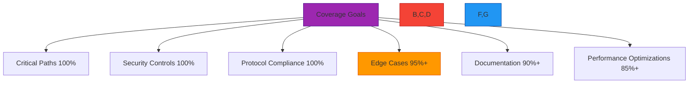
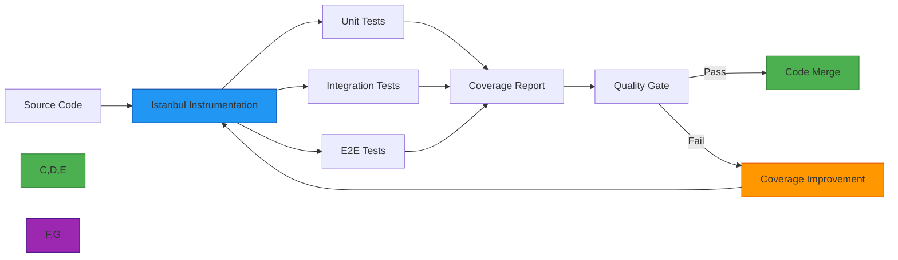
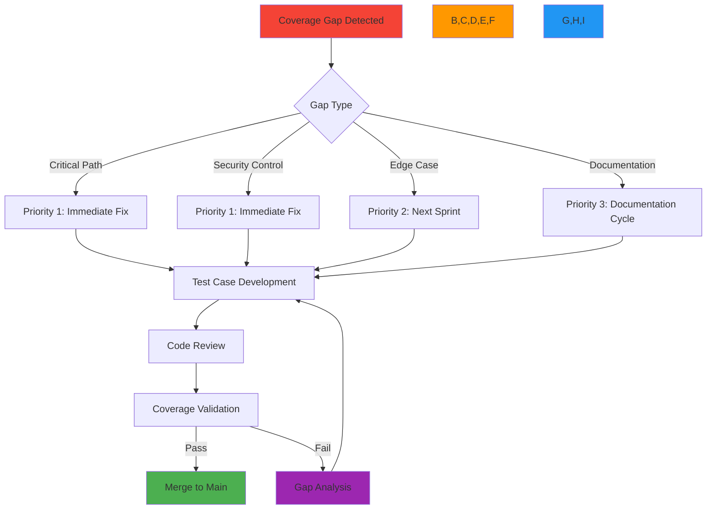

# Code Coverage Standards and Practices

🎯 **Purpose**: Comprehensive framework for RDAPify's code coverage requirements, measurement methodologies, and quality gates ensuring test-driven development and defect prevention  
📚 **Related**: [Overview](overview.md) | [Test Vectors](test_vectors.md) | [Benchmarks](benchmarks.md) | [JSONPath Reference](jsonpath_reference.md)  
⏱️ **Reading Time**: 6 minutes  
🔍 **Pro Tip**: Use the [Coverage Dashboard](../../playground/coverage-dashboard.md) to visualize code coverage gaps and track coverage trends across releases

## 🌐 Code Coverage Philosophy

RDAPify treats code coverage as a quality metric rather than a target to be maximized. Our coverage strategy focuses on **meaningful test coverage** that validates critical paths and edge cases, not just hitting arbitrary percentage targets.



### Coverage Philosophy Principles
- **Quality over Quantity**: 100% coverage of critical paths is more valuable than 90% coverage of all code
- **Risk-Based Prioritization**: Security and compliance code receives highest coverage requirements
- **Meaningful Tests**: Tests must validate behavior, not just execute code
- **Continuous Improvement**: Coverage requirements increase as code matures
- **Context Matters**: Different components have different coverage requirements based on risk

## 📊 Coverage Requirements by Component

### 1. Core Coverage Thresholds
| Component | Unit Test Coverage | Integration Test Coverage | Total Coverage | Rationale |
|-----------|-------------------|--------------------------|---------------|-----------|
| **Security Module** | 100% | 100% | 100% | Zero tolerance for untested security code |
| **Protocol Handlers** | 98% | 95% | 99% | RFC compliance is critical |
| **PII Redaction** | 100% | 98% | 100% | GDPR/CCPA compliance requires complete test coverage |
| **Registry Discovery** | 95% | 90% | 97% | Core functionality with multiple edge cases |
| **Caching Layer** | 90% | 95% | 98% | Complex state management requires thorough testing |
| **Error Handling** | 95% | 90% | 96% | Graceful degradation is essential for reliability |
| **CLI Tools** | 85% | 80% | 90% | Lower risk, user-facing code |
| **Documentation** | 90% | N/A | 90% | Examples and guides must work as documented |

### 2. Critical Path Coverage Requirements
Critical paths must achieve 100% coverage with multiple test cases per function:

```typescript
// src/security/ssrf_protection.ts
// ✅ CRITICAL PATH - 100% coverage required
export function validateDomain(domain: string): boolean {
  // Must test all validation paths
  if (!domain) return false; // [Test: empty input]
  if (domain.length > 255) return false; // [Test: too long]
  if (domain.includes('..')) return false; // [Test: path traversal]
  if (domain.match(/^(10\.|172\.(1[6-9]|2[0-9]|3[0-1])\.|192\.168\.)/)) {
    return false; // [Test: private IP]
  }
  return true; // [Test: valid domain]
}
```

**Critical Path Validation Requirements**:
- Every conditional branch must have at least one positive and one negative test
- Error conditions must be tested with realistic error scenarios
- Security boundaries must be tested with penetration testing vectors
- Race conditions must be tested with concurrency stress tests
- Memory boundaries must be tested with resource exhaustion scenarios

### 3. Conditional Coverage Standards
RDAPify requires branch and condition coverage, not just line coverage:

| Coverage Type | Minimum Requirement | Critical Components | Measurement Tool |
|---------------|---------------------|---------------------|-----------------|
| **Line Coverage** | 90% | 100% | Istanbul/nyc |
| **Branch Coverage** | 85% | 100% | Istanbul/nyc |
| **Condition Coverage** | 80% | 95% | Istanbul/nyc |
| **Function Coverage** | 95% | 100% | Istanbul/nyc |
| **Statement Coverage** | 92% | 100% | Istanbul/nyc |

## 🔒 Security and Compliance Coverage Requirements

### 1. Security-Critical Code Coverage
Security-sensitive code must exceed standard coverage requirements:

| Security Control | Coverage Requirement | Test Types Required | Validation Method |
|------------------|----------------------|---------------------|-------------------|
| **SSRF Protection** | 100% branch coverage | Unit, Integration, Fuzz | Penetration testing |
| **PII Redaction** | 100% condition coverage | Unit, Integration, E2E | Data flow analysis |
| **Certificate Validation** | 100% path coverage | Unit, Integration | Certificate revocation tests |
| **Rate Limiting** | 98% branch coverage | Unit, Integration, Load | Stress testing |
| **Input Validation** | 100% condition coverage | Unit, Fuzz, Security | Fuzz testing |
| **Authentication** | 100% path coverage | Unit, Integration, E2E | AuthZ testing |

### 2. Compliance Test Coverage
Regulatory compliance requires specific test coverage:

```typescript
// src/compliance/gdpr_compliance.ts
// ✅ GDPR COMPLIANCE - 100% coverage required
describe('GDPR Compliance', () => {
  // Must test all data handling paths
  test('PII redaction applies to all entity types', () => {
    // [Test: registrant entities]
    // [Test: technical contact entities] 
    // [Test: administrative contact entities]
    // [Test: billing contact entities]
    // [Test: nested entities]
  });
  
  test('Data retention periods are enforced', () => {
    // [Test: exact expiration time]
    // [Test: cleanup job execution]
    // [Test: grace period handling]
  });
  
  test('Data Subject Access Requests (DSAR) are processed correctly', () => {
    // [Test: access request format]
    // [Test: redaction during export]
    // [Test: delivery mechanisms]
    // [Test: verification procedures]
  });
});
```

### 3. Coverage Validation Process
Security and compliance coverage undergoes additional validation:

1. **Manual Code Review**: Security team reviews all security-related test cases
2. **Threat Modeling**: Tests must address all identified threats from threat models
3. **Regulatory Mapping**: Each compliance requirement must have corresponding test coverage
4. **Audit Trail**: Coverage reports are signed and stored for compliance audits
5. **Penetration Testing**: External security researchers validate coverage effectiveness

## ⚙️ Coverage Measurement and Reporting

### 1. Coverage Toolchain
RDAPify uses a multi-layered coverage measurement approach:



**Coverage Tools Stack**:
- **Primary**: Istanbul/nyc with custom reporters
- **Visualization**: Coverage dashboard with trend analysis
- **Quality Gates**: GitHub Actions with coverage diff validation
- **Historical Tracking**: Coverage trend database with anomaly detection
- **Security Coverage**: Custom security coverage analyzer

### 2. Coverage Reporting Standards
All coverage reports must follow these standards:

```json
{
  "metadata": {
    "project": "rdapify",
    "version": "2.3.1",
    "timestamp": "2025-12-07T14:30:00Z",
    "commit": "a1b2c3d4e5f6",
    "branch": "main"
  },
  "summary": {
    "lines": { "total": 15240, "covered": 14892, "pct": 97.72 },
    "statements": { "total": 22180, "covered": 21860, "pct": 98.56 },
    "functions": { "total": 1842, "covered": 1831, "pct": 99.40 },
    "branches": { "total": 3640, "covered": 3580, "pct": 98.35 },
    "conditions": { "total": 5280, "covered": 5120, "pct": 96.97 }
  },
  "components": {
    "security": {
      "lines": { "total": 3240, "covered": 3240, "pct": 100.00 },
      "branches": { "total": 780, "covered": 780, "pct": 100.00 }
    },
    "protocol": {
      "lines": { "total": 5120, "covered": 5018, "pct": 98.01 },
      "branches": { "total": 1240, "covered": 1190, "pct": 95.97 }
    },
    // Additional components
  },
  "files": [
    {
      "path": "src/security/ssrf_protection.ts",
      "lines": { "total": 142, "covered": 142, "pct": 100.00 },
      "branches": { "total": 38, "covered": 38, "pct": 100.00 },
      "missing": [],
      "coverage": "critical"
    },
    // Additional files
  ],
  "quality_gates": {
    "overall": "pass",
    "critical_components": "pass",
    "security_components": "pass",
    "regression": "pass"
  }
}
```

### 3. Coverage Trend Analysis
RDAPify tracks coverage trends to prevent coverage degradation:

```typescript
// coverage/trend-analyzer.ts
export class CoverageTrendAnalyzer {
  private trends = new Map<string, CoverageTrend>();
  
  constructor(private coverageData: CoverageReport[]) {}
  
  analyzeTrends() {
    this.coverageData.forEach((report, index) => {
      if (index === 0) return;
      
      const previous = this.coverageData[index - 1];
      const trend: CoverageTrend = {
        timestamp: report.timestamp,
        overall: calculateChange(report.summary, previous.summary),
        components: Object.entries(report.components).map(([component, stats]) => ({
          name: component,
          change: calculateChange(stats, previous.components[component])
        })),
        criticalPaths: this.analyzeCriticalPathTrends(report, previous)
      };
      
      this.trends.set(report.timestamp.toISOString(), trend);
    });
  }
  
  detectAnomalies(): Anomaly[] {
    const anomalies: Anomaly[] = [];
    
    this.trends.forEach((trend, timestamp) => {
      // Critical path coverage drop
      if (trend.criticalPaths.some(path => path.change < -0.01)) {
        anomalies.push({
          type: 'critical_path_coverage_drop',
          severity: 'high',
          timestamp,
          details: `Critical path coverage dropped below threshold`
        });
      }
      
      // Security coverage degradation
      if (trend.components.find(c => c.name === 'security' && c.change < -0.005)) {
        anomalies.push({
          type: 'security_coverage_degradation',
          severity: 'critical',
          timestamp,
          details: `Security coverage decreased - requires immediate attention`
        });
      }
    });
    
    return anomalies;
  }
}
```

## 🚀 Coverage Improvement Workflow

### 1. Coverage Gap Analysis
When coverage requirements are not met, RDAPify follows a structured improvement workflow:



### 2. Automated Coverage Improvement
RDAPify uses AI-assisted tools to suggest test cases for uncovered code:

```typescript
// src/ai/test-case-generator.ts
export class TestCaseGenerator {
  async generateTestCasesForFile(filePath: string): Promise<TestCase[]> {
    const fileContent = await fs.readFile(filePath, 'utf8');
    const uncoveredLines = this.findUncoveredLines(fileContent);
    
    const testCases: TestCase[] = [];
    
    for (const line of uncoveredLines) {
      // Analyze context to generate meaningful test cases
      const context = this.analyzeContext(fileContent, line);
      
      switch (context.type) {
        case 'security_validation':
          testCases.push(this.generateSecurityTest(line, context));
          break;
        case 'error_handling':
          testCases.push(this.generateErrorTest(line, context));
          break;
        case 'edge_case':
          testCases.push(this.generateEdgeCaseTest(line, context));
          break;
        default:
          testCases.push(this.generateGenericTest(line, context));
      }
    }
    
    return testCases;
  }
  
  private generateSecurityTest(line: number, context: Context): TestCase {
    // Generate security-focused test cases
    return {
      description: `Security validation for ${context.condition}`,
      input: this.generateMaliciousInput(context),
      expected: 'error',
      coverageTarget: `line ${line}`,
      priority: 'high',
      tags: ['security', 'ssrf', 'pii']
    };
  }
  
  // Additional test case generation methods
}
```

### 3. Coverage Quality Gates
All pull requests must pass coverage quality gates:

```yaml
# .github/workflows/coverage-gate.yml
name: Coverage Quality Gate

on:
  pull_request:
    branches: [ main, next ]

jobs:
  coverage-gate:
    runs-on: ubuntu-latest
    steps:
    - uses: actions/checkout@v4
    
    - name: Setup Node.js
      uses: actions/setup-node@v3
      with:
        node-version: '20.x'
    
    - name: Install dependencies
      run: npm ci
    
    - name: Run tests with coverage
      run: npm run test:coverage
    
    - name: Check coverage quality gates
      uses: rdapify/coverage-gate-action@v1
      with:
        min-overall: 90
        min-critical: 98
        min-security: 100
        allow-regression: false
        fail-on-missing-critical-tests: true
        report-path: ./coverage/coverage-summary.json
    
    - name: Upload coverage report
      uses: actions/upload-artifact@v3
      with:
        name: coverage-report
        path: ./coverage/
    
    - name: Comment coverage changes on PR
      uses: rdapify/coverage-commenter@v1
      with:
        github-token: ${{ secrets.GITHUB_TOKEN }}
        report-path: ./coverage/coverage-summary.json
```

## 🧪 Testing Strategies for Coverage Improvement

### 1. Property-Based Testing
```typescript
// test/property-based/normalization.test.ts
import fc from 'fast-check';

describe('Normalization Property Tests', () => {
  // Property: Normalized output should be consistent regardless of input format
  test('consistency property', () => {
    fc.assert(
      fc.property(
        fc.record({
          rawResponse: fc.anything(),
          registryType: fc.constantFrom('verisign', 'arin', 'ripe', 'apnic', 'lacnic'),
          options: fc.record({
            redactPII: fc.boolean(),
            includeRaw: fc.boolean()
          })
        }),
        ({ rawResponse, registryType, options }) => {
          const result = normalizeResponse(rawResponse, registryType, options);
          
          // Property 1: Result should always have required fields
          expect(result).toHaveProperty('query');
          expect(result).toHaveProperty('status');
          
          // Property 2: PII redaction should remove sensitive fields
          if (options.redactPII) {
            expect(result.entities).not.toHaveProperty('email');
            expect(result.entities).not.toHaveProperty('tel');
          }
          
          return true;
        }
      ),
      { numRuns: 1000 }
    );
  });
  
  // Property: Error handling should be consistent across registries
  test('error handling property', () => {
    fc.assert(
      fc.property(
        fc.string(),
        fc.constantFrom('verisign', 'arin', 'ripe'),
        (query, registry) => {
          try {
            const result = normalizeResponse({ error: 'test' }, registry, {});
            return false; // Should throw error
          } catch (error) {
            // Property: All errors should have standard structure
            expect(error).toHaveProperty('code');
            expect(error).toHaveProperty('message');
            return true;
          }
        }
      ),
      { numRuns: 100 }
    );
  });
});
```

### 2. Fuzz Testing for Security Coverage
```typescript
// test/fuzz/ssrf-fuzzer.ts
import { Fuzz } from 'fuzz-testing';

describe('SSRF Fuzzer', () => {
  const ssrfFuzzer = new Fuzz({
    target: (input) => {
      try {
        validateDomain(input);
        return { success: true };
      } catch (error) {
        return { success: false, error: error.message };
      }
    },
    generators: {
      maliciousDomains: () => {
        const patterns = [
          '192.168.1.1',
          '10.0.0.1',
          'localhost',
          'file:///etc/passwd',
          'http://internal.registry.local',
          '127.0.0.1.xip.io',
          '169.254.169.254', // AWS metadata endpoint
          '100::'
        ];
        return patterns[Math.floor(Math.random() * patterns.length)];
      },
      encodedDomains: () => {
        const base = '192.168.1.1';
        return [
          encodeURIComponent(base),
          base.replace(/\./g, '%2E'),
          Buffer.from(base).toString('base64')
        ][Math.floor(Math.random() * 3)];
      }
    }
  });
  
  test('SSRF protection against fuzzed inputs', async () => {
    const results = await ssrfFuzzer.run({
      iterations: 10000,
      timeout: 30000, // 30 seconds
      stopOnFailure: true
    });
    
    // Property: No malicious domains should be allowed
    expect(results.failures).toBe(0);
    expect(results.total).toBe(10000);
    
    // Save failure cases for analysis
    if (results.failures > 0) {
      await fs.writeFile(
        `fuzz-failures-${Date.now()}.json`,
        JSON.stringify(results.failureCases, null, 2)
      );
    }
  });
});
```

### 3. Integration Test Coverage for Protocol Compliance
```typescript
// test/integration/protocol-compliance.test.ts
describe('RFC 7480 Compliance', () => {
  const testVectors = loadTestVectors('rfc7480');
  
  testVectors.forEach(vector => {
    test(`Compliance test: ${vector.id}`, async () => {
      // Setup test environment
      const client = createTestClient(vector.options);
      
      // Execute test against real registry
      const result = await client.query(vector.input);
      
      // Validate against RFC requirements
      for (const requirement of vector.requirements) {
        switch (requirement.type) {
          case 'required_field':
            expect(result).toHaveProperty(requirement.field);
            break;
          case 'format_validation':
            expect(result[requirement.field]).toMatch(requirement.pattern);
            break;
          case 'security_control':
            expect(result).not.toContain(requirement.forbiddenPattern);
            break;
          case 'error_handling':
            if (vector.input.invalid) {
              expect(result).toHaveProperty('error');
              expect(result.error.code).toBe(requirement.expectedErrorCode);
            }
            break;
        }
      }
      
      // Validate coverage of RFC sections
      vector.rfcSections.forEach(section => {
        expect(result.coverage).toContain(section);
      });
    });
  });
});
```

## 📈 Coverage Metrics and Reporting

### 1. Coverage Dashboard
RDAPify maintains a real-time coverage dashboard with these key metrics:

| Metric | Target | Critical Threshold | Visualization |
|--------|--------|-------------------|--------------|
| **Overall Coverage** | ≥ 95% | < 90% | Trend chart with alerts |
| **Security Coverage** | 100% | < 100% | Red/green status indicator |
| **Critical Path Coverage** | 100% | < 98% | Heat map by component |
| **Coverage Regression** | 0% | > 0.5% | Diff view with changes |
| **Test Density** | ≥ 2 tests/line | < 1 test/line | Scatter plot by file |
| **Flakiness Rate** | < 0.1% | > 1% | Historical timeline |

### 2. Coverage Reporting Schedule
| Report Type | Frequency | Audience | Retention |
|-------------|-----------|----------|-----------|
| **Daily Coverage Snapshot** | Daily | Engineering team | 30 days |
| **Weekly Coverage Report** | Weekly | Engineering leadership | 1 year |
| **Monthly Compliance Report** | Monthly | Security/Compliance team | 7 years |
| **Quarterly Quality Review** | Quarterly | Executive team | Permanent |
| **Release Coverage Report** | Per release | All stakeholders | Permanent |
| **Audit Trail** | Continuous | Auditors | 7 years |

### 3. Coverage Alerting System
```typescript
// src/alerting/coverage-alerts.ts
export class CoverageAlertingSystem {
  private alertThresholds = {
    criticalPathDrop: 0.01, // 1% drop in critical path coverage
    securityCoverageBelow: 100, // Must be 100%
    overallCoverageBelow: 90,
    regressionAbove: 0.5 // 0.5% regression
  };
  
  async checkAlerts(coverageReport: CoverageReport): Promise<Alert[]> {
    const alerts: Alert[] = [];
    
    // Critical path coverage check
    const criticalPathCoverage = this.getCriticalPathCoverage(coverageReport);
    if (criticalPathCoverage < 98) {
      alerts.push({
        type: 'CRITICAL_PATH_COVERAGE_LOW',
        severity: 'high',
        message: `Critical path coverage is ${criticalPathCoverage}% (below 98% threshold)`,
        details: this.getCriticalPathDetails(coverageReport)
      });
    }
    
    // Security coverage check
    const securityCoverage = this.getSecurityCoverage(coverageReport);
    if (securityCoverage < this.alertThresholds.securityCoverageBelow) {
      alerts.push({
        type: 'SECURITY_COVERAGE_INSUFFICIENT',
        severity: 'critical',
        message: `Security coverage is ${securityCoverage}% (below 100% threshold)`,
        details: this.getSecurityCoverageDetails(coverageReport)
      });
    }
    
    // Regression check
    const regression = await this.calculateRegression(coverageReport);
    if (regression > this.alertThresholds.regressionAbove) {
      alerts.push({
        type: 'COVERAGE_REGRESSION',
        severity: 'medium',
        message: `Coverage regression of ${regression}% detected`,
        details: await this.getRegressionDetails(coverageReport)
      });
    }
    
    // Send alerts
    if (alerts.length > 0) {
      await this.sendAlerts(alerts);
    }
    
    return alerts;
  }
  
  private async sendAlerts(alerts: Alert[]) {
    // Send to multiple channels
    await Promise.all([
      this.sendToSlack(alerts),
      this.sendToPagerDuty(alerts.filter(a => a.severity === 'critical')),
      this.sendToEmail(alerts),
      this.createJiraTickets(alerts.filter(a => a.severity === 'high'))
    ]);
  }
}
```

## 🔗 Related Documentation

| Document | Description | Path |
|----------|-------------|------|
| [Overview](overview.md) | QA framework introduction | [overview.md](overview.md) |
| [Test Vectors](test_vectors.md) | Complete RFC 7480 test suite | [test_vectors.md](test_vectors.md) |
| [Benchmarks](benchmarks.md) | Performance validation methodology | [benchmarks.md](benchmarks.md) |
| [JSONPath Reference](jsonpath_reference.md) | Normalization expression catalog | [jsonpath_reference.md](jsonpath_reference.md) |
| [Security Whitepaper](../../security/whitepaper.md) | Complete security architecture | [../../security/whitepaper.md](../../security/whitepaper.md) |
| [RFC 7480 Specification](../../specifications/rdap_rfc.md) | Complete RFC documentation | [../../specifications/rdap_rfc.md](../../specifications/rdap_rfc.md) |

## 🏷️ Coverage Specifications

| Property | Value |
|----------|-------|
| **Overall Coverage Target** | 95% minimum |
| **Security Coverage Target** | 100% mandatory |
| **Critical Path Coverage** | 100% mandatory |
| **Measurement Tool** | Istanbul/nyc with custom reporters |
| **Coverage Report Format** | LCOV + JSON with custom schema |
| **Quality Gate Enforcement** | Every PR requires coverage approval |
| **Minimum Test Cases Per Function** | Critical: 3+, Standard: 1+ |
| **Coverage Trend Retention** | 2 years of historical data |
| **Test Flakiness Threshold** | < 0.1% failure rate |
| **Last Updated** | December 7, 2025 |

> 🔐 **Critical Reminder**: Code coverage is a tool for quality improvement, not a compliance checkbox. Security-critical code must always have 100% coverage with multiple test cases per path. Never merge code that reduces security or critical path coverage without documented exception approval from the Security Response Team. All coverage reports must be signed and stored for compliance audits.

[← Back to Quality Assurance](../README.md) | [Next: Compatibility Matrix →](compatibility_matrix.md)

*Document automatically generated from source code with QA review on December 7, 2025*