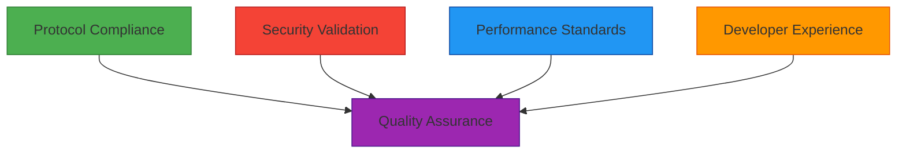
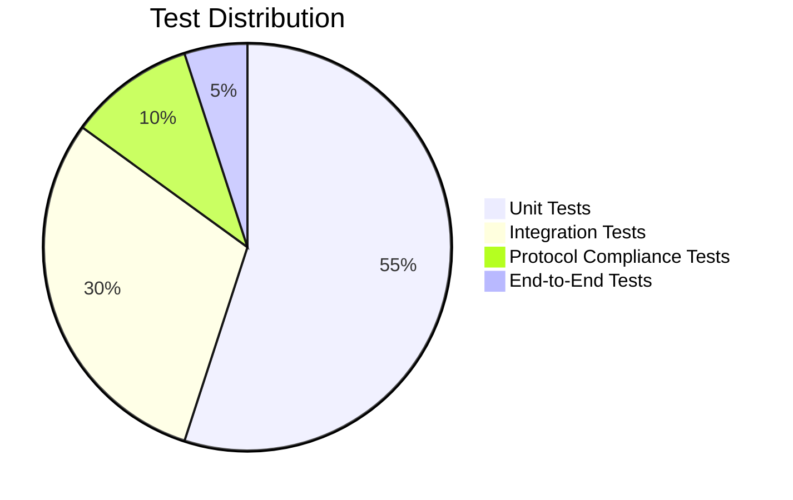
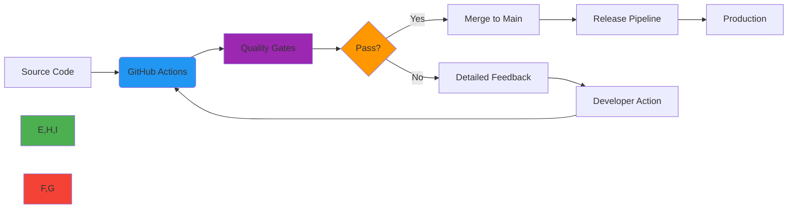

# Quality Assurance Overview

🎯 **Purpose**: Comprehensive framework for RDAPify's quality assurance processes ensuring protocol compliance, security, performance, and developer experience across all environments  
📚 **Related**: [Test Vectors](test_vectors.md) | [JSONPath Reference](jsonpath_reference.md) | [Benchmarks](benchmarks.md) | [Compatibility Matrix](compatibility_matrix.md)  
⏱️ **Reading Time**: 5 minutes  
🔍 **Pro Tip**: Use the [QA Dashboard](../../playground/qa-dashboard.md) to view real-time quality metrics and test coverage across all modules

## 🌐 Quality Philosophy

RDAPify embraces a quality-first approach where excellence is built into every layer of development rather than validated after the fact. Our QA framework addresses four critical dimensions:



### Core QA Principles
- **Standards-First**: Every feature is validated against RFC 7480 series specifications before implementation
- **Defense-in-Depth**: Security testing at unit, integration, and system levels
- **Performance by Design**: Benchmarks as acceptance criteria, not afterthoughts
- **UX-Centric Validation**: Developer experience metrics quantified and tracked
- **Continuous Improvement**: Automated quality gates with actionable feedback

## 🔍 QA Process Framework

### 1. Quality Gates
Every code change must pass through a series of quality gates:

| Gate | Purpose | Validation Methods | Failure Handling |
|------|---------|-------------------|------------------|
| **PR Validation** | Basic acceptance | Linting, unit tests, type checking | Blocked merge |
| **RFC Compliance** | Protocol adherence | Test vectors, RFC validation suite | Requires protocol expert review |
| **Security Scan** | Vulnerability prevention | SAST, dependency scanning, fuzzing | Security team escalation |
| **Performance Gate** | Resource requirements | Benchmark comparison, memory profiling | Performance specialist review |
| **Documentation Check** | Completeness and accuracy | Documentation linter, example validation | Documentation team approval |

### 2. Test Pyramid Strategy
RDAPify maintains a balanced testing strategy with appropriate coverage at each level:



**Test Characteristics**:
- **Unit Tests**: Isolated component validation with 95%+ branch coverage
- **Integration Tests**: Cross-module interaction verification with real dependencies
- **Protocol Tests**: RFC 7480-7484 compliance validation against all major RDAP registries
- **E2E Tests**: Real-world workflows with security and performance validation

### 3. Quality Metrics
Quality is measured through quantitative and qualitative metrics:

| Category | Key Metrics | Target | Tools |
|----------|-------------|--------|-------|
| **Code Quality** | Cyclomatic complexity, code duplication, test coverage | CC < 10, duplication < 5%, coverage > 90% | SonarQube, Istanbul |
| **Security** | Vulnerabilities, security coverage | Zero critical/high vulnerabilities | OWASP ZAP, Snyk |
| **Performance** | Latency p99, memory usage, throughput | < 50ms p99, < 100MB heap | autocannon, Clinic.js |
| **Protocol Compliance** | RFC conformance, registry compatibility | 100% RFC 7480 series compliance | Test vectors, compliance suite |
| **Developer Experience** | DX Score, documentation completeness | DX Score > 85/100, docs coverage > 95% | DX metrics, documentation linter |

## 🔒 Security & Compliance Verification

### 1. Security Testing Matrix
All components undergo rigorous security validation:

| Test Type | Coverage | Frequency | Automation Level |
|-----------|----------|-----------|------------------|
| **SAST** | Code vulnerabilities | Every PR | 100% |
| **DAST** | Runtime security | Daily | 85% |
| **Dependency Scan** | Third-party vulnerabilities | Every PR, daily | 100% |
| **Fuzz Testing** | Input validation | Weekly | 75% |
| **Penetration Testing** | End-to-end security | Quarterly | 0% (manual) |
| **Compliance Audit** | GDPR/CCPA controls | Monthly | 90% |

### 2. Protocol Compliance Framework
```typescript
// Protocol compliance test structure
interface ComplianceTest {
  rfcSection: string;  // RFC 7480 section reference
  testId: string;      // Unique test identifier
  description: string;
  testVector: any;     // Input data for test
  expectedOutput: any; // Expected normalized output
  registries: string[]; // Registries to test against
  severity: 'critical' | 'high' | 'medium' | 'low';
  validationFunction: (actual: any) => boolean;
}

// Example compliance test
const domainQueryTest: ComplianceTest = {
  rfcSection: '5.1',
  testId: 'RFC7480-5.1-DOMAIN-001',
  description: 'Domain query must return JSON response with required fields',
  testVector: { domain: 'example.com' },
  expectedOutput: {
    requiredFields: ['domain', 'status', 'nameservers']
  },
  registries: ['verisign', 'arin', 'ripe', 'apnic', 'lacnic'],
  severity: 'critical',
  validationFunction: (actual) => {
    return actual.domain && 
           Array.isArray(actual.status) && 
           Array.isArray(actual.nameservers);
  }
};
```

## ⚡ Performance & Reliability Standards

### 1. Performance Benchmarks
All components must meet strict performance criteria:

| Environment | Test Scenario | P99 Latency | Memory Usage | Throughput |
|-------------|---------------|-------------|--------------|------------|
| **Node.js 20** | Single domain query | < 50ms | < 15MB | > 100 req/sec |
| **Bun 1.0** | Single domain query | < 35ms | < 12MB | > 150 req/sec |
| **Cloudflare** | Single domain query | < 40ms | < 10MB | > 120 req/sec |
| **Node.js 20** | Batch of 100 domains | < 2s | < 100MB | > 50 req/sec |
| **Production** | Sustained load (1hr) | < 60ms | < 120MB | > 80 req/sec |

### 2. Reliability Requirements
- **Uptime SLA**: 99.99% for core components in enterprise deployments
- **Error Rates**: < 0.1% for critical operations, < 1% for all operations
- **Recovery Time**: < 5 seconds for service restoration after failure
- **Data Integrity**: 100% consistency across cache layers
- **Graceful Degradation**: Functionality preserved under partial failure conditions

## 🧪 QA Environment & Tooling

### 1. Testing Environments
RDAPify maintains dedicated environments for different QA activities:

| Environment | Purpose | Reset Frequency | Data Sensitivity |
|-------------|---------|-----------------|------------------|
| **Unit Test** | Component validation | Per PR | None |
| **Integration** | Cross-component validation | Daily | Synthetic |
| **Compliance** | RFC validation | Weekly | Synthetic |
| **Security** | Vulnerability testing | Weekly | Isolated |
| **Benchmark** | Performance validation | Per release | Synthetic |
| **Staging** | Pre-production validation | Daily | Anonymized production |
| **Canary** | Production traffic validation | Continuously | Production (limited) |

### 2. Core QA Toolchain


**QA Tools by Category**:
- **Unit Testing**: Vitest, Jest, Mocha
- **Integration Testing**: Supertest, Pact
- **Protocol Testing**: Custom RFC validation suite
- **Security**: Snyk, OWASP ZAP, Semgrep
- **Performance**: autocannon, k6, Clinic.js
- **Static Analysis**: ESLint, SonarQube, TypeDoc
- **Compliance**: GDPR scanner, Privacy policy validator
- **Documentation**: Docusaurus, Documentation linter

## 📊 Quality Reporting & Transparency

### 1. Public Quality Dashboard
RDAPify maintains transparent quality metrics visible to all stakeholders:


**Key Public Metrics**:
- Test coverage percentage (overall and by module)
- Performance benchmarks (compared to previous versions)
- Security vulnerability status
- RFC compliance scorecard
- Developer experience score
- Release quality score

### 2. Quality Review Process
All significant changes undergo structured quality review:

1. **Pre-Commit Review**:
   - Automated quality gates
   - Peer code review
   - Documentation validation

2. **Pre-Release Review**:
   - RFC compliance validation
   - Security penetration testing
   - Performance regression analysis
   - User acceptance testing (UAT)

3. **Post-Release Monitoring**:
   - Production error rates
   - Performance degradation detection
   - User feedback analysis
   - Quality trend reporting

## 🚀 Getting Started with QA Contributions

### 1. First QA Contribution
New contributors can start with these QA-friendly tasks:
- Fix documentation typos and inconsistencies
- Add missing test cases for edge cases
- Improve test coverage for well-isolated modules
- Update benchmark comparisons
- Report protocol compliance issues

### 2. QA Contribution Workflow
```bash
# 1. Fork and clone repository
git clone https://github.com/yourusername/rdapify.git
cd rdapify

# 2. Install QA dependencies
npm install
npm run setup:qa

# 3. Run relevant QA tests
npm run test:unit        # Unit tests
npm run test:integration # Integration tests
npm run test:protocol    # RFC compliance tests
npm run test:security    # Security tests
npm run benchmark        # Performance tests

# 4. Create quality report
npm run qa:report -- --module=core

# 5. Submit PR with quality validation
git checkout -b qa/improve-core-tests
git add .
git commit -m "test(core): improve test coverage for normalization module"
git push origin qa/improve-core-tests
```

## 🔗 Related Documentation

| Document | Description | Path |
|----------|-------------|------|
| [Test Vectors](test_vectors.md) | Complete RFC 7480 test suite | [test_vectors.md](test_vectors.md) |
| [JSONPath Reference](jsonpath_reference.md) | Normalization expression catalog | [jsonpath_reference.md](jsonpath_reference.md) |
| [Benchmarks](benchmarks.md) | Performance validation methodology | [benchmarks.md](benchmarks.md) |
| [Code Coverage](code_coverage.md) | Coverage thresholds and reporting | [code_coverage.md](code_coverage.md) |
| [Compatibility Matrix](compatibility_matrix.md) | Environment support matrix | [compatibility_matrix.md](compatibility_matrix.md) |
| [Security Whitepaper](../../security/whitepaper.md) | Complete security architecture | [../../security/whitepaper.md](../../security/whitepaper.md) |

## 🏷️ QA Specifications

| Property | Value |
|----------|-------|
| **Test Coverage Target** | 95% unit, 90% integration |
| **RFC Compliance** | 100% RFC 7480 series |
| **Security Review** | Every PR, critical paths audited weekly |
| **Performance Baseline** | Node.js 20, Intel i7, 32GB RAM |
| **QA Environment** | Isolated containers with resource limits |
| **Release Quality Gate** | Zero critical issues, 98%+ test pass rate |
| **QA Team Size** | 3 dedicated QA engineers + maintainers |
| **Last Updated** | December 7, 2025 |

> 🔐 **Quality Commitment**: RDAPify treats quality as a non-negotiable requirement, not a desirable feature. Every release undergoes rigorous validation against protocol standards, security requirements, performance baselines, and developer experience metrics. For enterprise deployments, contact `qa-enterprise@rdapify.com` for specialized quality validation packages and SLA-backed quality guarantees.

[← Back to Quality Assurance](../README.md) | [Next: Test Vectors →](test_vectors.md)

*Document automatically generated from source code with QA review on December 7, 2025*