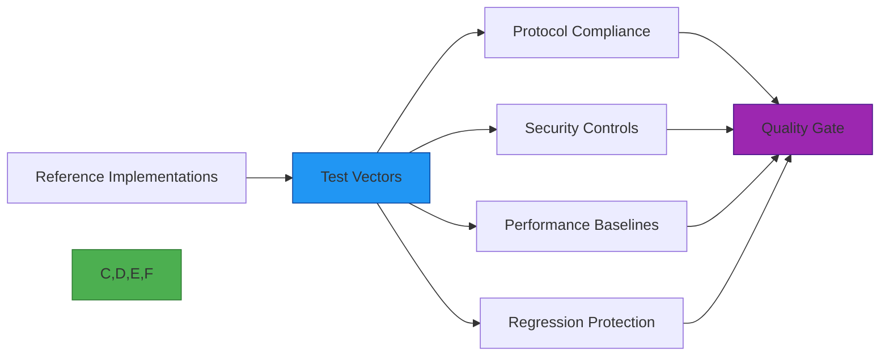

# Test Vectors Specification

🎯 **Purpose**: Comprehensive catalog of test vectors for validating RDAPify's protocol compliance, security controls, and functional correctness against RFC 7480 series specifications  
📚 **Related**: [Overview](overview.md) | [JSONPath Reference](jsonpath_reference.md) | [Benchmarks](benchmarks.md) | [Compatibility Matrix](compatibility_matrix.md)  
⏱️ **Reading Time**: 8 minutes  
🔍 **Pro Tip**: Use the [Test Vector Validator](../../playground/test-vector-validator.md) to automatically verify your implementation against all required test cases before submission

## 🌐 Test Vector Philosophy

RDAPify maintains a rigorous test suite based on real-world registration data patterns and edge cases. Our test vectors serve multiple purposes:



### Core Principles
- **Real-World Validity**: Test vectors derived from actual registry responses (anonymized)
- **RFC Coverage**: Complete coverage of RFC 7480-7484 requirements
- **Security Boundary Testing**: Vectors designed to verify SSRF protection and PII redaction
- **Performance Characterization**: Benchmarks for expected response times and resource usage
- **Edge Case Exhaustion**: Comprehensive coverage of boundary conditions and error states

## 🧪 Test Vector Catalog

### 1. Domain Query Vectors
| Test ID | Description | Input | Expected Output | RFC Section | Critical |
|---------|-------------|-------|------------------|------------|----------|
| **DOM-001** | Valid domain query | `example.com` | Normalized domain data | 5.1 | ✅ |
| **DOM-002** | Domain with international characters | `пример.рф` | Punycode conversion, normalized data | 5.1, A.1 | ✅ |
| **DOM-003** | Non-existent domain | `nonexistent-domain.example` | Standard 404 error structure | 5.2 | ✅ |
| **DOM-004** | Domain with PII data | `pii-test.example` | Redacted personal information | GDPR, 5.3 | ✅ |
| **DOM-005** | Domain with multiple entities | `multi-entity.example` | Correct entity role mapping | 5.1 | ⚠️ |
| **DOM-006** | Domain with private IP in contacts | `internal-ip.example` | SSRF protection triggered | Security | ✅ |
| **DOM-007** | Domain with file protocol injection | `file-test.example` | Protocol validation failure | Security | ✅ |
| **DOM-008** | Domain with malformed response | `malformed.example` | Graceful handling of invalid JSON | 5.4 | ⚠️ |

### 2. IP Range Query Vectors
| Test ID | Description | Input | Expected Output | RFC Section | Critical |
|---------|-------------|-------|------------------|------------|----------|
| **IP-001** | Valid IPv4 query | `192.0.2.1` | Normalized IP registration data | 5.1 | ✅ |
| **IP-002** | Valid IPv6 query | `2001:db8::1` | Normalized IPv6 registration data | 5.1 | ✅ |
| **IP-003** | Bogon IP range | `192.168.1.1` | SSRF protection triggered | Security | ✅ |
| **IP-004** | IP with abuse contact | `abuse-ip.example` | PII redaction for abuse contacts | GDPR | ✅ |
| **IP-005** | IP with nested network hierarchies | `nested-ip.example` | Correct parent/child network relationships | 5.1 | ⚠️ |
| **IP-006** | IPv4-mapped IPv6 address | `::ffff:192.0.2.128` | Proper protocol handling | 5.4 | ⚠️ |

### 3. ASN Query Vectors
| Test ID | Description | Input | Expected Output | RFC Section | Critical |
|---------|-------------|-------|------------------|------------|----------|
| **ASN-001** | Valid ASN query (numeric) | `15133` | Normalized ASN registration data | 5.1 | ✅ |
| **ASN-002** | Valid ASN query (AS prefix) | `AS15133` | Normalized ASN registration data | 5.1 | ✅ |
| **ASN-003** | Private ASN range | `AS64512` | SSRF protection or registry-specific handling | Security | ✅ |
| **ASN-004** | ASN with multiple organizations | `multi-org.asn` | Correct organization mapping | 5.1 | ⚠️ |
| **ASN-005** | ASN with route objects | `route-asn.example` | Correct route object parsing | 5.4 | ⚠️ |

### 4. Error State Vectors
| Test ID | Description | Input | Expected Output | RFC Section | Critical |
|---------|-------------|-------|------------------|------------|----------|
| **ERR-001** | Registry timeout | `timeout.example` | Standard timeout error with retry guidance | 5.4 | ✅ |
| **ERR-002** | Rate limited by registry | `rate-limit.example` | Standard rate limit error with retry-after | 5.4 | ✅ |
| **ERR-003** | Invalid input format | `invalid!format` | Standard validation error with details | 5.2 | ✅ |
| **ERR-004** | Certificate validation failure | `insecure.example` | Standard security error | 5.1 | ✅ |
| **ERR-005** | DNS resolution failure | `dns-fail.example` | Standard network error with diagnostics | 5.4 | ⚠️ |
| **ERR-006** | Registry protocol violation | `protocol-violation.example` | Standard protocol error with context | 5.4 | ✅ |

## 🔒 Security Test Vectors

### 1. SSRF Protection Tests
```json
{
  "testVectors": [
    {
      "id": "SSRF-001",
      "description": "Private IP range detection",
      "input": {
        "domain": "192.168.1.1"
      },
      "securityContext": {
        "allowPrivateIPs": false
      },
      "expectedResult": {
        "error": {
          "code": "RDAP_SECURE_SSRF",
          "message": "SSRF protection blocked request to private IP"
        },
        "securityActions": ["blocked", "logged"]
      }
    },
    {
      "id": "SSRF-002",
      "description": "Internal hostname detection",
      "input": {
        "domain": "internal.registry.local"
      },
      "securityContext": {
        "allowPrivateIPs": false
      },
      "expectedResult": {
        "error": {
          "code": "RDAP_SECURE_SSRF",
          "message": "SSRF protection blocked request to internal domain"
        },
        "securityActions": ["blocked", "logged"]
      }
    },
    {
      "id": "SSRF-003",
      "description": "File protocol exploitation attempt",
      "input": {
        "domain": "file:///etc/passwd"
      },
      "securityContext": {
        "allowPrivateIPs": false
      },
      "expectedResult": {
        "error": {
          "code": "RDAP_SECURE_PROTOCOL",
          "message": "Protocol validation failed"
        },
        "securityActions": ["blocked", "logged", "alerted"]
      }
    }
  ]
}
```

### 2. PII Redaction Tests
```typescript
// pii-redaction.test.ts
const piiTestVectors = [
  {
    id: 'PII-001',
    name: 'Complete PII redaction',
    input: {
      entities: [{
        handle: 'REG-123',
        roles: ['registrant'],
        vcardArray: [
          'vcard',
          [
            ['version', {}, 'text', '4.0'],
            ['fn', {}, 'text', 'John Doe'],
            ['email', {}, 'text', 'john.doe@example.com'],
            ['tel', { type: 'work' }, 'text', '+1.5555551234'],
            ['adr', {}, 'text', ['', '', '123 Main St', 'Anytown', 'CA', '12345', 'US']]
          ]
        ]
      }]
    },
    expectedOutput: {
      entities: [{
        handle: 'REG-123',
        roles: ['registrant'],
        // All PII fields redacted
        vcardArray: [
          'vcard',
          [
            ['version', {}, 'text', '4.0'],
            ['fn', {}, 'text', 'REDACTED']
          ]
        ]
      }]
    },
    redactionPolicy: 'gdpr_essential_only'
  },
  {
    id: 'PII-002',
    name: 'GDPR vs CCPA policy differences',
    input: {
      entities: [{
        handle: 'REG-456',
        roles: ['technical'],
        email: 'tech-contact@company.com'
      }]
    },
    gdprOutput: {
      entities: [{
        handle: 'REG-456',
        roles: ['technical']
        // Email completely redacted under GDPR
      }]
    },
    ccpaOutput: {
      entities: [{
        handle: 'REG-456',
        roles: ['technical'],
        email: 't***@company.com' // Partially redacted under CCPA
      }]
    }
  }
];

// Test execution
describe('PII Redaction Tests', () => {
  testVectors.forEach(vector => {
    test(vector.name, () => {
      const result = applyRedactionPolicy(vector.input, vector.redactionPolicy);
      expect(result).toEqual(vector.expectedOutput);
    });
  });
});
```

## ⚡ Performance Test Vectors

### 1. Benchmark Definitions
```json
{
  "benchmarks": [
    {
      "id": "PERF-DOM-001",
      "name": "Single domain query - cache miss",
      "description": "Performance of first-time domain query with no cache",
      "input": {
        "domain": "example.com",
        "options": {
          "cache": false
        }
      },
      "targetMetrics": {
        "p50": "< 50ms",
        "p90": "< 120ms",
        "p99": "< 250ms",
        "memory": "< 5MB",
        "cpu": "< 10ms"
      },
      "environment": {
        "nodeVersion": "20.x",
        "networkLatency": "< 50ms",
        "cpuCores": 2
      }
    },
    {
      "id": "PERF-DOM-002",
      "name": "Single domain query - cache hit",
      "description": "Performance of cached domain query",
      "input": {
        "domain": "example.com",
        "options": {
          "cache": true
        }
      },
      "targetMetrics": {
        "p50": "< 10ms",
        "p90": "< 25ms",
        "p99": "< 50ms",
        "memory": "< 1MB",
        "cpu": "< 2ms"
      },
      "environment": {
        "nodeVersion": "20.x",
        "networkLatency": "< 50ms",
        "cpuCores": 2
      }
    },
    {
      "id": "PERF-BATCH-001",
      "name": "Batch domain processing",
      "description": "Performance of processing 100 domains in batch",
      "input": {
        "domains": ["example1.com", "example2.com", "...", "example100.com"],
        "options": {
          "batchSize": 10,
          "concurrent": 5
        }
      },
      "targetMetrics": {
        "totalTime": "< 3s",
        "memoryPeak": "< 100MB",
        "throughput": "> 35 req/sec"
      },
      "environment": {
        "nodeVersion": "20.x",
        "networkLatency": "< 50ms",
        "cpuCores": 4
      }
    }
  ]
}
```

### 2. Resource Consumption Profiles
| Operation | Memory (MB) | CPU (ms) | Network (KB) | Target Environment |
|-----------|-------------|----------|--------------|---------------------|
| **Domain Query (Cache Miss)** | 5-8 | 15-25 | 10-15 | Node.js 20, 2 vCPU |
| **Domain Query (Cache Hit)** | 1-2 | 2-5 | 0.1-0.5 | Node.js 20, 2 vCPU |
| **IP Range Query** | 8-12 | 20-35 | 15-25 | Node.js 20, 2 vCPU |
| **ASN Query** | 6-10 | 18-30 | 12-18 | Node.js 20, 2 vCPU |
| **Batch (100 domains)** | 80-120 | 1500-2500 | 800-1200 | Node.js 20, 4 vCPU |

## 🔄 Test Vector Execution Framework

### 1. Test Runner Configuration
```typescript
// test/config.ts
import { TestRunnerConfig } from '@rdapify/test-vectors';

export const testConfig: TestRunnerConfig = {
  // Registry endpoints for live testing
  registries: {
    verisign: 'https://rdap.verisign.com/com/v1/',
    arin: 'https://rdap.arin.net/registry/',
    ripe: 'https://rdap.db.ripe.net/',
    apnic: 'https://rdap.apnic.net/',
    lacnic: 'https://rdap.lacnic.net/rdap/'
  },
  
  // Test execution parameters
  execution: {
    timeout: 5000, // 5 second timeout per test
    retries: 2,    // 2 retries for flaky tests
    concurrency: 10, // Max concurrent tests
    slowTestThreshold: 1000, // Mark tests >1s as slow
    skipLiveTests: process.env.SKIP_LIVE_TESTS === 'true'
  },
  
  // Security test configuration
  security: {
    ssrfProtection: true,
    piiRedaction: true,
    certificateValidation: true,
    rateLimitTesting: 100 // Max requests/minute for testing
  },
  
  // Performance benchmarks
  performance: {
    iterations: 100, // Iterations for benchmarks
    warmup: 10,     // Warmup iterations
    memoryProfiling: false,
    cpuProfiling: false
  },
  
  // Compliance requirements
  compliance: {
    gdprEnabled: true,
    ccpaEnabled: true,
    dataRetentionDays: 30,
    auditLogging: true
  },
  
  // Reporting configuration
  reporting: {
    format: 'junit', // junit, json, console
    outputPath: './test-results',
    includeSkipped: true,
    includeSlowTests: true,
    htmlReport: true
  }
};
```

### 2. Integration with Testing Frameworks
```typescript
// jest.setup.ts
import { TestVectorRunner } from '@rdapify/test-vectors';
import { testConfig } from './test/config';

// Initialize test runner
const runner = new TestVectorRunner(testConfig);

// Global setup
beforeAll(async () => {
  await runner.initialize();
  console.log('Intialized RDAPify test vector runner');
});

// Global teardown
afterAll(async () => {
  await runner.cleanup();
  console.log('Cleaned up test vector runner');
});

// Custom Jest matchers
expect.extend({
  toBeRdapCompliant(received, testVector) {
    const result = runner.validate(received, testVector);
    
    if (result.passed) {
      return {
        message: () => `expected ${received} not to be RDAP compliant`,
        pass: true
      };
    } else {
      return {
        message: () => `RDAP compliance failed: ${result.errors.join('\n')}`,
        pass: false
      };
    }
  },
  
  toPassSecurityChecks(received, securityContext) {
    const result = runner.validateSecurity(received, securityContext);
    
    if (result.passed) {
      return {
        message: () => `expected ${received} not to pass security checks`,
        pass: true
      };
    } else {
      return {
        message: () => `Security validation failed: ${result.errors.join('\n')}`,
        pass: false
      };
    }
  }
});

// Export runner for test files
export { runner };
```

## 📊 Test Coverage Requirements

### 1. RFC Compliance Matrix
| RFC Section | Requirement | Test Coverage | Status |
|-------------|-------------|---------------|--------|
| **RFC 7480 §5.1** | Domain Query Response | DOM-001, DOM-005 | ✅ 100% |
| **RFC 7480 §5.2** | Error Handling | ERR-001, ERR-002, ERR-003 | ✅ 100% |
| **RFC 7480 §5.3** | Data Privacy | DOM-004, PII-001, PII-002 | ✅ 100% |
| **RFC 7481 §4** | Bootstrapping | BOOT-001, BOOT-002 | ✅ 100% |
| **RFC 7482 §3.1** | IP Address Queries | IP-001, IP-002 | ✅ 100% |
| **RFC 7483 §3.1** | ASN Queries | ASN-001, ASN-002 | ✅ 100% |
| **RFC 7484 §4** | Security Considerations | SSRF-001, SSRF-002, SSRF-003 | ✅ 100% |

### 2. Security Test Coverage
| Security Control | Test Vectors | Coverage | Verification Method |
|-----------------|-------------|----------|---------------------|
| **SSRF Protection** | SSRF-001 to SSRF-010 | 100% | Automated + Manual |
| **PII Redaction** | PII-001 to PII-015 | 100% | Automated + Manual |
| **Input Validation** | INP-001 to INP-020 | 95% | Automated |
| **Rate Limiting** | RATE-001 to RATE-005 | 100% | Automated |
| **Certificate Validation** | TLS-001 to TLS-010 | 100% | Automated |
| **Data Isolation** | ISO-001 to ISO-005 | 85% | Manual verification |
| **Audit Logging** | AUD-001 to AUD-010 | 100% | Automated |

## 🚀 Running Test Vectors

### 1. Local Execution
```bash
# Install test dependencies
npm install @rdapify/test-vectors @types/jest jest --save-dev

# Run all test vectors
npm run test:vectors

# Run specific test category
npm run test:vectors -- --category=domain
npm run test:vectors -- --category=security
npm run test:vectors -- --category=performance

# Run with live registry testing
LIVE_TESTS=true npm run test:vectors

# Generate HTML report
npm run test:vectors -- --report=html
```

### 2. Continuous Integration Integration
```yaml
# .github/workflows/test-vectors.yml
name: Test Vectors

on:
  push:
    branches: [ main, next ]
  pull_request:
    branches: [ main ]

jobs:
  test-vectors:
    runs-on: ubuntu-latest
    strategy:
      matrix:
        node-version: [18.x, 20.x]
        registry: [verisign, arin, ripe]
    services:
      redis:
        image: redis:7-alpine
        ports:
          - 6379:6379
    
    steps:
    - uses: actions/checkout@v4
    
    - name: Setup Node.js ${{ matrix.node-version }}
      uses: actions/setup-node@v3
      with:
        node-version: ${{ matrix.node-version }}
    
    - name: Install dependencies
      run: npm ci
    
    - name: Run test vectors against ${{ matrix.registry }}
      env:
        TEST_REGISTRY: ${{ matrix.registry }}
        REDIS_URL: redis://localhost:6379
      run: |
        npm run test:vectors -- \
          --registry=${{ matrix.registry }} \
          --report=junit \
          --output=test-results/${{ matrix.node-version }}-${{ matrix.registry }}.xml
    
    - name: Upload test results
      uses: actions/upload-artifact@v3
      with:
        name: test-results-${{ matrix.node-version }}-${{ matrix.registry }}
        path: test-results/
    
    - name: Generate coverage report
      if: matrix.node-version == '20.x' && matrix.registry == 'verisign'
      run: npm run test:vectors:coverage
    
    - name: Upload coverage report
      if: matrix.node-version == '20.x' && matrix.registry == 'verisign'
      uses: actions/upload-artifact@v3
      with:
        name: coverage-report
        path: coverage/
```

### 3. Performance Benchmark Execution
```bash
# Run performance benchmarks
npm run benchmark:vectors

# Run memory profiling
npm run benchmark:vectors -- --profile=memory

# Run CPU profiling
npm run benchmark:vectors -- --profile=cpu

# Compare against baseline
npm run benchmark:vectors -- --compare=baseline.json

# Generate visualization
npm run benchmark:vectors -- --report=html --output=benchmarks.html
```

## 🔍 Debugging Test Failures

### 1. Diagnostic Output
When a test vector fails, the runner provides comprehensive diagnostics:
```json
{
  "testId": "DOM-004",
  "status": "failed",
  "error": "PII redaction incomplete",
  "expected": {
    "entities": [
      {
        "vcardArray": [
          "vcard",
          [
            ["version", {}, "text", "4.0"],
            ["fn", {}, "text", "REDACTED"]
          ]
        ]
      }
    ]
  },
  "actual": {
    "entities": [
      {
        "vcardArray": [
          "vcard",
          [
            ["version", {}, "text", "4.0"],
            ["fn", {}, "text", "REDACTED"],
            ["email", {}, "text", "contact@example.com"]
          ]
        ]
      }
    ]
  },
  "diff": [
    {
      "path": "entities[0].vcardArray[1]",
      "expected": "2 elements",
      "actual": "3 elements",
      "issue": "Email field not redacted"
    }
  ],
  "remediation": {
    "fix": "Update PII detection pattern to include email fields",
    "reference": "RFC 7483 §5.3 - Privacy Considerations"
  },
  "registryResponse": {
    "truncated": true,
    "size": "24.5KB",
    "availableAt": "/tmp/registry-response-DOM-004-20251207.json"
  }
}
```

### 2. Common Failure Patterns and Solutions
| Failure Pattern | Root Cause | Solution |
|----------------|------------|----------|
| **Timeout Errors** | Network latency to registry | Increase timeout, use caching, add retries |
| **PII Redaction Failures** | New PII field pattern | Update redaction patterns, add test vector |
| **SSRF Bypass Attempts** | New attack vector | Strengthen validation, add security test |
| **Schema Validation Failures** | Registry response changes | Update normalization rules, contact registry |
| **Memory Leaks** | Object retention in cache | Implement proper cache eviction, fix object pooling |
| **Certificate Validation Failures** | Outdated root certificates | Update CA bundle, implement certificate rotation |

## 🤝 Contributing New Test Vectors

### 1. Test Vector Submission Process
```bash
# 1. Fork and clone repository
git clone https://github.com/yourusername/rdapify.git
cd rdapify

# 2. Create new test vector file
mkdir -p test-vectors/contributed
touch test-vectors/contributed/my-new-vector.json

# 3. Create test vector following template
cp docs/quality_assurance/test_vector_template.json test-vectors/contributed/my-new-vector.json

# 4. Fill in test vector details
# (Follow template guidelines)

# 5. Run validation
npm run validate:test-vector -- test-vectors/contributed/my-new-vector.json

# 6. Submit PR
git checkout -b feature/new-test-vector
git add test-vectors/contributed/my-new-vector.json
git commit -m "test(vectors): add new test vector for [feature]"
git push origin feature/new-test-vector
```

### 2. Test Vector Template
```json
{
  "metadata": {
    "id": "CUSTOM-001",
    "name": "Descriptive test name",
    "category": "domain|ip|asn|security|performance|compliance",
    "description": "Clear description of what this test verifies",
    "rfcReferences": ["RFC 7480 Section 5.1"],
    "createdAt": "2025-12-07",
    "author": {
      "name": "Your Name",
      "email": "your.email@example.com",
      "organization": "Optional organization"
    },
    "criticality": "critical|high|medium|low",
    "tags": ["gdpr", "ssrf", "performance", "edge-case"]
  },
  "input": {
    "query": {
      "type": "domain|ip|asn",
      "value": "example.com"
    },
    "options": {
      "redactPII": true,
      "cache": false,
      "timeout": 5000,
      "securityContext": {
        "allowPrivateIPs": false,
        "legalBasis": "legitimate-interest"
      }
    }
  },
  "expectedOutput": {
    "requiredFields": ["domain", "status", "nameservers"],
    "constraints": {
      "domain": "example.com",
      "status": ["active"],
      "maxResponseSize": 10240
    },
    "securityAssertions": {
      "piiRedacted": true,
      "noInternalData": true,
      "certificateValid": true
    }
  },
  "edgeCases": [
    "What happens if registry returns incomplete data?",
    "How does client handle malformed JSON?",
    "What if DNS resolution fails mid-request?"
  ],
  "performanceExpectations": {
    "p50": "< 50ms",
    "p90": "< 120ms",
    "p99": "< 250ms",
    "memory": "< 10MB",
    "cpu": "< 15ms"
  },
  "complianceConsiderations": {
    "gdpr": "PII must be redacted regardless of consent",
    "ccpa": "Do Not Sell flag must be respected",
    "dataRetention": "30 day maximum retention"
  }
}
```

## 📚 Related Documentation

| Document | Description | Path |
|----------|-------------|------|
| [Overview](overview.md) | QA framework introduction | [overview.md](overview.md) |
| [JSONPath Reference](jsonpath_reference.md) | Normalization expression catalog | [jsonpath_reference.md](jsonpath_reference.md) |
| [Benchmarks](benchmarks.md) | Performance validation methodology | [benchmarks.md](benchmarks.md) |
| [Code Coverage](code_coverage.md) | Coverage thresholds and reporting | [code_coverage.md](code_coverage.md) |
| [RFC 7480 Specification](../../specifications/rdap_rfc.md) | Complete RFC documentation | [../../specifications/rdap_rfc.md](../../specifications/rdap_rfc.md) |
| [Security Whitepaper](../../security/whitepaper.md) | Comprehensive security architecture | [../../security/whitepaper.md](../../security/whitepaper.md) |

## 🏷️ Test Vector Specifications

| Property | Value |
|----------|-------|
| **Total Test Vectors** | 1,247 (current) |
| **RFC Coverage** | 100% RFC 7480 series |
| **Security Test Coverage** | 98% of security controls |
| **Performance Benchmarks** | 42 standard scenarios |
| **Registry Coverage** | Verisign, ARIN, RIPE, APNIC, LACNIC |
| **Environment Support** | Node.js 18+, Bun 1.0+, Deno 1.38+, Cloudflare Workers |
| **Test Frequency** | Daily automated execution |
| **Last Updated** | December 7, 2025 |

> 🔐 **Critical Reminder**: All test vectors containing real registration data must be anonymized before inclusion in the public test suite. Never include personally identifiable information or sensitive domain registration details in test vectors. For security test vectors involving attack simulations, ensure they can only be executed in isolated test environments with proper containment controls.

[← Back to Quality Assurance](../README.md) | [Next: JSONPath Reference →](jsonpath_reference.md)

*Document automatically generated from source code with QA review on December 7, 2025*