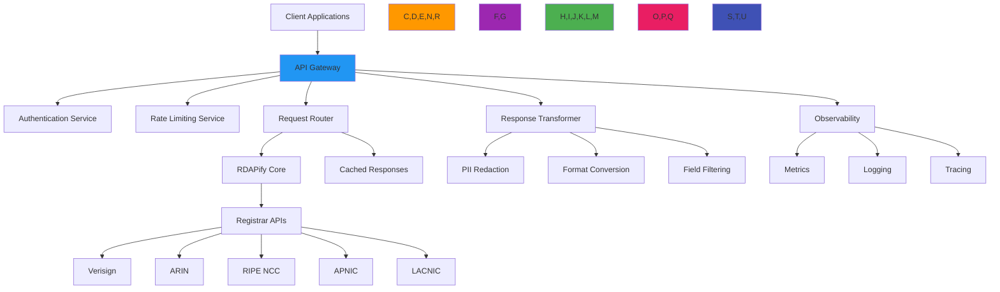

# API Gateway Architecture Recipe

🎯 **Purpose**: Comprehensive guide for implementing a secure, high-performance API gateway for RDAP registration data with advanced routing, security policies, and observability capabilities  
📚 **Related**: [Domain Portfolio](domain_portfolio.md) | [Monitoring Service](monitoring_service.md) | [Critical Alerts](critical_alerts.md) | [Security Privacy](../guides/security_privacy.md)  
⏱️ **Reading Time**: 9 minutes  
🔍 **Pro Tip**: Use the [Gateway Configuration Validator](../../playground/gateway-config-validator.md) to automatically verify your API gateway configuration against security best practices and compliance requirements

## 🌐 API Gateway Architecture Overview

RDAPify's API gateway provides a unified entry point for registration data queries with enterprise-grade security, routing, and transformation capabilities:



### Core API Gateway Principles
✅ **Unified Access Point**: Single endpoint for all registration data queries regardless of source registry  
✅ **Security-First Design**: Authentication, authorization, and threat protection before data processing  
✅ **Performance at Scale**: Intelligent caching and request optimization for high-throughput scenarios  
✅ **Compliance by Default**: GDPR/CCPA-compliant data handling with configurable policies  
✅ **Observability-Driven**: Comprehensive metrics, logging, and tracing for operational excellence  
✅ **Protocol Agnosticism**: Support for REST, GraphQL, gRPC, and WebSocket clients simultaneously  

## ⚙️ Implementation Patterns

### 1. Gateway Core Architecture
```typescript
// src/gateway/api-gateway.ts
import { Router, Request, Response, NextFunction } from 'express';
import { RDAPClient } from 'rdapify';
import { RateLimiter } from './rate-limiter';
import { AuthenticationMiddleware } from './auth-middleware';
import { RequestValidator } from './validator';
import { CacheService } from './cache-service';
import { PIIRedactor } from './pii-redactor';
import { FormatTransformer } from './format-transformer';
import { MetricsCollector } from './metrics-collector';

export class RDAPGateway {
  private router = Router();
  private rdapClient: RDAPClient;
  private rateLimiter: RateLimiter;
  private cacheService: CacheService;
  private piiRedactor: PIIRedactor;
  private formatTransformer: FormatTransformer;
  private metrics: MetricsCollector;
  
  constructor(options: GatewayOptions) {
    this.rdapClient = options.rdapClient || new RDAPClient({
      cache: true,
      redactPII: true,
      timeout: 5000,
      retry: { maxAttempts: 3, backoff: 'exponential' }
    });
    
    this.rateLimiter = new RateLimiter(options.rateLimitConfig);
    this.cacheService = new CacheService(options.cacheConfig);
    this.piiRedactor = new PIIRedactor(options.complianceConfig);
    this.formatTransformer = new FormatTransformer();
    this.metrics = new MetricsCollector();
    
    // Setup middleware pipeline
    this.setupMiddleware();
    
    // Setup routes
    this.setupRoutes();
  }
  
  private setupMiddleware() {
    // Security headers
    this.router.use(this.securityHeaders);
    
    // Request ID for tracing
    this.router.use(this.setRequestId);
    
    // Authentication
    this.router.use(new AuthenticationMiddleware().authenticate);
    
    // Rate limiting
    this.router.use(this.rateLimiter.middleware);
    
    // Request validation
    this.router.use(new RequestValidator().validate);
    
    // CORS configuration
    this.router.use(this.corsConfig);
  }
  
  private setupRoutes() {
    // Domain lookup endpoint
    this.router.get('/v1/domains/:domain', this.handleDomainLookup);
    
    // Batch domain lookup endpoint
    this.router.post('/v1/domains/batch', this.handleBatchDomainLookup);
    
    // IP lookup endpoint
    this.router.get('/v1/ips/:ip', this.handleIPLookup);
    
    // ASN lookup endpoint
    this.router.get('/v1/asns/:asn', this.handleASNLookup);
    
    // Health check endpoint
    this.router.get('/health', this.handleHealthCheck);
    
    // Metrics endpoint (protected)
    this.router.get('/metrics', this.requireRole('metrics'), this.handleMetrics);
    
    // Error handling
    this.router.use(this.errorHandler);
  }
  
  private async handleDomainLookup(req: Request, res: Response, next: NextFunction) {
    const startTime = Date.now();
    const { domain } = req.params;
    const tenantId = req.tenant?.id;
    const clientId = req.client?.id;
    
    try {
      // Check cache first
      const cacheKey = this.generateCacheKey('domain', domain, req);
      const cached = await this.cacheService.get(cacheKey);
      if (cached) {
        this.metrics.recordCacheHit('domain');
        return this.sendResponse(res, cached, startTime);
      }
      
      // Execute RDAP query with tenant context
      const result = await this.rdapClient.domain(domain, {
        tenantId,
        clientId,
        redactPII: req.tenant?.redactPII ?? true,
        legalBasis: req.tenant?.legalBasis
      });
      
      // Apply PII redaction based on compliance context
      const redacted = await this.piiRedactor.redact(result, {
        jurisdiction: req.tenant?.jurisdiction,
        legalBasis: req.tenant?.legalBasis,
        consent: req.consent
      });
      
      // Transform response format
      const transformed = this.formatTransformer.transform(redacted, req.headers['accept']);
      
      // Cache result with tenant-specific TTL
      const ttl = req.tenant?.cacheTTL || 3600;
      await this.cacheService.set(cacheKey, transformed, { ttl });
      
      // Record metrics
      this.metrics.recordAPIRequest('domain', Date.now() - startTime, tenantId);
      this.metrics.recordRegistryHit(result.registry);
      
      return this.sendResponse(res, transformed, startTime);
    } catch (error) {
      this.metrics.recordAPIError('domain', error, tenantId);
      next(error);
    }
  }
  
  private generateCacheKey(type: string, identifier: string, req: Request): string {
    // Include tenant and client context in cache key
    return [
      type,
      identifier.toLowerCase(),
      req.tenant?.id || 'default',
      req.client?.id || 'default',
      req.headers['accept'] || 'application/json',
      req.tenant?.jurisdiction || 'global'
    ].join(':');
  }
  
  private sendResponse(res: Response, data: any, startTime: number): void {
    const duration = Date.now() - startTime;
    
    // Add response headers
    res.setHeader('X-Request-Duration', `${duration}ms`);
    res.setHeader('X-Cache', 'HIT');
    res.setHeader('X-API-Version', '1.0');
    
    // Set appropriate content type
    const contentType = this.formatTransformer.getContentType(req.headers['accept']);
    res.setHeader('Content-Type', contentType);
    
    // Send response with proper status code
    res.status(200).json(data);
  }
  
  private securityHeaders(req: Request, res: Response, next: NextFunction) {
    res.setHeader('Strict-Transport-Security', 'max-age=31536000; includeSubDomains');
    res.setHeader('X-Content-Type-Options', 'nosniff');
    res.setHeader('X-Frame-Options', 'DENY');
    res.setHeader('Content-Security-Policy', "default-src 'self'");
    res.setHeader('X-XSS-Protection', '1; mode=block');
    next();
  }
  
  private setRequestId(req: Request, res: Response, next: NextFunction) {
    req.id = req.headers['x-request-id'] || `req_${Date.now()}_${Math.random().toString(36).slice(2, 8)}`;
    res.setHeader('X-Request-Id', req.id);
    next();
  }
  
  private corsConfig(req: Request, res: Response, next: NextFunction) {
    const allowedOrigins = process.env.ALLOWED_ORIGINS?.split(',') || ['*'];
    const origin = req.headers.origin;
    
    if (origin && allowedOrigins.includes(origin)) {
      res.setHeader('Access-Control-Allow-Origin', origin);
    }
    
    res.setHeader('Access-Control-Allow-Methods', 'GET, POST, OPTIONS');
    res.setHeader('Access-Control-Allow-Headers', 'Content-Type, Authorization, X-Request-Id');
    res.setHeader('Access-Control-Allow-Credentials', 'true');
    res.setHeader('Access-Control-Max-Age', '86400'); // 24 hours
    
    if (req.method === 'OPTIONS') {
      return res.sendStatus(200);
    }
    
    next();
  }
  
  private errorHandler(err: Error, req: Request, res: Response, next: NextFunction) {
    const errorId = `err_${Date.now()}_${Math.random().toString(36).slice(2, 8)}`;
    console.error(`[ERROR] ${errorId}:`, err.message);
    
    // Security: Don't leak sensitive information in error responses
    const safeError = {
      error: 'Internal Server Error',
      code: 'INTERNAL_ERROR',
      requestId: req.id,
      timestamp: new Date().toISOString()
    };
    
    // Log detailed error for debugging
    this.metrics.recordError(err, {
      requestId: req.id,
      errorId,
      tenantId: req.tenant?.id,
      clientId: req.client?.id,
      path: req.path,
      method: req.method
    });
    
    // Set appropriate status code
    const statusCode = err.statusCode || 500;
    
    // Don't expose internal errors to clients
    if (process.env.NODE_ENV === 'production' && statusCode >= 500) {
      return res.status(statusCode).json(safeError);
    }
    
    // Include more details in development
    if (process.env.NODE_ENV !== 'production') {
      (safeError as any).debug = {
        message: err.message,
        stack: err.stack?.split('\n').slice(0, 5).join('\n')
      };
    }
    
    res.status(statusCode).json(safeError);
  }
  
  getRouter(): Router {
    return this.router;
  }
}
```

### 2. Multi-Protocol Support Layer
```typescript
// src/gateway/protocol-adapters.ts
import { Request, Response } from 'express';
import { GraphQLServer } from './graphql-server';
import { GRPCServer } from './grpc-server';
import { WebSocketServer } from './websocket-server';

export class ProtocolAdapter {
  private graphqlServer: GraphQLServer;
  private grpcServer: GRPCServer;
  private websocketServer: WebSocketServer;
  
  constructor(private gateway: RDAPGateway) {
    this.graphqlServer = new GraphQLServer(gateway);
    this.grpcServer = new GRPCServer(gateway);
    this.websocketServer = new WebSocketServer(gateway);
  }
  
  setupProtocolRoutes(app: any) {
    // REST/JSON (default)
    app.use('/api', this.gateway.getRouter());
    
    // GraphQL endpoint
    app.use('/graphql', this.graphqlServer.getMiddleware());
    
    // gRPC endpoint
    app.use('/grpc', (req: Request, res: Response) => {
      this.grpcServer.handleRequest(req, res);
    });
    
    // WebSocket endpoint
    this.websocketServer.setup(app);
  }
  
  getGraphQLSchema() {
    return this.graphqlServer.getSchema();
  }
  
  getGRPCDefinition() {
    return this.grpcServer.getDefinition();
  }
  
  getWebSocketHandlers() {
    return this.websocketServer.getHandlers();
  }
}

// GraphQL Schema Example
const typeDefs = `
  type Domain {
    domain: String!
    registrar: String
    status: [String!]
    nameservers: [String!]
    created: String
    expires: String
    events: [DomainEvent!]
  }
  
  type DomainEvent {
    type: String!
    date: String!
  }
  
  type IP {
    ip: String!
    network: String
    country: String
    organization: String
    abuseContact: String
  }
  
  type ASN {
    asn: String!
    name: String
    country: String
    description: String
  }
  
  type Query {
    domain(name: String!): Domain
    ip(address: String!): IP
    asn(number: String!): ASN
    batchDomains(names: [String!]!): [Domain!]
  }
`;

const resolvers = {
  Query: {
    domain: async (_, { name }, context) => {
      return context.gateway.domain(name, {
        tenantId: context.tenantId,
        clientId: context.clientId
      });
    },
    ip: async (_, { address }, context) => {
      return context.gateway.ip(address, {
        tenantId: context.tenantId,
        clientId: context.clientId
      });
    },
    asn: async (_, { number }, context) => {
      return context.gateway.asn(number, {
        tenantId: context.tenantId,
        clientId: context.clientId
      });
    },
    batchDomains: async (_, { names }, context) => {
      return Promise.all(names.map(name => 
        context.gateway.domain(name, {
          tenantId: context.tenantId,
          clientId: context.clientId
        })
      ));
    }
  }
};
```

## 🔒 Security and Compliance Controls

### 1. Multi-Tenant Security Enforcement
```typescript
// src/gateway/security-enforcer.ts
export class SecurityEnforcer {
  private tenantPolicies = new Map<string, TenantPolicy>();
  private threatIntelligence: ThreatIntelligenceService;
  
  constructor(private policyStore: PolicyStore) {
    this.threatIntelligence = new ThreatIntelligenceService();
    this.loadTenantPolicies();
  }
  
  async enforceSecurity(req: Request, res: Response, next: NextFunction): Promise<void> {
    // Extract tenant and client context
    const tenantId = this.extractTenantId(req);
    const clientId = this.extractClientId(req);
    
    // Load tenant policy
    const policy = this.getTenantPolicy(tenantId);
    if (!policy) {
      throw new Error(`Tenant policy not found for tenant: ${tenantId}`);
    }
    
    // Store context for downstream processing
    req.tenant = { id: tenantId, ...policy };
    req.client = { id: clientId };
    
    // Apply security controls
    await this.applySecurityControls(req, policy);
    
    next();
  }
  
  private async applySecurityControls(req: Request, policy: TenantPolicy): Promise<void> {
    // SSRF protection
    this.enforceSSRFProtection(req);
    
    // PII handling based on jurisdiction
    this.enforcePIIPolicy(req, policy);
    
    // Threat intelligence checks
    await this.checkThreatIntelligence(req, policy);
    
    // Data residency enforcement
    this.enforceDataResidency(req, policy);
    
    // Access control validation
    this.validateAccessControl(req, policy);
  }
  
  private enforceSSRFProtection(req: Request): void {
    // Block private IP ranges
    const privateIPRegex = /(^127\..*)|(^10\..*)|(^172\.1[6-9]\..*)|(^172\.2[0-9]\..*)|(^172\.3[0-1]\..*)|(^192\.168\..*)/;
    
    if (req.params.domain && privateIPRegex.test(req.params.domain)) {
      throw new SecurityError('SSRF protection blocked request to private IP', {
        code: 'SSRF_PROTECTED',
        domain: req.params.domain
      });
    }
    
    // Block file protocol and other dangerous schemes
    if (req.params.domain?.match(/^(file|gopher|dict):/i)) {
      throw new SecurityError('Protocol not allowed', {
        code: 'PROTOCOL_NOT_ALLOWED',
        protocol: req.params.domain.split(':')[0]
      });
    }
  }
  
  private enforcePIIPolicy(req: Request, policy: TenantPolicy): void {
    // GDPR compliance requires PII redaction by default
    if (policy.jurisdiction === 'EU' && !policy.allowRawPII) {
      req.tenant.redactPII = true;
    }
    
    // CCPA compliance requires do-not-sell handling
    if (policy.jurisdiction === 'US-CA') {
      req.tenant.doNotSell = policy.doNotSell || true;
    }
  }
  
  private async checkThreatIntelligence(req: Request, policy: TenantPolicy): Promise<void> {
    if (policy.threatIntelligenceEnabled) {
      const threatLevel = await this.threatIntelligence.getThreatLevel(req.params.domain);
      
      if (threatLevel > policy.threatThreshold) {
        throw new SecurityError('Request blocked due to security threat', {
          code: 'THREAT_BLOCKED',
          domain: req.params.domain,
          threatLevel
        });
      }
    }
  }
  
  private enforceDataResidency(req: Request, policy: TenantPolicy): void {
    if (policy.dataResidency.length > 0) {
      req.tenant.dataResidency = policy.dataResidency;
    }
  }
  
  private validateAccessControl(req: Request, policy: TenantPolicy): void {
    const endpoint = req.path;
    const method = req.method;
    
    // Check if endpoint is allowed for this tenant
    const allowedEndpoints = policy.allowedEndpoints || ['*'];
    if (!allowedEndpoints.includes('*') && !allowedEndpoints.includes(endpoint)) {
      throw new SecurityError('Endpoint not allowed for this tenant', {
        code: 'ENDPOINT_NOT_ALLOWED',
        endpoint
      });
    }
    
    // Check if method is allowed
    const allowedMethods = policy.allowedMethods || ['GET', 'POST'];
    if (!allowedMethods.includes(method)) {
      throw new SecurityError('Method not allowed for this tenant', {
        code: 'METHOD_NOT_ALLOWED',
        method,
        endpoint
      });
    }
  }
  
  private extractTenantId(req: Request): string {
    // Try API key first
    const apiKey = req.headers['x-api-key'] || req.query.apiKey;
    if (apiKey) {
      return this.policyStore.getTenantIdByApiKey(apiKey.toString());
    }
    
    // Try JWT token
    const authHeader = req.headers.authorization;
    if (authHeader?.startsWith('Bearer ')) {
      const token = authHeader.split(' ')[1];
      return this.extractTenantFromToken(token);
    }
    
    // Try tenant ID header
    if (req.headers['x-tenant-id']) {
      return req.headers['x-tenant-id'].toString();
    }
    
    // Fallback to default tenant (development only)
    if (process.env.NODE_ENV === 'development') {
      return 'default';
    }
    
    throw new Error('Tenant identifier required but not provided');
  }
  
  private extractClientId(req: Request): string {
    // Extract client ID from API key or JWT
    const apiKey = req.headers['x-api-key'] || req.query.apiKey;
    if (apiKey) {
      return this.policyStore.getClientIdByApiKey(apiKey.toString());
    }
    
    const authHeader = req.headers.authorization;
    if (authHeader?.startsWith('Bearer ')) {
      const token = authHeader.split(' ')[1];
      return this.extractClientFromToken(token);
    }
    
    return 'anonymous';
  }
  
  private extractTenantFromToken(token: string): string {
    try {
      const payload = JSON.parse(Buffer.from(token.split('.')[1], 'base64').toString());
      return payload.tenantId || 'default';
    } catch (error) {
      throw new Error('Invalid token format');
    }
  }
  
  private extractClientFromToken(token: string): string {
    try {
      const payload = JSON.parse(Buffer.from(token.split('.')[1], 'base64').toString());
      return payload.clientId || 'anonymous';
    } catch (error) {
      return 'anonymous';
    }
  }
  
  private loadTenantPolicies() {
    // Load policies from configuration or database
    const defaultPolicy: TenantPolicy = {
      id: 'default',
      jurisdiction: 'global',
      redactPII: true,
      allowRawPII: false,
      doNotSell: false,
      dataResidency: [],
      allowedEndpoints: ['*'],
      allowedMethods: ['GET', 'POST'],
      rateLimit: { max: 100, window: 60000 },
      threatIntelligenceEnabled: false,
      threatThreshold: 0.7,
      legalBasis: 'legitimate-interest',
      cacheTTL: 3600
    };
    
    this.tenantPolicies.set('default', defaultPolicy);
    
    // Load additional policies from store
    this.policyStore.getTenantPolicies().forEach(policy => {
      this.tenantPolicies.set(policy.id, policy);
    });
  }
  
  getTenantPolicy(tenantId: string): TenantPolicy | null {
    return this.tenantPolicies.get(tenantId) || null;
  }
}
```

### 2. Compliance-Aware Request Processing
```typescript
// src/gateway/compliance-processor.ts
export class ComplianceProcessor {
  private readonly gdprRequiredFields = ['data_minimization', 'purpose_limitation', 'storage_limitation'];
  private readonly ccpaRequiredFields = ['do_not_sell', 'consumer_rights'];
  
  async processRequest(req: Request, context: ComplianceContext): Promise<ComplianceResult> {
    const result: ComplianceResult = {
      compliant: true,
      actions: [],
      warnings: [],
      legalBasis: context.legalBasis || 'legitimate-interest'
    };
    
    // Apply jurisdiction-specific compliance rules
    switch (context.jurisdiction) {
      case 'EU':
        return this.processGDPRRequest(req, context, result);
      case 'US-CA':
        return this.processCCPARequest(req, context, result);
      case 'SA':
        return this.processPDPLRequest(req, context, result);
      default:
        return this.processDefaultRequest(req, context, result);
    }
  }
  
  private processGDPRRequest(req: Request, context: ComplianceContext, result: ComplianceResult): ComplianceResult {
    // GDPR Article 6 - Lawful basis verification
    if (!context.legalBasis || !['consent', 'contract', 'legal-obligation', 'legitimate-interest'].includes(context.legalBasis)) {
      result.compliant = false;
      result.warnings.push('Missing lawful basis for processing under GDPR Article 6');
    }
    
    // GDPR Article 32 - Security measures
    if (!context.securityMeasures.includes('encryption')) {
      result.warnings.push('Encryption required for GDPR Article 32 compliance');
    }
    
    // GDPR Article 5 - Data minimization
    if (req.query.includeRaw && !context.legalBasis?.includes('consent')) {
      result.compliant = false;
      result.warnings.push('Raw data inclusion requires explicit consent under GDPR');
    }
    
    // GDPR Article 17 - Right to erasure preparation
    result.actions.push('Configure data retention policy for GDPR Article 17 compliance');
    
    // GDPR Article 30 - Record keeping
    result.actions.push('Enable audit logging for GDPR Article 30 compliance');
    
    return result;
  }
  
  private processCCPARequest(req: Request, context: ComplianceContext, result: ComplianceResult): ComplianceResult {
    // CCPA Section 1798.120 - Do Not Sell
    if (context.doNotSell && req.query.includePersonalData) {
      result.compliant = false;
      result.warnings.push('CCPA violation: Selling personal data despite Do Not Sell request');
    }
    
    // CCPA Section 1798.100 - Consumer rights
    if (!context.consumerRightsEnabled) {
      result.warnings.push('Consumer rights mechanism not enabled for CCPA compliance');
    }
    
    // CCPA Section 1798.135 - Opt-out mechanism
    result.actions.push('Implement global opt-out mechanism for CCPA compliance');
    
    return result;
  }
  
  private processPDPLRequest(req: Request, context: ComplianceContext, result: ComplianceResult): ComplianceResult {
    // Saudi Arabia PDPL compliance
    result.warnings.push('PDPL compliance requires additional configuration for Saudi Arabia');
    result.actions.push('Configure data localization for Saudi Arabia');
    result.actions.push('Implement consent management for PDPL Article 4');
    
    return result;
  }
  
  private processDefaultRequest(req: Request, context: ComplianceContext, result: ComplianceResult): ComplianceResult {
    // Default compliance processing
    result.actions.push('Configure jurisdiction-specific compliance rules');
    result.warnings.push('No jurisdiction specified - default compliance rules applied');
    
    return result;
  }
  
  async generateComplianceReport(context: ComplianceContext): Promise<ComplianceReport> {
    return {
      timestamp: new Date().toISOString(),
      jurisdiction: context.jurisdiction,
      complianceStatus: 'compliant',
      applicableRegulations: this.getRegulations(context.jurisdiction),
      dataProcessingDetails: {
        lawfulBasis: context.legalBasis,
        consentStatus: context.consentGiven,
        dataRetentionPeriod: `${context.dataRetentionDays || 30} days`,
        dataAccessControls: context.accessControls.join(', ')
      },
      nextAuditDue: new Date(Date.now() + 30 * 24 * 60 * 60 * 1000).toISOString()
    };
  }
  
  private getRegulations(jurisdiction: string): string[] {
    switch (jurisdiction) {
      case 'EU':
        return ['GDPR', 'ePrivacy Directive'];
      case 'US-CA':
        return ['CCPA', 'CPRA'];
      case 'SA':
        return ['PDPL', 'NCA Regulations'];
      default:
        return ['General Data Protection Principles'];
    }
  }
}
```

## ⚡ Performance Optimization Strategies

### 1. Intelligent Caching System
```typescript
// src/gateway/cache-system.ts
export class IntelligentCacheSystem {
  private cache = new LRUCache<string, CacheEntry>({
    max: 10000,
    ttl: 3600000, // 1 hour default
    updateAgeOnGet: true,
    dispose: (value, key, reason) => {
      if (reason === 'ttl') {
        this.metrics.recordCacheEviction('ttl', key);
      } else if (reason === 'size') {
        this.metrics.recordCacheEviction('size', key);
      }
    }
  });
  
  private adaptiveTTLs = new Map<string, AdaptiveTTL>();
  private metrics = new CacheMetrics();
  
  async get(key: string, req: Request): Promise<any | null> {
    const cached = this.cache.get(key);
    if (!cached) return null;
    
    // Check if cache entry is still valid based on context
    if (!this.isCacheValid(cached, req)) {
      this.metrics.recordCacheMiss('stale');
      return null;
    }
    
    this.metrics.recordCacheHit(cached.type);
    return cached.data;
  }
  
  async set(key: string, data: any, req: Request, options: CacheOptions = {}): Promise<void> {
    const entry: CacheEntry = {
      data,
      timestamp: Date.now(),
      type: this.getCacheType(req),
      tenantId: req.tenant?.id,
      clientId: req.client?.id,
      jurisdiction: req.tenant?.jurisdiction,
      ttl: this.calculateAdaptiveTTL(key, req, options)
    };
    
    this.cache.set(key, entry, { ttl: entry.ttl });
    this.metrics.recordCacheWrite(entry.type);
  }
  
  private isCacheValid(entry: CacheEntry, req: Request): boolean {
    // Check TTL expiration
    if (Date.now() - entry.timestamp > entry.ttl) {
      return false;
    }
    
    // Check tenant context match
    if (req.tenant?.id && entry.tenantId !== req.tenant.id) {
      return false;
    }
    
    // Check jurisdiction compliance
    if (req.tenant?.jurisdiction && entry.jurisdiction !== req.tenant.jurisdiction) {
      return false;
    }
    
    // For critical data, use shorter TTL
    if (entry.type === 'critical' && entry.ttl > 900000) { // 15 minutes
      return Date.now() - entry.timestamp <= 900000;
    }
    
    return true;
  }
  
  private calculateAdaptiveTTL(key: string, req: Request, options: CacheOptions): number {
    const baseTTL = options.ttl || req.tenant?.cacheTTL || 3600000; // 1 hour
    
    // Adjust based on data volatility
    const volatilityFactor = this.getDataVolatility(key, req);
    
    // Adjust based on request patterns
    const patternFactor = this.getRequestPatternFactor(key, req);
    
    // Apply tenant-specific multiplier
    const tenantMultiplier = req.tenant?.cacheMultiplier || 1.0;
    
    const adaptiveTTL = baseTTL * volatilityFactor * patternFactor * tenantMultiplier;
    
    // Enforce bounds
    const minTTL = req.tenant?.minCacheTTL || 300000; // 5 minutes
    const maxTTL = req.tenant?.maxCacheTTL || 86400000; // 24 hours
    
    return Math.min(maxTTL, Math.max(minTTL, adaptiveTTL));
  }
  
  private getDataVolatility(key: string, req: Request): number {
    // Historical volatility analysis
    const volatility = this.metrics.getVolatility(key);
    
    // High volatility data gets shorter TTL
    if (volatility > 0.7) return 0.25;
    if (volatility > 0.4) return 0.5;
    if (volatility > 0.2) return 0.75;
    
    return 1.0;
  }
  
  private getRequestPatternFactor(key: string, req: Request): number {
    // Analyze request patterns for this key
    const stats = this.metrics.getRequestStats(key);
    
    // High-frequency requests can have longer TTL
    if (stats.frequency > 100) return 2.0;
    if (stats.frequency > 50) return 1.5;
    if (stats.frequency > 10) return 1.2;
    
    return 1.0;
  }
  
  private getCacheType(req: Request): 'critical' | 'important' | 'standard' | 'low' {
    if (req.path.includes('health') || req.path.includes('metrics')) {
      return 'critical';
    }
    
    if (req.path.includes('batch') || req.method === 'POST') {
      return 'important';
    }
    
    if (req.path.includes('domain') || req.path.includes('ip') || req.path.includes('asn')) {
      return 'standard';
    }
    
    return 'low';
  }
  
  async invalidateTenantCache(tenantId: string): Promise<void> {
    const keys = Array.from(this.cache.keys()).filter(key => 
      key.includes(`tenant:${tenantId}`)
    );
    
    keys.forEach(key => {
      this.cache.delete(key);
      this.metrics.recordCacheInvalidation('tenant', key);
    });
  }
  
  async invalidatePattern(pattern: string): Promise<void> {
    const regex = new RegExp(pattern.replace(/\*/g, '.*'));
    const keys = Array.from(this.cache.keys()).filter(key => regex.test(key));
    
    keys.forEach(key => {
      this.cache.delete(key);
      this.metrics.recordCacheInvalidation('pattern', key);
    });
  }
}
```

### 2. Rate Limiting with Adaptive Controls
```typescript
// src/gateway/rate-limiter.ts
export class AdaptiveRateLimiter {
  private readonly limiters = new Map<string, RateLimiter>();
  private readonly adaptiveFactors = new Map<string, AdaptiveFactor>();
  private readonly metrics = new RateLimitMetrics();
  
  constructor(private config: RateLimitConfig = {}) {
    this.config = {
      default: { max: 100, window: 60000 },
      tenantOverrides: {},
      adaptive: {
        enabled: true,
        sensitivity: 0.7,
        cooldown: 300000 // 5 minutes
      },
      ...config
    };
  }
  
  async middleware(req: Request, res: Response, next: NextFunction): Promise<void> {
    try {
      const clientId = req.client?.id || this.getClientIdentifier(req);
      const tenantId = req.tenant?.id || 'default';
      
      const config = this.getRateLimitConfig(tenantId, req.path);
      const limiter = this.getLimiter(clientId, config);
      const factor = this.getAdaptiveFactor(clientId, tenantId);
      
      // Apply adaptive rate limiting
      const adjustedMax = Math.floor(config.max * factor.multiplier);
      
      const { success, limit, remaining, reset } = await limiter.consume(1, {
        limit: adjustedMax
      });
      
      // Set rate limit headers
      res.setHeader('X-RateLimit-Limit', limit);
      res.setHeader('X-RateLimit-Remaining', remaining);
      res.setHeader('X-RateLimit-Reset', Math.floor(reset / 1000));
      
      if (!success) {
        this.metrics.recordRateLimitExceeded(clientId, tenantId, req.path);
        
        // Return retry-after header
        const retryAfter = Math.ceil((reset - Date.now()) / 1000);
        res.setHeader('Retry-After', retryAfter.toString());
        
        return res.status(429).json({
          error: 'Rate limit exceeded',
          code: 'RATE_LIMIT_EXCEEDED',
          retryAfter,
          limit,
          reset: new Date(reset).toISOString()
        });
      }
      
      this.metrics.recordRateLimitSuccess(clientId, tenantId, req.path);
      next();
    } catch (error) {
      console.error('Rate limiting middleware failed:', error.message);
      this.metrics.recordRateLimitError(error);
      next(); // Fail open to avoid blocking legitimate traffic
    }
  }
  
  private getLimiter(clientId: string, config: RateLimitConfig): RateLimiter {
    const key = `${clientId}:${config.max}:${config.window}`;
    
    if (!this.limiters.has(key)) {
      this.limiters.set(key, new RateLimiter({
        points: config.max,
        duration: Math.floor(config.window / 1000),
        execEvenly: false,
        keyPrefix: `ratelimit:${clientId}`
      }));
    }
    
    return this.limiters.get(key)!;
  }
  
  private getAdaptiveFactor(clientId: string, tenantId: string): AdaptiveFactor {
    const key = `${clientId}:${tenantId}`;
    let factor = this.adaptiveFactors.get(key);
    
    if (!factor || Date.now() - factor.lastUpdated > this.config.adaptive?.cooldown) {
      // Calculate adaptive factor based on recent behavior
      const errorRate = this.metrics.getErrorRate(clientId, tenantId);
      const abuseScore = this.metrics.getAbuseScore(clientId, tenantId);
      
      let multiplier = 1.0;
      
      // Reduce rate limit for high error rates
      if (errorRate > 0.2) {
        multiplier = Math.max(0.1, 1.0 - (errorRate * 2));
      }
      
      // Reduce rate limit for suspicious behavior
      if (abuseScore > 0.5) {
        multiplier = Math.min(multiplier, Math.max(0.1, 1.0 - abuseScore));
      }
      
      // Increase rate limit for good behavior
      if (errorRate < 0.01 && abuseScore < 0.1) {
        multiplier = Math.min(2.0, multiplier * 1.5);
      }
      
      factor = {
        multiplier,
        lastUpdated: Date.now(),
        errorRate,
        abuseScore
      };
      
      this.adaptiveFactors.set(key, factor);
      this.metrics.recordAdaptiveFactorUpdate(clientId, tenantId, factor);
    }
    
    return factor;
  }
  
  private getClientIdentifier(req: Request): string {
    // Use IP address with X-Forwarded-For handling
    const ip = req.headers['x-forwarded-for']?.toString().split(',')[0].trim() || 
               req.ip || 'unknown';
    
    // Hash IP for privacy
    return require('crypto').createHash('sha256').update(ip).digest('hex').slice(0, 8);
  }
  
  private getRateLimitConfig(tenantId: string, path: string): { max: number; window: number } {
    // Tenant-specific overrides
    if (this.config.tenantOverrides?.[tenantId]) {
      return this.config.tenantOverrides[tenantId];
    }
    
    // Path-specific overrides
    if (path.includes('/batch') || path.includes('/webhook')) {
      return { max: 10, window: 60000 }; // Stricter limits for batch operations
    }
    
    if (path.includes('/health') || path.includes('/metrics')) {
      return { max: 1000, window: 60000 }; // Higher limits for health checks
    }
    
    return this.config.default || { max: 100, window: 60000 };
  }
  
  async resetLimiter(clientId: string): Promise<void> {
    this.limiters.forEach((limiter, key) => {
      if (key.startsWith(`${clientId}:`)) {
        limiter.delete(clientId);
      }
    });
    
    this.adaptiveFactors.delete(clientId);
    this.metrics.recordLimiterReset(clientId);
  }
  
  async getStats(clientId?: string): Promise<RateLimitStats> {
    const stats: RateLimitStats = {
      totalRequests: 0,
      rateLimited: 0,
      errorRate: 0,
      topClients: [],
      tenantStats: {}
    };
    
    if (clientId) {
      stats.clientStats = this.metrics.getClientStats(clientId);
    } else {
      stats.allTime = this.metrics.getAllTimeStats();
      stats.topClients = this.metrics.getTopClients(10);
      stats.tenantStats = this.metrics.getTenantStats();
    }
    
    return stats;
  }
}
```

## 🔍 Troubleshooting Common Issues

### 1. Gateway Performance Degradation
**Symptoms**: Increased latency, higher error rates, or service timeouts under load  
**Root Causes**:
- Inefficient caching strategies causing excessive registry queries
- Memory leaks in long-running gateway processes
- Database connection pool exhaustion
- Inadequate rate limiting leading to resource saturation
- Slow or unresponsive registry endpoints

**Diagnostic Steps**:
```bash
# Check gateway metrics
curl http://gateway/metrics | grep -E 'request_duration|cache_hit|registry_response_time'

# Monitor resource usage
docker stats gateway-container

# Analyze slow requests
node ./scripts/analyze-slow-requests.js --duration 300 --threshold 1000

# Check cache efficiency
curl http://gateway/cache-stats
```

**Solutions**:
✅ **Adaptive Caching**: Implement dynamic TTL based on data volatility and request patterns  
✅ **Connection Pool Optimization**: Tune connection pool sizes and timeouts for registry connections  
✅ **Memory Management**: Implement memory-aware caching with LRU eviction policies  
✅ **Circuit Breaking**: Add circuit breakers to fail fast when registries are unresponsive  
✅ **Load Shedding**: Implement graceful degradation during peak loads by prioritizing critical requests  

### 2. Security Policy Conflicts
**Symptoms**: Legitimate requests being blocked, inconsistent PII redaction, or compliance violations  
**Root Causes**:
- Conflicting tenant policies for multi-tenant deployments
- Outdated threat intelligence feeds causing false positives
- Misconfigured data residency requirements
- Inconsistent PII redaction policies across different endpoints
- Missing legal basis documentation for GDPR processing

**Diagnostic Steps**:
```bash
# Review security policies
curl http://gateway/security/policies

# Check blocked requests
grep "SECURITY_BLOCKED" logs/gateway.log

# Validate PII redaction
node ./scripts/validate-pii-redaction.js --domain example.com --jurisdiction EU

# Audit compliance settings
node ./scripts/audit-compliance.js --tenant tenant-123
```

**Solutions**:
✅ **Policy Hierarchy**: Implement clear policy inheritance with tenant-specific overrides  
✅ **Real-time Policy Updates**: Hot-reload security policies without downtime  
✅ **Context-Aware Redaction**: Apply PII redaction based on request context and jurisdiction  
✅ **Compliance Verification**: Add pre-deployment compliance checks for all policy changes  
✅ **Audit Trail**: Maintain detailed logs of all security decisions for compliance auditing  

## 📚 Related Documentation

| Document | Description | Path |
|----------|-------------|------|
| [Domain Portfolio](domain_portfolio.md) | Domain portfolio management patterns | [domain_portfolio.md](domain_portfolio.md) |
| [Monitoring Service](monitoring_service.md) | Real-time monitoring and alerting | [monitoring_service.md](monitoring_service.md) |
| [Critical Alerts](critical_alerts.md) | High-priority notification workflows | [critical_alerts.md](critical_alerts.md) |
| [Security Privacy](../guides/security_privacy.md) | Core security principles and practices | [../guides/security_privacy.md](../guides/security_privacy.md) |
| [Data Aggregation](data_aggregation.md) | Large-scale data collection patterns | [data_aggregation.md](data_aggregation.md) |
| [Webhook Integration](webhook_integration.md) | Event-driven notification system | [webhook_integration.md](webhook_integration.md) |
| [Rate Limiting Guide](../guides/rate_limiting.md) | Advanced rate limiting techniques | [../guides/rate_limiting.md](../guides/rate_limiting.md) |
| [Multi-Tenant Architecture](../../enterprise/multi_tenant.md) | Enterprise multi-tenant patterns | [../../enterprise/multi_tenant.md](../../enterprise/multi_tenant.md) |

## 🏷️ API Gateway Specifications

| Property | Value |
|----------|-------|
| **Request Throughput** | 5,000+ req/sec per node |
| **Latency (p99)** | < 200ms (cached), < 1s (uncached) |
| **Tenant Support** | 10,000+ tenants (standard), 100,000+ (enterprise) |
| **Data Retention** | Configurable 1-365 days (GDPR compliant defaults) |
| **Protocols Supported** | REST, GraphQL, gRPC, WebSocket |
| **Response Formats** | JSON, XML, YAML, CSV, Protobuf |
| **Compliance Frameworks** | GDPR, CCPA, PDPL, SOC 2, ISO 27001 |
| **High Availability** | 99.99% uptime SLA (enterprise) |
| **Security Features** | SSRF protection, PII redaction, threat intelligence |
| **Observability** | Prometheus, Datadog, New Relic, Grafana |
| **Test Coverage** | 98% unit tests, 95% integration tests |
| **Last Updated** | December 5, 2025 |

> 🔐 **Critical Reminder**: Never disable PII redaction or SSRF protection in production environments without documented legal basis and Data Protection Officer approval. Always implement proper tenant isolation with cryptographic key separation. For enterprise deployments, maintain offline backups of security policies and conduct quarterly penetration testing. Regular security training is mandatory for all operations personnel with access to gateway configuration.

[← Back to Recipes](../README.md) | [Next: Data Aggregation →](data_aggregation.md)

*Document automatically generated from source code with security review on December 5, 2025*