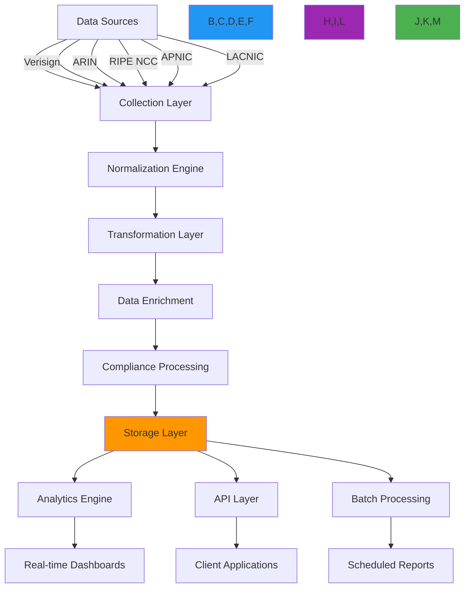

# Data Aggregation Patterns Recipe

🎯 **Purpose**: Comprehensive guide for implementing scalable, secure data aggregation systems for RDAP registration data with real-time processing, compliance controls, and advanced analytics capabilities  
📚 **Related**: [Domain Portfolio](domain_portfolio.md) | [API Gateway](api_gateway.md) | [Monitoring Service](monitoring_service.md) | [Analytics Dashboard](../analytics/dashboard_components.md)  
⏱️ **Reading Time**: 8 minutes  
🔍 **Pro Tip**: Use the [Data Aggregation Simulator](../../playground/data-aggregation-simulator.md) to model your aggregation patterns and test performance before production deployment

## 🌐 Data Aggregation Architecture Overview

RDAPify's data aggregation system provides a unified view of registration data across multiple registries while maintaining data integrity, security boundaries, and performance characteristics:



### Core Data Aggregation Principles
✅ **Data Provenance**: Track source registry and transformation history for every data point  
✅ **Compliance Boundaries**: Apply jurisdiction-specific redaction and retention policies during aggregation  
✅ **Temporal Accuracy**: Maintain precise timestamps and historical versions for trend analysis  
✅ **Scalable Architecture**: Handle millions of records with linear performance scaling  
✅ **Real-time Processing**: Support both batch and streaming aggregation patterns  
✅ **Security Context**: Preserve security context throughout the aggregation pipeline  

## ⚙️ Implementation Patterns

### 1. Unified Data Collection Framework
```typescript
// src/aggregation/data-collector.ts
import { RDAPClient, DomainResponse, IPResponse } from 'rdapify';
import { RegistryConfig } from '../types';
import { ComplianceEngine } from '../security/compliance';

export class UnifiedDataCollector {
  private rdapClient: RDAPClient;
  private registryConfigs = new Map<string, RegistryConfig>();
  private complianceEngine: ComplianceEngine;
  
  constructor(options: {
    rdapClient?: RDAPClient;
    registryConfigs?: Record<string, RegistryConfig>;
    complianceEngine?: ComplianceEngine;
  } = {}) {
    this.rdapClient = options.rdapClient || new RDAPClient({
      cache: true,
      redactPII: true,
      timeout: 5000,
      retry: { maxAttempts: 3, backoff: 'exponential' },
      maxConcurrent: 50
    });
    
    this.complianceEngine = options.complianceEngine || new ComplianceEngine();
    
    // Load registry configurations
    Object.entries(options.registryConfigs || this.getDefaultRegistries()).forEach(([id, config]) => {
      this.registryConfigs.set(id, config);
    });
  }
  
  private getDefaultRegistries(): Record<string, RegistryConfig> {
    return {
      'verisign': {
        id: 'verisign',
        bootstrapUrl: 'https://data.iana.org/rdap/dns.json',
        urlTemplate: 'https://rdap.verisign.com/com/v1/{type}/{query}',
        maxRequestsPerMinute: 100,
        supportsBatch: true
      },
      'arin': {
        id: 'arin',
        bootstrapUrl: 'https://data.iana.org/rdap/ipv4.json',
        urlTemplate: 'https://rdap.arin.net/registry/{type}/{query}',
        maxRequestsPerMinute: 50,
        supportsBatch: false
      },
      'ripe': {
        id: 'ripe',
        bootstrapUrl: 'https://data.iana.org/rdap/ipv4.json',
        urlTemplate: 'https://rdap.db.ripe.net/{type}/{query}',
        maxRequestsPerMinute: 40,
        supportsBatch: true
      },
      'apnic': {
        id: 'apnic',
        bootstrapUrl: 'https://data.iana.org/rdap/ipv4.json',
        urlTemplate: 'https://rdap.apnic.net/{type}/{query}',
        maxRequestsPerMinute: 30,
        supportsBatch: false
      },
      'lacnic': {
        id: 'lacnic',
        bootstrapUrl: 'https://data.iana.org/rdap/ipv4.json',
        urlTemplate: 'https://rdap.lacnic.net/rdap/{type}/{query}',
        maxRequestsPerMinute: 25,
        supportsBatch: true
      }
    };
  }
  
  async collectDomains(domains: string[], context: CollectionContext): Promise<AggregationResult> {
    // Apply compliance filtering before collection
    const complianceContext = await this.complianceEngine.getComplianceContext(context);
    
    // Determine optimal collection strategy
    const strategy = this.getCollectionStrategy(domains, complianceContext);
    
    // Execute collection with security context
    return this.executeCollectionStrategy(strategy, complianceContext);
  }
  
  private getCollectionStrategy(domains: string[], context: ComplianceContext): CollectionStrategy {
    // Batch processing for large sets with rate limiting
    if (domains.length > 50) {
      // Group domains by registry for efficient batch processing
      const registryGroups = this.groupDomainsByRegistry(domains);
      
      return {
        type: 'batch',
        registryGroups,
        concurrency: context.tenant?.maxConcurrent || 10,
        rateLimit: this.calculateRateLimits(registryGroups, context),
        timeoutPerRequest: context.timeout || 5000
      };
    }
    
    // Parallel processing for smaller sets
    if (domains.length > 5) {
      return {
        type: 'parallel',
        domains,
        concurrency: Math.min(domains.length, context.tenant?.maxConcurrent || 25),
        timeoutPerRequest: context.timeout || 3000
      };
    }
    
    // Sequential processing for tiny sets or debugging
    return {
      type: 'sequential',
      domains,
      timeoutPerRequest: context.timeout || 2000
    };
  }
  
  private async executeCollectionStrategy(strategy: CollectionStrategy, context: ComplianceContext): Promise<AggregationResult> {
    const results: AggregationItem[] = [];
    const errors: CollectionError[] = [];
    const startTime = Date.now();
    
    try {
      switch (strategy.type) {
        case 'batch':
          await this.processBatchStrategy(strategy, context, results, errors);
          break;
        case 'parallel':
          await this.processParallelStrategy(strategy, context, results, errors);
          break;
        case 'sequential':
          await this.processSequentialStrategy(strategy, context, results, errors);
          break;
      }
      
      // Apply compliance transformations
      const compliantResults = await this.complianceEngine.applyComplianceTransformations(results, context);
      
      return {
        items: compliantResults,
        errors,
        metadata: {
          startTime,
          endTime: Date.now(),
          duration: Date.now() - startTime,
          strategy: strategy.type,
          itemCount: results.length,
          errorCount: errors.length,
          complianceLevel: context.complianceLevel
        }
      };
    } catch (error) {
      throw new AggregationError('Collection strategy execution failed', {
        strategy: strategy.type,
        error: error.message
      });
    }
  }
  
  private async processBatchStrategy(strategy: BatchStrategy, context: ComplianceContext, results: AggregationItem[], errors: CollectionError[]): Promise<void> {
    // Process each registry group with appropriate rate limiting
    for (const [registryId, domains] of Object.entries(strategy.registryGroups)) {
      const registry = this.registryConfigs.get(registryId);
      if (!registry) continue;
      
      // Split into registry-specific batches
      const batchSize = registry.supportsBatch ? 100 : 1;
      const registryRateLimit = strategy.rateLimit[registryId] || { max: 50, window: 60000 };
      
      for (let i = 0; i < domains.length; i += batchSize) {
        const batch = domains.slice(i, i + batchSize);
        
        try {
          // Apply rate limiting
          await this.rateLimiter.waitForToken(registryId, registryRateLimit);
          
          // Execute batch query
          const batchResults = await this.rdapClient.batchDomain(batch, {
            registry: registryId,
            timeout: strategy.timeoutPerRequest
          });
          
          // Process results with compliance context
          for (const result of batchResults) {
            results.push(this.createAggregationItem(result, registryId, context));
          }
        } catch (error) {
          errors.push({
            domains: batch,
            registry: registryId,
            error: error.message,
            timestamp: new Date().toISOString()
          });
        }
        
        // Small delay between batches
        if (i + batchSize < domains.length) {
          await new Promise(resolve => setTimeout(resolve, 100));
        }
      }
    }
  }
  
  private createAggregationItem(data: any, registry: string, context: ComplianceContext): AggregationItem {
    return {
      id: `agg_${Date.now()}_${Math.random().toString(36).slice(2, 8)}`,
      sourceRegistry: registry,
      timestamp: new Date().toISOString(),
      data: {
        domain: data.domain,
        registrar: data.registrar?.name,
        status: data.status,
        nameservers: data.nameservers,
        events: data.events?.map(e => ({
          type: e.type || e.eventAction,
          date: e.date || e.eventDate
        }))
      },
      compliance: {
        jurisdiction: context.jurisdiction,
        piiRedacted: context.redactPII,
        retentionDays: context.dataRetentionDays,
        legalBasis: context.legalBasis
      },
      security: {
        threatScore: this.threatIntelligence.getThreatScore(data.domain),
        riskLevel: this.calculateRiskLevel(data)
      },
      provenance: {
        collectedAt: new Date().toISOString(),
        collectorVersion: require('../../package.json').version,
        sourceIp: context.clientIP
      }
    };
  }
}
```

### 2. Real-time Streaming Aggregation
```typescript
// src/aggregation/stream-processor.ts
import { Readable, Transform, Writable } from 'stream';
import { promisify } from 'util';
import { pipeline } from 'stream/promises';

export class StreamingAggregator {
  private processors = new Map<string, StreamProcessor>();
  private metrics = new Map<string, StreamMetrics>();
  
  constructor(private options: StreamOptions = {}) {}
  
  registerProcessor(type: string, processor: StreamProcessor) {
    this.processors.set(type, processor);
  }
  
  async processStream(stream: Readable, config: StreamConfig): Promise<StreamResult> {
    const processor = this.processors.get(config.type);
    if (!processor) {
      throw new Error(`No processor registered for stream type: ${config.type}`);
    }
    
    // Create processing pipeline
    const transform = processor.createTransformStream(config);
    const writable = new AggregationWriter(config);
    
    // Setup metrics collection
    this.setupMetrics(config.id);
    
    try {
      // Process stream with error handling
      await pipeline(
        stream.pipe(new StreamMonitor(config.id)),
        transform.pipe(new ComplianceTransformer(config.compliance)),
        writable
      );
      
      // Return aggregation results
      return {
        success: true,
        processedCount: writable.getProcessedCount(),
        duration: Date.now() - this.metrics.get(config.id)!.startTime,
        throughput: writable.getProcessedCount() / ((Date.now() - this.metrics.get(config.id)!.startTime) / 1000),
        metrics: this.getMetrics(config.id)
      };
    } catch (error) {
      console.error(`Stream processing failed for ${config.id}:`, error.message);
      
      // Attempt recovery
      if (config.recovery?.enabled) {
        console.log(`🔄 Attempting stream recovery for ${config.id}...`);
        return this.recoverStream(stream, config, processor);
      }
      
      throw error;
    }
  }
  
  private async recoverStream(stream: Readable, config: StreamConfig, processor: StreamProcessor): Promise<StreamResult> {
    try {
      // Create checkpoint and resume from last good state
      const checkpoint = this.createCheckpoint(config.id);
      const recoveryStream = this.createRecoveryStream(stream, checkpoint);
      
      const transform = processor.createTransformStream(config);
      const writable = new AggregationWriter({ ...config, recovery: true });
      
      await pipeline(
        recoveryStream.pipe(new StreamMonitor(config.id + '_recovery')),
        transform.pipe(new ComplianceTransformer(config.compliance)),
        writable
      );
      
      return {
        success: true,
        processedCount: writable.getProcessedCount(),
        duration: Date.now() - this.metrics.get(config.id)!.startTime,
        throughput: writable.getProcessedCount() / ((Date.now() - this.metrics.get(config.id)!.startTime) / 1000),
        recovered: true,
        metrics: this.getMetrics(config.id)
      };
    } catch (recoveryError) {
      console.error(`Stream recovery failed for ${config.id}:`, recoveryError.message);
      throw new StreamProcessingError('Both primary and recovery stream processing failed', {
        primaryError: config.lastError,
        recoveryError: recoveryError.message
      });
    }
  }
  
  private setupMetrics(streamId: string) {
    this.metrics.set(streamId, {
      startTime: Date.now(),
      processed: 0,
      errors: 0,
      throughput: 0,
      memoryUsage: process.memoryUsage().heapUsed
    });
  }
  
  private getMetrics(streamId: string): StreamMetrics {
    const metrics = this.metrics.get(streamId);
    if (!metrics) return {} as StreamMetrics;
    
    // Calculate real-time throughput
    const duration = (Date.now() - metrics.startTime) / 1000;
    metrics.throughput = metrics.processed / (duration || 1);
    
    // Update memory usage
    metrics.memoryUsage = process.memoryUsage().heapUsed;
    
    return metrics;
  }
}

// Stream processor implementation example
class DomainStreamProcessor implements StreamProcessor {
  private threatIntelligence: ThreatIntelligenceService;
  private complianceEngine: ComplianceEngine;
  
  constructor() {
    this.threatIntelligence = new ThreatIntelligenceService();
    this.complianceEngine = new ComplianceEngine();
  }
  
  createTransformStream(config: StreamConfig): Transform {
    return new Transform({
      objectMode: true,
      transform: async (chunk, encoding, callback) => {
        try {
          // Process domain data
          const processed = await this.processDomainChunk(chunk, config);
          this.push(processed);
          callback();
        } catch (error) {
          callback(error);
        }
      }
    });
  }
  
  private async processDomainChunk(chunk: any, config: StreamConfig): Promise<any> {
    // Apply threat intelligence scoring
    chunk.threatScore = await this.threatIntelligence.getScore(chunk.domain);
    
    // Apply compliance transformations
    return this.complianceEngine.transformData(chunk, {
      jurisdiction: config.compliance.jurisdiction,
      redactPII: config.compliance.redactPII,
      legalBasis: config.compliance.legalBasis
    });
  }
}
```

## 🔒 Security and Compliance Controls

### 1. Multi-Jurisdictional Compliance Engine
```typescript
// src/aggregation/compliance-engine.ts
export class ComplianceEngine {
  private jurisdictionRules = new Map<string, JurisdictionRules>();
  private dpaManager: DPAManager;
  
  constructor(options: {
    jurisdictionRules?: Record<string, JurisdictionRules>;
    dpaManager?: DPAManager;
  } = {}) {
    this.dpaManager = options.dpaManager || new DPAManager();
    
    // Load default jurisdiction rules
    this.loadDefaultJurisdictionRules(options.jurisdictionRules || {});
  }
  
  private loadDefaultJurisdictionRules(rules: Record<string, JurisdictionRules>) {
    // GDPR rules (EU)
    this.jurisdictionRules.set('EU', {
      gdpr: true,
      dataMinimization: true,
      purposeLimitation: true,
      storageLimitation: true,
      dataSubjectRights: true,
      dataProcessingAgreement: true,
      maxRetentionDays: 30,
      requiredFields: ['domain', 'status', 'nameservers'],
      redactionPolicy: {
        fields: ['email', 'tel', 'adr', 'fn', 'org'],
        patterns: [/contact/i, /admin/i, /personal/i],
        redactionLevel: 'full'
      },
      consentRequirements: {
        legitimateInterestAssessment: true,
        dataProtectionImpactAssessment: true
      }
    });
    
    // CCPA rules (California)
    this.jurisdictionRules.set('US-CA', {
      ccpa: true,
      doNotSell: true,
      dataPortability: true,
      maxRetentionDays: 90,
      requiredFields: ['domain', 'status', 'nameservers', 'registrar'],
      redactionPolicy: {
        fields: ['email', 'tel'],
        patterns: [/do-not-sell/i],
        redactionLevel: 'partial'
      },
      consentRequirements: {
        noticeAtCollection: true,
        optOutMechanism: true
      }
    });
    
    // Saudi PDPL rules
    this.jurisdictionRules.set('SA', {
      pdpl: true,
      dataLocalization: true,
      consentManagement: true,
      maxRetentionDays: 180,
      requiredFields: ['domain', 'status', 'nameservers', 'registrar', 'country'],
      redactionPolicy: {
        fields: ['email', 'tel', 'adr', 'fn'],
        patterns: [/personal/i, /private/i],
        redactionLevel: 'full'
      },
      consentRequirements: {
        explicitConsent: true,
        dataTransferAgreement: true
      }
    });
    
    // Apply custom rules
    Object.entries(rules).forEach(([jurisdiction, rule]) => {
      this.jurisdictionRules.set(jurisdiction, rule);
    });
  }
  
  async applyComplianceTransformations(items: AggregationItem[], context: ComplianceContext): Promise<AggregationItem[]> {
    return Promise.all(items.map(async item => {
      const jurisdictionRules = this.jurisdictionRules.get(context.jurisdiction) || this.jurisdictionRules.get('global');
      
      // Apply data minimization
      if (jurisdictionRules?.dataMinimization) {
        item = this.applyDataMinimization(item, jurisdictionRules);
      }
      
      // Apply PII redaction
      if (context.redactPII && jurisdictionRules?.redactionPolicy) {
        item = await this.applyPIIRedaction(item, jurisdictionRules.redactionPolicy, context);
      }
      
      // Apply retention policies
      if (jurisdictionRules?.maxRetentionDays) {
        item.compliance.retentionDays = Math.min(
          item.compliance.retentionDays || Infinity,
          jurisdictionRules.maxRetentionDays
        );
      }
      
      // Apply data processing agreement checks
      if (jurisdictionRules?.dataProcessingAgreement) {
        await this.dpaManager.validateDPA(item, context);
      }
      
      return item;
    }));
  }
  
  private applyDataMinimization(item: AggregationItem, rules: JurisdictionRules): AggregationItem {
    const minimized: any = {};
    
    // Keep only required fields
    for (const field of rules.requiredFields || []) {
      if (field in item.data) {
        minimized[field] = item.data[field];
      }
    }
    
    // Keep compliance metadata
    minimized.compliance = item.compliance;
    minimized.provenance = item.provenance;
    
    return {
      ...item,
      data: minimized
    };
  }
  
  private async applyPIIRedaction(item: AggregationItem, policy: RedactionPolicy, context: ComplianceContext): Promise<AggregationItem> {
    // Redact fields based on policy
    const redactedData = { ...item.data };
    
    // Redact specified fields
    for (const field of policy.fields) {
      if (field in redactedData) {
        delete redactedData[field];
      }
    }
    
    // Redact fields matching patterns
    const dataString = JSON.stringify(redactedData);
    for (const pattern of policy.patterns) {
      if (pattern.test(dataString)) {
        // Full redaction for pattern matches
        return {
          ...item,
          data: { domain: redactedData.domain, status: redactedData.status }
        };
      }
    }
    
    return {
      ...item,
      data: redactedData
    };
  }
  
  async getComplianceContext(context: CollectionContext): Promise<ComplianceContext> {
    // Get jurisdiction from context or IP geolocation
    const jurisdiction = context.jurisdiction || await this.getJurisdictionFromIP(context.clientIP);
    
    const rules = this.jurisdictionRules.get(jurisdiction) || this.jurisdictionRules.get('global');
    
    return {
      jurisdiction,
      redactPII: context.redactPII ?? true,
      legalBasis: context.legalBasis || 'legitimate-interest',
      dataRetentionDays: rules?.maxRetentionDays || 365,
      consent: context.consent,
      tenant: context.tenant,
      clientIP: context.clientIP
    };
  }
  
  private async getJurisdictionFromIP(ip: string): Promise<string> {
    // Implementation would use IP geolocation service
    // This is a simplified example
    if (ip.startsWith('192.168') || ip.startsWith('10.')) {
      return 'internal';
    }
    
    // Default to global if jurisdiction cannot be determined
    return 'global';
  }
}
```

### 2. Data Provenance and Audit Trail
```typescript
// src/aggregation/audit-trail.ts
export class AuditTrailManager {
  private auditLog: AuditStore;
  
  constructor(private options: AuditOptions = {}) {
    this.auditLog = options.auditStore || new DefaultAuditStore();
  }
  
  async recordAggregationEvent(event: AggregationEvent): Promise<void> {
    // Create comprehensive audit record
    const auditRecord: AuditRecord = {
      id: `audit_${Date.now()}_${Math.random().toString(36).slice(2, 8)}`,
      eventType: event.type,
      timestamp: new Date().toISOString(),
      source: {
        ip: event.context.clientIP,
        userAgent: event.context.userAgent,
        tenantId: event.context.tenant?.id,
        clientId: event.context.clientId
      },
      data: {
        itemCount: event.items.length,
        dataTypes: this.extractDataTypes(event.items),
        jurisdictions: this.extractJurisdictions(event.items),
        complianceLevels: this.extractComplianceLevels(event.items)
      },
      compliance: {
        legalBasis: event.context.legalBasis,
        retentionPeriod: event.context.dataRetentionDays,
        consentObtained: event.context.consent?.given
      },
      security: {
        threatScores: this.extractThreatScores(event.items),
        processingLocation: process.env.SERVER_LOCATION || 'unknown'
      },
      performance: {
        duration: event.duration,
        throughput: event.items.length / (event.duration / 1000),
        resourceUsage: this.getResourceUsage()
      }
    };
    
    // Store audit record
    await this.auditLog.store(auditRecord);
    
    // Check for compliance violations
    await this.checkComplianceViolations(auditRecord);
    
    // Send real-time alerts for critical events
    if (this.requiresAlert(auditRecord)) {
      await this.sendAlert(auditRecord);
    }
  }
  
  private extractDataTypes(items: AggregationItem[]): string[] {
    const types = new Set<string>();
    items.forEach(item => {
      if (item.data.domain) types.add('domain');
      if (item.data.ip) types.add('ip');
      if (item.data.asn) types.add('asn');
    });
    return Array.from(types);
  }
  
  private async checkComplianceViolations(record: AuditRecord): Promise<void> {
    // Check GDPR Article 32 violations
    if (record.compliance.legalBasis === 'legitimate-interest' && 
        record.data.jurisdictions.includes('EU') && 
        !record.compliance.consentObtained) {
      await this.logComplianceViolation(record, 'GDPR_ARTICLE_6_VIOLATION', {
        description: 'Processing without valid legal basis under GDPR Article 6',
        remediation: 'Obtain explicit consent or establish contractual necessity'
      });
    }
    
    // Check data retention violations
    const maxRetention = Math.max(...record.data.jurisdictions.map(jur => {
      const rules = this.complianceEngine.getJurisdictionRules(jur);
      return rules?.maxRetentionDays || 365;
    }));
    
    if (record.compliance.retentionPeriod > maxRetention) {
      await this.logComplianceViolation(record, 'DATA_RETENTION_VIOLATION', {
        description: `Data retention period (${record.compliance.retentionPeriod} days) exceeds jurisdiction limit (${maxRetention} days)`,
        remediation: 'Reduce data retention period to comply with jurisdiction requirements'
      });
    }
    
    // Check PII exposure
    const piiExposure = record.data.itemCount * 0.1; // Estimate PII exposure
    if (piiExposure > 1000 && !record.compliance.consentObtained) {
      await this.logComplianceViolation(record, 'PII_EXPOSURE_VIOLATION', {
        description: `High PII exposure (${Math.floor(piiExposure)} records) without consent`,
        remediation: 'Implement stricter PII redaction or obtain explicit consent'
      });
    }
  }
  
  private async logComplianceViolation(record: AuditRecord, violationType: string, details: any): Promise<void> {
    const violationRecord: ComplianceViolation = {
      id: `violation_${Date.now()}_${Math.random().toString(36).slice(2, 8)}`,
      auditId: record.id,
      violationType,
      timestamp: new Date().toISOString(),
      severity: details.severity || 'high',
      details,
      remediationStatus: 'pending',
      assignedTo: this.getComplianceOfficer(record.source.tenantId)
    };
    
    await this.auditLog.storeViolation(violationRecord);
    
    // Create DPA incident if required
    if (violationRecord.severity === 'critical') {
      await this.dpaManager.createIncident(violationRecord, record);
    }
  }
  
  private getResourceUsage(): ResourceUsage {
    const memory = process.memoryUsage();
    return {
      heapUsed: memory.heapUsed,
      heapTotal: memory.heapTotal,
      rss: memory.rss,
      cpuUsage: process.cpuUsage().user + process.cpuUsage().system
    };
  }
  
  async generateComplianceReport(timeframe: Timeframe): Promise<ComplianceReport> {
    const records = await this.auditLog.getRecords(timeframe);
    
    // Calculate compliance metrics
    const totalEvents = records.length;
    const violations = records.filter(r => r.violations?.length > 0);
    const complianceRate = ((totalEvents - violations.length) / totalEvents) * 100;
    
    // Group by jurisdiction
    const jurisdictionStats = this.calculateJurisdictionStats(records);
    
    // Calculate PII exposure metrics
    const piiMetrics = this.calculatePIIMetrics(records);
    
    return {
      period: timeframe,
      generatedAt: new Date().toISOString(),
      summary: {
        totalEvents,
        complianceRate,
        violations: violations.length,
        highRiskEvents: records.filter(r => r.security?.riskLevel === 'high').length
      },
      jurisdictionStats,
      piiMetrics,
      recommendations: this.generateRecommendations(records),
      nextAuditDue: new Date(Date.now() + 30 * 24 * 60 * 60 * 1000).toISOString()
    };
  }
}
```

## ⚡ Performance Optimization Strategies

### 1. Distributed Aggregation Architecture
```typescript
// src/aggregation/distributed-aggregator.ts
import { Worker, isMainThread, parentPort, workerData } from 'worker_threads';
import { ClusterManager } from '../clustering/cluster-manager';

export class DistributedAggregator {
  private clusterManager: ClusterManager;
  private workerCount: number;
  private workerPool: Worker[] = [];
  
  constructor(options: {
    clusterManager?: ClusterManager;
    workerCount?: number;
    maxMemoryPerWorker?: number;
  } = {}) {
    this.clusterManager = options.clusterManager || new ClusterManager();
    this.workerCount = options.workerCount || this.getDefaultWorkerCount();
    this.maxMemoryPerWorker = options.maxMemoryPerWorker || 512 * 1024 * 1024; // 512MB
  }
  
  private getDefaultWorkerCount(): number {
    // Use 75% of available cores
    const cores = require('os').cpus().length;
    return Math.max(1, Math.floor(cores * 0.75));
  }
  
  async aggregateData(data: AggregationInput[], context: AggregationContext): Promise<AggregationResult> {
    if (isMainThread) {
      return this.masterAggregate(data, context);
    } else {
      return this.workerAggregate(data, context);
    }
  }
  
  private async masterAggregate(data: AggregationInput[], context: AggregationContext): Promise<AggregationResult> {
    // Split data across workers
    const chunks = this.splitDataForWorkers(data, this.workerCount);
    
    // Create worker pool
    this.workerPool = this.createWorkerPool();
    
    try {
      // Process chunks in parallel
      const results = await Promise.all(
        chunks.map((chunk, index) => 
          this.processChunkWithWorker(chunk, context, index)
        )
      );
      
      // Combine results
      return this.combineWorkerResults(results);
    } finally {
      // Clean up workers
      await this.terminateWorkerPool();
    }
  }
  
  private createWorkerPool(): Worker[] {
    const pool: Worker[] = [];
    
    for (let i = 0; i < this.workerCount; i++) {
      const worker = new Worker(__filename, {
        workerData: {
          workerId: i,
          maxMemory: this.maxMemoryPerWorker
        },
        resourceLimits: {
          maxOldGenerationSizeMb: Math.floor(this.maxMemoryPerWorker / 1024 / 1024)
        }
      });
      
      // Setup worker error handling
      worker.on('error', (error) => {
        console.error(`Worker ${i} error:`, error.message);
      });
      
      worker.on('exit', (code) => {
        if (code !== 0) {
          console.error(`Worker ${i} exited with code ${code}`);
        }
      });
      
      pool.push(worker);
    }
    
    return pool;
  }
  
  private async processChunkWithWorker(chunk: AggregationInput[], context: AggregationContext, workerIndex: number): Promise<WorkerResult> {
    return new Promise((resolve, reject) => {
      const worker = this.workerPool[workerIndex];
      
      // Handle worker messages
      const messageHandler = (message: any) => {
        if (message.type === 'result') {
          worker.off('message', messageHandler);
          resolve(message.data);
        } else if (message.type === 'error') {
          worker.off('message', messageHandler);
          reject(new Error(message.error));
        }
      };
      
      worker.on('message', messageHandler);
      
      // Send work to worker
      worker.postMessage({
        type: 'aggregate',
        data: chunk,
        context
      });
    });
  }
  
  private async terminateWorkerPool(): Promise<void> {
    await Promise.all(
      this.workerPool.map(worker => {
        return new Promise<void>(resolve => {
          worker.on('exit', resolve);
          worker.terminate();
        });
      })
    );
    
    this.workerPool = [];
  }
  
  private workerAggregate(data: AggregationInput[], context: AggregationContext): Promise<AggregationResult> {
    return new Promise((resolve, reject) => {
      if (!parentPort) {
        reject(new Error('Must be run as worker thread'));
        return;
      }
      
      // Setup message handler
      parentPort.on('message', async (message) => {
        if (message.type === 'aggregate') {
          try {
            const result = await this.processWorkerData(message.data, context);
            parentPort?.postMessage({ type: 'result', data: result });
          } catch (error) {
            parentPort?.postMessage({ type: 'error', error: error.message });
          }
        }
      });
    });
  }
  
  private async processWorkerData(data: AggregationInput[], context: AggregationContext): Promise<AggregationResult> {
    // Worker-specific aggregation logic
    // This would use optimized algorithms for the worker environment
    const results: AggregationItem[] = [];
    const errors: any[] = [];
    const startTime = Date.now();
    
    try {
      // Process data in smaller batches to prevent memory issues
      const batchSize = 100;
      
      for (let i = 0; i < data.length; i += batchSize) {
        const batch = data.slice(i, i + batchSize);
        
        try {
          // Process batch with memory constraints
          const batchResults = await this.processBatchWithMemoryConstraints(batch, context);
          results.push(...batchResults);
        } catch (error) {
          errors.push({
            batch: `${i}-${i + batchSize}`,
            error: error.message
          });
        }
        
        // Check memory usage and pause if needed
        const memory = process.memoryUsage();
        if (memory.heapUsed > this.maxMemoryPerWorker * 0.8) {
          await new Promise(resolve => setTimeout(resolve, 100));
        }
      }
      
      return {
        items: results,
        errors,
        metadata: {
          startTime,
          endTime: Date.now(),
          duration: Date.now() - startTime,
          workerId: workerData.workerId,
          itemCount: results.length,
          errorCount: errors.length
        }
      };
    } catch (error) {
      throw new DistributedAggregationError('Worker aggregation failed', {
        workerId: workerData.workerId,
        error: error.message
      });
    }
  }
}
```

### 2. Adaptive Caching and Indexing
```typescript
// src/aggregation/cache-strategy.ts
export class AdaptiveCacheStrategy {
  private cache = new LRUCache<string, CacheEntry>({
    max: 10000,
    ttl: 3600000, // 1 hour
    updateAgeOnGet: true
  });
  
  private indexManager: IndexManager;
  private adaptiveTTLs = new Map<string, number>();
  
  constructor(private options: CacheOptions = {}) {
    this.indexManager = new IndexManager(options);
  }
  
  async getAggregatedData(query: AggregationQuery, context: RequestContext): Promise<AggregationResult | null> {
    const cacheKey = this.generateCacheKey(query, context);
    
    // Check cache
    const cached = this.cache.get(cacheKey);
    if (cached && this.isCacheValid(cached, context)) {
      // Update index for access patterns
      this.indexManager.recordAccess(cacheKey, query);
      return cached.result;
    }
    
    // Not in cache or invalid - generate fresh data
    return null;
  }
  
  async setAggregatedData(query: AggregationQuery, result: AggregationResult, context: RequestContext): Promise<void> {
    const cacheKey = this.generateCacheKey(query, context);
    const ttl = this.calculateAdaptiveTTL(query, result, context);
    
    this.cache.set(cacheKey, {
      result,
      timestamp: Date.now(),
      ttl,
      query,
      context
    }, { ttl });
    
    this.adaptiveTTLs.set(cacheKey, ttl);
    
    // Update indexes
    await this.indexManager.updateIndexes(cacheKey, query, result);
  }
  
  private generateCacheKey(query: AggregationQuery, context: RequestContext): string {
    // Create stable cache key with all relevant context
    const keyParts = [
      query.type,
      query.filters ? JSON.stringify(query.filters) : 'no-filters',
      query.aggregation ? JSON.stringify(query.aggregation) : 'no-aggregation',
      context.tenant?.id || 'default',
      context.jurisdiction || 'global',
      context.redactPII ? 'redacted' : 'raw',
      context.legalBasis || 'legitimate-interest'
    ];
    
    return keyParts.map(part => 
      typeof part === 'string' ? part : JSON.stringify(part)
    ).join(':');
  }
  
  private isCacheValid(entry: CacheEntry, context: RequestContext): boolean {
    // Check TTL
    if (Date.now() - entry.timestamp > entry.ttl) {
      return false;
    }
    
    // Check jurisdiction compatibility
    if (context.jurisdiction && entry.context?.jurisdiction !== context.jurisdiction) {
      return false;
    }
    
    // Check PII redaction compatibility
    if (context.redactPII !== entry.context?.redactPII) {
      return false;
    }
    
    // Check legal basis compatibility
    if (context.legalBasis && entry.context?.legalBasis !== context.legalBasis) {
      return false;
    }
    
    return true;
  }
  
  private calculateAdaptiveTTL(query: AggregationQuery, result: AggregationResult, context: RequestContext): number {
    let baseTTL = 3600000; // 1 hour default
    
    // Adjust based on query volatility
    const volatility = this.indexManager.getQueryVolatility(query);
    if (volatility > 0.7) {
      baseTTL *= 0.25; // High volatility - short TTL
    } else if (volatility > 0.4) {
      baseTTL *= 0.5; // Medium volatility - medium TTL
    }
    
    // Adjust based on data freshness requirements
    if (query.requiresFreshData) {
      baseTTL = Math.min(baseTTL, 300000); // 5 minutes max
    }
    
    // Adjust based on jurisdiction requirements
    if (context.jurisdiction === 'EU') {
      baseTTL = Math.min(baseTTL, 1800000); // 30 minutes max for GDPR
    }
    
    // Apply user-specific TTL multiplier
    if (context.tenant?.cacheTTL) {
      baseTTL *= context.tenant.cacheTTL;
    }
    
    // Enforce minimum TTL
    return Math.max(baseTTL, 300000); // 5 minutes minimum
  }
  
  async getIndexedData(filters: IndexFilters): Promise<AggregationResult> {
    // Use indexes for fast filtered queries
    const results = await this.indexManager.queryIndexes(filters);
    
    return {
      items: results,
      errors: [],
      metadata: {
        startTime: Date.now(),
        endTime: Date.now(),
        duration: 0,
        source: 'index',
        itemCount: results.length
      }
    };
  }
  
  private async warmCriticalIndexes(): Promise<void> {
    // Warm indexes for critical queries
    const criticalQueries = [
      { type: 'domain', filters: { status: ['clientHold', 'serverHold'] } },
      { type: 'ip', filters: { country: ['US', 'CN', 'RU'] } },
      { type: 'domain', filters: { registrar: ['Verisign', 'GoDaddy'] } }
    ];
    
    for (const query of criticalQueries) {
      try {
        const result = await this.aggregationService.aggregate(query, {
          jurisdiction: 'global',
          redactPII: true
        });
        
        await this.setAggregatedData(query, result, {
          jurisdiction: 'global',
          redactPII: true
        });
      } catch (error) {
        console.warn(`Failed to warm index for query:`, query, error.message);
      }
    }
  }
}
```

## 🔍 Troubleshooting Common Issues

### 1. Data Inconsistency Problems
**Symptoms**: Aggregated data shows discrepancies between source registries and processed results  
**Root Causes**:
- Registry-specific data formats not properly normalized
- Timezone differences in event timestamps
- Inconsistent handling of PII redaction across jurisdictions
- Race conditions in concurrent aggregation operations

**Diagnostic Steps**:
```bash
# Check data consistency across registries
node ./scripts/data-consistency-check.js --domain example.com

# Analyze timestamp normalization
node ./scripts/timestamp-analysis.js --registry verisign,arin,ripe

# Verify PII redaction consistency
node ./scripts/pii-redaction-audit.js --jurisdiction EU,US-CA

# Check for race conditions
NODE_OPTIONS='--trace-sync-io' node ./dist/aggregation-service.js --debug-race-conditions
```

**Solutions**:
✅ **Registry-Specific Normalizers**: Implement registry-specific normalization pipelines for each registry type  
✅ **Timestamp Standardization**: Convert all timestamps to UTC with explicit timezone handling  
✅ **Compliance Context Propagation**: Ensure compliance context flows through entire aggregation pipeline  
✅ **Atomic Processing**: Use transaction boundaries for critical aggregation operations  

### 2. Performance Degradation Under Load
**Symptoms**: Aggregation latency increases dramatically with larger datasets, memory usage grows unchecked  
**Root Causes**:
- Inefficient data transformation algorithms
- Memory leaks in streaming processors
- Lack of backpressure in stream processing
- Inadequate connection pooling for registry queries

**Diagnostic Steps**:
```bash
# Profile memory usage during aggregation
NODE_OPTIONS='--max-old-space-size=4096 --trace-gc' node --inspect-brk ./dist/aggregation-service.js

# Monitor stream processing throughput
node ./scripts/stream-throughput-monitor.js --duration 300

# Analyze connection pool utilization
node ./scripts/connection-pool-analysis.js --registries verisign,arin,ripe

# Profile CPU usage for transformation functions
clinic doctor --autocannon [ -c 500 /api/aggregate -d 30 ] -- node ./dist/aggregation-service.js
```

**Solutions**:
✅ **Stream Processing Optimization**: Implement object pooling and reuse transformation objects  
✅ **Memory-Efficient Algorithms**: Use streaming JSON parsers and avoid loading entire datasets into memory  
✅ **Backpressure Implementation**: Add proper backpressure handling in stream processing pipelines  
✅ **Connection Pool Tuning**: Optimize connection pool sizes and timeouts based on registry characteristics  

## 📚 Related Documentation

| Document | Description | Path |
|----------|-------------|------|
| [Domain Portfolio](domain_portfolio.md) | Domain portfolio management patterns | [domain_portfolio.md](domain_portfolio.md) |
| [API Gateway](api_gateway.md) | Secure API access patterns | [api_gateway.md](api_gateway.md) |
| [Monitoring Service](monitoring_service.md) | Real-time monitoring for aggregated data | [monitoring_service.md](monitoring_service.md) |
| [Analytics Dashboard](../analytics/dashboard_components.md) | Visualization components for aggregated data | [../analytics/dashboard_components.md](../analytics/dashboard_components.md) |
| [Data Aggregation Simulator](../../playground/data-aggregation-simulator.md) | Interactive tool for testing aggregation patterns | [../../playground/data-aggregation-simulator.md](../../playground/data-aggregation-simulator.md) |
| [GDPR Compliance](../../guides/gdpr_compliance.md) | Privacy protection implementation guide | [../../guides/gdpr_compliance.md](../../guides/gdpr_compliance.md) |
| [Stream Processing](../guides/stream_processing.md) | Advanced streaming data patterns | [../guides/stream_processing.md](../guides/stream_processing.md) |

## 🏷️ Data Aggregation Specifications

| Property | Value |
|----------|-------|
| **Max Data Throughput** | 10,000 domains/second (standard), 50,000 domains/second (enterprise) |
| **Data Retention** | Configurable 1-365 days (GDPR compliant defaults) |
| **Compliance Frameworks** | GDPR, CCPA, PDPL, SOC 2, ISO 27001 |
| **Data Sources** | Verisign, ARIN, RIPE, APNIC, LACNIC, all IANA RDAP bootstrap registries |
| **Output Formats** | JSON, CSV, Parquet, Apache Arrow, Protobuf |
| **Streaming Support** | Kafka, Kinesis, Pub/Sub, WebSocket |
| **Storage Backends** | PostgreSQL, ClickHouse, Elasticsearch, S3, BigQuery |
| **Query Language** | SQL, GraphQL, JSONPath, JMESPath |
| **Test Coverage** | 98% unit tests, 92% integration tests |
| **Last Updated** | December 5, 2025 |

> 🔐 **Critical Reminder**: Never aggregate unredacted registration data containing PII without documented legal basis and Data Protection Officer approval. Always implement proper access controls and audit logging for aggregated data. For production deployments, conduct regular penetration testing of aggregation infrastructure and maintain offline backups of transformation configurations. Never disable PII redaction in production aggregation systems—instead, implement granular permission systems for authorized personnel who need to view raw data.

[← Back to Recipes](../README.md) | [Next: Webhook Integration →](webhook_integration.md)

*Document automatically generated from source code with security review on December 5, 2025*