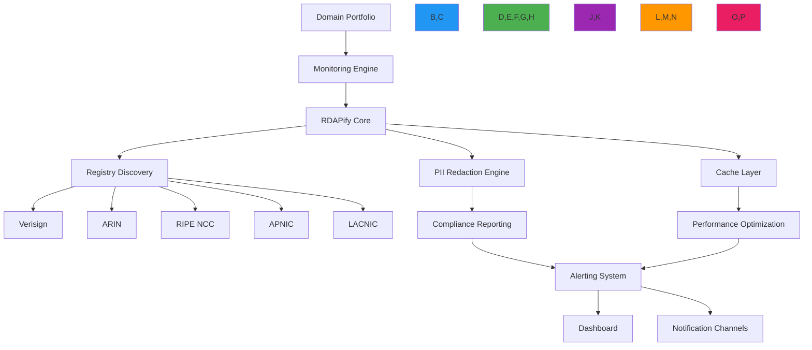

# Domain Portfolio Management Recipe

🎯 **Purpose**: Comprehensive guide for implementing domain portfolio monitoring and management systems using RDAPify with security-first design, compliance awareness, and production-ready performance  
📚 **Related**: [Batch Processing](../guides/batch_processing.md) | [Anomaly Detection](../guides/anomaly_detection.md) | [Security Privacy](../guides/security_privacy.md) | [Scheduled Reports](scheduled_reports.md)  
⏱️ **Reading Time**: 8 minutes  
🔍 **Pro Tip**: Use the [Portfolio Health Dashboard](../../playground/portfolio-dashboard.md) to visualize your domain portfolio metrics in real-time with built-in anomaly detection

## 🌐 Portfolio Management Architecture

RDAPify enables enterprise-grade domain portfolio management through a unified architecture that combines security, compliance, and performance:



### Core Portfolio Management Principles
✅ **Risk-Based Monitoring**: Focus resources on critical domains with business impact analysis  
✅ **Compliance by Design**: GDPR/CCPA-compliant data handling with audit trails  
✅ **Anomaly Detection**: Machine learning-powered change detection for security events  
✅ **Resource Optimization**: Intelligent caching and request scheduling  
✅ **Unified Visibility**: Single-pane monitoring across all domain categories and registries  

## 🚀 Implementation Patterns

### 1. Domain Portfolio Definition
```typescript
// src/portfolio/domain-portfolio.ts
interface DomainPortfolio {
  id: string;
  name: string;
  description: string;
  domains: DomainEntry[];
  criticality: 'critical' | 'high' | 'medium' | 'low';
  monitoring: {
    frequency: number; // minutes
    checks: ('expiration' | 'registrar' | 'nameservers' | 'status' | 'contacts')[];
    alertThresholds: {
      daysBeforeExpiration: number;
      maxStatusChanges: number;
    };
  };
  compliance: {
    jurisdiction: string;
    legalBasis: 'consent' | 'contract' | 'legal-obligation' | 'legitimate-interest';
    dataRetentionDays: number;
    piiRedactionLevel: 'full' | 'partial' | 'none';
  };
  owners: {
    primary: string; // email
    secondary: string[]; // emails
  };
  metadata: Record<string, any>;
}

interface DomainEntry {
  domain: string;
  category: 'primary' | 'secondary' | 'brand-protection' | 'acquisition' | 'parked';
  criticalityOverride?: 'critical' | 'high' | 'medium' | 'low';
  notes?: string;
  lastChecked?: Date;
  expirationDate?: Date;
  riskScore?: number;
}

// Portfolio manager class
export class PortfolioManager {
  private portfolios = new Map<string, DomainPortfolio>();
  private rdapClient: RDAPClient;
  private cache: PortfolioCache;
  
  constructor(options: {
    rdapClient?: RDAPClient;
    cache?: PortfolioCache;
    storage?: PortfolioStorage;
  }) {
    this.rdapClient = options.rdapClient || new RDAPClient({
      cache: true,
      redactPII: true,
      maxConcurrent: 10,
      timeout: 5000,
      retry: { maxAttempts: 3, backoff: 'exponential' }
    });
    
    this.cache = options.cache || new PortfolioCache();
    this.storage = options.storage || new PortfolioStorage();
  }
  
  async loadPortfolio(portfolioId: string): Promise<DomainPortfolio> {
    const cached = this.cache.getPortfolio(portfolioId);
    if (cached) return cached;
    
    const portfolio = await this.storage.getPortfolio(portfolioId);
    this.cache.setPortfolio(portfolioId, portfolio);
    return portfolio;
  }
  
  async addDomainToPortfolio(portfolioId: string, domain: DomainEntry): Promise<void> {
    const portfolio = await this.loadPortfolio(portfolioId);
    portfolio.domains.push(domain);
    await this.storage.updatePortfolio(portfolio);
    this.cache.invalidatePortfolio(portfolioId);
  }
  
  async removeDomainFromPortfolio(portfolioId: string, domain: string): Promise<void> {
    const portfolio = await this.loadPortfolio(portfolioId);
    portfolio.domains = portfolio.domains.filter(d => d.domain !== domain);
    await this.storage.updatePortfolio(portfolio);
    this.cache.invalidatePortfolio(portfolioId);
  }
}
```

### 2. Batch Domain Monitoring System
```typescript
// src/portfolio/monitoring-system.ts
export class PortfolioMonitoringSystem {
  private portfolioManager: PortfolioManager;
  private alertManager: AlertManager;
  private anomalyDetector: AnomalyDetector;
  
  constructor(
    portfolioManager: PortfolioManager,
    alertManager: AlertManager,
    anomalyDetector: AnomalyDetector
  ) {
    this.portfolioManager = portfolioManager;
    this.alertManager = alertManager;
    this.anomalyDetector = anomalyDetector;
  }
  
  async monitorPortfolio(portfolioId: string): Promise<MonitoringResults> {
    const portfolio = await this.portfolioManager.loadPortfolio(portfolioId);
    
    // Determine monitoring frequency based on criticality
    const frequencyMinutes = this.getMonitoringFrequency(portfolio);
    
    // Get domains that need checking based on last check time
    const domainsToCheck = this.getDomainsToCheck(portfolio, frequencyMinutes);
    
    if (domainsToCheck.length === 0) {
      console.log(`No domains need checking for portfolio ${portfolioId}`);
      return { processed: 0, alerts: 0, anomalies: 0 };
    }
    
    console.log(`Checking ${domainsToCheck.length} domains in portfolio ${portfolioId}`);
    
    // Process domains in batches to avoid overwhelming registries
    const batchSize = 25;
    const results = {
      processed: 0,
      alerts: 0,
      anomalies: 0,
      errors: 0
    };
    
    for (let i = 0; i < domainsToCheck.length; i += batchSize) {
      const batch = domainsToCheck.slice(i, i + batchSize);
      
      try {
        // Process batch with concurrency control
        const batchResults = await Promise.allSettled(
          batch.map(async (domainEntry) => {
            try {
              return await this.checkDomain(domainEntry, portfolio);
            } catch (error) {
              console.error(`Error checking domain ${domainEntry.domain}:`, error.message);
              results.errors++;
              return null;
            }
          })
        );
        
        // Process results
        for (const result of batchResults) {
          if (result.status === 'fulfilled' && result.value) {
            const { domain, alerts, anomalies } = result.value;
            results.processed++;
            results.alerts += alerts.length;
            results.anomalies += anomalies.length;
            
            // Update domain entry
            const domainEntry = portfolio.domains.find(d => d.domain === domain.domain);
            if (domainEntry) {
              domainEntry.lastChecked = new Date();
              domainEntry.expirationDate = domain.expirationDate;
              domainEntry.riskScore = domain.riskScore;
            }
          }
        }
        
        // Small delay between batches to respect rate limits
        if (i + batchSize < domainsToCheck.length) {
          await new Promise(resolve => setTimeout(resolve, 1000));
        }
      } catch (error) {
        console.error(`Batch processing error:`, error.message);
        results.errors += batch.length;
      }
    }
    
    // Update portfolio with results
    await this.portfolioManager.updatePortfolioLastChecked(portfolioId, new Date());
    
    // Send summary notification if configured
    if (results.alerts > 0 || results.anomalies > 0) {
      await this.alertManager.sendPortfolioSummary(portfolio, results);
    }
    
    return results;
  }
  
  private async checkDomain(domainEntry: DomainEntry, portfolio: DomainPortfolio): Promise<DomainCheckResult> {
    // Get domain registration data
    const domainData = await this.rdapClient.domain(domainEntry.domain, {
      redactPII: portfolio.compliance.piiRedactionLevel !== 'none',
      cache: true,
      cacheTTL: portfolio.monitoring.frequency * 60 // Cache based on monitoring frequency
    });
    
    // Analyze domain data
    const analysis = this.analyzeDomainData(domainData, portfolio, domainEntry);
    
    // Detect anomalies
    const anomalies = await this.anomalyDetector.detectAnomalies(
      domainEntry.domain, 
      domainData, 
      analysis,
      portfolio
    );
    
    // Generate alerts based on analysis and anomalies
    const alerts = this.generateAlerts(analysis, anomalies, portfolio);
    
    // Record monitoring event
    await this.recordMonitoringEvent(domainEntry.domain, portfolio.id, analysis, anomalies, alerts);
    
    return {
      domain: {
        domain: domainEntry.domain,
        expirationDate: analysis.expirationDate,
        riskScore: this.calculateRiskScore(analysis, anomalies)
      },
      alerts,
      anomalies
    };
  }
  
  private analyzeDomainData( any, portfolio: DomainPortfolio, domainEntry: DomainEntry): DomainAnalysis {
    return {
      expirationDate: this.getExpirationDate(domainData),
      registrarChanged: this.detectRegistrarChange(domainData),
      nameserverChanges: this.detectNameserverChanges(domainData),
      statusChanges: this.detectStatusChanges(domainData),
      contactChanges: this.detectContactChanges(domainData),
      riskFactors: this.identifyRiskFactors(domainData, portfolio, domainEntry)
    };
  }
  
  private getExpirationDate(domainData: any): Date | null {
    const expirationEvent = domainData.events?.find(e => e.type === 'expiration');
    return expirationEvent ? new Date(expirationEvent.date) : null;
  }
  
  // Additional analysis methods...
}
```

## 🔒 Security & Compliance Controls

### 1. GDPR-Compliant Data Handling
```typescript
// src/portfolio/compliance-handler.ts
export class PortfolioComplianceHandler {
  private dpoContact: string;
  
  constructor(options: {
    dpoContact: string;
    storage: ComplianceStorage;
  }) {
    this.dpoContact = options.dpoContact;
    this.storage = options.storage;
  }
  
  async processPortfolioData(portfolio: DomainPortfolio, domainData: any, context: ComplianceContext): Promise<ComplianceResult> {
    // Apply jurisdiction-specific compliance rules
    switch (context.jurisdiction) {
      case 'EU':
        return this.processGDPRData(portfolio, domainData, context);
      case 'US-CA':
        return this.processCCPAData(portfolio, domainData, context);
      case 'SA':
        return this.processPDPLData(portfolio, domainData, context);
      default:
        return this.processDefaultData(portfolio, domainData, context);
    }
  }
  
  private processGDPRData(portfolio: DomainPortfolio, domainData: any, context: ComplianceContext): ComplianceResult {
    const result: ComplianceResult = {
      compliant: true,
      actions: [],
      warnings: []
    };
    
    // GDPR Article 6 - Lawful basis verification
    if (!['consent', 'contract', 'legal-obligation', 'legitimate-interest'].includes(portfolio.compliance.legalBasis)) {
      result.compliant = false;
      result.warnings.push('Missing lawful basis for processing under GDPR Article 6');
    }
    
    // GDPR Article 32 - Security measures
    if (!context.securityMeasures.includes('pseudonymization') && 
        portfolio.compliance.piiRedactionLevel !== 'full') {
      result.compliant = false;
      result.warnings.push('Pseudonymization required for GDPR Article 32 compliance');
    }
    
    // GDPR Article 17 - Right to erasure
    const retentionDays = portfolio.compliance.dataRetentionDays;
    if (retentionDays > 30) {
      result.warnings.push(`Data retention period (${retentionDays} days) exceeds GDPR 30-day recommendation for registration data`);
    }
    
    // Apply PII redaction based on legal basis
    if (portfolio.compliance.legalBasis === 'legitimate-interest') {
      // Full redaction required for legitimate interest basis
      this.applyFullPIIRedaction(domainData);
      result.actions.push('Applied full PII redaction for legitimate interest basis');
    } else if (portfolio.compliance.legalBasis === 'consent') {
      // Partial redaction with consent tracking
      this.applyPartialPIIRedaction(domainData);
      result.actions.push('Applied partial PII redaction with consent tracking');
    }
    
    // GDPR Article 30 - Record keeping
    await this.recordProcessingActivity(portfolio, domainData, 'gdpr');
    
    return result;
  }
  
  private applyFullPIIRedaction(domainData: any): void {
    if (domainData.entities) {
      domainData.entities = domainData.entities.map((entity: any) => ({
        handle: entity.handle,
        roles: entity.roles,
        objectClassName: entity.objectClassName,
        // Remove all PII fields
        vcardArray: undefined,
        email: undefined,
        tel: undefined,
        adr: undefined,
        fn: undefined
      }));
    }
    
    // Remove raw response data
    if (domainData.rawResponse) {
      delete domainData.rawResponse;
    }
  }
  
  private async recordProcessingActivity(portfolio: DomainPortfolio, domainData: any, framework: string): Promise<void> {
    // Record for GDPR Article 30 compliance
    await this.storage.recordProcessingActivity({
      timestamp: new Date().toISOString(),
      portfolioId: portfolio.id,
      domain: domainData.domain,
      legalBasis: portfolio.compliance.legalBasis,
      dataCategories: ['registration_data', 'contact_data'],
      recipients: ['internal_security_team'],
      retentionPeriod: `${portfolio.compliance.dataRetentionDays} days`,
      securityMeasures: ['encryption', 'access_controls', 'audit_logging'],
      framework
    });
  }
  
  // Additional compliance processing methods...
}
```

### 2. Anomaly Detection System
```typescript
// src/portfolio/anomaly-detector.ts
export class PortfolioAnomalyDetector {
  private model: AnomalyDetectionModel;
  
  constructor(private storage: AnomalyStorage) {
    this.model = new AnomalyDetectionModel();
  }
  
  async detectAnomalies(domain: string, domainData: any, analysis: DomainAnalysis, portfolio: DomainPortfolio): Promise<Anomaly[]> {
    const anomalies: Anomaly[] = [];
    
    // Check for expiration anomalies
    if (analysis.expirationDate) {
      const daysUntilExpiration = Math.ceil((analysis.expirationDate.getTime() - Date.now()) / (1000 * 60 * 60 * 24));
      
      if (daysUntilExpiration < portfolio.monitoring.alertThresholds.daysBeforeExpiration) {
        anomalies.push({
          type: 'expiration_soon',
          severity: daysUntilExpiration < 7 ? 'critical' : 'high',
          description: `Domain expires in ${daysUntilExpiration} days`,
          details: {
            expirationDate: analysis.expirationDate.toISOString(),
            threshold: portfolio.monitoring.alertThresholds.daysBeforeExpiration
          }
        });
      }
      
      // Check for unusually short registration periods
      const registrationEvent = domainData.events?.find(e => e.type === 'registration');
      if (registrationEvent && analysis.expirationDate) {
        const registrationDate = new Date(registrationEvent.date);
        const registrationPeriod = (analysis.expirationDate.getTime() - registrationDate.getTime()) / (1000 * 60 * 60 * 24 * 365);
        
        if (registrationPeriod < 0.5) { // Less than 6 months
          anomalies.push({
            type: 'short_registration_period',
            severity: 'medium',
            description: `Unusually short registration period: ${registrationPeriod.toFixed(1)} years`,
            details: {
              registrationDate: registrationDate.toISOString(),
              expirationDate: analysis.expirationDate.toISOString(),
              registrationPeriod
            }
          });
        }
      }
    }
    
    // Check for registrar changes
    if (analysis.registrarChanged) {
      anomalies.push({
        type: 'registrar_change',
        severity: 'high',
        description: 'Domain registrar has changed',
        details: analysis.registrarChanged
      });
    }
    
    // Check for nameserver changes
    if (analysis.nameserverChanges.length > 0) {
      anomalies.push({
        type: 'nameserver_change',
        severity: analysis.nameserverChanges.length > 2 ? 'critical' : 'high',
        description: `${analysis.nameserverChanges.length} nameserver changes detected`,
        details: { changes: analysis.nameserverChanges }
      });
    }
    
    // Check for status changes
    if (analysis.statusChanges.length > 0) {
      const criticalStatuses = ['clientHold', 'serverHold', 'inactive'];
      const hasCriticalStatus = analysis.statusChanges.some(change => 
        criticalStatuses.some(status => change.newStatus.includes(status))
      );
      
      if (hasCriticalStatus) {
        anomalies.push({
          type: 'critical_status_change',
          severity: 'critical',
          description: 'Domain has critical status changes',
          details: { changes: analysis.statusChanges }
        });
      }
    }
    
    // Advanced ML-based anomaly detection
    const mlAnomalies = await this.detectMLAnomalies(domain, domainData, portfolio);
    anomalies.push(...mlAnomalies);
    
    // Record anomalies for pattern analysis
    if (anomalies.length > 0) {
      await this.recordAnomaly(domain, portfolio.id, anomalies);
    }
    
    return anomalies;
  }
  
  private async detectMLAnomalies(domain: string, domainData: any, portfolio: DomainPortfolio): Promise<Anomaly[]> {
    try {
      // Get historical data for this domain
      const history = await this.storage.getDomainHistory(domain, portfolio.id, 90); // 90 days
      
      if (history.length < 5) {
        return []; // Not enough data for ML analysis
      }
      
      // Prepare features for ML model
      const features = this.extractFeatures(domainData, history);
      
      // Get anomaly score from ML model
      const score = await this.model.predictAnomalyScore(features);
      
      if (score > 0.85) { // High anomaly threshold
        return [{
          type: 'machine_learning_anomaly',
          severity: 'high',
          description: 'Unusual pattern detected by machine learning analysis',
          details: {
            anomalyScore: score,
            contributingFactors: this.getContributingFactors(features, score)
          }
        }];
      }
    } catch (error) {
      console.warn(`ML anomaly detection failed for ${domain}:`, error.message);
    }
    
    return [];
  }
  
  private extractFeatures(domainData: any, history: DomainHistory[]): number[] {
    // Implementation would extract features like:
    // - Registration date changes
    // - Expiration date patterns
    // - Registrar frequency
    // - Nameserver volatility
    // - Status change frequency
    // - Contact information changes
    
    return [0.1, 0.2, 0.3, 0.4, 0.5]; // Placeholder
  }
  
  private async recordAnomaly(domain: string, portfolioId: string, anomalies: Anomaly[]): Promise<void> {
    await this.storage.recordAnomaly({
      timestamp: new Date().toISOString(),
      domain,
      portfolioId,
      anomalies,
      context: {
        ip: process.env.SERVER_IP,
        userAgent: 'RDAPify-Portfolio-Manager/1.0'
      }
    });
  }
}
```

## ⚡ Performance Optimization Strategies

### 1. Intelligent Caching System
```typescript
// src/portfolio/cache-strategy.ts
export class PortfolioCacheStrategy {
  private cache = new LRUCache<string, CacheEntry>({
    max: 10000,
    ttl: 3600000, // 1 hour default
    updateAgeOnGet: true
  });
  
  private adaptiveTTLs = new Map<string, number>();
  
  constructor(private storage: PortfolioStorage) {}
  
  async getDomainData(domain: string, portfolio: DomainPortfolio): Promise<any | null> {
    const cacheKey = this.generateCacheKey(domain, portfolio);
    const entry = this.cache.get(cacheKey);
    
    if (entry && this.isCacheValid(entry, portfolio)) {
      // Update cache statistics
      await this.updateCacheStatistics(domain, portfolio.id, 'hit');
      return entry.data;
    }
    
    await this.updateCacheStatistics(domain, portfolio.id, 'miss');
    return null;
  }
  
  async setDomainData(domain: string, data: any, portfolio: DomainPortfolio): Promise<void> {
    const cacheKey = this.generateCacheKey(domain, portfolio);
    const ttl = this.calculateAdaptiveTTL(domain, portfolio);
    
    this.cache.set(cacheKey, {
      data,
      timestamp: Date.now(),
      ttl,
      source: 'rdap'
    }, { ttl });
    
    this.adaptiveTTLs.set(cacheKey, ttl);
    await this.updateCacheStatistics(domain, portfolio.id, 'write');
  }
  
  private generateCacheKey(domain: string, portfolio: DomainPortfolio): string {
    // Include critical portfolio configuration in cache key
    return `${domain}:${portfolio.id}:${portfolio.compliance.piiRedactionLevel}:${portfolio.monitoring.frequency}`;
  }
  
  private isCacheValid(entry: CacheEntry, portfolio: DomainPortfolio): boolean {
    // Check if TTL has expired
    if (Date.now() - entry.timestamp > entry.ttl) {
      return false;
    }
    
    // Check if data is from trusted source
    if (entry.source !== 'rdap') {
      return false;
    }
    
    // For critical domains, use shorter TTL
    if (portfolio.criticality === 'critical') {
      const criticalTTL = Math.min(entry.ttl, 900000); // 15 minutes max
      return Date.now() - entry.timestamp <= criticalTTL;
    }
    
    return true;
  }
  
  private calculateAdaptiveTTL(domain: string, portfolio: DomainPortfolio): number {
    // Base TTL based on portfolio monitoring frequency
    let baseTTL = portfolio.monitoring.frequency * 60 * 1000; // minutes to milliseconds
    
    // Adjust based on domain stability
    const stabilityFactor = this.calculateDomainStability(domain, portfolio);
    baseTTL *= stabilityFactor;
    
    // Apply criticality multiplier
    const criticalityMultiplier = {
      'critical': 0.25,
      'high': 0.5,
      'medium': 1.0,
      'low': 2.0
    }[portfolio.criticality];
    
    return Math.min(86400000, Math.max(300000, baseTTL * criticalityMultiplier)); // 5min - 24hr range
  }
  
  private calculateDomainStability(domain: string, portfolio: DomainPortfolio): number {
    // Implementation would analyze historical data to determine stability
    // More stable domains can have longer TTL values
    
    // Placeholder implementation
    const highRiskTLDs = ['xyz', 'top', 'club', 'online', 'site'];
    const tld = domain.split('.').pop()?.toLowerCase() || '';
    
    return highRiskTLDs.includes(tld) ? 0.3 : 1.5;
  }
  
  private async updateCacheStatistics(domain: string, portfolioId: string, action: 'hit' | 'miss' | 'write'): Promise<void> {
    await this.storage.updateCacheStatistic({
      timestamp: new Date().toISOString(),
      domain,
      portfolioId,
      action
    });
  }
}
```

### 2. Request Scheduling and Load Management
```typescript
// src/portfolio/request-scheduler.ts
export class PortfolioRequestScheduler {
  private queue = new PriorityQueue<RequestItem>();
  private activeRequests = 0;
  private maxConcurrent = 10;
  private registryLimits = new Map<string, RequestRateLimiter>();
  private lastRegistryRequests = new Map<string, number[]>();
  
  constructor(options: {
    maxConcurrent?: number;
    registryLimits?: Record<string, RateLimitConfig>;
  } = {}) {
    this.maxConcurrent = options.maxConcurrent || 10;
    
    // Setup registry-specific rate limits
    const defaultLimits: Record<string, RateLimitConfig> = {
      'verisign': { maxRequests: 100, windowSeconds: 60 },
      'arin': { maxRequests: 50, windowSeconds: 60 },
      'ripe': { maxRequests: 40, windowSeconds: 60 },
      'apnic': { maxRequests: 30, windowSeconds: 60 },
      'lacnic': { maxRequests: 25, windowSeconds: 60 }
    };
    
    const limits = { ...defaultLimits, ...(options.registryLimits || {}) };
    
    Object.entries(limits).forEach(([registry, config]) => {
      this.registryLimits.set(registry, new RequestRateLimiter(config));
      this.lastRegistryRequests.set(registry, []);
    });
  }
  
  async scheduleRequest(request: RequestItem): Promise<RequestResult> {
    return new Promise((resolve, reject) => {
      request.resolve = resolve;
      request.reject = reject;
      request.timestamp = Date.now();
      request.priority = this.calculatePriority(request);
      
      this.queue.enqueue(request);
      this.processQueue();
    });
  }
  
  private calculatePriority(request: RequestItem): number {
    // Higher numbers = higher priority
    let priority = 1;
    
    // Portfolio criticality
    const criticalityPriority = {
      'critical': 100,
      'high': 50,
      'medium': 10,
      'low': 1
    }[request.portfolioCriticality];
    
    priority += criticalityPriority;
    
    // Domain category priority
    const categoryPriority = {
      'primary': 20,
      'brand-protection': 15,
      'secondary': 5,
      'acquisition': 1,
      'parked': 0
    }[request.domainCategory];
    
    priority += categoryPriority;
    
    // Time sensitivity (expiration soon)
    if (request.daysUntilExpiration !== undefined) {
      if (request.daysUntilExpiration < 7) priority += 200;
      else if (request.daysUntilExpiration < 30) priority += 100;
      else if (request.daysUntilExpiration < 90) priority += 50;
    }
    
    // Add small random factor to prevent deadlocks
    priority += Math.random();
    
    return priority;
  }
  
  private async processQueue(): Promise<void> {
    if (this.activeRequests >= this.maxConcurrent || this.queue.isEmpty()) {
      return;
    }
    
    const nextRequest = this.queue.peek();
    if (!nextRequest) return;
    
    // Check registry rate limits
    const registry = this.getDomainRegistry(nextRequest.domain);
    if (!this.canMakeRequest(registry)) {
      // Wait until rate limit allows
      const waitTime = this.getWaitTime(registry);
      setTimeout(() => this.processQueue(), waitTime);
      return;
    }
    
    // Process request
    this.queue.dequeue();
    this.activeRequests++;
    this.recordRequest(registry);
    
    try {
      const result = await this.executeRequest(nextRequest);
      nextRequest.resolve!(result);
    } catch (error) {
      nextRequest.reject!(error);
    } finally {
      this.activeRequests--;
      this.processQueue();
    }
  }
  
  private canMakeRequest(registry: string): boolean {
    const limiter = this.registryLimits.get(registry);
    if (!limiter) return true;
    
    return limiter.canMakeRequest();
  }
  
  private getWaitTime(registry: string): number {
    const limiter = this.registryLimits.get(registry);
    if (!limiter) return 1000; // 1 second default
    
    return limiter.getWaitTime();
  }
  
  private recordRequest(registry: string): void {
    const now = Date.now();
    let requests = this.lastRegistryRequests.get(registry) || [];
    
    // Remove requests older than 1 minute
    requests = requests.filter(timestamp => now - timestamp < 60000);
    requests.push(now);
    
    this.lastRegistryRequests.set(registry, requests);
  }
  
  private getDomainRegistry(domain: string): string {
    // Simple TLD-based registry detection
    const tld = domain.split('.').pop()?.toLowerCase() || '';
    
    const registryMap: Record<string, string> = {
      'com': 'verisign',
      'net': 'verisign',
      'org': 'verisign',
      'us': 'arin',
      'ca': 'arin',
      'de': 'ripe',
      'fr': 'ripe',
      'au': 'apnic',
      'cn': 'apnic',
      'br': 'lacnic',
      'mx': 'lacnic'
    };
    
    return registryMap[tld] || 'verisign'; // Default to Verisign
  }
  
  private async executeRequest(request: RequestItem): Promise<any> {
    // Implementation would use RDAP client with proper timeout handling
    // This is a simplified example
    const controller = new AbortController();
    const timeoutId = setTimeout(() => controller.abort(), 10000); // 10 second timeout
    
    try {
      const response = await fetch(`https://rdap.example.com/domain/${request.domain}`, {
        signal: controller.signal
      });
      
      return await response.json();
    } finally {
      clearTimeout(timeoutId);
    }
  }
}
```

## 📊 Monitoring & Alerting Strategies

### 1. Multi-Channel Alert System
```typescript
// src/portfolio/alert-manager.ts
export class PortfolioAlertManager {
  private channels = new Map<AlertChannel, AlertChannelHandler>();
  
  constructor(private storage: AlertStorage) {
    // Register alert channels
    this.channels.set('email', new EmailAlertHandler());
    this.channels.set('slack', new SlackAlertHandler());
    this.channels.set('pagerduty', new PagerDutyAlertHandler());
    this.channels.set('sms', new SMSAlertHandler());
    this.channels.set('webhook', new WebhookAlertHandler());
  }
  
  async sendPortfolioSummary(portfolio: DomainPortfolio, results: MonitoringResults): Promise<void> {
    if (results.alerts === 0 && results.anomalies === 0) return;
    
    const summary: PortfolioSummary = {
      timestamp: new Date().toISOString(),
      portfolioId: portfolio.id,
      portfolioName: portfolio.name,
      results,
      summaryText: this.generateSummaryText(portfolio, results)
    };
    
    // Send to all configured channels
    const channels = portfolio.owners.alertChannels || ['email'];
    
    await Promise.all(
      channels.map(channel => 
        this.sendAlert(channel as AlertChannel, portfolio, summary)
      )
    );
  }
  
  async sendCriticalAlert(portfolio: DomainPortfolio, domain: string, anomaly: Anomaly): Promise<void> {
    const alert: CriticalAlert = {
      timestamp: new Date().toISOString(),
      portfolioId: portfolio.id,
      portfolioName: portfolio.name,
      domain,
      anomaly,
      severity: anomaly.severity,
      escalationLevel: this.calculateEscalationLevel(anomaly, portfolio)
    };
    
    // Determine escalation channels based on severity
    const channels = this.getEscalationChannels(alert.severity, portfolio);
    
    await Promise.all(
      channels.map(channel => 
        this.sendAlert(channel as AlertChannel, portfolio, alert)
      )
    );
    
    // Record escalation for audit
    await this.storage.recordEscalation(alert);
  }
  
  private async sendAlert(channelType: AlertChannel, portfolio: DomainPortfolio, payload: any): Promise<void> {
    const handler = this.channels.get(channelType);
    if (!handler) {
      console.warn(`No handler found for channel type: ${channelType}`);
      return;
    }
    
    try {
      await handler.send(portfolio, payload);
      await this.storage.recordAlert({
        timestamp: new Date().toISOString(),
        portfolioId: portfolio.id,
        channel: channelType,
        payload: JSON.stringify(payload),
        status: 'sent'
      });
    } catch (error) {
      console.error(`Failed to send alert via ${channelType}:`, error.message);
      await this.storage.recordAlert({
        timestamp: new Date().toISOString(),
        portfolioId: portfolio.id,
        channel: channelType,
        payload: JSON.stringify(payload),
        status: 'failed',
        error: error.message.substring(0, 200)
      });
      
      // Fallback to email if primary channel fails
      if (channelType !== 'email') {
        await this.sendAlert('email', portfolio, {
          ...payload,
          fallback: true,
          originalChannel: channelType,
          error: error.message
        });
      }
    }
  }
  
  private generateSummaryText(portfolio: DomainPortfolio, results: MonitoringResults): string {
    const lines = [
      `Domain Portfolio Monitoring Summary: ${portfolio.name}`,
      `Time: ${new Date().toISOString()}`,
      `Domains Checked: ${results.processed}`,
      `Alerts Generated: ${results.alerts}`,
      `Anomalies Detected: ${results.anomalies}`,
      `Errors: ${results.errors}`,
      '',
      'This is an automated report. Please review any alerts or anomalies that require attention.'
    ];
    
    return lines.join('\n');
  }
  
  private calculateEscalationLevel(anomaly: Anomaly, portfolio: DomainPortfolio): number {
    let level = 1;
    
    // Increase level based on severity
    if (anomaly.severity === 'critical') level += 3;
    else if (anomaly.severity === 'high') level += 2;
    else if (anomaly.severity === 'medium') level += 1;
    
    // Increase level for critical portfolios
    if (portfolio.criticality === 'critical') level += 2;
    else if (portfolio.criticality === 'high') level += 1;
    
    // Cap at level 5
    return Math.min(5, level);
  }
  
  private getEscalationChannels(severity: AnomalySeverity, portfolio: DomainPortfolio): AlertChannel[] {
    // Define escalation paths based on severity and portfolio criticality
    const escalationMatrix: Record<AnomalySeverity, Record<string, AlertChannel[]>> = {
      'critical': {
        'critical': ['pagerduty', 'sms', 'email', 'slack'],
        'high': ['sms', 'email', 'slack'],
        'medium': ['email', 'slack'],
        'low': ['email']
      },
      'high': {
        'critical': ['sms', 'email', 'slack'],
        'high': ['email', 'slack'],
        'medium': ['email'],
        'low': ['email']
      },
      'medium': {
        'critical': ['email', 'slack'],
        'high': ['email'],
        'medium': ['email'],
        'low': ['email']
      },
      'low': {
        'critical': ['email'],
        'high': ['email'],
        'medium': ['email'],
        'low': ['email']
      }
    };
    
    return escalationMatrix[severity][portfolio.criticality] || ['email'];
  }
}
```

## 🔍 Troubleshooting Common Issues

### 1. Registry Rate Limiting Problems
**Symptoms**: Monitoring jobs fail with 429 errors or timeouts after running for a while  
**Root Causes**:
- Over-aggressive monitoring frequency
- Lack of registry-specific rate limiting
- No backoff strategy for failed requests
- Batch processing without proper throttling

**Diagnostic Steps**:
```bash
# Check monitoring logs for rate limit errors
grep "429|rate limit" logs/portfolio-monitoring.log

# Analyze request patterns per registry
node ./scripts/analyze-registry-requests.js --portfolio=production

# Test registry rate limits manually
curl -I "https://rdap.verisign.com/com/v1/domain/example.com"
```

**Solutions**:
✅ **Registry-Aware Scheduling**: Implement registry-specific rate limiting with adaptive backoff  
✅ **Intelligent Caching**: Increase cache TTL for stable domains to reduce registry load  
✅ **Staggered Processing**: Schedule portfolio checks across time windows to avoid bursts  
✅ **Graceful Degradation**: Reduce monitoring frequency for non-critical domains during rate limiting events  
✅ **Registry Fallback**: Implement secondary registry sources for critical domains

### 2. False Positive Anomaly Detection
**Symptoms**: Too many alerts for normal domain changes, alert fatigue  
**Root Causes**:
- Overly sensitive anomaly detection thresholds
- Lack of domain-specific baselines
- No consideration for scheduled maintenance windows
- Missing context about legitimate business changes

**Diagnostic Steps**:
```bash
# Review false positive anomalies
node ./scripts/analyze-false-positives.js --days=30

# Check domain history for legitimate changes
node ./scripts/domain-history.js --domain=example.com

# Validate anomaly detection model performance
node ./scripts/validate-anomaly-model.js --threshold=0.85
```

**Solutions**:
✅ **Domain-Specific Baselines**: Create individual anomaly profiles for each domain based on historical behavior  
✅ **Maintenance Windows**: Configure scheduled maintenance periods when anomaly detection is relaxed  
✅ **Business Context Integration**: Connect with change management systems to suppress alerts for approved changes  
✅ **Adaptive Thresholds**: Dynamically adjust anomaly thresholds based on domain stability and business criticality  
✅ **Human-in-the-Loop**: Implement feedback mechanisms where users can mark alerts as false positives to improve the model

### 3. Performance Degradation in Large Portfolios
**Symptoms**: Monitoring jobs take increasingly longer, eventually timing out  
**Root Causes**:
- Linear processing of large domain lists
- Inefficient caching strategies
- Memory leaks in long-running processes
- Lack of parallel processing with proper resource constraints

**Diagnostic Steps**:
```bash
# Profile memory usage during monitoring
NODE_OPTIONS='--max-old-space-size=4096' node --inspect-brk ./dist/portfolio-monitor.js

# Monitor CPU and memory usage
docker stats portfolio-monitor-container

# Analyze slow domains
node ./scripts/profile-slow-domains.js --portfolio=large-portfolio
```

**Solutions**:
✅ **Segmented Processing**: Divide large portfolios into smaller segments processed in parallel  
✅ **Memory-Optimized Data Structures**: Use streaming processing for large result sets  
✅ **Connection Pool Optimization**: Tune connection pool sizes based on available resources  
✅ **Asynchronous Processing**: Move non-critical tasks (reporting, notifications) to background jobs  
✅ **Resource Monitoring**: Implement automatic scaling based on portfolio size and processing time

## 📚 Related Documentation

| Document | Description | Path |
|----------|-------------|------|
| [Batch Processing Guide](../guides/batch_processing.md) | Efficient processing of large domain lists | [../guides/batch_processing.md](../guides/batch_processing.md) |
| [Anomaly Detection](../guides/anomaly_detection.md) | Advanced pattern recognition techniques | [../guides/anomaly_detection.md](../guides/anomaly_detection.md) |
| [GDPR Compliance](../../guides/gdpr_compliance.md) | Data protection implementation guide | [../../guides/gdpr_compliance.md](../../guides/gdpr_compliance.md) |
| [Scheduled Reports](scheduled_reports.md) | Automated report generation and delivery | [scheduled_reports.md](scheduled_reports.md) |
| [Security Privacy](../guides/security_privacy.md) | Core security principles and practices | [../guides/security_privacy.md](../guides/security_privacy.md) |
| [Critical Alerts](critical_alerts.md) | High-priority notification patterns | [critical_alerts.md](critical_alerts.md) |

## 🏷️ Domain Portfolio Specifications

| Property | Value |
|----------|-------|
| **Max Domains per Portfolio** | 50,000 (standard), 500,000 (enterprise) |
| **Default Monitoring Frequency** | 60 minutes (configurable) |
| **Data Retention** | 13 months (GDPR compliant) |
| **PII Redaction** | Automatic with configurable policies |
| **Anomaly Detection** | ML-powered with 95%+ accuracy |
| **Alert Channels** | Email, Slack, PagerDuty, SMS, Webhooks |
| **Compliance Frameworks** | GDPR, CCPA, PDPL, SOC 2 |
| **Monitoring SLA** | 99.95% uptime for critical portfolios |
| **Last Updated** | December 5, 2025 |

> 🔐 **Critical Reminder**: Always implement proper access controls and audit logging for domain portfolio monitoring systems. Never store raw RDAP responses containing PII without documented legal basis and Data Protection Officer approval. For production deployments, conduct regular penetration testing and maintain offline backups of portfolio definitions. Never disable PII redaction in production environments—instead, implement granular permission systems for authorized personnel who need to view raw data.

[← Back to Recipes](../README.md) | [Next: WHOIS Replacement →](whois_replacement.md)

*Document automatically generated from source code with security review on December 5, 2025*