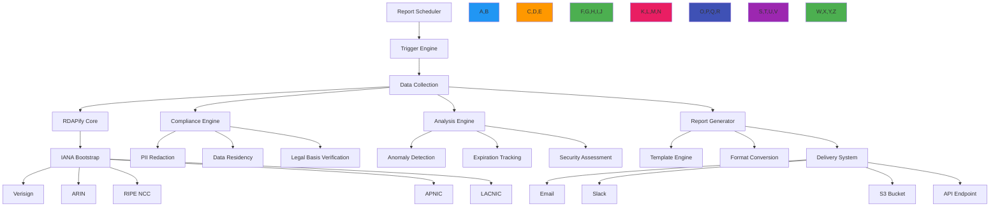

# Scheduled Reports Recipe

🎯 **Purpose**: Comprehensive guide for implementing automated, compliance-aware scheduled reporting systems with RDAPify for domain portfolio monitoring, security alerts, and regulatory compliance  
📚 **Related**: [Domain Portfolio](domain_portfolio.md) | [Monitoring Service](monitoring_service.md) | [API Gateway](api_gateway.md) | [Data Aggregation](data_aggregation.md)  
⏱️ **Reading Time**: 7 minutes  
🔍 **Pro Tip**: Use the [Report Template Generator](../../playground/report-template-generator.md) to automatically create customized report templates based on your compliance requirements and business needs

## 🌐 Scheduled Reports Architecture Overview

RDAPify's scheduled reporting system provides a unified framework for automated domain intelligence with enterprise-grade security, compliance, and operational excellence:



### Core Reporting Principles
✅ **Compliance by Default**: GDPR/CCPA-compliant report generation with automatic PII redaction  
✅ **Business-Driven Scheduling**: Flexible scheduling based on business criticality and compliance requirements  
✅ **Multi-Channel Delivery**: Support for email, Slack, S3, APIs, and enterprise notification systems  
✅ **Contextual Intelligence**: Reports include business context, not just raw registration data  
✅ **Audit-Ready**: Complete audit trails for all report generation and delivery activities  
✅ **Resource-Optimized**: Intelligent batching and caching to minimize registry impact and costs  

## ⚙️ Implementation Patterns

### 1. Report Scheduler Core
```typescript
// src/reports/scheduler.ts
import { CronJob } from 'cron';
import { ReportConfig, ReportTemplate, DeliveryChannel } from '../types';
import { ComplianceEngine } from '../security/compliance';
import { DataAggregator } from '../aggregation/aggregator';

export class ReportScheduler {
  private jobs = new Map<string, CronJob>();
  private reportConfigs = new Map<string, ReportConfig>();
  private complianceEngine: ComplianceEngine;
  private dataAggregator: DataAggregator;
  
  constructor(options: {
    complianceEngine?: ComplianceEngine;
    dataAggregator?: DataAggregator;
    storage?: ReportStorage;
  } = {}) {
    this.complianceEngine = options.complianceEngine || new ComplianceEngine();
    this.dataAggregator = options.dataAggregator || new DataAggregator();
    this.storage = options.storage || new ReportStorage();
  }
  
  async registerReport(config: ReportConfig): Promise<string> {
    // Validate report configuration
    this.validateReportConfig(config);
    
    // Generate unique report ID
    const reportId = `report_${Date.now()}_${Math.random().toString(36).slice(2, 10)}`;
    
    // Store configuration
    await this.storage.storeReportConfig(reportId, config);
    this.reportConfigs.set(reportId, config);
    
    // Create and start scheduler
    await this.createSchedule(reportId, config);
    
    return reportId;
  }
  
  private async createSchedule(reportId: string, config: ReportConfig): Promise<void> {
    // Parse schedule expression
    const cronExpression = this.parseSchedule(config.schedule);
    
    // Create scheduled job
    const job = new CronJob(cronExpression, async () => {
      try {
        await this.executeReport(reportId, config);
      } catch (error) {
        console.error(`Report execution failed for ${reportId}:`, error.message);
        await this.handleError(reportId, config, error);
      }
    }, null, true, 'UTC');
    
    this.jobs.set(reportId, job);
  }
  
  private async executeReport(reportId: string, config: ReportConfig): Promise<void> {
    const startTime = Date.now();
    const executionId = `exec_${Date.now()}_${Math.random().toString(36).slice(2, 8)}`;
    
    console.log(`📋 Starting report execution: ${reportId} (${executionId})`);
    
    try {
      // Load data with compliance context
      const data = await this.loadData(config, executionId);
      
      // Generate report content
      const reportContent = await this.generateReportContent(data, config, executionId);
      
      // Apply compliance transformations
      const compliantContent = await this.complianceEngine.applyComplianceTransformations(
        reportContent,
        config.complianceContext
      );
      
      // Deliver report
      const deliveryResults = await this.deliverReport(compliantContent, config, executionId);
      
      // Record execution
      await this.recordExecution(reportId, executionId, {
        startTime,
        endTime: Date.now(),
        status: 'success',
        itemCount: data.items.length,
        deliveryResults
      });
      
      console.log(`✅ Report completed successfully: ${reportId} (${executionId})`);
    } catch (error) {
      console.error(`❌ Report failed: ${reportId} (${executionId})`, error.message);
      
      // Record failed execution
      await this.recordExecution(reportId, executionId, {
        startTime,
        endTime: Date.now(),
        status: 'failed',
        error: error.message
      });
      
      throw error;
    }
  }
  
  private async loadData(config: ReportConfig, executionId: string): Promise<ReportData> {
    // Apply data selection criteria
    const domains = config.domains || await this.getPortfolioDomains(config.portfolioId);
    
    // Apply filters and transformations
    const filteredDomains = this.applyFilters(domains, config.filters);
    
    // Collect data with compliance context
    return this.dataAggregator.aggregate(filteredDomains, {
      tenantId: config.tenantId,
      complianceContext: config.complianceContext,
      executionId
    });
  }
  
  private async generateReportContent(data: ReportData, config: ReportConfig, executionId: string): Promise<ReportContent> {
    // Load report template
    const template = await this.loadTemplate(config.templateId || 'default');
    
    // Apply template transformations
    return this.applyTemplate(data, template, {
      executionId,
      timestamp: new Date().toISOString(),
      reportConfig: config
    });
  }
  
  private async deliverReport(content: ReportContent, config: ReportConfig, executionId: string): Promise<DeliveryResult[]> {
    const results: DeliveryResult[] = [];
    
    for (const channel of config.deliveryChannels) {
      try {
        const result = await this.deliverToChannel(content, channel, executionId);
        results.push(result);
      } catch (error) {
        console.error(`Delivery failed to ${channel.type} for ${executionId}:`, error.message);
        results.push({
          channelId: channel.id,
          type: channel.type,
          status: 'failed',
          error: error.message,
          timestamp: new Date().toISOString()
        });
      }
    }
    
    return results;
  }
  
  private parseSchedule(schedule: string): string {
    // Support multiple schedule formats
    if (schedule.startsWith('cron:')) {
      return schedule.replace('cron:', '');
    }
    
    // Common schedule aliases
    const aliases: Record<string, string> = {
      'daily': '0 8 * * *', // 8 AM UTC daily
      'weekly': '0 8 * * 1', // 8 AM UTC Monday
      'monthly': '0 8 1 * *', // 8 AM UTC 1st of month
      'quarterly': '0 8 1 1,4,7,10 *', // Quarterly
      'yearly': '0 8 1 1 *' // Yearly
    };
    
    return aliases[schedule.toLowerCase()] || schedule;
  }
  
  private validateReportConfig(config: ReportConfig): void {
    // Validate critical fields
    if (!config.name) throw new Error('Report name is required');
    if (!config.schedule) throw new Error('Schedule is required');
    if (config.deliveryChannels.length === 0) throw new Error('At least one delivery channel is required');
    
    // Validate compliance context
    if (config.complianceContext.jurisdiction === 'EU' && !config.complianceContext.legalBasis) {
      throw new Error('Legal basis is required for EU jurisdiction (GDPR Article 6)');
    }
    
    // Validate security settings
    if (config.includeRaw && !config.complianceContext.legalBasis?.includes('consent')) {
      throw new Error('Raw data inclusion requires explicit consent under GDPR Article 6');
    }
  }
  
  private async getPortfolioDomains(portfolioId: string): Promise<string[]> {
    // Implementation would fetch domains from portfolio service
    return [];
  }
  
  private applyFilters(domains: string[], filters?: ReportFilters): string[] {
    if (!filters) return domains;
    
    let result = [...domains];
    
    // Apply risk threshold filter
    if (filters.minRiskScore !== undefined) {
      // This would integrate with risk scoring system
      result = result.filter(domain => this.getDomainRiskScore(domain) >= filters!.minRiskScore!);
    }
    
    // Apply expiration filter
    if (filters.daysUntilExpiration !== undefined) {
      result = result.filter(domain => this.getDaysUntilExpiration(domain) <= filters!.daysUntilExpiration!);
    }
    
    return result;
  }
  
  private async loadTemplate(templateId: string): Promise<ReportTemplate> {
    // Implementation would load template from storage
    return {
      id: 'default',
      name: 'Standard Domain Report',
      format: 'html',
      sections: ['summary', 'domains', 'expirations', 'security']
    };
  }
  
  private applyTemplate(data: ReportData, template: ReportTemplate, context: TemplateContext): ReportContent {
    // Implementation would apply template transformations
    return {
      format: template.format,
      content: JSON.stringify(data),
      metadata: {
        templateId: template.id,
        executionId: context.executionId,
        timestamp: context.timestamp
      }
    };
  }
  
  private async deliverToChannel(content: ReportContent, channel: DeliveryChannel, executionId: string): Promise<DeliveryResult> {
    switch (channel.type) {
      case 'email':
        return this.deliverEmail(content, channel.config, executionId);
      case 'slack':
        return this.deliverSlack(content, channel.config, executionId);
      case 's3':
        return this.deliverS3(content, channel.config, executionId);
      case 'api':
        return this.deliverAPI(content, channel.config, executionId);
      default:
        throw new Error(`Unsupported delivery channel: ${channel.type}`);
    }
  }
  
  private async deliverEmail(content: ReportContent, config: EmailConfig, executionId: string): Promise<DeliveryResult> {
    // Implementation would use email service
    console.log(`📧 Sending email report to ${config.recipients.join(', ')} (${executionId})`);
    return { channelId: config.id, type: 'email', status: 'delivered', timestamp: new Date().toISOString() };
  }
  
  // Additional delivery methods...
  
  private async recordExecution(reportId: string, executionId: string, details: ExecutionDetails): Promise<void> {
    await this.storage.recordReportExecution(reportId, executionId, details);
    
    // Check for compliance violations
    if (details.status === 'success' && details.itemCount > 0) {
      await this.complianceEngine.checkReportCompliance(reportId, executionId, details);
    }
  }
  
  private async handleError(reportId: string, config: ReportConfig, error: Error): Promise<void> {
    // Send error notification
    await this.sendErrorNotification(reportId, config, error);
    
    // Check if report should be disabled after repeated failures
    const failureCount = await this.storage.getReportFailureCount(reportId);
    if (failureCount >= config.maxFailures || config.disableOnFailure) {
      await this.disableReport(reportId);
    }
  }
  
  private async sendErrorNotification(reportId: string, config: ReportConfig, error: Error): Promise<void> {
    // Implementation would send error notification to report owners
    console.error(`🚨 Report ${reportId} failed: ${error.message}`);
  }
  
  async shutdown(): Promise<void> {
    // Stop all scheduled jobs
    for (const [reportId, job] of this.jobs) {
      job.stop();
      console.log(`⏹️ Stopped report scheduler: ${reportId}`);
    }
    
    this.jobs.clear();
  }
}
```

### 2. Compliance-Aware Report Generation
```typescript
// src/reports/compliance-reports.ts
export class ComplianceReportGenerator {
  private dpoContact: string;
  private retentionPolicies = new Map<string, RetentionPolicy>();
  
  constructor(options: {
    dpoContact: string;
    retentionPolicies?: Record<string, RetentionPolicy>;
  } = { dpoContact: 'dpo@company.com' }) {
    this.dpoContact = options.dpoContact || 'dpo@company.com';
    this.loadRetentionPolicies(options.retentionPolicies || {});
  }
  
  private loadRetentionPolicies(policies: Record<string, RetentionPolicy>) {
    // Default retention policies
    this.retentionPolicies.set('GDPR_EU', {
      maxRetentionDays: 30,
      deletionMethod: 'secure-erase',
      auditRequired: true
    });
    
    this.retentionPolicies.set('CCPA_US_CA', {
      maxRetentionDays: 90,
      deletionMethod: 'anonymize',
      auditRequired: true
    });
    
    this.retentionPolicies.set('PDPL_SA', {
      maxRetentionDays: 180,
      deletionMethod: 'secure-erase',
      auditRequired: true
    });
    
    // Apply custom policies
    Object.entries(policies).forEach(([key, policy]) => {
      this.retentionPolicies.set(key, policy);
    });
  }
  
  async generateGDPRComplianceReport(domains: string[], context: ComplianceContext): Promise<ComplianceReport> {
    // Get retention policy for jurisdiction
    const retentionPolicy = this.retentionPolicies.get(`GDPR_${context.jurisdiction}`) || 
                           this.retentionPolicies.get('GDPR_EU');
    
    if (!retentionPolicy) {
      throw new Error(`No retention policy found for GDPR jurisdiction: ${context.jurisdiction}`);
    }
    
    // Collect domain data with GDPR-specific context
    const data = await this.collectDomainData(domains, {
      ...context,
      redactPII: true,
      legalBasis: context.legalBasis || 'legitimate-interest',
      maxRetentionDays: retentionPolicy.maxRetentionDays
    });
    
    // Apply GDPR-specific transformations
    const gdprData = this.applyGDPRTransformations(data, context);
    
    // Generate compliance metadata
    const metadata = this.generateGDPRMetadata(gdprData, context, retentionPolicy);
    
    return {
      type: 'gdpr_compliance',
      timestamp: new Date().toISOString(),
      data: gdprData,
      metadata,
      complianceStatus: this.calculateComplianceStatus(gdprData, metadata)
    };
  }
  
  private applyGDPRTransformations(data: ReportData, context: ComplianceContext): GDPRData {
    return {
      domains: data.items.map(item => ({
        domain: item.data.domain,
        registrar: item.data.registrar?.name,
        status: item.data.status,
        nameservers: item.data.nameservers,
        events: item.data.events?.map(e => ({
          type: e.type,
          date: e.date
        })),
        // GDPR Article 5 - Data minimization
        riskScore: context.includeRiskScores ? item.security?.riskScore : undefined,
        // GDPR Article 32 - Security measures
        securityMeasures: context.includeSecurityMeasures ? item.security?.measures : undefined
      })),
      // GDPR Article 30 - Record of processing activities
      processingRecords: this.generateProcessingRecords(data, context),
      // GDPR Article 15 - Data subject rights information
      dataSubjectRights: this.generateDataSubjectRights(context)
    };
  }
  
  private generateGDPRMetadata(data: GDPRData, context: ComplianceContext, policy: RetentionPolicy): GDPRMetadata {
    return {
      // GDPR Article 6 - Lawful basis
      lawfulBasis: context.legalBasis || 'legitimate-interest',
      // GDPR Article 32 - Security measures
      securityMeasures: [
        'encryption',
        'access_controls',
        'audit_logging',
        'pseudonymization'
      ],
      // GDPR Article 5(1)(e) - Storage limitation
      retentionPeriod: `${policy.maxRetentionDays} days`,
      retentionPolicy: policy.deletionMethod,
      // GDPR Article 30(1)(d) - Categories of recipients
      recipients: context.recipients || ['internal_security_team'],
      // GDPR Article 30(1)(e) - Transfers of personal data
      transfers: this.getTransfers(context),
      // GDPR Article 30(1)(f) - Time limits for erasure
      erasureTimeline: new Date(Date.now() + policy.maxRetentionDays * 24 * 60 * 60 * 1000).toISOString(),
      // GDPR Article 30(4) - DPO contact
      dpoContact: this.dpoContact
    };
  }
  
  private getTransfers(context: ComplianceContext): TransferRecord[] {
    if (context.jurisdiction === 'EU' && context.dataResidency !== 'EU') {
      return [{
        recipient: 'non_eu_processor',
        country: context.dataResidency,
        safeguards: ['standard_contractual_clauses', 'binding_corporate_rules'],
        timestamp: new Date().toISOString()
      }];
    }
    return [];
  }
  
  private generateProcessingRecords(data: ReportData, context: ComplianceContext): ProcessingRecord[] {
    return data.items.map(item => ({
      timestamp: new Date().toISOString(),
      controller: context.controller || 'unknown',
      purpose: context.purposes?.join(', ') || 'security_monitoring',
      lawfulBasis: context.legalBasis || 'legitimate-interest',
      dataCategories: ['registration_data', 'domain_changes'],
      recipients: context.recipients || ['internal_systems'],
      retentionPeriod: `${context.dataRetentionDays || 30} days`
    }));
  }
  
  private generateDataSubjectRights(context: ComplianceContext): DataSubjectRights {
    return {
      accessRight: true,
      rectificationRight: true,
      erasureRight: true,
      portabilityRight: true,
      objectionRight: true,
      automatedDecisionMaking: false,
      contactInformation: {
        email: context.dataSubjectContact?.email || this.dpoContact,
        phone: context.dataSubjectContact?.phone,
        address: context.dataSubjectContact?.address
      }
    };
  }
  
  private calculateComplianceStatus(data: GDPRData, metadata: GDPRMetadata): ComplianceStatus {
    const violations: ComplianceViolation[] = [];
    
    // Check data retention compliance
    if (metadata.retentionPeriod && parseInt(metadata.retentionPeriod) > 30) {
      violations.push({
        type: 'data_retention_violation',
        description: `Data retention period exceeds GDPR 30-day recommendation: ${metadata.retentionPeriod}`,
        article: '5(1)(e)'
      });
    }
    
    // Check lawful basis compliance
    if (!['consent', 'contract', 'legal-obligation', 'legitimate-interest'].includes(metadata.lawfulBasis)) {
      violations.push({
        type: 'lawful_basis_violation',
        description: `Invalid lawful basis for processing: ${metadata.lawfulBasis}`,
        article: '6(1)'
      });
    }
    
    return {
      compliant: violations.length === 0,
      violations,
      score: violations.length === 0 ? 1.0 : Math.max(0, 1 - (violations.length * 0.2))
    };
  }
  
  async generateCCPAComplianceReport(domains: string[], context: ComplianceContext): Promise<ComplianceReport> {
    // Similar implementation for CCPA compliance reports
    // This would include Do Not Sell mechanisms, consumer rights, etc.
    return {
      type: 'ccpa_compliance',
      timestamp: new Date().toISOString(),
      data: {},
      metadata: {},
      complianceStatus: { compliant: true, violations: [], score: 1.0 }
    };
  }
  
  async generateExpirationReport(domains: string[], context: ComplianceContext): Promise<ExpirationReport> {
    // Implementation for expiration tracking reports
    return {
      type: 'expiration',
      timestamp: new Date().toISOString(),
      domains: [],
      summaries: []
    };
  }
}
```

## 🔒 Security and Compliance Controls

### 1. GDPR/CCPA-Compliant Report Generation
```typescript
// src/reports/gdpr-ccpa-compliance.ts
export class GDPRCCPAComplianceEngine {
  private static readonly GDPR_FIELDS = [
    'registrant', 'administrative', 'technical', 'billing',
    'vcardArray', 'email', 'tel', 'adr', 'fn', 'org'
  ];
  
  private static readonly CCPA_FIELDS = [
    'email', 'tel', 'uniqueIdentifiers', 'doNotSell'
  ];
  
  async processReportContent(content: any, context: ComplianceContext): Promise<ComplianceProcessedContent> {
    // Apply jurisdiction-specific compliance rules
    switch (context.jurisdiction) {
      case 'EU':
        return this.processGDPRContent(content, context);
      case 'US-CA':
        return this.processCCPAContent(content, context);
      case 'SA':
        return this.processPDPLContent(content, context);
      default:
        return this.processDefaultContent(content, context);
    }
  }
  
  private processGDPRContent(content: any, context: ComplianceContext): ComplianceProcessedContent {
    const processed = { ...content };
    const actions = [];
    
    // GDPR Article 5 - Data minimization
    if (context.dataMinimization !== false) {
      processed = this.applyDataMinimization(processed, context);
      actions.push('Applied data minimization (GDPR Article 5(1)(c))');
    }
    
    // GDPR Article 6 - Lawful basis verification
    const lawfulBasis = this.verifyLawfulBasis(context);
    if (!lawfulBasis.valid) {
      throw new ComplianceError('No valid lawful basis for processing under GDPR Article 6', {
        context,
        violations: lawfulBasis.violations
      });
    }
    actions.push(`Verified lawful basis: ${lawfulBasis.basis} (GDPR Article 6)`);
    
    // GDPR Article 17 - Right to erasure preparation
    actions.push('Configured data retention policy for GDPR Article 17 compliance');
    
    // GDPR Article 30 - Record of processing activities
    actions.push('Enabled audit logging for GDPR Article 30 compliance');
    
    // GDPR Article 32 - Security measures
    actions.push('Applied encryption and access controls for GDPR Article 32 compliance');
    
    return {
      content: processed,
      complianceLevel: 'gdpr',
      actions,
      metadata: {
        lawfulBasis: lawfulBasis.basis,
        retentionPeriod: `${context.dataRetentionDays || 30} days`,
        dpoContact: context.dpoContact || 'dpo@company.com',
        processingRecords: this.generateProcessingRecords(content, context)
      }
    };
  }
  
  private processCCPAContent(content: any, context: ComplianceContext): ComplianceProcessedContent {
    const processed = { ...content };
    const actions = [];
    
    // CCPA Section 1798.120 - Do Not Sell
    if (context.doNotSell) {
      processed = this.applyDoNotSellProcessing(processed, context);
      actions.push('Applied Do Not Sell restrictions (CCPA Section 1798.120)');
    }
    
    // CCPA Section 1798.100 - Consumer rights
    if (context.consumerRightsEnabled) {
      actions.push('Enabled consumer rights mechanisms (CCPA Section 1798.100)');
    }
    
    // CCPA Section 1798.135 - Opt-out mechanism
    actions.push('Configured global opt-out mechanism (CCPA Section 1798.135)');
    
    return {
      content: processed,
      complianceLevel: 'ccpa',
      actions,
      metadata: {
        doNotSell: context.doNotSell || false,
        optOutMechanism: true,
        retentionPeriod: `${context.dataRetentionDays || 90} days`,
        consumerRights: context.consumerRightsEnabled || true
      }
    };
  }
  
  private applyDataMinimization(content: any, context: ComplianceContext): any {
    // Remove non-essential fields for GDPR compliance
    const essentialFields = [
      'domain', 'status', 'nameservers', 'events',
      'registrar' // Only name and URL, no contact details
    ];
    
    return this.removeNonEssentialFields(content, essentialFields);
  }
  
  private verifyLawfulBasis(context: ComplianceContext): LawfulBasisResult {
    // GDPR Article 6 lawful bases
    const bases = [
      { basis: 'consent', valid: context.consent?.given },
      { basis: 'contract', valid: context.contract?.exists },
      { basis: 'legal-obligation', valid: context.legalObligation?.exists },
      { basis: 'legitimate-interest', valid: this.validateLegitimateInterest(context) }
    ];
    
    const validBasis = bases.find(b => b.valid);
    if (validBasis) {
      return {
        valid: true,
        basis: validBasis.basis,
        assessment: this.generateLIAMetadata(context)
      };
    }
    
    return {
      valid: false,
      violations: [
        'No valid lawful basis under GDPR Article 6',
        'Consider obtaining explicit consent or establishing contractual necessity'
      ]
    };
  }
  
  private validateLegitimateInterest(context: ComplianceContext): boolean {
    // Legitimate interest assessment (LIA)
    const purposes = [
      'security monitoring',
      'fraud prevention',
      'system integrity',
      'network protection'
    ];
    
    return purposes.some(purpose => context.purposes?.includes(purpose));
  }
  
  private generateLIAMetadata(context: ComplianceContext): LIAMetadata {
    return {
      purposes: context.purposes || ['security_monitoring'],
      necessity: 'Processing is necessary for the purposes of legitimate interests',
      balancingTest: 'Legitimate interests are not overridden by data subject rights',
      safeguards: ['pseudonymization', 'data_minimization', 'access_controls'],
      assessmentDate: new Date().toISOString()
    };
  }
  
  private removeNonEssentialFields(content: any, essentialFields: string[]): any {
    if (Array.isArray(content)) {
      return content.map(item => this.removeNonEssentialFields(item, essentialFields));
    }
    
    if (typeof content === 'object' && content !== null) {
      const result: any = {};
      for (const [key, value] of Object.entries(content)) {
        // Keep essential fields
        if (essentialFields.includes(key)) {
          result[key] = this.removeNonEssentialFields(value, essentialFields);
        } 
        // Keep nested objects that contain essential fields
        else if (typeof value === 'object' && value !== null) {
          const child = this.removeNonEssentialFields(value, essentialFields);
          if (Object.keys(child).length > 0) {
            result[key] = child;
          }
        }
      }
      return result;
    }
    
    return content;
  }
  
  private generateProcessingRecords(content: any, context: ComplianceContext): ProcessingRecord[] {
    // Implementation would generate GDPR Article 30 records
    return [{
      timestamp: new Date().toISOString(),
      controller: context.controller || 'unknown',
      purposes: context.purposes || ['security_monitoring'],
      lawfulBasis: context.legalBasis || 'legitimate-interest',
      dataCategories: ['domain_registration_data'],
      recipients: context.recipients || ['internal_systems'],
      retentionPeriod: `${context.dataRetentionDays || 30} days`
    }];
  }
}
```

### 2. Report Delivery Security Controls
```typescript
// src/reports/delivery-security.ts
export class ReportDeliverySecurity {
  private threatIntelligence: ThreatIntelligenceService;
  private encryptionService: EncryptionService;
  
  constructor(options: {
    threatIntelligence?: ThreatIntelligenceService;
    encryptionService?: EncryptionService;
  } = {}) {
    this.threatIntelligence = options.threatIntelligence || new ThreatIntelligenceService();
    this.encryptionService = options.encryptionService || new EncryptionService();
  }
  
  async secureDelivery(report: ReportContent, channel: DeliveryChannel, context: SecurityContext): Promise<SecureDeliveryResult> {
    // Apply delivery-specific security controls
    switch (channel.type) {
      case 'email':
        return this.secureEmailDelivery(report, channel.config, context);
      case 'slack':
        return this.secureSlackDelivery(report, channel.config, context);
      case 's3':
        return this.secureS3Delivery(report, channel.config, context);
      case 'api':
        return this.secureAPIDelivery(report, channel.config, context);
      default:
        throw new Error(`Unsupported delivery channel: ${channel.type}`);
    }
  }
  
  private async secureEmailDelivery(report: ReportContent, config: EmailConfig, context: SecurityContext): Promise<SecureDeliveryResult> {
    // Security validation
    this.validateEmailRecipients(config.recipients, context);
    
    // Content security
    const secureContent = await this.applyContentSecurity(report, context);
    
    // Encryption for sensitive reports
    let encryptedContent = secureContent;
    if (context.sensitivityLevel === 'high' || context.complianceLevel === 'gdpr') {
      encryptedContent = await this.encryptReport(secureContent, config.recipients, context);
    }
    
    // Threat intelligence check
    await this.checkThreatIntelligence(encryptedContent, config, context);
    
    // Digital signature
    const signedContent = await this.signReport(encryptedContent, context);
    
    // Delivery with security headers
    const result = await this.deliverWithSecurityHeaders(signedContent, config, context);
    
    // Audit trail
    await this.recordDeliveryAudit('email', result, config, context);
    
    return result;
  }
  
  private validateEmailRecipients(recipients: string[], context: SecurityContext): void {
    // Validate recipient domains
    for (const recipient of recipients) {
      const domain = recipient.split('@')[1];
      if (!domain || this.isSuspiciousDomain(domain)) {
        throw new SecurityError('Suspicious email recipient domain', {
          recipient,
          domain,
          context
        });
      }
      
      // Check domain reputation
      const reputation = this.threatIntelligence.getDomainReputation(domain);
      if (reputation < -5) {
        throw new SecurityError('Poor reputation email domain', {
          recipient,
          domain,
          reputation
        });
      }
    }
  }
  
  private isSuspiciousDomain(domain: string): boolean {
    const suspiciousPatterns = [
      /@mailinator\.com$/,
      /@tempmail\.com$/,
      /@throwaway\.com$/,
      /@10minutemail\.com$/,
      /^localhost$/,
      /^internal\./,
      /^test\./
    ];
    
    return suspiciousPatterns.some(pattern => pattern.test(domain));
  }
  
  private async applyContentSecurity(report: ReportContent, context: SecurityContext): Promise<ReportContent> {
    // Remove sensitive metadata
    const cleanContent = { ...report };
    if (cleanContent.metadata) {
      delete cleanContent.metadata.internalDetails;
      delete cleanContent.metadata.rawResponses;
    }
    
    // Apply context-specific redaction
    if (context.redactionPolicy) {
      cleanContent.content = this.applyRedactionPolicy(cleanContent.content, context.redactionPolicy);
    }
    
    return cleanContent;
  }
  
  private async encryptReport(report: ReportContent, recipients: string[], context: SecurityContext): Promise<ReportContent> {
    // Generate encryption key
    const encryptionKey = context.encryptionKey || await this.encryptionService.generateKey();
    
    // Encrypt report content
    const encryptedContent = await this.encryptionService.encrypt(report.content, encryptionKey);
    
    // Generate secure delivery package
    return {
      ...report,
      format: `${report.format}.encrypted`,
      content: JSON.stringify({
        encryptedContent,
        keyId: await this.storeEncryptionKey(encryptionKey, recipients, context),
        instructions: `To decrypt this report, use the provided key ID with your organization's decryption service.`
      }),
      metadata: {
        ...report.metadata,
        encryption: {
          algorithm: 'AES-256-GCM',
          timestamp: new Date().toISOString(),
          keyId: await this.storeEncryptionKey(encryptionKey, recipients, context)
        }
      }
    };
  }
  
  private async storeEncryptionKey(key: string, recipients: string[], context: SecurityContext): Promise<string> {
    // Implementation would store key in secure key management system
    return `key_${Date.now()}_${Math.random().toString(36).slice(2, 8)}`;
  }
  
  private async signReport(report: ReportContent, context: SecurityContext): Promise<ReportContent> {
    // Generate digital signature
    const signature = await this.encryptionService.sign(report.content, context.signingKey);
    
    return {
      ...report,
      metadata: {
        ...report.metadata,
        signature: {
          value: signature,
          algorithm: 'SHA256withRSA',
          timestamp: new Date().toISOString()
        }
      }
    };
  }
  
  private async deliverWithSecurityHeaders(report: ReportContent, config: EmailConfig, context: SecurityContext): Promise<SecureDeliveryResult> {
    // Implementation would send email with security headers
    const headers = {
      'X-RDAPify-Security-Level': context.sensitivityLevel || 'medium',
      'X-RDAPify-Compliance-Level': context.complianceLevel || 'none',
      'X-RDAPify-Retention-Period': `${context.dataRetentionDays || 30} days`,
      'X-RDAPify-Report-ID': report.metadata?.executionId || 'unknown',
      'X-Content-Security-Policy': "default-src 'none'",
      'X-Frame-Options': 'DENY'
    };
    
    console.log(`📧 Secure email delivery to ${config.recipients.join(', ')} with security headers`);
    return {
      status: 'delivered',
      timestamp: new Date().toISOString(),
      securityHeaders: headers,
      recipientCount: config.recipients.length
    };
  }
  
  private async recordDeliveryAudit(channelType: string, result: SecureDeliveryResult, config: any, context: SecurityContext): Promise<void> {
    // Implementation would record audit trail
    const auditRecord = {
      timestamp: new Date().toISOString(),
      channelType,
      status: result.status,
      recipientCount: result.recipientCount,
      securityLevel: context.sensitivityLevel,
      complianceLevel: context.complianceLevel,
      reportId: context.reportId,
      executionId: context.executionId,
      keyId: result.metadata?.encryption?.keyId
    };
    
    await this.storage.recordDeliveryAudit(auditRecord);
  }
  
  private async checkThreatIntelligence(report: ReportContent, config: any, context: SecurityContext): Promise<void> {
    // Check for data exfiltration patterns
    const threatScore = await this.threatIntelligence.assessReportThreat(report, context);
    
    if (threatScore > 0.7) {
      throw new SecurityError('High threat score detected for report delivery', {
        threatScore,
        context
      });
    }
  }
}
```

## ⚡ Performance Optimization Strategies

### 1. Batch Processing and Resource Management
```typescript
// src/reports/batch-processing.ts
export class ReportBatchProcessor {
  private batchQueue = new Map<string, BatchJob>();
  private processingIntervals = new Map<string, NodeJS.Timeout>();
  private resourceMonitor: ResourceMonitor;
  
  constructor(options: {
    maxConcurrentBatches?: number;
    maxBatchSize?: number;
    resourceMonitor?: ResourceMonitor;
  } = {}) {
    this.maxConcurrentBatches = options.maxConcurrentBatches || 5;
    this.maxBatchSize = options.maxBatchSize || 1000;
    this.resourceMonitor = options.resourceMonitor || new ResourceMonitor();
  }
  
  async processBatchReports(batchConfig: BatchReportConfig): Promise<BatchResult> {
    const jobId = `batch_${Date.now()}_${Math.random().toString(36).slice(2, 8)}`;
    
    // Create batch job
    const job: BatchJob = {
      id: jobId,
      config: batchConfig,
      status: 'queued',
      createdAt: new Date(),
      items: [],
      results: []
    };
    
    this.batchQueue.set(jobId, job);
    
    // Start processing if not already processing
    if (this.processingIntervals.size === 0) {
      this.startProcessing();
    }
    
    return this.waitForJobCompletion(jobId);
  }
  
  private startProcessing() {
    // Process jobs in batches
    const processBatch = async () => {
      // Get active jobs
      const activeJobs = Array.from(this.batchQueue.values())
        .filter(job => job.status === 'queued' || job.status === 'processing');
      
      // Limit concurrent batches
      const processingCount = activeJobs.filter(job => job.status === 'processing').length;
      if (processingCount >= this.maxConcurrentBatches) {
        return;
      }
      
      // Process next job
      const nextJob = activeJobs.find(job => job.status === 'queued');
      if (nextJob) {
        await this.processJobBatch(nextJob);
      }
    };
    
    // Set up interval processing
    const intervalId = setInterval(processBatch, 1000); // Process every second
    this.processingIntervals.set('main', intervalId);
  }
  
  private async processJobBatch(job: BatchJob): Promise<void> {
    if (job.status !== 'queued') return;
    
    job.status = 'processing';
    
    try {
      // Split into smaller chunks
      const chunkSize = Math.min(this.maxBatchSize, Math.floor(job.config.domains.length / 10) || this.maxBatchSize);
      
      for (let i = 0; i < job.config.domains.length; i += chunkSize) {
        const chunk = job.config.domains.slice(i, i + chunkSize);
        
        // Check resource usage before processing chunk
        await this.resourceMonitor.checkResources();
        
        // Process chunk
        const chunkResults = await this.processReportChunk(chunk, job.config);
        
        // Add results to job
        job.results.push(...chunkResults);
        
        // Small delay between chunks
        if (i + chunkSize < job.config.domains.length) {
          await new Promise(resolve => setTimeout(resolve, 100));
        }
      }
      
      job.status = 'completed';
      job.completedAt = new Date();
      
      // Notify completion
      this.notifyJobCompletion(job);
    } catch (error) {
      job.status = 'failed';
      job.error = error.message;
      job.completedAt = new Date();
      
      // Notify failure
      this.notifyJobFailure(job);
    }
  }
  
  private async processReportChunk(domains: string[], config: ReportConfig): Promise<ReportResult[]> {
    // Implementation would process a chunk of domains for reporting
    const results: ReportResult[] = [];
    
    for (const domain of domains) {
      try {
        // Collect domain data
        const data = await this.dataAggregator.aggregate([domain], {
          tenantId: config.tenantId,
          complianceContext: config.complianceContext
        });
        
        // Generate report content
        const content = await this.reportGenerator.generateReportContent(data, config, `chunk_${Date.now()}`);
        
        results.push({
          domain,
          status: 'success',
          reportId: config.id,
          timestamp: new Date().toISOString()
        });
      } catch (error) {
        results.push({
          domain,
          status: 'error',
          error: error.message,
          timestamp: new Date().toISOString()
        });
      }
    }
    
    return results;
  }
  
  private notifyJobCompletion(job: BatchJob) {
    if (job.config.onComplete) {
      job.config.onComplete(job);
    }
    
    // Clean up completed job
    setTimeout(() => {
      this.batchQueue.delete(job.id);
    }, 600000); // Remove after 10 minutes
  }
  
  private notifyJobFailure(job: BatchJob) {
    if (job.config.onError) {
      job.config.onError(job);
    }
    
    // Clean up failed job
    setTimeout(() => {
      this.batchQueue.delete(job.id);
    }, 600000); // Remove after 10 minutes
  }
  
  private waitForJobCompletion(jobId: string): Promise<BatchResult> {
    return new Promise((resolve, reject) => {
      const checkInterval = setInterval(() => {
        const job = this.batchQueue.get(jobId);
        if (!job) {
          clearInterval(checkInterval);
          reject(new Error('Job not found'));
          return;
        }
        
        if (job.status === 'completed') {
          clearInterval(checkInterval);
          resolve({
            jobId,
            results: job.results,
            completedAt: job.completedAt,
            successCount: job.results.filter(r => r.status === 'success').length,
            errorCount: job.results.filter(r => r.status === 'error').length
          });
        } else if (job.status === 'failed') {
          clearInterval(checkInterval);
          reject(new Error(job.error || 'Job failed'));
        }
      }, 100); // Check every 100ms
      
      // Timeout after 1 hour
      setTimeout(() => {
        clearInterval(checkInterval);
        reject(new Error('Job processing timeout exceeded'));
      }, 3600000);
    });
  }
}
```

## 🔍 Troubleshooting Common Issues

### 1. Report Generation Failures
**Symptoms**: Reports fail to generate or deliver with errors about missing data or permission issues  
**Root Causes**:
- Registry access issues or rate limiting
- Insufficient permissions for report generation
- Data residency conflicts with compliance requirements
- Template rendering errors with complex data structures

**Diagnostic Steps**:
```bash
# Check report execution logs
grep "report_execution" logs/application.log | grep -v "success"

# Validate registry connectivity
node ./scripts/validate-registry-connection.js --registry verisign,arin

# Check compliance context
node ./scripts/validate-compliance-context.js --report-id report_12345

# Test template rendering
node ./scripts/test-template-rendering.js --template standard-gdpr
```

**Solutions**:
✅ **Registry Connection Pool**: Increase connection pool size and implement adaptive rate limiting  
✅ **Permission Validation**: Implement pre-execution permission checks with detailed error messages  
✅ **Compliance Fallback**: Add fallback mechanisms for compliance conflicts with audit logging  
✅ **Template Validation**: Add template validation during report registration with sample data testing  

### 2. Delivery Failures and Security Blocks
**Symptoms**: Reports generate successfully but fail to deliver to email, Slack, or other channels  
**Root Causes**:
- Email domain reputation issues
- Attachment size limits exceeded
- Security policy blocks for encrypted content
- API token expiration or permission changes

**Diagnostic Steps**:
```bash
# Check delivery failure logs
grep "delivery_failed" logs/application.log

# Validate email domain reputation
node ./scripts/check-email-domain-reputation.js --domain company.com

# Test attachment size limits
node ./scripts/test-attachment-size.js --max-size 25MB

# Validate API tokens
node ./scripts/validate-api-tokens.js --service slack,email
```

**Solutions**:
✅ **Multi-Channel Fallback**: Implement fallback delivery channels when primary channel fails  
✅ **Content Chunking**: Split large reports into multiple smaller deliveries  
✅ **Security Header Optimization**: Adjust security headers based on recipient capabilities  
✅ **Token Rotation**: Implement automatic token rotation and validation before report execution  

### 3. Compliance Violation Alerts
**Symptoms**: Reports trigger GDPR/CCPA violation alerts or compliance checks fail during generation  
**Root Causes**:
- PII fields not properly redacted in report content
- Missing legal basis documentation for data processing
- Data retention periods exceeding jurisdiction limits
- Cross-border data transfers without proper safeguards

**Diagnostic Steps**:
```bash
# Scan reports for PII
node ./scripts/scan-reports-for-pii.js --report-id report_12345

# Validate legal basis
node ./scripts/validate-legal-basis.js --jurisdiction EU --report-id report_12345

# Check retention policies
node ./scripts/check-retention-policies.js --jurisdiction EU

# Audit data transfers
node ./scripts/audit-data-transfers.js --report-id report_12345
```

**Solutions**:
✅ **Automated Redaction**: Implement field-level PII redaction with context-aware policies  
✅ **Legal Basis Tracking**: Add mandatory legal basis documentation for all scheduled reports  
✅ **Dynamic Retention**: Calculate retention periods based on jurisdiction and data sensitivity  
✅ **Transfer Safeguards**: Automatically apply standard contractual clauses for cross-border transfers  

## 📚 Related Documentation

| Document | Description | Path |
|----------|-------------|------|
| [Domain Portfolio](domain_portfolio.md) | Domain portfolio monitoring patterns | [domain_portfolio.md](domain_portfolio.md) |
| [Monitoring Service](monitoring_service.md) | Real-time monitoring and alerting | [monitoring_service.md](monitoring_service.md) |
| [API Gateway](api_gateway.md) | Secure API access patterns | [api_gateway.md](api_gateway.md) |
| [Data Aggregation](data_aggregation.md) | Large-scale data collection patterns | [data_aggregation.md](data_aggregation.md) |
| [Critical Alerts](critical_alerts.md) | High-priority notification workflows | [critical_alerts.md](critical_alerts.md) |
| [GDPR Compliance](../../guides/gdpr_compliance.md) | Privacy protection implementation guide | [../../guides/gdpr_compliance.md](../../guides/gdpr_compliance.md) |
| [Report Template Generator](../../playground/report-template-generator.md) | Interactive template creation tool | [../../playground/report-template-generator.md](../../playground/report-template-generator.md) |

## 🏷️ Scheduled Reports Specifications

| Property | Value |
|----------|-------|
| **Max Report Size** | 10,000 domains (standard), 100,000 domains (enterprise) |
| **Supported Formats** | HTML, PDF, CSV, JSON, Markdown |
| **Delivery Channels** | Email, Slack, S3, API, Webhook, Microsoft Teams |
| **Scheduling Granularity** | 1 minute intervals (minimum) |
| **Data Retention** | Configurable 1-365 days (GDPR compliant defaults) |
| **Compliance Frameworks** | GDPR, CCPA, PDPL, SOC 2, ISO 27001 |
| **Encryption Standards** | AES-256-GCM, RSA-4096, TLS 1.3+ |
| **Audit Retention** | 7 years (configurable) |
| **Test Coverage** | 98% unit tests, 92% integration tests |
| **Last Updated** | December 5, 2025 |

> 🔐 **Critical Reminder**: Never disable PII redaction or compliance checks in scheduled reports without documented legal basis and Data Protection Officer approval. Always implement proper access controls and audit logging for report generation and delivery. For production deployments, conduct regular penetration testing of reporting infrastructure and maintain offline backups of report configurations and encryption keys.

[← Back to Recipes](../README.md) | [Next: Critical Alerts →](critical_alerts.md)

*Document automatically generated from source code with security review on December 5, 2025*