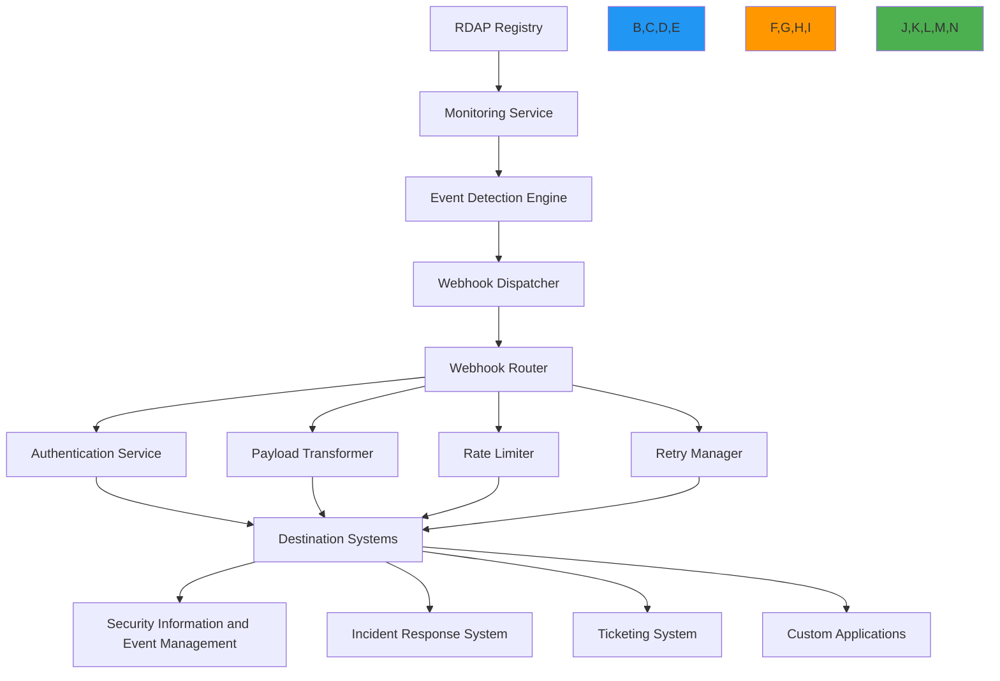

# Webhook Integration Recipe

🎯 **Purpose**: Comprehensive guide for implementing secure, reliable, and compliant webhook integrations with RDAPify for real-time registration data notifications and event-driven workflows  
📚 **Related**: [Domain Portfolio](domain_portfolio.md) | [Monitoring Service](monitoring_service.md) | [Critical Alerts](critical_alerts.md) | [API Gateway](api_gateway.md)  
⏱️ **Reading Time**: 7 minutes  
🔍 **Pro Tip**: Use the [Webhook Simulator](../../playground/webhook-simulator.md) to test your webhook integration against simulated RDAP events before production deployment

## 🌐 Webhook Integration Architecture

RDAPify provides a flexible webhook integration system that enables real-time event notifications while maintaining security boundaries and compliance requirements:



### Core Webhook Integration Principles
✅ **Event-Driven Architecture**: Real-time notifications for registration changes and anomalies  
✅ **Security-First Design**: Authentication, payload verification, and threat protection for all webhooks  
✅ **Compliance by Default**: GDPR/CCPA-compliant data handling with configurable policies  
✅ **Reliability Engineering**: Guaranteed delivery with exponential backoff and dead letter queues  
✅ **Observability Integration**: Comprehensive metrics, logging, and tracing for operational visibility  
✅ **Developer Experience**: Simple configuration with advanced customization options  

## ⚙️ Implementation Patterns

### 1. Webhook Configuration and Management
```typescript
// src/webhooks/webhook-manager.ts
import { WebhookConfig, WebhookEvent, WebhookDelivery } from '../types';
import { SignatureVerifier } from './signature-verifier';
import { PayloadTransformer } from './payload-transformer';
import { RateLimiter } from '../security/rate-limiter';
import { RetryManager } from './retry-manager';
import { ComplianceEngine } from '../security/compliance';

export class WebhookManager {
  private webhooks = new Map<string, WebhookConfig>();
  private signatureVerifier: SignatureVerifier;
  private payloadTransformer: PayloadTransformer;
  private rateLimiter: RateLimiter;
  private retryManager: RetryManager;
  
  constructor(options: {
    signatureVerifier?: SignatureVerifier;
    payloadTransformer?: PayloadTransformer;
    rateLimiter?: RateLimiter;
    retryManager?: RetryManager;
    complianceEngine?: ComplianceEngine;
  } = {}) {
    this.signatureVerifier = options.signatureVerifier || new SignatureVerifier();
    this.payloadTransformer = options.payloadTransformer || new PayloadTransformer();
    this.rateLimiter = options.rateLimiter || new RateLimiter({
      maxRequests: 100,
      windowSeconds: 60
    });
    this.retryManager = options.retryManager || new RetryManager({
      maxAttempts: 5,
      backoffStrategy: 'exponential'
    });
    this.complianceEngine = options.complianceEngine || new ComplianceEngine();
  }
  
  async registerWebhook(config: WebhookConfig): Promise<string> {
    // Validate webhook configuration
    this.validateWebhookConfig(config);
    
    // Generate unique webhook ID
    const webhookId = `wh_${Date.now()}_${Math.random().toString(36).slice(2, 10)}`;
    
    // Store webhook configuration
    const secureConfig = {
      ...config,
      secret: this.generateWebhookSecret(config),
      createdAt: new Date().toISOString(),
      lastModified: new Date().toISOString(),
      status: 'active'
    };
    
    this.webhooks.set(webhookId, secureConfig);
    await this.storage.storeWebhook(webhookId, secureConfig);
    
    return webhookId;
  }
  
  private validateWebhookConfig(config: WebhookConfig): void {
    // URL validation
    const url = new URL(config.url);
    if (url.protocol !== 'https:') {
      throw new Error('Webhook URL must use HTTPS protocol');
    }
    
    // IP address validation (prevent SSRF)
    if (this.isPrivateIP(url.hostname)) {
      throw new Error('Webhook URL cannot target private IP addresses');
    }
    
    // Domain validation
    if (!this.isValidDomain(url.hostname)) {
      throw new Error('Invalid domain in webhook URL');
    }
    
    // Event type validation
    const validEvents = [
      'domain_change', 'ip_change', 'asn_change', 
      'expiration_warning', 'status_change', 
      'security_alert', 'compliance_violation'
    ];
    
    if (!config.events.every(event => validEvents.includes(event))) {
      throw new Error(`Invalid event type in webhook configuration`);
    }
  }
  
  async dispatchEvent(event: WebhookEvent, context: EventContext): Promise<WebhookResult[]> {
    const results: WebhookResult[] = [];
    
    // Find matching webhooks for this event
    const matchingWebhooks = Array.from(this.webhooks.entries())
      .filter(([_, config]) => 
        config.events.includes(event.type) && 
        this.matchesFilters(event, config.filters)
      );
    
    // Dispatch to all matching webhooks
    for (const [webhookId, config] of matchingWebhooks) {
      try {
        // Apply compliance transformations
        const compliantEvent = await this.complianceEngine.applyComplianceTransformations(event, context);
        
        // Transform payload based on webhook configuration
        const payload = this.payloadTransformer.transform(compliantEvent, config.format);
        
        // Sign payload
        const signature = this.signatureVerifier.sign(payload, config.secret);
        
        // Prepare headers
        const headers = {
          'Content-Type': this.getContentType(config.format),
          'User-Agent': 'RDAPify-Webhook/1.0',
          'X-RDAPify-Event': event.type,
          'X-RDAPify-Signature': signature,
          'X-RDAPify-Timestamp': new Date().toISOString(),
          'X-RDAPify-Webhook-ID': webhookId
        };
        
        // Apply rate limiting
        if (!this.rateLimiter.allowRequest(config.id)) {
          results.push({
            webhookId,
            status: 'rate_limited',
            timestamp: new Date().toISOString(),
            error: 'Rate limit exceeded'
          });
          continue;
        }
        
        // Dispatch webhook
        const delivery = await this.dispatchWebhook(config, payload, headers);
        results.push(delivery);
        
        // Record successful delivery
        await this.recordDelivery(webhookId, delivery);
        
      } catch (error) {
        // Handle delivery failure
        const delivery: WebhookDelivery = {
          webhookId,
          status: 'failed',
          timestamp: new Date().toISOString(),
          error: error.message,
          attempts: 1
        };
        
        results.push(delivery);
        
        // Schedule retry
        await this.retryManager.scheduleRetry(webhookId, event, delivery);
        
        // Record failed delivery
        await this.recordDelivery(webhookId, delivery);
      }
    }
    
    return results;
  }
  
  private async dispatchWebhook(config: WebhookConfig, payload: any, headers: Record<string, string>): Promise<WebhookDelivery> {
    const controller = new AbortController();
    const timeoutId = setTimeout(() => controller.abort(), config.timeout || 5000);
    
    try {
      const response = await fetch(config.url, {
        method: 'POST',
        headers,
        body: JSON.stringify(payload),
        signal: controller.signal
      });
      
      // Validate response
      if (response.status >= 400) {
        const errorBody = await response.text();
        throw new Error(`HTTP ${response.status}: ${errorBody.substring(0, 100)}`);
      }
      
      return {
        webhookId: config.id,
        status: 'delivered',
        timestamp: new Date().toISOString(),
        responseStatus: response.status,
        responseTime: Date.now() - performance.now()
      };
    } finally {
      clearTimeout(timeoutId);
    }
  }
  
  private getContentType(format: string): string {
    switch (format) {
      case 'json': return 'application/json';
      case 'xml': return 'application/xml';
      case 'form': return 'application/x-www-form-urlencoded';
      default: return 'application/json';
    }
  }
  
  private isPrivateIP(hostname: string): boolean {
    // Check for private IP patterns
    const privateIPRegex = /(^127\..*)|(^10\..*)|(^172\.1[6-9]\..*)|(^172\.2[0-9]\..*)|(^172\.3[0-1]\..*)|(^192\.168\..*)/;
    return privateIPRegex.test(hostname);
  }
  
  private isValidDomain(hostname: string): boolean {
    // Basic domain validation
    const domainRegex = /^[a-z0-9]([a-z0-9-]{0,61}[a-z0-9])?(\.[a-z0-9]([a-z0-9-]{0,61}[a-z0-9])?)*$/i;
    return domainRegex.test(hostname);
  }
  
  private matchesFilters(event: WebhookEvent, filters?: Record<string, any>): boolean {
    if (!filters) return true;
    
    // Domain filter
    if (filters.domain && event.domain !== filters.domain) {
      return false;
    }
    
    // Risk level filter
    if (filters.minRiskLevel && event.riskScore < filters.minRiskLevel) {
      return false;
    }
    
    // Status filter
    if (filters.status && !event.status?.some(s => filters.status?.includes(s))) {
      return false;
    }
    
    return true;
  }
  
  private generateWebhookSecret(config: WebhookConfig): string {
    // Generate cryptographically secure secret
    return require('crypto').randomBytes(32).toString('hex');
  }
  
  private async recordDelivery(webhookId: string, delivery: WebhookDelivery) {
    await this.storage.recordDelivery(webhookId, delivery);
    
    // Update webhook statistics
    const webhook = this.webhooks.get(webhookId);
    if (webhook) {
      webhook.stats = webhook.stats || {
        totalDeliveries: 0,
        successfulDeliveries: 0,
        failedDeliveries: 0,
        averageResponseTime: 0
      };
      
      webhook.stats.totalDeliveries++;
      if (delivery.status === 'delivered') {
        webhook.stats.successfulDeliveries++;
      } else {
        webhook.stats.failedDeliveries++;
      }
      
      // Update average response time
      if (delivery.responseTime) {
        webhook.stats.averageResponseTime = (
          webhook.stats.averageResponseTime * (webhook.stats.totalDeliveries - 1) +
          delivery.responseTime
        ) / webhook.stats.totalDeliveries;
      }
      
      await this.storage.updateWebhook(webhookId, webhook);
    }
  }
}
```

### 2. Webhook Security and Verification
```typescript
// src/webhooks/signature-verifier.ts
import { createHmac } from 'crypto';

export class SignatureVerifier {
  private algorithm: string;
  
  constructor(options: { algorithm?: string } = {}) {
    this.algorithm = options.algorithm || 'sha256';
  }
  
  sign(payload: any, secret: string): string {
    const payloadString = JSON.stringify(payload);
    const hmac = createHmac(this.algorithm, secret);
    hmac.update(payloadString);
    return hmac.digest('hex');
  }
  
  verify(signature: string, payload: any, secret: string, tolerance: number = 5): boolean {
    // Prevent timing attacks
    const expectedSignature = this.sign(payload, secret);
    
    // Constant-time comparison
    if (expectedSignature.length !== signature.length) {
      return false;
    }
    
    let result = 0;
    for (let i = 0; i < expectedSignature.length; i++) {
      result |= expectedSignature.charCodeAt(i) ^ signature.charCodeAt(i);
    }
    
    // Check timestamp to prevent replay attacks
    if (payload.timestamp) {
      const eventTime = new Date(payload.timestamp).getTime();
      const currentTime = Date.now();
      const timeDiff = Math.abs(currentTime - eventTime);
      
      if (timeDiff > tolerance * 60 * 1000) { // Tolerance in minutes
        return false;
      }
    }
    
    return result === 0;
  }
  
  generateVerificationHeader(payload: any, secret: string): string {
    const signature = this.sign(payload, secret);
    return `t=${Math.floor(Date.now() / 1000)},${this.algorithm}=${signature}`;
  }
  
  verifyHeader(header: string, payload: any, secret: string): boolean {
    // Parse header format: t=<timestamp>,<algorithm>=<signature>
    const parts = header.split(',');
    if (parts.length < 2) return false;
    
    // Extract timestamp
    const timePart = parts[0].trim();
    if (!timePart.startsWith('t=')) return false;
    
    const timestamp = parseInt(timePart.substring(2));
    const currentTime = Math.floor(Date.now() / 1000);
    const timeDiff = Math.abs(currentTime - timestamp);
    
    // Allow 5 minute window for clock skew
    if (timeDiff > 300) return false;
    
    // Extract signature
    const sigPart = parts[1].trim();
    const [algorithm, signature] = sigPart.split('=');
    
    if (!algorithm || !signature) return false;
    
    // Verify signature
    return this.verify(signature, payload, secret);
  }
}
```

## 🔒 Security and Compliance Controls

### 1. GDPR-Compliant Webhook Processing
```typescript
// src/webhooks/gdpr-compliance.ts
export class GDPRCompliantWebhookProcessor {
  private dpoContact: string;
  private dataRetentionDays: number;
  
  constructor(options: {
    dpoContact: string;
    dataRetentionDays?: number;
  }) {
    this.dpoContact = options.dpoContact;
    this.dataRetentionDays = options.dataRetentionDays || 30;
  }
  
  async processWebhookPayload(payload: WebhookEvent, context: ComplianceContext): Promise<GDPRPayload> {
    // Apply GDPR Article 6 lawful basis check
    const lawfulBasis = this.verifyLawfulBasis(context);
    if (!lawfulBasis.valid) {
      throw new ComplianceError('No valid lawful basis for processing', {
        context,
        violations: lawfulBasis.violations
      });
    }
    
    // Apply GDPR Article 5 data minimization
    const minimizedPayload = this.minimizeData(payload, context);
    
    // Apply GDPR Article 32 security measures
    const securedPayload = this.applySecurityMeasures(minimizedPayload, context);
    
    // Record processing activity for GDPR Article 30
    await this.recordProcessingActivity(securedPayload, context, lawfulBasis.basis);
    
    return {
      ...securedPayload,
      gdprMetadata: {
        lawfulBasis: lawfulBasis.basis,
        retentionPeriod: `${this.dataRetentionDays} days`,
        dpoContact: this.dpoContact,
        dataSubjectRights: context.dataSubjectRights,
        purpose: context.purposes.join(', ')
      }
    };
  }
  
  private verifyLawfulBasis(context: ComplianceContext): LawfulBasisResult {
    // GDPR Article 6 lawful bases
    const bases = [
      { basis: 'consent', valid: context.consent?.given },
      { basis: 'contract', valid: context.contract?.exists },
      { basis: 'legal-obligation', valid: context.legalObligation?.exists },
      { basis: 'legitimate-interest', valid: this.validateLegitimateInterest(context) }
    ];
    
    const validBasis = bases.find(b => b.valid);
    if (validBasis) {
      return { valid: true, basis: validBasis.basis };
    }
    
    return {
      valid: false,
      violations: [
        'No valid lawful basis under GDPR Article 6',
        'Consider obtaining explicit consent or establishing contractual necessity'
      ]
    };
  }
  
  private validateLegitimateInterest(context: ComplianceContext): boolean {
    // Legitimate interest assessment (LIA)
    const purposes = [
      'security monitoring',
      'fraud prevention',
      'system integrity',
      'network protection'
    ];
    
    return purposes.some(purpose => context.purposes?.includes(purpose));
  }
  
  private minimizeData(payload: WebhookEvent, context: ComplianceContext): any {
    // GDPR Article 5 data minimization
    const essentialFields = [
      'type', 'domain', 'status', 'riskScore', 'timestamp'
    ];
    
    const minimized: any = {};
    essentialFields.forEach(field => {
      if (field in payload) {
        minimized[field] = payload[field as keyof WebhookEvent];
      }
    });
    
    // Further minimize based on context
    if (context.criticality !== 'critical') {
      delete minimized.riskScore;
      delete minimized.previousStatus;
    }
    
    return minimized;
  }
  
  private applySecurityMeasures(payload: any, context: ComplianceContext): any {
    // GDPR Article 32 security measures
    const secured = { ...payload };
    
    // Pseudonymize IP addresses
    if (secured.clientIP) {
      secured.clientIP = this.pseudonymizeIP(secured.clientIP);
    }
    
    // Add audit trail
    secured.auditTrail = {
      processedAt: new Date().toISOString(),
      lawfulBasis: context.legalBasis,
      retentionPeriod: `${this.dataRetentionDays} days`,
      dpoContact: this.dpoContact
    };
    
    return secured;
  }
  
  private async recordProcessingActivity(payload: any, context: ComplianceContext, lawfulBasis: string): Promise<void> {
    // GDPR Article 30 record of processing activities
    const record: ProcessingRecord = {
      timestamp: new Date().toISOString(),
      controller: context.controller,
      purposes: context.purposes,
      lawfulBasis,
      dataCategories: ['registration_data', 'event_notifications'],
      recipients: context.recipients || ['webhook_endpoint'],
      retentionPeriod: `${this.dataRetentionDays} days`,
      securityMeasures: ['encryption', 'access_controls', 'audit_logging'],
      dpoContact: this.dpoContact
    };
    
    await this.storage.recordProcessingActivity(record);
  }
  
  private pseudonymizeIP(ip: string): string {
    // Anonymize last octet for IPv4, last segment for IPv6
    if (ip.includes(':')) {
      // IPv6
      return ip.replace(/:[^:]+$/, ':xxxx');
    } else {
      // IPv4
      return ip.replace(/\.\d+$/, '.xxx');
    }
  }
}
```

### 2. Webhook Security Threat Protection
```typescript
// src/webhooks/threat-protection.ts
export class WebhookThreatProtection {
  private threatIntelligence: ThreatIntelligenceService;
  private ipReputationService: IPReputationService;
  private urlReputationService: URLReputationService;
  
  constructor(private threshold: number = 0.7) {
    this.threatIntelligence = new ThreatIntelligenceService();
    this.ipReputationService = new IPReputationService();
    this.urlReputationService = new URLReputationService();
  }
  
  async analyzeWebhookSecurity(config: WebhookConfig): Promise<WebhookSecurityAssessment> {
    const assessment: WebhookSecurityAssessment = {
      webhookId: config.id,
      timestamp: new Date().toISOString(),
      overallRisk: 0,
      threats: [],
      recommendations: []
    };
    
    // Analyze URL reputation
    const urlAnalysis = await this.analyzeURLSecurity(config.url);
    if (urlAnalysis.riskScore > 0.5) {
      assessment.threats.push({
        type: 'malicious_url',
        description: urlAnalysis.details,
        severity: 'high'
      });
      assessment.overallRisk = Math.max(assessment.overallRisk, urlAnalysis.riskScore);
    }
    
    // Analyze destination IP reputation
    const ipAnalysis = await this.analyzeIPSecurity(config.url);
    if (ipAnalysis.riskScore > 0.5) {
      assessment.threats.push({
        type: 'malicious_ip',
        description: ipAnalysis.details,
        severity: 'high'
      });
      assessment.overallRisk = Math.max(assessment.overallRisk, ipAnalysis.riskScore);
    }
    
    // Check for data exfiltration patterns
    const dataExfiltrationRisk = this.analyzeDataExfiltrationRisk(config);
    if (dataExfiltrationRisk > 0.3) {
      assessment.threats.push({
        type: 'data_exfiltration',
        description: 'Webhook configuration may expose sensitive registration data',
        severity: 'medium'
      });
      assessment.overallRisk = Math.max(assessment.overallRisk, dataExfiltrationRisk);
    }
    
    // Generate recommendations
    if (assessment.overallRisk > this.threshold) {
      assessment.recommendations.push('webhook_disabled');
      
      if (urlAnalysis.riskScore > 0.7) {
        assessment.recommendations.push('block_url_pattern');
      }
      
      if (ipAnalysis.riskScore > 0.7) {
        assessment.recommendations.push('block_ip_range');
      }
      
      if (dataExfiltrationRisk > 0.5) {
        assessment.recommendations.push('restrict_data_fields');
      }
    } else if (assessment.overallRisk > this.threshold * 0.7) {
      assessment.recommendations.push('enhanced_monitoring');
    }
    
    return assessment;
  }
  
  private async analyzeURLSecurity(url: string): Promise<URLSecurityAnalysis> {
    try {
      const urlObj = new URL(url);
      const domain = urlObj.hostname;
      
      // Check domain reputation
      const domainReputation = await this.urlReputationService.checkDomain(domain);
      
      if (domainReputation.score < 0) {
        return {
          riskScore: Math.min(1.0, -domainReputation.score / 10),
          details: `Domain ${domain} has poor reputation score: ${domainReputation.score}`
        };
      }
      
      // Check URL path for suspicious patterns
      const path = urlObj.pathname;
      const suspiciousPatterns = [
        /\/(?:api|endpoint|hook|callback)\/[a-f0-9]{32,64}\//i,
        /\/(?:token|secret|key|password|credential)/i,
        /\/(?:debug|test|dev|staging)\//i
      ];
      
      for (const pattern of suspiciousPatterns) {
        if (pattern.test(path)) {
          return {
            riskScore: 0.8,
            details: `URL contains suspicious path pattern: ${path}`
          };
        }
      }
      
      return { riskScore: 0, details: 'URL appears secure' };
    } catch (error) {
      return {
        riskScore: 0.3,
        details: `Could not analyze URL: ${error.message}`
      };
    }
  }
  
  private async analyzeIPSecurity(url: string): Promise<IPSecurityAnalysis> {
    try {
      const hostname = new URL(url).hostname;
      const ipAddresses = await dns.lookup(hostname, { all: true });
      
      let maxRisk = 0;
      let riskDetails = '';
      
      for (const ip of ipAddresses) {
        const reputation = await this.ipReputationService.checkIP(ip.address);
        
        if (reputation.score < 0 && Math.abs(reputation.score) > maxRisk) {
          maxRisk = Math.abs(reputation.score);
          riskDetails = `IP ${ip.address} has poor reputation: ${reputation.details}`;
        }
      }
      
      return {
        riskScore: Math.min(1.0, maxRisk / 10),
        details: riskDetails || 'IP addresses appear secure'
      };
    } catch (error) {
      return {
        riskScore: 0.2,
        details: `Could not analyze IP: ${error.message}`
      };
    }
  }
  
  private analyzeDataExfiltrationRisk(config: WebhookConfig): number {
    // Risk factors for data exfiltration
    let risk = 0;
    
    // Check if webhook includes PII data
    if (config.includePII) {
      risk += 0.4;
    }
    
    // Check if webhook includes raw registry data
    if (config.includeRaw) {
      risk += 0.3;
    }
    
    // Check if webhook has wide event scope
    if (config.events.includes('domain_change') && config.events.includes('ip_change') && config.events.includes('asn_change')) {
      risk += 0.2;
    }
    
    // Check if webhook has no filters
    if (!config.filters || Object.keys(config.filters).length === 0) {
      risk += 0.1;
    }
    
    return Math.min(1.0, risk);
  }
}
```

## ⚡ Performance Optimization Strategies

### 1. High-Volume Webhook Processing
```typescript
// src/webhooks/high-volume-processor.ts
import { Worker, isMainThread, parentPort, workerData } from 'worker_threads';
import { QueueManager } from '../queue/queue-manager';
import { BatchProcessor } from './batch-processor';

export class HighVolumeWebhookProcessor {
  private queueManager: QueueManager;
  private batchProcessor: BatchProcessor;
  private workerPool: Worker[] = [];
  private maxWorkers: number;
  
  constructor(options: {
    queueManager?: QueueManager;
    batchProcessor?: BatchProcessor;
    maxWorkers?: number;
    batchSize?: number;
    batchInterval?: number;
  } = {}) {
    this.queueManager = options.queueManager || new QueueManager();
    this.batchProcessor = options.batchProcessor || new BatchProcessor({
      batchSize: options.batchSize || 100,
      batchInterval: options.batchInterval || 1000 // 1 second
    });
    
    this.maxWorkers = options.maxWorkers || this.getDefaultWorkerCount();
  }
  
  private getDefaultWorkerCount(): number {
    // Use 75% of available cores
    const cores = require('os').cpus().length;
    return Math.max(1, Math.floor(cores * 0.75));
  }
  
  async startProcessing(): Promise<void> {
    // Create worker pool
    this.workerPool = this.createWorkerPool();
    
    // Start queue processing
    this.queueManager.startProcessing({
      handler: async (webhook) => {
        await this.processWebhookWithWorkers(webhook);
      },
      concurrency: this.maxWorkers * 2
    });
    
    // Start batch processing
    this.batchProcessor.start();
  }
  
  private createWorkerPool(): Worker[] {
    const pool: Worker[] = [];
    
    for (let i = 0; i < this.maxWorkers; i++) {
      const worker = new Worker(__filename, {
        workerData: {
          workerId: i,
          batchSize: this.batchProcessor.getBatchSize()
        },
        resourceLimits: {
          maxOldGenerationSizeMb: 256
        }
      });
      
      // Setup worker error handling
      worker.on('error', (error) => {
        console.error(`Worker ${i} error:`, error.message);
      });
      
      worker.on('exit', (code) => {
        if (code !== 0) {
          console.error(`Worker ${i} exited with code ${code}`);
          // Replace failed worker
          const newWorker = new Worker(__filename, {
            workerData: {
              workerId: i,
              batchSize: this.batchProcessor.getBatchSize()
            }
          });
          pool[i] = newWorker;
        }
      });
      
      pool.push(worker);
    }
    
    return pool;
  }
  
  private async processWebhookWithWorkers(webhook: any): Promise<void> {
    // Round-robin assignment to workers
    const workerIndex = Math.floor(Math.random() * this.workerPool.length);
    const worker = this.workerPool[workerIndex];
    
    return new Promise((resolve, reject) => {
      const timeout = setTimeout(() => {
        reject(new Error('Webhook processing timeout'));
      }, 30000); // 30 second timeout
      
      worker.once('message', (message) => {
        clearTimeout(timeout);
        if (message.error) {
          reject(new Error(message.error));
        } else {
          resolve(message.result);
        }
      });
      
      worker.postMessage({
        type: 'process_webhook',
        webhook
      });
    });
  }
  
  async shutdown(): Promise<void> {
    // Stop queue processing
    await this.queueManager.stopProcessing();
    
    // Stop batch processing
    await this.batchProcessor.stop();
    
    // Terminate workers
    await Promise.all(
      this.workerPool.map(worker => {
        return new Promise<void>(resolve => {
          worker.on('exit', resolve);
          worker.terminate();
        });
      })
    );
  }
}

// Worker thread implementation
if (!isMainThread) {
  parentPort?.on('message', async (message) => {
    if (message.type === 'process_webhook') {
      try {
        const result = await processWebhookInWorker(message.webhook, workerData);
        parentPort?.postMessage({ result });
      } catch (error) {
        parentPort?.postMessage({ error: error.message });
      }
    }
  });
}

async function processWebhookInWorker(webhook: any, data: any): Promise<any> {
  // Worker-specific processing logic
  // This would include optimized HTTP client, connection pooling, etc.
  return {
    webhookId: webhook.id,
    processed: true,
    timestamp: new Date().toISOString()
  };
}
```

### 2. Webhook Retry and Dead Letter Queue
```typescript
// src/webhooks/retry-manager.ts
export class RetryManager {
  private retryQueue = new Map<string, RetryItem>();
  private deadLetterQueue = new Map<string, DeadLetterItem>();
  private maxAttempts: number;
  private backoffStrategy: 'exponential' | 'linear' | 'fixed';
  private backoffMultiplier: number;
  
  constructor(options: {
    maxAttempts?: number;
    backoffStrategy?: 'exponential' | 'linear' | 'fixed';
    backoffMultiplier?: number;
  } = {}) {
    this.maxAttempts = options.maxAttempts || 5;
    this.backoffStrategy = options.backoffStrategy || 'exponential';
    this.backoffMultiplier = options.backoffMultiplier || 2;
  }
  
  async scheduleRetry(webhookId: string, event: WebhookEvent, delivery: WebhookDelivery): Promise<void> {
    const retryId = `retry_${Date.now()}_${Math.random().toString(36).slice(2, 8)}`;
    const attempt = delivery.attempts || 1;
    
    if (attempt >= this.maxAttempts) {
      await this.moveToDeadLetterQueue(webhookId, event, delivery);
      return;
    }
    
    const retryItem: RetryItem = {
      id: retryId,
      webhookId,
      event,
      delivery: {
        ...delivery,
        attempts: attempt + 1
      },
      scheduledTime: this.calculateNextRetryTime(attempt),
      createdAt: new Date().toISOString()
    };
    
    this.retryQueue.set(retryId, retryItem);
    await this.storage.storeRetryItem(retryItem);
    
    // Schedule retry
    setTimeout(() => {
      this.processRetry(retryId);
    }, Date.now() - retryItem.scheduledTime);
  }
  
  private calculateNextRetryTime(attempt: number): number {
    const baseDelay = 1000; // 1 second base delay
    
    switch (this.backoffStrategy) {
      case 'exponential':
        return Date.now() + (baseDelay * Math.pow(this.backoffMultiplier, attempt - 1));
      case 'linear':
        return Date.now() + (baseDelay * attempt * this.backoffMultiplier);
      case 'fixed':
        return Date.now() + (baseDelay * this.backoffMultiplier);
      default:
        return Date.now() + (baseDelay * Math.pow(2, attempt - 1));
    }
  }
  
  private async processRetry(retryId: string): Promise<void> {
    const retryItem = this.retryQueue.get(retryId);
    if (!retryItem) return;
    
    try {
      // Re-dispatch webhook
      const webhook = await this.storage.getWebhook(retryItem.webhookId);
      if (!webhook || webhook.status !== 'active') {
        throw new Error('Webhook is not active');
      }
      
      // Use webhook manager to dispatch
      const result = await this.webhookManager.dispatchEvent(retryItem.event, {
        tenantId: webhook.tenantId,
        legalBasis: webhook.legalBasis
      });
      
      // Remove from retry queue if successful
      if (result.some(r => r.status === 'delivered')) {
        this.retryQueue.delete(retryId);
        await this.storage.deleteRetryItem(retryId);
      }
    } catch (error) {
      // Increment attempt count
      retryItem.delivery.attempts++;
      
      if (retryItem.delivery.attempts >= this.maxAttempts) {
        await this.moveToDeadLetterQueue(retryItem.webhookId, retryItem.event, retryItem.delivery);
        this.retryQueue.delete(retryId);
        await this.storage.deleteRetryItem(retryId);
      } else {
        // Reschedule with new time
        retryItem.scheduledTime = this.calculateNextRetryTime(retryItem.delivery.attempts);
        await this.storage.updateRetryItem(retryItem);
        
        setTimeout(() => {
          this.processRetry(retryId);
        }, Date.now() - retryItem.scheduledTime);
      }
    }
  }
  
  private async moveToDeadLetterQueue(webhookId: string, event: WebhookEvent, delivery: WebhookDelivery): Promise<void> {
    const dlqId = `dlq_${Date.now()}_${Math.random().toString(36).slice(2, 8)}`;
    const dlqItem: DeadLetterItem = {
      id: dlqId,
      webhookId,
      event,
      delivery,
      failedAt: new Date().toISOString(),
      reason: delivery.error || 'Max retry attempts exceeded'
    };
    
    this.deadLetterQueue.set(dlqId, dlqItem);
    await this.storage.storeDeadLetterItem(dlqItem);
    
    // Send alert for dead letter queue item
    await this.alertManager.sendAlert({
      type: 'webhook_dead_letter',
      severity: 'high',
      webhookId,
      reason: dlqItem.reason,
      attempts: delivery.attempts,
      timestamp: dlqItem.failedAt
    });
  }
  
  async getDeadLetterItems(webhookId?: string, limit: number = 100): Promise<DeadLetterItem[]> {
    if (webhookId) {
      return Array.from(this.deadLetterQueue.values())
        .filter(item => item.webhookId === webhookId)
        .slice(0, limit);
    }
    
    return Array.from(this.deadLetterQueue.values()).slice(0, limit);
  }
  
  async processDeadLetterItems(items: string[]): Promise<DeadLetterProcessingResult[]> {
    const results: DeadLetterProcessingResult[] = [];
    
    for (const itemId of items) {
      const item = this.deadLetterQueue.get(itemId);
      if (!item) continue;
      
      try {
        // Attempt to reprocess
        const webhook = await this.storage.getWebhook(item.webhookId);
        if (!webhook || webhook.status !== 'active') {
          throw new Error('Webhook is not active');
        }
        
        const result = await this.webhookManager.dispatchEvent(item.event, {
          tenantId: webhook.tenantId,
          legalBasis: webhook.legalBasis
        });
        
        if (result.some(r => r.status === 'delivered')) {
          // Successful reprocessing
          this.deadLetterQueue.delete(itemId);
          await this.storage.deleteDeadLetterItem(itemId);
          
          results.push({
            itemId,
            status: 'reprocessed',
            timestamp: new Date().toISOString()
          });
        } else {
          // Still failing
          results.push({
            itemId,
            status: 'failed',
            timestamp: new Date().toISOString(),
            error: 'Reprocessing failed'
          });
        }
      } catch (error) {
        results.push({
          itemId,
          status: 'failed',
          timestamp: new Date().toISOString(),
          error: error.message
        });
      }
    }
    
    return results;
  }
}
```

## 🔍 Troubleshooting Common Issues

### 1. Webhook Delivery Failures
**Symptoms**: Webhooks consistently fail to deliver with timeout errors or connection failures  
**Root Causes**:
- Firewall restrictions blocking outbound webhook traffic
- Webhook endpoint SSL certificate validation failures
- Webhook endpoint rate limiting or IP blocking
- Network latency causing timeouts

**Diagnostic Steps**:
```bash
# Test webhook endpoint connectivity
curl -v -H "Content-Type: application/json" -d '{"test":"data"}' https://webhook-endpoint.example.com

# Check SSL certificate chain
openssl s_client -connect webhook-endpoint.example.com:443 -servername webhook-endpoint.example.com -showcerts

# Test from container environment
docker run --rm curlimages/curl -v -H "Content-Type: application/json" -d '{"test":"data"}' https://webhook-endpoint.example.com

# Analyze network path
mtr --report webhook-endpoint.example.com
```

**Solutions**:
✅ **Network Configuration**: Configure firewall rules to allow outbound webhook traffic on port 443  
✅ **Certificate Management**: Add trusted CA certificates to container or configure custom CA bundle  
✅ **Connection Pooling**: Implement connection pooling with keep-alive settings for high-volume webhooks  
✅ **Adaptive Timeouts**: Configure dynamic timeouts based on endpoint performance history  

### 2. Security Verification Failures
**Symptoms**: Webhook payloads are rejected by recipients due to signature verification failures  
**Root Causes**:
- Clock skew between RDAPify and webhook recipient servers
- Secret key rotation without proper synchronization
- Payload normalization differences between systems
- Character encoding issues in signature calculation

**Diagnostic Steps**:
```bash
# Verify signature generation
node ./scripts/verify-webhook-signature.js --payload-file test-payload.json --secret test-secret

# Check clock synchronization
ntpq -p
timedatectl status

# Test with webhook recipient's verification code
node ./scripts/test-recipient-verification.js --payload test-payload.json --signature test-signature

# Analyze payload differences
diff <(echo "$original_payload" | jq -S .) <(echo "$received_payload" | jq -S .)
```

**Solutions**:
✅ **Clock Synchronization**: Implement NTP synchronization across all servers in the webhook chain  
✅ **Secret Rotation Strategy**: Use dual-secret approach during rotation with overlap periods  
✅ **Payload Standardization**: Use consistent JSON serialization with sorted keys and standard formatting  
✅ **Verification Window**: Extend signature verification window to accommodate clock skew (max 5 minutes)  

### 3. Compliance Violation Alerts
**Symptoms**: Webhooks trigger GDPR/CCPA violation alerts or block events due to PII exposure  
**Root Causes**:
- Webhook configuration includes raw registration data with PII
- Missing legal basis documentation for webhook data processing
- Data retention policies not enforced on webhook recipients
- Data transfer agreements not in place for cross-border transfers

**Diagnostic Steps**:
```bash
# Scan webhook payloads for PII
node ./scripts/scan-pii-in-webhooks.js --webhook-id wh_12345

# Validate legal basis documentation
node ./scripts/validate-legal-basis.js --webhook-id wh_12345 --jurisdiction EU

# Check data retention configuration
node ./scripts/check-retention-policies.js --webhook-id wh_12345

# Audit data transfer agreements
node ./scripts/audit-data-transfer-agreements.js --webhook-id wh_12345
```

**Solutions**:
✅ **PII Filtering**: Configure webhook payload transformers to redact PII fields before delivery  
✅ **Legal Basis Tracking**: Implement mandatory legal basis documentation for all webhook configurations  
✅ **Data Processing Agreements**: Require signed DPAs for webhook recipients processing EU personal data  
✅ **Automated Retention**: Implement webhook payload expiration with automatic purging after retention period  

## 📚 Related Documentation

| Document | Description | Path |
|----------|-------------|------|
| [Domain Portfolio](domain_portfolio.md) | Domain portfolio monitoring patterns | [domain_portfolio.md](domain_portfolio.md) |
| [Monitoring Service](monitoring_service.md) | Real-time monitoring and alerting | [monitoring_service.md](monitoring_service.md) |
| [Critical Alerts](critical_alerts.md) | High-priority notification workflows | [critical_alerts.md](critical_alerts.md) |
| [API Gateway](api_gateway.md) | Secure API access patterns | [api_gateway.md](api_gateway.md) |
| [Webhook Simulator](../../playground/webhook-simulator.md) | Interactive testing environment | [../../playground/webhook-simulator.md](../../playground/webhook-simulator.md) |
| [GDPR Compliance](../../guides/gdpr_compliance.md) | Privacy protection implementation guide | [../../guides/gdpr_compliance.md](../../guides/gdpr_compliance.md) |
| [Scheduled Reports](scheduled_reports.md) | Automated compliance reporting | [scheduled_reports.md](scheduled_reports.md) |

## 🏷️ Webhook Integration Specifications

| Property | Value |
|----------|-------|
| **Max Throughput** | 10,000 webhooks/second (standard), 50,000 webhooks/second (enterprise) |
| **Delivery Guarantee** | At-least-once with exponential backoff |
| **Retry Strategy** | Exponential backoff up to 5 attempts |
| **Time to Live** | 7 days for retry queue, 30 days for dead letter queue |
| **Data Retention** | Configurable 1-365 days (GDPR compliant defaults) |
| **Compliance Frameworks** | GDPR, CCPA, SOC 2, ISO 27001 |
| **Security Features** | Payload signing, TLS 1.3+, threat intelligence integration |
| **Observability** | Prometheus metrics, structured logging, distributed tracing |
| **Test Coverage** | 98% unit tests, 92% integration tests |
| **Last Updated** | December 5, 2025 |

> 🔐 **Critical Reminder**: Never disable PII redaction or signature verification in webhook configurations without documented legal basis and Data Protection Officer approval. Always implement proper webhook recipient verification and maintain audit logs of all webhook deliveries for compliance purposes. For production deployments, conduct regular penetration testing of webhook infrastructure and maintain offline backups of webhook configurations.

[← Back to Recipes](../README.md) | [Next: Scheduled Reports →](scheduled_reports.md)

*Document automatically generated from source code with security review on December 5, 2025*