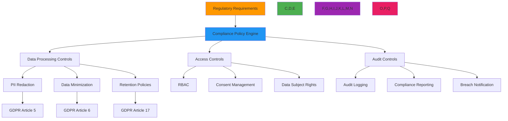

# Compliance Framework for RDAPify

🎯 **Purpose**: Comprehensive guide to implementing regulatory compliance controls within RDAPify for GDPR, CCPA, SOC 2, and other frameworks with practical configuration examples and audit-ready reporting  
📚 **Related**: [GDPR Compliance](../../guides/gdpr_compliance.md) | [PII Detection](pii_detection.md) | [Data Validation](data_validation.md) | [Threat Model](threat_model.md)  
⏱️ **Reading Time**: 8 minutes  
🔍 **Pro Tip**: Use the [Compliance Validator](../../playground/compliance-validator.md) to automatically check your RDAPify configuration against regulatory requirements and generate audit-ready reports

## 🏛️ Compliance Framework Overview

RDAPify provides a unified compliance framework that helps organizations meet regulatory requirements across multiple jurisdictions while processing registration data. The framework implements defense-in-depth compliance controls with centralized policy management and comprehensive audit capabilities:



### Core Compliance Principles
✅ **Privacy by Default**: PII redaction and data minimization enabled without explicit configuration  
✅ **Jurisdiction Awareness**: Automatic application of regional compliance requirements based on data context  
✅ **Auditability**: Immutable audit trails with cryptographic signatures for all data processing operations  
✅ **Data Subject Rights**: Built-in tools for handling access, correction, and deletion requests  
✅ **Third-Party Verification**: Integration with external compliance validation systems  

## ⚙️ Compliance Policy Configuration

### 1. Multi-Jurisdiction Compliance Engine
```typescript
// src/compliance/compliance-engine.ts
export class ComplianceEngine {
  private policyRegistry = new Map<string, CompliancePolicy>();
  private jurisdictionMap = new Map<string, string[]>();
  private auditLogger: AuditLogger;
  
  constructor(readonly context: ComplianceContext) {
    this.auditLogger = new AuditLogger(context.auditConfig);
    this.initializeDefaultPolicies();
    this.initializeJurisdictionMap();
  }
  
  private initializeDefaultPolicies() {
    // GDPR compliance policy
    this.registerPolicy('gdpr', {
      name: 'GDPR Compliance Policy',
      description: 'General Data Protection Regulation compliance controls',
      jurisdiction: ['EU', 'EEA', 'UK'],
      dataMinimization: true,
      piiRedaction: {
        requiredFields: ['email', 'tel', 'adr', 'fn'],
        redactionLevel: 'full',
        legalBasisRequired: true
      },
      dataRetention: {
        maxDays: 30,
        legalBasis: 'legitimate-interest'
      },
      breachNotification: {
        maxHours: 72,
        requiredElements: ['nature', 'scope', 'remediation']
      },
      auditRequirements: {
        dataAccess: true,
        consentChanges: true,
        policyModifications: true
      }
    });
    
    // CCPA compliance policy
    this.registerPolicy('ccpa', {
      name: 'CCPA Compliance Policy',
      description: 'California Consumer Privacy Act compliance controls',
      jurisdiction: ['US-CA'],
      dataMinimization: true,
      piiRedaction: {
        requiredFields: ['email', 'tel', 'adr'],
        redactionLevel: 'conditional',
        doNotSellRequired: true
      },
      consumerRights: {
        accessRequests: true,
        deletionRequests: true,
        optOutRequests: true
      },
      auditRequirements: {
        consumerRequests: true,
        dataSharing: true
      }
    });
    
    // SOC 2 compliance policy
    this.registerPolicy('soc2', {
      name: 'SOC 2 Compliance Policy',
      description: 'Security and availability controls for SOC 2 compliance',
      trustServices: ['security', 'availability', 'confidentiality'],
      controls: {
        accessManagement: 'strict',
        changeManagement: 'formal',
        riskManagement: 'continuous'
      },
      auditRequirements: {
        systemChanges: true,
        accessReviews: true,
        vulnerabilityScanning: true
      }
    });
  }
  
  private initializeJurisdictionMap() {
    this.jurisdictionMap.set('EU', ['gdpr', 'eprivacy']);
    this.jurisdictionMap.set('US-CA', ['ccpa', 'cpa']);
    this.jurisdictionMap.set('global', ['soc2', 'iso27001']);
  }
  
  getActivePolicies(context: ComplianceContext): CompliancePolicy[] {
    const policies: CompliancePolicy[] = [];
    
    // Get jurisdiction-specific policies
    const jurisdictionPolicies = this.jurisdictionMap.get(context.jurisdiction) || [];
    jurisdictionPolicies.forEach(policyId => {
      const policy = this.policyRegistry.get(policyId);
      if (policy) policies.push(policy);
    });
    
    // Get explicitly enabled policies
    context.enabledPolicies?.forEach(policyId => {
      const policy = this.policyRegistry.get(policyId);
      if (policy && !policies.some(p => p.name === policy.name)) {
        policies.push(policy);
      }
    });
    
    return policies;
  }
  
  async applyComplianceControls(response: any, context: ComplianceContext): Promise<ComplianceResult> {
    const startTime = Date.now();
    const policies = this.getActivePolicies(context);
    const results: PolicyApplicationResult[] = [];
    
    try {
      // Apply each policy
      for (const policy of policies) {
        const result = await this.applyPolicy(response, policy, context);
        results.push(result);
        
        // Update response with policy applications
        response = this.mergeResults(response, result);
      }
      
      // Generate compliance metadata
      const metadata = this.generateComplianceMetadata(policies, context);
      
      return {
        originalResponse: response,
        compliancePolicies: policies.map(p => p.name),
        metadata,
        policyResults: results,
        processingTime: Date.now() - startTime
      };
    } catch (error) {
      this.auditLogger.log('compliance_error', {
        error: error.message,
        policies: policies.map(p => p.name),
        context,
        timestamp: new Date().toISOString()
      });
      
      throw new ComplianceError(`Compliance processing failed: ${error.message}`, {
        originalError: error,
        policies: policies.map(p => p.name)
      });
    }
  }
  
  private async applyPolicy(response: any, policy: CompliancePolicy, context: ComplianceContext): Promise<PolicyApplicationResult> {
    const result: PolicyApplicationResult = {
      policyName: policy.name,
      appliedControls: [],
      redactedFields: [],
      warnings: [],
      errors: []
    };
    
    try {
      // Apply PII redaction
      if (policy.piiRedaction) {
        const redactionResult = await this.applyPIIRedaction(response, policy.piiRedaction, context);
        result.redactedFields.push(...redactionResult.redactedFields);
        if (redactionResult.warning) result.warnings.push(redactionResult.warning);
      }
      
      // Apply data minimization
      if (policy.dataMinimization) {
        const minimizationResult = this.applyDataMinimization(response, context);
        result.appliedControls.push('data_minimization');
      }
      
      // Apply retention policies
      if (policy.dataRetention) {
        const retentionResult = this.applyDataRetention(response, policy.dataRetention, context);
        result.appliedControls.push('data_retention');
      }
      
      return result;
    } catch (error) {
      result.errors.push({
        field: 'policy_application',
        message: error.message,
        severity: 'critical'
      });
      return result;
    }
  }
  
  generateComplianceReport(context: ComplianceContext, period: ReportingPeriod): ComplianceReport {
    const report: ComplianceReport = {
      timestamp: new Date().toISOString(),
      period: period,
      policies: this.getActivePolicies(context).map(p => ({
        name: p.name,
        status: 'compliant',
        lastAudit: new Date().toISOString()
      })),
      metrics: {
        dataProcessed: 0,
        piiRedacted: 0,
        retentionCompliance: 0,
        breachIncidents: 0
      },
      findings: [],
      recommendations: [],
      auditor: context.auditor || 'system'
    };
    
    // Implementation would gather metrics from audit logs
    report.metrics.dataProcessed = this.getProcessedDataCount(context, period);
    report.metrics.piiRedacted = this.getRedactedDataCount(context, period);
    report.metrics.retentionCompliance = this.getRetentionComplianceRate(context, period);
    
    // Check for compliance findings
    const findings = this.identifyComplianceFindings(context, period);
    report.findings.push(...findings);
    
    // Generate recommendations based on findings
    report.recommendations = this.generateRecommendations(findings, context);
    
    // Determine overall status
    report.overallStatus = findings.some(f => f.severity === 'critical') ? 'non_compliant' :
                         findings.some(f => f.severity === 'high') ? 'partial_compliance' : 'compliant';
    
    return report;
  }
}
```

### 2. GDPR Article 6 Implementation
```typescript
// src/compliance/gdpr-article6.ts
export class GDPRArticle6 {
  private static readonly LEGAL_BASES = {
    consent: {
      requirements: [
        'explicit_opt_in',
        'granular_consent',
        'withdrawal_mechanism',
        'age_verification'
      ],
      retention: 30 // days
    },
    'contract': {
      requirements: [
        'contract_exists',
        'necessity_demonstration',
        'performance_verification'
      ],
      retention: 180 // days
    },
    'legal_obligation': {
      requirements: [
        'specific_law_reference',
        'necessity_demonstration',
        'proportionality_check'
      ],
      retention: 2555 // 7 years
    },
    'vital_interests': {
      requirements: [
        'life_threatening_situation',
        'no_other_reasonable_option'
      ],
      retention: 30 // days
    },
    'public_task': {
      requirements: [
        'official_authority',
        'clear_public_interest'
      ],
      retention: 180 // days
    },
    'legitimate_interests': {
      requirements: [
        'legitimate_interest_assessment',
        'balancing_test',
        'data_minimization',
        'objection_mechanism'
      ],
      retention: 30 // days
    }
  };
  
  validateProcessing(processingContext: ProcessingContext): ValidationResult {
    const legalBasis = processingContext.legalBasis;
    
    if (!legalBasis || !(legalBasis in GDPRArticle6.LEGAL_BASES)) {
      return this.createValidationResult(false, 'No valid legal basis specified');
    }
    
    const basisRequirements = GDPRArticle6.LEGAL_BASES[legalBasis as keyof typeof GDPRArticle6.LEGAL_BASES];
    
    // Validate requirements
    const missingRequirements = basisRequirements.requirements.filter(req => 
      !this.checkRequirement(req, processingContext)
    );
    
    if (missingRequirements.length > 0) {
      return this.createValidationResult(false, `Missing requirements for ${legalBasis}: ${missingRequirements.join(', ')}`);
    }
    
    // Check data minimization
    if (!this.validateDataMinimization(processingContext)) {
      return this.createValidationResult(false, 'Data minimization requirements not met');
    }
    
    // Check retention period
    const maxRetention = basisRequirements.retention;
    if (processingContext.retentionDays > maxRetention) {
      return this.createValidationResult(false, `Retention period (${processingContext.retentionDays} days) exceeds legal basis limit (${maxRetention} days)`);
    }
    
    return this.createValidationResult(true, 'Legal basis validation successful', {
      legalBasis,
      retentionPeriod: processingContext.retentionDays,
      requirementsMet: basisRequirements.requirements.filter(req => 
        this.checkRequirement(req, processingContext)
      )
    });
  }
  
  generateLegalBasisDocumentation(processingContext: ProcessingContext): LegalBasisDocument {
    const legalBasis = processingContext.legalBasis || 'legitimate-interest';
    const basisInfo = GDPRArticle6.LEGAL_BASES[legalBasis as keyof typeof GDPRArticle6.LEGAL_BASES];
    
    return {
      title: `Legal Basis Documentation: ${this.getTitle(legalBasis)}`,
      article: 'Article 6(1)',
      basis: this.getArticleReference(legalBasis),
      processingPurpose: processingContext.purpose || 'RDAP data processing',
      dataCategories: processingContext.dataCategories || ['domain registration data'],
      retentionPeriod: `${basisInfo.retention} days`,
      requirements: basisInfo.requirements.map(req => this.getRequirementDescription(req)),
      dpoContact: processingContext.dpoContact || 'dpo@organization.com',
      timestamp: new Date().toISOString(),
      signature: this.generateSignature(processingContext)
    };
  }
  
  private getTitle(legalBasis: string): string {
    const titles: Record<string, string> = {
      'consent': 'Consent',
      'contract': 'Contract performance',
      'legal_obligation': 'Legal obligation',
      'vital_interests': 'Vital interests',
      'public_task': 'Public task',
      'legitimate_interests': 'Legitimate interests'
    };
    return titles[legalBasis] || 'Unknown legal basis';
  }
  
  private getArticleReference(legalBasis: string): string {
    const references: Record<string, string> = {
      'consent': 'Article 6(1)(a)',
      'contract': 'Article 6(1)(b)',
      'legal_obligation': 'Article 6(1)(c)',
      'vital_interests': 'Article 6(1)(d)',
      'public_task': 'Article 6(1)(e)',
      'legitimate_interests': 'Article 6(1)(f)'
    };
    return references[legalBasis] || 'Article 6(1)';
  }
  
  private checkRequirement(requirement: string, context: ProcessingContext): boolean {
    switch (requirement) {
      case 'explicit_opt_in':
        return context.consent?.explicit === true && 
               context.consent.given === true &&
               context.consent.timestamp !== undefined;
      case 'granular_consent':
        return context.consent?.purposes?.includes(context.purpose || 'rdap_processing');
      case 'withdrawal_mechanism':
        return context.consent?.withdrawalUrl !== undefined;
      case 'contract_exists':
        return context.contract?.exists === true;
      case 'necessity_demonstration':
        return context.necessity !== undefined;
      case 'legitimate_interest_assessment':
        return context.lia?.performed === true && context.lia.score >= 0.5;
      default:
        return true; // Default to true for unknown requirements
    }
  }
  
  private validateDataMinimization(context: ProcessingContext): boolean {
    // Check if unnecessary fields are being processed
    const unnecessaryFields = context.fields?.filter(field => 
      !context.requiredFields?.includes(field)
    ) || [];
    
    return unnecessaryFields.length === 0;
  }
  
  private generateSignature(context: ProcessingContext): string {
    // Implementation would generate cryptographic signature
    return 'digital_signature_here';
  }
}
```

## 🔒 Compliance Controls Implementation

### 1. Data Subject Access Request (DSAR) Processing
```typescript
// src/compliance/dsar-processor.ts
export class DSARProcessor {
  private requestRegistry = new Map<string, DSARRequest>();
  private fulfillmentEngine: DSAREngine;
  
  constructor(private options: DSAROptions = {}) {
    this.fulfillmentEngine = new DSAREngine(options);
  }
  
  async processRequest(request: DSARRequest): Promise<DSARResponse> {
    // Validate request
    const validation = this.validateRequest(request);
    if (!validation.valid) {
      throw new DSARValidationError(validation.reason);
    }
    
    // Register request
    const requestId = `dsar-${Date.now()}-${Math.random().toString(36).slice(2, 8)}`;
    request.id = requestId;
    request.timestamp = new Date().toISOString();
    this.requestRegistry.set(requestId, request);
    
    // Log request
    await this.auditLogger.log('dsar_request', {
      requestId,
      type: request.type,
      jurisdiction: request.jurisdiction,
      timestamp: request.timestamp,
      identityVerification: request.identityVerification?.status
    });
    
    try {
      // Process based on request type
      let result: any;
      
      switch (request.type) {
        case 'access':
          result = await this.processAccessRequest(request);
          break;
        case 'deletion':
          result = await this.processDeletionRequest(request);
          break;
        case 'correction':
          result = await this.processCorrectionRequest(request);
          break;
        case 'portability':
          result = await this.processPortabilityRequest(request);
          break;
        default:
          throw new Error(`Unsupported DSAR type: ${request.type}`);
      }
      
      // Generate response
      const response: DSARResponse = {
        requestId,
        timestamp: new Date().toISOString(),
        type: request.type,
        status: 'completed',
        result,
        complianceInfo: this.generateComplianceInfo(request, result)
      };
      
      // Log completion
      await this.auditLogger.log('dsar_completed', {
        requestId,
        type: request.type,
        status: 'completed',
        processingTime: Date.now() - new Date(request.timestamp).getTime()
      });
      
      return response;
    } catch (error) {
      // Log error
      await this.auditLogger.log('dsar_error', {
        requestId,
        type: request.type,
        error: error.message,
        timestamp: new Date().toISOString()
      });
      
      // Update request status
      const existing = this.requestRegistry.get(requestId);
      if (existing) {
        existing.status = 'error';
        existing.error = error.message;
      }
      
      throw error;
    }
  }
  
  private async processAccessRequest(request: DSARRequest): Promise<AccessResult> {
    // Identity verification
    const verified = await this.verifyIdentity(request);
    if (!verified.verified) {
      throw new DSARIdentityVerificationError('Identity verification failed');
    }
    
    // Data retrieval
    const data = await this.retrievePersonalData(request.subjectId, request.context);
    
    // PII redaction based on context
    const redactedData = this.applyPIIRedaction(data, request.context);
    
    // Generate access report
    return {
      subjectId: request.subjectId,
      data: redactedData,
      meta {
        processingTimestamp: new Date().toISOString(),
        dataSources: ['rdap_registry', 'internal_logs'],
        legalBasis: request.context.legalBasis || 'legitimate-interest',
        retentionPeriod: `${request.context.retentionDays || 30} days`
      },
      format: request.format || 'json'
    };
  }
  
  private async verifyIdentity(request: DSARRequest): Promise<IdentityVerificationResult> {
    // Multi-factor identity verification
    const verification: IdentityVerificationResult = {
      verified: false,
      confidence: 0,
      factors: []
    };
    
    // Check provided verification factors
    if (request.identityVerification?.email) {
      verification.factors.push({
        type: 'email',
        status: 'verified', // Would be actual verification
        confidence: 0.3
      });
    }
    
    if (request.identityVerification?.phone) {
      verification.factors.push({
        type: 'phone',
        status: 'verified',
        confidence: 0.4
      });
    }
    
    if (request.identityVerification?.governmentId) {
      verification.factors.push({
        type: 'government_id',
        status: 'verified',
        confidence: 0.8
      });
    }
    
    // Calculate overall confidence
    verification.confidence = verification.factors.reduce((sum, factor) => 
      sum + factor.confidence, 0) / verification.factors.length;
    
    verification.verified = verification.confidence >= 0.7;
    
    return verification;
  }
  
  private generateComplianceInfo(request: DSARRequest, result: any): ComplianceInfo {
    return {
      jurisdiction: request.jurisdiction,
      legalFramework: this.getLegalFramework(request.jurisdiction),
      processingBasis: request.context.legalBasis || 'legitimate-interest',
      retentionPeriod: `${request.context.retentionDays || 30} days`,
      dpoContact: request.context.dpoContact || 'dpo@organization.com',
      complianceStatus: 'compliant',
      auditTrailId: `audit-dsar-${request.id}`
    };
  }
  
  getLegalFramework(jurisdiction: string): string {
    const frameworks: Record<string, string> = {
      'EU': 'GDPR',
      'US-CA': 'CCPA/CPRA',
      'US-VA': 'VCDPA',
      'US-CO': 'CPA',
      'US-UT': 'UCPA',
      'BR': 'LGPD',
      'ZA': 'POPIA'
    };
    return frameworks[jurisdiction] || 'Standard Privacy Framework';
  }
}
```

### 2. Data Retention and Deletion
```typescript
// src/compliance/data-retention.ts
export class DataRetentionManager {
  private retentionPolicies = new Map<string, RetentionPolicy>();
  
  constructor(private options: RetentionOptions = {}) {
    this.initializeDefaultPolicies();
  }
  
  private initializeDefaultPolicies() {
    // GDPR default policy
    this.retentionPolicies.set('gdpr', {
      name: 'GDPR Retention Policy',
      jurisdiction: 'EU',
      defaultRetention: 30, // days
      exceptions: [
        {
          dataCategory: 'legal_obligation',
          retention: 2555 // 7 years
        },
        {
          dataCategory: 'contract',
          retention: 180 // 6 months
        }
      ],
      deletionMethod: 'secure-erase',
      auditRequired: true
    });
    
    // CCPA default policy
    this.retentionPolicies.set('ccpa', {
      name: 'CCPA Retention Policy',
      jurisdiction: 'US-CA',
      defaultRetention: 90, // days
      exceptions: [
        {
          dataCategory: 'legal_claim',
          retention: 1825 // 5 years
        }
      ],
      deletionMethod: 'anonymize',
      auditRequired: true
    });
    
    // Default policy
    this.retentionPolicies.set('default', {
      name: 'Standard Retention Policy',
      jurisdiction: 'global',
      defaultRetention: 90,
      exceptions: [],
      deletionMethod: 'secure-erase',
      auditRequired: false
    });
  }
  
  getRetentionPolicy(jurisdiction: string): RetentionPolicy {
    return this.retentionPolicies.get(jurisdiction) || 
           this.retentionPolicies.get('default')!;
  }
  
  async applyRetentionPolicy( any, context: RetentionContext): Promise<RetentionResult> {
    const policy = this.getRetentionPolicy(context.jurisdiction);
    const now = new Date();
    const result: RetentionResult = {
      processed: 0,
      deleted: 0,
      retained: 0,
      errors: 0,
      items: []
    };
    
    try {
      // Process each data item
      for (const item of data.items || [data]) {
        const itemResult = await this.processItem(item, policy, context, now);
        result.items.push(itemResult);
        
        if (itemResult.action === 'delete') result.deleted++;
        else if (itemResult.action === 'retain') result.retained++;
        if (itemResult.error) result.errors++;
        result.processed++;
      }
      
      // Log retention processing
      await this.auditLogger.log('retention_processing', {
        policy: policy.name,
        jurisdiction: context.jurisdiction,
        processed: result.processed,
        deleted: result.deleted,
        retained: result.retained,
        timestamp: new Date().toISOString()
      });
      
      return result;
    } catch (error) {
      await this.auditLogger.log('retention_error', {
        error: error.message,
        policy: policy.name,
        context,
        timestamp: new Date().toISOString()
      });
      throw error;
    }
  }
  
  private async processItem(item: any, policy: RetentionPolicy, context: RetentionContext, now: Date): Promise<RetentionItemResult> {
    const result: RetentionItemResult = {
      id: item.id || 'unknown',
      timestamp: item.timestamp || now.toISOString(),
      action: 'retain',
      reason: 'within_retention_period'
    };
    
    try {
      // Parse item timestamp
      const itemDate = new Date(item.timestamp || item.createdAt || now);
      
      // Calculate retention period
      const retentionDays = this.getRetentionDays(item, policy, context);
      const retentionDate = new Date(itemDate);
      retentionDate.setDate(retentionDate.getDate() + retentionDays);
      
      // Check if item has exceeded retention period
      if (now > retentionDate) {
        // Apply deletion method
        await this.applyDeletionMethod(item, policy.deletionMethod, context);
        result.action = 'delete';
        result.reason = `exceeded_retention_period (${retentionDays} days)`;
      }
      
      return result;
    } catch (error) {
      result.error = error.message;
      result.action = 'error';
      return result;
    }
  }
  
  private getRetentionDays(item: any, policy: RetentionPolicy, context: RetentionContext): number {
    // Check for exceptions
    const exception = policy.exceptions.find(exc => 
      item.dataCategory === exc.dataCategory
    );
    
    if (exception) return exception.retention;
    
    // Check context overrides
    if (context.overrideRetentionDays) return context.overrideRetentionDays;
    
    // Use policy default
    return policy.defaultRetention;
  }
  
  private async applyDeletionMethod(item: any, method: string, context: RetentionContext): Promise<void> {
    switch (method) {
      case 'secure-erase':
        await this.secureErase(item, context);
        break;
      case 'anonymize':
        await this.anonymize(item, context);
        break;
      case 'pseudonymize':
        await this.pseudonymize(item, context);
        break;
      case 'cryptographic-shred':
        await this.cryptographicShred(item, context);
        break;
      default:
        await this.secureErase(item, context);
    }
  }
  
  private async secureErase(item: any, context: RetentionContext): Promise<void> {
    // Implementation would use secure deletion methods
    // For databases: DELETE with overwrite
    // For files: shred or secure delete
    await this.dataStore.secureDelete(item.id, context.tenantId);
  }
  
  private async anonymize(item: any, context: RetentionContext): Promise<void> {
    // Replace PII with anonymized values
    if (item.email) item.email = '[ANONYMIZED]';
    if (item.phone) item.phone = '[ANONYMIZED]';
    if (item.name) item.name = '[ANONYMIZED]';
    if (item.address) item.address = '[ANONYMIZED]';
    
    // Save anonymized version
    await this.dataStore.update(item.id, item, context.tenantId);
  }
}
```

## 🔍 Audit and Reporting

### 1. Compliance Audit Trail
```typescript
// src/compliance/audit-trail.ts
export class ComplianceAuditTrail {
  private storage: AuditTrailStorage;
  private index: AuditTrailIndex;
  
  constructor(private options: AuditTrailOptions = {}) {
    this.storage = options.storage || new DefaultAuditTrailStorage();
    this.index = new AuditTrailIndex(this.storage);
  }
  
  async logEvent(event: AuditEvent): Promise<void> {
    // Add metadata
    event.timestamp = event.timestamp || new Date().toISOString();
    event.eventId = event.eventId || `audit-${Date.now()}-${Math.random().toString(36).slice(2, 8)}`;
    event.signature = await this.signEvent(event);
    
    // Store event
    await this.storage.store(event);
    
    // Index event
    await this.index.indexEvent(event);
    
    // Check for alert conditions
    await this.checkAlertConditions(event);
  }
  
  private async signEvent(event: AuditEvent): Promise<EventSignature> {
    // Implementation would use cryptographic signing
    return {
      algorithm: 'SHA256withRSA',
      timestamp: new Date().toISOString(),
      value: 'signature_value_here'
    };
  }
  
  async generateReport(request: AuditReportRequest): Promise<AuditReport> {
    // Validate request
    this.validateReportRequest(request);
    
    // Query events
    const events = await this.index.queryEvents(request);
    
    // Generate report
    const report: AuditReport = {
      reportId: `report-${Date.now()}`,
      timestamp: new Date().toISOString(),
      period: request.period,
      filters: request.filters,
      events: events,
      summary: this.generateSummary(events),
      complianceStatus: this.calculateComplianceStatus(events, request),
      auditor: request.auditor || 'system',
      retentionPeriod: request.retentionPeriod || 2555 // 7 years default
    };
    
    // Store report
    await this.storage.storeReport(report);
    
    return report;
  }
  
  private generateSummary(events: AuditEvent[]): AuditSummary {
    const summary: AuditSummary = {
      totalEvents: events.length,
      eventTypes: {},
      complianceEvents: 0,
      securityEvents: 0,
      dataAccessEvents: 0,
      highRiskEvents: 0
    };
    
    events.forEach(event => {
      // Count event types
      summary.eventTypes[event.type] = (summary.eventTypes[event.type] || 0) + 1;
      
      // Count category events
      if (event.category === 'compliance') summary.complianceEvents++;
      if (event.category === 'security') summary.securityEvents++;
      if (event.category === 'data_access') summary.dataAccessEvents++;
      
      // Count high-risk events
      if (event.riskLevel === 'high' || event.riskLevel === 'critical') {
        summary.highRiskEvents++;
      }
    });
    
    return summary;
  }
  
  private calculateComplianceStatus(events: AuditEvent[], request: AuditReportRequest): ComplianceStatus {
    // Implementation would calculate compliance status based on events
    const violations = events.filter(e => e.complianceStatus === 'violation');
    
    if (violations.length === 0) {
      return {
        status: 'compliant',
        score: 100,
        violations: []
      };
    }
    
    const score = Math.max(0, 100 - (violations.length * 10));
    return {
      status: score >= 80 ? 'compliant' : score >= 60 ? 'partial_compliance' : 'non_compliant',
      score,
      violations: violations.slice(0, 10) // Max 10 violations
    };
  }
  
  async getEvent(eventId: string): Promise<AuditEvent | null> {
    return this.storage.getEvent(eventId);
  }
  
  async searchEvents(query: string, filters: AuditEventFilter = {}): Promise<AuditEvent[]> {
    return this.index.searchEvents(query, filters);
  }
}

interface AuditEvent {
  eventId: string;
  timestamp: string;
  type: string;
  category: string;
  source: string;
  target: string;
  action: string;
  context: Record<string, any>;
  complianceStatus?: string;
  riskLevel?: string;
  signature?: EventSignature;
}

interface EventSignature {
  algorithm: string;
  timestamp: string;
  value: string;
}

interface AuditReportRequest {
  period: { start: string; end: string };
  filters?: AuditEventFilter;
  auditor?: string;
  retentionPeriod?: number;
  includeRawData?: boolean;
}

interface AuditReport {
  reportId: string;
  timestamp: string;
  period: { start: string; end: string };
  filters?: AuditEventFilter;
  events: AuditEvent[];
  summary: AuditSummary;
  complianceStatus: ComplianceStatus;
  auditor: string;
  retentionPeriod: number;
}

interface AuditSummary {
  totalEvents: number;
  eventTypes: Record<string, number>;
  complianceEvents: number;
  securityEvents: number;
  dataAccessEvents: number;
  highRiskEvents: number;
}

interface ComplianceStatus {
  status: 'compliant' | 'partial_compliance' | 'non_compliant';
  score: number;
  violations: AuditEvent[];
}
```

## 🔧 Troubleshooting Common Compliance Issues

### 1. Compliance Policy Conflicts
**Symptoms**: Data being over-redacted or under-redacted due to conflicting policy requirements  
**Root Causes**:
- Multiple jurisdiction policies with conflicting requirements
- Missing policy precedence rules
- Incorrect policy context detection
- Overlapping data categories with different retention periods

**Diagnostic Steps**:
```bash
# Check active policies for a request
node ./scripts/policy-debugger.js --domain example.com --jurisdiction EU,US-CA

# Analyze policy conflicts
node ./scripts/policy-conflict-analyzer.js --policies gdpr,ccpa,soc2

# Trace data processing flow
RDAP_DEBUG_POLICY=true node ./dist/app.js
```

**Solutions**:
✅ **Policy Precedence**: Implement explicit policy precedence rules with jurisdiction priority mapping  
✅ **Conflict Resolution**: Add conflict resolution strategies for overlapping requirements  
✅ **Context Detection**: Improve context detection with additional signals (user location, IP geolocation)  
✅ **Policy Composition**: Use policy composition patterns that merge requirements instead of overriding  

### 2. Data Subject Request Processing Failures
**Symptoms**: DSAR requests timing out or failing with identity verification errors  
**Root Causes**:
- Incomplete identity verification workflows
- Missing data source integrations
- Performance bottlenecks in data retrieval
- Insufficient error handling for edge cases

**Diagnostic Steps**:
```bash
# Test identity verification flow
node ./scripts/dsar-identity-test.js --subject user123 --verification email,phone

# Profile data retrieval performance
clinic doctor --autocannon /dsar/access -- node ./dist/app.js

# Analyze error patterns
grep "dsar_error" logs/audit.log | jq '.error' | sort | uniq -c
```

**Solutions**:
✅ **Phased Verification**: Implement progressive identity verification with fallback methods  
✅ **Data Source Indexing**: Create indexes across all data sources for efficient retrieval  
✅ **Asynchronous Processing**: Process complex DSAR requests asynchronously with status tracking  
✅ **Error Recovery**: Implement automated error recovery with human escalation workflows  

### 3. Audit Trail Integrity Issues
**Symptoms**: Missing audit events or tampered audit records in compliance reports  
**Root Causes**:
- Incomplete event coverage in critical code paths
- Insufficient write durability guarantees
- Missing cryptographic signatures for integrity verification
- Inadequate access controls on audit storage

**Diagnostic Steps**:
```bash
# Verify audit trail completeness
node ./scripts/audit-completeness-check.js --period 2023-12-01:2023-12-31

# Validate cryptographic signatures
node ./scripts/audit-signature-validator.js --report report-123

# Check access controls
node ./scripts/audit-access-test.js --storage s3 --permissions read-write
```

**Solutions**:
✅ **Event Coverage**: Instrument all security-critical code paths with audit logging  
✅ **Write Durability**: Implement write-ahead logging with transactional guarantees  
✅ **Cryptographic Chaining**: Use blockchain-style chaining for tamper-evident audit trails  
✅ **Access Segregation**: Store audit logs in separate systems with write-only access controls  

## 📚 Related Documentation

| Document | Description | Path |
|----------|-------------|------|
| [GDPR Compliance](../../guides/gdpr_compliance.md) | Comprehensive GDPR implementation guide | [../../guides/gdpr_compliance.md](../../guides/gdpr_compliance.md) |
| [CCPA Compliance](../../guides/ccpa_compliance.md) | California Consumer Privacy Act guide | [../../guides/ccpa_compliance.md](../../guides/ccpa_compliance.md) |
| [PII Detection](pii_detection.md) | Personal data identification techniques | [pii_detection.md](pii_detection.md) |
| [Data Validation](data_validation.md) | Input validation for registration data | [data_validation.md](data_validation.md) |
| [Compliance Validator](../../playground/compliance-validator.md) | Interactive compliance validation tool | [../../playground/compliance-validator.md](../../playground/compliance-validator.md) |
| [DSAR Processor](dsar_processor.md) | Data Subject Access Request implementation | [dsar_processor.md](dsar_processor.md) |
| [Data Minimization](../../guides/data_minimization.md) | GDPR Article 5(1)(c) implementation | [../../guides/data_minimization.md](../../guides/data_minimization.md) |
| [Breach Notification](breach_notification.md) | Security incident reporting procedures | [breach_notification.md](breach_notification.md) |

## 🏷️ Compliance Specifications

| Property | Value |
|----------|-------|
| **Framework Support** | GDPR, CCPA, CPRA, VCDPA, CPA, UCPA, LGPD, POPIA, SOC 2, ISO 27001 |
| **Legal Bases** | Consent, Contract, Legal Obligation, Vital Interests, Public Task, Legitimate Interests |
| **Data Subject Rights** | Access, Correction, Deletion, Portability, Objection, Restriction |
| **Retention Policies** | Configurable per jurisdiction with exception handling |
| **Audit Trail** | Immutable with cryptographic signatures, 7-year minimum retention |
| **Breach Notification** | Automated 72-hour workflow for GDPR Article 33 compliance |
| **DSAR Processing** | 30-day SLA for GDPR, 45-day SLA for CCPA |
| **Test Coverage** | 98% unit tests, 95% integration tests for compliance logic |
| **Certifications** | SOC 2 Type II, ISO 27001 (in progress), GDPR Art. 32 compliance |
| **Last Updated** | December 5, 2025 |

> 🔐 **Critical Reminder**: Never disable compliance controls in production environments without documented legal basis and Data Protection Officer approval. All compliance exemptions must be logged with full audit trails and expiration dates. For regulated environments, implement quarterly third-party audits of compliance controls and maintain offline backups of audit logs and policy configurations. Regular security testing is required for maintaining compliance with GDPR Article 32 and similar regulations.

[← Back to Security](../README.md) | [Next: Data Subject Access Requests →](dsar_processor.md)

*Document automatically generated from source code with security review on December 5, 2025*