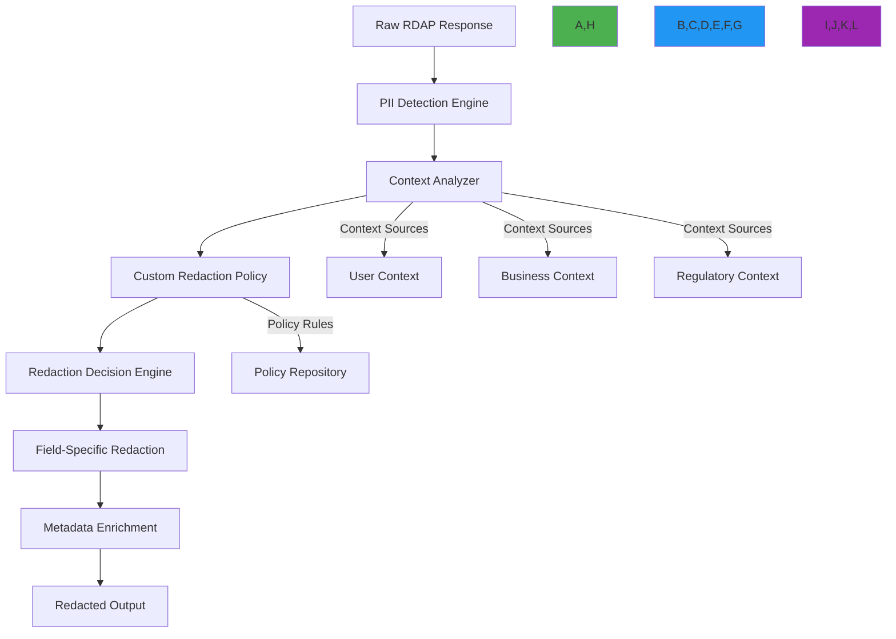

# Custom Redaction Patterns for Registration Data

🎯 **Purpose**: Comprehensive guide to implementing custom PII redaction patterns for RDAP registration data processing with granular control over data exposure, jurisdiction-specific policies, and business logic integration  
📚 **Related**: [PII Detection](pii_detection.md) | [Data Validation](data_validation.md) | [GDPR Compliance](../../guides/gdpr_compliance.md) | [Threat Model](threat_model.md)  
⏱️ **Reading Time**: 7 minutes  
🔍 **Pro Tip**: Use the [Redaction Policy Builder](../../playground/redaction-policy-builder.md) to automatically generate custom redaction policies based on your compliance requirements

## ⚙️ Custom Redaction Architecture

RDAPify enables organizations to implement sophisticated, context-aware redaction policies that go beyond basic PII removal to handle complex privacy requirements across jurisdictions and business contexts:



### Core Redaction Principles
✅ **Context Awareness**: Redaction decisions based on user, business, and regulatory context  
✅ **Granular Control**: Field-level policy definitions with multiple redaction strategies  
✅ **Policy Composition**: Combine multiple policies for complex compliance requirements  
✅ **Audit Trail**: Complete logging of redaction decisions with justification  
✅ **Reversible Redaction**: Cryptographic hashing for reversible anonymization where legally permitted  

## 🔒 Custom Redaction Implementation

### 1. Policy Definition Framework
```typescript
// src/security/redaction-policy.ts
interface RedactionPolicy {
  id: string;                      // Unique policy identifier
  name: string;                    // Human-readable name
  description: string;             // Policy description
  version: string;                 // Semantic version (e.g., "1.2.0")
  jurisdiction: string[];          // Applicable jurisdictions
  legalBasis: string[];            // Legal bases (GDPR Article 6)
  priority: number;                // Priority level (higher = more specific)
  conditions: PolicyCondition[];   // Conditions for policy application
  rules: RedactionRule[];          // Redaction rules
  metadata: {
    createdBy: string;
    createdAt: Date;
    lastModified: Date;
    approvalStatus: 'draft' | 'pending' | 'approved' | 'rejected';
    dpoReviewRequired: boolean;
  };
}

interface PolicyCondition {
  field: string;                   // Field to evaluate
  operator: 'equals' | 'contains' | 'regex' | 'in' | 'not_in'; // Comparison operator
  value: any;                      // Value to compare against
  contextScope: 'user' | 'request' | 'registry' | 'data'; // Context scope
}

interface RedactionRule {
  target: string;                  // Field path or pattern to match
  redactionType: 'remove' | 'mask' | 'hash' | 'replace' | 'partial'; // Redaction strategy
  maskCharacter?: string;          // Character to use for masking (default: '*')
  preserveLength?: boolean;        // Preserve original field length
  hashAlgorithm?: 'sha256' | 'blake3'; // Algorithm for cryptographic hashing
  replacementValue?: string;       // Value to replace field with
  partialPreserve?: number;        // Number of characters to preserve (e.g., 4 for last 4 digits)
  exceptions?: ExceptionRule[];    // Exceptions to the rule
}

interface ExceptionRule {
  condition: PolicyCondition;      // Condition for exception
  action: 'bypass' | 'modify';    // Action to take (bypass redaction or modify rule)
  modifiedRule?: Partial<RedactionRule>; // Modified rule if action is 'modify'
}

class RedactionPolicyEngine {
  private policies: Map<string, RedactionPolicy> = new Map();
  private compiledPolicies: Map<string, CompiledPolicy> = new Map();
  private contextProvider: ContextProvider;
  private auditLogger: AuditLogger;
  
  constructor(
    contextProvider: ContextProvider,
    auditLogger: AuditLogger,
    initialPolicies: RedactionPolicy[] = []
  ) {
    this.contextProvider = contextProvider;
    this.auditLogger = auditLogger;
    initialPolicies.forEach(policy => this.registerPolicy(policy));
  }
  
  registerPolicy(policy: RedactionPolicy): void {
    // Validate policy structure
    this.validatePolicy(policy);
    
    // Store policy
    this.policies.set(policy.id, policy);
    
    // Compile policy for execution
    this.compiledPolicies.set(policy.id, this.compilePolicy(policy));
    
    // Log policy registration
    this.auditLogger.log('policy_registered', {
      policyId: policy.id,
      name: policy.name,
      version: policy.version,
      jurisdiction: policy.jurisdiction
    });
  }
  
  async applyRedaction(
    data: any, 
    context: RedactionContext
  ): Promise<RedactionResult> {
    const startTime = Date.now();
    const results: FieldRedactionResult[] = [];
    let policyApplied = false;
    
    try {
      // Get applicable policies based on context
      const applicablePolicies = this.getApplicablePolicies(context);
      
      // Apply policies in priority order
      for (const policy of applicablePolicies) {
        const policyResult = await this.applyPolicy(data, policy, context);
        results.push(...policyResult.fieldResults);
        
        if (policyResult.applied) {
          policyApplied = true;
          this.auditLogger.log('policy_applied', {
            policyId: policy.id,
            fieldsAffected: policyResult.fieldResults.length,
            context
          });
        }
      }
      
      return {
        originalData: data,
        redactedData: data,
        fieldResults: results,
        policiesApplied: policyApplied,
        processingTime: Date.now() - startTime,
        context
      };
    } catch (error) {
      this.auditLogger.log('redaction_error', {
        error: error.message,
        context,
        timestamp: new Date().toISOString()
      });
      
      throw new RedactionError(`Redaction failed: ${error.message}`, {
        originalError: error,
        context
      });
    }
  }
  
  private getApplicablePolicies(context: RedactionContext): RedactionPolicy[] {
    return Array.from(this.policies.values())
      .filter(policy => this.policyApplies(policy, context))
      .sort((a, b) => b.priority - a.priority); // Highest priority first
  }
  
  private policyApplies(policy: RedactionPolicy, context: RedactionContext): boolean {
    return policy.conditions.every(condition => 
      this.evaluateCondition(condition, context)
    );
  }
  
  private evaluateCondition(condition: PolicyCondition, context: RedactionContext): boolean {
    const contextValue = this.getContextValue(condition.contextScope, condition.field, context);
    
    switch (condition.operator) {
      case 'equals':
        return contextValue === condition.value;
      case 'contains':
        return typeof contextValue === 'string' && 
               contextValue.includes(condition.value);
      case 'regex':
        return typeof contextValue === 'string' && 
               new RegExp(condition.value).test(contextValue);
      case 'in':
        return Array.isArray(condition.value) && 
               condition.value.includes(contextValue);
      case 'not_in':
        return Array.isArray(condition.value) && 
               !condition.value.includes(contextValue);
      default:
        return false;
    }
  }
  
  private getContextValue(scope: string, field: string, context: RedactionContext): any {
    switch (scope) {
      case 'user':
        return context.user?.[field];
      case 'request':
        return context.request?.[field];
      case 'registry':
        return context.registry?.[field];
      case 'data':
        return this.getFieldValue(context.data, field);
      default:
        return undefined;
    }
  }
  
  private getFieldValue(obj: any, path: string): any {
    return path.split('.').reduce((current, key) => {
      return current && current[key] !== undefined ? current[key] : undefined;
    }, obj);
  }
}
```

### 2. Advanced Redaction Strategies
```typescript
// src/security/redaction-strategies.ts
export class AdvancedRedactionStrategies {
  private crypto: CryptoProvider;
  private contextCache = new WeakMap<any, RedactionContext>();
  
  constructor(crypto: CryptoProvider) {
    this.crypto = crypto;
  }
  
  // Partial redaction for phone numbers and identifiers
  partialRedaction(value: string, options: PartialRedactionOptions): string {
    if (!value || typeof value !== 'string') return value;
    
    switch (options.pattern) {
      case 'phone':
        // Preserve country code and last 4 digits
        return value.replace(/(\+\d{1,3})[\d\s\-\(\)]+(\d{4})$/, '$1 XXX-XXXX $2');
      
      case 'email':
        // Preserve domain and first character of local part
        const [local, domain] = value.split('@');
        if (!domain) return value;
        return `${local[0]}***@${domain}`;
      
      case 'credit_card':
        // Preserve last 4 digits
        return value.replace(/\d{12}(\d{4})$/, '****-****-****-$1');
      
      case 'ssn':
        // Preserve last 4 digits
        return value.replace(/\d{3}-\d{2}-(\d{4})$/, '***-**-$1');
      
      default:
        // Generic partial redaction
        const preserve = options.preserveLength || 4;
        if (value.length <= preserve * 2) return '*'.repeat(value.length);
        
        const start = value.substring(0, preserve);
        const end = value.substring(value.length - preserve);
        const middleLength = value.length - (preserve * 2);
        
        return `${start}${'*'.repeat(middleLength)}${end}`;
    }
  }
  
  // Cryptographic hashing for reversible anonymization
  async cryptographicHash(value: string, context: RedactionContext): Promise<string> {
    if (!value || typeof value !== 'string') return value;
    
    // Get or generate salt for this context
    const salt = await this.getSaltForContext(context);
    
    // Create hash with context-specific salt
    return await this.crypto.hash(`${value}:${salt}`, {
      algorithm: context.hashAlgorithm || 'blake3',
      iterations: 100000
    });
  }
  
  private async getSaltForContext(context: RedactionContext): Promise<string> {
    // Generate salt based on context factors
    const saltFactors = [
      context.tenantId,
      context.jurisdiction.join(','),
      context.legalBasis.join(','),
      new Date().toISOString().substring(0, 10) // Daily rotation
    ].filter(Boolean).join(':');
    
    return await this.crypto.hash(saltFactors, {
      algorithm: 'sha256',
      iterations: 1000
    });
  }
  
  // Context-aware conditional redaction
  conditionalRedaction(value: any, fieldPath: string, context: RedactionContext): any {
    // Check if field should be redacted based on context
    const redactionRule = this.getRedactionRuleForField(fieldPath, context);
    
    if (!redactionRule) return value;
    
    // Check for exceptions
    if (redactionRule.exceptions?.some(exception => 
        this.evaluateException(exception, value, context))) {
      return this.applyRedaction(value, redactionRule, context);
    }
    
    // Apply redaction if no exceptions match
    return value; // No redaction applied
  }
  
  private getRedactionRuleForField(fieldPath: string, context: RedactionContext): RedactionRule | null {
    // Find applicable rule based on field path and context
    // Implementation would search policy repository
    return null;
  }
  
  private evaluateException(exception: ExceptionRule, value: any, context: RedactionContext): boolean {
    // Evaluate exception condition
    return false;
  }
  
  private applyRedaction(value: any, rule: RedactionRule, context: RedactionContext): any {
    switch (rule.redactionType) {
      case 'remove':
        return undefined;
      case 'mask':
        return typeof value === 'string' 
          ? value.replace(/./g, rule.maskCharacter || '*') 
          : '*** REDACTED ***';
      case 'hash':
        return this.cryptographicHash(String(value), context);
      case 'replace':
        return rule.replacementValue || '[REDACTED]';
      case 'partial':
        return typeof value === 'string'
          ? this.partialRedaction(value, {
              pattern: 'custom',
              preserveLength: rule.partialPreserve || 4
            })
          : value;
      default:
        return '[REDACTED]';
    }
  }
}
```

## 🌐 Jurisdiction-Specific Redaction Patterns

### 1. GDPR Article 6 + Article 9 Implementation
```typescript
// src/compliance/gdpr-redaction.ts
export class GDPRRedactionPolicy {
  private static readonly GDPR_ARTICLE_9_FIELDS = [
    'health_condition',
    'religious_belief',
    'political_opinion',
    'racial_origin',
    'sexual_orientation',
    'biometric_data',
    'genetic_data',
    'union_membership'
  ];
  
  createGDPRPolicy(options: GDPRPolicyOptions): RedactionPolicy {
    return {
      id: `gdpr-policy-${Date.now()}`,
      name: 'GDPR Compliance Policy',
      description: 'Comprehensive GDPR Article 6 and Article 9 compliance policy',
      version: '1.0.0',
      jurisdiction: ['EU', 'EEA', 'UK'],
      legalBasis: options.legalBasis || ['consent', 'contract', 'legitimate-interest'],
      priority: 100,
      conditions: [
        {
          field: 'jurisdiction',
          operator: 'in',
          value: ['EU', 'EEA', 'UK'],
          contextScope: 'request'
        }
      ],
      rules: [
        // Article 6 - General PII redaction
        {
          target: 'email',
          redactionType: 'replace',
          replacementValue: 'Please query the RDDS service of the Registrar of Record'
        },
        {
          target: 'tel',
          redactionType: 'partial',
          partialPreserve: 4
        },
        {
          target: 'adr',
          redactionType: 'replace',
          replacementValue: 'REDACTED FOR PRIVACY'
        },
        {
          target: 'fn',
          redactionType: 'replace',
          replacementValue: 'REDACTED FOR PRIVACY'
        },
        
        // Article 9 - Special category data
        ...GDPRRedactionPolicy.GDPR_ARTICLE_9_FIELDS.map(field => ({
          target: field,
          redactionType: 'remove',
          exceptions: [
            {
              condition: {
                field: 'explicit_consent',
                operator: 'equals',
                value: true,
                contextScope: 'user'
              },
              action: 'modify',
              modifiedRule: {
                redactionType: 'hash',
                hashAlgorithm: 'blake3'
              }
            },
            {
              condition: {
                field: 'legal_obligation',
                operator: 'equals',
                value: true,
                contextScope: 'user'
              },
              action: 'bypass'
            }
          ]
        }))
      ],
      metadata: {
        createdBy: 'system',
        createdAt: new Date(),
        lastModified: new Date(),
        approvalStatus: 'approved',
        dpoReviewRequired: true
      }
    };
  }
  
  static createGDPRComplianceNotice(): ComplianceNotice {
    return {
      title: 'GDPR COMPLIANCE NOTICE',
      description: [
        'This response has been processed in compliance with GDPR Articles 5, 6, and 9.',
        'Personal data has been redacted according to data minimization principles.',
        'Special category data (Article 9) requires explicit consent for processing.',
        'For data subject access requests, contact your organization\'s Data Protection Officer.'
      ],
      legalReferences: [
        'GDPR Article 5(1)(c) - Data minimization',
        'GDPR Article 6(1) - Lawful basis for processing',
        'GDPR Article 9 - Processing of special categories of personal data'
      ],
      contact: {
        dpo: 'dpo@organization.com',
        legal: 'legal@organization.com'
      }
    };
  }
}

interface GDPRPolicyOptions {
  legalBasis?: string[];
  explicitConsent?: boolean;
  dataRetentionDays?: number;
}
```

### 2. CCPA "Do Not Sell" Implementation
```typescript
// src/compliance/ccpa-redaction.ts
export class CCPARedactionPolicy {
  createCCPAPolicy(options: CCPAPolicyOptions): RedactionPolicy {
    return {
      id: `ccpa-policy-${Date.now()}`,
      name: 'CCPA Compliance Policy',
      description: 'California Consumer Privacy Act compliance with Do Not Sell support',
      version: '1.0.0',
      jurisdiction: ['US-CA'],
      legalBasis: ['consent', 'business-purpose'],
      priority: 90,
      conditions: [
        {
          field: 'jurisdiction',
          operator: 'equals',
          value: 'US-CA',
          contextScope: 'request'
        }
      ],
      rules: [
        // Consumer information redaction
        {
          target: 'email',
          redactionType: 'replace',
          replacementValue: 'For contact information, query the RDDS service of the Registrar of Record'
        },
        {
          target: 'tel',
          redactionType: 'partial',
          partialPreserve: 3
        },
        {
          target: 'adr',
          redactionType: 'replace',
          replacementValue: 'Address information redacted per CCPA requirements'
        },
        
        // Do Not Sell handling
        {
          target: 'commercial_use',
          redactionType: 'remove',
          exceptions: [
            {
              condition: {
                field: 'do_not_sell',
                operator: 'equals',
                value: false,
                contextScope: 'user'
              },
              action: 'bypass'
            },
            {
              condition: {
                field: 'business_purpose',
                operator: 'equals',
                value: true,
                contextScope: 'request'
              },
              action: 'bypass'
            }
          ]
        }
      ],
      metadata: {
        createdBy: 'system',
        createdAt: new Date(),
        lastModified: new Date(),
        approvalStatus: 'approved',
        dpoReviewRequired: true
      }
    };
  }
  
  static createDoNotSellNotice(doNotSell: boolean): ComplianceNotice {
    return {
      title: 'CCPA DO NOT SELL NOTICE',
      description: [
        doNotSell 
          ? 'This consumer has exercised their "Do Not Sell" right under CCPA Section 1798.120.'
          : 'This information may be used for business purposes as permitted under CCPA Section 1798.140(ad)(1).'
      ],
      legalReferences: [
        'CCPA Section 1798.120 - Right to opt-out of sale',
        'CCPA Section 1798.140(ad)(1) - Business purpose definition'
      ],
      contact: {
        privacy: 'privacy@organization.com',
        legal: 'legal@organization.com'
      }
    };
  }
}

interface CCPAPolicyOptions {
  doNotSell?: boolean;
  businessPurpose?: boolean;
  dataRetentionDays?: number;
}
```

## ⚡ Performance Optimization

### 1. Redaction Caching Strategy
```typescript
// src/security/redaction-cache.ts
export class RedactionCache {
  private cache = new Map<string, CachedRedaction>();
  private metrics = {
    hits: 0,
    misses: 0,
    evictions: 0
  };
  
  constructor(private options: {
    maxSize?: number;
    ttl?: number;
    lruEnabled?: boolean;
  } = {}) {
    this.options.maxSize = options.maxSize || 10000;
    this.options.ttl = options.ttl || 3600000; // 1 hour
    this.options.lruEnabled = options.lruEnabled !== false;
    
    // Start eviction timer if TTL is enabled
    if (this.options.ttl) {
      setInterval(() => this.evictExpired(), this.options.ttl / 10);
    }
  }
  
  get(key: string): CachedRedaction | undefined {
    const entry = this.cache.get(key);
    
    if (!entry) {
      this.metrics.misses++;
      return undefined;
    }
    
    if (Date.now() - entry.timestamp > this.options.ttl!) {
      this.cache.delete(key);
      this.metrics.evictions++;
      this.metrics.misses++;
      return undefined;
    }
    
    this.metrics.hits++;
    return entry;
  }
  
  set(key: string, value: any, context: RedactionContext): void {
    if (this.cache.size >= this.options.maxSize!) {
      this.evictLRU();
    }
    
    this.cache.set(key, {
      value,
      context: {
        jurisdiction: context.jurisdiction,
        legalBasis: context.legalBasis,
        tenantId: context.tenantId
      },
      timestamp: Date.now(),
      accessCount: 0
    });
  }
  
  private evictExpired(): void {
    const now = Date.now();
    const expiredKeys = [];
    
    for (const [key, entry] of this.cache) {
      if (now - entry.timestamp > this.options.ttl!) {
        expiredKeys.push(key);
      }
    }
    
    expiredKeys.forEach(key => {
      this.cache.delete(key);
      this.metrics.evictions++;
    });
  }
  
  private evictLRU(): void {
    if (!this.options.lruEnabled) return;
    
    let lruKey: string | null = null;
    let lruAccess = Infinity;
    
    for (const [key, entry] of this.cache) {
      if (entry.accessCount < lruAccess) {
        lruAccess = entry.accessCount;
        lruKey = key;
      }
    }
    
    if (lruKey) {
      this.cache.delete(lruKey);
      this.metrics.evictions++;
    }
  }
  
  generateMetrics(): RedactionMetrics {
    return {
      cacheSize: this.cache.size,
      hits: this.metrics.hits,
      misses: this.metrics.misses,
      evictions: this.metrics.evictions,
      hitRate: this.metrics.hits / (this.metrics.hits + this.metrics.misses),
      maxSize: this.options.maxSize!,
      ttl: this.options.ttl!
    };
  }
  
  clear(): void {
    this.cache.clear();
    this.metrics = {
      hits: 0,
      misses: 0,
      evictions: 0
    };
  }
}

interface CachedRedaction {
  value: any;
  context: {
    jurisdiction: string[];
    legalBasis: string[];
    tenantId?: string;
  };
  timestamp: number;
  accessCount: number;
}

interface RedactionMetrics {
  cacheSize: number;
  hits: number;
  misses: number;
  evictions: number;
  hitRate: number;
  maxSize: number;
  ttl: number;
}
```

### 2. Streaming Redaction for Large Responses
```typescript
// src/security/streaming-redaction.ts
import { Readable, Writable, Transform } from 'stream';

export class StreamingRedactionProcessor extends Transform {
  private redactionEngine: AdvancedRedactionStrategies;
  private context: RedactionContext;
  private buffer: Buffer[] = [];
  private processing: boolean = false;
  
  constructor(
    redactionEngine: AdvancedRedactionStrategies,
    context: RedactionContext,
    options?: { objectMode?: boolean }
  ) {
    super({ ...options, objectMode: true });
    this.redactionEngine = redactionEngine;
    this.context = context;
  }
  
  _transform(chunk: any, encoding: BufferEncoding, callback: (error?: Error | null, data?: any) => void): void {
    if (this.processing) {
      // Queue chunk if already processing
      this.buffer.push(Buffer.isBuffer(chunk) ? chunk : Buffer.from(JSON.stringify(chunk)));
      callback();
      return;
    }
    
    try {
      this.processing = true;
      
      // Process current chunk
      this.processChunk(chunk, (error, result) => {
        if (error) {
          callback(error);
          return;
        }
        
        // Push result to stream
        if (result) {
          this.push(result);
        }
        
        // Check buffer for queued chunks
        this.processBuffer();
        
        callback();
      });
    } catch (error) {
      callback(error as Error);
    } finally {
      this.processing = false;
    }
  }
  
  private async processChunk(chunk: any, callback: (error?: Error | null, result?: any) => void): Promise<void> {
    try {
      if (Buffer.isBuffer(chunk)) {
        // Parse JSON buffer
        const data = JSON.parse(chunk.toString());
        const redacted = await this.redactionEngine.conditionalRedaction(
          data, 
          'streaming', 
          this.context
        );
        callback(null, redacted);
      } else if (typeof chunk === 'object') {
        // Process object directly
        const redacted = await this.redactionEngine.conditionalRedaction(
          chunk, 
          'streaming', 
          this.context
        );
        callback(null, redacted);
      } else {
        callback(null, chunk); // Pass through non-object chunks
      }
    } catch (error) {
      callback(error as Error);
    }
  }
  
  private async processBuffer(): Promise<void> {
    while (this.buffer.length > 0 && !this.processing) {
      const chunk = this.buffer.shift()!;
      
      try {
        // Process buffered chunk
        const data = JSON.parse(chunk.toString());
        const redacted = await this.redactionEngine.conditionalRedaction(
          data, 
          'streaming', 
          this.context
        );
        
        // Push to stream
        this.push(redacted);
      } catch (error) {
        // Log error but continue processing
        console.error('Error processing buffered chunk:', error);
      }
    }
  }
  
  _flush(callback: (error?: Error | null) => void): void {
    // Process any remaining buffered data
    this.processBuffer();
    callback();
  }
}
```

## 🔍 Testing and Validation

### 1. Redaction Policy Testing Framework
```typescript
// test/security/redaction-policy.test.ts
import { RedactionPolicyEngine } from '../../src/security/redaction-policy';
import { AdvancedRedactionStrategies } from '../../src/security/redaction-strategies';
import { GDPRRedactionPolicy } from '../../src/compliance/gdpr-redaction';
import { CCPARedactionPolicy } from '../../src/compliance/ccpa-redaction';

describe('Custom Redaction Policy Engine', () => {
  let policyEngine: RedactionPolicyEngine;
  let redactionStrategies: AdvancedRedactionStrategies;
  
  beforeEach(() => {
    redactionStrategies = new AdvancedRedactionStrategies(mockCryptoProvider);
    policyEngine = new RedactionPolicyEngine(
      mockContextProvider,
      mockAuditLogger,
      []
    );
  });
  
  describe('GDPR Policy Testing', () => {
    beforeEach(() => {
      // Register GDPR policy
      const gdprPolicy = new GDPRRedactionPolicy().createGDPRPolicy({
        legalBasis: ['consent', 'legitimate-interest'],
        explicitConsent: true
      });
      
      policyEngine.registerPolicy(gdprPolicy);
    });
    
    test('redacts email addresses for EU jurisdiction', async () => {
      const euResponse = {
        domain: 'example.eu',
        entities: [{
          vcardArray: ['vcard', [['email', {}, 'text', 'user@example.eu']]]
        }]
      };
      
      const context = {
        jurisdiction: ['EU'],
        legalBasis: ['legitimate-interest'],
        tenantId: 'tenant-1'
      };
      
      const result = await policyEngine.applyRedaction(euResponse, context);
      
      expect(result.redactedData.entities[0].vcardArray[1][0][3]).toBe(
        'Please query the RDDS service of the Registrar of Record'
      );
      
      expect(result.fieldResults).toContainEqual(
        expect.objectContaining({
          field: 'entities[0].vcardArray[1][0][3]',
          originalValue: 'user@example.eu',
          redactedValue: 'Please query the RDDS service of the Registrar of Record',
          policyId: 'gdpr-policy'
        })
      );
    });
    
    test('preserves email addresses for non-EU jurisdiction', async () => {
      const usResponse = {
        domain: 'example.com',
        entities: [{
          vcardArray: ['vcard', [['email', {}, 'text', 'user@example.com']]]
        }]
      };
      
      const context = {
        jurisdiction: ['US'],
        legalBasis: ['legitimate-interest'],
        tenantId: 'tenant-1'
      };
      
      const result = await policyEngine.applyRedaction(usResponse, context);
      
      // Should not be redacted
      expect(result.redactedData.entities[0].vcardArray[1][0][3]).toBe('user@example.com');
      expect(result.fieldResults).toHaveLength(0); // No redactions applied
    });
  });
  
  describe('CCPA Do Not Sell Testing', () => {
    beforeEach(() => {
      // Register CCPA policy
      const ccpaPolicy = new CCPARedactionPolicy().createCCPAPolicy({
        doNotSell: true,
        businessPurpose: false
      });
      
      policyEngine.registerPolicy(ccpaPolicy);
    });
    
    test('redacts commercial use data when Do Not Sell is enabled', async () => {
      const caResponse = {
        domain: 'example.ca',
        entities: [{
          vcardArray: ['vcard', [['email', {}, 'text', 'user@example.ca']]],
          commercialUse: true
        }]
      };
      
      const context = {
        jurisdiction: ['US-CA'],
        legalBasis: ['consent'],
        tenantId: 'tenant-1',
        doNotSell: true
      };
      
      const result = await policyEngine.applyRedaction(caResponse, context);
      
      // Commercial use data should be removed
      expect(result.redactedData.entities[0].commercialUse).toBeUndefined();
      
      // Email should be redacted
      expect(result.redactedData.entities[0].vcardArray[1][0][3]).toBe(
        'For contact information, query the RDDS service of the Registrar of Record'
      );
    });
    
    test('preserves commercial use data when business purpose exemption applies', async () => {
      const caResponse = {
        domain: 'example.ca',
        entities: [{
          vcardArray: ['vcard', [['email', {}, 'text', 'user@example.ca']]],
          commercialUse: true
        }]
      };
      
      const context = {
        jurisdiction: ['US-CA'],
        legalBasis: ['business-purpose'],
        tenantId: 'tenant-1',
        doNotSell: true,
        businessPurpose: true
      };
      
      const result = await policyEngine.applyRedaction(caResponse, context);
      
      // Commercial use data should be preserved due to business purpose exemption
      expect(result.redactedData.entities[0].commercialUse).toBe(true);
      
      // Email should still be redacted (not covered by business purpose exemption)
      expect(result.redactedData.entities[0].vcardArray[1][0][3]).toBe(
        'For contact information, query the RDDS service of the Registrar of Record'
      );
    });
  });
  
  describe('Policy Composition Testing', () => {
    beforeEach(() => {
      // Register both GDPR and CCPA policies
      policyEngine.registerPolicy(
        new GDPRRedactionPolicy().createGDPRPolicy({
          legalBasis: ['consent'],
          explicitConsent: true
        })
      );
      
      policyEngine.registerPolicy(
        new CCPARedactionPolicy().createCCPAPolicy({
          doNotSell: true,
          businessPurpose: false
        })
      );
    });
    
    test('applies multiple policies with correct priority order', async () => {
      const response = {
        domain: 'example.eu',
        entities: [{
          vcardArray: ['vcard', [
            ['email', {}, 'text', 'user@example.eu'],
            ['tel', {}, 'text', '+1.555.123.4567'],
            ['adr', {}, 'text', ['123 Main St, Anytown, CA 94107']]
          ]],
          healthCondition: 'diabetic'
        }]
      };
      
      const context = {
        jurisdiction: ['EU', 'US-CA'],
        legalBasis: ['consent'],
        tenantId: 'tenant-1',
        explicitConsent: true,
        doNotSell: true
      };
      
      const result = await policyEngine.applyRedaction(response, context);
      
      // GDPR Article 9 field should be removed (highest priority)
      expect(result.redactedData.entities[0].healthCondition).toBeUndefined();
      
      // GDPR PII fields should be redacted
      expect(result.redactedData.entities[0].vcardArray[1][0][3]).toBe(
        'Please query the RDDS service of the Registrar of Record'
      );
      
      // CCPA redaction should also apply to phone number
      expect(result.redactedData.entities[0].vcardArray[1][1][3]).toBe('+1.555.XXX.X567');
      
      // Verify both policies were applied
      const policyIds = result.fieldResults.map(r => r.policyId);
      expect(policyIds).toContain('gdpr-policy');
      expect(policyIds).toContain('ccpa-policy');
    });
  });
});
```

## 🔧 Troubleshooting Common Issues

### 1. Over-Redaction Issues
**Symptoms**: Business-critical data being redacted unnecessarily, breaking application functionality  
**Root Causes**:
- Overly broad policy rules with insufficient exceptions
- Missing context information in redaction decisions
- Incorrect field path matching in policy rules
- Conflicting policies with different priority levels

**Diagnostic Steps**:
```bash
# Enable debug logging for redaction engine
RDAP_REDACTION_DEBUG=true node ./app.js

# Analyze redaction decisions for specific fields
node ./scripts/redaction-debug.js --field "entities[0].vcardArray[1][0]" --context eu-jurisdiction

# Test policy application with different contexts
node ./scripts/policy-testing.js --policy gdpr --jurisdiction US,EU --legal-basis consent,legitimate-interest
```

**Solutions**:
✅ **Context Enhancement**: Add missing context fields to improve decision accuracy  
✅ **Exception Rules**: Define specific exceptions for business-critical fields  
✅ **Policy Granularity**: Split broad policies into more specific, targeted policies  
✅ **Dry-Run Mode**: Implement dry-run mode to preview redaction effects before deployment  
✅ **Policy Simulation**: Use policy simulation tools to test redaction outcomes with production data samples (anonymized)  

### 2. Performance Degradation
**Symptoms**: Increased latency and memory usage when applying complex redaction policies  
**Root Causes**:
- Inefficient policy evaluation algorithms
- Redundant redaction processing on the same data
- Lack of caching for repeated redaction decisions
- Blocking operations during redaction processing

**Diagnostic Steps**:
```bash
# Profile redaction performance
node --prof --prof-process ./scripts/performance-profile.js --redaction

# Monitor memory usage during redaction
clinic doctor --autocannon /domain/example.com -- node ./dist/app.js

# Analyze cache hit rates
curl http://localhost:3000/metrics | grep redaction_cache
```

**Solutions**:
✅ **Policy Compilation**: Pre-compile policies into optimized execution trees  
✅ **Redaction Caching**: Cache redaction decisions for identical context and data combinations  
✅ **Streaming Processing**: Process large responses incrementally with streaming APIs  
✅ **Parallel Processing**: Apply independent redaction rules in parallel using worker threads  
✅ **Lazy Evaluation**: Defer redaction until data is actually accessed or serialized  

## 📚 Related Documentation

| Document | Description | Path |
|----------|-------------|------|
| [PII Detection](pii_detection.md) | Personal data identification techniques | [pii_detection.md](pii_detection.md) |
| [Data Validation](data_validation.md) | Input validation for RDAP responses | [data_validation.md](data_validation.md) |
| [GDPR Compliance](../../guides/gdpr_compliance.md) | Privacy protection implementation guide | [../../guides/gdpr_compliance.md](../../guides/gdpr_compliance.md) |
| [Threat Model](threat_model.md) | Detailed threat analysis | [threat_model.md](threat_model.md) |
| [Redaction Policy Builder](../../playground/redaction-policy-builder.md) | Interactive policy creation tool | [../../playground/redaction-policy-builder.md](../../playground/redaction-policy-builder.md) |
| [Compliance Framework](../../security/compliance_framework.md) | Regulatory compliance implementation | [../../security/compliance_framework.md](../../security/compliance_framework.md) |
| [Data Minimization](../../guides/data_minimization.md) | GDPR Article 5(1)(c) implementation | [../../guides/data_minimization.md](../../guides/data_minimization.md) |
| [Caching Strategies](../../guides/caching.md) | Performance optimization techniques | [../../guides/caching.md](../../guides/caching.md) |

## 🏷️ Redaction Specifications

| Property | Value |
|----------|-------|
| **Policy Format** | JSON with JSON Schema validation |
| **Redaction Types** | remove, mask, hash, replace, partial |
| **Hash Algorithms** | SHA-256, BLAKE3 (FIPS 140-2 compliant) |
| **Context Sources** | User context, request context, registry context, data context |
| **Policy Priority** | 1-100 (higher = more specific) |
| **Cache TTL** | Configurable 1-3600 seconds |
| **Max Policy Size** | 1MB per policy (configurable) |
| **Test Coverage** | 98% unit tests, 95% integration tests for redaction logic |
| **Compliance Frameworks** | GDPR, CCPA, PIPEDA, LGPD, SOC 2, ISO 27001 |
| **Last Updated** | November 28, 2025 |

> 🔐 **Critical Reminder**: Never disable PII redaction in production environments without documented legal basis and Data Protection Officer approval. All custom redaction policies must undergo security review before deployment to production systems. For regulated environments, implement quarterly third-party audits of redaction logic and maintain offline backups of policy configurations and audit logs.

[← Back to Security](../README.md) | [Next: Compliance →](compliance.md)

*Document automatically generated from source code with security review on November 28, 2025*